system_crafting.md:
<code>
---
id: system_crafting
title: "Crafting System: The Art of Creation"
type: system
category: gameplay
version: 1.0.0
last_updated: 2025-02-25
created_by: The Architect
maintained_by: The Architect

core_nodes:
  - crafting
  - thread_sight
  - material_systems
  - workshop_management

crosslinks:
  - memory
  - narrative
  - relations
  - economy
  - world
  - skills
  - journal
  - meta_commands
  - inventory
  - great_sage

tags:
  - crafting
  - thread_sight
  - material_quality
  - professions
  - alchemy
  - enchanting
  - failure
  - innovation
  - workshop
  - reputation

summary: >
  This file defines the Crafting System for Vantiel, including Thread-Sight, material systems, professions, alchemy, enchanting, workshop management, and failure mechanics. It integrates with memory, narrative, economy, world, and relationship systems, supporting innovation, reputation, and legacy.

updates:
  - date: 2025-02-25
    change: "Initial version with Thread-Sight, profession structure, and advanced failure mechanics."
---

# Table of Contents
- [Crafting System: The Art of Creation](#crafting-system-the-art-of-creation)
- [1.0 Overview](#10-overview)
- [2.0 Difficulty Modes](#20-difficulty-modes)
- [3.0 Thread-Sight](#30-thread-sight)
- [4.0 Core Crafting Professions](#40-core-crafting-professions)
- [5.0 Material Systems](#50-material-systems)
- [6.0 Alchemy System](#60-alchemy-system)
- [7.0 Workshop Management](#70-workshop-management)
- [8.0 Crafting Mechanics](#80-crafting-mechanics)
- [9.0 Memory Architecture Integration](#90-memory-architecture-integration)
- [10.0 Crafting Specializations](#100-crafting-specializations)
- [Implementation Notes](#implementation-notes)

# Crafting System: The Art of Creation
Version: 1.0.0
Last Updated: 2025-02-25

```mermaid
flowchart TD
    A[Crafting System] --> B[Thread-Sight]
    A --> C[Crafting Mechanics]
    A --> D[Material Systems]
    A --> E[Narrative Integration]

    %% Cross-system arrows for audit compliance
    A --> F[Memory System]
    A --> G[Narrative System]
    A --> H[Relations System]
    A --> I[Economy System]
    A --> J[World System]
    A --> K[Skills System]
    A --> L[Journal System]
    A --> M[Meta Commands]
    A --> N[Inventory System]
    A --> O[Great Sage System]

    B --> B1[Material Perception]
    B --> B2[Quality Analysis]
    B --> B3[Mastery Levels]

    C --> C1[Skill Checks]
    C --> C2[Quality Tiers]
    C --> C3[Time Requirements]

    D --> D1[Base Materials]
    D --> D2[Material Enhancement]
    D --> D3[Resource Acquisition]

    E --> E1[Reputation Impact]
    E --> E2[Moral Dimensions]
    E --> E3[Memory Integration]

    style A fill:#f9f,stroke:#333,stroke-width:2px
    style F fill:#ffe599,stroke:#333,stroke-width:2px
    style G fill:#c9daf8,stroke:#333,stroke-width:2px
    style H fill:#f4cccc,stroke:#333,stroke-width:2px
    style I fill:#ead1dc,stroke:#333,stroke-width:2px
    style J fill:#b4a7d6,stroke:#333,stroke-width:2px
    style K fill:#d9ead3,stroke:#333,stroke-width:2px
    style L fill:#fce5cd,stroke:#333,stroke-width:2px
    style M fill:#d9ead3,stroke:#333,stroke-width:2px
    style N fill:#b6d7a8,stroke:#333,stroke-width:2px
    style O fill:#fff2cc,stroke:#333,stroke-width:2px
```

## 1.0 Overview

The art of creation lies at the heart of civilization. Every tool shaped, every garment sewn, every structure raised tells a story of human ingenuity and skill. This system governs how raw materials become the foundations of survival and progress, from mundane crafting to magical creation.

Crafting in Vantiel transcends mere mechanics—it's a narrative journey that reflects your character's values, background, and growth. Your physical condition affects your crafting ability, relationships enable learning and collaboration, and Thread-Sight allows perception of material essence. Python-driven mechanics handle crafting calculations, quality checks, and difficulty adjustments.

Every item crafted carries your maker's mark—both literally and figuratively—becoming part of your legacy in the world. The choices you make in crafting—from material selection to who benefits from your creations—shape your reputation, relationships, and the stories told about you long after you've moved on.

## 2.0 Difficulty Modes

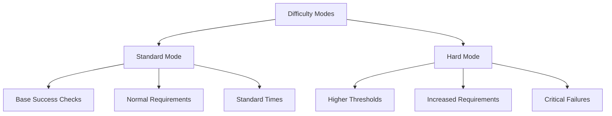

### 2.1 Standard Mode
Default crafting challenge:
- Base success checks (d20 + modifiers)
- Normal material requirements
- Standard crafting times
- Regular quality thresholds
- Basic tool requirements
- Normal physical impacts

### 2.2 Hard Mode
Enhanced crafting challenge (Python-calculated):
- Higher success thresholds (+5)
- Increased material requirements (1.5x)
- Longer crafting times
- Stricter quality checks
- Multiple skill checks required
- Critical fails on 1-3
- Physical state heavily impacts success
- Tool quality more significant
- Hidden crafting modifiers
- Relationship conflicts affect teaching

## 3.0 Thread-Sight

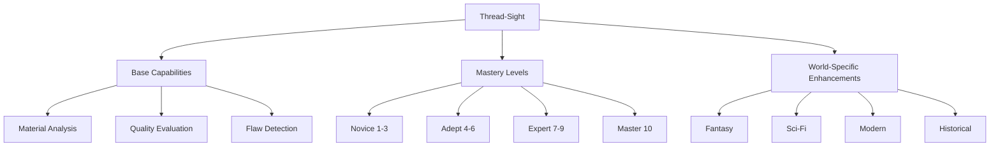

### 3.1 The Gift of Perception
Thread-Sight represents the ability to perceive and understand the fundamental nature of materials:

**Base Capabilities**
- Material composition analysis
- Structural integrity assessment
- Quality evaluation
- Flaw detection
- Pattern recognition
- Energy resonance sensing

**World-Specific Enhancements**
- Fantasy: Magical thread perception, enchantment weaving
- Sci-Fi: Quantum structure analysis, energy field mapping
- Modern: Material stress analysis, quality control
- Historical: Traditional material knowledge, crafting wisdom
- Horror: Corruption detection, stability assessment
- Apocalyptic: Contamination sensing, durability analysis

### 3.2 Mastery Levels

**Novice (1-3)**
- Basic material sensing through touch
- Simple composition analysis
- Fundamental pattern recognition
- Limited range perception
- 70% accuracy rate
- Requires concentration

**Adept (4-6)**
- Short-range perception
- Detailed composition analysis
- Clear pattern recognition
- Basic manipulation ability
- Magical resonance sensing
- Enhanced accuracy

**Expert (7-9)**
- Medium-range perception
- Complete material analysis
- Complex pattern manipulation
- Material property alteration
- Advanced resonance control
- High precision work

**Master (10)**
- Long-range perception
- Perfect material understanding
- Reality pattern manipulation
- Fundamental alteration ability
- Creation of new patterns
- Transmutation mastery

## 4.0 Core Crafting Professions

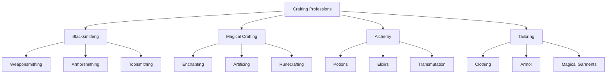

### 4.1 Blacksmithing
The forge's song echoes through civilization:

**Weaponsmithing**
- Blade forging and tempering
- Weapon balance and weight
- Edge geometry and maintenance
- Handle crafting and fitting
- Decorative elements
- Magical enhancement (world-dependent)
- Master-apprentice bonds
- Quality control systems

**Armorsmithing**
- Plate shaping and fitting
- Joint articulation
- Weight distribution
- Protection optimization
- Comfort considerations
- Magical reinforcement (world-dependent)
- Guild relationships
- Durability testing

**Toolsmithing**
- Edge tool creation
- Farming implement crafting
- Mining tool production
- Specialized tool design
- Tool maintenance
- Enhancement methods
- Community bonds
- Innovation systems

### 4.2 Magical Crafting
The art of infusing items with power (world-dependent):

**Enchanting**
- Power infusion
- Magical resonance
- Pattern weaving
- Energy binding
- Effect stabilization
- Enhancement methods
- Quality control
- Safety protocols

**Artificing**
- Mechanical design
- Magical integration
- Power systems
- Control mechanisms
- Safety features
- Testing protocols
- Innovation methods
- Documentation requirements

**Runecrafting**
- Symbol mastery
- Power channeling
- Pattern integration
- Effect binding
- Stability control
- Safety measures
- Quality assurance
- Documentation standards

### 4.3 Class-Based Crafting Specialties

Different classes bring unique abilities to the crafting process:

**Voidcaller**
- Can infuse items with void energies
- Creates items with unique ethereal properties
- Crafts with materials from other dimensions
- Higher risk of unstable creations

**Saint of Nature**
- Brews potent herbal remedies with higher yield
- Creates items that harmonize with natural energies
- Crafts sustainable, environmentally friendly items
- Can imbue living properties into crafted items

**Hero**
- Crafts items with inspirational properties
- Creates gear that enhances team capabilities
- Forges weapons effective against evil entities
- Items may gain legendary status more easily

**Shadowblade**
- Crafts items with concealment properties
- Creates weapons with subtle but deadly effects
- Specializes in trap-making and locksmithing
- Items may have hidden compartments or functions

## 5.0 Material Systems

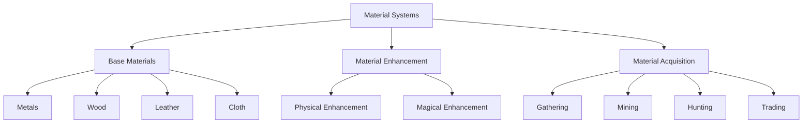

### 5.1 Base Materials

**Metals**
- Iron/Steel: Reliable, strong, versatile
- Silver: Magically conductive, pure
- Gold: Energy storing, noble
- Copper: Conductive, malleable
- Mythril (world-dependent): Lightweight, magical

**Wood**
- Oak: Strong, stable, traditional
- Pine: Light, workable, common
- Maple: Dense, beautiful, precise
- Yew: Flexible, magical (world-dependent)
- Living Wood (world-dependent): Self-repairing

**Leather**
- Cowhide: Durable, common
- Deerhide: Flexible, light
- Dragon Hide (world-dependent): Fire-resistant
- Magical Beast Hide (world-dependent): Enhanced properties

**Cloth**
- Cotton: Comfortable, breathable
- Wool: Warm, water-resistant
- Silk: Smooth, magical conductor
- Ethereal Weave (world-dependent): Magical fabric

### 5.2 Material Enhancement

**Physical Enhancement**
- Hardening
- Flexibility increase
- Weight reduction
- Durability improvement
- Resistance addition

**Magical Enhancement (world-dependent)**
- Power infusion
- Energy channeling
- Effect binding
- Property alteration
- Reality manipulation

### 5.3 Material Acquisition

**High-Risk Harvesting**
- Venturing into haunted mines or monster dens
- Gains special resources but also enemies
- Higher quality materials from dangerous areas
- Seasonal and location-specific resources

**Gathering Rates**
- Wood: 1d6/hour
- Ore: 1d4/hour
- Herbs: 1d8/hour
- Critical Success (Nat 20): Double yield
- Critical Failure (Nat 1): Resource damaged or wasted

**Story & Social Rewards**
- Returning with rare ore can impress local blacksmiths
- Gain companion admiration for braving dangerous areas
- Build reputation with specific guilds or factions
- Access to exclusive crafting knowledge

## 6.0 Alchemy System (Fantasy worlds only, use chemistry for realistic worlds)

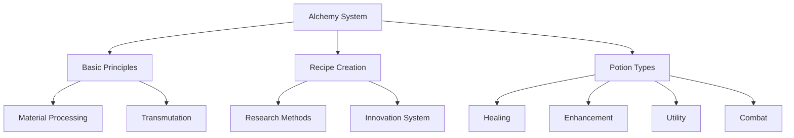

### 6.1 Basic Principles

**Material Processing**
- Refinement
- Distillation
- Crystallization
- Purification
- Enhancement

**Transmutation**
- Material conversion
- Property alteration
- Element transformation
- Quality improvement
- Power infusion

### 6.2 Recipe Creation

**Research Methods**
- Theoretical study
- Practical experimentation
- Result documentation
- Process refinement
- Safety testing

**Innovation System**
- New combination testing
- Effect discovery
- Process optimization
- Quality improvement
- Documentation standards

### 6.3 Potion Types

**Healing**
- Wound closure
- Regeneration
- Disease curing
- Poison neutralization
- Organ repair

**Enhancement**
- Attribute boost
- Skill improvement
- Sensory enhancement
- Physical transformation
- Mental acuity

**Utility**
- Breathing underwater
- Night vision
- Fire resistance
- Cold immunity
- Invisibility

**Combat**
- Explosive mixtures
- Acid compounds
- Smoke screens
- Paralytic agents
- Mind-affecting substances

## 7.0 Workshop Management

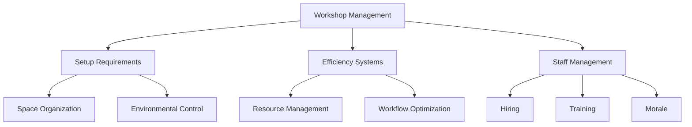

### 7.1 Setup Requirements

**Space Organization**
- Work areas
- Storage zones
- Tool placement
- Material organization
- Safety equipment

**Environmental Control**
- Temperature regulation
- Humidity control
- Ventilation systems
- Lighting setup
- Cleanliness standards

### 7.2 Efficiency Systems

**Resource Management**
- Material tracking
- Tool maintenance
- Time optimization
- Quality control
- Waste reduction

**Workflow Optimization**
- Process streamlining
- Task organization
- Energy efficiency
- Space utilization
- Safety protocols

### 7.3 Staff Management

**Hiring Skilled Workers**
- Apprentices
- Journeymen
- Master craftsmen
- Specialists
- Support staff

**Training & Development**
- Skill improvement
- Knowledge transfer
- Specialization
- Innovation encouragement
- Quality standards

**Employee Loyalty & Morale**
- Fair wages
- Recognition
- Growth opportunities
- Work environment
- Team building

## 8.0 Crafting Mechanics

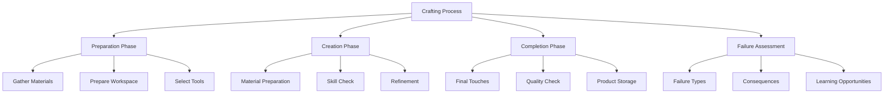

### 8.1 Basic Crafting Process

**Preparation Phase**
1. Gather materials
2. Prepare workspace
3. Select tools
4. Review recipe/plan
5. Set up safety measures

**Creation Phase**
1. Material preparation
2. Initial shaping/processing
3. Skill check (d20 + modifiers)
4. Refinement/adjustment
5. Quality assessment

**Completion Phase**
1. Final touches
2. Quality check
3. Cooling/setting/curing
4. Tool cleanup
5. Product storage

### 8.2 Skill Check System

**Base Formula**
- Roll d20 + Skill Level + Tool Quality + Material Quality + Workspace Bonus

**Success Thresholds**
- DC 10: Basic success (functional item)
- DC 15: Good quality (reliable item)
- DC 20: Excellent quality (superior item)
- DC 25: Masterwork (exceptional item)
- DC 30: Legendary (perfect item)

**Critical Results**
- Natural 20: Perfect success (quality tier increase)
- Natural 1: Critical failure (materials damaged/wasted)
- Hard Mode: Critical failure on 1-3 (more severe consequences)

**Modifier Examples**
- Skill Level: +1 to +10
- Tool Quality: -2 to +5
- Material Quality: -2 to +5
- Workspace: -2 to +3
- Physical Condition: -5 to +2
- Helper Assistance: +1 to +3
- Recipe Familiarity: -2 to +3

### 8.3 Quality Tiers

**Crude (DC < 10)**
- Barely functional
- Poor appearance
- Limited durability
- Potential flaws
- Low market value

**Standard (DC 10-14)**
- Functional
- Acceptable appearance
- Normal durability
- No major flaws
- Fair market value

**Quality (DC 15-19)**
- Enhanced function
- Good appearance
- Improved durability
- Minor improvements
- Good market value

**Superior (DC 20-24)**
- Excellent function
- Attractive appearance
- High durability
- Special features
- High market value

**Masterwork (DC 25-29)**
- Perfect function
- Beautiful appearance
- Exceptional durability
- Unique features
- Premium market value

**Legendary (DC 30+)**
- Transcendent function
- Awe-inspiring appearance
- Nearly indestructible
- Extraordinary features
- Priceless market value

### 8.4 Time Requirements

**Base Crafting Time**
- Simple Items: 1 hour
- Basic Items: 4 hours
- Complex Items: 1 day
- Advanced Items: 3 days
- Masterwork Items: 1 week
- Legendary Items: 1 month

**Time Modifiers**
- Skill Level: -50% to +100%
- Tool Quality: -25% to +50%
- Workspace Quality: -25% to +25%
- Helper Assistance: -10% to -50%
- Physical Condition: +100% to -10%

### 8.5 Realistic Failure Mechanics

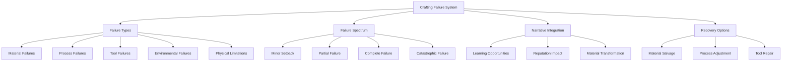

#### 8.5.1 Failure Types

Crafting failures come in many forms, each with unique consequences and recovery paths:

**Material Failures**
- **Impurity Issues**: Unexpected flaws in materials compromise integrity
- **Compatibility Problems**: Materials react poorly when combined
- **Structural Weakness**: Material breaks or warps during processing
- **Quality Variance**: Materials don't perform as expected due to quality inconsistencies
- **Decay or Degradation**: Materials deteriorate during the crafting process

**Process Failures**
- **Technique Error**: Improper application of crafting methods
- **Sequence Mistake**: Steps performed in wrong order
- **Timing Issues**: Incorrect duration for crucial steps
- **Temperature Problems**: Too hot or cold during critical phases
- **Pressure Mistakes**: Too much or little force applied

**Tool Failures**
- **Breakage**: Tools break during use
- **Wear and Tear**: Tools perform poorly due to condition
- **Inappropriate Tools**: Wrong tool used for the job
- **Calibration Issues**: Tools misaligned or improperly set
- **Quality Mismatch**: Tool quality insufficient for material or technique

**Environmental Failures**
- **Weather Effects**: Humidity, temperature, or wind interferes
- **Workspace Issues**: Inadequate space or poor setup
- **Contamination**: Dust, dirt, or other contaminants affect process
- **Interruptions**: External disturbances break concentration
- **Resource Limitations**: Insufficient light, water, heat, etc.

**Physical Limitations**
- **Fatigue**: Declining performance due to exhaustion
- **Injury Complications**: Physical limitations from injuries
- **Skill Mismatch**: Attempting techniques beyond current skill
- **Concentration Lapse**: Mental focus breaks at critical moment
- **Physical Tremors**: Hand unsteadiness affects precision

#### 8.5.2 Failure Spectrum

Failures range in severity and provide different narrative and gameplay opportunities:

**Minor Setback (Miss DC by 1-3)**
- Small imperfections that don't affect function
- Extra time required to correct minor issues
- Slight increase in material consumption
- Reduced aesthetic quality but functional item
- Learning opportunity with minimal consequences

**Partial Failure (Miss DC by 4-7)**
- Functional issues that limit item effectiveness
- Significant additional time required to salvage
- Notable material waste requiring replacements
- Reduced durability or reliability
- Item usable but clearly flawed

**Complete Failure (Miss DC by 8-10)**
- Item non-functional or unsafe to use
- Time investment entirely wasted
- Significant material loss (50-75%)
- Requires starting over from scratch
- Potential tool damage

**Catastrophic Failure (Miss DC by 11+ or Critical Failure)**
- Dangerous failure with potential injury
- All materials ruined beyond salvage
- Possible tool destruction
- Workspace damage requiring cleanup/repair
- Risk of reputation damage if public

**Unexpected Outcome (Special Failure Type)**
- Creation works but with completely unintended properties
- Accidentally discovering new techniques or recipes
- Creating unique items with unexpected benefits or drawbacks
- Serendipitous discoveries through failure
- Potential for innovation through careful analysis

#### 8.5.3 Context-Based Failure Assessment

When determining crafting failures, multiple factors are considered:

**Assessment Factors**
- **Crafter's Experience**: Previous work with similar items
- **Material Familiarity**: Knowledge of material properties
- **Tool Proficiency**: Comfort and skill with required tools
- **Recipe Complexity**: Intricacy and difficulty of design
- **Workspace Conditions**: Quality and suitability of environment
- **Physical State**: Health, rest, and condition of crafter
- **Previous Attempts**: History of success or failure with item
- **Hard Mode Status**: Whether strict rules are being applied

**Example Assessment:**
```
[Sword Crafting Assessment - Hidden]
• Crafter Skill: Journeyman Blacksmith (+)
• Material Quality: High-grade steel (+)
• Tool Condition: Well-maintained but standard (neutral)
• Workspace: Properly equipped forge (+)
• Physical Condition: Fatigued from previous work (-)
• Previous Success: Three consecutive successful weapons (-)
• Recipe Complexity: Decorative sword with inlays (-)
• Hard Mode: Active (-)
• Net Assessment: Moderate failure chance (40%)

[Result - Partial Failure]
Hours into the forging process, as you work to hammer the complex pattern into the blade, your fatigued arms cause an uneven strike. The metal, already reaching a critical temperature threshold, deforms slightly along the edge. Though you attempt to correct the error, the blade develops a subtle warp that will affect its balance. The sword will be functional but will never achieve the perfect balance you intended. You could start over at the cost of more materials, or finish this blade knowing it will be of lesser quality than your reputation usually demands.
```

#### 8.5.4 Hard Mode Failure Consequences

In Hard Mode, crafting failures become more punishing and realistic:

- **Increased Material Loss**: 50-100% more materials wasted on failure
- **Tool Degradation**: Tools may wear out or break on critical failures
- **Injury Risk**: Physical harm possible during catastrophic failures
- **Longer Recovery**: More time required to correct mistakes
- **Reputation Impact**: Word of major failures spreads to potential customers
- **Psychological Effects**: Failed crafting attempts may temporarily reduce subsequent crafting checks
- **Workspace Damage**: Serious failures may damage or contaminate the workspace
- **Critical Failure Range**: Natural 1-3 counts as critical failure

#### 8.5.5 Failure as Opportunity

Crafting failures create narrative and gameplay opportunities:

**Learning Through Failure**
- Gain insight into what went wrong
- Unlock new techniques by analyzing mistakes
- Increase skill in specific areas through problem-solving
- Develop deeper material understanding
- Create memory threads of valuable failures

**Material Transformation**
- Failed attempts sometimes yield unexpected materials
- Discover new alloys through accidental combinations
- Create unique visual effects through process errors
- Develop specialized scrap materials with unique properties
- Find new purposes for "ruined" materials

**Innovation Pathways**
- Major failures may lead to entirely new crafting approaches
- Discovering alternative techniques through necessity
- Creating signature styles born from limitations
- Establishing new crafting methods named after the discoverer
- Turning weaknesses into distinguishing features

**Recovery Systems**
- Material salvage techniques to reclaim resources
- Specialized tools for correcting specific mistakes
- Collaborative recovery with other crafters
- Mentor intervention to save troubled projects
- Repurposing failed items for alternative uses

**Example Narrative Integration:**
```
Your attempt to create a fine steel sword results in a catastrophic crystallization of the metal during quenching—the blade shatters into dozens of fragments. As you stare at the ruined work, your mentor approaches.

"I've seen this before," she says, examining a fragment. "The ore from the northern mines sometimes has trace elements that require a different approach."

She gathers the fragments and shows you how to melt them down with additional components, creating a distinctive blue-tinted steel alloy that, while unsuitable for swords due to brittleness, proves exceptional for crafting arrowheads that shatter on impact, creating grievous wounds.

This failure becomes the basis for your creation of "Shardsteel," a specialized material that becomes your signature crafting innovation, sought by hunters and warriors throughout the region.
```

## 9.0 Memory Architecture Integration

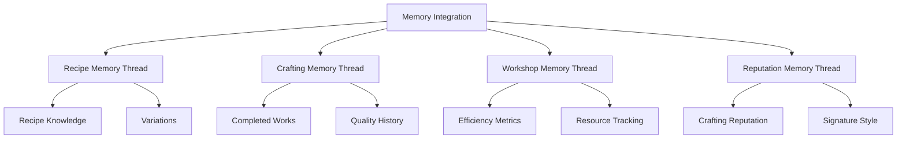

### 9.1 Recipe Memory Thread
```json
{
  "recipe_knowledge": {
    "recipe_name": {
      "mastery_level": 0,
      "success_rate": 0,
      "variations": [],
      "quality_records": [],
      "innovation_history": []
    }
  }
}
```

### 9.2 Crafting Memory Thread
```json
{
  "crafting_records": {
    "active_projects": [],
    "completed_works": [],
    "quality_history": [],
    "innovation_attempts": []
  }
}
```

### 9.3 Workshop Memory Thread
```json
{
  "workshop_data": {
    "efficiency_metrics": [],
    "resource_tracking": [],
    "quality_control": [],
    "safety_records": []
  }
}
```

### 9.4 Reputation Memory Thread
```json
{
  "crafting_reputation": {
    "signature_style": "",
    "known_for": [],
    "regional_fame": {},
    "guild_standing": {},
    "customer_relationships": [],
    "notable_works": []
  }
}
```

## 10.0 Crafting Specializations

### 10.1 Weaponsmithing

**Weapon Types**
- Bladed Weapons (swords, daggers, axes)
- Blunt Weapons (hammers, maces, flails)
- Polearms (spears, halberds, glaives)
- Ranged Weapons (bows, crossbows, throwing weapons)
- Exotic Weapons (chain weapons, unique designs)

**Crafting Focus**
- Edge Geometry (sharpness, cutting angle)
- Balance (weight distribution, handling)
- Durability (material strength, flexibility)
- Special Features (guards, pommels, grips)
- Decorative Elements (engravings, inlays)

**Quality Factors**
- Material Selection
- Forging Technique
- Heat Treatment
- Edge Finishing
- Handle Construction
- Balance Adjustment
- Decorative Work
- Final Testing

### 10.2 Armorsmithing

**Armor Types**
- Light Armor (leather, padded, hide)
- Medium Armor (chain, scale, brigandine)
- Heavy Armor (plate, full plate)
- Shields (buckler, kite, tower)
- Helmets (open, closed, full)

**Crafting Focus**
- Protection Level (damage reduction)
- Mobility Impact (movement restriction)
- Weight Distribution (comfort, fatigue)
- Joint Articulation (flexibility, range of motion)
- Environmental Protection (weather, elements)

**Quality Factors**
- Material Selection
- Plate Shaping
- Joint Construction
- Weight Reduction
- Comfort Features
- Protective Reinforcement
- Decorative Elements
- Field Testing

### 10.3 Alchemy

**Potion Types**
- Healing (wound closure, regeneration)
- Enhancement (attribute boost, skill improvement)
- Utility (breathing underwater, night vision)
- Combat (explosive, acid, smoke)
- Transformation (shape change, property alteration)

**Crafting Focus**
- Effect Potency (strength of effect)
- Duration (time active)
- Stability (shelf life, transport safety)
- Side Effects (negative consequences)
- Delivery Method (drink, apply, throw)

**Quality Factors**
- Ingredient Quality
- Preparation Method
- Brewing Conditions
- Timing Precision
- Mixing Technique
- Stabilization Process
- Container Quality
- Testing Protocol

### 10.4 Enchanting

**Enchantment Types**
- Weapon Enhancements (damage, accuracy)
- Armor Enhancements (protection, weight)
- Utility Items (light sources, storage)
- Wondrous Items (flight, invisibility)
- Cursed Items (traps, negative effects)

**Crafting Focus**
- Effect Type (what it does)
- Power Level (how strong)
- Activation Method (how triggered)
- Duration (how long it lasts)
- Charges (how many uses)

**Quality Factors**
- Base Item Quality
- Magical Resonance
- Rune Precision
- Energy Binding
- Effect Stability
- Power Regulation
- Safety Measures
- Final Testing

## Implementation Notes

This enhanced system provides a comprehensive framework for crafting that adapts to any world's rules and possibilities. Key aspects:

### Universal Foundation
- Works in all worlds
- Consistent mechanics
- Clear progression
- Quality standards
- Safety protocols
- Resource management

### Advanced Integration
- World-specific elements
- Magical crafting
- Alchemical systems
- Memory architecture
- Quality control
- Innovation tracking

### Development Focus
- Skill progression
- Material mastery
- Process optimization
- Quality improvement
- Safety awareness
- Knowledge preservation

The system maintains believability in any setting while enabling advanced capabilities where appropriate. Regular updates ensure continued evolution and adaptation to new scenarios and requirements.

</code>

system_crafting_materials.md:
<code>
---
id: system_crafting_materials
title: "Vantiel Crafting Material Compendium"
type: system
category: crafting
version: 1.0.0
last_updated: 2025-02-25
created_by: The Architect
maintained_by: The Architect

core_nodes:
  - crafting_materials
  - rarity_classification
  - material_categories

crosslinks:
  - memory
  - narrative
  - world
  - relations
  - journal
  - meta_commands
  - crafting
  - system_crafting
  - bestiary
  - economy

tags:
  - crafting
  - materials
  - rarity
  - harvesting
  - monster_parts
  - magical_components
  - integration
  - compendium

summary: >
  This file defines the Vantiel Crafting Material Compendium, including rarity classification, material categories, monster-derived components, magical substances, and integration with crafting and bestiary systems. It provides a comprehensive reference for resource gathering, crafting, and worldbuilding.

updates:
  - date: 2025-02-25
    change: "Initial version with rarity, material categories, monster parts, magical components, and integration."
---
# Table of Contents
- [Vantiel Crafting Material Compendium](#vantiel-crafting-material-compendium)
- [Material Relationship Flowchart](#material-relationship-flowchart)
- [1. Rarity Classification](#1-rarity-classification)
- [2. Core Material Categories](#2-core-material-categories)
- [3. Metals & Ores](#3-metals--ores)
- [4. Woods & Plants](#4-woods--plants)
- [5. Leathers & Hides](#5-leathers--hides)
- [6. Textiles & Fibers](#6-textiles--fibers)
- [7. Monster-Derived Materials](#7-monster-derived-materials)
- [8. Magical Components](#8-magical-components)
- [9. Gemstones & Crystals](#9-gemstones--crystals)
- [10. Geographic Distribution](#10-geographic-distribution)
- [11. Gathering & Harvesting Notes](#11-gathering--harvesting-notes)
- [12. Crafting Integration](#12-crafting-integration)
- [13. Conclusion](#13-conclusion)

# Vantiel Crafting Material Compendium
This document provides a detailed overview of the various crafting materials in Vantiel, including natural resources, monster-derived components, and rare magical substances. It is designed to integrate seamlessly with system_crafting.md, adding lore, rarity ratings, and geographic information.

---

# Material Relationship Flowchart

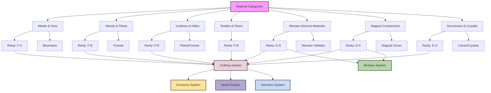

--------------------------------------------------------------------------------
## 1. Rarity Classification
--------------------------------------------------------------------------------

Each material is assigned a letter grade (F to S) denoting how rare and valuable it is:

• F-Rank: Extremely common (e.g., basic wood, common animal hides)
• E-Rank: Common but slightly specialized or region-specific
• D-Rank: Somewhat rare; requires minor dangers or specialized harvesting
• C-Rank: Rare; found in dangerous areas or from powerful creatures
• B-Rank: Very rare; significant risks or specialized knowledge needed
• A-Rank: Exceptionally rare (like Mithril); only mined or gathered under special conditions
• S-Rank: Legendary (like Adamantite); practically mythic in scarcity and power

--------------------------------------------------------------------------------
## 2. Core Material Categories
--------------------------------------------------------------------------------

1. Metals & Ores
2. Woods & Plants
3. Leathers & Hides
4. Textiles & Fibers
5. Monster-Derived Materials
6. Magical Components
7. Gemstones & Crystals

Each category lists the base materials, their rarity, typical properties, and gathering locations in Vantiel.

--------------------------------------------------------------------------------
## 3. Metals & Ores
--------------------------------------------------------------------------------

### 3.1 Iron (F-Rank)
• Abundant in frontier mines near Wall Aegis
• Basic metal for tools, weapons, armor
• Easy to smelt; moderate durability

### 3.2 Copper (E-Rank)
• Found throughout the Northern Mountains
• Good for conductive applications or lower-tier gear
• Malleable, easily alloyed with tin (bronze)

### 3.3 Steel (D-Rank)
• Refined from iron with specialized processes in Wall Bastion’s forges
• Standard for high-quality weapons and armor
• Versatile balancing of strength and weight

### 3.4 Silver (D-Rank)
• Mined in special pockets near Sylvaneir forest edges
• Highly receptible to magical enchantment
• Popular in holy or anti-demonic weaponry

### 3.5 Gold (C-Rank)
• Main deposits near the Southeastern Hills
• Common currency metal; resonates well with arcane energies
• Heavy, soft, and used for decorative or ceremonial gear

### 3.6 Mithril (A-Rank)
• Lightweight, magically conducive metal
• Found deep under the Northern Mountains in remote, heavily guarded mines
• Superior synergy with enchantments and “Thread-Sight” forging
• Highly prized by elven smiths and advanced human crafters

### 3.7 Adamantite (S-Rank)
• Legendary metal rumored to form near Blighted Zones or demon-tainted areas
• Imbued with extraordinary durability and a natural demonic resonance
• Practically unbreakable; forging requires specialized, high-level smiths
• Rarely traded and often the focus of epic quests

--------------------------------------------------------------------------------
## 4. Woods & Plants
--------------------------------------------------------------------------------

### 4.1 Oak (F-Rank)
• Common in temperate regions outside Wall Aegis
• Reliable structural wood for tools, frameworks
• Good balance of strength and weight

### 4.2 Ironwood (D-Rank)
• Found in the Western outskirts of Sylvaneir
• Notable for extreme hardness, resists simpler tools
• Ideal for shield frames and high-tier staves

### 4.3 Whisperleaf (C-Rank)
• Grows in Whispering Woods, where environment is thick with mana
• Absorbs residual sound and faint magical energies
• Often used for stealth-based equipment or magical instruments

### 4.4 Living Wood (B-Rank)
• Rarely found in deep Sylvaneir glades or near druidic circles
• Possesses minor regenerative properties
• Highly sought by druids and advanced enchanters

--------------------------------------------------------------------------------
## 5. Leathers & Hides
--------------------------------------------------------------------------------

### 5.1 Cowhide (F-Rank)
• Most accessible leather, used for basic garments and light armor
• Tanned in frontier villages or Wall Bastion workshops

### 5.2 Deerhide (E-Rank)
• Flexible and lighter than cowhide
• Harvested in forested areas along Wall Aegis
• Commonly used for ranger gear

### 5.3 Wyrmhide (C-Rank)
• Comes from lesser draconic creatures like drakes or serpents
• Offers moderate elemental resistance depending on the creature’s type
• Rare to come by without specialized hunting parties

### 5.4 Dragon Hide (B-Rank)
• From fully mature dragons or powerful draconic species
• Extremely durable, often featuring high elemental resistance
• Crafting requires advanced skill; forging or tanning times are lengthy

--------------------------------------------------------------------------------
## 6. Textiles & Fibers
--------------------------------------------------------------------------------

### 6.1 Cotton (F-Rank)
• Grown in farmland near Wall Aegis
• Basic cloth type for everyday wear
• Minimal protective quality

### 6.2 Wool (E-Rank)
• Raised by rural shepherds
• Warm and moderately water-resistant
• Often combined with other fabrics for traveling gear

### 6.3 Silk (D-Rank)
• Produced within special insect farms or Felidra territory
• Light, smooth, and an excellent conduit for minor enchantments
• Favored for robes or higher-quality clothing

### 6.4 Ethereal Weave (B-Rank)
• Spun from magical spider silk or gleaned from “Spirit Cocoon” creatures
• Naturally resonates with mana, suitable for Spellcaster garb
• Scarce, often found in hidden dungeons near ley lines

--------------------------------------------------------------------------------
## 7. Monster-Derived Materials
--------------------------------------------------------------------------------

Monster parts often carry unique properties tied to each creature’s biology or magic. Master crafters regularly pay high prices for these materials:

### 7.1 Offensive Parts (Teeth, Horns, Claws)
• Focus on slicing, piercing, or impact properties
• Commonly used in weapon augmentation or arrow tips
• Examples:
   – Razorclaw Bear Claws (C-Rank): Enhanced cutting power, from an advanced bear variant
   – Mbaku Rhino Horn (B-Rank): Shock-infusing effect, found in Thunderhorn Rhinos

### 7.2 Defensive Parts (Scales, Bones, Shells)
• Utilized in armor crafting and shield-making
• Often carry natural elemental resistance
• Examples:
   – Moonshadow Wolf Fur (C-Rank): Slight stealth bonus or shadow affinity
   – Emberback Bear Scales (B-Rank): Fire-resistant plating for heatproof armor

### 7.3 Magical Organs (Hearts, Eyes, Glands)
• Contain concentrated mana or specialized biological compounds
• Vital for advanced enchantments or alchemical recipes
• Examples:
   – Sylphling Core (B-Rank): Allows weather magic infusion
   – Ifrit Flame Gland (B-Rank): Adds fire-elemental properties to weaponry

### 7.4 Unique Essences (Blood, Venom, Fluids)
• Harvested from special glands or bodily fluids
• Often used in potions, salves, or cursed gear
• Examples:
   – Mistweaver Toxin (D-Rank): Hallucinogenic illusions when refined
   – Chaos Troll Ichor (A-Rank): Chaotically warps weapons/armor for unpredictable traits

--------------------------------------------------------------------------------
## 8. Magical Components
--------------------------------------------------------------------------------

These materials are defined by their potent arcane energy rather than physical properties:

### 8.1 Mana Crystals (D to B-Rank)
• Found in crystal caverns or areas with high mana density
• Graded on purity; refined crystals can store spells or boost enchantments
• Dangerous to mine without specialized wards

### 8.2 Heartstone (C-Rank)
• Crystal that resonates with emotional energy
• Often used in empathy-based magic items or relics of bonding
• Found in caverns near high-drama battle sites

### 8.3 Voidsilk (B-Rank)
• Produced by rare void-spiders—exceedingly strong and resonance-capable
• Light yet nearly untearable, ideal for stealth or infiltration gear
• Collected from ephemeral webs that vanish under direct sunlight

--------------------------------------------------------------------------------
## 9. Gemstones & Crystals
--------------------------------------------------------------------------------

### 9.1 Quartz (E-Rank)
• Common gemstone with minor magical conductivity
• Used for basic enchanting or decorative inlays

### 9.2 Ruby, Sapphire, Emerald (D-Rank)
• Standard precious gems used to focus elemental spells (fire, water, earth, etc.)
• Valued by spellcasters for stable storage of power

### 9.3 Starmetal Shards (B-Rank)
• Fallen meteoric fragments collected in remote craters
• Exhibits cosmic energy synergy, boosts space-time or star-aligned magic
• Rarely sold due to limited supply and high demand

### 9.4 Ether Diamond (S-Rank)
• Legendary crystal rumored to store an almost infinite amount of mana
• Glows with a soft multi-hued luminescence
• Said to be found only in hidden realms or with the slaying of certain cosmic entities

--------------------------------------------------------------------------------
## 10. Geographic Distribution
--------------------------------------------------------------------------------

### 10.1 Wall Aegis Territories
• Basic farmland resources: Cotton, cowhide, iron ore
• Occasional frontier monster parts (Boars, Wolves)
• Some migratory Moonshadow Wolves deeper into forests

### 10.2 Wall Bastion Territories
• Commercial hub: Standard metals, enchanting shops, special goods
• Skilled guild artisans often import high-tier materials from adventurers
• Hidden black markets for restricted or monstrous parts

### 10.3 Wall Citadel (Inner Sanctum)
• Typically deals in the highest-quality crafted goods
• Rare deposits controlled by noble houses
• Occasional auctions for A- and S-rank materials

### 10.4 Sylvaneir (Elven Forest)
• Rich in mystical flora (Whisperleaf, Living Wood)
• Elven-run Mithril mines in the Northern Mountains
• Magical beast hides (e.g., Felidra or forest spirits)

### 10.5 Northern Mountains
• Main source of iron, steel-grade ore, plus Mithril pockets
• Stylized Adamantite rumors but generally near Blighted zones
• Harsh environment, requiring skilled explorers

### 10.6 Eastern Plains
• Agriculture and moderate wild animal resources (Deer, standard wolves)
• Occasional monstrous migrations requiring hunting parties

### 10.7 Southern Coast
• Fishing communities, aquatic monster materials (Glowfin scales, Razorfang Pike)
• Potential sea-related rare finds (pearls, coral-based substances)

### 10.8 Whispering Woods
• Concentrated magical anomalies, special plants like Whisperleaf
• Some monstrous beings (Crystal Mantis, Mistweaver Frog)
• High mana flows, risk of mutated creatures

### 10.9 Blighted Zones
• Corrupted landscapes with demonic influences
• Adamantite deposits, Chaos Troll Ichor, mutated beasts
• Extremely high risk, requiring advanced parties

--------------------------------------------------------------------------------
## 11. Gathering & Harvesting Notes
--------------------------------------------------------------------------------

1. **Permits & Ownership**
   - Nobles or guilds may own resource-rich areas, requiring permits to harvest.
   - Trespassing can lead to severe penalties.

2. **Environmental Impact**
   - Overharvesting can damage ecosystems, trigger beast aggression, or spawn corrupted lands.

3. **Monster Harvesting**
   - Requires knowledge of monster biology to extract valuable parts (horns, claws, hearts).
   - Tools or Tamed Beasts (via Beast Taming Magic) can greatly assist in humane or efficient harvesting.

4. **Quality Factors**
   - Some materials degrade quickly if not preserved (e.g., Ifrit glands must be sealed in flame-resistant containers).
   - Thread-Sight can reveal hidden flaws or ensure maximum yields.

5. **Market Variability**
   - Demand rises during wars or crises, making certain materials extremely profitable.
   - Rarity escalates prices, with S-rank items fetching fortunes from collectors or advanced crafters.

--------------------------------------------------------------------------------
## 12. Crafting Integration
--------------------------------------------------------------------------------

These materials align with the crafting mechanics described in system_crafting.md:

• **Skill Checks**: High-rank materials typically require higher DC checks to process.
• **Quality Tiers**: Rare materials can more easily yield Masterwork or Legendary results.
• **Time Requirements**: Gathering in perilous areas increases overall crafting time.
• **Collaborations**: Specialists in harvesting or taming can help secure top-tier monster drops.

By blending these materials with the existing forging, alchemy, enchanting, and tailoring systems, crafters can push the boundaries of what’s possible in Vantiel—creating legendary arms, armor, and artifacts that shape the world’s destiny.

--------------------------------------------------------------------------------
## 13. Conclusion
--------------------------------------------------------------------------------

With this expanded material compendium, adventurers and artisans can plan expeditions, trade routes, and specialized hunts to gather the best resources Vantiel offers. Whether forging B-rank Emberback scales into fireproof shields or venturing into Blighted Zones in hopes of unearthing the legendary Adamantite, every quest ties into the ever-evolving tapestry of crafting and exploration.

Use this reference alongside the bestiary for synergy between material-harvesting from monsters and advanced crafting techniques. As Vantiel’s world changes, the availability and properties of these materials will also shift, ensuring an ongoing journey of discovery for brave crafters and hunters alike.

</code>

system_economy.md:
<code>
---
id: system_economy
title: "Economy System: Commerce & Resources"
type: system
category: economy
version: 1.0.1
last_updated: 2025-02-25
created_by: The Architect
maintained_by: The Architect

core_nodes:
  - economy
  - market_dynamics
  - business_system
  - faction_economics

crosslinks:
  - memory
  - narrative
  - relations
  - world
  - skills
  - journal
  - meta_commands
  - inventory
  - crafting
  - guild

tags:
  - economy
  - market
  - business
  - barter
  - negotiation
  - reputation
  - moral_choices
  - passive_income
  - faction_economics
  - dynamic_pricing

summary: >
  This file defines the Economy System for Vantiel, including currency, market dynamics, business operations, barter, negotiation, faction economics, and moral choices. It integrates with memory, narrative, crafting, world, and relationship systems, supporting dynamic pricing, reputation, and legacy.

updates:
  - date: 2025-01-25
    change: "Initial version with dynamic pricing, business system, and faction economics."
---

# Table of Contents
- [Economy System: Commerce & Resources](#economy-system-commerce--resources)
- [1.0 Overview](#10-overview)
- [2.0 Currency System](#20-currency-system)
- [3.0 Market Dynamics](#30-market-dynamics)
- [4.0 Entrepreneur's Toolkit & Business System](#40-entrepreneurs-toolkit--business-system)
- [5.0 Barter & Negotiation](#50-barter--negotiation)
- [6.0 Faction Economics](#60-faction-economics)
- [7.0 Moral Economics](#70-moral-economics)
- [8.0 Implementation Notes](#80-implementation-notes)

# Economy System: Commerce & Resources

```mermaid
flowchart TD
    A[Economy System] --> B[Currency]
    A --> C[Market Dynamics]
    A --> D[Store System]
    A --> E[Narrative Integration]

    %% Cross-system arrows for audit compliance
    A --> F[Memory System]
    A --> G[Narrative System]
    A --> H[Relations System]
    A --> I[World System]
    A --> J[Skills System]
    A --> K[Journal System]
    A --> L[Meta Commands]
    A --> M[Inventory System]
    A --> N[Crafting System]
    A --> O[Guild System]

    B --> B1[Coin Types]
    B --> B2[Exchange Rates]
    B --> B3[Wealth Effects]

    C --> C1[Dynamic Pricing]
    C --> C2[Supply & Demand]
    C --> C3[Regional Economies]

    D --> D1[Store Ownership]
    D --> D2[Supply Chains]
    D --> D3[Customer Relations]

    E --> E1[Moral Choices]
    E --> E2[Reputation Impact]
    E --> E3[Memory Threads]

    style A fill:#f9f,stroke:#333,stroke-width:2px
    style F fill:#ffe599,stroke:#333,stroke-width:2px
    style G fill:#c9daf8,stroke:#333,stroke-width:2px
    style H fill:#f4cccc,stroke:#333,stroke-width:2px
    style I fill:#b4a7d6,stroke:#333,stroke-width:2px
    style J fill:#d9ead3,stroke:#333,stroke-width:2px
    style K fill:#fce5cd,stroke:#333,stroke-width:2px
    style L fill:#d9ead3,stroke:#333,stroke-width:2px
    style M fill:#b6d7a8,stroke:#333,stroke-width:2px
    style N fill:#ead1dc,stroke:#333,stroke-width:2px
    style O fill:#fff2cc,stroke:#333,stroke-width:2px
```

## 1.0 Overview

In Vantiel, commerce is more than mere transactions—it's a complex web of moral choices, social standing, and character development. Every coin spent, every trade negotiated, and every resource gathered tells a story about your values and place in the world. The economy responds dynamically to your actions, with prices fluctuating based on scarcity, regional events, and your own reputation.

This system governs how wealth flows through the world, how businesses operate, and how your economic decisions shape both your material circumstances and your narrative journey. From bartering with village merchants to establishing commercial empires, your economic choices leave lasting impressions on the world and its inhabitants.

## 2.0 Currency System

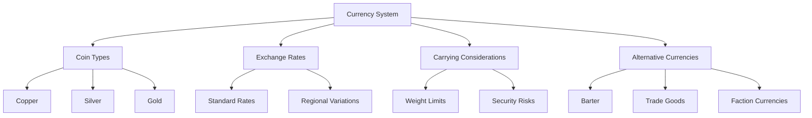

### 2.1 Coin Types & Exchange

- **Copper** (🟤): Basic unit of currency, used for everyday purchases
- **Silver** (⚪): Medium-value currency, used for quality goods and services
- **Gold** (🟡): High-value currency, used for luxury items and major transactions

**Standard Exchange Rates:**
- 100 copper = 1 silver
- 100 silver = 1 gold

**Regional Variations:**
- War zones may devalue copper coins
- Trade hubs might offer better exchange rates
- Isolated regions may reject certain currencies

### 2.2 Carrying Considerations

**Weight & Encumbrance:**
- Large quantities of coins have significant weight
- 1,000 copper coins = 10 kg (affects movement speed)
- Coin purses and money pouches have limited capacity

**Security Risks:**
- Carrying large sums attracts thieves and bandits
- Visible wealth may alter NPC reactions
- Some areas may impose "wealth taxes" or "protection fees"

### 2.3 Alternative Currencies

**Barter System:**
- Direct exchange of goods and services
- Value based on need, scarcity, and negotiation skill
- More common in rural areas or during economic instability

**Trade Goods:**
- Gems, spices, rare materials as currency alternatives
- Maintain value across regions, often more portable than coins
- May appreciate in value in certain markets

**Faction Currencies:**
- Guild scrip accepted only within certain organizations
- Noble house promissory notes
- Church indulgences or blessing tokens

## 3.0 Market Dynamics

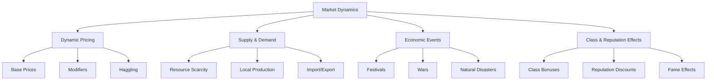

### 3.1 Dynamic Pricing

**Base Price Factors:**
- Item quality and rarity
- Local availability
- Merchant type and location
- Regional economic conditions

**Price Modifiers:**
- War, famine, or monster incursions: +20% to +100%
- Festivals or bumper harvests: -10% to -30%
- Your reputation in the region: ±5% to ±20%
- Bulk purchases: -5% to -15%

**Haggling System:**
- Charisma-based skill check (d20 + CHA modifier + Negotiation skill)
- Success reduces prices by 5-20%
- Critical success may include bonus items or information
- Critical failure may offend merchant, increasing prices or refusing service

### 3.2 Supply & Demand

**Resource Scarcity:**
- Seasonal availability of certain goods
- Depletion of local resources through player or NPC actions
- Artificial scarcity through merchant guilds or noble interference

**Production Cycles:**
- Harvest seasons affect food prices
- Mining operations fluctuate with political stability
- Crafting materials vary with monster migrations

**Market Saturation:**
- Selling too many of the same item in one location decreases value
- Flooding markets with rare items reduces their prestige
- Creating monopolies on essential goods may trigger social unrest

### 3.3 Class-Based Merchant Attitudes

**Favorable Reactions:**
- **Saint of Light/Nature**: +5-10% discount, occasional free herbs or blessings
- **Hero**: Occasional free "thank you" items, priority service
- **Merchant/Trader Class**: Professional courtesy, insider information

**Unfavorable Reactions:**
- **Blood Mage/Voidcaller**: +10-20% markup, wary service, possible refusal
- **Shadowblade**: Increased scrutiny, suspicion of theft
- **Criminal Background**: Limited access to legitimate markets

### 3.4 Economic Events

**Seasonal Festivals:**
- Special merchandise availability
- Temporary price reductions
- Unique trading opportunities

**Calamities:**
- Wars disrupt supply lines and increase military goods prices
- Plagues reduce workforce and raise food prices
- Monster incursions create demand for weapons and protective items

**Political Changes:**
- New leadership may change taxation policies
- Trade agreements alter import/export dynamics
- Faction conflicts create black markets

## 4.0 Entrepreneur's Toolkit & Business System

```mermaid
flowchart TD
    A[Business System] --> B[Establishment]
    A --> C[Operations]
    A --> D[Growth]
    A --> E[Reputation]
    A --> F[Passive Income]

    B --> B1[Location Selection]
    B --> B2[Investment Capital]
    B --> B3[Market Research]
    B --> B4[Business Plan]

    C --> C1[Inventory Management]
    C --> C2[Pricing Strategy]
    C --> C3[Staff Management]
    C --> C4[Financial Tracking]

    D --> D1[Upgrades & Equipment]
    D --> D2[Expansion]
    D --> D3[Franchising]
    D --> D4[Diversification]

    E --> E1[Customer Relations]
    E --> E2[Community Impact]
    E --> E3[Competitor Relations]
    E --> E4[Guild Standing]

    F --> F1[Rental Properties]
    F --> F2[Silent Partnerships]
    F --> F3[Investment Returns]
    F --> F4[Automated Operations]
```

### 4.1 Business Establishment System

**Store Establishment:**
- Location selection affects customer type and volume
- Initial investment determines starting inventory and quality
- Specialization attracts specific clientele

**Store Identity:**
- Name and signage create first impressions
- Interior design reflects your brand values
- Merchandise display affects customer interest

**Location Analysis & Selection:**
- **Prime (City Center)**: High foot traffic, expensive rent (500-800 gold/month), wealthy clientele
- **Commercial District**: Moderate traffic, competitive market (300-500 gold/month), diverse customers
- **Residential Area**: Lower traffic, affordable (100-300 gold/month), loyal local customers
- **Rural/Frontier**: Minimal competition, low cost (50-100 gold/month), limited customer base
- **Fantasy Locations**: Special zones (magical districts, underground markets) with unique benefits/restrictions

**Market Research Mechanics:**
1. Conduct surveys (1-3 days, 5-20 gold cost)
2. Analyze competition (identifies gaps in market)
3. Test merchandise (small-scale trials before full investment)
4. Research local regulations (avoid legal issues)
5. Consult with Great Sage (provides statistical analysis of success probability)

**Startup Costs (Detailed Breakdown):**
- **Small Stall/Cart**: 50-100 gold
  - Cart/Stall structure: 30-50 gold
  - Initial inventory: 15-30 gold
  - Permits and fees: 5-15 gold
  - Basic tools/equipment: 5-10 gold

- **Shop in Existing Building**: 200-500 gold
  - Lease deposit (3 months): 90-150 gold
  - Renovations: 30-100 gold
  - Initial inventory: 50-150 gold
  - Fixtures and furniture: 20-50 gold
  - Signage and branding: 10-30 gold
  - Security measures: 10-20 gold

- **Custom-Built Establishment**: 1,000-3,000 gold
  - Land purchase: 300-1,000 gold
  - Building construction: 500-1,500 gold
  - Premium fixtures: 100-200 gold
  - Extensive inventory: 150-400 gold
  - Staff hiring and training: 50-100 gold
  - Grand opening event: 30-80 gold
  - Enhanced security: 30-100 gold

**Business Plan Development:**
- **Component Requirements:**
  1. Executive Summary (clear concept)
  2. Market Analysis (customer demographics)
  3. Competitive Assessment (SWOT analysis)
  4. Marketing Strategy (customer acquisition plan)
  5. Operational Plan (day-to-day management)
  6. Financial Projections (3-month, 6-month, 1-year)
  7. Funding Requirements (capital needs)

- **Plan Quality Tiers:**
  - **Basic Plan**: +5% business success chance
  - **Standard Plan**: +10% business success chance, -10% unexpected costs
  - **Comprehensive Plan**: +15% business success chance, -15% unexpected costs, +5% profit margin
  - **Master Plan**: +20% business success chance, -20% unexpected costs, +10% profit margin, access to premium investors

### 4.2 Business Operations Framework

#### 4.2.1 Supply Chain & Inventory Management

**Supplier Relations:**
- Negotiate with resource gatherers, craftspeople, and importers
- Build relationships for better prices and exclusive items
- Manage reliability and quality control

**Inventory Management:**
- Balance between diverse stock and specialized focus
- Seasonal rotation of merchandise
- Storage solutions for valuable or perishable goods

**Specialization Options:**
- General goods (broad appeal, lower margins)
- Luxury items (wealthy clientele, higher margins)
- Practical necessities (steady demand, moderate margins)
- Niche products (specialized clientele, variable margins)

**Supplier Relationship System:**
- **Tier 1 (New Business)**: Standard prices, limited selection, COD terms
- **Tier 2 (Established)**: 5% discount, expanded selection, 15-day credit terms
- **Tier 3 (Preferred)**: 10% discount, access to rare items, 30-day credit terms
- **Tier 4 (Partner)**: 15-20% discount, exclusive items, 60-day credit terms, priority delivery

**Inventory Turnover Rates:**
- **Fast-moving Goods**: 7-14 days (food, consumables, common supplies)
- **Standard Products**: 30-45 days (clothing, tools, household items)
- **Durable Goods**: 60-90 days (furniture, equipment, quality weapons)
- **Luxury Items**: 90-180 days (jewelry, art, magical artifacts)

**Inventory Control System:**
- **Security Measures:**
  - Basic: Simple locks, -5% theft chance (5-10 gold)
  - Standard: Quality locks and inventory tracking, -15% theft (25-50 gold)
  - Advanced: Guard hiring, alarm systems, -30% theft (100-200 gold)
  - Master: Magical wards, enchanted locks, -50% theft (300-500 gold)

- **Spoilage/Damage Rates:**
  - Perishables: 5-15% loss per week without preservation
  - Standard goods: 1-3% damage per month without protection
  - Premium protection: Reduces loss rates by 50-75%

#### 4.2.2 Detailed Pricing Strategy

**Markup Formulas:**
- **Cost-Plus Pricing**:
  - Necessities: 20-30% markup
  - Standard Goods: 40-60% markup
  - Luxury Items: 100-300% markup
  - Rare/Magical Items: 400%+ markup

- **Value-Based Pricing Modifiers**:
  - High demand: +10-25% premium
  - Seasonal items: +15-40% during peak season
  - Emergency needs: +50-100% during crises
  - Bulk discounts: -5% (10+ units), -10% (25+ units), -15% (50+ units)

**Price Adjustment Triggers:**
- Supply shortages: +10-50%
- Competitor actions: Match or undercut by 5-10%
- Festival/Event proximity: +15-25%
- Regular customer status: -5-15%
- Guild membership: -10-20%

#### 4.2.3 Staff & Wage System

**Hiring Considerations:**
- Skill level affects service quality and efficiency
- Personality impacts customer relations
- Background influences trustworthiness and connections

**Staff Types:**
- Sales clerks and shopkeepers
- Security personnel
- Specialized experts (appraisers, enchanters, etc.)
- Support staff (cleaners, stockers, etc.)

**Employee Management:**
- Fair wages build loyalty and reduce theft
- Training improves service quality
- Recognition and advancement opportunities boost morale

**Staff Hierarchy & Costs:**
- **Apprentice/Novice**: 1-2 silver/day (15-30 gold/year)
- **Journeyman/Clerk**: 3-5 silver/day (45-75 gold/year)
- **Expert/Manager**: 1-2 gold/day (150-300 gold/year)
- **Master/Specialist**: 3-5 gold/day (450-750 gold/year)

**Staff Benefits Package:**
- Basic: Room & board (-10% turnover rate)
- Standard: + Healthcare or magical healing access (-25% turnover)
- Premium: + Profit sharing, training, advancement (-50% turnover)

**Training Investment Returns:**
- 5-10 gold investment: +5% staff efficiency
- 20-50 gold investment: +15% staff efficiency
- 100+ gold investment: +25% staff efficiency, possibility of staff innovation

### 4.3 Business Growth & Expansion

**Upgrade Paths & Costs:**
- **Facility Upgrades:**
  - Basic Renovation: 50-100 gold (+5% customer capacity)
  - Major Expansion: 200-500 gold (+25% customer capacity)
  - Premium Redesign: 500-1,000 gold (+40% customer capacity, +10% luxury clientele)

- **Equipment Investments:**
  - Basic Tools: 10-30 gold (+5% production efficiency)
  - Advanced Machinery: 50-200 gold (+15% production efficiency)
  - Magical Automation: 300-1,000 gold (+30% production efficiency, -20% staff needs)

**Multi-Location Expansion Framework:**
- **Second Location Prerequisites:**
  - 1+ year successful operation
  - 10,000+ gold in total revenue
  - Management staff available
  - Supply chain stability

- **Franchise Model:**
  - Franchisee investment: 60-80% of standard startup costs
  - Royalty fees: 10-20% of gross revenue
  - Training requirements: 2-4 weeks at established location
  - Quality control measures: Quarterly inspections

**Business Diversification Options:**
- **Vertical Integration:**
  - Raw material acquisition (reduces COGS by 10-20%)
  - Production capabilities (increases margins by 15-30%)
  - Distribution network (expands market reach by 25-50%)

- **Horizontal Expansion:**
  - Complementary product lines (increases average transaction by 20-40%)
  - Subsidiary businesses (diversifies income streams)
  - Service additions (increases customer retention by 15-25%)

### 4.4 Passive Income Systems

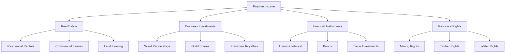

#### 4.4.1 Real Estate Investment System

**Property Acquisition Costs:**
- **Residential Properties:**
  - Small cottage: 500-1,000 gold
  - Town house: 1,000-3,000 gold
  - Manor house: 5,000-20,000 gold

- **Commercial Properties:**
  - Small shop: 1,000-3,000 gold
  - Warehouse: 2,000-5,000 gold
  - Large market building: 5,000-15,000 gold

**Rental Yields:**
- **Residential:** 4-8% annual return (paid monthly)
- **Commercial:** 6-12% annual return (paid quarterly)
- **Premium Locations:** Additional 2-5% yield

**Property Management Costs:**
- Self-managed: No cost (requires 2-5 hours/week per property)
- Hired manager: 10-15% of rental income
- Management company: 15-25% of rental income (includes maintenance)

**Maintenance & Risks:**
- Annual maintenance: 1-3% of property value
- Vacancy risk: 5-15% potential vacancy period per year
- Tenant damage: 0-5% of property value risk per tenant

#### 4.4.2 Business Investment Framework

**Partnership Structures:**
- **Silent Partner:** 25-49% ownership, 0% management responsibility
- **Limited Partner:** 10-25% ownership, minimal management
- **Investor:** 5-10% ownership, no management duties

**Typical Returns:**
- **Established Business:** 8-15% annual return
- **Growing Business:** 15-25% annual return (higher risk)
- **Speculative Venture:** 25-100% potential return (significant risk)

**Investment Tiers:**
- **Small Investment:** 100-500 gold
- **Medium Investment:** 500-2,000 gold
- **Major Investment:** 2,000-10,000 gold
- **Guild Share Purchase:** 250-1,000 gold per share

**Investment Risks & Safeguards:**
- Business failure rates: 20-30% in first year, 50% within five years
- Legal protections: Contracts limiting liability to investment amount
- Insurance options: 5-10% of investment amount annually for protection
- Due diligence requirements: Background checks, business plan review

#### 4.4.3 Alternative Passive Income Streams

**Resource Rights:**
- **Mining Claim:** 500-2,000 gold initial cost, 10-30% annual yield
- **Timber Rights:** 300-1,200 gold initial cost, 8-15% annual yield
- **Hunting Grounds:** 200-800 gold initial cost, 5-12% annual yield
- **Water Rights:** 300-1,500 gold initial cost, 10-20% annual yield

**Intellectual Property:**
- **Crafting Recipes:** 50-500 gold per recipe sold, 2-5% royalty
- **Spell Formulas:** 100-1,000 gold per formula, 5-10% royalty
- **Books/Creative Works:** 10-20% royalty on sales

**Magical Automation:**
- **Enchanted Production:** 500-2,000 gold setup, provides goods worth 5-15% monthly
- **Self-Maintaining Gardens:** 300-1,200 gold setup, produces herbs/food worth 3-8% monthly
- **Magical Servants:** 1,000-5,000 gold creation cost, reduces labor costs by 10-30%

### 4.5 Customer Relationship System

**Customer Loyalty Tiers:**
- **First-time Customer:** Standard pricing
- **Regular (5+ visits):** 5% discount, priority service
- **Loyal (20+ visits):** 10% discount, special order options
- **VIP (50+ visits or 1,000+ gold spent):** 15% discount, after-hours service, home delivery

**Reputation Building Activities:**
- **Community Events:** 50-200 gold investment, +5-15% local reputation
- **Charity/Donations:** 10% of monthly profit, +3-8% faction reputation
- **Quality Guarantees:** Replacement policy, +10-20% customer retention
- **Relationship Marketing:** Personal notes, remembering preferences, +25-40% customer loyalty

### 4.6 Merchant Class Special Abilities

**Business Acumen (Passive):**
- Level 1: +5% profit margins, +10% supplier relationship building
- Level 2: +10% profit margins, +15% customer loyalty retention
- Level 3: +15% profit margins, +20% business growth speed
- Level 4: +20% profit margins, +25% negotiation effectiveness

**Market Network (Active):**
- Level 1: Access to basic merchant information network
- Level 2: Special discounts with 2-3 major suppliers
- Level 3: Preferential treatment at marketplaces and guild halls
- Level 4: Ability to call in market favors once per week

**Trade Routes (Passive Income):**
- Level 1: Establish route between 2 settlements (50-100 gold/month)
- Level 2: Manage 3-5 trade routes (150-300 gold/month)
- Level 3: International trade connections (300-600 gold/month)
- Level 4: Trade empire with multiple caravans (600-1,500 gold/month)

### 4.7 Customer Experience & Relations

**Service Quality:**
- Affects repeat business and word-of-mouth
- Influences pricing tolerance
- Creates memorable experiences that build reputation

**Regular Patrons:**
- Develop relationships with recurring customers
- Create loyalty programs or special offers
- Gather feedback for continuous improvement

**Special Events:**
- Seasonal sales to boost traffic
- Exclusive previews for valued customers
- Demonstrations or workshops to showcase products

### 4.8 Expansion & Growth

**Store Upgrades:**
- Improved fixtures and displays
- Enhanced security systems
- Specialized equipment for services

**Business Expansion:**
- Additional locations in other neighborhoods or cities
- Diversification into related product lines
- Vertical integration (producing your own merchandise)

**Franchising Possibilities:**
- License your brand to other entrepreneurs
- Standardize operations across multiple locations
- Build a recognizable commercial empire
## 5.0 Barter & Negotiation

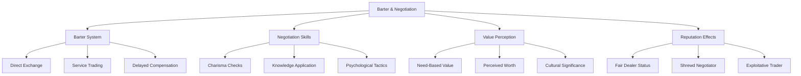

### 5.1 Barter Mechanics

**Direct Exchange:**
- Item-for-item trades based on perceived value
- Service-for-item exchanges (healing for supplies)
- Mixed transactions (partial coin, partial goods)

**Value Determination:**
- Base value modified by:
  - Local scarcity
  - Immediate need
  - Item condition
  - Relationship with trader

**Barter Skill Check:**
- d20 + CHA modifier + Barter skill vs. merchant's resistance
- Success improves exchange rate by 10-30%
- Failure may result in unfavorable terms

### 5.2 Advanced Negotiation

**Preparation Tactics:**
- Research fair market values beforehand
- Learn merchant's specific needs or interests
- Time negotiations during favorable conditions

**Psychological Elements:**
- Starting with unreasonable offers to anchor expectations
- Creating sense of urgency or exclusivity
- Building rapport before serious negotiations

**Special Circumstances:**
- Desperate merchants during crises
- Cultural differences in negotiation styles
- Status-based expectations (nobles vs. commoners)

### 5.3 Reputation-Based Trading

**Trading History:**
- Past fair deals improve future terms
- Reputation for exploitation limits opportunities
- Consistency builds trusted relationships

**Fame Effects:**
- Well-known heroes may receive "hero's discount"
- Infamous characters might face inflated prices
- Specialized reputation (e.g., "Master Weaponsmith") grants expert pricing

**Memory Thread Integration:**
- Merchants remember significant transactions
- Word spreads about exceptional deals or scams
- Regional reputation affects pricing across multiple vendors

## 6.0 Faction Economics

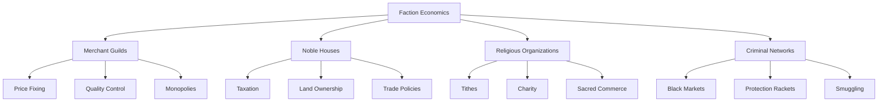

### 6.1 Merchant Guilds

**Guild Structure:**
- Hierarchical organization (apprentice to master)
- Specialized by trade or product type
- Regional or international in scope

**Economic Influence:**
- Price standardization across members
- Quality control and certification
- Market access control and exclusivity

**Player Interaction:**
- Membership requirements and benefits
- Guild quests and contracts
- Access to specialized training or resources

### 6.2 Noble Houses & Governance

**Economic Powers:**
- Taxation authority in their domains
- Control of strategic resources
- Influence over trade routes and markets

**Patronage System:**
- Commissions for crafters and artists
- Sponsorship of businesses and ventures
- Protection in exchange for goods or services

**Political Economy:**
- Trade policies affecting import/export
- Labor regulations impacting production
- Currency control and monetary policy

### 6.3 Religious Organizations

**Economic Activities:**
- Collection of tithes and donations
- Operation of charitable institutions
- Management of sacred lands and resources

**Commercial Influence:**
- Blessing or condemning certain trades
- Setting ethical standards for commerce
- Providing alternative economic systems

**Sacred Economics:**
- Religious artifacts and relics market
- Pilgrimage economies around holy sites
- Faith-based services (healing, blessing, divination)

### 6.4 Criminal Networks

**Black Market Operations:**
- Trade in prohibited or restricted goods
- Tax evasion and smuggling operations
- Counterfeit currency and documents

**Protection Rackets:**
- "Insurance" fees from legitimate businesses
- Territory control and access fees
- Conflict resolution services (for a price)

**Underground Economy:**
- Alternative banking and lending
- Fencing stolen goods
- Information brokerage and espionage

## 7.0 Moral Economics

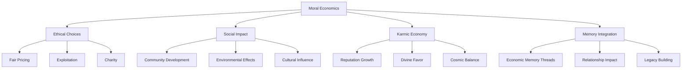

### 7.1 Ethical Dilemmas

**Price Setting:**
- Fair pricing builds community goodwill
- Price gouging during crises generates profit but damages reputation
- Sliding scales based on customer need

**Resource Allocation:**
- Hoarding essential goods during shortages
- Distributing resources equitably vs. maximizing profit
- Balancing personal needs against community welfare

**Labor Practices:**
- Fair wages vs. exploitation
- Safe working conditions vs. cost-cutting
- Training and advancement opportunities

### 7.2 Social Impact

**Community Development:**
- Investing in local infrastructure
- Creating jobs and economic opportunities
- Supporting education and public services

**Environmental Considerations:**
- Sustainable resource gathering
- Pollution and waste management
- Restoration and conservation efforts

**Cultural Influence:**
- Preserving traditional crafts and practices
- Introducing innovations and new technologies
- Balancing progress with heritage

### 7.3 Karmic Economy

**Reputation Effects:**
- Generous actions build positive reputation
- Exploitative practices create negative reputation
- Reputation influences prices, opportunities, and relationships

**Divine Favor:**
- Ethical commerce pleases certain deities
- Exploitation angers others
- Divine intervention in extreme cases

**Cosmic Balance:**
- Long-term consequences for economic actions
- Unexpected returns on generosity
- Karmic debt from exploitation

### 7.4 Memory Thread Integration

**Economic Memory Creation:**
- Significant transactions create memory threads
- Price patterns and merchant relationships recorded
- Economic reputation tracked across regions

**Relationship Impact:**
- Commercial interactions affect NPC relationships
- Fair dealing builds trust and loyalty
- Exploitation creates enemies and obstacles

**Legacy Building:**
- Economic actions shape your lasting reputation
- Businesses and trading networks outlive characters
- Economic traditions passed to successors

## 8.0 Implementation Notes

This economy system creates a dynamic, responsive commercial environment that reacts to player choices and integrates deeply with the narrative. Key aspects include:

### Core Mechanics
- Currency and exchange systems
- Dynamic pricing based on multiple factors
- Negotiation and barter skill checks
- Store management and growth

### Narrative Integration
- Economic choices reflect character values
- Commercial reputation affects relationships
- Moral dimensions of wealth and commerce
- Memory threads track economic history

### Development Focus
- Realistic economic responses to world events
- Meaningful consequences for economic choices
- Deep integration with other game systems
- Balance between simulation and playability

The system maintains believability while creating opportunities for character development, moral choices, and strategic gameplay. Regular updates will refine economic balance and expand commercial opportunities based on player engagement and world evolution.

</code>

system_guild.md:
<code>
---
id: system_guild
title: "System: Adventurers Guild of Vantiel"
type: system
category: organization
version: 1.1.0
last_updated: 2025-04-14
created_by: The Architect
maintained_by: The Architect

core_nodes:
  - guild
  - quest_system
  - rank_system
  - social_dynamics

crosslinks:
  - memory
  - narrative
  - world
  - relations
  - journal
  - meta_commands
  - combat
  - skills
  - crafting
  - economy
  - companions

tags:
  - guild
  - quests
  - rank
  - social_dynamics
  - cognitive_bias
  - trauma
  - reflection
  - narrative_drift
  - viral_belief
  - organization

summary: >
  This file defines the Adventurers Guild System for Vantiel, including quest boards, rank progression, social dynamics, cognitive bias, trauma, reflection, and narrative drift. It integrates with memory, narrative, world, relationship, combat, skills, crafting, economy, and companion systems for a living, evolving organization.

updates:
  - date: 2025-04-14
    change: "Integrated cognitive bias, trauma, memory fracture, reflection, narrative drift, viral belief, and advanced reasoning mechanics per Reflections upgrade."
  - date: 2025-03-01
    change: "Upgraded with advanced social and political systems."
  - date: 2025-02-10
    change: "Initial version with quest, rank, and facility systems."
---

# Table of Contents
- [System: Adventurers Guild of Vantiel](#system-adventurers-guild-of-vantiel)
- [1. Overview](#1-overview)
- [2. Guild Structure](#2-guild-structure)
  - [2.1 Leadership & Membership](#21-leadership--membership)
  - [2.2 Regional Branches](#22-regional-branches)
  - [2.3 Guild Specializations](#23-guild-specializations)
- [3. Quest System](#3-quest-system)
  - [3.1 Quest Boards](#31-quest-boards)
  - [3.2 Quest Types](#32-quest-types)
  - [3.3 Reward Structure](#33-reward-structure)
- [4. Rank Progression](#4-rank-progression)
  - [4.1 Rank Structure](#41-rank-structure)
  - [4.2 Advancement Process](#42-advancement-process)
  - [4.3 Rank Privileges](#43-rank-privileges)
- [5. Guild Facilities](#5-guild-facilities)
  - [5.1 Headquarters and Branch Buildings](#51-headquarters-and-branch-buildings)
  - [5.2 Training Facilities](#52-training-facilities)
  - [5.3 Member Services](#53-member-services)
  - [5.4 Resource Centers](#54-resource-centers)
- [6. Social Dynamics](#6-social-dynamics)
  - [6.1 Guild Politics](#61-guild-politics)
  - [Cognitive Bias, Reflection, and Narrative Drift in Guild Operations](#cognitive-bias-reflection-and-narrative-drift-in-guild-operations)
  - [6.2 Inter-Guild Relations](#62-inter-guild-relations)
  - [6.3 Member Relationships](#63-member-relationships)
- [7. Neural HUD Integration](#7-neural-hud-integration)
  - [7.1 Guild Interface](#71-guild-interface)
  - [7.2 Guild Memory Threads](#72-guild-memory-threads)
  - [7.3 Guild Recommendation System](#73-guild-recommendation-system)
- [8. System Integration](#8-system-integration)
  - [8.1 Quest System Integration](#81-quest-system-integration)
  - [8.2 Rank System Integration](#82-rank-system-integration)

# System: Adventurers Guild of Vantiel
Version: 1.1.0
Last Updated: 2025-04-14
Update: Integrated cognitive bias, trauma, memory fracture, reflection, narrative drift, viral belief, and advanced reasoning mechanics per Reflections upgrade, 2025-04-14.

## 1. Overview

The Adventurers Guild of Vantiel is the central organization for adventurers, explorers, and specialists seeking quests, advancement, and community. The Guild provides structure, resources, and opportunities for members to grow, collaborate, and impact the world. It is a living, evolving organization—shaped by its members, leadership, and the ever-changing needs of Vantiel.

The Guild's core functions include:
- Distributing quests and missions of all types (combat, exploration, social, research, etc.)
- Maintaining a clear rank and progression system for members
- Providing training, facilities, and support services
- Fostering social dynamics, mentorship, and inter-guild relations
- Adapting to narrative drift, cognitive bias, and the psychological realities of its members

The Guild is deeply integrated with all major systems: memory, narrative, world, relationships, combat, skills, crafting, economy, and companions. Its policies, culture, and quest boards are shaped by both top-down leadership and bottom-up member actions, with narrative drift and viral beliefs influencing its evolution.

## 2. Guild Structure

### 2.1 Leadership & Membership

The Guild is organized into a clear hierarchy, with defined roles and responsibilities for both leaders and members.

#### Leadership Roles
- **Guildmaster**: The highest authority, responsible for overall direction, policy, and crisis management.
- **Branch Leaders**: Head regional branches, adapt policies to local needs, and report to the Guildmaster.
- **Division Heads**: Lead specialized divisions (combat, exploration, research, diplomacy, etc.).
- **Senior Adventurers**: Experienced members with mentorship, training, and advisory duties.
- **Council of Elders**: Advisory body of retired or long-serving members, consulted on major decisions.

#### Membership Types
- **Full Members**: Registered adventurers with all Guild privileges.
- **Provisional Members**: New recruits under evaluation.
- **Associate Members**: Specialists who assist but don't take quests.
- **Honorary Members**: Distinguished individuals granted special status.
- **Retired Veterans**: Former adventurers with advisory status.

#### Chain of Command
- **Reporting Structure**: Clear lines of authority from members to Guildmaster.
- **Decision Protocols**: Processes for resolving issues at appropriate levels.
- **Emergency Procedures**: Chain of command during crises.
- **Delegation Powers**: Authority granted to different leadership positions.
- **Accountability Measures**: Systems for maintaining responsibility.

#### Member Responsibilities
- **Quest Participation**: Accepting and completing missions.
- **Training & Development**: Pursuing skill advancement and specialization.
- **Mentorship**: Senior members guide and support new recruits.
- **Community Engagement**: Contributing to Guild culture and local society.
- **Upholding Guild Values**: Adhering to codes of conduct, ethics, and mutual support.

#### Social Dynamics
- **Team Formation**: Members form parties for quests and missions.
- **Mentorship Systems**: Pairing new members with experienced guides.
- **Conflict Resolution**: Formal and informal systems for managing disputes.
- **Recognition & Advancement**: Systems for rewarding achievement and promoting growth.

---

### 3.2 Quest Types

The variety of missions available through the Guild system:

#### Monster Subjugation
1. **Humanoid Threats**
   - **Goblinoid Extermination**
     * Base Goblin nests (E-Rank)
     * Hobgoblin warbands (D-Rank)
     * Goblin Shaman covens (C-Rank)
     * Goblin Brute elimination (C-Rank)
     * Warchief assassination (B-Rank)
   - **Orc Operations**
     * Blood Orc raids (D-Rank)
     * Shamanic Orc rituals (C-Rank)
     * Iron Orc fortifications (C-Rank)
   - **Troll Threats**
     * Swamp Troll hunting (C-Rank)
     * Mountain Troll removal (B-Rank)
     * Chaos Troll containment (A-Rank)

2. **Beastfolk Relations**
   - **Lupiran Diplomacy**
     * Rogue hunter pacification (D-Rank)
     * Alpha negotiations (C-Rank)
     * Moonspeaker assistance (C-Rank)
   - **Felidra Operations**
     * Scout tracking (D-Rank)
     * Shadowdancer contracts (C-Rank)
     * Merchant Prince protection (C-Rank)

3. **Elemental Entities**
   - **Wind Spirit Missions**
     * Lesser Sylphling guidance (D-Rank)
     * Greater Sylphling appeasement (B-Rank)
     * Elder negotiation (A-Rank)
   - **Fire Djinn Tasks**
     * Ember Ifrit containment (C-Rank)
     * Blaze Ifrit suppression (B-Rank)
     * Infernal Ifrit sealing (A-Rank)

4. **Shadow Being Suppression**
   - **Umbra Shade Hunting**
     * Lesser Shade banishment (D-Rank)
     * Greater Shade elimination (B-Rank)
- **Senior Adventurers**: Experienced members with mentorship responsibilities
- **Regular Members**: Standard adventurers in good standing

#### Administrative Roles
- **Quest Managers**: Verify, post, and track quest completion
- **Treasurers**: Handle finances, rewards, and resource allocation
- **Archivists**: Maintain records, maps, and knowledge repositories
- **Recruiters**: Evaluate and process new member applications
- **Disciplinary Officers**: Enforce Guild rules and resolve disputes

#### Membership Types
- **Full Members**: Registered adventurers with all Guild privileges
- **Provisional Members**: New recruits under evaluation
- **Associate Members**: Specialists who assist but don't take quests
- **Honorary Members**: Distinguished individuals granted special status
- **Retired Veterans**: Former adventurers with advisory status

#### Chain of Command
- **Reporting Structure**: Clear lines of authority from members to Guildmaster
- **Decision Protocols**: Processes for resolving issues at appropriate levels
- **Emergency Procedures**: Chain of command during crises
- **Delegation Powers**: Authority granted to different leadership positions
- **Accountability Measures**: Systems for maintaining responsibility

### 2.2 Regional Branches

The geographic distribution of Guild presence throughout Vantiel:

#### Major Branches
- **Aegis Wall Branch**: Headquarters in Northaven, focuses on frontier defense
- **Bastion Wall Branch**: Headquarters in Eastport, specializes in trade and diplomacy
- **Citadel Wall Branch**: Headquarters in Highcrest, emphasizes magical research
- **Wilderness Outposts**: Remote locations serving frontier regions
- **Mobile Caravans**: Traveling Guild representatives in underserved areas

#### Branch Specializations
- **Combat-Focused**: Branches emphasizing monster hunting and security
- **Exploration-Oriented**: Branches specializing in mapping and discovery
- **Trade-Centered**: Branches focusing on escort and delivery missions
- **Research-Driven**: Branches dedicated to magical and historical investigation
- **Diplomatic**: Branches specializing in inter-faction negotiations

#### Inter-Branch Relations
- **Resource Sharing**: Protocols for exchanging information and support
- **Member Transfers**: Processes for relocating adventurers between branches
- **Unified Standards**: Common requirements maintained across all locations
- **Regional Autonomy**: Local authority to address area-specific needs
- **Conflict Resolution**: Systems for managing disagreements between branches

#### Establishment Requirements
- **Population Threshold**: Minimum local population to support a branch
- **Strategic Value**: Location's importance to Guild operations
- **Resource Availability**: Access to necessary supplies and facilities
- **Political Approval**: Permission from local authorities
- **Member Demand**: Sufficient adventurers to justify a branch

### 2.3 Guild Specializations

The different focus areas within the Guild structure:

#### Combat Divisions
- **Monster Hunters**: Specialists in creature tracking and elimination
- **Dungeon Delvers**: Experts in navigating and clearing dangerous ruins
- **Mercenary Corps**: Combat specialists available for hire
- **Defense Units**: Focused on protecting settlements and trade routes
- **Special Operations**: Elite teams for high-risk, sensitive missions

#### Non-Combat Divisions
- **Explorers League**: Mapping unknown territories and discovering resources
- **Scholars Circle**: Researching history, magic, and ancient knowledge
- **Diplomatic Corps**: Negotiating between factions and resolving conflicts
- **Crafting Alliance**: Gathering materials and creating specialized equipment
- **Rescue Teams**: Specializing in saving civilians from dangers

#### Cross-Functional Teams
- **Expedition Groups**: Mixed-skill teams for complex missions
- **Crisis Response Units**: Rapid deployment for emergencies
- **Training Cadres**: Experienced members who develop new recruits
- **Assessment Teams**: Evaluators who determine quest difficulty and rewards
- **Special Projects**: Teams assembled for unique, time-limited objectives

#### Specialization Benefits
- **Focused Training**: Access to specialized skill development
- **Equipment Access**: Priority for division-specific gear
- **Quest Priority**: First access to relevant mission types
- **Mentor Relationships**: Guidance from experts in the field
- **Career Advancement**: Specialized paths for promotion

## 3. Quest System

### 3.1 Quest Boards

The primary mechanism for distributing and managing available missions:

#### Board Organization
- **Rank Sections**: Quests sorted by required adventurer rank
- **Category Divisions**: Missions grouped by type (combat, exploration, etc.)
- **Urgency Indicators**: Visual system showing time-sensitive quests
- **Reward Clarity**: Prominent display of compensation offered
- **Detail Access**: Methods to obtain full mission information

#### Quest Posting Process
- **Verification**: Procedures to confirm quest legitimacy
- **Difficulty Assessment**: Standardized evaluation of challenge level
- **Reward Calculation**: Formulas determining appropriate compensation
- **Description Standards**: Required information for all postings
- **Approval Chain**: Authorization steps before public posting

#### Quest Claim Procedures
- **Registration**: Formal process to accept a mission
- **Team Declaration**: Recording all participating members
- **Time Limits**: Maximum duration for quest completion
- **Progress Updates**: Required check-ins for extended missions
- **Abandonment Protocols**: Procedures for withdrawing from quests

#### Special Board Types
- **Emergency Boards**: High-priority missions requiring immediate attention
- **Seasonal Boards**: Time-limited opportunities based on calendar events
- **Black Boards**: Confidential missions with restricted access
- **Alliance Boards**: Collaborative quests with other organizations
- **Training Boards**: Low-risk missions designed for new adventurers

### 3.2 Quest Types

The variety of missions available through the Guild system:

#### Combat Missions

1. **Monster Subjugation**
   - **Humanoid Threats**
     * Goblinoid Extermination (E to B-Rank)
       - Base Goblin nests (E-Rank)
       - Hobgoblin warbands (D-Rank)
       - Goblin Shaman covens (C-Rank)
       - Goblin Brute elimination (C-Rank)
       - Warchief assassination (B-Rank)
     * Orc Operations (D to C-Rank)
       - Blood Orc raids (D-Rank)
       - Shamanic Orc rituals (C-Rank)
       - Iron Orc fortifications (C-Rank)
     * Troll Threats (C to A-Rank)
       - Swamp Troll hunting (C-Rank)
       - Mountain Troll removal (B-Rank)
       - Chaos Troll containment (A-Rank)

   - **Beast Subjugation**
     * Normal Wildlife (F to E-Rank)
       - Wolf pack control
       - Bear territory management
       - Aggressive wildlife removal
     * Fantasy Variants (C to B-Rank)
       - Moonshadow Wolf hunting
       - Emberback Bear elimination
       - Stormwing Eagle capture
       - Starlight Stag protection
     * Aquatic Threats (F to C-Rank)
       - Glowfin school relocation
       - Razorfang Pike extermination
     * Exotic Beast Control (C to B-Rank)
       - Frost Elk containment
       - Thunderhorn Rhino pacification
       - Firemane Lion hunting
       - Feathered Serpent tracking

   - **Legendary Beast Contracts** (S-Rank, Special Authorization Required)
     * Silver Weave Serpent pursuit
     * Black Bloom Elk tracking
     * Celestial Devourer containment
     * Ashen Titan observation
     * Songbird of Eternity protection

2. **Dungeon Operations**
   - Ruin exploration and clearing
   - Underground nest extermination
   - Ancient temple purification
   - Cursed location cleansing
   - Resource mine reclamation

3. **Criminal Suppression**
   - Bandit camp elimination
   - Smuggler network disruption
   - Dark guild investigation
   - Crime syndicate infiltration
   - Rogue adventurer pursuit

4. **Military Cooperation**
   - Border patrol support
   - Siege defense assistance
   - Scout mission coordination
   - Supply line protection
   - Training exercise oversight

#### Exploration Missions

1. **Territory Mapping** (F to B-Rank)
   - **Wilderness Charting**
     * Forest mapping (F-Rank)
     * Mountain pass surveys (E-Rank)
     * Underground network mapping (D-Rank)
     * Dangerous territory assessment (C-Rank)
     * Frontier region exploration (B-Rank)

   - **Resource Surveys**
     * Mineral deposit location (E-Rank)
     * Magical node detection (D-Rank)
     * Rare herb identification (D-Rank)
     * Ancient resource site discovery (C-Rank)
     * Legendary material tracking (B-Rank)

2. **Ruin Exploration** (E to A-Rank)
   - **Ancient Sites**
     * Abandoned settlements (E-Rank)
     * Lost temples (D-Rank)
     * Forgotten fortresses (C-Rank)
     * Ancient magical academies (B-Rank)
     * Pre-Fracture ruins (A-Rank)

   - **Dungeon Exploration**
     * Natural cave systems (E-Rank)
     * Monster-inhabited ruins (D-Rank)
     * Magical labyrinths (C-Rank)
     * Cursed catacombs (B-Rank)
     * Legendary dungeons (A-Rank)

3. **Route Establishment** (E to B-Rank)
   - **Trade Routes**
     * Local path clearing (E-Rank)
     * Regional road scouting (D-Rank)
     * Mountain pass establishment (C-Rank)
     * Inter-wall route creation (B-Rank)

   - **Safe Passages**
     * Village connections (E-Rank)
     * Forest trail networks (D-Rank)
     * Underground safe routes (C-Rank)
     * Emergency evacuation paths (B-Rank)

4. **Anomaly Investigation** (D to S-Rank)
   - **Magical Phenomena**
     * Minor disturbances (D-Rank)
     * Arcane anomalies (C-Rank)
     * Reality warps (B-Rank)
     * Planar rifts (A-Rank)
     * World-threatening phenomena (S-Rank)

   - **Environmental Studies**
     * Weather pattern changes (D-Rank)
     * Ecosystem shifts (C-Rank)
     * Magical contamination (B-Rank)
     * Territorial mutations (A-Rank)
     * Catastrophic events (S-Rank)

#### Delivery Missions

1. **Trade Escort** (F to B-Rank)
   - **Merchant Protection**
     * Local merchant escort (F-Rank)
     * Caravan guard duty (E-Rank)
     * High-value cargo protection (D-Rank)
     * Trade route security (C-Rank)
     * Royal merchant escort (B-Rank)

   - **Resource Transport**
     * Basic supplies delivery (F-Rank)
     * Rare material transport (E-Rank)
     * Magical item delivery (D-Rank)
     * Dangerous substance escort (C-Rank)
     * Strategic resource movement (B-Rank)

2. **Courier Operations** (E to A-Rank)
   - **Document Delivery**
     * Local message delivery (E-Rank)
     * Diplomatic correspondence (D-Rank)
     * Classified document transport (C-Rank)
     * Royal decree delivery (B-Rank)
     * Inter-wall treaty transport (A-Rank)

   - **Special Item Transport**
     * Magical scroll delivery (D-Rank)
     * Artifact transportation (C-Rank)
     * Relic escort missions (B-Rank)
     * Sacred item transfer (A-Rank)

3. **Emergency Operations** (D to S-Rank)
   - **Rescue Missions**
     * Civilian evacuation (D-Rank)
     * Noble extraction (C-Rank)
     * Dangerous zone rescue (B-Rank)
     * Mass evacuation operations (A-Rank)
     * Catastrophe response (S-Rank)

   - **Critical Supply Lines**
     * Emergency supply runs (D-Rank)
     * Medical supply transport (C-Rank)
     * Siege relief missions (B-Rank)
     * Crisis resource management (A-Rank)
     * Disaster zone logistics (S-Rank)

4. **Recovery Operations** (C to S-Rank)
   - **Item Recovery**
     * Lost cargo retrieval (C-Rank)
     * Stolen goods recovery (B-Rank)
     * Ancient artifact extraction (A-Rank)
     * Legendary item reclamation (S-Rank)

   - **Special Recovery**
     * Magical item containment (C-Rank)
     * Cursed object transport (B-Rank)
     * Divine relic escort (A-Rank)
     * World-altering artifact recovery (S-Rank)

#### Social Missions

1. **Diplomatic Operations** (E to A-Rank)
   - **Negotiation Missions**
     * Local dispute mediation (E-Rank)
     * Trade agreement facilitation (D-Rank)
     * Noble house representation (C-Rank)
     * Inter-city treaty support (B-Rank)
     * Wall alliance negotiations (A-Rank)

   - **Cultural Exchange**
     * Festival participation (E-Rank)
     * Tradition documentation (D-Rank)
     * Art/artifact exchange (C-Rank)
     * Cultural barrier bridging (B-Rank)
     * Historical reconciliation (A-Rank)

2. **Intelligence Operations** (D to S-Rank)
   - **Information Gathering**
     * Market research (D-Rank)
     * Noble house observation (C-Rank)
     * Trade route analysis (B-Rank)
     * Political network mapping (A-Rank)
     * Strategic intelligence (S-Rank)

   - **Counter-Intelligence**
     * Rumor verification (D-Rank)
     * Disinformation tracking (C-Rank)
     * Spy network detection (B-Rank)
     * Double agent handling (A-Rank)
     * Conspiracy unraveling (S-Rank)

3. **Conflict Resolution** (D to A-Rank)
   - **Mediation Services**
     * Family dispute resolution (D-Rank)
     * Merchant conflict arbitration (C-Rank)
     * Guild rivalry management (B-Rank)
     * Noble house peace-making (A-Rank)

   - **Crisis Prevention**
     * Local tension diffusion (D-Rank)
     * Trade dispute resolution (C-Rank)
     * Faction conflict mediation (B-Rank)
     * War prevention diplomacy (A-Rank)

4. **Public Relations** (F to B-Rank)
   - **Community Service**
     * Local event assistance (F-Rank)
     * Public works projects (E-Rank)
     * Community improvement (D-Rank)
     * Regional development (C-Rank)
     * Major infrastructure projects (B-Rank)

   - **Guild Relations**
     * Inter-guild cooperation (E-Rank)
     * Joint venture coordination (D-Rank)
     * Alliance strengthening (C-Rank)
     * Strategic partnership building (B-Rank)

#### Special Assignments

1. **Investigation Missions** (D to S-Rank)
   - **Mystery Resolution**
     * Local incident investigation (D-Rank)
     * Crime scene analysis (C-Rank)
     * Historical mystery research (B-Rank)
     * Conspiracy investigation (A-Rank)
     * World-changing revelation (S-Rank)

   - **Supernatural Investigation**
     * Magical disturbance analysis (D-Rank)
     * Curse origin tracking (C-Rank)
     * Divine manifestation study (B-Rank)
     * Reality anomaly research (A-Rank)
     * Cosmic phenomenon investigation (S-Rank)

2. **Research Operations** (E to A-Rank)
   - **Scholar Support**
     * Field data collection (E-Rank)
     * Specimen gathering (D-Rank)
     * Ancient site documentation (C-Rank)
     * Magical theory testing (B-Rank)
     * Groundbreaking research assistance (A-Rank)

   - **Knowledge Recovery**
     * Lost text retrieval (D-Rank)
     * Ancient language translation (C-Rank)
     * Forgotten technique recovery (B-Rank)
     * Historical secret uncovering (A-Rank)

3. **Training Programs** (F to B-Rank)
   - **Skill Development**
     * Basic training assistance (F-Rank)
     * Combat instruction support (E-Rank)
     * Specialized technique teaching (D-Rank)
     * Advanced skill demonstration (C-Rank)
     * Master class facilitation (B-Rank)

   - **Field Training**
     * Novice adventurer guidance (F-Rank)
     * Survival training oversight (E-Rank)
     * Practical exercise leadership (D-Rank)
     * Advanced scenario management (C-Rank)
     * Elite training coordination (B-Rank)

4. **Crisis Response** (D to S-Rank)
   - **Natural Disasters**
     * Local emergency assistance (D-Rank)
     * Regional disaster response (C-Rank)
     * Major catastrophe management (B-Rank)
     * Large-scale evacuation (A-Rank)
     * World-threatening crisis (S-Rank)

   - **Magical Catastrophes**
     * Mana disruption containment (D-Rank)
     * Spell backlash management (C-Rank)
     * Magical disaster control (B-Rank)
     * Reality breach stabilization (A-Rank)
     * Planar collapse prevention (S-Rank)

5. **Faction Operations** (E to S-Rank)
   - **Organization Support**
     * Local guild assistance (E-Rank)
     * Merchant house cooperation (D-Rank)
     * Noble family service (C-Rank)
     * Royal court missions (B-Rank)
     * Divine order tasks (A-Rank)

   - **Special Interest Missions**
     * Crafting guild projects (E-Rank)
     * Magic academy research (D-Rank)
     * Military operation support (C-Rank)
     * Political intrigue missions (B-Rank)
     * World-altering campaigns (S-Rank)

### 3.3 Reward Structure

The compensation system for completed quests:

#### Standard Rewards
- **Currency**: Gold, silver, and copper payment
- **Materials**: Raw resources valuable for crafting
- **Equipment**: Weapons, armor, or tools
- **Consumables**: Potions, scrolls, or other limited-use items
- **Knowledge**: Information, maps, or skill training

#### Reward Calculation Factors
- **Danger Level**: Risk to adventurer life and health
- **Time Investment**: Expected duration of the mission
- **Skill Requirements**: Specialized abilities needed
- **Resource Consumption**: Materials likely to be used
- **Strategic Value**: Importance to Guild or regional interests

#### Bonus Conditions
- **Exceptional Performance**: Rewards for exceeding expectations
- **Speed Completion**: Bonuses for finishing ahead of schedule
- **Minimal Resource Use**: Extra compensation for efficiency
- **Additional Objectives**: Rewards for accomplishing secondary goals
- **Discovery Bonuses**: Compensation for unexpected valuable findings

#### Non-Monetary Rewards
- **Reputation Points**: Status within the Guild system
- **Rank Advancement Credits**: Progress toward promotion
- **Facility Access**: Entry to restricted Guild resources
- **Training Opportunities**: Access to specialized instruction
- **Political Favor**: Improved standing with factions or authorities

#### Reward Distribution
- **Team Division**: Protocols for sharing rewards among groups
- **Contribution Assessment**: Evaluating individual effort
- **Dispute Resolution**: Processes for contested reward claims
- **Delayed Compensation**: Systems for rewards that come later
- **Reinvestment Options**: Using rewards to fund Guild improvements

## 4. Rank Progression

### 4.1 Rank Structure

The hierarchical system of member classification based on experience and capability:

#### Rank Tiers
- **F-Rank**: Novice adventurers (entry level)
- **E-Rank**: Apprentice adventurers (basic competence)
- **D-Rank**: Regular adventurers (reliable professionals)
- **C-Rank**: Veteran adventurers (experienced specialists)
- **B-Rank**: Elite adventurers (exceptional experts)
- **A-Rank**: Master adventurers (renowned professionals)
- **S-Rank**: Legendary adventurers (once-in-a-generation talents)

#### Rank Requirements
| Rank | Experience Points | Completed Quests | Special Requirements |
|------|-------------------|------------------|----------------------|
| F | 0 | 0 | Basic aptitude test |
| E | 1,000 | 10 F-Rank | Survival skills assessment |
| D | 5,000 | 20 E-Rank | Combat proficiency test |
| C | 15,000 | 15 D-Rank | Specialization certification |
| B | 30,000 | 10 C-Rank | Leadership evaluation |
| A | 60,000 | 5 B-Rank | Mastery demonstration |
| S | 100,000 | 3 A-Rank | Legendary achievement |

#### Rank Indicators
- **Guild Cards**: Official identification showing current rank
- **Insignia**: Visible symbols worn on clothing or armor
- **Titles**: Formal designations used in Guild communications
- **Facility Access**: Areas restricted to specific ranks
- **Quest Board Sections**: Rank-specific mission availability

#### Rank Benefits
- **Higher Quest Access**: Eligibility for more challenging and rewarding missions
- **Increased Authority**: Greater decision-making power within Guild structure
- **Enhanced Facilities**: Access to better training and resources
- **Reputation Effects**: Improved standing with NPCs and factions
- **Leadership Opportunities**: Ability to form and lead larger teams

### 4.2 Advancement Process

The methods and requirements for progressing through Guild ranks:

#### Promotion Requirements
- **Experience Threshold**: Minimum points needed for consideration
- **Quest Completion**: Required number and type of successful missions
- **Skill Demonstration**: Proving capability in relevant abilities
- **Peer Evaluation**: Assessment by current rank holders
- **Leadership Review**: Approval from Guild authorities

#### Advancement Tests
- **Written Examinations**: Testing knowledge of procedures and information
- **Practical Demonstrations**: Showing skill in controlled environments
- **Field Assessments**: Evaluation during actual mission conditions
- **Team Exercises**: Demonstrating ability to work with others
- **Special Challenges**: Unique tests designed for specific promotions

#### Promotion Ceremonies
- **Public Recognition**: Formal acknowledgment of achievement
- **Oath Renewal**: Reaffirmation of Guild commitments
- **Insignia Presentation**: Receiving new rank symbols
- **Celebration Traditions**: Customary festivities marking advancement
- **Mentor Assignment**: Pairing with guide for new responsibilities

#### Rank Maintenance
- **Activity Requirements**: Minimum participation to retain status
- **Performance Standards**: Quality expectations for current rank
- **Periodic Review**: Regular assessment of continued qualification
- **Remediation Options**: Paths to address declining performance
- **Demotion Conditions**: Circumstances that may result in rank reduction

### 4.3 Rank Privileges

The benefits and responsibilities associated with each Guild rank:

#### F-Rank Privileges
- **Basic Training Access**: Entry-level skill development
- **Starter Equipment**: Access to fundamental gear
- **Mentorship**: Guidance from higher-ranked members
- **Safe Missions**: Low-risk quests with supervision
- **Guild Housing**: Access to shared accommodations

#### E-Rank Privileges
- **Specialized Training**: Beginning focused skill development
- **Equipment Discounts**: Reduced prices on standard gear
- **Independent Quests**: Missions without direct supervision
- **Team Formation**: Ability to create small groups
- **Resource Access**: Use of common Guild facilities

#### D-Rank Privileges
- **Advanced Training**: Specialized skill instruction
- **Custom Equipment**: Access to personalized gear options
- **Quest Selection Priority**: Earlier access to posted missions
- **Leadership Roles**: Opportunity to guide lower ranks
- **Private Quarters**: Individual Guild housing

#### C-Rank Privileges
- **Expert Techniques**: High-level skill development
- **Rare Equipment Access**: Availability of uncommon gear
- **Quest Modification**: Ability to negotiate mission parameters
- **Training Authority**: Permission to instruct lower ranks
- **Branch Transfer Rights**: Easier movement between locations

#### B-Rank Privileges
- **Mastery Training**: Elite skill development
- **Exclusive Equipment**: Access to limited availability gear
- **Quest Creation**: Ability to propose new missions
- **Advisory Positions**: Consultation roles in Guild decisions
- **Facility Privileges**: Access to restricted Guild resources

#### A-Rank Privileges
- **Legendary Techniques**: Highest-tier skill instruction
- **Custom Commissions**: Specially created equipment
- **Strategic Authority**: Input on Guild direction and policy
- **Independent Operations**: Freedom to pursue personal objectives
- **Resource Priority**: First access to limited Guild assets

#### S-Rank Privileges
- **Unrestricted Access**: Entry to all Guild facilities and resources
- **Policy Influence**: Direct impact on Guild rules and direction
- **Special Authority**: Unique powers within Guild structure
- **Legacy Development**: Creating lasting Guild institutions
- **Autonomous Status**: Freedom from standard Guild restrictions

## 5. Guild Facilities

### 5.1 Headquarters and Branch Buildings

The physical locations where Guild operations are centered:

#### Standard Facilities
- **Main Hall**: Central gathering space and quest board location
- **Administrative Offices**: Management and record-keeping areas
- **Training Grounds**: Spaces for skill development and practice
- **Lodging Areas**: Accommodations for members and visitors
- **Equipment Storage**: Secure areas for Guild supplies and gear

#### Architectural Features
- **Defensive Design**: Protection against attacks or infiltration
- **Magical Enhancements**: Arcane improvements to functionality
- **Cultural Elements**: Regional aesthetic and practical adaptations
- **Expansion Capacity**: Ability to grow with increased membership
- **Historical Significance**: Preservation of Guild heritage

#### Security Measures
- **Guard Rotations**: Member duty protecting facilities
- **Magical Wards**: Arcane protections against threats
- **Access Control**: Systems limiting entry to authorized personnel
- **Alarm Systems**: Methods for alerting to danger
- **Secure Vaults**: Protected storage for valuable items

#### Maintenance Systems
- **Cleaning Schedules**: Regular upkeep of facilities
- **Repair Protocols**: Processes for fixing damage
- **Upgrade Planning**: Systematic improvement of buildings
- **Resource Management**: Efficient use of space and materials
- **Environmental Adaptations**: Adjustments for seasonal changes

### 5.2 Training Facilities

Specialized areas for developing member skills and abilities:

#### Combat Training Areas
- **Weapon Ranges**: Spaces for practicing with ranged weapons
- **Sparring Circles**: Designated areas for combat practice
- **Obstacle Courses**: Challenges for physical conditioning
- **Target Dummies**: Equipment for technique development
- **Magical Barriers**: Protection during dangerous training

#### Skill Development Centers
- **Crafting Workshops**: Spaces for creating and repairing items
- **Alchemy Labs**: Facilities for potion and compound creation
- **Magic Practice Rooms**: Warded areas for spell development
- **Tactical Simulation Chambers**: Environments for strategy training
- **Meditation Spaces**: Quiet areas for mental discipline

#### Specialized Training Features
- **Adjustable Difficulty**: Systems to modify challenge levels
- **Recording Mechanisms**: Methods to track and analyze performance
- **Environmental Simulation**: Recreation of various field conditions
- **Automated Opponents**: Mechanical or magical training partners
- **Healing Stations**: Quick recovery from training injuries

#### Instruction Resources
- **Training Manuals**: Written guides for skill development
- **Master Instructors**: Experts in various disciplines
- **Scheduled Classes**: Regular group learning opportunities
- **Individual Tutoring**: Personalized instruction options
- **Peer Learning Groups**: Collaborative skill development

### 5.3 Member Services

Support systems and amenities provided to Guild members:

#### Basic Services
- **Meals**: Food provided at Guild facilities
- **Lodging**: Sleeping accommodations based on rank
- **Equipment Maintenance**: Basic repair and upkeep
- **Medical Treatment**: Healing for injuries and ailments
- **Information Access**: Libraries and knowledge repositories

#### Advanced Services
- **Equipment Crafting**: Creation of specialized gear
- **Magical Enhancements**: Arcane improvements to items
- **Transportation Assistance**: Help with travel arrangements
- **Financial Services**: Banking, loans, and investment options
- **Legal Support**: Assistance with contractual and legal matters

#### Social Amenities
- **Common Rooms**: Spaces for relaxation and socialization
- **Celebration Halls**: Areas for events and ceremonies
- **Memorial Gardens**: Places honoring fallen members
- **Recreation Facilities**: Entertainment and leisure options
- **Cultural Spaces**: Areas celebrating diverse member backgrounds

#### Support Systems
- **Counseling Services**: Mental and emotional health support
- **Family Assistance**: Help for members' relatives
- **Retirement Planning**: Preparation for post-adventure life
- **Disability Accommodation**: Support for injured members
- **Bereavement Services**: Aid following member deaths

### 5.4 Resource Centers

Specialized facilities providing access to information and materials:

#### Knowledge Repositories
- **Libraries**: Collections of books and scrolls
- **Map Archives**: Cartographic resources and navigation aids
- **Bestiary Records**: Information on creatures and monsters
- **Historical Chronicles**: Documentation of past events
- **Technical Manuals**: Guides for skills and techniques

#### Material Stockpiles
- **Equipment Armories**: Weapons, armor, and tools
- **Consumable Stores**: Potions, scrolls, and limited-use items
- **Crafting Materials**: Resources for creating and repairing
- **Emergency Supplies**: Reserves for crisis situations
- **Specialized Gear**: Equipment for unusual circumstances

#### Information Services
- **Intelligence Networks**: Systems for gathering and sharing news
- **Research Assistance**: Help with investigating topics
- **Translation Services**: Aid with different languages
- **Identification Experts**: Analysis of unknown items
- **Tactical Advisors**: Strategic consultation for missions

#### Resource Management
- **Inventory Systems**: Tracking available materials
- **Access Protocols**: Rules for using Guild resources
- **Requisition Processes**: Methods for requesting supplies
- **Contribution Requirements**: Member donations to stockpiles
- **Distribution Priorities**: Allocation during shortages

## 6. Social Dynamics

### 6.1 Guild Politics

The internal power structures and decision-making processes:

**Now references Cognitive Bias, Reflection, and Narrative Drift (see below) for deeper realism in leadership decisions, member disputes, and guild culture. Guildmasters and members may reflect incorrectly or unpredictably due to trauma, bias, or memory fracture, and narrative drift can affect guild policies, quest boards, and internal factions.**

#### Political Structures
- **Formal Hierarchy**: Official chain of command
- **Informal Influence**: Unofficial power networks
- **Factional Alignments**: Groups with shared interests
- **Voting Systems**: Methods for collective decisions
- **Term Limitations**: Restrictions on leadership duration

#### Power Dynamics
- **Merit Recognition**: Advancement based on achievement
- **Seniority Respect**: Influence from long service
- **Specialization Authority**: Power in areas of expertise
- **Charismatic Leadership**: Influence through personality
- **Resource Control**: Power from managing assets

#### Political Activities
- **Policy Debates**: Discussions about Guild direction
- **Leadership Elections**: Selection of official positions
- **Reform Movements**: Efforts to change Guild systems
- **Conservative Factions**: Groups preserving traditions
- **Progressive Elements**: Members pushing for change

#### Conflict Resolution
- **Formal Arbitration**: Official dispute settlement
- **Mediation Services**: Third-party conflict assistance
- **Challenge Systems**: Structured contests to resolve issues
- **Compromise Protocols**: Processes for finding middle ground
- **Escalation Paths**: Methods for addressing unresolved conflicts

---

### Cognitive Bias, Reflection, and Narrative Drift in Guild Operations

Guild leadership, member interactions, and quest boards are now influenced by advanced narrative and psychological systems:

#### Guild Cognitive Bias & Trauma Table

| Bias/Trauma Example         | How It Affects Guild Decisions/Reflection                      |
|-----------------------------|---------------------------------------------------------------|
| Tradition Fixation          | Resists new quest types, slow to adopt reforms                |
| Meritocratic Elitism        | Dismisses low-rank member input, favors "proven" voices       |
| Scandal Trauma              | Overreacts to rumors, suppresses dissent                      |
| Hero Worship                | Ignores flaws in high-rank members, scapegoats outsiders      |
| Factional Paranoia          | Sees conspiracies in routine events, restricts information    |
| Burnout/Disaster Memory     | Avoids high-risk quests, overregulates after past failures    |

*GM/AI should select or roll for a bias/trauma when resolving guild disputes, policy debates, or leadership reflection, especially in times of crisis or change.*

#### Reflection, Memory Fracture, and Narrative Drift

- Leadership and member decisions may be based on incomplete, biased, or fractured memories (e.g., after magical events, trauma, or rumor cascades).
- Reflection on past events can be delayed, incorrect, or emotionally charged, leading to policy reversals, apologies, or schisms.
- Narrative drift: repeated member behaviors, viral rumors, or ideological memes can reshape guild culture, quest board content, or even create cults/factions within the guild.
- Censorship: certain quest types, topics, or member actions may be suppressed, triggering resistance or underground movements.

#### Viral Belief, Censorship, and Addictive Ideology

- Guilds may develop viral beliefs (e.g., "The Guild never abandons its own") that spread through rumor, ritual, or member stories.
- Addictive ideologies can take hold, leading to withdrawal arcs, belief collapse, or enlightenment events (e.g., a "Glory at Any Cost" cult forms, then fractures after a disaster).
- Censorship of certain ideas or quest types can create resistance, secret societies, or alternative quest boards.

#### GM/AI Prompts for Guild Reflection & Drift

When handling guild operations, ask:
1. What cognitive bias or trauma colors this decision or policy?
2. Has memory fracture or rumor drift altered the guild's perception of events?
3. Are viral beliefs or addictive ideologies shaping member behavior or quest selection?
4. Is censorship or resistance emerging in response to new ideas or failures?
5. How does reflection (correct or incorrect) change the outcome of disputes, promotions, or reforms?

These mechanics ensure the Adventurers Guild is a living, evolving organization, capable of both wisdom and folly, and deeply affected by the psychological and narrative forces at play in Vantiel.
### 6.2 Inter-Guild Relations

Connections and interactions with other professional organizations:

#### Allied Organizations
- **Merchants Guild**: Trading and commercial partners
- **Crafters Association**: Equipment and supply providers
- **Mages Circle**: Magical research and support
- **Healers Union**: Medical services and training
- **Scholars Consortium**: Information and research partners

#### Competitive Relationships
- **Mercenary Companies**: Rivals for combat missions
- **Explorer Societies**: Competitors for discovery quests
- **Bounty Hunters**: Alternatives for tracking targets
- **Private Security Firms**: Rivals for protection contracts
- **Independent Specialists**: Competition in niche areas

#### Collaborative Frameworks
- **Joint Missions**: Shared quest opportunities
- **Resource Exchange**: Trading materials and information
- **Training Partnerships**: Combined skill development
- **Research Cooperation**: Collaborative investigation
- **Crisis Response Alliances**: United emergency action

#### Diplomatic Protocols
- **Formal Agreements**: Official inter-organization treaties
- **Representative Systems**: Designated liaison officers
- **Conflict Resolution**: Processes for settling disputes
- **Territory Respect**: Honoring operational boundaries
- **Mutual Aid Pacts**: Commitments to assist in emergencies

### 6.3 Member Relationships

The social connections and interactions between Guild members:

#### Team Dynamics
- **Formation Processes**: How groups come together
- **Role Distribution**: Assignment of responsibilities
- **Conflict Management**: Handling internal disagreements
- **Trust Development**: Building reliable relationships
- **Performance Evaluation**: Assessing team effectiveness

#### Mentorship Systems
- **Pairing Processes**: Matching mentors and protégés
- **Knowledge Transfer**: Passing skills and information
- **Growth Tracking**: Monitoring development progress
- **Relationship Evolution**: Changing dynamics over time
- **Legacy Building**: Creating lasting impact through teaching

#### Social Activities
- **Celebration Events**: Recognizing achievements and milestones
- **Casual Gatherings**: Informal socialization opportunities
- **Team-Building Exercises**: Structured relationship development
- **Cultural Exchanges**: Sharing diverse backgrounds and traditions
- **Memorial Services**: Honoring fallen or retired members

#### Relationship Challenges
- **Rivalry Management**: Handling competitive tensions
- **Diversity Integration**: Embracing different perspectives
- **Generational Gaps**: Bridging age and experience differences
- **Trauma Support**: Helping members through difficult experiences
- **Conflict Transformation**: Converting tensions into growth

## 7. Neural HUD Integration

The Guild system integrates with the Neural HUD to provide players with real-time information about their Guild status, available quests, and progression opportunities.

### 7.1 Guild Interface

The Neural HUD provides comprehensive information about Guild membership and activities:

#### Status Display
- **Rank Indicator**: Visual representation of current Guild rank
- **Experience Tracker**: Progress toward next rank
- **Quest Completion Record**: History of successful missions
- **Reputation Meter**: Standing with Guild leadership and members
- **Achievement Showcase**: Notable accomplishments and recognitions

#### Quest Management
```json
{
  "active_quests": [
    {
      "title": "Clear the Northern Mine",
      "rank": "D",
      "client": "Northaven Mining Consortium",
      "objective": "Eliminate monster infestation in abandoned mine",
      "reward": {
        "gold": 500,
        "items": ["Mining Rights (1 month)", "Iron Ore (10 units)"],
        "experience": 250
      },
      "deadline": "3 days remaining",
      "team_members": ["Thorne Ironheart", "Lyra Thornfield"],
      "progress": "Located mine entrance, cleared first level"
    }
  ],
  "available_quests": [
    {
      "title": "Escort Merchant Caravan",
      "rank": "D",
      "client": "Eastport Traders Guild",
      "objective": "Protect caravan traveling from Eastport to Northaven",
      "reward": {
        "gold": 400,
        "items": ["Trader's Discount (5%)", "Healing Potion (2)"],
        "experience": 200
      },
      "deadline": "Begins in 2 days",
      "requirements": "Combat proficiency, wilderness survival",
      "estimated_duration": "5 days"
    }
  ],
  "completed_quests": [
    {
      "title": "Deliver Message to Outpost",
      "rank": "E",
      "client": "Northaven Guard Captain",
      "completion_date": "Last week",
      "reward_received": {
        "gold": 150,
        "experience": 100
      },
      "performance_rating": "Excellent - delivered ahead of schedule"
    }
  ]
}
```

#### Facility Navigation
- **Branch Locator**: Map showing Guild locations
- **Service Directory**: Available resources and amenities
- **Training Schedule**: Upcoming skill development opportunities
- **Member Directory**: Contact information for other adventurers
- **Event Calendar**: Guild gatherings and special occasions

#### Rank Progression
- **Requirement Tracking**: Progress toward promotion criteria
- **Test Scheduling**: Upcoming advancement opportunities
- **Skill Assessment**: Evaluation of abilities relevant to next rank
- **Mentor Recommendations**: Guidance for improvement
- **Comparative Analysis**: Standing relative to peers

### 7.2 Guild Memory Threads

The Neural HUD connects to the memory architecture to track Guild history and relationships:

#### Guild History Thread
```json
{
  "guild_history": {
    "join_date": "Spring, Year 1",
    "starting_rank": "F",
    "rank_progression": [
      {
        "rank": "E",
        "date_achieved": "Summer, Year 1",
        "qualifying_quest": "Wolf Pack Elimination",
        "examiner": "Senior Member Darian"
      }
    ],
    "notable_contributions": [
      {
        "event": "Saved fellow guild member during cave collapse",
        "impact": "Received Valor Citation, improved reputation with leadership",
        "date": "Fall, Year 1"
      }
    ],
    "disciplinary_record": [],
    "special_recognitions": [
      "Rookie of the Season - Summer, Year 1"
    ],
    "branch_affiliations": [
      {
        "branch": "Northaven (Aegis Wall)",
        "duration": "Current",
        "standing": "Good"
      }
    ]
  }
}
```

#### Guild Relationship Thread
```json
{
  "guild_relationships": {
    "mentors": [
      {
        "name": "Veteran Ranger Elwin",
        "relationship_quality": "Respectful",
        "lessons_focus": "Wilderness survival, tracking",
        "notable_interactions": [
          "Saved Elwin from ambush, strengthening trust",
          "Failed tracking test, causing temporary disappointment"
        ],
        "current_status": "Active mentor, available for training"
      }
    ],
    "peers": [
      {
        "name": "Thorne Ironheart",
        "relationship_type": "Friendly rival",
        "shared_quests": 5,
        "compatibility": "High - complementary skills",
        "tension_points": "Occasional disagreement on tactics"
      },
      {
        "name": "Lyra Thornfield",
        "relationship_type": "Trusted ally",
        "shared_quests": 7,
        "compatibility": "Excellent - seamless cooperation",
        "tension_points": "None significant"
      }
    ],
    "leadership": [
      {
        "name": "Branch Leader Keldorn",
        "impression": "Sees potential but expects more discipline",
        "interactions": [
          "Formal commendation for Westridge quest",
          "Warning about protocol violation"
        ],
        "influence_level": "Moderate - notices achievements"
      }
    ],
    "rivals": [
      {
        "name": "Darian Blackthorn",
        "source_of_rivalry": "Competed for same promotion",
        "interaction_tone": "Tense but professional",
        "recent_developments": "Grudging respect after joint mission success",
        "potential_resolution": "Possible alliance if common goal emerges"
      }
    ]
  }
}
```

### 7.3 Guild Recommendation System

The Neural HUD provides guidance for optimizing Guild activities and advancement:

#### Career Development
- **Skill Focus**: Recommended abilities to develop for advancement
- **Quest Selection**: Missions that align with career goals
- **Training Opportunities**: Relevant skill development options
- **Mentor Matching**: Suggested experienced members for guidance
- **Specialization Paths**: Potential focus areas based on strengths

#### Strategic Opportunities
- **Faction Alignment**: Beneficial relationships to cultivate
- **Resource Investment**: Suggested equipment and material priorities
- **Team Formation**: Potential companions with complementary skills
- **Reputation Management**: Actions to improve standing
- **Political Navigation**: Guidance for Guild power structures

#### Contextual Advice
```json
{
  "guild_recommendations": {
    "current_focus": "Rank Advancement to D-Rank",
    "priority_actions": [
      {
        "action": "Complete 3 more E-Rank quests with excellent ratings",
        "rationale": "Need 7 more successful E-Rank completions for minimum requirement",
        "suggested_quests": ["Forest Patrol", "Merchant Escort", "Herbalist Protection"]
      },
      {
        "action": "Train with Weapons Master Thorne twice weekly",
        "rationale": "Combat proficiency test requires 70% score, current estimated ability at 55%",
        "specific_focus": "Shield techniques and counterattacks"
      }
    ],
    "relationship_development": [
      {
        "target": "Senior Member Keldorn",
        "approach": "Volunteer for his border patrol initiative",
        "potential_benefit": "Key supporter for rank advancement, controls test scheduling"
      }
    ],
    "resource_allocation": {
      "priority_equipment": "Medium armor upgrade",
      "skill_investment": "Wilderness Survival certification",
      "gold_management": "Save 300 gold for rank advancement application fee"
    },
    "timing_considerations": {
      "optimal_test_period": "Early Winter (fewer applicants, higher pass rate)",
      "preparation_timeline": "Complete all requirements by end of Fall",
      "alternative_path": "Special field promotion possible through Borderlands Crisis Response"
    }
  }
}
```

## 8. System Integration

### 8.1 Quest System Integration

The Guild system connects with the quest and mission mechanics through:

- **Quest Generation**: How missions are created and distributed
- **Objective Tracking**: Monitoring progress toward completion
- **Reward Distribution**: Delivering compensation for success
- **Difficulty Scaling**: Adjusting challenges to rank and capability
- **Narrative Integration**: Connecting quests to broader storylines

### 8.2 Rank System Integration

The Guild system interfaces with character progression via:

- **Experience Tracking**: Monitoring advancement toward promotion
- **Skill Requirements**: Abilities needed for rank advancement
- **Test Administration**: Evaluating qualification for promotion
- **Privilege Management**: Access based on current rank
- **Reputation Effects**: How rank influences NPC interactions

</code>

