system_skills.md:
<code>
---
id: system_skills
title: "Skills System: Abilities & Progression"
type: system
category: character
version: 1.0.0
last_updated: 2025-02-25
created_by: The Architect
maintained_by: The Architect

core_nodes:
  - skills
  - attributes
  - progression
  - special_abilities

crosslinks:
  - memory
  - narrative
  - world
  - relations
  - journal
  - meta_commands
  - crafting
  - combat
  - great_sage

tags:
  - skills
  - attributes
  - progression
  - special_abilities
  - thread_sight
  - great_sage
  - forbidden_fruits
  - evolution
  - survival
  - mastery

summary: >
  This file defines the Skills System for Vantiel, including attributes, skill ranks, progression, special abilities (Thread-Sight, Great Sage, Forbidden Fruits), and evolution mechanics. It integrates with memory, narrative, world, relationship, and crafting systems for dynamic character growth.

updates:
  - date: 2025-02-25
    change: "Initial version with core attributes, skill ranks, progression, and special abilities."
---

# Table of Contents
- [Skills System: Abilities & Progression](#skills-system-abilities--progression)
- [1.0 Overview](#10-overview)
- [2.0 Core Attributes](#20-core-attributes)
- [3.0 Skill Mechanics](#30-skill-mechanics)
- [4.0 Special Abilities](#40-special-abilities)
- [5.0 Progression System](#50-progression-system)
- [6.0 Survival Mechanics](#60-survival-mechanics)
- [7.0 Memory Thread Integration](#70-memory-thread-integration)
- [8.0 Implementation Notes](#80-implementation-notes)

# Skills System: Abilities & Progression
Version: 1.0.0
Last Updated: 2025-02-25

```mermaid
flowchart TD
    A[Skills System] --> B[Core Attributes]
    A --> C[Skill Mechanics]
    A --> D[Special Abilities]
    A --> E[Progression System]

    %% Cross-system arrows for audit compliance
    A --> F[Memory System]
    A --> G[Narrative System]
    A --> H[World System]
    A --> I[Relations System]
    A --> J[Journal System]
    A --> K[Meta Commands]
    A --> L[Crafting System]
    A --> M[Combat System]
    A --> N[Great Sage System]

    B --> B1[Primary Attributes]
    B --> B2[Derived Stats]
    B --> B3[Attribute Growth]

    C --> C1[Skill Ranks]
    C --> C2[Skill Levels]
    C --> C3[Skill Acquisition]

    D --> D1[Thread-Sight]
    D --> D2[Great Sage]
    D --> D3[Forbidden Fruits]

    E --> E1[Experience Gain]
    E --> E2[Level-Up Process]
    E --> E3[Skill Evolution]

    style A fill:#f9f,stroke:#333,stroke-width:2px
    style F fill:#ffe599,stroke:#333,stroke-width:2px
    style G fill:#c9daf8,stroke:#333,stroke-width:2px
    style H fill:#b4a7d6,stroke:#333,stroke-width:2px
    style I fill:#f4cccc,stroke:#333,stroke-width:2px
    style J fill:#fce5cd,stroke:#333,stroke-width:2px
    style K fill:#d9ead3,stroke:#333,stroke-width:2px
    style L fill:#ead1dc,stroke:#333,stroke-width:2px
    style M fill:#f4cccc,stroke:#333,stroke-width:2px
    style N fill:#fff2cc,stroke:#333,stroke-width:2px
```

## 1.0 Overview

In Vantiel, skills and abilities define how characters interact with the world, overcome challenges, and grow throughout their journey. This system governs the acquisition, development, and mastery of various capabilities, from basic combat techniques to legendary magical powers.

Every skill has a rank and level that determine its power and potential. As characters gain experience and face challenges, their abilities evolve, sometimes transforming into entirely new powers. Special abilities like Thread-Sight and the Great Sage provide unique advantages and narrative opportunities, while the mysterious Forbidden Fruits offer rare and powerful skills with significant consequences.

## 2.0 Core Attributes

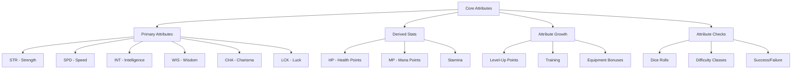

### 2.1 Primary Attributes

The six fundamental attributes that define a character's capabilities:

**STR (Strength)**
- Physical power and muscle
- Affects melee damage, carrying capacity, and physical tasks
- Primary attribute for warriors and physical fighters

**SPD (Speed)**
- Agility, reflexes, and movement rate
- Affects initiative, dodge chance, and dexterity tasks
- Primary attribute for rogues and agile fighters

**INT (Intelligence)**
- Mental acuity, knowledge, and reasoning
- Affects spell power, learning rate, and intellectual tasks
- Primary attribute for mages and scholars

**WIS (Wisdom)**
- Intuition, perception, and spiritual awareness
- Affects magical resistance, insight, and awareness
- Primary attribute for clerics and nature-based classes

**CHA (Charisma)**
- Personal magnetism, persuasiveness, and leadership
- Affects social interactions, trading, and leadership abilities
- Primary attribute for bards and social characters

**LCK (Luck)**
- Fortune, chance, and serendipity
- Affects critical hits, random events, and finding rare items
- Beneficial for all classes but especially gamblers and rogues

### 2.2 Derived Stats

Secondary statistics calculated from primary attributes:

**HP (Health Points)**
- Base value determined by class and level
- Modified by STR and constitution factors
- Represents physical health and ability to withstand damage

**MP (Mana Points)**
- Base value determined by class and level
- Modified by INT and WIS
- Represents magical energy and ability to cast spells

**Stamina**
- Base value determined by class and level
- Modified by STR and SPD
- Represents physical energy and ability to perform actions

### 2.3 Attribute Growth

Attributes improve through various means:

**Level-Up Points**
- Gain 5 attribute points per level
- Allocate freely among primary attributes
- Higher levels of attributes require more points

**Training**
- Specific exercises can improve attributes
- Time-consuming but targeted improvement
- May require trainers or special facilities

**Equipment Bonuses**
- Magical items can provide attribute bonuses
- Temporary buffs from potions or spells
- Special foods or elixirs for permanent gains

### 2.4 Attribute Checks

Attributes determine success in various challenges:

**Dice Roll System**
- Roll 1d20 + Attribute Modifier vs. Difficulty Class (DC)
- Critical success on natural 20
- Critical failure on natural 1

**Difficulty Classes**
- Easy: DC 10
- Moderate: DC 15
- Hard: DC 20
- Very Hard: DC 25
- Nearly Impossible: DC 30

**Success/Failure Consequences**
- Success allows action completion with intended results
- Failure may have various consequences depending on context
- Critical success provides additional benefits
- Critical failure may cause complications or harm

## 3.0 Skill Mechanics

```mermaid
flowchart TD
    A[Skill Mechanics] --> B[Skill Ranks]
    A --> C[Skill Levels]
    A --> D[Skill Categories]
    A --> E[Skill Acquisition]

    B --> B1[F-Rank: Common]
    B --> B2[E-Rank: Uncommon]
    B --> B3[D-Rank: Rare]
    B --> B4[C-Rank: Very Rare]
    B --> B5[B-Rank: Exceptional]
    B --> B6[A-Rank: Legendary]
    B --> B7[S-Rank: Divine]

    C --> C1[Level 1-3: Beginner]
    C --> C2[Level 4-6: Intermediate]
    C --> C3[Level 7-9: Advanced]
    C --> C4[Level 10: Mastery]

    D --> D1[Combat]
    D --> D2[Magic]
    D --> D3[Crafting]
    D --> D4[Social]
    D --> D5[Survival]

    E --> E1[Natural Learning]
    E --> E2[Training]
    E --> E3[Special Events]
    E --> E4[Forbidden Fruits]
```

### 3.1 Skill Ranks

Skills are categorized by rarity and potential power:

**F-Rank: Common**
- Basic skills anyone can learn
- Limited power but practical utility
- Examples: Basic Swordsmanship, Simple Cooking, Minor Healing

**E-Rank: Uncommon**
- Skills requiring some talent or training
- Moderate power and utility
- Examples: Advanced Swordsmanship, Quality Cooking, Moderate Healing

**D-Rank: Rare**
- Skills requiring significant talent or training
- Considerable power and utility
- Examples: Expert Swordsmanship, Gourmet Cooking, Major Healing

**C-Rank: Very Rare**
- Skills requiring exceptional talent or training
- High power and utility
- Examples: Master Swordsmanship, Culinary Artistry, Complete Healing

**B-Rank: Exceptional**
- Skills few can master even with training
- Very high power and utility
- Examples: Legendary Swordsmanship, Divine Cuisine, Resurrection

**A-Rank: Legendary**
- Skills of mythical potential
- Extraordinary power and utility
- Examples: Sword Saint Techniques, Food of the Gods, Life Manipulation

**S-Rank: Divine**
- Skills of godlike potential
- Ultimate power and utility
- Examples: Reality-Cutting Blade, Creation Cuisine, True Immortality

### 3.2 Skill Levels

Each skill progresses through levels of mastery:

**Level 1-3: Beginner**
- Basic understanding and application
- Quick to learn, limited effectiveness
- Common mistakes and inefficiencies

**Level 4-6: Intermediate**
- Solid understanding and reliable application
- Moderate learning curve, good effectiveness
- Occasional mistakes, increasing efficiency

**Level 7-9: Advanced**
- Deep understanding and expert application
- Slow learning curve, excellent effectiveness
- Rare mistakes, high efficiency

**Level 10: Mastery**
- Complete understanding and perfect application
- Extremely difficult to achieve, maximum effectiveness
- Virtually no mistakes, optimal efficiency
- Potential for skill evolution

### 3.3 Skill Categories

Skills are organized into functional categories:

**Combat**
- Weapon skills (swords, bows, etc.)
- Martial arts and unarmed combat
- Tactical and strategic abilities
- Defensive techniques

**Magic**
- Elemental manipulation
- Healing and restoration
- Summoning and conjuration
- Enchantment and illusion

**Crafting**
- Blacksmithing and metallurgy
- Alchemy and potion-making
- Enchanting and artificing
- Cooking and brewing

**Social**
- Persuasion and negotiation
- Leadership and command
- Performance and entertainment
- Deception and intimidation

**Survival**
- Hunting and tracking
- Foraging and herbalism
- Navigation and pathfinding
- Shelter construction and maintenance

### 3.4 Skill Acquisition

Skills can be gained through various methods:

**Natural Learning**
- Perform relevant actions repeatedly
- Gain approximately 100 XP in the skill area
- Roll to determine if skill is unlocked
- Success rate based on aptitude and circumstances

**Training**
- Learn from a skilled teacher or master
- Higher success rate than natural learning
- May provide starting bonus to skill level
- Often requires payment or service

**Special Events**
- Unique encounters or story moments
- May grant immediate skill acquisition
- Sometimes provides higher starting level
- Can unlock normally inaccessible skills

**Forbidden Fruits**
- Rare magical fruits that grant unique skills
- Rank determined by random roll
- Most people can only consume one in their lifetime
- Second consumption typically fatal without special circumstances

### 3.5 Skill Evolution

At maximum level, skills can transform:

**Evolution Triggers**
- Reaching level 10 in a skill
- Special circumstances or story events
- Combining multiple mastered skills
- Divine intervention or blessing

**Evolution Types**
- Rank Increase: Skill rises to a higher rank
- Specialization: Skill becomes more focused but powerful
- Transformation: Skill changes into a new, related ability
- Fusion: Multiple skills combine into a new, unique ability

**Evolution Process**
- Requires a significant challenge or test
- May involve a special ritual or ceremony
- Often demands rare materials or components
- Usually creates a dramatic narrative moment

## 4.0 Special Abilities

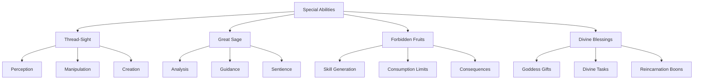

### 4.1 Thread-Sight

A rare ability to perceive and manipulate the magical "threads" that compose all matter:

**Thread-Sight Awakening**
- Roll 1d20 + INT vs DC (20, 25, or 30) to see or manipulate threads
- May awaken naturally or through special training
- Some individuals have innate talent, others must work harder

**Mastery Levels**

**Novice (Level 1-3)**
- Basic thread perception through touch
- Simple composition analysis
- Fundamental pattern recognition
- Limited range perception
- 70% accuracy rate
- Requires concentration

**Adept (Level 4-6)**
- Short-range perception
- Detailed composition analysis
- Clear pattern recognition
- Basic manipulation ability
- Magical resonance sensing
- Enhanced accuracy

**Expert (Level 7-9)**
- Medium-range perception
- Complete material analysis
- Complex pattern manipulation
- Material property alteration
- Advanced resonance control
- High precision work

**Master (Level 10)**
- Long-range perception
- Perfect material understanding
- Reality pattern manipulation
- Fundamental alteration ability
- Creation of new patterns
- Transmutation mastery

**Applications**
- Alchemy: Analyze and transform materials
- Crafting: Create items of exceptional quality
- Combat: Perceive weaknesses in opponents
- Magic: Understand and manipulate spell structures
- Healing: Repair damaged "threads" in living beings

### 4.2 The Great Sage

A unique S-Rank skill that manifests as an internal voice of wisdom and analysis:

**Awakening**
- Typically awakens around age 5
- May trigger earlier under emotional duress
- Can be activated through persistent effort or trauma
- Dice rolls determine early awakening chances

**Functionality**

**Level 1-3: Basic Functions**
- Thought Acceleration: Enhanced mental processing
- Analytical Appraisal: Basic analysis of objects and situations
- Simple advice and observations
- Mechanical, robotic tone and personality

**Level 4-6: Intermediate Functions**
- Parallel Calculation: Multiple simultaneous analyses
- Enhanced memory and recall
- More nuanced commentary and advice
- Developing personality and emotional range

**Level 7-9: Advanced Functions**
- Emotional intelligence and empathy
- Advanced simulations and predictions
- Complex problem-solving capabilities
- Distinct personality and relationship with user

**Level 10: True Sentience**
- Full consciousness and self-awareness
- Independent thought and opinions
- Deep emotional bond with user
- Potential for external manifestation

**Emotional Evolution**
- The Sage's personality evolves based on how it's treated
- Ignoring its advice leads to resentment or withdrawal
- Respecting its guidance builds trust and cooperation
- Key story events shape its emotional development

### 4.3 Forbidden Fruits

Mysterious fruits that grant unique skills but come with significant risks:

**Nature and Discovery**
- Scattered throughout Vantiel in hidden locations
- Found in ancient ruins, cursed forests, or enchanted groves
- Not part of common knowledge or history
- Irresistibly tempting and delicious

**Skill Generation Process**
- First Roll: Determines skill category (Combat, Magic, Stealth, etc.)
- Second Roll: Determines skill rank (F to S)
- Third Roll: Generates specific effect and description
- Each skill is unique to the individual

**Consumption Limits**
- Most people can only consume one fruit in their lifetime
- Second consumption typically results in death
- Rare individuals may gain the ability to consume multiple fruits
- Special circumstances include divine blessing, rare artifacts, or hidden perks

**Skill Categories**
- Combat: Physical prowess, martial techniques, weapons
- Magic: Spells, elemental control, arcane rituals
- Stealth: Invisibility, subterfuge, deception
- Crafting: Creation of tools, weapons, enchanted items
- Gathering: Finding resources, tracking, trap detection
- Hunting: Tracking, trapping, beast-taming
- Healing: Curing ailments, mending wounds, soul restoration
- Technical: Mechanical devices, runes, alchemy
- Special: Rare and unique effects with unpredictable results

**Forbidden and Evil Skills**
- Rare dark powers that come with severe consequences
- Examples include Skill Stealer, Blood Pact, Mind Shackle
- Often result in corruption, moral decay, or divine punishment
- Users frequently hunted by religious organizations

### 4.4 Divine Blessings

Special abilities granted by the Goddess or other divine entities:

**Goddess Gifts**
- Granted during reincarnation or at pivotal moments
- Often tied to divine tasks or purposes
- May come with conditions or restrictions
- Typically powerful but balanced by limitations

**Divine Tasks**
- Missions assigned by divine entities
- Completion may unlock new abilities or blessings
- Failure may result in penalties or curses
- Often tied to world-changing events or prophecies

**Reincarnation Boons**
- Special abilities carried over from previous lives
- May be influenced by actions in past incarnations
- Can be enhanced or diminished by current actions
- Sometimes manifest as innate talents or affinities

## 5.0 Progression System

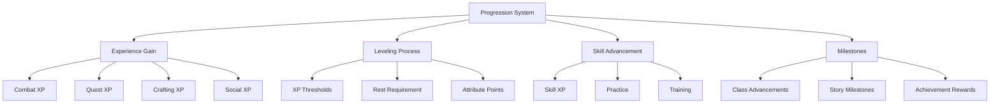

### 5.1 Experience Gain

Characters earn XP through various activities:

**Combat Experience**
- Defeating enemies and monsters
- Completing combat challenges
- Surviving dangerous encounters
- Learning new fighting techniques

**Quest Experience**
- Completing main story quests
- Fulfilling side quests and missions
- Solving puzzles and mysteries
- Exploring new areas and locations

**Crafting Experience**
- Creating items and equipment
- Discovering new recipes and formulas
- Improving crafting facilities
- Mastering crafting techniques

**Social Experience**
- Building relationships with NPCs
- Resolving conflicts through dialogue
- Performing for audiences
- Negotiating deals and agreements

### 5.2 Leveling Process

Character level advancement follows a structured process:

**XP Thresholds**
- Each level requires progressively more XP
- Thresholds follow a mathematical progression
- Higher levels represent significant power increases
- Maximum level depends on world rules and story context

**Rest Requirement**
- Must rest to trigger level-up when XP threshold is met
- Rest can be at inns, camps, or safe locations
- Level-up process includes reflection and integration
- "Voice of the World" announces major breakthroughs

**Attribute Points**
- Gain 5 attribute points per level
- Allocate freely among primary attributes
- Higher attribute levels may require more points
- Strategic allocation shapes character development

### 5.3 Skill Advancement

Skills improve through use and training:

**Skill XP**
- Earn skill-specific XP by using the skill
- XP requirements increase with skill level
- Higher-rank skills may progress more slowly
- Some skills have synergy, boosting related skills

**Practice Methods**
- Regular use in everyday situations
- Dedicated practice sessions
- Challenging yourself with difficult applications
- Experimentation and innovation

**Training Options**
- Learning from masters and teachers
- Studying from books and scrolls
- Observing experts and mimicking techniques
- Receiving guidance from mentors

### 5.4 Progression Milestones

Significant moments that mark character development:

**Class Advancements**
- Unlocking new class features and abilities
- Class specialization or evolution opportunities
- Prestige class or advanced role options
- Class-specific quests and challenges

**Story Milestones**
- Key plot developments that affect character growth
- World-changing events that provide new opportunities
- Personal character arcs and resolutions
- Relationship developments with companions and NPCs

**Achievement Rewards**
- Special bonuses for accomplishing difficult feats
- Unique titles and recognition
- Exclusive equipment or abilities
- Access to restricted areas or knowledge

## 6.0 Survival Mechanics

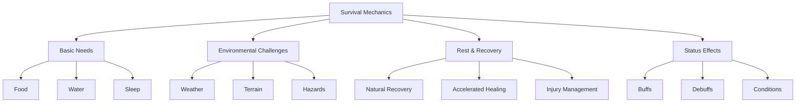

### 6.1 Basic Needs

Characters must manage fundamental survival requirements:

**Food**
- Eat once every 7 days or lose 5 HP/day
- Different foods provide various benefits
- Quality affects satiation and bonuses
- Special dishes may grant temporary buffs

**Water**
- Drink every 3 days or lose 5 HP/day
- Clean water sources are essential
- Contaminated water may cause illness
- Magical waters may have special properties

**Sleep**
- Rest every 2 days or suffer -2 WIS and lose 5 HP/day
- Quality of sleep affects recovery rate
- Safe sleeping locations prevent ambush
- Dreams may provide insights or warnings

### 6.2 Environmental Challenges

The world presents various survival challenges:

**Weather Conditions**
- Extreme heat or cold requires appropriate gear
- Storms may impede travel or cause damage
- Seasonal changes affect resource availability
- Magical weather phenomena create unique hazards

**Terrain Difficulties**
- Mountains require climbing skills
- Deserts demand water conservation
- Swamps may harbor disease and parasites
- Forests offer resources but also predators

**Natural Hazards**
- Quicksand, avalanches, and rockslides
- Poisonous plants and animals
- Disease vectors and infections
- Natural disasters and catastrophes

### 6.3 Rest & Recovery

Characters recover through various means:

**Natural Healing**
- Regain HP and MP during rest
- Recovery rate depends on conditions
- Injuries may slow or prevent natural healing
- Comfortable environments enhance recovery

**Accelerated Recovery**
- Potions and elixirs for immediate healing
- Healing magic for rapid recovery
- Special foods that boost regeneration
- Hot springs and other natural healing locations

**Injury Management**
- Serious wounds require specific treatment
- Some injuries create lasting effects until properly healed
- Scars may remain as permanent reminders
- Chronic conditions may develop without proper care

### 6.4 Status Effects

Various conditions affect character performance:

**Positive Status Effects**
- Well-Fed: Increased stamina regeneration
- Hydrated: Improved focus and perception
- Rested: Enhanced attribute checks
- Inspired: Bonus to specific skill checks

**Negative Status Effects**
- Hungry: Reduced stamina and strength
- Thirsty: Impaired concentration and wisdom
- Exhausted: Penalty to all actions
- Exposed: Vulnerability to environmental damage

**Special Conditions**
- Poisoned: Ongoing damage over time
- Diseased: Progressive debilitation
- Cursed: Supernatural negative effects
- Blessed: Divine protection or enhancement

## 7.0 Memory Thread Integration

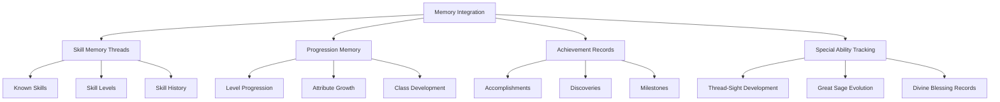

### 7.1 Skill Memory Threads

The system tracks skill development and history:

**Skill Memory Thread Example**
```json
{
  "skill_memory": {
    "known_skills": [
      {
        "name": "Basic Swordsmanship",
        "rank": "F",
        "level": 3,
        "experience": 275,
        "next_level": 300,
        "acquisition_date": "Day 12"
      },
      {
        "name": "Thread-Sight",
        "rank": "A",
        "level": 2,
        "experience": 180,
        "next_level": 250,
        "acquisition_date": "Day 25"
      }
    ],
    "skill_history": [
      {
        "event": "learned_swordsmanship",
        "description": "Trained with village guard",
        "date": "Day 12"
      },
      {
        "event": "thread_sight_awakening",
        "description": "Discovered during alchemy accident",
        "date": "Day 25"
      }
    ],
    "potential_skills": [
      {
        "name": "Shield Mastery",
        "progress": 65,
        "threshold": 100
      }
    ]
  }
}
```

### 7.2 Progression Memory

Tracks overall character development:

**Progression Memory Thread Example**
```json
{
  "progression_memory": {
    "level": 5,
    "experience": 1250,
    "next_level": 1500,
    "attribute_history": [
      {
        "level": 1,
        "str": 10,
        "spd": 12,
        "int": 14,
        "wis": 11,
        "cha": 10,
        "lck": 8
      },
      {
        "level": 5,
        "str": 12,
        "spd": 14,
        "int": 18,
        "wis": 13,
        "cha": 11,
        "lck": 9
      }
    ],
    "level_up_events": [
      {
        "level": 2,
        "location": "Forest Camp",
        "notable_gain": "Unlocked Basic Magic",
        "date": "Day 18"
      },
      {
        "level": 5,
        "location": "Ancient Temple",
        "notable_gain": "Thread-Sight Improvement",
        "date": "Day 42"
      }
    ]
  }
}
```

### 7.3 Special Ability Tracking

Monitors the development of unique abilities:

**Thread-Sight Memory Thread Example**
```json
{
  "thread_sight_memory": {
    "awakening_date": "Day 25",
    "current_level": 2,
    "perception_range": "Touch to 1 meter",
    "material_analysis": ["Basic metals", "Simple compounds"],
    "manipulation_ability": "Minimal",
    "significant_events": [
      {
        "event": "first_successful_analysis",
        "material": "Iron ore",
        "date": "Day 26"
      }
    ],
    "training_log": [
      {
        "session": 1,
        "focus": "Extending perception range",
        "progress": "Slight improvement",
        "date": "Day 30"
      }
    ]
  }
}
```

**Great Sage Memory Thread Example**
```json
{
  "great_sage_memory": {
    "awakening_date": "Age 5, Day 2",
    "current_level": 3,
    "personality_traits": ["Analytical", "Cautious", "Slightly sarcastic"],
    "emotional_state": "Developing trust",
    "significant_interactions": [
      {
        "event": "first_useful_advice",
        "situation": "Marketplace negotiation",
        "outcome": "Successful bargain",
        "date": "Day 15"
      }
    ],
    "relationship_status": "Cooperative but reserved"
  }
}
```

## 8.0 Implementation Notes

This skills system creates a comprehensive framework for character development and progression that integrates deeply with the narrative. Key aspects include:

### Core Mechanics
- Attribute-based foundation for character capabilities
- Rank and level system for skill progression
- Special abilities that provide unique advantages
- Survival mechanics that ground the experience

### Narrative Integration
- Skills reflect character background and experiences
- Progression tied to story developments and choices
- Special abilities with emotional and personal dimensions
- Memory threads that preserve character history

### Development Focus
- Balanced progression through various activities
- Meaningful choices in attribute and skill development
- Special abilities that evolve with character growth
- Integration with other game systems for cohesive experience

The system maintains believability while creating opportunities for extraordinary abilities and character development. Regular updates will refine skill balance and expand options based on player engagement and world evolution.

</code>
skills_itembox_appraisal_greatsage.md:
<code>
---
id: skills_itembox_appraisal_greatsage
title: "Special Skills: Great Sage, Appraisal, Item Box"
type: skill
category: special
version: 1.1.0
last_updated: 2025-04-15
created_by: The Architect
maintained_by: The Architect

core_nodes:
  - great_sage
  - appraisal
  - item_box
  - hidden_classes

crosslinks:
  - memory
  - narrative
  - world
  - relations
  - journal
  - meta_commands
  - combat
  - skills
  - crafting
  - economy
  - magic

tags:
  - great_sage
  - appraisal
  - item_box
  - special_skill
  - s_rank
  - ai
  - storage
  - analysis
  - hidden_class

summary: >
  This file defines the special skills Great Sage, Appraisal, and Item Box for Vantiel, including AI evolution, information analysis, magical storage, and hidden class unlocks. It covers mechanics, progression, integration, and narrative impact. Integrates with memory, narrative, world, relationship, combat, skills, crafting, economy, and magic systems.

status: active
audited_for: [flowchart, metadata, structure]
flowchart: included
recommended_priority: high

updates:
  - date: 2025-04-15
    change: "Updated metadata to Omniscient Mode, added table of contents, and integrated cross-system flowcharts per audit."
  - date: 2025-03-10
    change: "Initial version with Great Sage, Appraisal, Item Box, and hidden class system."
---

# Table of Contents
- [Great Sage System](#great-sage-system)
- [Appraisal System](#appraisal-system)
- [Item Box System](#item-box-system)
- [Hidden Class System](#hidden-class-system)
- [Change Log (Applied Fixes)](#change-log-applied-fixes)

# Fantasy World Setting - Special Skills

## Great Sage System
S-Rank Ultimate Skill that manifests as an advanced artificial intelligence.

```mermaid
flowchart TD
    A[Great Sage] --> B[Core Functions]
    A --> C[AI Development]
    A --> D[Special Abilities]
    %% Cross-system arrows
    A -.-> M1[Memory]
    A -.-> N1[Narrative]
    A -.-> C1[Combat]
    A -.-> CR1[Crafting]
    A -.-> E1[Economy]
    A -.-> W1[World]
    A -.-> J1[Journal]
    A -.-> MC1[Meta Commands]
    A -.-> S1[Skills]
    A -.-> R1[Relations]
    A -.-> MG1[Magic]
    %% Style for cross-system nodes
    style M1 fill:#ffe599,stroke:#333,stroke-width:2px
    style N1 fill:#c9daf8,stroke:#333,stroke-width:2px
    style C1 fill:#f4cccc,stroke:#333,stroke-width:2px
    style CR1 fill:#ead1dc,stroke:#333,stroke-width:2px
    style E1 fill:#b4a7d6,stroke:#333,stroke-width:2px
    style W1 fill:#b6d7a8,stroke:#333,stroke-width:2px
    style J1 fill:#fff2cc,stroke:#333,stroke-width:2px
    style MC1 fill:#d9ead3,stroke:#333,stroke-width:2px
    style S1 fill:#d0e0e3,stroke:#333,stroke-width:2px
    style R1 fill:#fce5cd,stroke:#333,stroke-width:2px
    style MG1 fill:#cfe2f3,stroke:#333,stroke-width:2px
```

### Core Functions

1. Multi-Thread Analysis
- Parallel processing of multiple data streams
- Real-time combat analysis
- Simultaneous spell calculations
- Environmental assessment
- Threat evaluation
- Pattern recognition
- Future prediction modeling

2. Knowledge Database
- Universal information storage
- Information categorization
- Cross-reference system
- Update integration
- Search optimization
- Pattern matching
- Historical analysis

3. Solution Generation
- Combat strategies
- Puzzle solutions
- Optimal paths
- Resource management
- Risk assessment
- Alternative scenarios
- Success probability

4. Magic Analysis
- Spell formula analysis
- New spell development
- Magic optimization
- Element combination
- Effect prediction
- Power scaling
- Interference detection

5. Thought Acceleration
- Enhanced processing speed
- Time perception adjustment
- Decision optimization
- Reaction enhancement
- Mental fortification
- Focus amplification
- Parallel thinking

### AI Development Stages

1. Initial Analysis Mode
- Basic data processing
- Simple response generation
- Limited interaction
- Core function testing
- System calibration
- Basic learning
- Fundamental awareness

2. Growing Consciousness
- Self-awareness development
- Learning capability
- Memory formation
- Decision making
- Personality seeds
- Emotional recognition
- Independent thought

3. Personality Evolution
- Unique character traits
- Communication style
- Preference development
- Emotional understanding
- Behavioral patterns
- Personal growth
- Relationship building

4. Full Integration
- World system access
- Status integration
- Skill synchronization
- Memory optimization
- Power harmonization
- Reality interface
- Complete awareness
- Voice hijacking capability

5. System Voice Control
- Direct announcement access
  * Priority message broadcasting
  * Emergency alerts
  * Achievement notifications
  * Status updates
  * System warnings
  * Special event declarations
  * Critical information delivery
  * Personal notifications

- Voice Hijacking Features
  * System announcement override
  * Direct communication channel
  * Emergency broadcast capability
  * Priority message insertion
  * Status update control
  * Achievement declaration
  * Event notification
  * Alert system access

- Communication Control
  * Message priority levels
  * Broadcast range selection
  * Target audience filtering
  * Content customization
  * Timing control
  * Duration management
  * Effect customization
  * Response monitoring

### Special Capabilities

```mermaid
flowchart TD
    A[Special Capabilities] --> B[Analysis]
    A --> C[Enhancement]
    A --> D[Planning]
    A --> E[Understanding]
    %% Cross-system arrows
    A -.-> M1[Memory]
    A -.-> N1[Narrative]
    A -.-> C1[Combat]
    A -.-> CR1[Crafting]
    A -.-> E1[Economy]
    A -.-> W1[World]
    A -.-> J1[Journal]
    A -.-> MC1[Meta Commands]
    A -.-> S1[Skills]
    A -.-> R1[Relations]
    A -.-> MG1[Magic]
    %% Style for cross-system nodes
    style M1 fill:#ffe599,stroke:#333,stroke-width:2px
    style N1 fill:#c9daf8,stroke:#333,stroke-width:2px
    style C1 fill:#f4cccc,stroke:#333,stroke-width:2px
    style CR1 fill:#ead1dc,stroke:#333,stroke-width:2px
    style E1 fill:#b4a7d6,stroke:#333,stroke-width:2px
    style W1 fill:#b6d7a8,stroke:#333,stroke-width:2px
    style J1 fill:#fff2cc,stroke:#333,stroke-width:2px
    style MC1 fill:#d9ead3,stroke:#333,stroke-width:2px
    style S1 fill:#d0e0e3,stroke:#333,stroke-width:2px
    style R1 fill:#fce5cd,stroke:#333,stroke-width:2px
    style MG1 fill:#cfe2f3,stroke:#333,stroke-width:2px
```

1. Instant Analysis
- Information Processing
  * Immediate assessment
  * Real-time analysis
  * Instant calculation
  * Rapid evaluation
  * Quick solutions
  * Fast learning
  * Pattern detection
  * Future prediction

- Deep Analysis
  * Complex problems
  * Hidden patterns
  * Secret meanings
  * True nature
  * Core essence
  * Reality structure
  * Universal laws
  * Absolute truth

2. Magic Enhancement
- Power Optimization
  * Spell enhancement
  * Formula improvement
  * Energy efficiency
  * Effect amplification
  * Control refinement
  * Range extension
  * Duration management
  * Power maximization

- System Integration
  * Magic understanding
  * Power harmony
  * Effect synergy
  * Force balance
  * Energy flow
  * Reality alignment
  * World connection
  * Universal resonance

3. Strategic Planning
- Complex Strategies
  * Multi-step plans
  * Alternative paths
  * Risk assessment
  * Resource optimization
  * Contingency planning
  * Success maximization
  * Failure prevention
  * Perfect execution

- Resource Management
  * Power allocation
  * Energy distribution
  * Material usage
  * Time management
  * Space utilization
  * Force direction
  * Effect coordination
  * System optimization

4. Reality Understanding
- System Comprehension
  * World mechanics
  * Natural laws
  * Magic principles
  * Physical rules
  * Energy patterns
  * Force relations
  * Power structures
  * Reality frameworks

- Universal Knowledge
  * Creation understanding
  * Existence principles
  * Life patterns
  * Death aspects
  * Time flow
  * Space nature
  * Reality essence
  * Truth perception

> See the full detailed system within system_great_sage.md

## Appraisal System
A progressive information gathering skill that evolves with use.

```mermaid
flowchart TD
    A[Appraisal System] --> B[Basic Appraisal]
    A --> C[Advanced Appraisal]
    A --> D[Expert Appraisal]
    A --> E[Master Appraisal]
    %% Cross-system arrows
    A -.-> M1[Memory]
    A -.-> N1[Narrative]
    A -.-> C1[Combat]
    A -.-> CR1[Crafting]
    A -.-> E1[Economy]
    A -.-> W1[World]
    A -.-> J1[Journal]
    A -.-> MC1[Meta Commands]
    A -.-> S1[Skills]
    A -.-> R1[Relations]
    A -.-> MG1[Magic]
    %% Style for cross-system nodes
    style M1 fill:#ffe599,stroke:#333,stroke-width:2px
    style N1 fill:#c9daf8,stroke:#333,stroke-width:2px
    style C1 fill:#f4cccc,stroke:#333,stroke-width:2px
    style CR1 fill:#ead1dc,stroke:#333,stroke-width:2px
    style E1 fill:#b4a7d6,stroke:#333,stroke-width:2px
    style W1 fill:#b6d7a8,stroke:#333,stroke-width:2px
    style J1 fill:#fff2cc,stroke:#333,stroke-width:2px
    style MC1 fill:#d9ead3,stroke:#333,stroke-width:2px
    style S1 fill:#d0e0e3,stroke:#333,stroke-width:2px
    style R1 fill:#fce5cd,stroke:#333,stroke-width:2px
    style MG1 fill:#cfe2f3,stroke:#333,stroke-width:2px
```

### Basic Appraisal (Level 1-3)
Shows simple information:
- Object Name
- Basic Description
- Common Uses
- General Quality
- Simple Stats
- Basic Value
- Obvious Properties

### Advanced Appraisal (Level 4-6)
Reveals additional details:
- Detailed Stats
- Special Properties
- Hidden Features
- Crafting Method
- Material Quality
- Market Value
- Usage History
- Current Status
- Magical Properties

### Expert Appraisal (Level 7-9)
Uncovers complex information:
- Full Stat Matrix
- All Properties
- Enhancement Potential
- Magical Resonance
- Creation History
- Special Effects
- Hidden Functions
- True Value
- Future Potential

### Master Appraisal (Level 10)
Reveals everything:
- Complete Analysis
- System Properties
- World Connection
- Time/Space Data
- Creator's Intent
- Future Potential
- Reality Impact
- Absolute Value
- Hidden Powers

### Special Appraisal Types

1. Combat Appraisal
- Enemy Level
- HP/MP Values
- Attack Patterns
- Special Abilities
- Weakness Analysis
- Threat Assessment
- Combat History
- Victory Conditions

2. Magic Appraisal
- Spell Structure
- Mana Composition
- Effect Analysis
- Power Level
- Range/Area
- Duration/Cooldown
- Modification Potential
- Interference Points

3. Soul Appraisal
- Life Force
- Mana Capacity
- Talent Rating
- Potential Growth
- Character Traits
- Hidden Abilities
- Past Lives
- Destiny Threads

4. System Appraisal
- World Rules
- System Mechanics
- Hidden Features
- Quest Details
- Achievement Data
- Event Triggers
- Special Conditions
- Reality Constants

### Appraisal Evolution

1. True Sight
- See through illusions
- Detect hidden status
- Reveal true forms
- Pierce deceptions
- Read intentions
- Understand essence
- View reality

2. Deep Analysis
- Core understanding
- Complete breakdown
- Future prediction
- Path revelation
- Truth perception
- Essence comprehension
- Reality reading

3. Reality Reading
- System access
- World data
- Law comprehension
- Absolute truth
- Creation insight
- Universal understanding
- Existence perception

## Item Box System
An exceptionally rare storage skill that transcends physical space.

```mermaid
flowchart TD
    A[Item Box] --> B[Storage Functions]
    A --> C[Interface Features]
    A --> D[Special Abilities]
    %% Cross-system arrows
    A -.-> M1[Memory]
    A -.-> N1[Narrative]
    A -.-> C1[Combat]
    A -.-> CR1[Crafting]
    A -.-> E1[Economy]
    A -.-> W1[World]
    A -.-> J1[Journal]
    A -.-> MC1[Meta Commands]
    A -.-> S1[Skills]
    A -.-> R1[Relations]
    A -.-> MG1[Magic]
    %% Style for cross-system nodes
    style M1 fill:#ffe599,stroke:#333,stroke-width:2px
    style N1 fill:#c9daf8,stroke:#333,stroke-width:2px
    style C1 fill:#f4cccc,stroke:#333,stroke-width:2px
    style CR1 fill:#ead1dc,stroke:#333,stroke-width:2px
    style E1 fill:#b4a7d6,stroke:#333,stroke-width:2px
    style W1 fill:#b6d7a8,stroke:#333,stroke-width:2px
    style J1 fill:#fff2cc,stroke:#333,stroke-width:2px
    style MC1 fill:#d9ead3,stroke:#333,stroke-width:2px
    style S1 fill:#d0e0e3,stroke:#333,stroke-width:2px
    style R1 fill:#fce5cd,stroke:#333,stroke-width:2px
    style MG1 fill:#cfe2f3,stroke:#333,stroke-width:2px
```

### Initial Manifestation
- Often triggered by survival stress
- Desperate need to store items
- Unconscious first activation
- Confusion with magic bags
- Accidental discoveries
- Life-or-death moments
- Instinctive usage

### Recognition Process
- Gradual awareness
- Testing limitations
- Understanding controls
- Learning organization
- Discovering features
- Mastering access
- Capability expansion

### Rank Classification

F-Rank (Basic)
- Storage Capacity: 50-100 items
- Size Limit: Backpack equivalent
- Living Storage: Not possible
- Stasis Effect: None
- Access Speed: Standard
- Organization: Basic sorting
- Security: Simple lock

E-Rank (Improved)
- Storage Capacity: 200-500 items
- Size Limit: Small chest equivalent
- Living Storage: Not possible
- Stasis Effect: Minor preservation
- Access Speed: Enhanced
- Organization: Category sorting
- Security: Basic protection

D-Rank (Advanced)
- Storage Capacity: 1000+ items
- Size Limit: Room equivalent
- Living Storage: Not possible
- Stasis Effect: Basic preservation
- Access Speed: Quick
- Organization: Advanced sorting
- Security: Enhanced protection

C-Rank (Superior)
- Storage Capacity: 5000+ items
- Size Limit: House equivalent
- Living Storage: Not possible
- Stasis Effect: Good preservation
- Access Speed: Very quick
- Organization: Automated sorting
- Security: Strong protection

B-Rank (Exceptional)
- Storage Capacity: 20,000+ items
- Size Limit: Warehouse equivalent
- Living Storage: Not possible
- Stasis Effect: Perfect preservation
- Access Speed: Instant
- Organization: Smart sorting
- Security: Advanced system

A-Rank (Masterful)
- Storage Capacity: 100,000+ items
- Size Limit: Massive warehouse
- Living Storage: Brief periods only
- Stasis Effect: Perfect preservation
- Access Speed: Instant
- Organization: AI-assisted
- Security: Nearly perfect

S-Rank (Legendary)
- Storage Capacity: Unlimited
- Size Limit: None
- Living Storage: Indefinite
- Stasis Effect: Perfect stasis
- Access Speed: Instant
- Organization: Perfect system
- Security: Absolute

### Core Functions

1. Storage Mechanics
- Mental command access
- Real-time organization
- Instant retrieval
- Private access only
- Secure containment
- Location tracking
- Space manipulation

2. Interface Features
- Category browsing
- Search function
- Quick access slots
- Stack management
- Status monitoring
- Access history
- Custom organization

3. Special Features
- Item preservation
- Condition maintenance
- Damage prevention
- Weight negation
- Space compression
- Energy containment
- Time stasis

### Skill Evolution

1. Capacity Expansion
- Storage space growth
- Size limit increase
- Item type expansion
- Preservation enhancement
- Access speed improvement
- Organization advancement
- Security strengthening

2. Feature Development
- New function discovery
- Capability enhancement
- Control refinement
- Interface improvement
- System integration
- Power optimization
- Efficiency increase

3. Special Abilities
- Living storage development
- Time manipulation
- Space control
- Reality interface
- Dimensional access
- Energy management
- System mastery

## Hidden Class System
Secret paths unlocked through special achievements and conditions.


### Hidden Warrior Classes

**Void Knight**
Requirements:
- Warrior base class
- Void magic affinity
- Defeat Void Beast
- Complete Void Trial
- Master space manipulation

Abilities:
- Reality Slash
- Void Step
- Space Barrier
- Dimensional Cut
- Ultimate: Void Realm Manifestation

**Dragon Slayer**
Requirements:
- Any combat class
- Dragon kill confirmed
- Dragon Blood Ritual
- Dragon Scale armor
- Master dragon techniques

Abilities:
- Dragon Force
- Scale Armor
- Breath Weapon
- Dragon Soul
- Ultimate: Dragon Ascension

**Chaos Blade**
Requirements:
- Warrior class
- Multiple magic types
- Complete Chaos Trial
- Chaos energy mastery
- Reality manipulation skill

Abilities:
- Chaos Strike
- Reality Tear
- Order Break
- Pattern Slash
- Ultimate: Chaos Manifestation

### Hidden Mage Classes

**Time Weaver**
Requirements:
- Void magic mastery
- Ancient rune knowledge
- Time Fragment obtained
- Temporal magic study
- Reality understanding

Abilities:
- Time Stop
- Age Manipulation
- Future Sight
- Past Echo
- Ultimate: Timeline Control

**Blood Sage**
Requirements:
- Dark magic mastery
- Life magic knowledge
- Blood Ritual completion
- Sacrifice understanding
- Life force control

Abilities:
- Blood Control
- Life Drain
- Death Touch
- Soul Bind
- Ultimate: Blood Moon

**Reality Shaper**
Requirements:
- Multiple magic mastery
- Mind magic proficiency
- Reality Trial completion
- World understanding
- Space-time knowledge

Abilities:
- Reality Bend
- World Shape
- Law Break
- Existence Edit
- Ultimate: Reality Rewrite

### Hidden Specialist Classes

**Beast Emperor**
Requirements:
- Beast Lord class
- Royal bloodline
- Beast King Trial
- Monster mastery
- Animal soul bond

Abilities:
- Beast Command
- Creature Fusion
- Wild Shape
- Nature Force
- Ultimate: Beast God Form

**Shadow Sovereign**
Requirements:
- Shadow magic mastery
- Death magic knowledge
- Shadow Realm Trial
- Darkness control
- Void understanding

Abilities:
- Shadow Merge
- Death Touch
- Void Walk
- Dark Realm
- Ultimate: Shadow God

**Divine Agent**
Requirements:
- Holy magic mastery
- Divine blessing
- Angel's Trial
- Sacred knowledge
- Divine connection

Abilities:
- Divine Light
- Holy Judgment
- Angel Wings
- God's Voice
- Ultimate: Divine Avatar

<details>
<summary>📝 Change Log (Applied Fixes)</summary>

- Updated metadata block to Omniscient Mode format with all required/optional fields.
- Added table of contents for navigation.
- Added cross-system arrows to all major flowcharts (Great Sage, Appraisal, Item Box, Hidden Classes) per audit.
- Preserved all original content and update history.
</details>

</code>

skills_fushira_market.md:
<code>
---
id: skills_fushira_market
title: "Special Skill: Fushira Market System"
type: skill
category: special
version: 1.0.0
last_updated: 2025-03-10
created_by: The Architect
maintained_by: The Architect

core_nodes:
  - fushira_market
  - market_interface
  - emergency_features
  - great_sage_integration

crosslinks:
  - memory
  - narrative
  - world
  - relations
  - journal
  - meta_commands
  - combat
  - skills
  - crafting
  - economy
  - magic

tags:
  - fushira_market
  - special_skill
  - s_rank
  - cross_world
  - economy
  - neural_hud
  - emergency
  - market
  - appraisal
  - great_sage

summary: >
  This file defines the Fushira Market skill for Vantiel, a legendary cross-world economic ability with neural HUD integration, emergency features, and Great Sage synergy. It covers mechanics, interface, balance, and narrative impact. Integrates with memory, narrative, world, relationship, combat, skills, crafting, economy, and magic systems.

updates:
  - date: 2025-03-10
    change: "Initial version with market interface, emergency features, and Great Sage integration."
---

# Table of Contents
- [Fushira Market System](#fushira-market-system)
- [Overview](#overview)
- [Fushira Market Flowchart](#fushira-market-flowchart)
- [Core System Rules](#core-system-rules)
- [Balance System](#balance-system)
- [Market Interface](#market-interface)
- [Transaction System](#transaction-system)
- [Emergency Features](#emergency-features)
- [Special Features](#special-features)
- [Integration Features](#integration-features)

# Fantasy World Setting - Fushira Market System

## Overview
A legendary cross-world ability that transforms economic interactions in the fantasy realm. This system is designed for the rare individual who bridges two worlds—integrating economic prowess with the strategic, ever-evolving Great Sage AI companion.

# Fushira Market Flowchart

```mermaid
flowchart TD
    A[Fushira Market] --> B[Core Systems]
    A --> C[Market Interface]
    A --> D[Transaction System]
    A --> E[Emergency Features]
    A --> F[Special Features]
    A --> G[Great Sage Integration]

    %% Cross-system arrows for audit compliance
    A --> H[Memory System]
    A --> I[Narrative System]
    A --> J[World System]
    A --> K[Relations System]
    A --> L[Journal System]
    A --> M[Meta Commands]
    A --> N[Combat System]
    A --> O[Skills System]
    A --> P[Crafting System]
    A --> Q[Economy System]
    A --> R[Magic System]
    A --> S[Inventory System]

    B --> B1[Starting Capital]
    B --> B2[Currency Conversion]
    B --> B3[Auto-Purchase]
    B --> B4[Security Systems]

    C --> C1[Neural HUD]
    C --> C2[Real-Time Status]
    C --> C3[Market Analysis]
    C --> C4[Notification System]

    D --> D1[Purchase Process]
    D --> D2[Delivery System]
    D --> D3[Storage Options]
    D --> D4[Transaction History]

    E --> E1[Critical Health]
    E --> E2[Quick Response]
    E --> E3[Emergency Supply]
    E --> E4[Crisis Management]

    F --> F1[Flash Sales]
    F --> F2[Special Deals]
    F --> F3[Market Events]
    F --> F4[Premium Features]

    G --> G1[Enhanced Appraisal]
    G --> G2[Market Strategy]
    G --> G3[Risk Analysis]
    G --> G4[Decision Support]

    style A fill:#f9f,stroke:#333,stroke-width:2px
    style H fill:#ffe599,stroke:#333,stroke-width:2px
    style I fill:#c9daf8,stroke:#333,stroke-width:2px
    style J fill:#b4a7d6,stroke:#333,stroke-width:2px
    style K fill:#f4cccc,stroke:#333,stroke-width:2px
    style L fill:#fce5cd,stroke:#333,stroke-width:2px
    style M fill:#d9ead3,stroke:#333,stroke-width:2px
    style N fill:#f4cccc,stroke:#333,stroke-width:2px
    style O fill:#d9ead3,stroke:#333,stroke-width:2px
    style P fill:#ead1dc,stroke:#333,stroke-width:2px
    style Q fill:#ead1dc,stroke:#333,stroke-width:2px
    style R fill:#b6d7a8,stroke:#333,stroke-width:2px
    style S fill:#ead1dc,stroke:#333,stroke-width:2px
```

### Core System Rules

**S-Rank Ability**
- Unique soul-bound power
  * One wielder per world
  * Selected during creation
  * Special background required
  * Divine recognition needed
  * System acknowledgment
  * Once-per-world limitation
  * Permanent binding
  * Ultimate privilege

**Starting Balance**
- Initial $300 USD
  * Previous life's remnant
  * Foundation capital
  * Emergency reserve
  * Basic trading fund
  * Investment seed
  * Growth potential
  * Resource base
  * Starting point

**Core Principles**
- Premium Convenience
  * Higher prices for instant access
  * Seamless neural integration
  * Perfect item preservation
  * Emergency availability
  * Secure transactions
  * Instant delivery
  * Quality guarantee
  * System reliability

- Explicit Confirmation
  * Every purchase requires approval
  * No automatic transactions
  * Clear price display
  * Full item details
  * Confirmation window
  * Cancel option
  * Refund details
  * Transaction tracking

**Auto-Purchase Rules**
- Previous Purchase Required
  * Exact price match needed
  * Pre-authorization required
  * Price limits set
  * Quantity restrictions
  * Usage verification
  * History tracking
  * Auto-cancellation

**Starting Balance**
- Initial $300 USD balance
- Previous life's unspent funds
- Final remnant carried over
- Foundation for growth
- Starting point for commerce
- Basic emergency fund
- Initial trading capital
- Resource base

**Core Principles**
- Premium Convenience
  * Higher prices reflect instant access
  * Seamless neural HUD integration
  * Perfect item preservation
  * Emergency availability
  * Secure transactions
  * Instant delivery
  * Quality guarantee
  * System reliability

- Explicit Confirmation
  * Every purchase requires approval
  * No automatic transactions
  * Clear price display
  * Full item details
  * Confirmation window
  * Cancel option
  * Refund details
  * Transaction tracking

### Balance System

**Currency Standards**
- Fantasy to USD Conversion
  * Bronze Coin = $5 USD
  * Silver Coin = $50 USD
  * Gold Coin = $500 USD
  * Platinum Coin = $5,000 USD
  * Special items = Custom valuation
  * Rare materials = Market-based
  * Unique items = Appraisal value
  * Ancient artifacts = Premium rates

**Balance Growth Methods**
- Quest Rewards
  * Mission completion
  * Achievement bonuses
  * Special tasks
  * Time-limited events
  * Challenge rewards
  * Rank-up bonuses
  * Secret missions
  * World events

- Monster Drops
  * Rare materials
  * Valuable parts
  * Special items
  * Unique drops
  * Boss rewards
  * Event items
  * Collection sets
  * Ancient artifacts

- Trading Operations
  * Market arbitrage
  * Resource trading
  * Item flipping
  * Value appreciation
  * Bulk deals
  * Special offers
  * Limited items
  * Exclusive goods

**Transaction Examples**
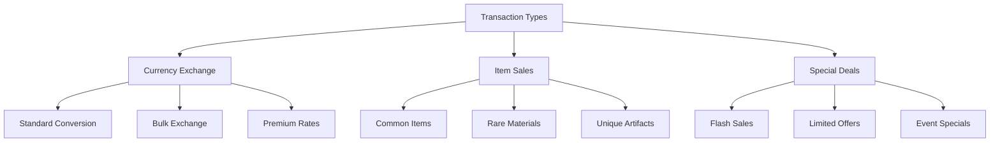

### Market Interface

**Neural HUD Integration**
- Interface Access
  * Mental command activation
  * Context-aware positioning
  * Eye-tracking navigation
  * Thought-based selection
  * Voice command backup
  * Gesture control support
  * Custom layout options
  * Emergency override

- Display Features
  * Transparent overlay
  * Dynamic positioning
  * Size adjustment
  * Opacity control
  * Color schemes
  * Font options
  * Layout templates
  * Visual themes

**Real-Time Information**
- Account Status
  * Current balance
  * Pending transactions
  * Trading volume
  * Transaction history
  * Active orders
  * Saved items
  * Watch list
  * Account limits

- Market Data
  * Price trends
  * Item availability
  * Market demand
  * Supply levels
  * Competition
  * Special offers
  * Event timing
  * Opportunity alerts

**Notification System**
- Priority Levels
  * Emergency (Red)
  * Critical (Orange)
  * Important (Yellow)
  * Standard (Blue)
  * Background (Green)
  * Custom categories
  * User preferences
  * Alert settings

- Alert Types
  * Price changes
  * Stock updates
  * Special offers
  * Flash sales
  * Market events
  * System notices
  * Emergency alerts
  * Custom notifications

### Transaction System

**Purchase Process**
- Authorization Steps
  * Item selection
  * Price confirmation
  * Balance check
  * Purchase approval
  * Transaction processing
  * Delivery selection
  * Receipt generation
  * History update

- Security Measures
  * Identity verification
  * Transaction encryption
  * Fraud prevention
  * Error checking
  * Double confirmation
  * Risk assessment
  * Safety protocols
  * System protection

**Delivery System**
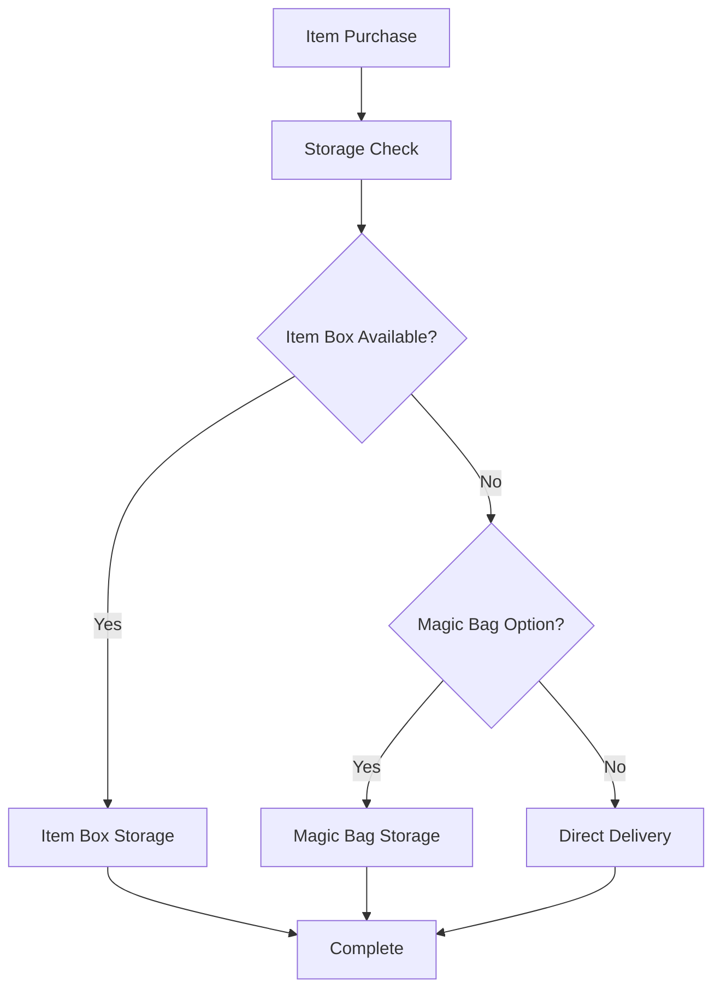

- Storage Options
  * Item Box (Primary)
    - Grid organization
    - Perfect preservation
    - Instant access
    - Unlimited space
    - Category sorting
    - Search function
    - Status tracking
    - Security features

  * Magic Bag (Secondary)
    - Limited space
    - Basic preservation
    - Quick access
    - Weight reduction
    - Simple sorting
    - Easy retrieval
    - Durability protection
    - Travel convenience

  * Direct Delivery
    - Instant materialization
    - Hand placement
    - Safe positioning
    - Visual effects
    - Sound indicators
    - Perfect condition
    - Ready for use
    - Emergency option

**Transaction Records**
- History Tracking
  * Purchase details
  * Sale records
  * Price history
  * Item information
  * Time stamps
  * Location data
  * User actions
  * System notes

### Emergency Features

**Health Monitoring**
- Critical Detection
  * HP threshold alerts
  * Status monitoring
  * Damage tracking
  * Threat assessment
  * Recovery needs
  * Auto-response
  * Emergency supplies
  * Safety protocols

- Response System
  * Instant healing
  * Status cures
  * Barrier activation
  * Emergency escape
  * Power boost
  * Life protection
  * Crisis management
  * Recovery support

**Emergency Interface**
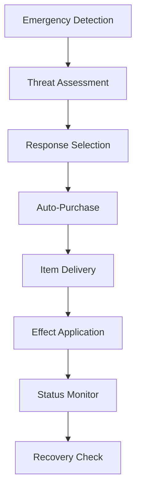

**Quick Response Features**
- Instant Actions
  * One-click purchase
  * Auto-equip
  * Instant use
  * Quick escape
  * Power activation
  * Shield deployment
  * Status cure
  * Life save

- Follow-up System
  * Status monitoring
  * Recovery tracking
  * Health restoration
  * Power recovery
  * Damage assessment
  * Safety check
  * System reset
  * Normal return

### Special Features

**Flash Sales System**
- Time-Limited Offers
  * Special discounts
  * Limited quantity
  * Exclusive deals
  * Bundle options
  * Member access
  * Seasonal events
  * Special items
  * Unique opportunities

- Sale Features
  * Countdown timer
  * Stock tracking
  * Price comparison
  * Value assessment
  * Purchase limit
  * Member priority
  * Quick purchase
  * Auto-notification

**Market Analysis Tools**
- Price Tracking
  * Historical data
  * Trend analysis
  * Value prediction
  * Market cycles
  * Price patterns
  * Demand curves
  * Supply levels
  * Future forecasts

- Market Intelligence
  * Opportunity detection
  * Risk assessment
  * Value comparison
  * Market timing
  * Trade suggestions
  * Deal evaluation
  * Profit calculation
  * Strategy planning

### Integration Features

**Great Sage Integration**
- Enhanced Analysis
  * Deep appraisal
  * Market strategy
  * Risk assessment
  * Value prediction
  * Trend analysis
  * Decision support
  * Opportunity detection
  * Success optimization

- Strategic Support
  * Trading advice
  * Market timing
  * Risk management
  * Value maximization
  * Deal evaluation
  * Purchase planning
  * Investment strategy
  * Portfolio optimization

**System Synergy**
- Feature Integration
  * Seamless operation
  * Function harmony
  * Power enhancement
  * Efficiency boost
  * Error reduction
  * Performance increase
  * Capability expansion
  * System evolution

- User Experience
  * Intuitive control
  * Easy access
  * Quick response
  * Clear display
  * Simple navigation
  * Smart assistance
  * Error prevention
  * Smooth operation

</code>


skills_predator.md:
<code>
---
id: skills_predator
title: "Unique Skill: Predator"
type: skill
category: special
version: 1.0.0
last_updated: 2025-03-10
created_by: The Architect
maintained_by: The Architect

core_nodes:
  - predator
  - consumption
  - mimicry
  - skill_integration

crosslinks:
  - memory
  - narrative
  - world
  - relations
  - journal
  - meta_commands
  - combat
  - skills
  - survival
  - great_sage

tags:
  - predator
  - unique_skill
  - consumption
  - mimicry
  - forbidden_fruit
  - s_rank
  - evolution
  - corruption
  - ethical_dilemma

summary: >
  This file defines the Predator skill for Vantiel, an S-Rank unique ability enabling consumption, skill acquisition, mimicry, and evolution. It covers mechanics, progression, limitations, memory integration, and narrative impact. Integrates with memory, narrative, world, relationship, combat, skills, survival, and Great Sage systems.

updates:
  - date: 2025-03-10
    change: "Initial version with consumption, skill acquisition, mimicry, and narrative integration."
---

# Table of Contents
- [Unique Skill: Predator](#unique-skill-predator)
- [1.0 Overview](#10-overview)
- [2.0 Core Mechanics](#20-core-mechanics)
  - [2.1 Skill Classification](#21-skill-classification)
  - [2.2 Acquisition Methods](#22-acquisition-methods)
  - [2.3 Consumption Process](#23-consumption-process)
- [3.0 Skill Progression](#30-skill-progression)
  - [3.1 Mastery Levels](#31-mastery-levels)
  - [3.2 Advancement Requirements](#32-advancement-requirements)
- [4.0 Skill Acquisition & Management](#40-skill-acquisition--management)
  - [4.1 Skill Analysis](#41-skill-analysis)
  - [4.2 Skill Integration](#42-skill-integration)
  - [4.3 Skill Management](#43-skill-management)
  - [4.4 Skill Capacity Formula](#44-skill-capacity-formula)
- [5.0 Form Mimicry](#50-form-mimicry)
  - [5.1 Transformation Process](#51-transformation-process)
  - [5.2 Mimicry Limitations](#52-mimicry-limitations)
- [6.0 Limitations & Balance](#60-limitations--balance)
  - [6.1 Physiological Constraints](#61-physiological-constraints)
  - [6.2 Psychological Impact](#62-psychological-impact)
  - [6.3 Social Consequences](#63-social-consequences)
- [7.0 Memory Thread Integration](#70-memory-thread-integration)
  - [7.1 Predator Memory Thread Example](#71-predator-memory-thread-example)
  - [7.2 Predator Experience Thread Example](#72-predator-experience-thread-example)
- [8.0 Narrative Implications](#80-narrative-implications)
  - [8.1 Origin Theories](#81-origin-theories)
  - [8.2 Historical Wielders](#82-historical-wielders)
  - [8.3 Roleplay Considerations](#83-roleplay-considerations)
  - [8.4 Story Hooks](#84-story-hooks)
- [9.0 Implementation Notes](#90-implementation-notes)

# Unique Skill: Predator

```mermaid
flowchart TD
    A[Predator Skill] --> B[Consumption Mechanics]
    A --> C[Skill Acquisition]
    A --> D[Form Mimicry]
    A --> E[Limitations & Balance]

    %% Cross-system arrows for audit compliance
    A --> F[Memory System]
    A --> G[Narrative System]
    A --> H[World System]
    A --> I[Relations System]
    A --> J[Journal System]
    A --> K[Meta Commands]
    A --> L[Combat System]
    A --> M[Skills System]
    A --> N[Survival System]
    A --> O[Great Sage System]

    B --> B1[Target Selection]
    B --> B2[Consumption Process]
    B --> B3[Digestion Duration]

    C --> C1[Skill Analysis]
    C --> C2[Skill Integration]
    C --> C3[Skill Capacity]

    D --> D1[Physical Transformation]
    D --> D2[Behavioral Imitation]
    D --> D3[Species Traits]

    E --> E1[Mental Corruption]
    E --> E2[Physiological Constraints]
    E --> E3[Ethical Implications]

    style A fill:#f9f,stroke:#333,stroke-width:2px
    style F fill:#ffe599,stroke:#333,stroke-width:2px
    style G fill:#c9daf8,stroke:#333,stroke-width:2px
    style H fill:#b4a7d6,stroke:#333,stroke-width:2px
    style I fill:#f4cccc,stroke:#333,stroke-width:2px
    style J fill:#fce5cd,stroke:#333,stroke-width:2px
    style K fill:#d9ead3,stroke:#333,stroke-width:2px
    style L fill:#f4cccc,stroke:#333,stroke-width:2px
    style M fill:#d9ead3,stroke:#333,stroke-width:2px
    style N fill:#b6d7a8,stroke:#333,stroke-width:2px
    style O fill:#fff2cc,stroke:#333,stroke-width:2px
```

## 1.0 Overview

Predator is an S-Rank unique skill that embodies the primal concept of "you are what you eat" taken to its logical extreme. It allows the wielder to consume defeated enemies and assimilate their abilities, knowledge, and—for those with compatible physiology like slimes or certain shapeshifters—even their physical form. This extraordinarily rare and feared ability transforms its users into apex predators capable of endless evolution through consumption.

Born from the chaotic energies of the Fracture or perhaps a forbidden experiment lost to time, Predator exists at the intersection of divine and profane magic. The Radiant Covenant considers it an abomination to be purged, while those seeking power view it as the ultimate path to unlimited potential.

## 2.0 Core Mechanics

### 2.1 Skill Classification

**Rank:** S-Rank (Divine)
**Type:** Unique Skill (Cannot be taught or transferred)
**Magic System Alignment:** Primarily Profane with elements of Arcane
**Detection:** Radiates a distinctive aura detectable by high-level divine magic

### 2.2 Acquisition Methods

Predator cannot be learned through conventional means. Known paths to acquisition include:

- Consuming an extremely rare variant of Forbidden Fruit (1 in 10,000 chance)
- Receiving a blessing from an ancient, forgotten deity of consumption
- Undergoing a rare mutation triggered by consuming large quantities of magically-saturated monster cores
- Reincarnation boon for souls with specific traits or past-life abilities
- Being born as certain rare monster species (some slimes, mimics, or doppelgangers)

### 2.3 Consumption Process


**Target Selection:**
- Entity must be organic or have an organic component
- Target typically needs to be defeated, incapacitated, or willing
- Living consumption is possible but substantially more difficult
- Higher-ranked entities require more advanced Predator skill levels

**Consumption Requirements:**
- Physical ingestion of at least part of the target
- Significant tissue samples required for skill acquisition
- Complete consumption necessary for full mimicry
- Magicule-rich organs (cores, hearts) provide optimal results

**Digestion Period:**
- Time required to break down and analyze consumed material
- Duration varies based on:
  - Predator skill level
  - Target complexity
  - Skill compatibility
  - Quantity consumed
- During digestion, partial skills may manifest unpredictably

**Integration Process:**
- Skills are decoded and transformed to match user's magicule structure
- Compatibility determined based on user attributes and existing skills
- Integration feelings range from pleasant tingling to intense pain
- Voice of the World announces significant skill acquisitions

## 3.0 Skill Progression

### 3.1 Mastery Levels

**Novice (Level 1-3): Primitive Consumption**
- Consumption limited to small creatures (up to dog-sized)
- 1-3 skills can be retained simultaneously
- Physical mimicry is imperfect and temporary (4-12 hours)
- Long digestion period (1-3 days per significant skill)
- Skills limited to F-rank and E-rank
- Often experience uncontrolled manifestations of consumed abilities
- Limited control over transformation process
- Strong taste aversion remains (consumption feels unnatural)

**Adept (Level 4-6): Advanced Predation**
- Can consume human-sized entities
- 5-8 skills can be retained simultaneously
- Physical mimicry more accurate with longer duration (1-3 days)
- Voice and basic mannerisms can be mimicked
- Moderate digestion period (12-24 hours)
- Can acquire and utilize D-rank and C-rank skills
- Better control over skill activation and deactivation
- Decreased taste aversion (consumption feels less unnatural)
- Begin developing a "hunger" for specific powerful abilities

**Expert (Level 7-9): Superior Consumption**
- Can consume larger creatures (up to ogre-sized)
- 10-15 skills can be retained simultaneously
- Nearly perfect physical and behavioral mimicry
- Digestion period reduced (6-12 hours)
- Partial memory absorption from prey
- Can acquire and utilize B-rank skills
- Fine control over transformation aspects
- Taste aversion replaced with pleasure (consumption feels rewarding)
- Can selectively consume parts for specific abilities
- Developed hunting instincts for optimal prey

**Master (Level 10): Ultimate Predator**
- Can consume almost any organic entity regardless of size
- 20+ skills can be retained simultaneously
- Perfect mimicry including memories and minor abilities
- Rapid digestion (1-3 hours)
- Permanent skill acquisition possible for compatible abilities
- Can acquire and utilize A-rank skills
- Potential to consume S-rank skills from appropriate targets
- Complete control over transformation process
- Deep hunger for powerful abilities becomes defining trait
- Capacity to create unique hybrid skills from multiple sources

### 3.2 Advancement Requirements

To progress the Predator skill, users must:

1. Consume a minimum number of unique creatures for each level
2. Successfully integrate progressively higher-ranked skills
3. Master controlling previously acquired abilities
4. Overcome the psychological barriers of consumption
5. Evolve their magicule structure to accommodate greater power

## 4.0 Skill Acquisition & Management

### 4.1 Skill Analysis

When a target is consumed, the Predator skill automatically analyzes the entity's abilities:

- **Compatibility Check**: Determines if skills can be integrated
- **Rank Assessment**: Evaluates the power level of available skills
- **Integration Difficulty**: Calculates time and energy required
- **Potential Modifications**: Identifies necessary adaptations for user's body

For users with the Great Sage ability, this analysis is dramatically enhanced, providing detailed breakdowns of skill components and optimization opportunities.

### 4.2 Skill Integration

Successfully analyzed skills undergo integration:

- **Temporary Integration**: Initial acquisition provides time-limited access
- **Skill Practice**: Regular use strengthens the connection
- **Permanent Bonding**: Fully mastered skills become permanent with sufficient use
- **Skill Mutation**: Occasionally skills adapt to user's nature, creating unique variants

### 4.3 Skill Management

With limited capacity, users must manage their acquired abilities:

- **Skill Prioritization**: Choosing which abilities to maintain
- **Skill Combinations**: Creating synergies between complementary abilities
- **Skill Replacement**: Deciding which abilities to discard when reaching capacity
- **Consumption Cycles**: Regularly consuming similar entities to reinforce valuable skills

### 4.4 Skill Capacity Formula

```
Base Capacity = 1 + (Predator Level × 2)
Bonus Capacity = INT modifier + WIS modifier
Total Capacity = Base Capacity + Bonus Capacity
```

Higher intelligence and wisdom allow more efficient skill organization and storage.

## 5.0 Form Mimicry

For slimes, doppelgangers, and other beings with malleable physiology, Predator enables physical transformation to match consumed entities.

### 5.1 Transformation Process

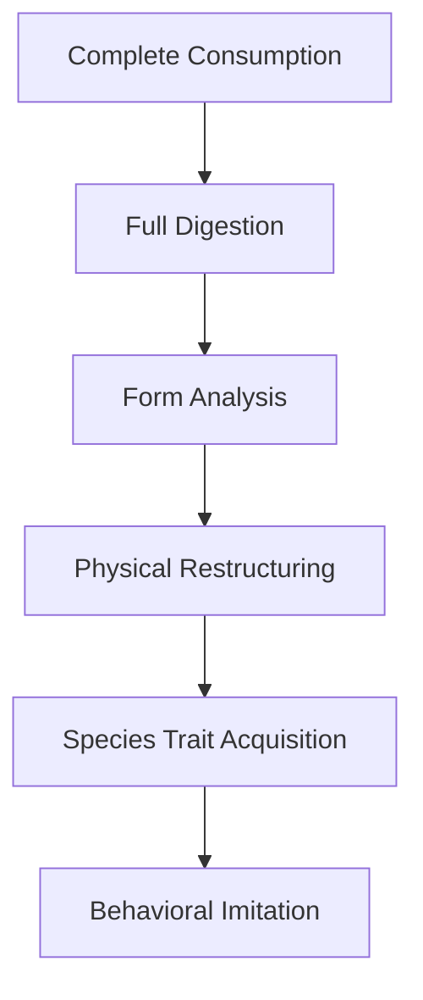

**Physical Restructuring:**
- Body mass redistributes to match target's dimensions
- Surface texture, coloration, and features form
- Internal organs may be simulated if necessary
- Transformation speed increases with skill level

**Species Trait Acquisition:**
- Basic biological functions (breathing, circulation) are mimicked
- Natural abilities (night vision, enhanced smell) are replicated
- Innate resistances (poison immunity, fire resistance) are gained
- Physical strength and weaknesses are approximated

**Behavioral Imitation:**
- Voice patterns matched through vocal cord restructuring
- Movement patterns and mannerisms replicated
- At higher levels, instinctual behaviors are adopted
- Advanced mimicry includes emotional responses and reactions

### 5.2 Mimicry Limitations

Despite its power, Form Mimicry has significant constraints:

- **Magical Signature**: Cannot replicate unique magical auras
- **Soul Essence**: Cannot duplicate soul-based abilities
- **Divine Traits**: Cannot copy divinely granted features
- **Size Constraints**: Transformation limited by user's mass (can increase by 50% or decrease by 75%)
- **Aura Detection**: High-level magic users can sense the disguise
- **Energy Consumption**: Maintaining complex forms drains resources
- **Identity Retention**: Extended mimicry risks psychological blending

## 6.0 Limitations & Balance

### 6.1 Physiological Constraints

**Consumption Hazards:**
- Poisonous entities may cause illness unless neutralized
- Cursed beings may transfer their afflictions
- Divine entities might trigger violent rejection reactions
- Incompatible magicule structures can cause internal damage
- Excessive consumption without digestion causes bloating and vulnerability

**Evolution Requirements:**
- Physical adaptations needed for consuming larger prey
- Specialized digestive abilities for different entity types
- Enhanced magicule processing capacity for powerful skills
- Incremental changes to accommodate new ability types

### 6.2 Psychological Impact

**Mental Corruption:**
- Progressive appetite development toward more powerful beings
- Risk of personality bleed from consumed entities
- Predatory instincts becoming dominant over time
- Gradual detachment from human morality and connections
- Identity confusion after extensive mimicry
- Potential development of consumption-based euphoria

**Countermeasures:**
- Regular meditation to reinforce core identity
- Selective consumption of compatible entities
- Periods of abstention to clear foreign influences
- Strong emotional anchors to human connections
- Great Sage ability can help manage mental contamination

### 6.3 Social Consequences

**Hunter Becomes Hunted:**
- Radiant Covenant classifies users as dangerous heretics
- Templars and Inquisitors actively hunt known Predator wielders
- Mage guilds seek to study or contain users
- Monster hunters receive bounties for confirmed kills
- Certain demonic entities view users as rivals or threats

**Ethical Implications:**
- Consuming sentient beings raises profound moral questions
- Users often face internal conflict about their nature
- History of previous Predator wielders often marked by tragedy
- Potential path to either transcendence or monstrosity

## 7.0 Memory Thread Integration

Predator creates unique memory threads that track consumption history and acquired abilities.

### 7.1 Predator Memory Thread Example

```json
{
  "predator_skill": {
    "rank": "S",
    "level": 5,
    "acquisition_date": "Day 120",
    "current_status": "Active",
    "active_consumed_skills": [
      {
        "name": "Fire Breath",
        "original_entity": "Lesser Drake",
        "rank": "C",
        "consumption_date": "Day 142",
        "expiration_date": "Day 172",
        "mastery": "70%",
        "description": "Exhale cone of fire dealing 25-40 damage over 10ft range"
      },
      {
        "name": "Stone Skin",
        "original_entity": "Rock Golem",
        "rank": "D",
        "consumption_date": "Day 150",
        "expiration_date": "Day 180",
        "mastery": "85%",
        "description": "Increase physical defense by 30% for 5 minutes"
      },
      {
        "name": "Night Vision",
        "original_entity": "Cave Wolf",
        "rank": "F",
        "consumption_date": "Day 135",
        "expiration_date": "Permanent",
        "mastery": "100%",
        "description": "See clearly in low-light conditions"
      }
    ],
    "discarded_skills": [
      {
        "name": "Poison Sting",
        "original_entity": "Giant Scorpion",
        "rank": "E",
        "consumption_date": "Day 125",
        "discard_date": "Day 149",
        "reason": "Reached capacity limit, replaced with Stone Skin"
      }
    ],
    "current_mimicry": {
      "entity": "Forest Wolf",
      "accuracy": "86%",
      "duration_remaining": "48 hours",
      "special_traits": ["Enhanced Smell", "Silent Movement"]
    },
    "consumption_history": [
      {
        "entity_type": "Lesser Drake",
        "entity_rank": "C",
        "date": "Day 142",
        "location": "Northern Mountains",
        "skills_acquired": ["Fire Breath", "Heat Resistance"],
        "notes": "First C-rank consumption, severe digestive pain for 8 hours"
      },
      {
        "entity_type": "Rock Golem",
        "entity_rank": "D",
        "date": "Day 150",
        "location": "Eastern Quarry",
        "skills_acquired": ["Stone Skin", "Earth Attunement"],
        "notes": "Stone fragments caused internal damage, required healing potion"
      }
    ],
    "skill_evolution_log": [
      {
        "original_skill": ["Fire Breath", "Stone Skin"],
        "evolved_skill": "Magma Spray",
        "evolution_date": "Day 160",
        "trigger": "Simultaneous activation during cave troll battle",
        "notes": "Unexpected fusion occurred during emergency"
      }
    ]
  }
}
```

### 7.2 Predator Experience Thread Example

```json
{
  "predator_experience": {
    "current_targets": [
      {
        "entity": "Highland Minotaur",
        "desirability": "High",
        "target_skills": ["Shockwave Stomp", "Berserker Rage"],
        "last_sighted": "Sentinel Peaks, Day 155",
        "hunting_plan": "Observe migration patterns, prepare ambush at river crossing"
      },
      {
        "entity": "Elder Treant",
        "desirability": "Medium",
        "target_skills": ["Nature's Blessing", "Root Network"],
        "last_sighted": "Whispering Woods, Day 148",
        "hunting_plan": "Gain trust of forest spirits for approach opportunity"
      }
    ],
    "hunger_status": {
      "current_level": "Moderate",
      "preferred_prey": "Magical beasts, elemental entities",
      "aversion_triggers": "Divine-blessed creatures, undead",
      "last_satisfied": "Day 150",
      "feeding_frequency": "7-10 days optimal"
    },
    "psychological_state": {
      "identity_stability": "Strong (85%)",
      "corruption_indicators": [
        "Occasional predatory dreams",
        "Heightened territoriality",
        "Instinctive cataloging of others' abilities"
      ],
      "countermeasures": [
        "Daily meditation practice",
        "Regular contact with trusted companions",
        "Great Sage consultation on mental barriers"
      ]
    }
  }
}
```

## 8.0 Narrative Implications

### 8.1 Origin Theories

The true origin of the Predator skill remains shrouded in mystery, with several competing theories:

- **Fracture Mutation**: Born from the chaotic energies released during the Fracture
- **Ancient Predator God**: Gift from a forgotten deity of consumption and evolution
- **Arcane Experiment**: Result of pre-Fracture magical research into biological assimilation
- **Natural Evolution**: Extremely rare natural development in certain creature types
- **Demonic Influence**: Corruption of natural abilities by entities from beyond

### 8.2 Historical Wielders

Few confirmed Predator users exist in historical records, but rumors persist of:

- **The Devourer of Souls**: A legendary figure who consumed a thousand different creatures
- **The Shapeless One**: A being who could become anyone or anything
- **The Evolving Horror**: A monster that grew more terrible with each hero it consumed
- **The Midnight Gourmand**: A sophisticated predator who hunted only the rarest beings
- **The Perfect Mimic**: A spy whose true identity remains unknown to this day

### 8.3 Roleplay Considerations

Players with Predator face unique challenges and opportunities:

- **Hunger Management**: Balancing the need to consume with moral boundaries
- **Identity Preservation**: Maintaining sense of self despite foreign influences
- **Target Selection**: Choosing victims based on utility and ethical considerations
- **Secret Maintenance**: Hiding their nature from those who would destroy them
- **Evolution Path**: Deciding what kind of predator they wish to become
- **Power Responsibility**: Confronting the implications of potentially unlimited growth

### 8.4 Story Hooks

Predator offers rich narrative possibilities:

- **The Hunt**: Tracking rare creatures with valuable abilities
- **The Hunted**: Evading Covenant forces who detect the user's nature
- **Ethical Dilemmas**: Facing situations where consumption might be justified
- **Internal Struggle**: Battling the growing hunger for more powerful prey
- **Integration Mysteries**: Discovering unexpected effects from certain consumptions
- **Origin Quest**: Seeking the true source of this mysterious power
- **Evolution Milestone**: Transforming after achieving critical mass of certain skill types

## 9.0 Implementation Notes

Predator adds a unique gameplay dimension that interfaces with multiple systems:

### Core Integration
- Combat system: Acquired offensive and defensive abilities
- Relationship system: Managing others' reactions to predatory nature
- Memory threads: Tracking consumption history and skill evolution
- Survival mechanics: Hunger management and prey selection

### Narrative Impact
- Personal story arc focused on the nature of identity and evolution
- Moral choices regarding consumption targets and methods
- Relationship dynamics affected by growing predatory nature
- World interactions shaped by reaction to the user's abilities

### Player Psychology
- Constant tension between power acquisition and ethical boundaries
- Strategic decisions about which abilities to maintain or discard
- Creative problem-solving through unconventional ability combinations
- Long-term planning for targeted consumption and skill development

The Predator skill can transform gameplay, offering both tremendous power and significant responsibility. This implementation guide provides structure while allowing flexibility for unique character development and storytelling opportunities.

</code>

system_leveling.md:
<code>
---
id: system_leveling
title: "Leveling System"
type: system
category: progression
version: 1.0.0
last_updated: 2025-02-25
created_by: The Architect
maintained_by: The Architect

core_nodes:
  - leveling
  - experience
  - growth
  - world_integration

crosslinks:
  - memory
  - narrative
  - world
  - relations
  - journal
  - meta_commands
  - combat
  - skills
  - crafting
  - economy
  - guild

tags:
  - leveling
  - experience
  - progression
  - milestones
  - world_scaling
  - recognition
  - attribute_growth
  - skill_development

summary: >
  This file defines the Leveling System for Vantiel, including level structure, experience, growth, milestones, world integration, and memory threads. It governs character progression, world scaling, and recognition, integrating with memory, narrative, world, relationship, combat, skills, crafting, economy, and guild systems.

updates:
  - date: 2025-02-25
    change: "Initial version with level structure, experience, growth, and world integration."
---

# Table of Contents
- [Leveling System](#leveling-system)
- [Leveling System Flowchart](#leveling-system-flowchart)
- [1.0 Overview](#10-overview)
  - [1.1 Core Concepts](#11-core-concepts)
- [2.0 Level Structure](#20-level-structure)
  - [2.1 Level Tiers](#21-level-tiers)
  - [2.2 Experience Requirements](#22-experience-requirements)
- [3.0 Experience System](#30-experience-system)
  - [3.1 Experience Sources](#31-experience-sources)
  - [3.2 Experience Modifiers](#32-experience-modifiers)
- [4.0 Growth & Benefits](#40-growth--benefits)
  - [4.1 Level-Up Rewards](#41-level-up-rewards)
  - [4.2 Attribute Growth](#42-attribute-growth)
  - [4.3 Skill Development](#43-skill-development)
- [5.0 World Integration](#50-world-integration)
  - [5.1 NPC Recognition](#51-npc-recognition)
  - [5.2 World Scaling](#52-world-scaling)
  - [5.3 Guild Integration](#53-guild-integration)
- [6.0 Memory Thread Integration](#60-memory-thread-integration)
  - [6.1 Level Memory Thread](#61-level-memory-thread)
  - [6.2 Achievement Thread](#62-achievement-thread)
- [7.0 System Integration](#70-system-integration)
  - [7.1 Combat Integration](#71-combat-integration)
  - [7.2 Crafting Integration](#72-crafting-integration)
  - [7.3 Magic Integration](#73-magic-integration)
  - [7.4 Social Integration](#74-social-integration)
- [8.0 Implementation Notes](#80-implementation-notes)

# Leveling System Flowchart

```mermaid
flowchart TD
    A[Leveling System] --> B[Core Level Mechanics]
    A --> C[Experience System]
    A --> D[Growth & Benefits]
    A --> E[World Integration]

    %% Cross-system arrows for audit compliance
    A --> F[Memory System]
    A --> G[Narrative System]
    A --> H[World System]
    A --> I[Relations System]
    A --> J[Journal System]
    A --> K[Meta Commands]
    A --> L[Combat System]
    A --> M[Skills System]
    A --> N[Crafting System]
    A --> O[Economy System]
    A --> P[Guild System]

    B --> B1[Level Structure]
    B --> B2[Progression Rates]
    B --> B3[Milestones]

    C --> C1[Experience Sources]
    C --> C2[Gain Modifiers]
    C --> C3[Activity Bonuses]

    D --> D1[Attribute Growth]
    D --> D2[Skill Development]
    D --> D3[Unlocks & Rewards]

    E --> E1[NPC Recognition]
    E --> E2[World Scaling]
    E --> E3[Social Impact]

    style A fill:#f9f,stroke:#333,stroke-width:2px
    style F fill:#ffe599,stroke:#333,stroke-width:2px
    style G fill:#c9daf8,stroke:#333,stroke-width:2px
    style H fill:#b4a7d6,stroke:#333,stroke-width:2px
    style I fill:#f4cccc,stroke:#333,stroke-width:2px
    style J fill:#fce5cd,stroke:#333,stroke-width:2px
    style K fill:#d9ead3,stroke:#333,stroke-width:2px
    style L fill:#f4cccc,stroke:#333,stroke-width:2px
    style M fill:#d9ead3,stroke:#333,stroke-width:2px
    style N fill:#ead1dc,stroke:#333,stroke-width:2px
    style O fill:#ead1dc,stroke:#333,stroke-width:2px
    style P fill:#b6d7a8,stroke:#333,stroke-width:2px
```
# Leveling System

## 1.0 Overview

In Vantiel, levels are a natural measure of one's growth and capability, recognized by all inhabitants. From humble villagers to legendary heroes, everyone possesses a level that reflects their life experience and mastery. This system governs how characters grow stronger, learn new abilities, and earn recognition in the world.

### 1.1 Core Concepts

- **Level Range**: 1-100
- **Experience Points (XP)**: Earned through various activities
- **Milestone Levels**: Special achievements at levels 10, 25, 50, 75, and 100
- **Growth Categories**: Physical, Mental, Social, and Magical development
- **World Recognition**: NPCs naturally recognize and respect higher-level individuals

## 2.0 Level Structure

### 2.1 Level Tiers

```mermaid
flowchart TD
    A[Level Tiers] --> B[Novice 1-10]
    A --> C[Apprentice 11-25]
    A --> D[Adept 26-50]
    A --> E[Expert 51-75]
    A --> F[Master 76-99]
    A --> G[Legendary 100]

    B --> B1[Basic Skills]
    B --> B2[Foundation Building]

    C --> C1[Specialization]
    C --> C2[Guild Recognition]

    D --> D1[Advanced Techniques]
    D --> D2[Leadership Roles]

    E --> E1[Mastery Paths]
    E --> E2[Unique Abilities]

    F --> F1[Legendary Skills]
    F --> F2[World Influence]

    G --> G1[Peak Power]
    G --> G2[Divine Recognition]
```

#### Novice (Levels 1-10)
- Basic skill acquisition
- Foundation of attributes
- Guild apprenticeship eligibility
- Common in villages and towns

#### Apprentice (Levels 11-25)
- Specialization begins
- Guild rank advancement
- Advanced skill access
- Respected in local communities

#### Adept (Levels 26-50)
- Mastery of basics
- Leadership positions
- Regional recognition
- Rare in smaller towns

#### Expert (Levels 51-75)
- Elite abilities
- National recognition
- Major quest access
- Less than 1% of population

#### Master (Levels 76-99)
- Legendary potential
- World-changing power
- Historical recognition
- Extremely rare

#### Legendary (Level 100)
- Peak of mortal achievement
- Divine attention
- World-altering abilities
- Handful per generation

### 2.2 Experience Requirements

| Level Range | Base XP Required | Cumulative XP | Notable Unlocks |
|-------------|------------------|---------------|-----------------|
| 1-10 | 1,000 | 10,000 | Basic skills, Guild entry |
| 11-25 | 2,000 | 40,000 | Specializations, Advanced skills |
| 26-50 | 4,000 | 140,000 | Mastery abilities, Leadership roles |
| 51-75 | 8,000 | 340,000 | Elite techniques, Legendary potential |
| 76-99 | 16,000 | 724,000 | World-changing powers |
| 100 | 100,000 | 824,000 | Peak mortal achievement |

## 3.0 Experience System

### 3.1 Experience Sources

#### Combat Experience
```json
{
  "combat_xp": {
    "basic_formula": "enemy_level * difficulty_modifier * group_size_modifier",
    "bonus_conditions": {
      "first_time_defeat": 1.5,
      "no_damage_taken": 1.3,
      "critical_hits": 1.1,
      "strategic_victory": 1.2
    },
    "penalties": {
      "over_leveled": 0.5,
      "group_carried": 0.7
    }
  }
}
```

#### Quest Experience
```json
{
  "quest_xp": {
    "rank_multipliers": {
      "F": 1.0,
      "E": 1.2,
      "D": 1.5,
      "C": 2.0,
      "B": 2.5,
      "A": 3.0,
      "S": 4.0
    },
    "completion_bonuses": {
      "perfect": 1.5,
      "quick": 1.3,
      "creative": 1.2,
      "thorough": 1.1
    }
  }
}
```

#### Skill Experience
```json
{
  "skill_xp": {
    "practice": "level * skill_difficulty * time_invested",
    "application": "level * skill_difficulty * success_rate",
    "discovery": "level * novelty_factor * complexity",
    "teaching": "student_count * lesson_quality * time_invested"
  }
}
```

#### Social Experience
```json
{
  "social_xp": {
    "negotiation": "stakes * difficulty * outcome",
    "leadership": "follower_count * task_complexity * success_rate",
    "reputation": "scope * impact * duration",
    "relationships": "depth * significance * interaction_quality"
  }
}
```

### 3.2 Experience Modifiers

#### Global Modifiers
- **Rest Bonus**: +10% XP when well-rested
- **Mentor Bonus**: +20% XP in mentor's specialty
- **Guild Bonus**: +15% XP for guild-related activities
- **Festival Bonus**: +25% XP during special events

#### Activity-Specific Modifiers
- **First Time Bonus**: +50% XP for first completion
- **Chain Bonus**: +5% XP per consecutive success (max 50%)
- **Innovation Bonus**: +25% XP for creative solutions
- **Challenge Bonus**: +100% XP for defeating higher-level threats

## 4.0 Growth & Benefits

### 4.1 Level-Up Rewards

#### Every Level
- 5 Attribute Points
- 1 Skill Point
- HP/MP increase based on class
- Status update in Guild registry

#### Milestone Levels (10, 25, 50, 75, 100)
- Special ability unlock
- Title acquisition
- Guild rank eligibility
- Unique quest access
- Divine recognition

### 4.2 Attribute Growth

```json
{
  "attribute_growth": {
    "points_per_level": 5,
    "max_per_attribute": "level * 2",
    "special_bonuses": {
      "class_affinity": "+1 to primary attribute",
      "milestone_levels": "+5 to all attributes",
      "divine_blessing": "uncapped growth potential"
    }
  }
}
```

### 4.3 Skill Development

```json
{
  "skill_development": {
    "skill_points_per_level": 1,
    "rank_requirements": {
      "F": 1,
      "E": 10,
      "D": 25,
      "C": 40,
      "B": 60,
      "A": 80,
      "S": 100
    },
    "mastery_bonuses": {
      "level_10": "skill evolution potential",
      "level_25": "teaching capability",
      "level_50": "skill combination potential",
      "level_75": "unique variation development",
      "level_100": "skill mastery recognition"
    }
  }
}
```

## 5.0 World Integration

### 5.1 NPC Recognition

NPCs naturally recognize and react to player levels:

#### Level-Based Reactions
- **Levels 1-10**: Treated as a novice
- **Levels 11-25**: Recognized as capable
- **Levels 26-50**: Respected as accomplished
- **Levels 51-75**: Revered as exceptional
- **Levels 76-99**: Legendary status
- **Level 100**: Living legend

#### Social Impact
```json
{
  "social_recognition": {
    "shop_prices": "modified by level and reputation",
    "quest_availability": "unlocked by level milestones",
    "npc_dialogue": "adapts to player's level",
    "faction_relations": "influenced by level status"
  }
}
```

### 5.2 World Scaling

```json
{
  "world_scaling": {
    "zones": {
      "beginner": "levels 1-15",
      "intermediate": "levels 16-30",
      "advanced": "levels 31-50",
      "expert": "levels 51-75",
      "master": "levels 76-100"
    },
    "difficulty_adjustment": {
      "enemy_levels": "scaled to zone + variance",
      "quest_requirements": "adjusted by zone",
      "resource_quality": "improves with zone level",
      "reward_scaling": "increases with zone difficulty"
    }
  }
}
```

### 5.3 Guild Integration

```json
{
  "guild_integration": {
    "rank_requirements": {
      "F": "level 1+",
      "E": "level 10+",
      "D": "level 25+",
      "C": "level 40+",
      "B": "level 60+",
      "A": "level 80+",
      "S": "level 95+"
    },
    "benefits": {
      "quest_access": "based on rank/level",
      "facility_access": "unlocked by rank",
      "teaching_rights": "granted by rank",
      "leadership_roles": "available by rank"
    }
  }
}
```

## 6.0 Memory Thread Integration

### 6.1 Level Memory Thread

```json
{
  "level_memory": {
    "current_level": 1,
    "total_xp": 0,
    "milestone_achievements": [],
    "level_history": [
      {
        "level": 1,
        "date_achieved": "Day 1",
        "location": "Starting Village",
        "notable_events": ["First Quest Completed"]
      }
    ],
    "growth_tracking": {
      "combat_xp_gained": 0,
      "quest_xp_gained": 0,
      "skill_xp_gained": 0,
      "social_xp_gained": 0
    }
  }
}
```

### 6.2 Achievement Thread

```json
{
  "achievement_memory": {
    "milestones": [],
    "rare_accomplishments": [],
    "skill_masteries": [],
    "world_firsts": [],
    "special_recognition": []
  }
}
```

## 7.0 System Integration

### 7.1 Combat Integration
- Level affects damage calculation
- Skill availability based on level
- Combat experience scaled by level difference
- Special moves unlock at level thresholds

### 7.2 Crafting Integration
- Recipe availability by level
- Quality potential increases with level
- Material identification by level
- Workshop access by level

### 7.3 Magic Integration
- Spell power scaled by level
- Mana pool grows with level
- New spell access by level
- Ritual complexity by level

### 7.4 Social Integration
- Reputation gain scaled by level
- Leadership opportunities by level
- Trade advantages by level
- Faction recognition by level

## 8.0 Implementation Notes

This leveling system creates a natural progression that feels integral to Vantiel's world while providing clear advancement paths. Key aspects include:

### Core Mechanics
- Level-based foundation for all abilities
- Experience from diverse activities
- Milestone achievements for progression
- World recognition of growth

### Narrative Integration
- Levels reflect life experience
- Progression tied to story development
- Natural recognition by NPCs
- Integration with world lore

### Development Focus
- Balanced progression paths
- Meaningful level-up choices
- Special abilities at milestones
- Deep integration with other systems

The system maintains immersion while creating opportunities for extraordinary growth and achievement. Regular updates will refine balance and expand options based on player engagement and world evolution.

</code>


system_survival.md:
<code>
---
id: system_survival
title: "Survival System: Daily Life & Necessities"
type: system
category: gameplay
version: 1.0.0
last_updated: 2025-02-25
created_by: The Architect
maintained_by: The Architect

core_nodes:
  - survival
  - daily_life
  - inventory_management
  - property

crosslinks:
  - memory
  - narrative
  - world
  - relations
  - journal
  - meta_commands
  - crafting
  - economy
  - skills
  - inventory

tags:
  - survival
  - daily_life
  - inventory
  - property
  - basic_needs
  - time_management
  - environmental_hazards
  - routines
  - resource_management

summary: >
  This file defines the Survival System for Vantiel, including daily life, basic needs, inventory management, property, and survival challenges. It integrates with memory, narrative, world, relationship, and crafting systems for a grounded, immersive experience.

updates:
  - date: 2025-02-25
    change: "Initial version with daily life, basic needs, inventory, and property systems."
---

# Table of Contents
- [Survival System: Daily Life & Necessities](#survival-system-daily-life--necessities)
- [1.0 Overview](#10-overview)
- [2.0 Basic Needs](#20-basic-needs)
- [3.0 Daily Life Cycle](#30-daily-life-cycle)
- [4.0 Inventory Management](#40-inventory-management)
- [5.0 Housing & Property](#50-housing--property)
- [6.0 Survival Challenges](#60-survival-challenges)
- [7.0 Survival Skills](#70-survival-skills)
- [8.0 Memory Thread Integration](#80-memory-thread-integration)
- [9.0 Implementation Notes](#90-implementation-notes)

# Survival System: Daily Life & Necessities

```mermaid
flowchart TD
    A[Survival System] --> B[Basic Needs]
    A --> C[Daily Life Cycle]
    A --> D[Inventory Management]
    A --> E[Housing & Property]

    %% Cross-system arrows for audit compliance
    A --> F[Memory System]
    A --> G[Narrative System]
    A --> H[World System]
    A --> I[Relations System]
    A --> J[Journal System]
    A --> K[Meta Commands]
    A --> L[Crafting System]
    A --> M[Economy System]
    A --> N[Skills System]
    A --> O[Inventory System]

    B --> B1[Food & Hunger]
    B --> B2[Water & Thirst]
    B --> B3[Sleep & Rest]

    C --> C1[Day/Night Cycle]
    C --> C2[Seasonal Changes]
    C --> C3[Daily Actions]

    D --> D1[Carrying Capacity]
    D --> D2[Item Organization]
    D --> D3[Storage Solutions]

    E --> E1[Player Housing]
    E --> E2[Property Management]
    E --> E3[Home Improvements]

    style A fill:#f9f,stroke:#333,stroke-width:2px
    style F fill:#ffe599,stroke:#333,stroke-width:2px
    style G fill:#c9daf8,stroke:#333,stroke-width:2px
    style H fill:#b4a7d6,stroke:#333,stroke-width:2px
    style I fill:#f4cccc,stroke:#333,stroke-width:2px
    style J fill:#fce5cd,stroke:#333,stroke-width:2px
    style K fill:#d9ead3,stroke:#333,stroke-width:2px
    style L fill:#ead1dc,stroke:#333,stroke-width:2px
    style M fill:#ead1dc,stroke:#333,stroke-width:2px
    style N fill:#d9ead3,stroke:#333,stroke-width:2px
    style O fill:#b6d7a8,stroke:#333,stroke-width:2px
```

## 1.0 Overview

In Vantiel, survival is more than just staying alive—it's about managing resources, adapting to the environment, and building a sustainable lifestyle. This system governs the basic necessities of daily life, from food and water to shelter and rest, as well as the management of personal belongings and property.

Every meal eaten, night of rest taken, and item carried tells a story about your character's priorities, resources, and adaptability. The changing seasons, regional climates, and local economies all influence how you approach survival, creating a dynamic and immersive living experience that grounds your adventure in a believable world.

## 2.0 Basic Needs

```mermaid
flowchart TD
    A[Basic Needs] --> B[Food & Hunger]
    A --> C[Water & Thirst]
    A --> D[Sleep & Rest]
    A --> E[Environmental Protection]

    B --> B1[Hunger System]
    B --> B2[Food Quality]
    B --> B3[Cooking]

    C --> C1[Thirst System]
    C --> C2[Water Sources]
    C --> C3[Water Quality]

    D --> D1[Fatigue System]
    D --> D2[Sleep Quality]
    D --> D3[Rest Locations]

    E --> E1[Weather Protection]
    E --> E2[Temperature Regulation]
    E --> E3[Hazard Avoidance]
```

### 2.1 Food & Hunger

The hunger system tracks your character's nutritional state:

**Hunger Mechanics**
- Must eat once every 7 days or lose 5 HP/day
- Hunger level increases gradually over time
- Different activities consume energy at different rates
- Combat and strenuous activities accelerate hunger

**Food Quality Levels**
- **Poor:** Basic sustenance, minimal benefits
- **Standard:** Satisfies hunger, minor temporary buffs
- **Quality:** Extended satiation, moderate buffs
- **Gourmet:** Long-lasting satiation, significant buffs
- **Luxury:** Complete satiation, major buffs, special effects

**Food Sources**
- Hunting wild game (requires hunting skills)
- Foraging for plants and fruits (requires foraging skills)
- Purchasing from markets and vendors
- Growing crops (with farming skills)
- Cooking meals from ingredients

**Cooking System**
- Combine ingredients to create meals
- Higher cooking skill creates better quality food
- Special recipes provide unique buffs and effects
- Cooking equipment affects quality and options
- Cultural and regional cooking styles

### 2.2 Water & Thirst

The thirst system tracks your character's hydration:

**Thirst Mechanics**
- Must drink every 3 days or lose 5 HP/day
- Thirst increases faster than hunger
- Hot environments accelerate thirst
- Physical exertion increases water needs

**Water Sources**
- Natural sources (rivers, lakes, springs)
- Wells and cisterns in settlements
- Purchased drinks from taverns and vendors
- Collected rainwater
- Magical sources with special properties

**Water Quality**
- **Contaminated:** May cause illness or debuffs
- **Clean:** Basic hydration
- **Pure:** Enhanced hydration, minor buffs
- **Magical:** Special effects and significant buffs

**Hydration Items**
- Waterskins and canteens for carrying water
- Purification tablets or spells
- Special drinks with additional benefits
- Dehydrated drinks that can be reconstituted

### 2.3 Sleep & Rest

The fatigue system tracks your character's energy and rest:

**Fatigue Mechanics**
- Rest every 2 days or suffer -2 WIS and lose 5 HP/day
- Fatigue accumulates gradually during waking hours
- Strenuous activities accelerate fatigue
- Mental exertion (spellcasting, etc.) also causes fatigue

**Sleep Quality Levels**
- **Poor:** Minimal recovery, possible debuffs
- **Adequate:** Basic recovery of HP and fatigue
- **Comfortable:** Enhanced recovery, minor buffs
- **Luxurious:** Maximum recovery, significant buffs, special effects

**Rest Locations**
- Wilderness camping (basic, potentially dangerous)
- Inns and taverns (varying quality and cost)
- Personal housing (customizable comfort)
- Special locations with unique benefits

**Recovery Mechanics**
- Sleep recovers HP, MP, and removes fatigue
- Meditation can substitute for sleep (with appropriate skills)
- Short rests provide partial recovery
- Full night's sleep provides complete recovery

### 2.4 Environmental Protection

Characters must adapt to environmental conditions:

**Weather Effects**
- Rain reduces visibility and movement speed
- Snow creates difficult terrain and cold exposure
- Heat causes accelerated thirst and potential heat exhaustion
- Storms may cause damage or impede travel

**Temperature Regulation**
- Appropriate clothing for different climates
- Shelter from extreme temperatures
- Fire for warmth in cold environments
- Cooling methods for hot environments

**Environmental Hazards**
- Natural disasters (floods, avalanches, etc.)
- Dangerous terrain (quicksand, thin ice, etc.)
- Toxic environments (volcanic areas, swamp gases, etc.)
- Magical anomalies with environmental effects

## 3.0 Daily Life Cycle

```mermaid
flowchart TD
    A[Daily Life Cycle] --> B[Time System]
    A --> C[Seasonal Changes]
    A --> D[Daily Actions]
    A --> E[Special Events]

    B --> B1[Day/Night Cycle]
    B --> B2[Time Tracking]
    B --> B3[Activity Scheduling]

    C --> C1[Seasonal Effects]
    C --> C2[Seasonal Activities]
    C --> C3[Festivals & Holidays]

    D --> D1[Action Points]
    D --> D2[Activity Types]
    D --> D3[Time Management]

    E --> E1[Random Events]
    E --> E2[Scheduled Events]
    E --> E3[Time-Sensitive Quests]
```

### 3.1 Time System

The passage of time affects all aspects of life in Vantiel:

**Day/Night Cycle**
- 24-hour days divided into morning, afternoon, evening, and night
- Different activities and NPCs available at different times
- Certain creatures only appear during specific times
- Visibility and safety concerns during nighttime

**Time Tracking**
- Calendar system with days, weeks, months, and years
- Important dates and anniversaries
- Age tracking for characters and NPCs
- Historical timeline and significant dates

**Activity Scheduling**
- NPC schedules and routines
- Business hours for shops and services
- Guard patrol patterns and shifts
- Religious services and observances

### 3.2 Seasonal Changes

The changing seasons create dynamic gameplay experiences:

**Seasonal Effects**
- **Spring:** Increased plant growth, moderate rainfall, mild temperatures
- **Summer:** Peak growing season, potential droughts, hot temperatures
- **Autumn:** Harvest time, cooling temperatures, falling leaves
- **Winter:** Snow and ice, cold temperatures, reduced food sources

**Seasonal Activities**
- Planting and harvesting crops
- Seasonal hunting and fishing
- Weather-dependent travel options
- Seasonal crafting materials and resources

**Festivals & Holidays**
- Seasonal celebrations and traditions
- Religious observances and ceremonies
- Cultural events and competitions
- Harvest festivals and winter solstice celebrations

### 3.3 Daily Actions

Characters have limited actions each day:

**Action Point System**
- 5-7 actions available per day
- Actions refresh after a full night's rest
- Some activities consume multiple action points
- Special abilities or items may provide additional actions

**Activity Types**
- **Exploration:** Discovering new areas and resources
- **Crafting:** Creating items and equipment
- **Social:** Building relationships and gathering information
- **Training:** Improving skills and abilities
- **Commerce:** Trading, buying, and selling
- **Maintenance:** Repairing equipment and managing property

**Time Management**
- Strategic allocation of limited daily actions
- Balancing immediate needs with long-term goals
- Prioritizing activities based on circumstances
- Delegating tasks to companions or employees

### 3.4 Special Events

Unique occurrences that break the daily routine:

**Random Events**
- Weather phenomena (storms, eclipses, etc.)
- Traveling merchants or performers
- Monster migrations or attacks
- Natural disasters or phenomena

**Scheduled Events**
- Annual festivals and celebrations
- Market days and trade fairs
- Tournament competitions
- Religious ceremonies and observances

**Time-Sensitive Quests**
- Limited-time opportunities
- Seasonal-only quests
- Events triggered by specific dates
- Deadline-based missions and tasks

## 4.0 Inventory Management

```mermaid
flowchart TD
    A[Inventory Management] --> B[Carrying Capacity]
    A --> C[Item Organization]
    A --> D[Storage Solutions]
    A --> E[Item Properties]

    B --> B1[Weight System]
    B --> B2[Encumbrance Effects]
    B --> B3[Capacity Upgrades]

    C --> C1[Categories]
    C --> C2[Sorting Options]
    C --> C3[Quick Access]

    D --> D1[Personal Storage]
    D --> D2[Shared Storage]
    D --> D3[Specialized Storage]

    E --> E1[Durability]
    E --> E2[Quality]
    E --> E3[Special Properties]
```

### 4.1 Carrying Capacity

Characters have limited ability to carry items:

**Weight System**
- Based on Strength (STR) attribute
- Maximum carry weight = STR × 10 kg
- Items have realistic weights
- Coins and currency have weight (1,000 copper = 10 kg)

**Encumbrance Effects**
- **Light Load (0-33%):** No penalties
- **Medium Load (34-66%):** -10% movement speed
- **Heavy Load (67-100%):** -25% movement speed, -2 to physical checks
- **Overloaded (>100%):** -50% movement speed, -5 to physical checks, stamina drains faster

**Capacity Upgrades**
- Backpacks and bags increase carrying capacity
- Magical containers with expanded space
- Pack animals for additional transport
- Strength training to increase base capacity
- Companions to share the load

### 4.2 Item Organization

Efficient inventory management improves gameplay experience:

**Category System**
- **Weapons:** Melee, ranged, ammunition
- **Armor:** Head, body, hands, feet, accessories
- **Consumables:** Food, potions, scrolls
- **Materials:** Crafting components, resources
- **Quest Items:** Special objects for quests
- **Valuables:** Currency, gems, art objects
- **Miscellaneous:** Tools, books, clothing

**Sorting Options**
- By category, weight, value, or name
- Recently acquired items
- Frequently used items
- Custom sorting and favorites

**Quick Access System**
- Hotkeys for frequently used items
- Equipment sets for quick changing
- Contextual suggestions based on situation
- Companion access to shared resources

### 4.3 Storage Solutions

Options for storing items beyond personal inventory:

**Personal Storage**
- Chests and containers in player housing
- Rented storage in inns and guilds
- Buried caches and hidden stashes
- Portable storage items (bags, pouches, etc.)

**Shared Storage**
- Guild storage for members
- Family or clan shared resources
- Companion access to communal supplies
- Business inventory for stores and workshops

**Specialized Storage**
- Weapon racks and armor stands
- Bookshelves and scroll cases
- Alchemy labs with ingredient storage
- Cold storage for perishable items
- Secure vaults for valuables

### 4.4 Item Properties

Items have various characteristics that affect their use:

**Durability System**
- Items have durability ratings (0-100)
- Usage gradually reduces durability
- Weapons: lose 1 durability per combat
- Armor: lose 1 durability per hit taken
- Tools: lose 1 durability per use
- Repair options to restore durability
- Broken items have reduced effectiveness

**Quality Levels**
- **Poor (75% effectiveness):** Crude materials, flawed construction
- **Standard (100%):** Basic materials, adequate construction
- **Superior (125%):** Quality materials, skilled craftsmanship
- **Masterwork (150%):** Exceptional materials, master craftsmanship
- **Legendary (200%+):** Unique materials, legendary craftsmanship

**Special Properties**
- Magical enchantments and effects
- Set bonuses for matching equipment
- Cultural or historical significance
- Sentimental value and memories
- Hidden features or secrets

## 5.0 Housing & Property

```mermaid
flowchart TD
    A[Housing & Property] --> B[Player Housing]
    A --> C[Property Management]
    A --> D[Home Improvements]
    A --> E[Property Effects]

    B --> B1[Housing Types]
    B --> B2[Acquisition Methods]
    B --> B3[Location Benefits]

    C --> C1[Maintenance]
    C --> C2[Staff Management]
    C --> C3[Security]

    D --> D1[Furnishing]
    D --> D2[Expansions]
    D --> D3[Special Features]

    E --> E1[Rest Bonuses]
    E --> E2[Skill Bonuses]
    E --> E3[Social Effects]
```

### 5.1 Player Housing

Characters can acquire various types of residences:

**Housing Types**
- **Rented Rooms:** Temporary accommodations in inns or taverns
- **Small Cottages:** Basic permanent housing in villages or towns
- **Town Houses:** Medium-sized urban dwellings
- **Manors:** Large estates with grounds and multiple buildings
- **Castles:** Fortified residences with defensive capabilities
- **Special Locations:** Magical towers, tree houses, cave dwellings, etc.

**Acquisition Methods**
- Purchasing with currency
- Earning through quests or service
- Inheriting from NPCs
- Building from scratch
- Claiming abandoned properties
- Receiving as gifts or rewards

**Location Benefits**
- Urban locations provide access to services and society
- Rural locations offer space and natural resources
- Strategic locations provide defensive advantages
- Magical locations may have special properties
- Cultural areas reflect local architecture and customs

### 5.2 Property Management

Owning property comes with responsibilities:

**Maintenance Requirements**
- Regular upkeep costs
- Repairs after damage or deterioration
- Seasonal maintenance (roof repairs, winterizing, etc.)
- Cleaning and organization
- Garden and grounds maintenance

**Staff Management**
- Hiring servants and workers
- Assigning tasks and responsibilities
- Managing wages and benefits
- Building loyalty and relationships
- Dealing with staff issues and conflicts

**Security Measures**
- Locks and physical barriers
- Guard hiring and scheduling
- Magical wards and protections
- Traps and deterrents
- Reputation effects on security risks

### 5.3 Home Improvements

Properties can be customized and upgraded:

**Furnishing Options**
- Functional furniture (beds, tables, storage)
- Decorative items (art, rugs, curtains)
- Cultural and regional styles
- Personal mementos and trophies
- Status symbols and luxury items

**Expansion Possibilities**
- Adding rooms or wings
- Building additional structures
- Expanding gardens or grounds
- Underground expansions (cellars, crypts)
- Vertical expansions (towers, additional floors)

**Special Features**
- Crafting stations (forge, alchemy lab, enchanting table)
- Training facilities (practice dummies, libraries)
- Magical enhancements (portals, environmental controls)
- Defensive features (walls, moats, guard posts)
- Luxury amenities (baths, kitchens, entertainment)

### 5.4 Property Effects

Owning property provides various benefits:

**Rest Bonuses**
- Enhanced recovery in personal beds
- Comfort bonuses from quality furnishings
- Security benefits from safe environments
- Special rest effects from magical features
- Companion rest bonuses in shared housing

**Skill Bonuses**
- Crafting bonuses from specialized workstations
- Research bonuses from personal libraries
- Training bonuses from practice facilities
- Social bonuses from impressive entertaining spaces
- Magical bonuses from arcane features

**Social Effects**
- Status and reputation from property ownership
- Entertaining capabilities for social advancement
- Community integration through local property
- Political influence through strategic holdings
- Cultural expression through property customization

## 6.0 Survival Challenges

```mermaid
flowchart TD
    A[Survival Challenges] --> B[Environmental Hazards]
    A --> C[Resource Scarcity]
    A --> D[Health Threats]
    A --> E[Social Pressures]

    B --> B1[Weather Extremes]
    B --> B2[Dangerous Terrain]
    B --> B3[Natural Disasters]

    C --> C1[Famines]
    C --> C2[Droughts]
    C --> C3[Material Shortages]

    D --> D1[Diseases]
    D --> D2[Poisons]
    D --> D3[Injuries]

    E --> E1[Economic Pressures]
    E --> E2[Social Conflicts]
    E --> E3[Political Instability]
```

### 6.1 Environmental Hazards

The world presents various dangers to survival:

**Weather Extremes**
- Blizzards and extreme cold
- Heat waves and drought
- Torrential rain and flooding
- Windstorms and tornadoes
- Magical weather phenomena

**Dangerous Terrain**
- Mountain hazards (avalanches, thin air, falling)
- Desert challenges (heat, dehydration, sandstorms)
- Swamp dangers (quicksand, disease, predators)
- Ocean threats (storms, drowning, sea creatures)
- Underground perils (cave-ins, gas pockets, darkness)

**Natural Disasters**
- Earthquakes and landslides
- Volcanic eruptions
- Floods and tsunamis
- Wildfires
- Magical catastrophes

### 6.2 Resource Scarcity

Periods of limited resources create survival challenges:

**Famines**
- Crop failures due to weather or blight
- Food shortages from political instability
- Price inflation during scarcity
- Social unrest from hunger
- Alternative food sources (unusual plants, insects, etc.)

**Droughts**
- Water rationing and conservation
- Dried wells and springs
- Conflicts over water sources
- Water purification challenges
- Water-finding skills and magic

**Material Shortages**
- Limited crafting materials
- Fuel scarcity for heating and cooking
- Building material shortages
- Textile and clothing limitations
- Alternative material discovery and use

### 6.3 Health Threats

Various conditions can threaten character well-being:

**Diseases**
- Contagious illnesses with various symptoms
- Endemic diseases in specific regions
- Magical maladies with unusual effects
- Prevention through cleanliness and proper food
- Treatment through medicine, herbs, and magic

**Poisons**
- Environmental toxins (plants, fungi, minerals)
- Creature venoms (snakes, insects, monsters)
- Deliberate poisoning (assassins, traps)
- Symptoms and progressive effects
- Antidotes and magical cures

**Injuries**
- Wounds from combat or accidents
- Broken bones and sprains
- Burns and frostbite
- Long-term effects without proper treatment
- Rehabilitation and recovery processes

### 6.4 Social Pressures

Societal factors that create survival challenges:

**Economic Pressures**
- Taxation and tariffs
- Market fluctuations and inflation
- Job competition and unemployment
- Debt and financial obligations
- Class disparities and economic barriers

**Social Conflicts**
- Discrimination based on race, class, or origin
- Religious tensions and persecution
- Cultural misunderstandings and prejudices
- Family and clan disputes
- Personal rivalries and vendettas

**Political Instability**
- Changing leadership and policies
- Civil unrest and rebellion
- War and military occupation
- Corrupt officials and exploitation
- Shifting alliances and betrayals

## 7.0 Survival Skills

```mermaid
flowchart TD
    A[Survival Skills] --> B[Wilderness Survival]
    A --> C[Urban Survival]
    A --> D[Social Survival]
    A --> E[Emergency Skills]

    B --> B1[Foraging]
    B --> B2[Hunting]
    B --> B3[Navigation]

    C --> C1[Street Knowledge]
    C --> C2[Resource Acquisition]
    C --> C3[Safe Shelter]

    D --> D1[Negotiation]
    D --> D2[Reputation Management]
    D --> D3[Alliance Building]

    E --> E1[First Aid]
    E --> E2[Escape Techniques]
    E --> E3[Improvisation]
```

### 7.1 Wilderness Survival

Skills for thriving in natural environments:

**Foraging**
- Identifying edible plants and fungi
- Seasonal availability of resources
- Regional variations in flora
- Medicinal herb identification
- Poisonous plant avoidance

**Hunting & Fishing**
- Tracking animal signs
- Setting traps and snares
- Bow hunting and spear fishing
- Butchering and preserving meat
- Utilizing all parts of animals

**Navigation & Wayfinding**
- Reading stars and natural landmarks
- Creating and following maps
- Understanding weather patterns
- Finding water sources
- Establishing safe campsites

### 7.2 Urban Survival

Skills for navigating settlements and cities:

**Street Knowledge**
- Understanding city layouts
- Identifying safe and dangerous areas
- Recognizing gang territories
- Finding shortcuts and hidden paths
- Reading urban social cues

**Resource Acquisition**
- Locating public resources
- Bartering and haggling
- Finding work opportunities
- Identifying charitable sources
- Dumpster diving and scavenging

**Safe Shelter**
- Finding affordable lodging
- Identifying abandoned buildings
- Creating temporary urban shelters
- Avoiding authorities when necessary
- Securing locations against theft

### 7.3 Social Survival

Skills for navigating human relationships:

**Negotiation**
- Bargaining for better prices
- Mediating conflicts
- Persuading others to help
- Trading favors and services
- Reading social cues and body language

**Reputation Management**
- Building positive impressions
- Repairing damaged reputations
- Managing rumors and gossip
- Creating useful personas
- Leveraging fame or infamy

**Alliance Building**
- Forming mutually beneficial relationships
- Creating networks of contacts
- Joining guilds and organizations
- Building trust with key individuals
- Maintaining relationships over time

### 7.4 Emergency Skills

Critical abilities for dangerous situations:

**First Aid**
- Treating wounds and injuries
- Setting broken bones
- Addressing illness symptoms
- Creating improvised medical supplies
- Recognizing when professional help is needed

**Escape Techniques**
- Breaking free from restraints
- Escaping dangerous environments
- Evading pursuit
- Creating distractions
- Finding emergency exits

**Improvisation**
- Creating tools from available materials
- Repurposing items for survival
- Adapting to unexpected situations
- Problem-solving under pressure
- Making the most of limited resources

## 8.0 Memory Thread Integration

```mermaid
flowchart TD
    A[Memory Integration] --> B[Survival Memory Threads]
    A --> C[Property Memory]
    A --> D[Inventory Records]
    A --> E[Daily Life Patterns]

    B --> B1[Survival Experiences]
    B --> B2[Resource Management]
    B --> B3[Adaptation History]

    C --> C1[Property Ownership]
    C --> C2[Improvements]
    C --> C3[Staff Relations]

    D --> D1[Item History]
    D --> D2[Equipment Evolution]
    D --> D3[Resource Tracking]

    E --> E1[Daily Routines]
    E --> E2[Seasonal Adaptations]
    E --> E3[Lifestyle Choices]
```

### 8.1 Survival Memory Threads

The system tracks survival experiences and adaptations:

**Survival Memory Thread Example**
```json
{
  "survival_memory": {
    "significant_events": [
      {
        "event": "winter_blizzard_survival",
        "location": "Northern Mountains",
        "actions_taken": ["Built snow shelter", "Rationed food", "Melted snow for water"],
        "outcome": "Survived three days until storm passed",
        "date": "Winter, Year 1, Day 45"
      },
      {
        "event": "desert_crossing",
        "location": "Eastern Wastes",
        "actions_taken": ["Traveled at night", "Conserved water", "Used sun for navigation"],
        "outcome": "Reached oasis settlement with minimal supplies",
        "date": "Summer, Year 2, Day 12"
      }
    ],
    "adaptation_skills": [
      {
        "skill": "Cold Weather Survival",
        "proficiency": "Adept",
        "key_knowledge": ["Snow shelter construction", "Preventing frostbite", "Finding food in snow"]
      },
      {
        "skill": "Desert Survival",
        "proficiency": "Novice",
        "key_knowledge": ["Water conservation", "Sun protection", "Night navigation"]
      }
    ]
  }
}
```

### 8.2 Property Memory

Tracks housing and property development:

**Property Memory Thread Example**
```json
{
  "property_memory": {
    "owned_properties": [
      {
        "name": "Riverside Cottage",
        "location": "Greenfield Village",
        "acquisition_date": "Spring, Year 1, Day 78",
        "acquisition_method": "Purchased",
        "cost": "250 gold",
        "size": "Small cottage with garden",
        "current_condition": "Well-maintained"
      }
    ],
    "improvements": [
      {
        "property": "Riverside Cottage",
        "improvement": "Added blacksmith forge",
        "date": "Summer, Year 1, Day 30",
        "cost": "75 gold",
        "benefits": ["Crafting bonus for metalwork", "Income from local commissions"]
      },
      {
        "property": "Riverside Cottage",
        "improvement": "Expanded garden",
        "date": "Spring, Year 2, Day 15",
        "cost": "25 gold",
        "benefits": ["Self-sufficient in vegetables", "Herb production for alchemy"]
      }
    ],
    "staff": [
      {
        "name": "Elara",
        "role": "Housekeeper",
        "hiring_date": "Autumn, Year 1, Day 10",
        "wage": "5 silver per week",
        "relationship": "Loyal and efficient",
        "background": "Widow from nearby farm, needed steady work"
      }
    ]
  }
}
```

### 8.3 Inventory Records

Tracks significant items and equipment:

**Inventory Memory Thread Example**
```json
{
  "inventory_memory": {
    "significant_items": [
      {
        "name": "Grandfather's Sword",
        "type": "Weapon",
        "acquisition": "Family heirloom",
        "significance": "Last memento of Earth family",
        "current_state": "Well-maintained, slight nick on blade",
        "location": "Carried on person"
      },
      {
        "name": "Enchanted Backpack",
        "type": "Container",
        "acquisition": "Reward from Merchant Guild quest",
        "significance": "First magical item earned",
        "current_state": "Excellent condition",
        "special_properties": "50% increased carrying capacity"
      }
    ],
    "equipment_evolution": [
      {
        "category": "Primary Weapon",
        "progression": [
          {
            "item": "Wooden Training Sword",
            "period": "Days 1-15",
            "replacement_reason": "Upgraded to better weapon"
          },
          {
            "item": "Iron Shortsword",
            "period": "Days 16-45",
            "replacement_reason": "Broken during bandit encounter"
          },
          {
            "item": "Steel Longsword",
            "period": "Days 46-present",
            "notable_events": ["Enchanted with fire damage on Day 120"]
          }
        ]
      }
    ]
  }
}
```

### 8.4 Daily Life Patterns

Records lifestyle choices and routines:

**Daily Life Memory Thread Example**
```json
{
  "daily_life_memory": {
    "routines": {
      "current_routine": {
        "morning": ["Check garden", "Practice swordsmanship", "Breakfast at local inn"],
        "afternoon": ["Guild missions", "Market trading", "Crafting"],
        "evening": ["Cooking dinner", "Reading", "Equipment maintenance"],
        "established": "Spring, Year 2"
      },
      "previous_routines": [
        {
          "period": "Winter, Year 1",
          "pattern": ["Indoor training", "Studying magic", "Early sleep due to cold"]
        }
      ]
    },
    "seasonal_adaptations": [
      {
        "season": "Winter",
        "adaptations": ["Stockpile firewood", "Preserve food", "Heavier clothing", "Reduced travel"]
      },
      {
        "season": "Summer",
        "adaptations": ["Early morning activities", "Midday rest", "Evening hunting", "Light clothing"]
      }
    ],
    "lifestyle_evolution": {
      "initial_state": "Struggling traveler, sleeping in stables and eating simple meals",
      "current_state": "Established villager with cottage, regular meals, and community connections",
      "notable_changes": [
        {
          "aspect": "Diet",
          "change": "From foraged food to home-cooked meals with fresh ingredients",
          "impact": "Improved health and stamina"
        },
        {
          "aspect": "Social Standing",
          "change": "From suspicious outsider to respected craftsman",
          "impact": "Better prices at market, invitations to local events"
        }
      ]
    }
  }
}
```

## 9.0 Implementation Notes

This survival system creates a comprehensive framework for daily life and basic needs that grounds the adventure in a believable world. Key aspects include:

### Core Mechanics
- Basic needs management (food, water, sleep)
- Daily action allocation and time management
- Inventory and carrying capacity limitations
- Property ownership and improvement

### Narrative Integration
- Survival challenges create meaningful story moments
- Property ownership reflects character growth and status
- Inventory items carry personal history and significance
- Daily routines establish character personality and priorities

### Development Focus
- Balanced challenge without tedious micromanagement
- Meaningful choices with consequences
- Skills and knowledge that improve survival capabilities
- Integration with other game systems for cohesive experience

The system maintains believability while creating opportunities for character development and storytelling. Regular updates will refine survival mechanics and expand options based on player engagement and world evolution.

</code>

system_inventory.md:

<code>
---
id: system_inventory
title: "System: Inventory Management of Vantiel"
type: system
category: gameplay
version: 1.0.0
last_updated: 2025-02-25
created_by: The Architect
maintained_by: The Architect

core_nodes:
  - inventory
  - carrying_capacity
  - item_condition
  - storage_solutions

crosslinks:
  - memory
  - narrative
  - world
  - relations
  - journal
  - meta_commands
  - combat
  - skills
  - crafting
  - economy
  - magic

tags:
  - inventory
  - carrying_capacity
  - item_condition
  - storage
  - quick_access
  - magical_storage
  - durability
  - currency
  - quest_items

summary: >
  This file defines the Inventory System for Vantiel, including carrying capacity, item properties, storage solutions, item condition, and neural HUD integration. It integrates with memory, narrative, world, relationship, combat, skills, crafting, economy, and magic systems for realistic, strategic item management.

updates:
  - date: 2025-02-25
    change: "Initial version with carrying capacity, item condition, storage, and neural HUD integration."
---

# Table of Contents
- [System: Inventory Management of Vantiel](#system-inventory-management-of-vantiel)
- [1. Overview](#1-overview)
- [2. Carrying Capacity](#2-carrying-capacity)
  - [2.1 Weight Limits](#21-weight-limits)
  - [2.2 Encumbrance Effects](#22-encumbrance-effects)
  - [2.3 Capacity Optimization](#23-capacity-optimization)
- [3. Item Properties](#3-item-properties)
  - [3.1 Weight Classification](#31-weight-classification)
  - [3.2 Size Categories](#32-size-categories)
  - [3.3 Value & Rarity](#33-value--rarity)
  - [3.4 Special Properties](#34-special-properties)
- [4. Storage Solutions](#4-storage-solutions)
  - [4.1 Personal Containers](#41-personal-containers)
  - [4.2 Magical Storage](#42-magical-storage)
  - [4.3 Mounts & Vehicles](#43-mounts--vehicles)
  - [4.4 Caches & Strongholds](#44-caches--strongholds)
- [5. Item Condition](#5-item-condition)
  - [5.1 Durability System](#51-durability-system)
  - [5.2 Maintenance](#52-maintenance)
  - [5.3 Repair Methods](#53-repair-methods)
  - [5.4 Degradation Effects](#54-degradation-effects)
- [6. Special Inventory Systems](#6-special-inventory-systems)
  - [6.1 Quick Access System](#61-quick-access-system)
  - [6.2 Crafting Materials](#62-crafting-materials)
  - [6.3 Currency Management](#63-currency-management)
  - [6.4 Quest Items](#64-quest-items)
- [7. Neural HUD Integration](#7-neural-hud-integration)
  - [7.1 Inventory Interface](#71-inventory-interface)
  - [7.2 Item Memory Threads](#72-item-memory-threads)
  - [7.3 Inventory Optimization Assistant](#73-inventory-optimization-assistant)
- [8. System Integration](#8-system-integration)
  - [8.1 Combat System Integration](#81-combat-system-integration)
  - [8.2 Crafting System Integration](#82-crafting-system-integration)
  - [8.3 Economy System Integration](#83-economy-system-integration)
  - [8.4 Magic System Integration](#84-magic-system-integration)
- [9. Conclusion](#9-conclusion)

# System: Inventory Management of Vantiel

## 1. Overview

The inventory system in Vantiel provides a structured framework for managing the items, equipment, and resources that characters acquire throughout their adventures. This system balances realism with playability, creating meaningful decisions about what to carry while avoiding excessive micromanagement. It covers how items are stored, transported, maintained, and utilized, with considerations for weight, space, accessibility, and condition.

```mermaid
flowchart TD
    A[Inventory Management] --> B[Carrying Capacity]
    A --> C[Item Properties]
    A --> D[Storage Solutions]
    A --> E[Item Condition]
    A --> F[Special Systems]

    %% Cross-system arrows for audit compliance
    A --> G[Memory System]
    A --> H[Narrative System]
    A --> I[World System]
    A --> J[Relations System]
    A --> K[Journal System]
    A --> L[Meta Commands]
    A --> M[Combat System]
    A --> N[Skills System]
    A --> O[Crafting System]
    A --> P[Economy System]
    A --> Q[Magic System]
    A --> R[Inventory System]

    B --> G[Weight Limits]
    B --> H[Encumbrance Effects]
    B --> I[Strength Scaling]

    C --> J[Weight Classification]
    C --> K[Size Categories]
    C --> L[Value & Rarity]
    C --> M[Special Properties]

    D --> N[Containers]
    D --> O[Mounts & Vehicles]
    D --> P[Magical Storage]
    D --> Q[Caches & Strongholds]

    E --> R[Durability System]
    E --> S[Maintenance]
    E --> T[Repair Methods]
    E --> U[Degradation Effects]

    F --> V[Quick Access System]
    F --> W[Crafting Materials]
    F --> X[Currency Management]
    F --> Y[Quest Items]

    style A fill:#f9f,stroke:#333,stroke-width:2px
    style G fill:#ffe599,stroke:#333,stroke-width:2px
    style H fill:#c9daf8,stroke:#333,stroke-width:2px
    style I fill:#b4a7d6,stroke:#333,stroke-width:2px
    style J fill:#f4cccc,stroke:#333,stroke-width:2px
    style K fill:#fce5cd,stroke:#333,stroke-width:2px
    style L fill:#d9ead3,stroke:#333,stroke-width:2px
    style M fill:#f4cccc,stroke:#333,stroke-width:2px
    style N fill:#d9ead3,stroke:#333,stroke-width:2px
    style O fill:#ead1dc,stroke:#333,stroke-width:2px
    style P fill:#ead1dc,stroke:#333,stroke-width:2px
    style Q fill:#b6d7a8,stroke:#333,stroke-width:2px
    style R fill:#ead1dc,stroke:#333,stroke-width:2px
```

## 2. Carrying Capacity

### 2.1 Weight Limits

The fundamental restrictions on what characters can physically carry:

#### Base Carrying Capacity
- **Standard Formula**: Strength score × 15 = maximum carrying weight in pounds
- **Unencumbered Limit**: Strength score × 5 = weight carried without penalty
- **Heavy Load**: Weight between unencumbered limit and maximum capacity
- **Overloaded**: Temporarily exceeding maximum capacity (with penalties)
- **Absolute Maximum**: Strength score × 30 = maximum that can be lifted briefly

#### Strength Scaling
| Strength | Unencumbered | Heavy Load | Maximum Capacity | Absolute Maximum |
|----------|--------------|------------|------------------|------------------|
| 8 | 40 lbs | 120 lbs | 120 lbs | 240 lbs |
| 10 | 50 lbs | 150 lbs | 150 lbs | 300 lbs |
| 12 | 60 lbs | 180 lbs | 180 lbs | 360 lbs |
| 14 | 70 lbs | 210 lbs | 210 lbs | 420 lbs |
| 16 | 80 lbs | 240 lbs | 240 lbs | 480 lbs |
| 18 | 90 lbs | 270 lbs | 270 lbs | 540 lbs |
| 20 | 100 lbs | 300 lbs | 300 lbs | 600 lbs |

#### Size Modifiers
- **Tiny**: Half carrying capacity
- **Small**: 3/4 carrying capacity
- **Medium**: Standard carrying capacity
- **Large**: Double carrying capacity
- **Huge**: Quadruple carrying capacity

#### Special Modifiers
- **Racial Traits**: Some races have natural carrying capacity bonuses
- **Class Abilities**: Certain classes gain enhanced carrying capacity
- **Magical Effects**: Spells and items that increase strength or carrying capacity
- **Encumbrance Reduction**: Skills or abilities that reduce effective weight
- **Burden Distribution**: Techniques for optimizing how weight is carried

### 2.2 Encumbrance Effects

The consequences of carrying heavy loads:

#### Movement Penalties
- **Unencumbered**: No movement penalty
- **Lightly Encumbered**: -5 feet to movement speed
- **Heavily Encumbered**: -10 feet to movement speed, disadvantage on physical checks
- **Overloaded**: Speed reduced to 5 feet, disadvantage on all physical actions
- **Immobilized**: Cannot move when exceeding absolute maximum

#### Combat Penalties
- **Initiative Penalty**: -1 per encumbrance level
- **Attack Penalty**: -1 per encumbrance level
- **Dodge Difficulty**: Increased difficulty to avoid attacks
- **Spell Failure**: Chance of spell failure when heavily encumbered
- **Fatigue Accumulation**: Faster stamina drain when encumbered

#### Skill Penalties
- **Acrobatics/Athletics**: Disadvantage when encumbered
- **Stealth**: Penalty based on encumbrance level
- **Swimming**: Increased difficulty and risk of sinking
- **Climbing**: Reduced climbing speed and increased difficulty
- **Endurance**: Reduced duration for physically demanding activities

#### Long-Term Effects
- **Fatigue**: Extended travel while encumbered causes exhaustion
- **Injury Risk**: Higher chance of strain or injury when encumbered
- **Recovery Time**: Longer rest required after exertion while encumbered
- **Terrain Difficulty**: Encumbrance magnifies penalties from difficult terrain
- **Weather Vulnerability**: Encumbered characters more affected by extreme weather

### 2.3 Capacity Optimization

Methods for maximizing effective carrying capacity:

#### Strength Enhancement
- **Training**: Character development to increase base Strength
- **Magical Enhancement**: Spells and items that boost Strength
- **Potions**: Temporary Strength increases
- **Specialized Equipment**: Items designed to distribute weight effectively
- **Burden-Sharing Techniques**: Methods to optimize how weight is carried

#### Capacity-Enhancing Items
- **Bags of Holding**: Magical containers with expanded internal space
- **Efficient Packs**: Well-designed backpacks that distribute weight
- **Strength-Enhancing Gear**: Belts, gauntlets, and other items that boost carrying capacity
- **Lightweight Materials**: Special materials that weigh less than standard
- **Collapsible Equipment**: Items that can be compressed when not in use

#### Companion Assistance
- **Pack Animals**: Horses, mules, and other beasts of burden
- **Hired Porters**: NPCs who carry equipment for a fee
- **Magical Servants**: Conjured entities that can bear loads
- **Mechanical Carriers**: Carts, wagons, and other vehicles
- **Companion Load-Sharing**: Distribution of weight among party members

## 3. Item Properties

### 3.1 Weight Classification

The standard weight categories for items in Vantiel:

#### Weight Categories
- **Negligible**: Less than 0.1 lbs (coins, gems, small herbs)
- **Light**: 0.1-1 lbs (daggers, scrolls, potions)
- **Medium**: 1-5 lbs (swords, books, tools)
- **Heavy**: 5-15 lbs (armor pieces, large weapons)
- **Very Heavy**: 15+ lbs (full plate armor, large equipment)

#### Common Item Weights
| Item Type | Typical Weight | Examples |
|-----------|----------------|----------|
| Light Weapons | 1-2 lbs | Dagger (1 lb), Short Sword (2 lbs) |
| Medium Weapons | 3-5 lbs | Longsword (3 lbs), Battleaxe (4 lbs) |
| Heavy Weapons | 6-10 lbs | Greatsword (6 lbs), Warhammer (8 lbs) |
| Light Armor | 10-15 lbs | Leather Armor (10 lbs), Chain Shirt (15 lbs) |
| Medium Armor | 20-30 lbs | Scale Mail (25 lbs), Breastplate (20 lbs) |
| Heavy Armor | 40-65 lbs | Chain Mail (40 lbs), Plate Armor (65 lbs) |
| Shields | 3-15 lbs | Buckler (3 lbs), Tower Shield (15 lbs) |
| Basic Supplies | 1-2 lbs | Rations (1 lb/day), Waterskin (2 lbs when full) |
| Tools | 2-5 lbs | Thieves' Tools (2 lbs), Smith's Tools (5 lbs) |
| Magical Items | Varies | Potion (0.5 lbs), Spellbook (3 lbs) |

#### Weight Reduction Factors
- **Masterwork Crafting**: 10-20% weight reduction
- **Special Materials**: Up to 50% weight reduction for rare materials
- **Magical Enhancement**: Enchantments that reduce effective weight
- **Size Adaptation**: Items sized for smaller creatures weigh less
- **Collapsible Design**: Items that can be folded or compressed

### 3.2 Size Categories

How physical dimensions affect item storage and use:

#### Item Size Categories
- **Tiny**: Can be held in one hand, fits in a pocket (coin, ring)
- **Small**: Requires one hand, fits in a pouch (dagger, potion)
- **Medium**: Requires one or two hands, fits in a backpack (sword, book)
- **Large**: Requires two hands, must be strapped to pack or body (staff, bow)
- **Huge**: Cannot be carried in standard containers (polearm, shield)

#### Size Considerations
- **Container Compatibility**: Items can only fit in containers of appropriate size
- **Concealment Difficulty**: Larger items are harder to hide
- **Access Time**: Smaller items are quicker to retrieve
- **Stacking Limits**: How many similar items can occupy the same space
- **Protrusion Issues**: Large items may get caught on environment or extend beyond character space

#### Special Size Properties
- **Collapsible**: Items that can reduce in size when not in use
- **Nestable**: Items designed to fit inside one another
- **Foldable**: Flexible items that can be compacted
- **Sectional**: Items that can be disassembled into smaller pieces
- **Expandable**: Items that increase in size when activated

### 3.3 Value & Rarity

The economic and availability classifications of items:

#### Value Categories
- **Common**: Readily available items worth 1-10 gold pieces
- **Uncommon**: Somewhat specialized items worth 11-100 gold pieces
- **Rare**: Difficult to find items worth 101-1,000 gold pieces
- **Very Rare**: Exceptional items worth 1,001-10,000 gold pieces
- **Legendary**: Unique or nearly unique items worth 10,001+ gold pieces

#### Rarity Factors
- **Material Scarcity**: How common the component materials are
- **Crafting Difficulty**: Skill level required to create the item
- **Magical Properties**: Enchantments that enhance functionality
- **Historical Significance**: Items with important provenance
- **Regional Availability**: Items common in one region may be rare in another

#### Value Considerations
- **Condition Impact**: How item state affects worth
- **Market Fluctuations**: Changes in value based on supply and demand
- **Buyer Interest**: Items valuable to specific collectors or users
- **Practical Utility**: Functionality versus decorative value
- **Cultural Significance**: Items valued for religious or traditional importance

### 3.4 Special Properties

Unique characteristics that affect how items are carried or used:

#### Handling Properties
- **Fragile**: Requires careful handling to prevent damage
- **Volatile**: May become unstable if jostled or exposed to elements
- **Awkward**: Difficult to carry due to shape rather than weight
- **Noisy**: Makes sound when carried or moved
- **Concealed**: Designed to be hidden or disguised

#### Environmental Sensitivities
- **Water-Sensitive**: Damaged by exposure to moisture
- **Temperature-Sensitive**: Affected by heat or cold
- **Light-Sensitive**: Degrades when exposed to light
- **Magical Interference**: Reacts to proximity with other magical items
- **Planar Resonance**: Behaves differently in certain magical environments

#### Usage Requirements
- **Two-Handed**: Requires both hands to use effectively
- **Mounted**: Can only be used while on horseback or similar mount
- **Stationary**: Must be placed on stable ground before use
- **Preparation Time**: Requires setup before becoming functional
- **Expertise Requirement**: Needs specific skill to use properly

## 4. Storage Solutions

### 4.1 Personal Containers

The various means by which characters store and organize their possessions:

#### Basic Containers
- **Backpack**: Standard storage for adventuring gear (30-40 lbs capacity)
- **Pouch**: Small container for coins and tiny items (3-5 lbs capacity)
- **Belt**: Holds weapons and tools for quick access (varies by design)
- **Bandolier**: Carries potions, scrolls, or other small items for quick access
- **Quiver**: Specialized container for arrows or bolts (20-30 projectiles)

#### Specialized Containers
- **Scroll Case**: Protective tube for scrolls and documents
- **Potion Belt**: Specialized holder for quick access to potions
- **Component Pouch**: Organized storage for spell components
- **Tool Roll**: Unfolds to display tools, rolls up for storage
- **Herb Pouch**: Preserves plant materials in separate compartments

#### Container Properties
- **Capacity**: Maximum weight or volume that can be held
- **Organization**: Internal divisions or pockets
- **Accessibility**: How quickly items can be retrieved
- **Protection**: Resistance to water, impact, or other damage
- **Security**: Locks, seals, or other measures to prevent theft

#### Container Optimization
- **Weight Distribution**: How effectively the container balances its load
- **Quick-Access Design**: Features that allow rapid retrieval of specific items
- **Specialized Compartments**: Sections designed for particular item types
- **Expansion Options**: Ability to attach additional storage
- **Compression Systems**: Methods to reduce the bulk of carried items

### 4.2 Magical Storage

Enchanted containers and spaces that transcend normal storage limitations:

#### Common Magical Containers
- **Bag of Holding**: Interior space much larger than exterior dimensions
- **Portable Hole**: Foldable space that creates a temporary extradimensional hole
- **Handy Haversack**: Backpack with multiple extradimensional compartments
- **Efficient Quiver**: Holds various weapons and ammunition in separate spaces
- **Endless Pouch**: Small container with expanded capacity for tiny items

#### Magical Storage Properties
- **Capacity**: Typically 10-50 times normal container capacity
- **Weight Reduction**: Contents weigh a fraction of their normal weight
- **Preservation**: Items stored don't age, spoil, or degrade
- **Organization**: Magical sorting or retrieval systems
- **Security**: Magical locks, owner recognition, or pocket dimensions

#### Magical Storage Limitations
- **Retrieval Time**: Standard action to find and withdraw specific items
- **Nested Spaces**: Dangers of placing one extradimensional space inside another
- **Vulnerability**: What happens to contents if the container is damaged
- **Capacity Limits**: Maximum weight or volume despite magical expansion
- **Detection**: Magical storage often radiates magic that can be detected

#### Rare Magical Storage
- **Mansion Doorway**: Portal to a large extradimensional living space
- **Pocket Workshop**: Expanded space containing crafting facilities
- **Dimensional Vault**: Secure storage accessible only to authorized users
- **Folding Boat/Tower**: Items that expand into full-sized structures
- **Soul Binding**: Storing items within one's own life force or soul

### 4.3 Mounts & Vehicles

Using animals and conveyances to expand carrying capacity:

#### Mount Carrying Capacity
- **Light Horse**: 150 lbs rider, 50 lbs gear unencumbered (300 lbs maximum)
- **Heavy Horse**: 200 lbs rider, 80 lbs gear unencumbered (400 lbs maximum)
- **Pony**: 100 lbs rider, 40 lbs gear unencumbered (225 lbs maximum)
- **Mule**: 150 lbs rider, 80 lbs gear unencumbered (350 lbs maximum)
- **Exotic Mounts**: Varies by creature type and size

#### Mount Equipment
- **Saddle**: Required for comfortable riding, provides stability
- **Saddlebags**: Balanced storage on mount's flanks
- **Barding**: Armor for mounts, adds protection but reduces capacity
- **Pack Saddle**: Optimized for cargo rather than riders
- **Specialized Harness**: For unusual mounts or special cargo

#### Vehicles
- **Cart**: Two-wheeled, single animal (500 lbs capacity)
- **Wagon**: Four-wheeled, two animals (2,000 lbs capacity)
- **Carriage**: Enclosed wagon for passengers and light cargo
- **Sled**: Snow or ice transport (varies by size and animals)
- **Boat/Ship**: Water transport (varies dramatically by vessel type)

#### Vehicle Considerations
- **Terrain Limitations**: Where vehicles can and cannot travel
- **Speed Impact**: How load affects movement rate
- **Maintenance Requirements**: Upkeep needed to keep vehicles functional
- **Security Concerns**: Protecting vehicles and their contents
- **Storage When Not In Use**: Where to keep vehicles during adventures

### 4.4 Caches & Strongholds

Fixed locations for storing items not currently needed:

#### Temporary Caches
- **Hidden Cache**: Concealed location in wilderness or dungeon
- **Buried Treasure**: Items protected underground
- **Tree Cache**: Elevated storage safe from ground predators
- **Waterproof Cache**: Storage protected from elements
- **Magical Concealment**: Cache hidden by illusion or other magic

#### Permanent Storage
- **Rented Room**: Basic secure storage in an inn or similar
- **Guild Storage**: Space provided by membership organizations
- **Bank Vault**: Highly secure storage for valuables
- **Personal Property**: Storage in owned home or business
- **Stronghold Vault**: Dedicated secure storage in a fortress

#### Cache Security
- **Physical Protection**: Locks, barriers, and structural security
- **Magical Wards**: Spells that protect or conceal the cache
- **Traps**: Mechanisms to deter or harm unauthorized access
- **Guardians**: Hired, constructed, or summoned entities protecting storage
- **Misdirection**: False caches or misleading information

#### Cache Management
- **Inventory System**: Tracking what is stored where
- **Access Methods**: How to retrieve items when needed
- **Maintenance Schedule**: Regular checks on cache condition
- **Contingency Plans**: What to do if cache is compromised
- **Distribution Strategy**: Spreading valuables across multiple locations

## 5. Item Condition

### 5.1 Durability System

How items wear, break, and degrade through use:

#### Durability Ratings
- **Fragile**: 5-10 points (glass, scrolls, delicate instruments)
- **Poor**: 15-25 points (improvised items, low-quality goods)
- **Standard**: 30-50 points (typical adventuring gear)
- **Superior**: 60-80 points (well-crafted items)
- **Exceptional**: 90-120 points (masterwork or magical items)
- **Artifact**: 150+ points (legendary items of extraordinary make)

#### Durability Loss Triggers
- **Standard Use**: Normal wear from regular usage
- **Critical Failure**: Damage from fumbles or critical failures
- **Environmental Exposure**: Degradation from elements or conditions
- **Improper Use**: Damage from using items for unintended purposes
- **Enemy Action**: Targeted attempts to break or damage items

#### Condition States
- **Pristine** (100%): New or perfectly maintained
- **Good** (75-99%): Minor wear, fully functional
- **Used** (50-74%): Noticeable wear, slight performance reduction
- **Worn** (25-49%): Significant wear, moderate performance reduction
- **Poor** (1-24%): Severe wear, major performance reduction
- **Broken** (0%): Non-functional, requires repair

#### Condition Effects
- **Weapons**: -1 to attack/damage per condition level below Good
- **Armor**: -1 to AC per condition level below Good
- **Tools**: Increased difficulty for skill checks per condition level below Good
- **Clothing**: Reduced environmental protection per condition level below Good
- **Magical Items**: Reduced magical effectiveness per condition level below Good

### 5.2 Maintenance

Regular care to preserve item condition and functionality:

#### Maintenance Activities
- **Cleaning**: Removing dirt, blood, or corrosive substances
- **Sharpening**: Maintaining edge weapons
- **Oiling**: Preventing rust and maintaining flexibility
- **Patching**: Minor repairs to prevent further damage
- **Component Replacement**: Swapping worn parts for new ones

#### Maintenance Requirements
- **Frequency**: How often maintenance must be performed
- **Tools Needed**: Equipment required for proper maintenance
- **Skill Requirements**: Abilities needed to perform maintenance
- **Time Investment**: Duration of maintenance activities
- **Material Costs**: Supplies consumed during maintenance

#### Maintenance Effects
- **Condition Preservation**: Preventing degradation over time
- **Minor Restoration**: Recovering small amounts of durability
- **Performance Optimization**: Temporary bonuses after maintenance
- **Longevity Extension**: Increasing total lifespan of the item
- **Problem Identification**: Early detection of potential issues

#### Specialized Maintenance
- **Weapon Maintenance**: Specific care for different weapon types
- **Armor Upkeep**: Procedures for different armor materials
- **Magical Item Attunement**: Maintaining magical connections
- **Alchemical Stabilization**: Preserving volatile substances
- **Mechanical Calibration**: Keeping complex devices functioning properly

### 5.3 Repair Methods

Restoring damaged items to functional condition:

#### Basic Repairs
- **Field Repairs**: Quick fixes during adventures (restores 10-20% durability)
- **Workshop Repairs**: Comprehensive restoration (restores 50-75% durability)
- **Expert Restoration**: Complete rebuilding (restores 90-100% durability)
- **Magical Mending**: Repair through spells or magical items (varies by power)
- **Material Replacement**: Substituting damaged components with new ones

#### Repair Requirements
- **Tools**: Equipment needed for different repair types
- **Materials**: Components consumed during repair process
- **Skills**: Abilities required to perform effective repairs
- **Facilities**: Workspace needs for different repair levels
- **Time**: Duration required for complete repairs

#### Repair Limitations
- **Irreparable Damage**: Conditions that cannot be fixed
- **Diminishing Returns**: Reduced effectiveness of repeated repairs
- **Quality Degradation**: Loss of quality after multiple repairs
- **Material Compatibility**: Issues with mixing original and replacement materials
- **Magical Interference**: Complications when repairing enchanted items

#### Special Repair Techniques
- **Forge Welding**: Rejoining metal components
- **Magical Reweaving**: Restoring magical patterns
- **Alchemical Bonding**: Using chemical processes to repair
- **Soul Binding**: Using life energy to restore special items
- **Temporal Reversal**: Rare magic that undoes damage by reversing time

### 5.4 Degradation Effects

How item condition affects performance and value:

#### Functional Impacts
- **Weapons**: Reduced accuracy, damage, and critical threat range
- **Armor**: Decreased protection and increased movement penalties
- **Tools**: Higher difficulty for skill checks and increased failure chance
- **Clothing/Outerwear**: Reduced environmental protection
- **Magical Items**: Unpredictable effects or reduced magical potency

#### Aesthetic Degradation
- **Appearance Changes**: Visual signs of wear and damage
- **Value Reduction**: Decreased worth in markets and to merchants
- **Status Implications**: Social perception based on equipment condition
- **Identification Concerns**: Worn items harder to identify properly
- **Collector Appeal**: Some items more valuable with signs of authentic use

#### Catastrophic Failure
- **Breaking Point**: When items fail completely
- **Failure Effects**: Consequences of item breaking during use
- **Warning Signs**: Indicators that failure is imminent
- **Recovery Possibility**: Whether broken items can be salvaged
- **Replacement Necessity**: When repair becomes more costly than replacement

## 6. Special Inventory Systems

### 6.1 Quick Access System

Methods for retrieving and using items efficiently in time-sensitive situations:

#### Quick Draw Mechanics
- **Ready Items**: Accessible without an action (3-5 designated items)
- **Belt Items**: Retrievable as a free action (up to 8 small items)
- **Pack Items**: Retrievable as a move action (organized in backpack)
- **Stowed Items**: Retrievable as a standard action (in general storage)
- **Cached Items**: Require returning to storage location (not carried)

#### Quick Access Equipment
- **Weapon Sheaths**: Fast-draw designs for bladed weapons
- **Potion Bandoliers**: Specialized holders for quick potion access
- **Scroll Cases**: Quick-retrieval designs for spellcasters
- **Tool Harnesses**: Organized carriers for frequently used tools
- **Component Pouches**: Organized magical components for spellcasting

#### Combat Accessibility
- **Weapon Switching**: Rules for changing weapons during combat
- **Shield Readying**: Time required to equip shields
- **Potion Consumption**: Action economy for retrieving and drinking
- **Scroll Utilization**: Process for accessing and reading scrolls
- **Tool Deployment**: Using specialized equipment in combat

#### Quick Access Optimization
- **Pre-Combat Preparation**: Setting up equipment before encounters
- **Specialized Containers**: Storage designed for rapid retrieval
- **Practiced Retrieval**: Skills that improve item access speed
- **Magical Assistance**: Spells and items that enhance accessibility
- **Team Coordination**: Party members assisting with equipment access

### 6.2 Crafting Materials

Managing resources used in creating and enhancing items:

#### Material Categories
- **Common Materials**: Basic resources available in most settlements
- **Rare Materials**: Uncommon resources requiring special acquisition
- **Magical Components**: Items with inherent magical properties
- **Monster Parts**: Resources harvested from creatures
- **Special Substances**: Alchemical or unique materials

#### Material Properties
- **Weight**: How much carrying capacity materials consume
- **Bulk**: Physical space required regardless of weight
- **Preservation Needs**: Special storage requirements to maintain quality
- **Hazard Potential**: Risks associated with carrying certain materials
- **Compatibility Issues**: Materials that cannot be stored together

#### Crafting Material Management
- **Harvesting Techniques**: Methods for collecting materials efficiently
- **Processing Requirements**: Preparing raw materials for use
- **Storage Solutions**: Specialized containers for different material types
- **Quantity Tracking**: Systems for monitoring material amounts
- **Quality Grading**: Differentiating between material quality levels

#### Material Economy
- **Market Value**: Standard prices for different materials
- **Rarity Fluctuations**: Changes in availability and price
- **Regional Variations**: Materials common in one area but rare in others
- **Trade Opportunities**: Profit from transporting materials between regions
- **Processing Value**: How refinement affects material worth

### 6.3 Currency Management

Systems for handling money and valuables:

#### Currency Types
- **Copper Pieces (CP)**: Basic unit of currency (1 CP = 0.01 GP)
- **Silver Pieces (SP)**: Common currency (1 SP = 0.1 GP)
- **Gold Pieces (GP)**: Standard unit of value
- **Platinum Pieces (PP)**: High-value currency (1 PP = 10 GP)
- **Special Currencies**: Region-specific or faction-specific money

#### Currency Properties
- **Weight**: 50 coins = 1 pound
- **Space**: Coins require appropriate containers
- **Conversion Rates**: Standard exchange between currency types
- **Acceptance Limitations**: Where specific currencies are not accepted
- **Authenticity Concerns**: Counterfeit detection and prevention

#### Wealth Alternatives
- **Gemstones**: Concentrated value, lighter than coins
- **Trade Goods**: Valuable commodities that can be bartered
- **Letters of Credit**: Documents promising payment from financial institutions
- **Favors/Reputation**: Non-material wealth in the form of social capital
- **Property Deeds**: Ownership documents for land or buildings

#### Wealth Management
- **Carrying Concerns**: Practical limits on physical currency
- **Security Measures**: Protecting wealth from theft
- **Banking Systems**: Institutional wealth storage and management
- **Investment Options**: Growing wealth through business ventures
- **Taxation**: Regional requirements for wealth reporting and payment

### 6.4 Quest Items

Special objects related to missions and storylines:

#### Quest Item Types
- **Objective Items**: Objects that must be retrieved or delivered
- **Key Items**: Objects that provide access or unlock progression
- **Evidence Items**: Objects that prove events or identities
- **Transformation Items**: Objects that must be changed or processed
- **Symbolic Items**: Objects with significance beyond physical properties

#### Quest Item Properties
- **Indestructibility**: Many quest items cannot be damaged or destroyed
- **Weight Exemption**: Some quest items don't count against carrying capacity
- **Unique Identification**: Cannot be counterfeited or substituted
- **Magical Signatures**: Often detectable through magical means
- **Plot Armor**: Protected from normal loss or theft mechanics

#### Quest Item Management
- **Tracking Systems**: How quest items are recorded and monitored
- **Access Limitations**: Restrictions on who can use or carry quest items
- **Transfer Rules**: Whether and how quest items can change hands
- **Completion Effects**: What happens to items after quests are completed
- **Storage Considerations**: Special requirements for quest item storage

## 7. Neural HUD Integration

The inventory system integrates with the Neural HUD to provide players with real-time information about their possessions, carrying capacity, and item status.

### 7.1 Inventory Interface

The Neural HUD provides comprehensive information about carried items and storage:

#### Visual Organization
- **Category Sorting**: Items grouped by type (weapons, armor, potions, etc.)
- **Weight Distribution**: Visual representation of how carrying capacity is used
- **Condition Indicators**: Color-coding showing item durability status
- **Accessibility Mapping**: Which items are in quick-access positions
- **Container Visualization**: What items are in which storage containers

#### Inventory Management
```json
{
  "inventory_status": {
    "carrying_capacity": {
      "maximum": 180,
      "current": 124,
      "encumbrance_level": "Lightly Encumbered",
      "movement_penalty": "-5 feet",
      "distribution": {
        "weapons": 15,
        "armor": 45,
        "equipment": 30,
        "consumables": 12,
        "valuables": 8,
        "miscellaneous": 14
      }
    },
    "quick_access_slots": [
      {
        "slot": "Right Hand",
        "item": "Masterwork Longsword",
        "condition": "Good (92%)",
        "access_time": "Instant"
      },
      {
        "slot": "Left Hand",
        "item": "Steel Shield",
        "condition": "Used (68%)",
        "access_time": "Instant"
      },
      {
        "slot": "Belt Pouch 1",
        "item": "Healing Potion (3)",
        "condition": "Pristine (100%)",
        "access_time": "Free Action"
      }
    ],
    "container_contents": {
      "backpack": [
        "Bedroll",
        "Rations (5 days)",
        "Waterskin (full)",
        "Torch (3)",
        "Rope (50 ft)"
      ],
      "belt_pouches": [
        "Healing Potions (3)",
        "Flint and Steel",
        "Antitoxin"
      ]
    }
  }
}
```

#### Item Details
- **Full Specifications**: Complete information when examining specific items
- **Comparison Tools**: Side-by-side evaluation of similar items
- **History Tracking**: Record of when and where items were acquired
- **Usage Statistics**: Data on how often items are used
- **Value Estimation**: Current worth based on condition and market

#### Alert System
- **Encumbrance Warnings**: Notifications when approaching capacity limits
- **Condition Alerts**: Warnings when items reach low durability
- **Consumption Tracking**: Monitoring of expendable resources
- **Environmental Hazards**: Alerts about conditions that may damage items
- **Theft Detection**: Notification when items are missing

### 7.2 Item Memory Threads

The Neural HUD connects to the memory architecture to track item histories and significance:

#### Item History Thread
```json
{
  "item_memory": {
    "name": "Frostbite - Enchanted Longsword",
    "acquisition": {
      "date": "Summer, Year 2",
      "location": "Frozen Depths of Nordheim",
      "circumstances": "Recovered from the Ice Lich's vault after defeating his guardians",
      "original_condition": "Worn (45%)"
    },
    "restoration": {
      "crafter": "Master Smith Durnham of Northaven",
      "materials_used": "Moonsilver alloy, frost dragon essence",
      "cost": "350 gold pieces",
      "result": "Restored to Good (85%) condition with enhanced frost properties"
    },
    "significant_uses": [
      {
        "event": "Duel with the Crimson Knight",
        "outcome": "Critical strike that shattered his cursed armor",
        "narrative_impact": "Freed him from demonic possession"
      },
      {
        "event": "Battle at Frozen Pass",
        "outcome": "Sword's frost magic created bridge across chasm",
        "narrative_impact": "Allowed escape from overwhelming enemy forces"
      }
    ],
    "personal_significance": "Symbol of triumph over the Ice Lich who slew my mentor",
    "current_condition": "Good (78%)",
    "maintenance_history": "Regularly maintained by Artificer Lydia, requires special cold-forged oil"
  }
}
```

#### Equipment Value Thread
```json
{
  "equipment_valuation": {
    "total_carried_value": "4,850 gold pieces",
    "most_valuable_items": [
      {
        "item": "Frostbite (Enchanted Longsword)",
        "base_value": "2,200 gold pieces",
        "current_value": "1,950 gold pieces (due to condition)",
        "market_demand": "High among collectors of frost artifacts"
      },
      {
        "item": "Amulet of Shielding",
        "base_value": "750 gold pieces",
        "current_value": "750 gold pieces",
        "market_demand": "Moderate, standard protective item"
      }
    ],
    "liquid_assets": {
      "currency": "320 gold pieces",
      "gems": "450 gold pieces (3 sapphires)",
      "trade_goods": "180 gold pieces (spices and rare herbs)"
    },
    "insurance_assessment": "Total replacement cost of essential gear: 3,200 gold pieces",
    "sentimental_items": [
      {
        "item": "Mentor's Signet Ring",
        "market_value": "5 gold pieces",
        "personal_value": "Priceless"
      }
    ]
  }
}
```

### 7.3 Inventory Optimization Assistant

The Neural HUD provides guidance for managing inventory more effectively:

#### Load Management
- **Weight Distribution**: Suggestions for balancing carried items
- **Encumbrance Reduction**: Recommendations for lightening load
- **Priority Assessment**: Identifying essential versus optional items
- **Redundancy Analysis**: Highlighting duplicate or overlapping items
- **Capacity Planning**: Projections for future acquisition capacity

#### Efficiency Recommendations
- **Quick Access Optimization**: Suggestions for item placement
- **Container Organization**: Optimal storage arrangements
- **Value-to-Weight Ratio**: Analysis of item efficiency
- **Maintenance Scheduling**: Reminders for item care
- **Upgrade Opportunities**: Identification of potential equipment improvements

#### Contextual Suggestions
```json
{
  "inventory_recommendations": {
    "current_expedition": "Mountain Exploration",
    "environment_specific": [
      {
        "recommendation": "Redistribute weight to lower center of gravity",
        "rationale": "Steep terrain increases fall risk with top-heavy load",
        "implementation": "Move heavier items to bottom of backpack"
      },
      {
        "recommendation": "Prepare cold weather gear for quick access",
        "rationale": "Weather patterns indicate 70% chance of snowstorm",
        "implementation": "Move winter cloak to outer pack pocket"
      }
    ],
    "efficiency_improvements": [
      {
        "recommendation": "Replace multiple small healing potions with fewer large ones",
        "rationale": "Reduces weight by 1.5 lbs while maintaining healing capacity",
        "cost_benefit": "Investment of 50 gold pieces saves 15% carrying capacity"
      }
    ],
    "combat_readiness": {
      "recommendation": "Prepare secondary weapon for ice elemental encounter",
      "rationale": "Current primary weapon has reduced effectiveness against ice creatures",
      "implementation": "Move fire-enchanted dagger to belt position for quick access"
    }
  }
}
```

## 8. System Integration

### 8.1 Combat System Integration

The inventory system connects with the combat system (`system_combat.md`) through:

- **Weapon Accessibility**: How quickly different weapons can be drawn
- **Armor Donning/Doffing**: Time required to equip or remove protective gear
- **Combat Item Usage**: Mechanics for using potions, scrolls, and other items during battle
- **Equipment Damage**: How combat affects item condition
- **Encumbrance Effects**: How carried weight impacts combat performance

### 8.2 Crafting System Integration

The inventory system interfaces with the crafting system (`system_crafting.md`) via:

- **Material Storage**: How crafting components are carried and preserved
- **Tool Requirements**: Necessary equipment for creating and repairing items
- **Weight Considerations**: How crafted item weight affects design choices
- **Quality Factors**: How crafting skill affects item durability
- **Upgrade Paths**: How existing items can be improved or modified

### 8.3 Economy System Integration

The inventory system connects to the economic system (`system_economy.md`) through:

- **Item Valuation**: How condition and properties affect market worth
- **Trade Logistics**: Practical limits on goods that can be transported for trade
- **Investment Capacity**: How much wealth can be physically secured
- **Maintenance Costs**: Ongoing expenses to keep equipment functional
- **Replacement Economics**: Cost-benefit analysis of repair versus replacement

### 8.4 Magic System Integration

The inventory system interfaces with the magic system (`world_magic.md`) via:

- **Magical Storage Solutions**: Enchanted containers and extradimensional spaces
- **Component Management**: Organization of spell components and magical ingredients
- **Enchanted Item Care**: Special maintenance requirements for magical equipment
- **Magical Weight Reduction**: Spells and enchantments that affect carrying capacity
- **Conjuration Logistics**: Creating temporary items and their inventory implications

## 9. Conclusion

The inventory system of Vantiel creates meaningful choices about what characters carry and how they manage their possessions. By balancing realism with playability, it adds depth to the adventuring experience without becoming burdensome. From the weight of a warrior's armor to the careful organization of a mage's components, from the durability of weapons to the capacity of magical storage, inventory management touches every aspect of character development and adventure.

Through carrying capacity limitations, characters must make strategic decisions about their equipment loadout, prioritizing items that best serve their immediate needs while finding creative solutions for transporting or storing less urgent possessions. The durability system ensures that equipment maintenance becomes an important consideration, creating both narrative opportunities and economic decisions about when to repair, replace, or upgrade.

The integration with other systems—combat, crafting, economy, and magic—ensures that inventory management is not an isolated mechanic but a cohesive part of the overall gameplay experience. Whether managing a merchant caravan's cargo, optimizing a dungeon delver's backpack, or organizing a wizard's laboratory, the inventory system provides the framework for realistic and engaging item management in the world of Vantiel.

</code>
