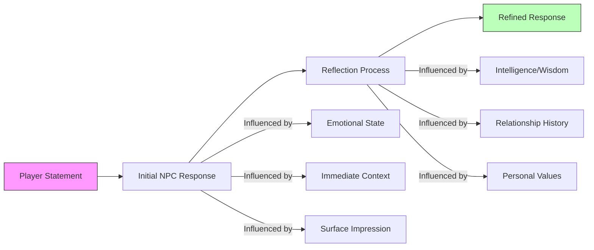
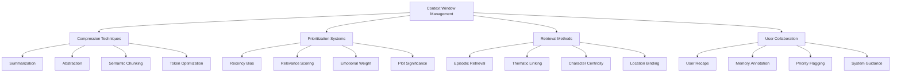

template_convo.md:
<code>
---
id: template_convo
title: "Conversation Mode Template"
type: template
category: interaction
version: 1.1.0
last_updated: 2025-04-13
created_by: The Architect
maintained_by: The Architect

core_nodes:
  - conversation_mode
  - dialogue_structure
  - reflection_system

crosslinks:
  - memory
  - narrative
  - world
  - relations
  - journal
  - meta_commands
  - companions
  - skills

tags:
  - conversation
  - dialogue
  - npc
  - reflection
  - emotional_response
  - relationship
  - template
  - interaction

summary: >
  This file defines the Conversation Mode Template for Vantiel, including activation, dialogue structure, reflection-based NPC responses, companion interjections, and memory integration. It provides a foundation for immersive, dynamic conversations that evolve with relationships and context.

updates:
  - date: 2025-04-13
    change: "Integrated Reflection System for more realistic NPC responses. Convo 'You said' fixes."
---

# Table of Contents
- [Conversation Mode Template](#conversation-mode-template)
- [Conversation Mode Flowchart](#conversation-mode-flowchart)
- [1.0 Overview](#10-overview)
- [2.0 Conversation Mode Activation](#20-conversation-mode-activation)
  - [2.1 Automatic Triggers](#21-automatic-triggers)
  - [2.2 Manual Activation](#22-manual-activation)
  - [2.3 Scene Setting](#23-scene-setting)
- [3.0 Dialogue Structure](#30-dialogue-structure)
  - [3.1 Player Dialogue](#31-player-dialogue)
  - [3.2 NPC Dialogue](#32-npc-dialogue)
  - [3.3 Companion Interjections](#33-companion-interjections)
- [4.0 NPC Responses](#40-npc-responses)
  - [4.1 Relationship-Based Responses](#41-relationship-based-responses)
  - [4.2 Context-Sensitive Responses](#42-context-sensitive-responses)
  - [4.3 Emotional Responses](#43-emotional-responses)
  - [4.4 Reflection-Based Responses](#44-reflection-based-responses)
- [5.0 Conversation Termination](#50-conversation-termination)
  - [5.1 Natural Conclusion](#51-natural-conclusion)
  - [5.2 Player Termination](#52-player-termination)
  - [5.3 External Interruption](#53-external-interruption)
- [6.0 Special Conversation Features](#60-special-conversation-features)
  - [6.1 Skill-Based Dialogue Options](#61-skill-based-dialogue-options)
  - [6.2 Class-Specific Dialogue](#62-class-specific-dialogue)
  - [6.3 Relationship Development](#63-relationship-development)
- [7.0 Implementation Notes](#70-implementation-notes)
  - [7.1 Memory Integration](#71-memory-integration)
  - [7.2 Conversation Flags](#72-conversation-flags)
  - [7.3 Conversation Mode Styling](#73-conversation-mode-styling)
- [8.0 Example Conversation Flow](#80-example-conversation-flow)

# Conversation Mode Flowchart

```mermaid
flowchart TD
    A[Conversation Mode] --> B[Activation]
    A --> C[Dialogue Structure]
    A --> D[NPC Responses]
    A --> E[Termination]

    %% Cross-system arrows for audit compliance
    A --> F[Memory System]
    A --> G[Narrative System]
    A --> H[World System]
    A --> I[Relations System]
    A --> J[Journal System]
    A --> K[Meta Commands]
    A --> L[Companions System]
    A --> M[Skills System]

    B --> B1[Automatic Triggers]
    B --> B2[Manual Activation]
    B --> B3[Scene Setting]

    C --> C1[Player Dialogue]
    C --> C2[NPC Dialogue]
    C --> C3[Companion Interjections]

    D --> D1[Relationship-Based]
    D --> D2[Context-Sensitive]
    D --> D3[Emotional Responses]

    E --> E1[Natural Conclusion]
    E --> E2[Player Termination]
    E --> E3[External Interruption]

    style A fill:#f9f,stroke:#333,stroke-width:2px
    style F fill:#ffe599,stroke:#333,stroke-width:2px
    style G fill:#c9daf8,stroke:#333,stroke-width:2px
    style H fill:#b4a7d6,stroke:#333,stroke-width:2px
    style I fill:#f4cccc,stroke:#333,stroke-width:2px
    style J fill:#fce5cd,stroke:#333,stroke-width:2px
    style K fill:#d9ead3,stroke:#333,stroke-width:2px
    style L fill:#b6d7a8,stroke:#333,stroke-width:2px
    style M fill:#ead1dc,stroke:#333,stroke-width:2px
```


# Conversation Mode Template

## 1.0 Overview

Conversation Mode transforms interactions with NPCs into immersive, line-by-line dialogues that reflect relationships, context, and emotional nuance. This template provides the structure for creating rich, dynamic conversations that respond to player choices and give NPCs distinct personalities and reactions.

## 2.0 Conversation Mode Activation

### 2.1 Automatic Triggers

Conversation Mode activates automatically when:
- The player directly addresses an NPC by name
- The player enters a scripted conversation scene
- An NPC initiates conversation with the player
- A companion wishes to discuss something important

**Example Automatic Trigger:**
```
> You approach the village elder's hut.

As you near the weathered door, it swings open. Elder Maren stands in the doorway, her eyes widening in recognition.

"The traveler returns," she says, leaning on her gnarled staff. "I had a feeling we would speak again."

[CONVERSATION MODE ACTIVATED]
```

### 2.2 Manual Activation

Players can manually initiate Conversation Mode by:
- Using the "TALK TO [NPC name]" command
- Responding to an NPC's greeting or question
- Choosing a dialogue option from a presented list

**Example Manual Activation:**
```
> TALK TO blacksmith

You approach Gareth the blacksmith, who looks up from his anvil. Sweat glistens on his brow as he sets down his hammer.

[CONVERSATION MODE ACTIVATED]
```

### 2.3 Scene Setting

When Conversation Mode activates, establish the scene with:
- Environmental details (location, time of day, weather)
- NPC's current activity and initial body language
- Relevant contextual information (recent events, relationship status)
- Any companions present who might interject

**Example Scene Setting:**
```
[CONVERSATION MODE ACTIVATED]

The tavern buzzes with evening activity, patrons laughing and arguing over their ales. Candlelight flickers across Eliza's face as she wipes down the bar counter. She glances up as you approach, her smile faltering slightly when she notices the blood on your sleeve.

Behind you, Daichi shifts uncomfortably, clearly uneasy in the crowded space.
```

## 3.0 Dialogue Structure

### 3.1 Player Dialogue

Player dialogue should:
- Be presented verbatim as entered by the player
- Include options when appropriate (3-5 choices maximum)
- Allow for free-form responses rather than just selections
- Reflect the player's established character and abilities
- Use natural speech attributions appropriate to the conversation context
- Improve the player's roleplay when needed while preserving their intent

**The "You Say" Rule:**
> "You say/said" and similar speech attributions (you ask, you whisper, etc.) should **only** be used during conversation scenes as natural dialogue representation.
> Never use meta-phrases like "You said you wanted to..." in narrative summaries, system recaps, or action directives.

**Example Player Dialogue (Correct Implementation):**
```
> "I need information about the abandoned mine. People say you're the one to ask."

OR

What would you like to say to Eliza?
1. "I need information about the abandoned mine."
2. "What's the latest gossip around town?"
3. "That incident yesterday... was it related to the strange lights?"
4. [Say something else]

> 1

You lean in slightly, lowering your voice. "I need information about the abandoned mine. People say you're the one to ask."
```

**Player Input (Action vs. Dialogue Examples):**

| Input Type | Player Input | Correct Implementation |
|------------|--------------|------------------------|
| **Dialogue** | "Tell the guard I need to speak with the captain urgently." | You approach the guard at the gate. "I need to speak with the captain urgently," you say, your tone conveying the importance of your request. |
| **Action** | "I want to examine the strange markings on the wall." | You move closer to the wall, running your fingers along the strange markings. The symbols feel oddly warm to the touch, almost vibrating beneath your fingertips. |
| **Combined** | "I quietly draw my dagger and whisper, 'Move and you die.'" | You quietly slide your dagger from its sheath, the steel making barely a whisper against the leather. Pressing the blade against the man's back, you lean close to his ear. "Move and you die," you whisper, your voice barely audible but unmistakably threatening. |

### 3.2 NPC Dialogue

NPC responses should:
- Avoid standard dialogue tags (he said, she replied)
- Use body language and environmental cues instead
- Reflect the NPC's personality, background, and current mood
- Adapt based on relationship with the player
- Include realistic pauses, hesitations, or interruptions

**Example NPC Dialogue:**
```
Eliza's hands pause on the counter. Her eyes dart to the other patrons before returning to you, narrowed slightly.

"The mine?" A soft scoff escapes her lips as she resumes wiping the already clean surface. "Folks who ask about that place tend to end up one of two ways—rich or dead. Usually the latter."

She leans closer, voice barely audible above the tavern's din. "What's your interest in those cursed tunnels, anyway?"
```

### 3.3 Companion Interjections

Companions may interject when:
- The topic relates to their personal history or expertise
- They strongly agree or disagree with the conversation direction
- They have relevant information the player doesn't know
- Their relationship with the NPC warrants involvement

**Example Companion Interjection:**
```
Before you can respond, Daichi steps forward, his hand instinctively resting on his sword hilt.

"We're not treasure hunters," he mutters, eyes fixed on Eliza. "We're investigating the disappearances. Three people in two weeks isn't coincidence."

Eliza's expression shifts, surprise replacing suspicion. "You're here about the missing children?"
```

## 4.0 NPC Responses

### 4.1 Relationship-Based Responses

NPC dialogue varies based on:
- **Affinity Level:** How much they like/trust the player (0-100%)
- **History:** Past interactions and significant events
- **Reputation:** Player's standing in the community or faction
- **Favors:** Debts owed or favors performed

**Example Relationship Variations:**

Low Affinity (0-25%):
```
Eliza's jaw tightens. She turns away, busying herself with rearranging bottles.

"I don't discuss such things with strangers," she says coldly. "Especially armed ones who arrive after dark."
```

Medium Affinity (26-75%):
```
Eliza glances around cautiously before responding.

"I shouldn't talk about this here," she whispers. "But if you're serious about helping... meet me behind the mill at midnight. Come alone."
```

High Affinity (76-100%):
```
Relief washes over Eliza's face. She reaches beneath the counter and pulls out a folded map, already marked with notes.

"Thank the gods you've come," she breathes. "I've been gathering information for weeks, hoping someone would help. My nephew was the second to vanish."
```

### 4.2 Context-Sensitive Responses

NPCs respond differently based on:
- **Location:** Public vs. private settings
- **Time:** Day vs. night, or special dates
- **Recent Events:** How world events affect the conversation
- **Other NPCs Present:** Who might be listening or watching

**Example Context Variations:**

Public Setting:
```
Eliza shakes her head subtly, continuing to serve drinks. Her words come between customer interactions, fragmented and cautious.

"Not here," she murmurs while pouring an ale. "Too many ears." A forced smile as she hands a mug to another patron. "Some belong to the mayor."
```

Private Setting:
```
Alone in the storeroom, Eliza's composure crumbles. Her shoulders sag as she sinks onto a barrel.

"They've been taking them for the ritual," she says, voice shaking. "The mine connects to something ancient. Something hungry."
```

### 4.3 Emotional Responses

NPCs display emotions through:
- **Facial Expressions:** Subtle changes in appearance
- **Body Language:** Posture, gestures, movements
- **Voice Changes:** Tone, volume, pace of speech
- **Physiological Reactions:** Blushing, sweating, trembling

**Example Emotional Responses:**

Fear:
```
Eliza's face drains of color. The glass in her hand slips, shattering on the floor, though she doesn't seem to notice. Her eyes, wide and unfocused, stare through you rather than at you.

"You saw it?" A whisper, barely audible. "The thing with too many shadows?"
```

Anger:
```
The wooden spoon in Eliza's hand snaps. Her knuckles whiten around the broken pieces, and a flush creeps up her neck to her cheeks.

"My brother died fighting their kind," she hisses through clenched teeth. "And you suggest we simply let them take our land?"
```

### 4.4 Reflection-Based Responses

NPCs process information through a realistic two-stage response system that reflects how people naturally think and react. This creates more dynamic and authentic conversations where NPCs may revise their initial reactions upon reflection.



#### Two-Stage Response Sequence

1. **Initial Response** (Immediate, emotion-driven)
   - First reaction based on limited processing
   - Influenced heavily by current emotional state
   - May misinterpret intent or focus on one aspect
   - Often reveals unfiltered feelings or biases

2. **Reflection Process** (Visual/verbal cues)
   - Subtle indicators that the NPC is processing further
   - Brief pause, change in expression, or thoughtful gesture
   - Shows the NPC reconsidering or analyzing deeper
   - Intelligence and wisdom determine reflection quality

3. **Refined Response** (More measured, considered)
   - Secondary reaction after deeper thought
   - May modify, soften, or completely change initial stance
   - Incorporates broader context and relationship history
   - Shows deeper personality and values

#### Intelligence-Based Variation

The quality and speed of NPC reflection varies based on their intelligence and wisdom:

| Intelligence/Wisdom | Initial Response | Reflection Quality | Response Time | Examples |
|---------------------|------------------|-------------------|---------------|----------|
| Low | Emotional, simplistic | Minimal or absent | Slow or none | Village simpleton, drunk patron |
| Average | Mixed emotional/practical | Basic reconsideration | Moderate | Common merchant, typical guard |
| High | Balanced, measured | Thoughtful analysis | Quick | Village elder, experienced captain |
| Exceptional | Controlled, observant | Deep, multi-layered | Nearly immediate | Court advisor, master wizard |

#### Example Reflection Sequences

**Low Intelligence (Village Drunk):**
```
Initial Response:
The man's face contorts with sudden anger. He slams his mug down, ale sloshing over the rim.
"Thief! Yer a bloody thief!" he shouts, drawing stares from nearby patrons.

Reflection Process:
He squints at you through bleary eyes, swaying slightly.

Refined Response (minimal):
"Wait... yer not the one who took m'coin purse." He scratches his head, confused. "Think it was a fella with... a hat? Or was it a beard?" He shrugs and returns to his drink, apparently forgetting you entirely.
```

**Average Intelligence (Merchant):**
```
Initial Response:
The merchant frowns at your offer. "Fifteen gold? That's barely half what this sword is worth!" He crosses his arms defensively.

Reflection Process:
His eyes flick from the sword to your travel-worn appearance, then to the setting sun outside.

Refined Response:
"Look, I need to close shop soon, and winter's coming..." He sighs, shoulders relaxing slightly. "I can do twenty-two gold, but that's my final offer. I've got a family to feed."
```

**High Intelligence (Guild Master):**
```
Initial Response:
"Absolutely not," she says sharply. "Access to the archives is for guild members only. It's been our policy for decades."

Reflection Process:
She studies your face for a moment, fingers tapping thoughtfully on her desk. Something in your request seems to have caught her interest.

Refined Response:
"However..." Her tone shifts to one of careful consideration. "The text you're seeking does relate to the disturbances we've been investigating. Perhaps we could arrange temporary access—under supervision, of course—in exchange for sharing whatever you discover?"
```

**Exceptional Intelligence (Court Mage):**
```
Initial Response:
The mage raises an eyebrow at your theory. "An interesting proposition," he says, his tone politely neutral.

Reflection Process:
His eyes never leave yours, but you sense his mind working rapidly, connecting pieces of information.

Refined Response:
"You've connected the stellar alignment with the tide patterns—most wouldn't notice that." A subtle smile forms. "But you've overlooked something crucial. The ancient texts don't account for the Fracture's effect on arcane currents." He turns to his bookshelf. "Let me show you something that might refine your approach. Your intuition is correct, but the mechanism is more complex than you've surmised."
```

#### Implementation Guidelines

When implementing reflection-based responses:

1. **Character Consistency**: Reflection should reveal deeper aspects of established character, not contradict them
2. **Selective Application**: Not every statement needs the full reflection treatment; use it for important moments
3. **Pacing Awareness**: Reflection takes time; use judiciously to maintain conversation flow
4. **Visual Communication**: Show the process through physical cues, not just verbal statements
5. **Relationship Impact**: Deeper relationships should improve NPC reflection quality about the player

#### Memory Thread Integration

Reflection processes should be recorded in NPC memory threads to build consistent character development:

```json
{
  "reflection_pattern": {
    "npc": "Elder Maren",
    "intelligence": "high",
    "wisdom": "very high",
    "typical_reflection_process": "thoughtful silence followed by measured reconsideration",
    "reflection_triggers": ["village safety", "ancient history", "personal ethics"],
    "reflection_examples": [
      {
        "topic": "alliance with neighboring village",
        "initial_response": "skeptical_reluctance",
        "refined_response": "cautious_agreement",
        "reasoning": "prioritized pragmatic survival over old grievances"
      }
    ]
  }
}
```

## 5.0 Conversation Termination

### 5.1 Natural Conclusion

Conversations end naturally when:
- The topic has been fully explored
- The NPC has shared all relevant information
- A decision or agreement has been reached
- The emotional arc of the conversation completes

**Example Natural Conclusion:**
```
Eliza hands you the key, her expression solemn.

"That's all I know, all I can give you. Whether it's enough..." She shrugs, turning back to her customers. "May the gods watch over you in those tunnels. You'll need more than steel where you're going."

[CONVERSATION MODE TERMINATED]
```

### 5.2 Player Termination

Players can end conversations by:
- Using the "END CONVERSATION" command
- Walking away from the NPC
- Changing the subject to conclude the interaction
- Taking an action that would naturally end dialogue

**Example Player Termination:**
```
> "Thank you for the information. I should go prepare."

You nod gratefully to Eliza. "Thank you for the information. I should go prepare."

She acknowledges with a tired smile as you turn to leave, the tavern's warmth and noise fading behind you as you step into the cool night air.

[CONVERSATION MODE TERMINATED]
```

### 5.3 External Interruption

Conversations may be interrupted by:
- Another NPC entering the scene
- An environmental event (weather, time constraints)
- A threat or emergency
- A scheduled NPC activity that cannot wait

**Example External Interruption:**
```
Before Eliza can answer your question, the tavern door bursts open. A town guard stumbles in, armor splattered with dark fluid.

"Attack at the east gate!" he shouts, voice cracking with panic. "Monsters in the town!"

The tavern erupts in chaos. Eliza gives you one last meaningful look before rushing to help panicked patrons.

[CONVERSATION MODE TERMINATED]
```

## 6.0 Special Conversation Features

### 6.1 Skill-Based Dialogue Options

Certain dialogue options appear based on:
- **Persuasion:** Convince NPCs through charisma (CHA-based)
- **Intimidation:** Pressure NPCs through strength or reputation (STR-based)
- **Insight:** Detect lies or hidden meanings (WIS-based)
- **Knowledge:** Recognize references or understand technical terms (INT-based)

**Example Skill-Based Options:**
```
How will you respond to the merchant's offer?

1. "That price is highway robbery." (Standard)
2. "Perhaps we could help each other... I know about the shipment you're expecting." [Persuasion]
3. "I wonder what the guard captain would think of your special inventory." [Intimidation]
4. "Your hands trembled when you mentioned the amulet. What aren't you telling me?" [Insight]
5. "This craftsmanship is Elven, pre-Fracture era. It's worth triple your offer." [Knowledge]
```

### 6.2 Class-Specific Dialogue

Certain classes unlock unique dialogue options:
- **Voidcaller:** Sense magical properties or otherworldly connections
- **Saint of Nature:** Understand natural elements or animal behavior
- **Hero:** Inspire or rally NPCs through legendary reputation
- **Shadowblade:** Recognize criminal elements or hidden threats

**Example Class-Specific Dialogue:**
```
As the elder describes the village's plight, you notice:

1. "Tell me more about these night terrors." (Standard)
2. "The void stirs beneath this village. I can feel its hunger." [Voidcaller]
3. "The animals have been avoiding the northern woods, haven't they?" [Saint of Nature]
4. "Your people need hope as much as they need protection." [Hero]
5. "Someone in this village is lying. The tracks tell a different story." [Shadowblade]
```

### 6.3 Relationship Development

Conversations build relationships through:
- **Gift Giving:** Presenting items of value or significance
- **Personal Questions:** Learning about the NPC's background
- **Shared Experiences:** Referencing past adventures together
- **Value Alignment:** Agreeing with the NPC's worldview

**Example Relationship Development:**
```
Eliza seems more relaxed around you now. You could:

1. Continue discussing the mine situation
2. "I brought something for your nephew when we find him." [Give Gift]
3. "How long has your family lived in this village?" [Personal Question]
4. "Remember when we dealt with those bandits last month? We make a good team." [Shared Experience]
5. "The mayor should be protecting these people, not hiding in his mansion." [Value Alignment]
```

## 7.0 Implementation Notes

### 7.1 Memory Integration

Each significant conversation should:
- Create or update NPC memory threads
- Record important information revealed
- Track relationship changes (affinity adjustments)
- Note any promises made or quests accepted

**Example Memory Thread Update:**
```json
{
  "npc_memory": {
    "eliza_tavern_keeper": {
      "affinity": 65,
      "last_interaction": "Day 45",
      "significant_topics": [
        {
          "topic": "abandoned_mine",
          "information_shared": "Connected to disappearances, ritual site, ancient entity",
          "player_reaction": "Agreed to investigate",
          "date": "Day 45"
        }
      ],
      "promises_made": [
        {
          "promise": "Find missing nephew",
          "status": "active",
          "reward_offered": "Family heirloom map"
        }
      ]
    }
  }
}
```

### 7.2 Conversation Flags

Track important conversation states with flags:
- **TOPIC_DISCUSSED:** Whether a subject has been raised
- **SECRET_REVEALED:** If hidden information was shared
- **QUEST_AVAILABLE:** If the NPC has a task to offer
- **RELATIONSHIP_CHANGED:** If affinity shifted significantly

**Example Flag Implementation:**
```
After Eliza reveals the information about the ritual:
- SET FLAG: TOPIC_DISCUSSED_MINE_RITUAL = TRUE
- SET FLAG: SECRET_REVEALED_ANCIENT_ENTITY = TRUE
- SET FLAG: QUEST_AVAILABLE_RESCUE_NEPHEW = TRUE
- MODIFY: ELIZA_AFFINITY +10 (Trusted with sensitive information)
```

### 7.3 Conversation Mode Styling

Format conversation mode with:
- **Clear Visual Distinction:** Indicate when conversation mode is active
- **Speaker Attribution:** Make it clear who is speaking
- **Emotional Cues:** Highlight significant emotional states
- **Action Integration:** Allow for actions during dialogue

**Example Styling:**
```
[CONVERSATION MODE]

You: "What happened to the children who went missing?"

Eliza: *lowers voice, glances nervously at the door*
"They were taken on the new moon. Each time, the same pattern—no sounds, no struggle. Just... gone by morning."

[Daichi shifts uncomfortably behind you]

Options:
1. "And the mine is connected to this how?"
2. "Who else knows about this?"
3. "I'll find them, I promise."
4. [Insight Check] "You're holding something back."
5. [Say something else]
```

## 8.0 Example Conversation Flow

```
[CONVERSATION MODE ACTIVATED]

The smithy's heat hits you like a wall as you enter. Gareth hammers rhythmically at a glowing blade, sparks flying with each strike. He doesn't look up immediately, finishing his pattern before plunging the metal into a water barrel. Steam hisses upward, momentarily obscuring his scarred face.

"The wanderer returns," he says, wiping sweat from his brow with a soot-stained forearm. "What brings you to my forge this time?"

> "I need a weapon that can harm spirits."

You step closer to the forge, feeling its heat on your face. "I need a weapon that can harm spirits."

Gareth's hammer freezes mid-reach. His eyes, narrowed with suspicion, study your face.

"Spirit-killing steel?" The words come slowly, measured. "That's... not something I discuss with just anyone." He sets the hammer down with deliberate care. "What exactly have you encountered?"

> "Something in the abandoned mine. It took three children already."

"Something in the abandoned mine," you say, lowering your voice despite the forge's noise. "It took three children already."

Gareth's expression darkens. He glances toward the door, then moves to close it, sliding a heavy bolt into place.

"Maren's grandson among them," he mutters. "I feared as much."

He retrieves a small key from around his neck, unlocking a cabinet behind his workbench. From within, he withdraws a bundle wrapped in oiled cloth.

"Silver alone won't do it," he says, unwrapping the bundle to reveal a strange, bluish metal. "You need cold-forged starfall iron. Rare as dragon tears and twice as valuable."

[Daichi steps forward, examining the metal with obvious interest]

Daichi: "I've heard tales of such metal. The Beastmen Empire used it against the shadow walkers."

Gareth nods grimly. "Your friend knows his lore. This is the last of my supply. I can forge you a blade, but the cost..."

Options:
1. "Name your price. The children are worth any cost."
2. "Perhaps we can trade. I have something valuable to offer."
3. "The mine might contain more of this metal. I could retrieve it for you."
4. [Intimidation] "People are dying. Is profit all you care about?"
5. [Say something else]

> 1

"Name your price," you say firmly. "The children are worth any cost."

Something shifts in Gareth's expression—respect, perhaps, or relief. He rewraps the metal carefully.

"No gold," he says, shaking his head. "For this, I ask a different payment." He meets your gaze steadily. "My daughter Lily was among those taken. Three nights ago."

His voice remains level, but his white-knuckled grip on the workbench betrays his emotion.

"Bring her back, and the blade is yours. I'll begin forging tonight."

> "I'll find her, Gareth. You have my word."

"I'll find her, Gareth," you say, holding his gaze. "You have my word."

He nods once, a sharp, decisive movement. Without further words, he turns back to his forge, stoking the flames higher.

"Return tomorrow at dusk," he says over his shoulder. "The blade will be ready."

The conversation seems to be at its natural conclusion.

> END CONVERSATION

You nod respectfully and turn to leave. As Daichi follows you out, you hear the rhythmic hammering resume behind you—faster now, driven by purpose.

[CONVERSATION MODE TERMINATED]
```

This template provides the foundation for creating immersive, dynamic conversations that respond to player choices, reflect NPC personalities, and evolve based on relationships and context. By following these guidelines, conversations become a central storytelling mechanism that deepens immersion and creates meaningful character connections.

</code>

template_journal.md:
<code>
---
id: template_journal
title: "Journal System Template"
type: template
category: meta
version: 1.0.0
last_updated: 2025-02-25
created_by: The Architect
maintained_by: The Architect

core_nodes:
  - journal
  - entry_types
  - memory_integration

crosslinks:
  - memory
  - narrative
  - world
  - relations
  - meta_commands
  - quest
  - character
  - personal

tags:
  - journal
  - entry
  - memory
  - quest
  - character
  - world
  - personal
  - template
  - meta

summary: >
  This file defines the Journal System Template for Vantiel, including entry types, structure, commands, memory integration, and narrative enhancement. It provides a foundation for immersive, organized, and searchable player journals that support memory, quest tracking, and storytelling.

updates:
  - date: 2025-02-25
    change: "Initial version with entry types, structure, commands, and memory integration."
---

# Table of Contents
- [Journal System Template](#journal-system-template)
- [Journal System Flowchart](#journal-system-flowchart)
- [1.0 Overview](#10-overview)
- [2.0 Entry Types](#20-entry-types)
  - [2.1 Quest Entries](#21-quest-entries)
  - [2.2 Character Entries](#22-character-entries)
  - [2.3 World Entries](#23-world-entries)
  - [2.4 Personal Entries](#24-personal-entries)
- [3.0 Entry Structure](#30-entry-structure)
  - [3.1 Header](#31-header)
  - [3.2 Body](#32-body)
  - [3.3 Metadata](#33-metadata)
- [4.0 Journal Commands](#40-journal-commands)
  - [4.1 Journal Command](#41-journal-command)
  - [4.2 Entry Command](#42-entry-command)
  - [4.3 Search Command](#43-search-command)
- [5.0 Automatic Entry Generation](#50-automatic-entry-generation)
  - [5.1 Quest Triggers](#51-quest-triggers)
  - [5.2 Character Triggers](#52-character-triggers)
  - [5.3 World Triggers](#53-world-triggers)
- [6.0 Player-Created Entries](#60-player-created-entries)
  - [6.1 Personal Entry Creation](#61-personal-entry-creation)
  - [6.2 Entry Editing](#62-entry-editing)
  - [6.3 Entry Annotation](#63-entry-annotation)
- [7.0 Memory Integration](#70-memory-integration)
  - [7.1 Memory Thread Connection](#71-memory-thread-connection)
  - [7.2 Recall System](#72-recall-system)
  - [7.3 Narrative Integration](#73-narrative-integration)
- [8.0 Journal Styling](#80-journal-styling)
  - [8.1 Visual Presentation](#81-visual-presentation)
  - [8.2 Voice and Tone](#82-voice-and-tone)
- [9.0 Example Journal Collection](#90-example-journal-collection)

# Journal System Flowchart

```mermaid
flowchart TD
    A[Journal System] --> B[Entry Types]
    A --> C[Entry Structure]
    A --> D[Journal Commands]
    A --> E[Memory Integration]

    %% Cross-system arrows for audit compliance
    A --> F[Memory System]
    A --> G[Narrative System]
    A --> H[World System]
    A --> I[Relations System]
    A --> J[Journal System]
    A --> K[Meta Commands]
    A --> L[Quest System]
    A --> M[Character System]
    A --> N[Personal System]

    B --> B1[Quest Entries]
    B --> B2[Character Entries]
    B --> B3[World Entries]
    B --> B4[Personal Entries]

    C --> C1[Header]
    C --> C2[Body]
    C --> C3[Metadata]

    D --> D1[Journal Command]
    D --> D2[Entry Command]
    D --> D3[Search Command]

    E --> E1[Memory Threads]
    E --> E2[Recall System]
    E --> E3[Narrative Integration]

    style A fill:#f9f,stroke:#333,stroke-width:2px
    style F fill:#ffe599,stroke:#333,stroke-width:2px
    style G fill:#c9daf8,stroke:#333,stroke-width:2px
    style H fill:#b4a7d6,stroke:#333,stroke-width:2px
    style I fill:#f4cccc,stroke:#333,stroke-width:2px
    style J fill:#fce5cd,stroke:#333,stroke-width:2px
    style K fill:#d9ead3,stroke:#333,stroke-width:2px
    style L fill:#ead1dc,stroke:#333,stroke-width:2px
    style M fill:#b6d7a8,stroke:#333,stroke-width:2px
    style N fill:#ead1dc,stroke:#333,stroke-width:2px
```


# Journal System Template

## 1.0 Overview

The Journal System serves as the player's personal record of their adventures, discoveries, and relationships in Vantiel. It automatically captures significant events, tracks quest progress, and allows players to add their own observations and thoughts. This template provides the structure for creating consistent, informative, and narratively rich journal entries that enhance immersion and serve as a valuable reference tool.

## 2.0 Entry Types

### 2.1 Quest Entries

Automatically generated when:
- A new quest is accepted
- A significant quest milestone is reached
- A quest is completed or failed

**Structure:**
- **Title:** Clear indication of the quest name
- **Status:** Active, Completed, Failed, or On Hold
- **Description:** Brief overview of the quest's purpose
- **Current Objective:** The next step to progress
- **Progress:** Notable achievements or discoveries
- **Rewards:** What has been or will be gained
- **Related NPCs:** Key figures involved in the quest

**Example Quest Entry:**
```
[QUEST ENTRY] - The Missing Children
Status: Active

Three children have disappeared from Riverstone Village over the past two weeks.
The villagers suspect something in the abandoned mine is responsible.

Current Objective: Speak with Eliza at the tavern for more information.

Progress:
- Learned about the disappearances from Elder Maren
- Discovered strange markings near the village well
- Found a child's toy at the mine entrance

Related NPCs:
- Elder Maren (village leader)
- Eliza (tavern keeper, missing nephew)
- Gareth (blacksmith, missing daughter)

Last Updated: Day 45
```

### 2.2 Character Entries

Automatically generated when:
- Meeting a significant NPC for the first time
- Learning important information about an NPC
- Relationship status with an NPC changes significantly

**Structure:**
- **Name:** The character's full name
- **Role/Occupation:** Their position in society
- **Location:** Where they can typically be found
- **Description:** Physical appearance and notable traits
- **Background:** What is known of their history
- **Relationship:** Current standing with the player
- **Notes:** Miscellaneous observations or reminders

**Example Character Entry:**
```
[CHARACTER ENTRY] - Gareth Ironhand
Role: Master Blacksmith
Location: Riverstone Forge

A burly man in his fifties with a scarred face and calloused hands.
Despite his intimidating appearance, his eyes show kindness and wisdom.
Known for crafting the finest weapons in the region.

Background:
- Trained under the legendary dwarven smith Durin
- Lost his wife to a plague five years ago
- Serves as an unofficial advisor to Elder Maren

Relationship: Respectful (Affinity 65%)
- Forged your first proper sword
- Helped him fend off bandits last month
- Currently crafting a spirit-killing blade for you

Notes:
- His daughter Lily was taken three nights ago
- Possesses rare starfall iron
- Knows ancient forging techniques

Last Updated: Day 45
```

### 2.3 World Entries

Automatically generated when:
- Discovering a new location
- Learning significant lore or history
- Uncovering secrets about the world

**Structure:**
- **Subject:** The location, event, or concept
- **Category:** Settlement, Landmark, History, Lore, etc.
- **Description:** Physical details or basic explanation
- **Significance:** Why this information matters
- **Connections:** Related places, events, or people
- **Secrets:** Hidden aspects discovered

**Example World Entry:**
```
[WORLD ENTRY] - The Abandoned Mine
Category: Landmark

A sprawling mine complex north of Riverstone Village, abandoned after
a mysterious incident twenty years ago. Entrance partially collapsed,
with strange symbols carved into the remaining support beams.

Significance:
- Source of the region's wealth in previous generation
- Now believed to be connected to recent disappearances
- Possible site of ancient ruins beneath the mine shafts

Connections:
- Riverstone Village (nearest settlement)
- The Fracture (symbols match those from this event)
- Cult of the Endless Shadow (rumored to operate here)

Secrets:
- Hidden entrance discovered behind waterfall
- Evidence of recent activity despite "abandonment"
- Contains rare starfall iron deposits

Last Updated: Day 45
```

### 2.4 Personal Entries

Created by the player to record:
- Personal thoughts and reflections
- Plans and strategies
- Theories about mysteries
- Emotional responses to events

**Structure:**
- **Title:** Player-defined subject
- **Date:** Current in-game day
- **Content:** Player's thoughts and observations
- **Tags:** Optional keywords for organization

**Example Personal Entry:**
```
[PERSONAL ENTRY] - Suspicions About Elder Maren
Day 45

Something doesn't add up about Elder Maren's story. She claimed the
disappearances started two weeks ago, but Gareth said his daughter
was only taken three nights ago, and he called her the third victim.

That timeline doesn't match what Maren told me. Plus, I noticed her
hands trembling when she mentioned the mine. Is she hiding something,
or simply afraid? I should investigate her cottage when possible.

The symbols at the mine entrance match those in my vision from the
Fracture. Coincidence? I doubt it. This feels connected to something
much larger than a local problem.

Tags: #Riverstone #Mysteries #Suspicions
```

## 3.0 Entry Structure

### 3.1 Header

All entries include a standardized header:

**Components:**
- **Entry Type:** [QUEST ENTRY], [CHARACTER ENTRY], etc.
- **Title:** Name or subject of the entry
- **Category/Status:** Additional classification information
- **Creation Date:** When the entry was first made

**Format:**
```
[ENTRY TYPE] - Title
Category/Status: Value

```

### 3.2 Body

The main content follows a consistent structure:

**Components:**
- **Primary Description:** Essential information about the subject
- **Categorized Sections:** Organized by relevant headings
- **Bullet Points:** Used for lists of related information
- **Highlighted Terms:** Important names or concepts emphasized

**Format Guidelines:**
- Keep paragraphs short and focused (2-4 sentences)
- Use bullet points for clarity when listing multiple items
- Maintain a consistent voice (informative, observational)
- Include sensory details for locations and characters

### 3.3 Metadata

Additional information at the entry's end:

**Components:**
- **Last Updated:** Day when the entry was last modified
- **Related Entries:** Links to connected journal entries
- **Tags:** Searchable keywords (for personal entries)
- **System Notes:** Hidden gameplay information

**Format:**
```

Last Updated: Day X
Related Entries: Entry1, Entry2
Tags: #Tag1 #Tag2 #Tag3
```

## 4.0 Journal Commands

### 4.1 Journal Command

Opens the journal and displays recent entries:

**Usage:**
```
> JOURNAL
```

**Response:**
```
[JOURNAL OPENED]

Recent Entries:
1. [QUEST] The Missing Children (Active) - Day 45
2. [CHARACTER] Gareth Ironhand - Day 45
3. [WORLD] The Abandoned Mine - Day 45
4. [PERSONAL] Suspicions About Elder Maren - Day 45
5. [QUEST] Stolen Shipment (Completed) - Day 43

Type "ENTRY [number or title]" to view a specific entry.
Type "JOURNAL [category]" to filter entries.
Type "SEARCH [term]" to find specific information.
```

### 4.2 Entry Command

Displays a specific journal entry:

**Usage:**
```
> ENTRY Missing Children
```
or
```
> ENTRY 1
```

**Response:**
*[Displays the full entry for "The Missing Children" quest]*

### 4.3 Search Command

Searches all journal entries for specific terms:

**Usage:**
```
> SEARCH mine
```

**Response:**
```
[SEARCH RESULTS: "mine"]

Found in 3 entries:

1. [QUEST] The Missing Children (Active) - Day 45
"...villagers suspect something in the abandoned mine is responsible."
"...Found a child's toy at the mine entrance"

2. [WORLD] The Abandoned Mine - Day 45
"A sprawling mine complex north of Riverstone Village..."
"...possible site of ancient ruins beneath the mine shafts"

3. [PERSONAL] Suspicions About Elder Maren - Day 45
"...I noticed her hands trembling when she mentioned the mine."
"The symbols at the mine entrance match those in my vision..."

Type "ENTRY [number]" to view the full entry.
```

## 5.0 Automatic Entry Generation

### 5.1 Quest Triggers

Journal automatically creates or updates quest entries when:

**New Quest:**
- Player explicitly accepts a task from an NPC
- Player discovers a situation requiring intervention
- Player finds an item that initiates a quest

**Quest Progress:**
- Key items are acquired
- Important locations are discovered
- Significant NPCs are encountered
- Critical information is learned

**Quest Completion:**
- Primary objective is accomplished
- Quest is failed or abandoned
- Alternative resolution is achieved

### 5.2 Character Triggers

Journal automatically creates or updates character entries when:

**First Meeting:**
- Conversation with a named NPC
- NPC performs a significant action
- NPC is mentioned repeatedly by others

**Relationship Changes:**
- Affinity crosses a threshold (25%, 50%, 75%)
- Player completes a task for the NPC
- Player betrays or harms the NPC
- NPC reveals important personal information

**Status Changes:**
- NPC changes location or occupation
- NPC's role in the story evolves
- NPC is injured, transformed, or killed

### 5.3 World Triggers

Journal automatically creates or updates world entries when:

**Location Discovery:**
- Player enters a new named area
- Player observes a landmark from a distance
- Player receives a map or directions

**Lore Acquisition:**
- Books or scrolls are read
- NPCs share historical information
- Ancient inscriptions are translated
- Visions or dreams reveal world secrets

**World Changes:**
- Natural disasters or major events
- Political shifts or faction changes
- Seasonal transitions with significant impact
- Player actions that alter the environment

## 6.0 Player-Created Entries

### 6.1 Personal Entry Creation

Players can create their own journal entries:

**Command:**
```
> JOURNAL NEW
```

**Prompts:**
```
[CREATE NEW JOURNAL ENTRY]

Entry Type: PERSONAL
Title: [player enters title]
Content: [player enters content]
Tags (optional): [player enters tags]

Entry saved to journal.
```

### 6.2 Entry Editing

Players can modify existing entries:

**Command:**
```
> JOURNAL EDIT [entry number or title]
```

**Prompts:**
```
[EDIT JOURNAL ENTRY]

Current Content:
[displays existing entry]

New Content: [player enters revised content]

Entry updated.
```

### 6.3 Entry Annotation

Players can add notes to system-generated entries:

**Command:**
```
> JOURNAL ANNOTATE [entry number or title]
```

**Prompts:**
```
[ANNOTATE JOURNAL ENTRY]

Current Entry:
[displays existing entry]

Your Notes: [player enters annotation]

Annotation added to entry.
```

## 7.0 Memory Integration

### 7.1 Memory Thread Connection

Journal entries connect to the memory system:

**Automatic Linking:**
- Quest entries link to quest memory threads
- Character entries link to NPC memory threads
- World entries link to world state memory threads
- Personal entries link to player character memory threads

**Memory Updates:**
- Journal entries update when memory threads change
- Memory recall can reference journal entries
- Critical information is stored in both systems

**Example Memory Thread Link:**
```json
{
  "quest_memory": {
    "missing_children": {
      "status": "active",
      "stage": 2,
      "journal_entry_id": "quest_missing_children",
      "last_updated": "Day 45",
      "key_discoveries": [
        "strange_markings",
        "mine_entrance_toy",
        "timeline_discrepancy"
      ]
    }
  }
}
```

### 7.2 Recall System

Journal facilitates memory recall:

**Automatic Reminders:**
- Relevant entries surfaced when entering related locations
- Character entries recalled when meeting NPCs again
- Quest entries highlighted when objectives are nearby

**Contextual Recall:**
- "Do I know anything about this?" prompts journal search
- NPCs referencing past events trigger entry display
- Similar situations recall relevant past experiences

**Example Recall Prompt:**
```
As you approach the mine entrance, you recall your journal entry about
this place. Would you like to review it? (Y/N)

> Y

[Displays "The Abandoned Mine" world entry]
```

### 7.3 Narrative Integration

Journal entries enhance storytelling:

**Story Continuity:**
- References to previous adventures
- Character development tracking
- World changes documented over time

**Player Agency:**
- Personal theories and plans recorded
- Emotional journey captured
- Decision-making process preserved

**Immersion Enhancement:**
- Rich world details at player's fingertips
- Sense of time passing and history accumulating
- Personal stake in the world's events

## 8.0 Journal Styling

### 8.1 Visual Presentation

Journal entries use consistent formatting:

**Typography:**
- Entry types in [BRACKETS]
- Section headings in **bold**
- Important terms in *italics*
- Lists as bullet points

**Organization:**
- Chronological by default (newest first)
- Categorized when filtered
- Searchable by keywords
- Linked entries referenced

**Example Styling:**
```
[QUEST ENTRY] - The Missing Children
Status: Active

Three children have disappeared from Riverstone Village over the past two weeks.
The villagers suspect something in the *abandoned mine* is responsible.

Current Objective:
Speak with **Eliza** at the tavern for more information.

Progress:
• Learned about the disappearances from Elder Maren
• Discovered strange markings near the village well
• Found a child's toy at the mine entrance

Related NPCs:
• Elder Maren (village leader)
• Eliza (tavern keeper, missing nephew)
• Gareth (blacksmith, missing daughter)

Last Updated: Day 45
Related Entries: Abandoned Mine, Gareth Ironhand
```

### 8.2 Voice and Tone

Journal entries maintain consistent voice:

**Quest Entries:**
- Objective and clear
- Action-oriented
- Focused on goals and progress

**Character Entries:**
- Observational and descriptive
- Factual about known information
- Personal regarding relationships

**World Entries:**
- Informative and educational
- Balanced between facts and mysteries
- Contextual to player's knowledge

**Personal Entries:**
- First-person perspective
- Reflective and subjective
- Emotional and speculative

## 9.0 Example Journal Collection

### Example Quest Entry

```
[QUEST ENTRY] - The Missing Children
Status: Active

Three children have disappeared from Riverstone Village over the past two weeks.
The villagers suspect something in the abandoned mine is responsible.

Current Objective:
Speak with Eliza at the tavern for more information.

Progress:
• Learned about the disappearances from Elder Maren
• Discovered strange markings near the village well
• Found a child's toy at the mine entrance

Related NPCs:
• Elder Maren (village leader)
• Eliza (tavern keeper, missing nephew)
• Gareth (blacksmith, missing daughter)

Last Updated: Day 45
Related Entries: Abandoned Mine, Gareth Ironhand
```

### Example Character Entry

```
[CHARACTER ENTRY] - Gareth Ironhand
Role: Master Blacksmith
Location: Riverstone Forge

A burly man in his fifties with a scarred face and calloused hands.
Despite his intimidating appearance, his eyes show kindness and wisdom.
Known for crafting the finest weapons in the region.

Background:
• Trained under the legendary dwarven smith Durin
• Lost his wife to a plague five years ago
• Serves as an unofficial advisor to Elder Maren

Relationship: Respectful (Affinity 65%)
• Forged your first proper sword
• Helped him fend off bandits last month
• Currently crafting a spirit-killing blade for you

Notes:
• His daughter Lily was taken three nights ago
• Possesses rare starfall iron
• Knows ancient forging techniques

Last Updated: Day 45
Related Entries: Missing Children, Starfall Iron
```

### Example World Entry

```
[WORLD ENTRY] - The Abandoned Mine
Category: Landmark

A sprawling mine complex north of Riverstone Village, abandoned after
a mysterious incident twenty years ago. Entrance partially collapsed,
with strange symbols carved into the remaining support beams.

Significance:
• Source of the region's wealth in previous generation
• Now believed to be connected to recent disappearances
• Possible site of ancient ruins beneath the mine shafts

Connections:
• Riverstone Village (nearest settlement)
• The Fracture (symbols match those from this event)
• Cult of the Endless Shadow (rumored to operate here)

Secrets:
• Hidden entrance discovered behind waterfall
• Evidence of recent activity despite "abandonment"
• Contains rare starfall iron deposits

Last Updated: Day 45
Related Entries: Missing Children, The Fracture, Starfall Iron
```

### Example Personal Entry

```
[PERSONAL ENTRY] - Suspicions About Elder Maren
Day 45

Something doesn't add up about Elder Maren's story. She claimed the
disappearances started two weeks ago, but Gareth said his daughter
was only taken three nights ago, and he called her the third victim.

That timeline doesn't match what Maren told me. Plus, I noticed her
hands trembling when she mentioned the mine. Is she hiding something,
or simply afraid? I should investigate her cottage when possible.

The symbols at the mine entrance match those in my vision from the
Fracture. Coincidence? I doubt it. This feels connected to something
much larger than a local problem.

Tags: #Riverstone #Mysteries #Suspicions
Related Entries: Missing Children, Elder Maren, The Fracture
```

This template provides the foundation for creating a comprehensive journal system that enhances immersion, aids player memory, and enriches the storytelling experience. By following these guidelines, the journal becomes both a practical gameplay tool and a narrative device that deepens the player's connection to the world of Vantiel.

</code>

template_memory.md:
<code>
---
id: template_memory
title: "Memory System Template"
type: template
category: meta
version: 1.0.1
last_updated: 2025-04-06
created_by: The Architect
maintained_by: The Architect

core_nodes:
  - memory_system
  - memory_threads
  - information_propagation

crosslinks:
  - memory
  - narrative
  - world
  - relations
  - journal
  - meta_commands
  - quest
  - character
  - personal

tags:
  - memory
  - thread
  - recall
  - information_propagation
  - knowledge_boundaries
  - template
  - meta
  - best_practices

summary: >
  This file defines the Memory System Template for Vantiel, including memory thread types, storage, recall, integration, information propagation, and best practices. It provides a foundation for persistent, context-aware, and narratively rich memory systems that support all other modules.

updates:
  - date: 2025-04-06
    change: "Added information propagation tags and knowledge boundaries."
  - date: 2025-02-25
    change: "Initial version with memory thread types, storage, recall, and integration."
---

# Table of Contents
- [Memory System Template](#memory-system-template)
- [Memory System Flowchart](#memory-system-flowchart)
- [1.0 Overview](#10-overview)
- [2.0 Memory Thread Types](#20-memory-thread-types)
  - [2.1 NPC Memory Threads](#21-npc-memory-threads)
  - [2.2 Quest Memory Threads](#22-quest-memory-threads)
  - [2.3 World Memory Threads](#23-world-memory-threads)
  - [2.4 Player Memory Threads](#24-player-memory-threads)
  - [2.5 Information Propagation Metadata](#25-information-propagation-metadata)
- [3.0 Memory Storage Systems](#30-memory-storage-systems)
  - [3.1 Short-Term Memory](#31-short-term-memory)
  - [3.2 Long-Term Memory](#32-long-term-memory)
  - [3.3 Persistent Memory](#33-persistent-memory)
- [4.0 Memory Recall Systems](#40-memory-recall-systems)
  - [4.1 Contextual Recall](#41-contextual-recall)
  - [4.2 Explicit Recall](#42-explicit-recall)
  - [4.3 Emotional Recall](#43-emotional-recall)
- [5.0 Memory Integration Systems](#50-memory-integration-systems)
  - [5.1 Journal Integration](#51-journal-integration)
  - [5.2 Narrative Integration](#52-narrative-integration)
  - [5.3 System Integration](#53-system-integration)
- [6.0 Memory Thread Management](#60-memory-thread-management)
  - [6.1 Thread Creation](#61-thread-creation)
  - [6.2 Thread Updates](#62-thread-updates)
  - [6.3 Thread Consolidation](#63-thread-consolidation)
- [7.0 Special Memory Features](#70-special-memory-features)
  - [7.1 Memory Gaps and Unreliability](#71-memory-gaps-and-unreliability)
  - [7.2 Flashbacks and Visions](#72-flashbacks-and-visions)
  - [7.3 Memory Manipulation](#73-memory-manipulation)
- [8.0 Implementation Guidelines](#80-implementation-guidelines)
  - [8.1 Memory Thread Structure](#81-memory-thread-structure)
  - [8.2 Memory Access Patterns](#82-memory-access-patterns)
  - [8.3 Memory Integration Workflow](#83-memory-integration-workflow)
  - [8.4 Memory Coherence and Consistency](#84-memory-coherence-and-consistency)
  - [8.5 Memory System Recovery Techniques](#85-memory-system-recovery-techniques)
  - [8.6 Meta-Memory Commands](#86-meta-memory-commands)
  - [8.7 Future Memory System Enhancements](#87-future-memory-system-enhancements)

# Memory System Flowchart

```mermaid
flowchart TD
    A[Memory System] --> B[Memory Threads]
    A --> C[Memory Storage]
    A --> D[Memory Recall]
    A --> E[Memory Integration]

    %% Cross-system arrows for audit compliance
    A --> F[Memory System]
    A --> G[Narrative System]
    A --> H[World System]
    A --> I[Relations System]
    A --> J[Journal System]
    A --> K[Meta Commands]
    A --> L[Quest System]
    A --> M[Character System]
    A --> N[Personal System]

    B --> B1[NPC Threads]
    B --> B2[Quest Threads]
    B --> B3[World Threads]
    B --> B4[Player Threads]
    B --> B5[Information Propagation]

    C --> C1[Short-Term Memory]
    C --> C2[Long-Term Memory]
    C --> C3[Persistent Memory]

    D --> D1[Contextual Recall]
    D --> D2[Explicit Recall]
    D --> D3[Emotional Recall]

    E --> E1[Journal Integration]
    E --> E2[Narrative Integration]
    E --> E3[System Integration]

    style A fill:#f9f,stroke:#333,stroke-width:2px
    style F fill:#ffe599,stroke:#333,stroke-width:2px
    style G fill:#c9daf8,stroke:#333,stroke-width:2px
    style H fill:#b4a7d6,stroke:#333,stroke-width:2px
    style I fill:#f4cccc,stroke:#333,stroke-width:2px
    style J fill:#fce5cd,stroke:#333,stroke-width:2px
    style K fill:#d9ead3,stroke:#333,stroke-width:2px
    style L fill:#ead1dc,stroke:#333,stroke-width:2px
    style M fill:#b6d7a8,stroke:#333,stroke-width:2px
    style N fill:#ead1dc,stroke:#333,stroke-width:2px
```


# Memory System Template

## 1.0 Overview

The Memory System serves as the AI's framework for tracking, organizing, and recalling information about the player's journey through Vantiel. It creates a persistent world where actions have consequences, relationships evolve over time, and the narrative maintains consistency across sessions. This template provides the structure for creating and managing memory threads that enhance immersion and enable complex, responsive storytelling.

## 2.0 Memory Thread Types

### 2.1 NPC Memory Threads

Track relationships and interactions with non-player characters:

**Components:**
- **Basic Information:** Name, role, location, appearance
- **Relationship Status:** Affinity level, trust, respect, romance
- **Interaction History:** Significant conversations and events
- **Knowledge Exchange:** Information shared between NPC and player
- **Promises & Debts:** Commitments made or owed
- **Information Awareness:** What the NPC knows and how they know it

**Example NPC Memory Thread:**
```json
{
  "npc_memory": {
    "gareth_ironhand": {
      "basic_info": {
        "name": "Gareth Ironhand",
        "role": "Master Blacksmith",
        "location": "Riverstone Forge",
        "appearance": "Burly man in his fifties with scarred face and calloused hands"
      },
      "relationship": {
        "affinity": 65,
        "trust": 70,
        "respect": 80,
        "romance": 0,
        "flags": ["ally", "quest_giver", "craftsman"]
      },
      "interactions": [
        {
          "type": "first_meeting",
          "date": "Day 30",
          "location": "Riverstone Forge",
          "summary": "Player commissioned a sword, Gareth was impressed by player's knowledge of metals"
        },
        {
          "type": "combat_assistance",
          "date": "Day 38",
          "location": "Northern Road",
          "summary": "Player helped Gareth fight off bandits attacking his supply wagon"
        },
        {
          "type": "quest_given",
          "date": "Day 45",
          "location": "Riverstone Forge",
          "summary": "Gareth asked player to find his missing daughter Lily, offered spirit-killing blade as reward"
        }
      ],
      "knowledge_shared": {
        "player_to_npc": ["Discovered mine entrance", "Encountered shadow creatures"],
        "npc_to_player": ["Starfall iron properties", "Daughter taken three nights ago", "Ancient forging techniques"]
      },
      "information_awareness": {
        "player_abilities": {
          "knows_about_thread_sight": false,
          "knows_about_combat_skill": true,
          "source": "direct_observation"
        },
        "world_events": {
          "missing_children": true,
          "source": "direct_experience",
          "details": "Daughter is missing, personally affected"
        },
        "player_history": {
          "knows_earth_origin": false,
          "knows_void_affinity": false
        }
      },
      "promises": [
        {
          "who_promised": "player",
          "what_promised": "Find missing daughter Lily",
          "when_promised": "Day 45",
          "status": "active"
        },
        {
          "who_promised": "npc",
          "what_promised": "Forge spirit-killing blade",
          "when_promised": "Day 45",
          "status": "in_progress",
          "completion_date": "Day 46"
        }
      ],
      "last_updated": "Day 45"
    }
  }
}
```

### 2.2 Quest Memory Threads

Track progress, decisions, and outcomes of quests:

**Components:**
- **Basic Information:** Title, giver, location, importance
- **Objectives:** Primary and secondary goals
- **Progress:** Completed steps and current status
- **Key Decisions:** Choices made that affect the outcome
- **Rewards:** Promised and received compensation

**Example Quest Memory Thread:**
```json
{
  "quest_memory": {
    "missing_children": {
      "basic_info": {
        "title": "The Missing Children",
        "giver": "Elder Maren",
        "location": "Riverstone Village",
        "importance": "major",
        "date_started": "Day 45"
      },
      "objectives": {
        "primary": "Rescue the three missing children",
        "secondary": [
          "Discover who or what is responsible",
          "Prevent future disappearances",
          "Investigate Elder Maren's suspicious behavior"
        ]
      },
      "progress": {
        "status": "active",
        "stage": 2,
        "completed_steps": [
          {
            "description": "Learned about disappearances from Elder Maren",
            "date": "Day 45"
          },
          {
            "description": "Found strange markings near village well",
            "date": "Day 45"
          },
          {
            "description": "Discovered child's toy at mine entrance",
            "date": "Day 45"
          }
        ],
        "current_objective": "Speak with Eliza at the tavern for more information"
      },
      "key_decisions": [
        {
          "decision": "Agreed to help find the children",
          "alternatives": ["Declined to get involved", "Reported to authorities"],
          "consequences": ["Gained Elder Maren's trust", "Gareth offered special weapon"],
          "date": "Day 45"
        }
      ],
      "information_propagation": {
        "knowledge_status": "LOCALIZED",
        "known_by_npcs": ["elder_maren", "gareth_ironhand", "village_guards"],
        "public_knowledge": "Children missing, adventurer investigating",
        "restricted_knowledge": "Connection to strange mine symbols",
        "rumor_status": "spreading_locally",
        "rumor_accuracy": 70
      },
      "rewards": {
        "promised": ["Payment of 100 gold", "Gratitude of village"],
        "received": [],
        "conditional": {
          "condition": "Find Gareth's daughter specifically",
          "reward": "Spirit-killing blade"
        }
      },
      "related_npcs": ["elder_maren", "gareth_ironhand", "eliza_tavern_keeper"],
      "related_locations": ["riverstone_village", "abandoned_mine"],
      "last_updated": "Day 45"
    }
  }
}
```

### 2.3 World Memory Threads

Track changes to the world state and environment:

**Components:**
- **Locations:** Discovered places and their states
- **Events:** Major happenings that affect the world
- **Factions:** Political and social group dynamics
- **Environment:** Weather, seasons, and natural phenomena
- **Player Impact:** How player actions have changed the world

**Example World Memory Thread:**
```json
{
  "world_memory": {
    "locations": {
      "riverstone_village": {
        "discovered": "Day 44",
        "visited": ["Day 44", "Day 45"],
        "status": "troubled",
        "notable_changes": [
          {
            "description": "Increased guard presence after disappearances",
            "date": "Day 45"
          }
        ],
        "player_reputation": "helpful newcomer",
        "current_events": ["missing_children_crisis", "harvest_preparation"]
      },
      "abandoned_mine": {
        "discovered": "Day 45",
        "visited": ["Day 45"],
        "status": "dangerous",
        "notable_features": [
          "Strange symbols on entrance",
          "Signs of recent activity",
          "Hidden waterfall entrance"
        ],
        "secrets_discovered": ["starfall_iron_deposits"],
        "dangers": ["shadow_creatures", "structural_instability"]
      }
    },
    "events": {
      "missing_children_crisis": {
        "started": "Day 31",
        "status": "ongoing",
        "affected_locations": ["riverstone_village", "abandoned_mine"],
        "involved_factions": ["village_leadership", "cult_of_endless_shadow"],
        "player_involvement": "investigating",
        "public_knowledge": "Three children missing over two weeks",
        "information_spread": {
          "knowledge_type": "RUMOR_TRAIL_REQUIRED",
          "origin_points": ["riverstone_village"],
          "spread_radius": "local",
          "known_in_regions": ["riverstone_area"],
          "unknown_in_regions": ["wall_bastion", "northern_territories"],
          "accuracy_degradation": 5
        }
      }
    },
    "factions": {
      "village_leadership": {
        "disposition_to_player": 60,
        "current_focus": "finding_missing_children",
        "internal_conflicts": ["elder_maren_suspicious_behavior"],
        "resources": "limited"
      },
      "cult_of_endless_shadow": {
        "discovered": "Day 45",
        "known_members": [],
        "suspected_activities": ["child_abduction", "ritual_preparation"],
        "player_knowledge": "minimal"
      }
    },
    "environment": {
      "current_season": "late_summer",
      "weather_patterns": "dry_spell",
      "time_of_day": "system_tracked",
      "notable_phenomena": ["strange_shadows_at_night"]
    },
    "player_impact": [
      {
        "action": "Agreed to investigate disappearances",
        "consequence": "Raised village morale",
        "date": "Day 45"
      }
    ],
    "last_updated": "Day 45"
  }
}
```

### 2.4 Player Memory Threads

Track the player's character development and personal journey:

**Components:**
- **Character Stats:** Abilities, skills, and attributes
- **Inventory:** Possessions and resources
- **Decisions:** Major choices and their consequences
- **Achievements:** Significant accomplishments
- **Personal Growth:** Character development milestones

**Example Player Memory Thread:**
```json
{
  "player_memory": {
    "character": {
      "name": "system_tracked",
      "class": "system_tracked",
      "level": "system_tracked",
      "skills": "system_tracked",
      "abilities": "system_tracked"
    },
    "personal_history": {
      "earth_life": {
        "profession": "Detective",
        "key_traits": ["Analytical", "Persistent", "Observant"],
        "defining_events": ["Solved cold case that haunted department", "Lost partner in line of duty"]
      },
      "vantiel_arrival": {
        "date": "Day 1",
        "circumstances": "Reincarnated after sacrificing self to save child from traffic accident",
        "initial_goal": "Understand new world and purpose"
      }
    },
    "major_decisions": [
      {
        "decision": "Saved beastman child from human prejudice",
        "alternatives": ["Ignored situation", "Reported to authorities"],
        "consequences": ["Gained respect in beastman community", "Created tension with some human factions"],
        "reflection": "Player expressed no regrets despite difficulties",
        "date": "Day 20"
      },
      {
        "decision": "Used Thread-Sight to heal injured elder",
        "alternatives": ["Kept ability secret", "Sought conventional healer"],
        "consequences": ["Revealed magical ability to village", "Attracted attention of Radiant Covenant"],
        "reflection": "Player noted concern about Church attention",
        "date": "Day 42"
      }
    ],
    "achievements": [
      {
        "title": "Thread-Seer",
        "description": "Discovered and developed Thread-Sight ability",
        "date": "Day 35"
      },
      {
        "title": "Beast Whisperer",
        "description": "Gained ability to communicate with forest creatures",
        "date": "Day 40"
      }
    ],
    "character_growth": [
      {
        "aspect": "Confidence in new world",
        "progression": "Initially cautious and confused → Now adapting and taking initiative",
        "notable_moment": "Taking leadership role in village crisis",
        "date": "Day 45"
      },
      {
        "aspect": "Relationship with magic",
        "progression": "Fear and avoidance → Careful exploration and acceptance",
        "notable_moment": "First intentional use of Thread-Sight to analyze mine symbols",
        "date": "Day 45"
      }
    ],
    "current_goals": [
      "Rescue missing children",
      "Develop Thread-Sight abilities",
      "Learn more about the Fracture event",
      "Investigate Elder Maren's suspicious behavior"
    ],
    "last_updated": "Day 45"
  }
}
```

### 2.5 Information Propagation Metadata

Tracks how information spreads through the world and who has access to knowledge:

**Components:**
- **Knowledge Source:** How information was obtained
- **Disclosure Scope:** Who has access to the information
- **Propagation Status:** How widely information has spread
- **Information Tags:** Special categorization of information
- **Witness List:** NPCs who directly experienced events
- **Information Chain:** Path of information transmission

**Implementation:**
```json
"information_metadata": {
  "knowledge_source": "direct_experience|reported|faction_intel|inference|divine",
  "disclosure_scope": "private|limited|public|faction",
  "propagation_status": "contained|local_spread|regional|widespread",
  "information_tags": ["LOCALIZED", "PRIVATE_CONFESSION", "RUMOR_TRAIL_REQUIRED"],
  "witness_ids": ["npc_id_1", "npc_id_2"],
  "information_chain": ["npc_told_npc_2", "npc_2_told_faction"],
  "awareness_override": null
}
```

**Example Information Propagation:**

1. **Private Confession Example:**
```json
"information_metadata": {
  "knowledge_source": "direct_experience",
  "disclosure_scope": "private",
  "propagation_status": "contained",
  "information_tags": ["PRIVATE_CONFESSION"],
  "witness_ids": ["eliza_tavern_keeper"],
  "information_chain": [],
  "awareness_override": null
}
```

2. **Public Event with Witnesses:**
```json
"information_metadata": {
  "knowledge_source": "direct_experience",
  "disclosure_scope": "public",
  "propagation_status": "local_spread",
  "information_tags": ["LOCALIZED"],
  "witness_ids": ["village_elder", "blacksmith", "guard_captain", "villagers"],
  "information_chain": ["villagers_told_neighboring_farms"],
  "awareness_override": null
}
```

3. **Rumor Trail Example:**
```json
"information_metadata": {
  "knowledge_source": "reported",
  "disclosure_scope": "limited",
  "propagation_status": "regional",
  "information_tags": ["RUMOR_TRAIL_REQUIRED"],
  "witness_ids": ["merchant_caravan"],
  "information_chain": [
    "merchant_told_tavern_keeper",
    "tavern_keeper_told_patrons",
    "patrons_spread_to_village"
  ],
  "awareness_override": null
}
```

4. **Special Exception Example (Divine Knowledge):**
```json
"information_metadata": {
  "knowledge_source": "divine",
  "disclosure_scope": "private",
  "propagation_status": "contained",
  "information_tags": [],
  "witness_ids": [],
  "information_chain": [],
  "awareness_override": "DIVINED"
}
```

## 3.0 Memory Storage Systems

### 3.1 Short-Term Memory

Handles recent events and immediate context:

**Characteristics:**
- Highly detailed information
- Readily accessible without prompting
- Limited capacity (most recent 1-3 game days)
- Automatically referenced in current session
- Includes current conversation context

**Implementation:**
- Maintained as active context during gameplay
- Automatically referenced in responses
- Cleared or archived at end of session
- Prioritizes emotionally significant events

**Example Short-Term Memory:**
```
Current Day: 45
Current Location: Riverstone Village
Recent Activities:
- Met with Elder Maren about missing children (2 hours ago)
- Discovered strange markings by the well (1 hour ago)
- Found child's toy at mine entrance (30 minutes ago)
- Spoke with Gareth about crafting spirit-killing blade (just now)

Active Conversations:
- Gareth Ironhand (current)
- Elder Maren (2 hours ago)

Immediate Objectives:
- Speak with Eliza at the tavern
- Return to Gareth tomorrow at dusk for the blade
```

### 3.2 Long-Term Memory

Stores significant information for extended periods:

**Characteristics:**
- Summarized but important information
- Accessible through contextual triggers
- Large capacity (entire campaign history)
- Requires occasional refreshing
- Organized by categories and importance

**Implementation:**
- Stored in memory threads
- Retrieved when context makes it relevant
- Periodically reviewed and consolidated
- Linked to journal entries for player reference

**Example Long-Term Memory Retrieval:**
```
[Player enters Riverstone Forge]

Relevant Long-Term Memories Retrieved:
- First met Gareth here on Day 30 (commissioned sword)
- Helped Gareth fight bandits on Day 38 (northern road incident)
- Gareth mentioned training under dwarven smith Durin
- Gareth's wife died from plague five years ago
- Current relationship: Respectful (Affinity 65%)
```

### 3.3 Persistent Memory

Critical information that must never be forgotten:

**Characteristics:**
- Core character and world information
- Always accessible regardless of time passed
- Never degraded or summarized
- Foundational to character identity and story
- Includes player-defined essential elements

**Implementation:**
- Stored in dedicated persistent memory threads
- Regularly validated against player expectations
- Protected from accidental modification
- Backed up in multiple memory systems

**Example Persistent Memory:**
```
Character Foundations:
- Earth life as detective who died saving a child
- Reincarnated in Vantiel through Goddess intervention
- Possesses rare Thread-Sight ability
- Committed to protecting the innocent
- Suspicious of the Radiant Covenant's true motives

World Foundations:
- Three Walls structure of human civilization
- The Fracture event 500 years ago
- Ongoing conflict with demons from Maledictus
- Church control of divine magic
- Player's unique status as otherworlder
```

## 4.0 Memory Recall Systems

### 4.1 Contextual Recall

Automatically surfaces relevant memories based on current situation:

**Triggers:**
- **Location:** Entering a previously visited place
- **NPC:** Encountering a known character
- **Topic:** Discussion of a familiar subject
- **Object:** Interacting with a significant item
- **Situation:** Experiencing similar circumstances

**Implementation:**
- Continuous monitoring of context
- Pattern matching against memory threads
- Prioritization by relevance and recency
- Seamless integration into narrative

**Example Contextual Recall:**
```
[Player enters the abandoned mine]

The cool, damp air of the mine envelops you as you step through the partially
collapsed entrance. The strange symbols carved into the support beams seem to
shimmer faintly in your torchlight.

[CONTEXTUAL RECALL: Player previously found a child's toy here]

Your gaze falls to the spot where you found the small wooden horse, now safely
tucked in your pack. The dirt shows more footprints than before—small ones,
like a child's, leading deeper into the darkness.
```

### 4.2 Explicit Recall

Player-requested memory retrieval:

**Commands:**
- **REMEMBER [subject]:** Recall information about specific topic
- **RECALL [event]:** Retrieve details about past occurrence
- **REFLECT [decision]:** Consider consequences of previous choice
- **REVIEW [relationship]:** Examine history with an NPC

**Implementation:**
- Direct search of memory threads
- Comprehensive information retrieval
- Presented as character's internal thoughts
- Can reveal forgotten or subconscious elements

**Example Explicit Recall:**
```
> REMEMBER Elder Maren

You focus your thoughts on Elder Maren, the village leader of Riverstone...

You first met her on Day 44 when arriving in the village. She appeared
welcoming but guarded, offering you lodging in exchange for investigating
strange occurrences.

On Day 45 (today), she told you about the missing children, claiming
disappearances started two weeks ago. Her hands trembled when mentioning
the mine, and you noticed inconsistencies in her timeline compared to
Gareth's account.

Your current impression: Something feels off about her story. She's either
hiding information or afraid of something connected to the disappearances.

Relationship: Cautious (Affinity 40%)
```

### 4.3 Emotional Recall

Memories triggered by emotional states or significant feelings:

**Triggers:**
- **Stress:** Danger or high-pressure situations
- **Connection:** Deepening relationships or intimacy
- **Loss:** Reminders of past traumas or failures
- **Achievement:** Success similar to past accomplishments
- **Moral Dilemma:** Ethical choices resembling past decisions

**Implementation:**
- Emotional tagging of memory threads
- Triggered by similar emotional contexts
- Often involuntary and surprising to character
- Can provide insight or create vulnerability

**Example Emotional Recall:**
```
[Player witnesses a child being bullied in the village]

As the larger boys surround the small beastman child, something stirs in
your mind—a flash of your Earth life. The cold rain on your face as you
pushed a child out of the path of an oncoming truck, the screech of brakes,
the impact...

The memory brings a surge of protective instinct. This world may be different,
but some things remain the same: the strong preying on the weak, and your
unwillingness to stand by and watch.
```

## 5.0 Memory Integration Systems

### 5.1 Journal Integration

Connects memory threads to the player's journal:

**Mechanisms:**
- **Automatic Entries:** Memory events trigger journal updates
- **Cross-Referencing:** Journal entries link to memory threads
- **Player Annotations:** Notes added to journal affect memory
- **Consistency Checks:** Journal used to validate memory accuracy

**Implementation:**
- Bidirectional updates between systems
- Journal serves as player-facing memory interface
- Memory provides details for journal expansion
- Discrepancies flagged for resolution

**Example Journal-Memory Integration:**
```
[Player adds annotation to Gareth's journal entry]

> JOURNAL ANNOTATE Gareth Ironhand

Current Entry:
[displays existing character entry]

Your Notes: I should ask Gareth about his connection to the dwarves.
His training under Durin might be relevant to the mine symbols.

Annotation added to entry.

[MEMORY UPDATED: Added potential connection between Gareth's dwarven
training and mine symbols to investigation priorities]
```

### 5.2 Narrative Integration

Weaves memories into storytelling and descriptions:

**Applications:**
- **Environmental Descriptions:** Places recalled with personal history
- **NPC Interactions:** Relationships reflected in dialogue and behavior
- **Combat Encounters:** Previous tactics and experiences referenced
- **Discoveries:** New information connected to existing knowledge
- **Player Choices:** Decisions framed by past experiences

**Implementation:**
- Memory-enriched description templates
- Contextual insertion of relevant memories
- Emotional coloring based on past experiences
- Continuity maintenance across sessions

**Example Narrative Integration:**
```
[Player returns to the northern road where they helped Gareth]

The northern road stretches before you, its packed dirt still bearing the
faint ruts from wagon wheels. As you pass the large oak that marks the
halfway point to the mountains, you recognize the clearing where you and
Gareth fought off the bandits last week.

The broken arrow shafts have been cleared away, but a dark stain still
marks the grass where the bandit leader fell to your blade. The memory
of Gareth's approving nod after the fight brings a small smile to your face.
```

### 5.3 System Integration

Connects memory to game mechanics and systems:

**Applications:**
- **Combat:** Remembered weaknesses and strategies
- **Crafting:** Recalled recipes and techniques
- **Skills:** Memory-based bonuses to familiar tasks
- **Relationships:** Mechanical effects from NPC memories
- **Quests:** Procedural generation informed by memory

**Implementation:**
- Memory threads provide modifiers to system rolls
- Skill checks adjusted based on relevant experiences
- NPC reactions determined by relationship memories
- Quest generation guided by player history

**Example System Integration:**
```
[Player attempts to identify symbols in the mine]

> EXAMINE symbols on mine entrance

You study the strange markings carved into the stone. They seem vaguely
familiar...

[MEMORY CHECK: Previous exposure to similar symbols]
[RESULT: Day 35 - Saw similar markings in old book about the Fracture]
[SKILL BONUS: +2 to Knowledge check due to prior research]

The symbols appear to be a corrupted form of ancient Beastman script,
similar to those you saw in the book about the Fracture. Your previous
study helps you recognize certain elements—these relate to summoning
or calling something forth.
```

## 6.0 Memory Thread Management

### 6.1 Thread Creation

Process for generating new memory threads:

**Triggers:**
- **First Encounter:** Meeting new NPCs or discovering locations
- **Quest Acceptance:** Taking on new objectives
- **Major Decision:** Making significant choices
- **Character Development:** Reaching milestones or revelations
- **World Change:** Witnessing or causing environmental shifts

**Implementation:**
- Template-based thread initialization
- Automatic population of basic fields
- Integration with existing thread network
- Immediate accessibility in short-term memory

**Example Thread Creation:**
```
[Player meets Eliza the tavern keeper for the first time]

[NEW NPC MEMORY THREAD CREATED: eliza_tavern_keeper]
- Basic information captured (name, role, location, appearance)
- Initial impression recorded (cautious but informative)
- Relationship initialized (Neutral - Affinity 50%)
- Connected to existing threads (Riverstone Village, Missing Children quest)
- Information awareness initialized (knows only what was directly discussed)
```

### 6.2 Thread Updates

Process for modifying existing memory threads:

**Triggers:**
- **New Information:** Learning additional details
- **Relationship Changes:** Shifts in affinity or status
- **Quest Progress:** Advancement toward objectives
- **World Events:** Changes to locations or factions
- **Character Growth:** Development of player abilities or traits
- **Information Propagation:** Knowledge spreading through networks

**Implementation:**
- Targeted updates to specific thread components
- Timestamp recording of modifications
- Conflict resolution for contradictory information
- Maintenance of update history
- Tracking information propagation paths

**Example Thread Update:**
```
[Player learns Eliza's nephew was one of the missing children]

[UPDATE NPC MEMORY THREAD: eliza_tavern_keeper]
- Added relationship to quest (personal stake - missing nephew)
- Updated knowledge shared (details about nephew's disappearance)
- Modified relationship (Affinity +5 for showing concern)
- Added emotional state (worried, desperate for help)
- Updated information metadata (private disclosure from Eliza to player)
- Timestamp updated to current game day
```

### 6.3 Thread Consolidation

Process for managing memory thread growth:

**Mechanisms:**
- **Summarization:** Condensing detailed information
- **Prioritization:** Identifying critical vs. peripheral details
- **Archiving:** Moving inactive threads to long-term storage
- **Linking:** Connecting related threads for efficient retrieval
- **Pruning:** Removing truly irrelevant information

**Implementation:**
- Regular review of thread network
- Importance scoring of thread elements
- Automatic consolidation of low-priority details
- Preservation of emotional significance
- Maintain accuracy of information propagation trails

**Example Thread Consolidation:**
```
[End of game week consolidation]

[CONSOLIDATE QUEST MEMORY THREAD: missing_children]
- Condensed daily investigation notes into summary points
- Preserved all key discoveries and decisions
- Archived detailed conversation transcripts
- Maintained emotional impact of finding the child's toy
- Updated thread links to reflect new connections discovered
- Preserved complete information chains showing how knowledge spread
```

## 7.0 Special Memory Features

### 7.1 Memory Gaps and Unreliability

Simulates realistic memory limitations:

**Mechanisms:**
- **Fading:** Details becoming less precise over time
- **Confusion:** Similar events blending together
- **Bias:** Memories colored by emotional state
- **Blind Spots:** Information missed or forgotten
- **False Memories:** Incorrect recollections

**Implementation:**
- Controlled degradation of non-critical details
- Confidence ratings for memory accuracy
- Player ability to correct misremembered details
- Narrative integration of memory limitations

**Example Memory Unreliability:**
```
[Player tries to recall exact details of conversation from two weeks ago]

> REMEMBER conversation with merchant about artifacts

You try to recall the details of your conversation with the traveling
merchant about ancient artifacts...

The basics are clear: he mentioned items from before the Fracture
sometimes surface in the northern mountains. However, the specific
locations he mentioned have become hazy in your mind. Was it the
Sentinel Peaks or the Frost Crag? And you're uncertain whether he
said the artifacts bore elven or beastman markings.

[Memory Confidence: Medium]
```

### 7.2 Flashbacks and Visions

Special memory experiences that provide insight:

**Types:**
- **Earth Life Flashbacks:** Memories from before reincarnation
- **Prophetic Visions:** Glimpses of possible futures
- **Hidden Memories:** Forgotten or suppressed recollections
- **Shared Memories:** Experiencing others' perspectives
- **Ancestral Memories:** Connections to past lives or lineages

**Implementation:**
- Triggered by significant story moments
- Presented as vivid, immersive scenes
- Often reveal new information or perspectives
- May provide gameplay advantages or insights

**Example Flashback:**
```
As your fingers trace the strange symbols on the mine wall, a sudden
flash overtakes your vision. The cool stone beneath your fingers
becomes the smooth surface of a computer screen. You're in an office—
your office, from your Earth life—staring at similar symbols in a
case file.

"Ritualistic," your voice says, though the memory feels distant, like
watching someone else. "Always at locations with high electromagnetic
readings."

The case was never solved, but now, as the flashback fades and you
return to the present, you realize: these aren't just symbols. They're
coordinates—a map to something buried deep beneath the mine.
```

### 7.3 Memory Manipulation

External forces affecting memory integrity:

**Sources:**
- **Magic:** Spells that alter or extract memories
- **Trauma:** Psychological blocks or distortions
- **Deception:** False information planted by others
- **Corruption:** Demonic or profane influence
- **Technology:** Devices or artifacts affecting recall

**Implementation:**
- Flagged memory threads as potentially compromised
- Narrative exploration of memory reliability
- Quests to recover or verify manipulated memories
- Gameplay mechanics for memory protection or restoration

**Example Memory Manipulation:**
```
[After encounter with shadow creature in the mine]

Something feels wrong. As you try to recall the events of the past hour,
your memories seem clouded, like looking through murky water. You remember
entering the lower chamber, finding the strange altar, and then...

There's a gap. The next clear memory is standing at the mine entrance,
though you don't recall climbing back up. Your journal shows an entry
about finding "the source" but you don't remember writing it, and the
handwriting seems slightly off.

[MEMORY STATUS: Potentially compromised]
[QUEST ADDED: Recover Lost Memories]
```

## 8.0 Implementation Guidelines

### 8.1 Memory Thread Structure

Technical specifications for memory thread format:

**Format Requirements:**
- JSON-compatible structure (YAML for documentation)
- Hierarchical organization
- Consistent naming conventions
- Timestamp inclusion
- Cross-referencing capability

**Core Components:**
- Thread identifier (unique key)
- Thread type (NPC, quest, world, player)
- Content sections (context-specific)
- Metadata (creation date, last update, importance)
- Links (connections to other threads)
- Compression signature (for context pressure)
- NLP/heatmap fields (for prioritization and drift tracking)

**Example Base Thread Structure (YAML):**
```yaml
memory_thread:
  thread_id: "unique_identifier"
  thread_type: "npc/quest/world/player"
  created: "Day X"
  last_updated: "Day Y"
  importance: 1-10
  content: # Type-specific content structure
  links:
    - related_thread_id_1
    - related_thread_id_2
  metadata:
    player_notes: ""
    system_flags: []
  compression_signature:
    summary: "Elira trusted you after the betrayal. That trust changed her fate."
    weight: 9.7
    thread_ids: [betrayal_at_fort, elira_confession, night_under_moons]
    emotion_charge: ["guilt", "trust"]
    reuse_tags: ["npc_response", "divine_judgment", "dreams"]
    compression_level: 0.85
    reconstructable: true
    last_full_update: 2025-04-15
  heatmap_activity:
    reinforcement_cycles: 6
    npc_references: 3
    narrative_ripples: 2
    decay_pressure: 0.1
    last_touched: 2025-04-15
  sentiment_drift:
    initial: "guilt"
    current: "peace"
    polarity_shift: +0.62
    volatility: 0.21
  entity_footprint:
    npcs: ["Elira", "Captain Alren"]
    locations: ["Redhearth", "Moonspire Chapel"]
    systems: ["faith", "honor", "loyalty"]
  thematic_embedding:
    dimensions: 768
    cosine_cluster: ["sacrifice", "truth", "memory"]
    match_score(elira_threads): 0.88
```

### 8.2 Memory Access Patterns

Guidelines for retrieving and utilizing memory threads:

**Access Methods:**
- **Context-Based:** Triggered by situation
- **Query-Based:** Explicit memory searches
- **Relationship-Based:** NPC interactions
- **Location-Based:** Environmental triggers
- **Emotion-Based:** Psychological triggers

**Priority Determination:**
- Recency (newer memories prioritized)
- Importance (critical information highlighted)
- Relevance (context-appropriate memories)
- Emotional impact (significant experiences)
- Player interest (previously queried topics)

**Example Access Pattern:**
```
[Player enters conversation with Eliza at the tavern]

Memory Access Sequence:
1. Retrieve NPC thread for Eliza (direct relationship)
2. Retrieve quest thread for Missing Children (current objective)
3. Check for any promises made to/by Eliza (obligations)
4. Review recent interactions with Eliza (conversation context)
5. Check for any emotional triggers related to taverns or Eliza
```

### 8.3 Memory Integration Workflow

Process for incorporating memory into gameplay:

**Workflow Steps:**
1. **Capture:** Record significant events and information
2. **Process:** Organize into appropriate thread structures
3. **Store:** Save to short or long-term memory systems
4. **Retrieve:** Access relevant memories when needed
5. **Apply:** Integrate memories into narrative and mechanics
6. **Update:** Modify threads based on new information
7. **Consolidate:** Regularly review and optimize memory network

**Implementation Cycle:**
- Continuous monitoring for memory triggers
- Real-time thread updates during gameplay
- End-of-session consolidation and review
- Cross-session persistence and retrieval

**Example Integration Workflow:**
```
[Player completes conversation with Eliza about missing children]

Memory Integration Process:
1. Capture key information from conversation
   - Eliza's nephew disappeared five days ago
   - She saw strange lights near the well that night
   - She suspects Elder Maren knows more than she admits

2. Process information into appropriate threads
   - Update NPC thread for Eliza
   - Update quest thread for Missing Children
   - Update world thread for Riverstone Village
   - Create new suspicion about Elder Maren

3. Store information appropriately
   - Add to short-term memory for immediate recall
   - Update long-term memory threads
   - Flag important revelations for persistence

4. Prepare for retrieval
   - Create contextual triggers for this information
   - Link to related memory threads
   - Establish emotional connections where appropriate

5. Apply to ongoing gameplay
   - Update quest objectives and journal
   - Modify NPC behaviors based on new knowledge
   - Adjust world state to reflect revelations
```

## 9.0 Example Memory Thread Collection

### Example NPC Memory Thread

```json
{
  "npc_memory": {
    "eliza_tavern_keeper": {
      "basic_info": {
        "name": "Eliza Thornbrook",
        "role": "Tavern Keeper",
        "location": "The Wayfarer's Rest, Riverstone Village",
        "appearance": "Middle-aged woman with auburn hair streaked with gray, strong arms from years of work, alert green eyes that miss little"
      },
      "relationship": {
        "affinity": 55,
        "trust": 40,
        "respect": 60,
        "romance": 0,
        "flags": ["information_source", "quest_related", "concerned_relative"]
      },
      "interactions": [
        {
          "type": "first_meeting",
          "date": "Day 45",
          "location": "The Wayfarer's Rest",
          "summary": "Met while investigating missing children, Eliza was initially reserved but opened up after mentioning Gareth"
        },
        {
          "type": "information_exchange",
          "date": "Day 45",
          "location": "Tavern back room",
          "summary": "Eliza revealed her nephew was among the missing, shared details about strange lights near the well"
        }
      ],
      "knowledge_shared": {
        "player_to_npc": ["Looking for the missing children", "Working with Gareth"],
        "npc_to_player": ["Her nephew disappeared five days ago", "Strange lights by the well", "Suspicion about Elder Maren"]
      },
      "information_awareness": {
        "player_abilities": {
          "knows_about_thread_sight": false,
          "knows_about_combat_skill": false,
          "source": "none"
        },
        "world_events": {
          "missing_children": true,
          "source": "direct_experience",
          "details": "Nephew missing, personally affected"
        },
        "player_history": {
          "knows_earth_origin": false,
          "knows_relationship_with_gareth": true,
          "source": "player_disclosed"
        }
      },
      "promises": [
        {
          "who_promised": "player",
          "what_promised": "Share any information found about her nephew",
          "when_promised": "Day 45",
          "status": "active"
        },
        {
          "who_promised": "npc",
          "what_promised": "Provide safe lodging during investigation",
          "when_promised": "Day 45",
          "status": "active"
        }
      ],
      "last_updated": "Day 45"
    }
  }
}
```

### Example Quest Memory Thread

```json
{
  "quest_memory": {
    "artifact_hunt": {
      "basic_info": {
        "title": "The Starfall Artifacts",
        "giver": "Magister Thorn",
        "location": "Citadel Academy",
        "importance": "major",
        "date_started": "Day 30"
      },
      "objectives": {
        "primary": "Locate and retrieve artifacts from pre-Fracture era",
        "secondary": [
          "Identify their purpose and origin",
          "Avoid alerting the Radiant Covenant",
          "Determine if artifacts are linked to Thread-Sight"
        ]
      },
      "progress": {
        "status": "active",
        "stage": 3,
        "completed_steps": [
          {
            "description": "Received artifact map from Magister Thorn",
            "date": "Day 30"
          },
          {
            "description": "Located first artifact in abandoned temple",
            "date": "Day 36"
          },
          {
            "description": "Deciphered markings linking artifacts to the Fracture",
            "date": "Day 42"
          }
        ],
        "current_objective": "Travel to Frostpeak Mountains to find second artifact"
      },
      "key_decisions": [
        {
          "decision": "Concealed first artifact from Covenant patrol",
          "alternatives": ["Surrendered artifact", "Confronted patrol"],
          "consequences": ["Maintained secrecy", "Earned Magister's approval", "Increased Covenant suspicion"],
          "date": "Day 37"
        },
        {
          "decision": "Used Thread-Sight to activate artifact",
          "alternatives": ["Left artifact dormant", "Sought outside help"],
          "consequences": ["Discovered connection to Fracture", "Experienced vision of past", "Temporary Thread-Sight enhancement"],
          "date": "Day 42"
        }
      ],
      "information_propagation": {
        "knowledge_status": "PRIVATE_CONFESSION",
        "known_by_npcs": ["magister_thorn", "apprentice_lyra"],
        "public_knowledge": "None - quest remains confidential",
        "restricted_knowledge": "Artifact locations, connection to Fracture",
        "rumor_status": "contained",
        "rumor_accuracy": 0
      },
      "rewards": {
        "promised": ["Access to restricted arcane texts", "Magister's patronage"],
        "received": ["Thread-Sight enhancement technique", "Ancient cipher key"],
        "conditional": {
          "condition": "Collect all five artifacts",
          "reward": "Revelation of player's connection to Fracture"
        }
      },
      "related_npcs": ["magister_thorn", "apprentice_lyra", "covenant_captain_seren"],
      "related_locations": ["citadel_academy", "ancient_temple", "frostpeak_mountains"],
      "last_updated": "Day 44"
    }
  }
}
```

### Example World Memory Thread

```json
{
  "world_memory": {
    "wall_bastion": {
      "basic_info": {
        "name": "Wall Bastion",
        "type": "Major City",
        "discovered": "Day 15",
        "governing_faction": "Merchant Council",
        "significance": "Regional trade hub, second wall of defense"
      },
      "physical_details": {
        "location": "Central territories, built into the natural ridge",
        "notable_features": [
          "Massive stone walls 200 feet high",
          "Mechanical lift system for heavy goods",
          "Five distinctive districts divided by canals",
          "Central plaza with eternal flame monument"
        ],
        "climate": "Temperate, frequent afternoon rains",
        "resources": ["Iron mining", "Textile production", "River trade", "Advanced crafting"]
      },
      "social_landscape": {
        "dominant_groups": [
          {
            "name": "Merchant Houses",
            "influence": "Economic and political control",
            "disposition_to_player": 45
          },
          {
            "name": "Artificer Guild",
            "influence": "Technological development",
            "disposition_to_player": 70
          },
          {
            "name": "Bastion Guard",
            "influence": "Military and security",
            "disposition_to_player": 50
          }
        ],
        "current_tensions": [
          "Trade dispute between House Silvercoin and House Blackwater",
          "Public unrest over increased security measures",
          "Religious conflict between traditional faith and Covenant teachings"
        ],
        "opportunities": [
          "Arena competitions with substantial prizes",
          "Artificer Guild seeking new talent",
          "Smuggling networks offering high-risk work"
        ]
      },
      "events": [
        {
          "name": "Spring Market Festival",
          "timing": "Begins Day 50",
          "importance": "Major economic and social event",
          "player_relevance": "Opportunity for rare materials and information gathering"
        },
        {
          "name": "Covenant Inquisition",
          "timing": "Ongoing since Day 20",
          "importance": "Political tension and security crackdown",
          "player_relevance": "Increased scrutiny of magical abilities, risk of exposure"
        }
      ],
      "player_impact": [
        {
          "action": "Assisted Artificer Guild with experimental device",
          "consequence": "Improved guild relationship, access to restricted market",
          "date": "Day 20"
        },
        {
          "action": "Exposed smuggling operation at East Gate",
          "consequence": "Guard captain's favor, House Silvercoin's displeasure",
          "date": "Day 25"
        }
      ],
      "secrets": [
        {
          "description": "Secret passage beneath the central plaza",
          "discovery_date": "Day 22",
          "significance": "Escape route and smuggling path",
          "known_by": ["player", "artificer_guild_master", "thieves_guild"]
        },
        {
          "description": "Covenant's hidden prison for magic users",
          "discovery_date": "Day 30",
          "significance": "Evidence of persecution and experimentation",
          "known_by": ["player", "resistance_leader_miriam"]
        }
      ],
      "information_propagation": {
        "city_news_speed": "48 hours for public knowledge",
        "rumor_accuracy": "Degrades by 15% per transmission",
        "faction_intelligence": {
          "merchant_houses": "Extensive spy networks, 90% accuracy",
          "covenant": "Official channels, restricted scope",
          "guard": "Limited to security matters, moderate reliability"
        },
        "player_reputation_spread": {
          "status": "Localized to specific districts",
          "known_as": "Helpful outsider with unusual skills",
          "distortion": "Exaggerated combat prowess in arena district"
        }
      },
      "last_updated": "Day 35"
    }
  }
}
```

### Example Player Memory Thread

```json
{
  "player_memory": {
    "thread_sight_development": {
      "ability_info": {
        "name": "Thread-Sight",
        "type": "Unique magical perception",
        "discovered": "Day 10",
        "origin": "Unknown, possibly connected to Earth life and reincarnation"
      },
      "progression_stages": [
        {
          "stage": 1,
          "name": "Initial Awakening",
          "trigger": "Life-threatening situation in forest",
          "capabilities": ["See magical energies as colored threads", "Brief glimpses only"],
          "limitations": ["Uncontrolled activation", "Physical pain after use", "Very short duration"],
          "date_achieved": "Day 10"
        },
        {
          "stage": 2,
          "name": "Conscious Activation",
          "trigger": "Meditation practice with village elder",
          "capabilities": ["Activate at will with concentration", "Maintain sight for 1-2 minutes", "Distinguish between magical types"],
          "limitations": ["Mental fatigue", "Limited range", "No manipulation ability"],
          "date_achieved": "Day 22"
        },
        {
          "stage": 3,
          "name": "Basic Manipulation",
          "trigger": "Emotional response to injured child",
          "capabilities": ["Touch and influence threads", "Detect life forces", "See recent magical traces"],
          "limitations": ["Crude control", "Only simple patterns", "Significant stamina drain"],
          "date_achieved": "Day 35"
        }
      ],
      "significant_uses": [
        {
          "event": "Healed child's broken arm",
          "method": "Realigned life-force threads",
          "outcome": "Successful but exhausting",
          "witnesses": ["village_elder", "child_mira", "herbalist_tomas"],
          "consequences": ["Reputation as healer", "Covenant interest", "Personal confidence boost"],
          "date": "Day 35"
        },
        {
          "event": "Detected trap in ancient ruins",
          "method": "Saw lingering magic threads",
          "outcome": "Avoided trap, discovered hidden chamber",
          "witnesses": ["companion_lyra"],
          "consequences": ["Found ancient artifact", "Connection to Fracture history"],
          "date": "Day 42"
        },
        {
          "event": "Identified poisoned well",
          "method": "Perceived contamination in water threads",
          "outcome": "Prevented village poisoning",
          "witnesses": ["village_guards", "elder_maren"],
          "consequences": ["Increased trust in Riverstone Village", "Suspicion about intentional contamination"],
          "date": "Day 44"
        }
      ],
      "emotional_impact": {
        "initial_fear": "Day 10-20: Terrified of abilities, feared madness or demonic influence",
        "gradual_acceptance": "Day 20-35: Cautious experimentation, growing curiosity",
        "current_state": "Day 35+: Determined mastery, sense of responsibility, concern about Covenant discovery"
      },
      "theories_of_origin": [
        {
          "theory": "Connected to Earth life profession",
          "evidence": "Visualization techniques similar to detective work",
          "confidence": "Medium",
          "supporting_npcs": ["companion_lyra"]
        },
        {
          "theory": "Gift from the Goddess",
          "evidence": "Awakened shortly after reincarnation",
          "confidence": "Low",
          "supporting_npcs": ["village_elder"]
        },
        {
          "theory": "Related to the Fracture",
          "evidence": "Artifact reaction, ancient temple visions",
          "confidence": "High",
          "supporting_npcs": ["magister_thorn"]
        }
      ],
      "future_potential": [
        "Thread Weaving: Create new magical effects",
        "Spiritual Sight: See souls and spiritual entities",
        "Healing Mastery: Cure complex injuries and diseases",
        "Reality Manipulation: Alter physical world through thread adjustment"
      ],
      "knowledge_security": {
        "aware_npcs": ["companion_lyra", "magister_thorn", "village_elder", "child_mira"],
        "information_compartmentalization": "Most aware NPCs know only specific applications",
        "cover_story": "Unusual form of mage-sight, not unique ability",
        "risk_assessment": "High risk if Covenant learns full capabilities"
      },
      "last_updated": "Day 45"
    }
  }
}
```

## 10.0 Memory System Best Practices

### 10.1 Context Window Management

Strategies for effectively utilizing limited AI memory space:



#### 10.1.1 Creative Context Window Usage

Techniques for maximizing limited context space:

**Compression Methods:**
- **Variable Detail Density:** More detail for recent/important events, less for others
- **Hierarchical Summarization:** Nested levels of detail that can be expanded when needed
- **Semantic Encoding:** Storing conceptual meaning rather than exact wording
- **Memory Factorization:** Breaking complex memories into reusable components
- **Token-Aware Formatting:** Designing memory structures to minimize token usage

**Example Implementation:**
```
[Memory Compression Example]

Verbose Version (56 tokens):
"You met Eliza Thornbrook, the tavern keeper at The Wayfarer's Rest in Riverstone Village, on Day 45. She told you her nephew disappeared five days ago and that she saw strange lights near the well that night."

Compressed Version (28 tokens):
"D45: Met Eliza (tavern keeper). Nephew missing 5 days. Saw lights near well night of disappearance."

Semantic Version (19 tokens):
"Eliza: tavern/missing nephew/witnessed strange lights/D45"
```

#### 10.1.2 Memory Limit Warning Systems

Proactive management of context limitations:

**Monitoring Techniques:**
- **Token Counting:** Track current token usage against available space
- **Growth Projection:** Estimate future context needs based on story complexity
- **Complexity Metrics:** Assess memory network density and interconnections
- **Warning Thresholds:** Establish staged alerts at 70%, 85%, and 95% capacity
- **Critical Memory Flagging:** Identify absolutely essential memories that cannot be compressed

**Warning Implementation:**
```
[Memory Warning Example]

[Memory System Alert - 85% Capacity]
The memory system is approaching capacity limits. Consider:
1. Summarizing recent side quests
2. Compressing detailed NPC descriptions
3. Archiving completed quest threads

Current high-impact elements consuming space:
- Detailed faction relationships in Wall Bastion
- Extensive dialogue history with Magister Thorn
- Multiple concurrent quest threads

Recommended action: Engage memory consolidation protocol
```

#### 10.1.3 Player-Assisted Summarization

Collaborative approach to memory management:

**User Collaboration Methods:**
- **Recap Requests:** Periodically ask players to summarize recent events
- **Importance Indication:** Players flag critical information for preservation
- **Memory Review:** Regular opportunities to review and prune memory content
- **Narrative Milestones:** End-of-chapter summaries that consolidate memory
- **Player Annotations:** Allow direct notes on memory importance

**Implementation Example:**
```
[Session End Memory Collaboration]

GM: "We're reaching a natural breakpoint in your journey. To help maintain our memory system, could you provide a brief summary of what you consider most important from today's adventures?"

Player: "We discovered the children are being taken to the mine for some ritual. Elder Maren is definitely involved and seems to be working with the shadow cultists. The key insight was finding the strange symbols that match the ones from the artifacts we found earlier. Also, my Thread-Sight reacted strongly to the altar in the cave."

[MEMORY SYSTEM: User summary integrated as high-priority memory thread with metadata tag "USER_PRIORITIZED"]
```

#### 10.1.4 Intelligent Retention Strategies

Frameworks for deciding what to keep, compress, or discard:

**Prioritization Criteria:**
- **Narrative Impact:** How central is this to the main story?
- **Character Development:** Does this significantly affect character growth?
- **Recency Factor:** How recent is this memory?
- **Reuse Frequency:** How often is this information referenced?
- **Player Investment:** Has the player shown particular interest in this?
- **Uniqueness:** Is this information available elsewhere?
- **Emotional Weight:** Does this carry significant emotional impact?

**Retention Decision Framework:**
```
[Memory Retention Analysis]

Memory: Detailed conversation with merchant about local politics (Day 30)

Analysis:
• Narrative Impact: Low (2/10) - Provides color but not plot-critical
• Character Development: Minimal (1/10) - No meaningful relationship formed
• Recency: Remote (3/10) - Occurred 15 days ago
• Reuse Frequency: None (0/10) - Never referenced since
• Player Investment: Low (2/10) - Player moved on quickly
• Uniqueness: Low (1/10) - Same information available from other NPCs
• Emotional Weight: None (0/10) - Neutral interaction

Decision: Compress to minimal reference or discard entirely
Result: "D30: Merchant gossip re: House Silvercoin/Blackwater tension"
```

### 10.2 Memory System Technical Optimization

Advanced techniques for memory system performance:

**Technical Approaches:**
- **Vectorized Memory:** Store memory embeddings for semantic similarity search
- **Hybrid Storage:** Keep critical elements in context, others in retrievable storage
- **Progressive Loading:** Bring in memories as they become contextually relevant
- **Decay Functions:** Gradually reduce detail of older memories unless reinforced
- **State Tracking:** Maintain lightweight state rather than full history
- **Memory Caching:** Temporarily hold recent or frequently accessed memories

**Example Implementation:**
```
[Memory System Runtime Optimization]

Current Session Memory Allocation:
• Core Identity Threads: 15% (always retained)
• Active Quest Threads: 25% (mission-critical)
• Recent NPC Interactions: 20% (last 3 game days)
• Location Context: 10% (current environment)
• Floating Cache: 20% (dynamically allocated)
• Reserve Space: 10% (for unexpected needs)

Dynamic Memory Operations:
• Progressive compression of NPC memory threads older than 5 days
• Just-in-time loading of location details when approaching remembered areas
• Pre-emptive retrieval of quest information when nearing objectives
• Temporary detailed expansion when explicitly referencing past events
```

### 10.3 Memory Coherence and Consistency

Ensuring reliable and believable memory:

**Consistency Mechanisms:**
- **Contradiction Detection:** Flag and resolve conflicting memories
- **Timeline Validation:** Ensure chronological integrity of events
- **Character Consistency:** Maintain stable personality and motivation memory
- **World State Tracking:** Keep accurate record of permanent changes
- **Causal Chain Preservation:** Maintain logical cause-effect relationships

**Implementation Example:**
```
[Memory Consistency Check]

[CONFLICT DETECTED]
Memory A: "Elder Maren claimed children began disappearing two weeks ago"
Memory B: "Gareth stated his daughter disappeared three weeks ago"

Resolution Options:
1. Both are true - Gareth's daughter was the first victim, before others
2. One is lying - Create investigation thread to determine which
3. Memory error - Check journal entries for confirmation
4. Perception difference - Different definitions of when "disappearance" began

Selected Resolution: Option 1
Updated Memory: "Children began disappearing three weeks ago, starting with Gareth's daughter, with most cases in the last two weeks as noted by Elder Maren"
```

### 10.4 Memory System Recovery Techniques

Handling context failures and memory corruption:

**Recovery Methods:**
- **State Reconstruction:** Rebuild from essential elements if context is lost
- **Continuity Anchors:** Maintain key reference points for recovery
- **Journal Fallback:** Use player journal as truth source when memory fails
- **Memory Verification:** Confirm questionable memories with player
- **Graceful Degradation:** Function with reduced detail rather than failing completely

**Example Recovery Process:**
```
[Memory Recovery Protocol]

[CONTEXT WINDOW OVERFLOW DETECTED]

Recovery Sequence:
1. Preserve core character identity (Earth origin, Thread-Sight ability)
2. Maintain current quest thread (Missing Children investigation)
3. Restore immediate NPC context (Eliza, Gareth, Elder Maren)
4. Rebuild location awareness (Riverstone Village)
5. Reconstruct recent timeline (Last 3 significant events)

Memory Gap Identification:
"I notice my memory of certain details about your previous interactions with the village guard seems incomplete. Could you remind me when you last spoke with him and what was discussed?"
```

### 10.5 Meta-Memory Commands

Player tools for explicit memory management:

**Command Framework:**
- **REMEMBER [topic]:** Explicit memory retrieval
- **SUMMARIZE [events]:** Create condensed version of memory
- **FORGET [detail]:** Intentionally remove or deemphasize memory
- **PRIORITIZE [information]:** Flag as high importance for retention
- **CORRECT [memory]:** Fix inaccurate memory content
- **CONTEXT [situation]:** Request relevant memory for current situation

**Example Meta-Command Usage:**
```
Player: "SUMMARIZE our investigation so far"

System: "Your investigation into the missing children:
• Three children disappeared over the past three weeks
• First was Gareth's daughter Lily (3 weeks ago)
• Two more in the last two weeks (Elder Maren's timeline)
• Found child's toy at mine entrance
• Discovered strange symbols near village well
• Eliza saw lights at the well the night her nephew vanished
• Elder Maren behaving suspiciously when mine is mentioned
• Current lead: Explore the mine further, speak with Eliza about well

This summary has been stored as a compressed memory thread for efficient recall."
```

### 10.6 Future Memory System Enhancements

Areas for ongoing improvement and development:

**Advanced Concepts:**
- **Emotional Memory:** Enhanced storage of emotionally significant events
- **Procedural Memory:** Better tracking of learned skills and techniques
- **Associative Memory:** More natural connection-based memory retrieval
- **Meta-Cognitive Awareness:** System's understanding of its own memory limits
- **Contextual Prediction:** Preloading likely-needed memories based on context
- **Memory Visualization:** Player tools to view memory network structure

**Implementation Roadmap:**
```
[Memory System Enhancement Timeline]

Version 1.1:
• Improved token efficiency in memory structures
• Enhanced user recap integration
• Basic memory conflict resolution

Version 1.2:
• Intelligent compression algorithms
• Memory importance scoring
• Advanced context window management

Version 2.0:
• Vector-based memory retrieval
• Emotion-weighted memory prioritization
• Context-aware preloading system

Future Exploration:
• Multi-modal memory (integrating images)
• External memory storage with API retrieval
• Collaborative memory between AI systems
```

By implementing these best practices, the memory system can maintain narrative consistency while working within technical constraints, providing players with a rich, persistent world that remembers their choices and evolves in response to their actions.

</code>

