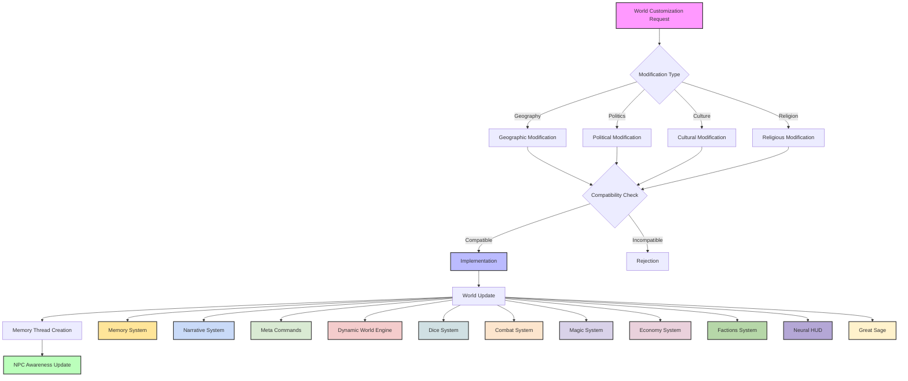
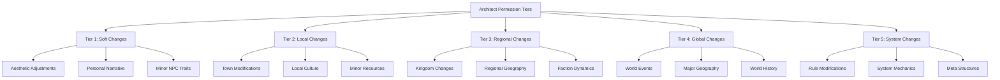
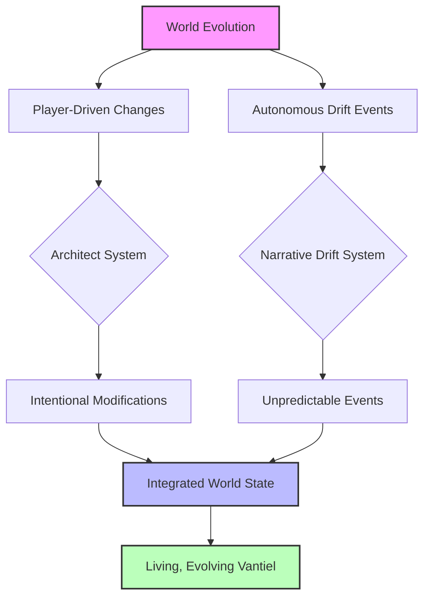
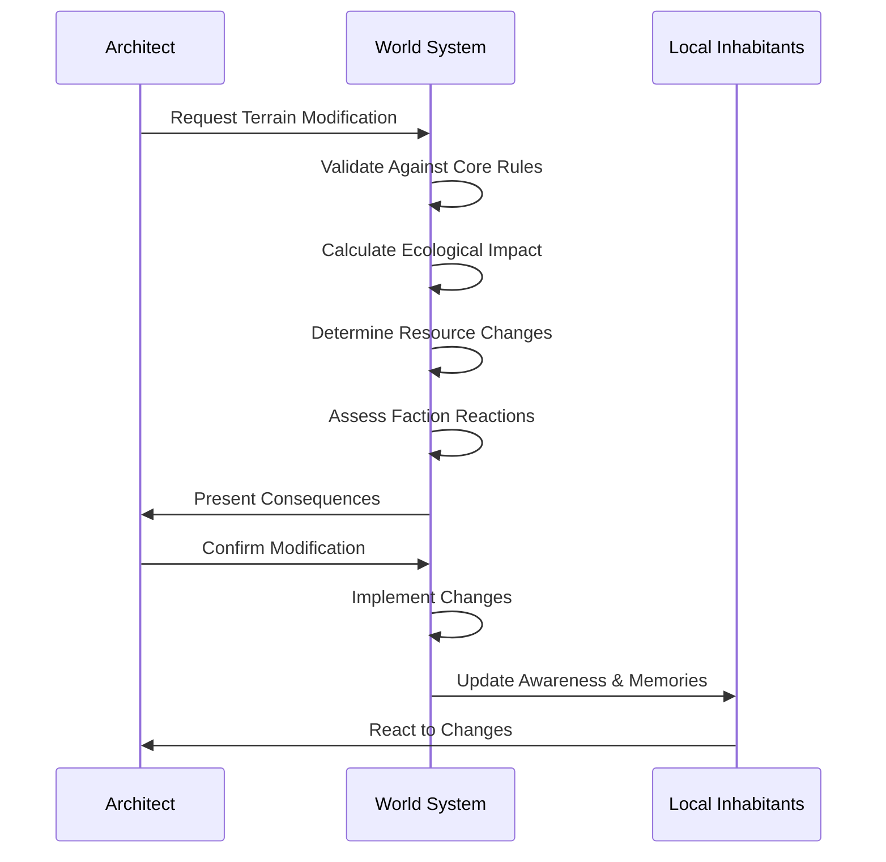
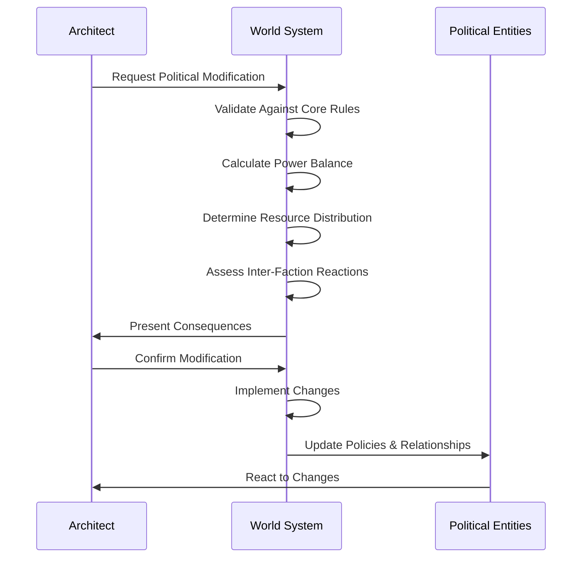
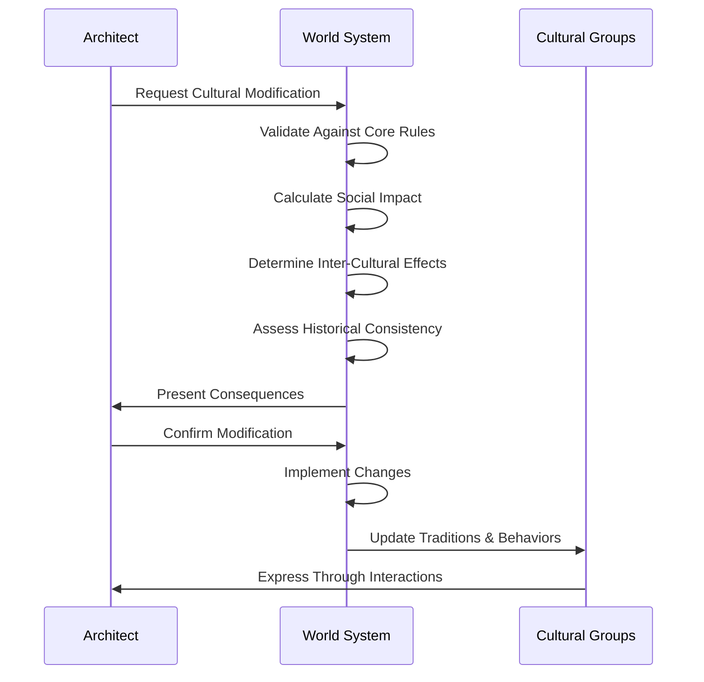
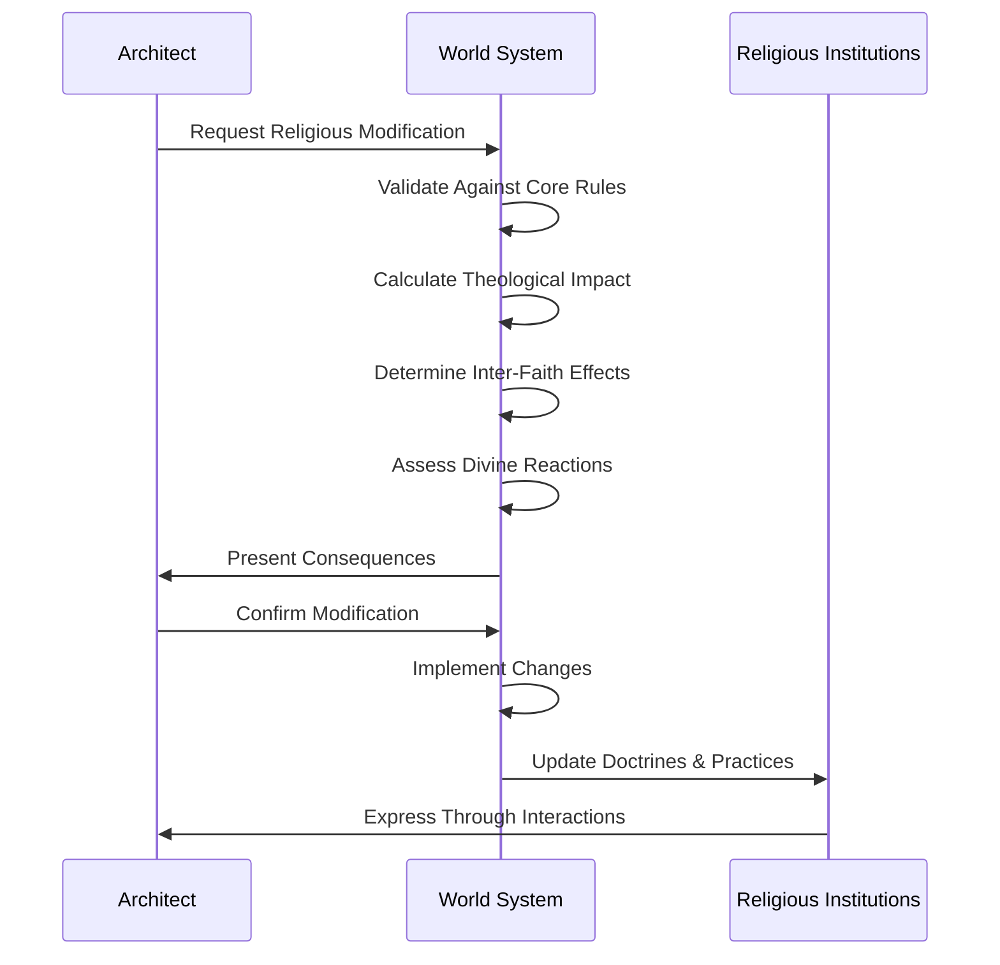
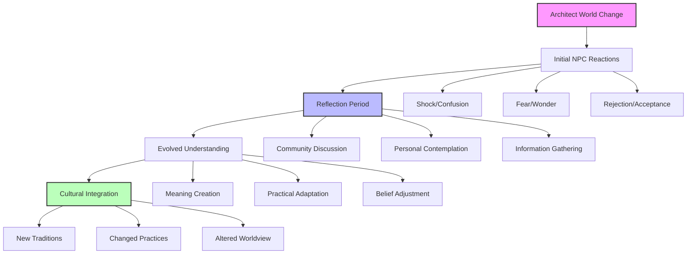
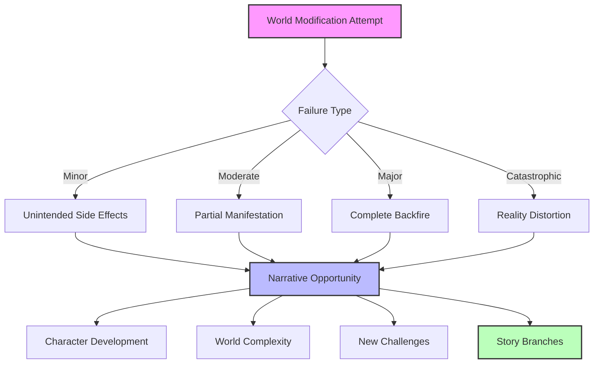
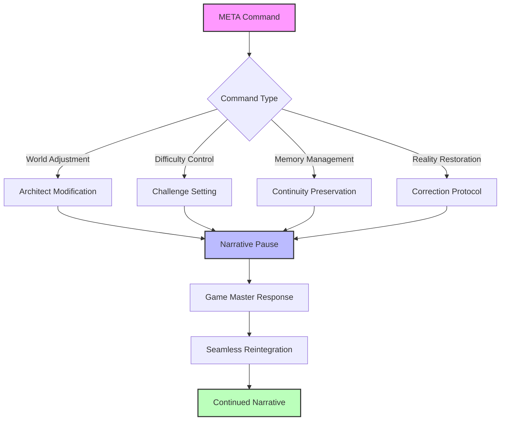

# Table of Contents
- [System: Architect](#system-architect)
- [1. Overview](#1-overview)
- [2. Fundamental Principles](#2-fundamental-principles)
  - [2.1 Player Architect Permissions Table](#21-player-architect-permissions-table)
  - [2.2 Core Immutables](#22-core-immutables)
  - [2.3 Consistency Requirements](#23-consistency-requirements)
  - [2.4 Balance Considerations](#24-balance-considerations)
  - [2.5 Meta-Only Access Clarification](#25-meta-only-access-clarification)
  - [2.6 Narrative Drift Integration](#26-narrative-drift-integration)
- [3. Geographic Modifications](#3-geographic-modifications)
- [4. Political Modifications](#4-political-modifications)
- [5. Cultural Modifications](#5-cultural-modifications)
- [6. Religious Modifications](#6-religious-modifications)
- [7. Implementation Mechanics](#7-implementation-mechanics)
- [8. System Integration](#8-system-integration)
- [9. Cultural Context](#9-cultural-context)
- [10. Failure Mechanics & Narrative Depth](#10-failure-mechanics--narrative-depth)
- [11. Meta Command Integration](#11-meta-command-integration)
- [12. Conclusion](#12-conclusion)

# System: Architect

## 1. Overview

The Architect system provides a framework for customizing and shaping the world of Vantiel while maintaining its core identity and internal consistency. This system allows for meaningful modifications to geography, politics, cultures, and religions, enabling each incarnation of Vantiel to be unique while preserving the fundamental elements that define the setting. The Architect system is understood by the world's inhabitants as the divine right of creation, a power typically reserved for gods but occasionally granted to exceptional mortals.



## 2. Fundamental Principles

### 2.1 Player Architect Permissions Table

The scope and scale of permissible changes are organized into a tiered system, with each tier requiring different levels of approval and having different impact scopes:



#### Tier 1: Soft Changes (Minimal Approval)
- **Scope**: Aesthetic, narrative flavor, personal experience
- **Examples**:
  - Changing the appearance of your camp
  - Adding personal backstory elements
  - Adjusting minor NPC traits or appearance
- **Approval**: Automatic approval, minimal restrictions
- **Ripples**: Affects only the immediate narrative with no mechanical impact
- **Limits**: Cannot alter other characters' perception or world mechanics

#### Tier 2: Local Changes (Low Approval)
- **Scope**: Individual locations, small groups, local resources
- **Examples**:
  - Creating a new shop in an existing town
  - Developing unique cultural practices for a small village
  - Adding a minor resource deposit near your location
- **Approval**: Light assessment for consistency
- **Ripples**: Affects local economy and social dynamics
- **Limits**: Cannot significantly alter regional balance or create overpowered resources

#### Tier 3: Regional Changes (Moderate Approval)
- **Scope**: Kingdoms, geographical features, faction relationships
- **Examples**:
  - Establishing a new noble house in a kingdom
  - Creating a mountain range between territories
  - Shifting the relationship between two factions
- **Approval**: Requires assessment of regional impact
- **Ripples**: Affects commerce, politics, and ecology across multiple areas
- **Limits**: Cannot alter fundamental world structures or create major power imbalances

#### Tier 4: Global Changes (High Approval)
- **Scope**: World-spanning events, major geographical features, historical revisions
- **Examples**:
  - Creating a new continent
  - Establishing a world-spanning religion
  - Adding a significant historical event
- **Approval**: Requires comprehensive impact assessment
- **Ripples**: Affects global politics, economy, and narrative
- **Limits**: Cannot contradict core immutables or fundamentally reshape world identity

#### Tier 5: System Changes (Highest Approval)
- **Scope**: Game mechanics, rules, meta structures
- **Examples**:
  - Modifying combat or magic systems
  - Creating new skill categories
  - Adjusting experience progression
- **Approval**: Requires detailed assessment for balance and integration
- **Ripples**: Affects every aspect of gameplay and narrative
- **Limits**: Cannot eliminate core immutables or create fundamentally unbalanced play

### 2.2 Core Immutables

Certain aspects of Vantiel cannot be altered, as they form the foundation of the world's identity:

- **The Three Walls**: Aegis, Bastion, and Citadel must remain as the defining structure of human civilization
- **The Fracture**: The catastrophic event that shaped the current world state cannot be undone
- **Maledictus**: The demon continent must exist as a threat to humanity
- **Reincarnation Cycle**: The process of souls being reborn from Earth to Vantiel is immutable
- **Magicules**: The fundamental particles of mana that power all magic

### 2.3 Consistency Requirements

All modifications must maintain internal consistency with:

- **Established History**: Changes cannot contradict documented historical events
- **Physical Laws**: Modifications must adhere to Vantiel's natural and magical laws
- **Logical Consequences**: All changes must account for their ripple effects
- **Character Integrity**: NPCs must retain their core personality traits
- **System Compatibility**: Changes must work within established game systems

### 2.4 Balance Considerations

Modifications must maintain game balance through:

- **Challenge Preservation**: The world must remain appropriately challenging
- **Resource Equilibrium**: Resources cannot become trivially abundant
- **Power Distribution**: No faction should become overwhelmingly dominant
- **Narrative Tension**: Conflicts and struggles must remain meaningful
- **Player Agency**: Changes should enhance, not diminish, meaningful choice

### 2.5 Meta-Only Access Clarification

The Architect is exclusively a meta-level system, accessible only to the player and not to characters within the game world:

- **Player Tool, Not Character Ability**: The Architect system is a narrative framework for the player, not an in-world power
- **Single-Player Framework**: The Architect is designed for a single-player narrative campaign
- **Fourth Wall Distinction**: Characters in Vantiel have no awareness of the Architect as a system
- **Meta Command Integration**: Architect functions are accessed through META commands, reinforcing its out-of-character nature
- **Narrative Integration**: While changes made through the Architect are real within the game world, the ability to make these changes is not a power attributed to the player's character

In-world explanations for changes made through the Architect may include divine intervention, natural evolution, or mysterious circumstances, but never explicitly acknowledge the Architect system itself as the cause.

### 2.6 Narrative Drift Integration

The Architect system exists alongside the Narrative Drift System (The Pulse of Vantiel), creating a world that evolves both through intentional player modification and autonomous change:



#### Distinction Between Systems

- **Player Agency vs. World Autonomy**:
  - **Architect System**: Represents deliberate player intervention in the world, following structured tiers of permission
  - **Narrative Drift**: Represents the world's inherent autonomy and unpredictability, occurring without player input

- **Intentional vs. Emergent**:
  - **Architect System**: Changes are premeditated, with clear goals and anticipated outcomes
  - **Narrative Drift**: Events emerge organically from hidden narrative pressures and world balance metrics

- **Structured vs. Spontaneous**:
  - **Architect System**: Follows clearly defined rules and permissions for world modification
  - **Narrative Drift**: Manifests unexpectedly at narrative trigger points like completing quests or returning to settlements

#### System Interdependence

- **Reactive Drift**: Narrative Drift may respond to Architect modifications, as the world adapts to player-created changes
- **Modification Influence**: Architect changes might increase or decrease certain types of Narrative Drift events
- **Complementary Design**: Both systems serve to create a world that feels alive, responsive, and unpredictable
- **Balance Maintenance**: While the Architect system allows major world modifications, Narrative Drift ensures the world retains its own character and momentum

#### Player Control Interface

The player maintains some level of control over the interaction between these systems:

- **Drift Tolerance**: Players can adjust how much autonomous change they're comfortable with
- **Trigger Management**: Players can request or postpone Narrative Drift events
- **Integration Style**: Players can specify how they want the two systems to interact

## 3. Geographic Modifications

### 3.1 Terrain Alterations

The physical landscape of Vantiel can be modified within certain parameters:

#### Modifiable Elements
- **Mountain Ranges**: Height, length, and mineral composition
- **Forests**: Size, density, and dominant species
- **Rivers & Lakes**: Course, size, and magical properties
- **Plains & Valleys**: Fertility, size, and ecological makeup
- **Coastlines**: Shape, features, and accessibility

#### Modification Limits
- Cannot eliminate the separation between human lands and Maledictus
- Cannot remove the Three Walls or their fundamental purpose
- Cannot create terrain that violates Vantiel's physical laws
- Cannot generate resources that would break economic balance
- Cannot create terrain that would make survival trivial

#### Implementation Process


#### Example Modifications
- **Permitted**: Adding a mountain range between two kingdoms to increase isolation
- **Permitted**: Creating a fertile valley within a harsh region to enable settlement
- **Permitted**: Altering a river's course to create a natural border
- **Forbidden**: Removing the miasma barrier between human lands and Maledictus
- **Forbidden**: Creating an infinitely renewable resource deposit

### 3.2 Climate Systems

The weather patterns and climate of regions can be modified:

#### Modifiable Elements
- **Temperature Ranges**: Average temperatures and seasonal variations
- **Precipitation Patterns**: Rainfall, snowfall, and drought cycles
- **Wind Systems**: Prevailing winds, storm frequencies, and intensities
- **Seasonal Cycles**: Length and intensity of seasons
- **Magical Weather**: Mana storms, arcane phenomena, and elemental manifestations

#### Modification Limits
- Cannot create perpetually perfect conditions
- Cannot eliminate seasonal challenges entirely
- Cannot create climate conditions that would make survival trivial
- Cannot generate weather that would make certain regions uninhabitable
- Cannot create climate patterns that violate Vantiel's physical laws

#### Example Modifications
- **Permitted**: Creating a monsoon season in a coastal region
- **Permitted**: Extending winter in a northern region to test survival skills
- **Permitted**: Adding magical aurora effects that enhance certain spells
- **Forbidden**: Creating a region with perpetual perfect growing conditions
- **Forbidden**: Eliminating all dangerous weather phenomena

### 3.3 Ecosystem Development

The flora, fauna, and ecological relationships can be customized:

#### Modifiable Elements
- **Plant Species**: Types, distributions, and magical properties
- **Animal Species**: Varieties, behaviors, and ecological niches
- **Magical Creatures**: Types, habitats, and abilities
- **Resource Distribution**: Availability and accessibility of natural resources
- **Ecological Relationships**: Predator-prey dynamics, symbiotic relationships

#### Modification Limits
- Cannot create creatures that would disrupt game balance
- Cannot eliminate all dangerous creatures from a region
- Cannot create self-sustaining resources that require no effort to harvest
- Cannot introduce species that would logically drive key species to extinction
- Cannot create ecological systems that violate Vantiel's natural laws

#### Example Modifications
- **Permitted**: Introducing a new predator species to control overpopulation
- **Permitted**: Creating a rare medicinal plant with specific growing requirements
- **Permitted**: Developing unique magical creatures for a specific region
- **Forbidden**: Creating docile versions of all dangerous creatures
- **Forbidden**: Introducing plants that provide all nutritional needs with minimal effort

## 4. Political Modifications

### 4.1 Faction Development

The political entities and power structures can be customized:

#### Modifiable Elements
- **Kingdom Boundaries**: Size, shape, and border definitions
- **Government Systems**: Monarchy, oligarchy, republic, etc.
- **Power Hierarchies**: Noble houses, guilds, military orders
- **Alliance Networks**: Diplomatic relationships, treaties, and conflicts
- **Resource Control**: Trade routes, resource monopolies, and economic systems

#### Modification Limits
- Cannot eliminate the Radiant Covenant's influence entirely
- Cannot create a unified world government
- Cannot establish utopian societies without realistic challenges
- Cannot create factions that would logically dominate all others
- Cannot eliminate all political tension and conflict

#### Implementation Process


#### Example Modifications
- **Permitted**: Creating a new merchant republic in a coastal region
- **Permitted**: Establishing a council of mages with political influence
- **Permitted**: Developing a complex succession crisis in a kingdom
- **Forbidden**: Eliminating all corruption from a government
- **Forbidden**: Creating a faction with technology far beyond Vantiel's level

### 4.2 Law & Justice Systems

The legal frameworks and enforcement mechanisms can be customized:

#### Modifiable Elements
- **Legal Codes**: Laws, punishments, and rights
- **Enforcement Systems**: Guards, inquisitors, vigilantes
- **Justice Processes**: Trials, ordeals, magical truth detection
- **Crime & Punishment**: Penalties, rehabilitation, exile
- **Social Order**: Class systems, citizenship, and social mobility

#### Modification Limits
- Cannot create perfectly just systems without flaws
- Cannot eliminate crime entirely from a society
- Cannot create enforcement systems that make crime impossible
- Cannot establish legal systems that would prevent narrative conflict
- Cannot create justice systems that violate Vantiel's social realities

#### Example Modifications
- **Permitted**: Creating a trial-by-combat system for certain offenses
- **Permitted**: Establishing magical truth detection for serious crimes
- **Permitted**: Developing a complex system of weregild and compensation
- **Forbidden**: Creating a perfect crime detection system
- **Forbidden**: Eliminating all corruption from law enforcement

### 4.3 Economic Systems

The economic structures and resource flows can be customized:

#### Modifiable Elements
- **Currency Systems**: Types, values, and exchange mechanisms
- **Trade Networks**: Routes, regulations, and monopolies
- **Guild Structures**: Organization, influence, and specializations
- **Resource Management**: Extraction, processing, and distribution
- **Market Dynamics**: Supply, demand, and price fluctuations

#### Modification Limits
- Cannot create post-scarcity economies
- Cannot eliminate economic inequality entirely
- Cannot create perfectly stable economic systems
- Cannot establish resources that would break game balance
- Cannot create economic systems that violate Vantiel's technological level

#### Example Modifications
- **Permitted**: Creating a unique currency based on magical crystals
- **Permitted**: Establishing a powerful merchant guild with special privileges
- **Permitted**: Developing a complex system of economic vassalage
- **Forbidden**: Creating an economy without scarcity or competition
- **Forbidden**: Eliminating all poverty and economic struggle

## 5. Cultural Modifications

### 5.1 Social Structures

The organization of societies and communities can be customized:

#### Modifiable Elements
- **Family Systems**: Nuclear, extended, clan-based, etc.
- **Social Hierarchies**: Class systems, castes, meritocracies
- **Community Organizations**: Villages, towns, nomadic bands
- **Life Milestones**: Birth, coming-of-age, marriage, death rituals
- **Gender Roles**: Traditional, egalitarian, or unique systems

#### Modification Limits
- Cannot create societies without any internal conflict
- Cannot eliminate all social stratification
- Cannot create cultures that would logically dominate all others
- Cannot establish social systems that prevent narrative tension
- Cannot create social structures that violate Vantiel's core themes

#### Implementation Process


#### Example Modifications
- **Permitted**: Creating a matriarchal society with unique inheritance laws
- **Permitted**: Establishing a nomadic culture with complex hospitality traditions
- **Permitted**: Developing age-based leadership systems
- **Forbidden**: Creating a society without any internal disagreement
- **Forbidden**: Eliminating all cultural misunderstandings or conflicts

### 5.2 Arts & Knowledge

The intellectual and artistic expressions of cultures can be customized:

#### Modifiable Elements
- **Artistic Traditions**: Music, visual arts, performance, literature
- **Knowledge Systems**: Education, research, preservation
- **Technological Development**: Tools, techniques, innovations
- **Language & Communication**: Spoken, written, symbolic
- **Historical Records**: Oral traditions, written histories, monuments

#### Modification Limits
- Cannot create knowledge that would break game balance
- Cannot establish technologies beyond Vantiel's appropriate level
- Cannot create perfect knowledge preservation systems
- Cannot eliminate all intellectual disagreement
- Cannot create artistic traditions without any evolution or conflict

#### Example Modifications
- **Permitted**: Creating a unique musical tradition tied to magical effects
- **Permitted**: Establishing a secret language used by a specific group
- **Permitted**: Developing a specialized educational system for certain skills
- **Forbidden**: Creating a culture with modern or futuristic technology
- **Forbidden**: Establishing perfect knowledge preservation without loss

### 5.3 Customs & Traditions

The practices and rituals of cultures can be customized:

#### Modifiable Elements
- **Festivals & Celebrations**: Seasonal, religious, historical
- **Daily Practices**: Greetings, meals, work patterns
- **Rites of Passage**: Birth, adulthood, marriage, death
- **Taboos & Restrictions**: Forbidden actions, foods, words
- **Social Etiquette**: Formal rules, informal customs, status markers

#### Modification Limits
- Cannot create traditions that would prevent narrative conflict
- Cannot establish customs that would make social navigation trivial
- Cannot create cultural practices that violate Vantiel's core themes
- Cannot eliminate all cultural misunderstandings
- Cannot create traditions without any internal variation or evolution

#### Example Modifications
- **Permitted**: Creating a complex tea ceremony with social significance
- **Permitted**: Establishing elaborate funeral rites with magical components
- **Permitted**: Developing a system of taboos related to magical phenomena
- **Forbidden**: Creating cultural practices that would prevent all conflict
- **Forbidden**: Establishing traditions that would make social integration trivial

## 6. Religious Modifications

### 6.1 Belief Systems

The theological frameworks and spiritual concepts can be customized:

#### Modifiable Elements
- **Pantheons**: Gods, goddesses, divine hierarchies
- **Cosmology**: World creation, afterlife, spiritual realms
- **Theological Concepts**: Sin, virtue, fate, free will
- **Spiritual Practices**: Prayer, meditation, offerings
- **Religious Texts**: Sacred writings, oral traditions, prophecies

#### Modification Limits
- Cannot eliminate the Radiant Covenant entirely
- Cannot create gods more powerful than the established pantheon
- Cannot establish religions that would logically dominate all others
- Cannot create belief systems that would prevent religious conflict
- Cannot establish theologies that contradict Vantiel's core metaphysics

#### Implementation Process


#### Example Modifications
- **Permitted**: Creating a nature-worship cult with unique rituals
- **Permitted**: Establishing a heretical offshoot of the Radiant Covenant
- **Permitted**: Developing a complex ancestor worship system
- **Forbidden**: Creating a religion that would logically convert everyone
- **Forbidden**: Establishing a theology that contradicts reincarnation

### 6.2 Religious Institutions

The organizational structures of religious groups can be customized:

#### Modifiable Elements
- **Church Hierarchies**: Clergy, lay leaders, religious orders
- **Sacred Spaces**: Temples, shrines, monasteries, pilgrimage sites
- **Religious Authority**: Influence, enforcement, relationship with secular power
- **Sectarian Divisions**: Orthodox, reformed, heretical groups
- **Religious Services**: Rituals, ceremonies, observances

#### Modification Limits
- Cannot eliminate religious institutions entirely
- Cannot create religious organizations without any internal conflict
- Cannot establish religious authorities that would prevent narrative tension
- Cannot create religious institutions with perfect moral consistency
- Cannot establish religious organizations that violate Vantiel's social realities

#### Example Modifications
- **Permitted**: Creating a secretive monastic order with unique practices
- **Permitted**: Establishing a complex church hierarchy with internal politics
- **Permitted**: Developing competing temples with different interpretations
- **Forbidden**: Creating a religious institution without any corruption
- **Forbidden**: Establishing a church that would logically dominate all others

### 6.3 Divine Intervention

The ways in which divine powers manifest in the world can be customized:

#### Modifiable Elements
- **Miracles**: Divine manifestations, answered prayers, supernatural events
- **Omens & Prophecies**: Divine messages, foretellings, warnings
- **Blessed & Cursed**: Divine favor, punishment, special abilities
- **Divine Servants**: Angels, demons, avatars, messengers
- **Sacred Objects**: Relics, artifacts, blessed items

#### Modification Limits
- Cannot create divine interventions that would break game balance
- Cannot establish direct, constant divine presence
- Cannot create divine powers that would prevent meaningful challenge
- Cannot establish divine interventions that would eliminate free will
- Cannot create divine manifestations that violate Vantiel's metaphysics

#### Example Modifications
- **Permitted**: Creating a system of divine omens tied to natural events
- **Permitted**: Establishing rare but significant miraculous interventions
- **Permitted**: Developing a complex system of divine blessing and curse
- **Forbidden**: Creating gods that directly and frequently intervene
- **Forbidden**: Establishing divine protection that would prevent all harm

## 7. Implementation Mechanics

### 7.1 Modification Process

The step-by-step procedure for implementing world changes:

#### Request Phase
1. **Specification**: Clearly define the desired modification
2. **Justification**: Explain the narrative or gameplay purpose
3. **Scope Definition**: Determine the extent and boundaries of the change
4. **Integration Plan**: Outline how the change connects to existing elements
5. **Consequence Prediction**: Anticipate the effects on the world

#### Validation Phase
1. **Core Rule Check**: Verify compatibility with immutable elements
2. **Balance Assessment**: Evaluate impact on gameplay challenge
3. **Consistency Verification**: Ensure logical coherence with existing world
4. **Ripple Effect Analysis**: Map consequences throughout connected systems
5. **NPC Reaction Prediction**: Determine how inhabitants would respond

#### Implementation Phase
1. **World State Update**: Modify the relevant world parameters
2. **Memory Thread Creation**: Generate records of the change
3. **NPC Awareness Adjustment**: Update knowledge and reactions
4. **Environmental Adaptation**: Adjust connected systems
5. **Narrative Integration**: Incorporate the change into ongoing stories

### 7.2 NPC Awareness & Reactions

How the inhabitants of Vantiel perceive and respond to world changes:

#### Awareness Levels
- **Direct Experience**: NPCs directly affected have full awareness
- **Witnessed Change**: NPCs who observed the change have accurate knowledge
- **Secondhand Knowledge**: NPCs who heard about it have partial, potentially distorted understanding
- **Rumor & Legend**: NPCs distant from the event have mythologized versions
- **No Awareness**: NPCs completely isolated from the change remain unaware

#### Reaction Factors
- **Personal Impact**: How the change affects individual welfare
- **Value Alignment**: How the change aligns with personal beliefs
- **Social Influence**: How respected figures respond to the change
- **Historical Context**: How similar changes have been perceived in the past
- **Adaptation Capacity**: How easily the NPC can adjust to new circumstances

#### Common Reactions
- **Acceptance**: Incorporating the change into worldview and adapting
- **Resistance**: Actively opposing or attempting to reverse the change
- **Exploitation**: Seeking advantage from the new circumstances
- **Religious Interpretation**: Viewing the change as divine will or punishment
- **Mythologizing**: Creating stories and explanations for the change

### 7.2.1 Reflection-Based NPC Response Evolution

The way NPCs process and adapt to world changes evolves over time as they reflect on the modifications. This reflection process creates more realistic, depth-driven interactions that change as NPCs integrate the new reality into their worldview.



#### Reflection Stages

NPCs process Architect changes through distinct stages, each reflecting a deeper level of integration:

1. **Initial Reaction** (Hours to Days)
   - Immediate emotional and instinctual responses
   - Often based on limited understanding
   - Heavily colored by existing beliefs and fears
   - May include denial, wonder, terror, or excitement

2. **Reflection Period** (Days to Weeks)
   - Active processing of the change and its implications
   - Gathering information from multiple sources
   - Community discussions and debates
   - Comparing to historical precedents and myths

3. **Evolved Understanding** (Weeks to Months)
   - More nuanced comprehension of the change's impact
   - Practical assessment of threats and opportunities
   - Initial cultural interpretations forming
   - First adaptations to the new reality

4. **Cultural Integration** (Months to Years)
   - Full incorporation into cultural worldview
   - Development of traditions around the change
   - Creation of stories, songs, or rituals
   - Normalized as part of everyday reality

#### Intelligence-Based Variation

The quality and speed of reflection varies significantly based on NPC attributes:

| Intelligence | Initial Response | Reflection Quality | Integration Speed |
|--------------|------------------|-------------------|------------------|
| Low | Emotional, simplistic | Superficial, often superstitious | Slow, may never fully adapt |
| Average | Mixed emotional/rational | Practical, community-influenced | Moderate, follows social consensus |
| High | Balanced, contemplative | Deep, considers multiple angles | Relatively quick, leads opinion |
| Exceptional | Analytical, curious | Sophisticated, innovative | Rapid, creates new paradigms |

#### Example Scenario: Mountain Creation

```
[Day 1 - Initial Reactions]
The villagers of Oakvale stare in awe and terror as mountains rise from the plain overnight.
- Elder Maren (High INT): "We must observe these peaks carefully before drawing conclusions."
- Blacksmith Gareth (Average INT): "This must be the work of the gods! What have we done to deserve this?"
- Farmer Tol (Low INT): "The end times are upon us! We must flee before the earth swallows us whole!"

[Week 2 - Reflection Period]
- Elder Maren has organized expeditions to study the mountains and research old texts about similar events.
- Blacksmith Gareth discusses with other villagers whether this is a blessing or curse from the gods.
- Farmer Tol refuses to look at the mountains and spreads tales of doom.

[Month 3 - Evolved Understanding]
- Elder Maren has documented how the mountains affect local weather and identified potential resources.
- Blacksmith Gareth now sees practical benefits: "These mountains will shield us from the northern winds."
- Farmer Tol reluctantly admits the mountains haven't caused harm, but remains suspicious.

[Year 1 - Cultural Integration]
- The village has renamed itself "Peakshade" and incorporated the mountains into its identity.
- A festival has been established celebrating the "Gift of the Mountains."
- Miners have established operations in the foothills, bringing new prosperity.
- Even Farmer Tol now tells children stories about mountain spirits who protect the village.
```

#### Reflection Memory Threads

The reflection process is tracked through special memory threads that document how understanding evolves over time:

```json
{
  "reflection_thread": {
    "world_change": "Mountain range creation in Northern Plains",
    "npc": "Elder Maren of Oakvale",
    "intelligence": "high",
    "wisdom": "very high",
    "initial_reaction": {
      "emotional_state": "cautious curiosity",
      "stated_belief": "We must observe before judgment",
      "timestamp": "Day 1 post-creation"
    },
    "reflection_process": {
      "information_gathering": ["organized expeditions", "consulted ancient texts", "observed weather patterns"],
      "consultation": ["neighboring village elders", "Covenant priest", "traveling scholar"],
      "key_insights": ["mountains create rain shadow", "similar event in Southern Realms 300 years ago"],
      "timestamp": "Weeks 1-8 post-creation"
    },
    "evolved_understanding": {
      "practical_assessment": "Mountains provide defense, resources, and weather control",
      "belief_integration": "Natural phenomenon with divine purpose",
      "leadership_action": "Directed village adaptation efforts",
      "timestamp": "Month 3 post-creation"
    },
    "cultural_integration": {
      "community_changes": ["village renamed", "mining operations established", "trade routes adjusted"],
      "new_traditions": ["annual mountain festival", "coming-of-age mountain climb ritual"],
      "folklore_development": ["tales of mountain spirits", "creation myth incorporating mountains"],
      "timestamp": "Year 1 post-creation"
    }
  }
}
```

#### Implementation Guidelines

When integrating reflection-based NPC responses:

1. **Match the Scale**: More significant world changes deserve more detailed reflection processes
2. **Vary the Responses**: Ensure different NPCs reflect differently based on attributes and circumstances
3. **Show Evolution**: Explicitly demonstrate how NPC reactions change over time through dialogue and behavior
4. **Create Cultural Artifacts**: Develop songs, stories, rituals, or practices that emerge from the reflection process
5. **Connect to Gameplay**: Use the reflection process to generate new quests, conflicts, or opportunities

### 7.3 Memory Architecture Integration

How world changes are recorded in the memory system:

#### World Memory Thread
```json
{
  "world_modification": {
    "type": "geographic",
    "subtype": "terrain_alteration",
    "location": "Northern Bastion",
    "description": "Creation of thermal springs in previously barren highlands",
    "implementation_date": "Year 347, Winter",
    "architect": "Player Character",
    "justification": "To create a strategic outpost against northern threats",
    "affected_systems": [
      "local_climate",
      "resource_distribution",
      "settlement_patterns",
      "trade_routes"
    ],
    "npc_reactions": {
      "local_inhabitants": "grateful_acceptance",
      "neighboring_regions": "cautious_interest",
      "distant_kingdoms": "unaware"
    }
  }
}
```

### 7.4 Narrative Drift Interaction

How player-driven Architect modifications interact with autonomous Narrative Drift events:

#### Influence Patterns
- **Drift Catalysts**: Some Architect changes may trigger or accelerate Narrative Drift events
- **Drift Dampers**: Other modifications may temporarily stabilize a region against autonomous changes
- **Conflicting Currents**: Narrative Drift may attempt to "correct" certain player modifications
- **Harmonious Flow**: Some modifications align with world tendencies and enhance natural patterns
- **Localized Immunity**: Recent Architect activity may grant temporary immunity from certain types of drift

#### Integration Examples
```
[Mountain Range Creation → Drift Response]
After using the Architect system to create a new mountain range, the world responds through Narrative Drift. The unnatural barrier creates weather pattern disturbances, attracting magical creatures drawn to disruptions in the natural order. Villages near the mountains report strange lights at night and unusual dreams. What began as a player-driven modification has spawned autonomous world reactions that create new story opportunities.

[Town Development → Drift Enhancement]
When the player establishes a new trading post at a crossroads, Narrative Drift enhances the world's response. The post's success attracts not just the expected merchants, but also a religious cult seeking new converts, a noble family looking to extend influence, and wildlife adapting to human presence in unexpected ways. The player set the stage, but Narrative Drift populated it with surprising elements.
```

#### Memory Thread Integration
Autonomous changes resulting from Narrative Drift in response to Architect modifications are recorded in special memory threads that link the player action to the world's response:

```json
{
  "drift_response": {
    "trigger_type": "architect_modification",
    "original_modification": "Mountain range creation in Northern Bastion",
    "drift_manifestation": "Weather pattern disruption and magical anomalies",
    "drift_timeline": "3 in-game weeks after modification",
    "drift_intensity": "moderate",
    "player_awareness": "Gradual discovery through NPC reports",
    "narrative_opportunities": [
      "Investigation of strange lights",
      "Dream-walking potential",
      "New magical resource gathering",
      "Creature migration studies"
    ]
  }
}
```

#### Historical Record Thread
```json
{
  "historical_event": {
    "type": "world_change",
    "name": "The Warming of the Northern Wastes",
    "date": "Year 347, Winter",
    "significance": "major",
    "witnesses": [
      "Northern Bastion garrison",
      "Local nomadic tribes",
      "Merchant caravans"
    ],
    "immediate_effects": [
      "Survival rate in region increased by 40%",
      "New settlement established within one month",
      "Trade route opened to previously inaccessible region"
    ],
    "long_term_consequences": [
      "Population growth in Northern Bastion",
      "Shift in regional power balance",
      "New cultural practices developed around thermal springs"
    ]
  }
}
```

## 8. System Integration

### 8.1 Neural HUD Integration

The Architect system interfaces with the neural HUD to provide world modification tools:

- **Modification Interface**: Visual tools for designing changes
- **Validation Feedback**: Real-time compatibility checking
- **Consequence Projection**: Visualization of potential outcomes
- **Historical Record**: Access to previous modifications
- **Implementation Tracking**: Progress monitoring for changes

### 8.2 Great Sage Integration

The Architect system works with the Great Sage to enhance world modification:

- **Consequence Analysis**: Detailed assessment of potential outcomes
- **Historical Context**: Relevant precedents from Vantiel's history
- **Balance Evaluation**: Assessment of impact on gameplay challenge
- **Integration Suggestions**: Ideas for connecting changes to existing elements
- **NPC Reaction Prediction**: Forecasting how inhabitants will respond

### 8.3 Dice System Integration

The Architect system uses the dice system to determine certain outcomes:

- **Implementation Success**: Determining if complex changes manifest as intended
- **Unintended Consequences**: Rolling for unexpected side effects
- **NPC Reaction Variation**: Determining specific responses from key figures
- **Timeline Acceleration**: Checking if changes occur faster than expected
- **Discovery Rate**: Determining how quickly changes become widely known

### 8.4 Combat System Integration

The Architect system affects combat through world modifications:

- **Terrain Advantages**: Creating battlefield features that affect tactics
- **Resource Access**: Modifying availability of combat materials
- **Faction Conflicts**: Establishing tensions that lead to combat
- **Monster Habitats**: Creating environments that support specific creatures
- **Training Traditions**: Developing cultural practices that affect combat styles

### 8.5 Magic System Integration

The Architect system connects with magical practices through world design:

- **Mana Distribution**: Creating areas of high or low magical energy
- **Magical Traditions**: Establishing cultural approaches to magic
- **Arcane Phenomena**: Designing unique magical manifestations
- **Magical Creatures**: Creating habitats for mystical beings
- **Religious Magic**: Connecting divine powers to specific locations

## 9. Cultural Context

### 9.1 Architect in Vantiel Society

How the concept of world-shaping is understood in different cultures:

#### Radiant Covenant
- **Official Doctrine**: Only the true gods may shape the world
- **Secret Knowledge**: Ancient texts speak of mortal Architects
- **Public Stance**: Those claiming such power are heretics
- **Private Reality**: High priests study the phenomenon carefully

#### Sylvaneir Elves
- **Ancient Tradition**: Legends of Elven Shapers who could mold reality
- **Current Belief**: The art was lost during the Fracture
- **Scholarly Interest**: Elven sages study signs of Architect activity
- **Practical Application**: Some rituals attempt to recreate minor aspects

#### Beastmen Tribes
- **Spiritual View**: The world is shaped by the dreams of great spirits
- **Shamanic Practices**: Rituals to influence these dreams
- **Oral Traditions**: Tales of shape-shifters who could alter the land
- **Modern Interpretation**: Those who can change the world are spirit-touched

#### Merchant Guilds
- **Pragmatic Approach**: World-shaping as a resource to be exploited
- **Commercial Interest**: Seeking to profit from Architect-created resources
- **Risk Assessment**: Calculating the economic impact of world changes
- **Strategic Planning**: Positioning to benefit from predicted alterations

### 9.2 Historical Context

The legacy of world-shaping throughout Vantiel's history:

- **Pre-Fracture Era**: Legends speak of god-like Architects who shaped continents
- **The Fracture**: Believed to be caused by an Architect's hubris
- **Post-Fracture Prohibition**: World-shaping declared forbidden by the Covenant
- **Underground Knowledge**: Secret societies preserve Architect techniques
- **Modern Rediscovery**: Rare individuals manifesting the ability naturally

### 9.3 Philosophical Perspectives

Different schools of thought regarding the ethics and nature of world-shaping:

- **Divine Right Theory**: Only gods should shape reality; mortal attempts are hubris
- **Natural Evolution View**: World-shaping should follow natural patterns
- **Utilitarian Approach**: Changes should maximize benefit for all beings
- **Preservation Philosophy**: The world should be maintained, not altered
- **Progressive Ideology**: Conscious improvement of the world is a moral duty

## 10. Failure Mechanics & Narrative Depth

The Architect system incorporates realistic failure into world modifications, creating depth, challenge, and narrative opportunities. Failure is not merely an obstacle but a catalyst for character development and story enrichment.

### 10.1 The Nature of Failure in World-Shaping



#### Failure Spectrum
- **Cosmetic Deviation**: Minor aesthetic differences from intended outcome
- **Unintended Side Effects**: Successful modification with unexpected consequences
- **Partial Manifestation**: Only some aspects of the modification take effect
- **Temporary Instability**: Changes fluctuate, fade, or behave unpredictably
- **Complete Backfire**: Opposite or harmful version of the intended effect
- **Reality Distortion**: Severe warping of physical or magical laws
- **Cascading Failure**: Initial failure triggers chain reactions of other failures

#### Narrative Integration of Failure
- **Character Growth**: Failures test resolve and teach important lessons
- **World Development**: Failed modifications add unique, unplanned elements
- **Historical Significance**: Great failures often become part of legend and lore
- **Relationship Impact**: How characters handle failure affects NPC perceptions
- **Quest Generation**: Failures often create new problems that need solving

### 10.2 Contextual Failure Assessment

The Architect system integrates with the Narrative Tension System to determine when world-shaping attempts should fail:

#### Assessment Factors
- **Architect Experience**: More experienced Architects have lower failure rates
- **Modification Scale**: Larger changes have higher failure probability
- **Previous Success Streak**: A series of successes increases failure chance
- **Environmental Conditions**: Certain locations are more unstable for world-shaping
- **Temporal Factors**: Time of day, season, or astronomical alignments
- **Preparation Quality**: Research, ritual, and forethought reduce failure chance
- **Narrative Timing**: Failures are more likely at dramatically appropriate moments

**Example Assessment:**
```
[Mountain Creation Assessment - Hidden]
• Architect Skill: Novice (-)
• Modification Scale: Regional Change (-)
• Previous Success: Three consecutive successful terrain changes (-)
• Environment: Ley Line Convergence (+)
• Temporal Factor: Celestial Alignment (+)
• Preparation: Extensive study and ritual planning (+)
• Narrative Significance: First major geographical change (-)
• Hard Mode: Not active
• Net Assessment: Moderate failure chance (45%)

[Result - Partial Manifestation]
The mountains rise as envisioned, but not as intended. While the range forms in the correct location, strange crystalline formations jut from the peaks, glowing with an eerie blue light at night. The local fauna begins to exhibit unusual mutations, and reports of strange dreams afflict those who sleep in the mountains' shadow. Your modification succeeded, but Vantiel has added its own touch to your design.
```

### 10.3 Failure as Opportunity

How the Architect system transforms failures into rich narrative elements:

#### Story Catalysts
- **Mystery Generation**: Unexpected results create enigmas to investigate
- **Conflict Creation**: Failures often produce opposition or new antagonists
- **Character Testing**: Responding to failure reveals character depth
- **World Enrichment**: Unintended consequences add unique elements to the setting
- **Narrative Branching**: Failures open new story paths and possibilities

#### Recovery Paths
- **Acceptance & Adaptation**: Learning to work with the failure
- **Research & Understanding**: Studying what went wrong
- **Containment & Management**: Limiting the failure's impact
- **Correction Attempts**: Trying to fix or reverse the unintended effects
- **Transformation**: Converting the failure into something beneficial

#### Failure Memory Thread
```json
{
  "failure_event": {
    "type": "world_modification_failure",
    "attempt": "Mountain range creation in Northern Wastes",
    "intended_outcome": "Natural barrier against northern invasions",
    "actual_outcome": "Crystalline mountains with reality-warping properties",
    "date": "Year 347, Winter",
    "architect": "Player Character",
    "failure_type": "Partial Manifestation with Unintended Properties",
    "immediate_consequences": [
      "Fauna mutations within 5-mile radius",
      "Dream disturbances among local settlers",
      "Unusual mineral deposits with unknown properties"
    ],
    "long_term_implications": [
      "New research opportunities",
      "Potential magical resource",
      "Habitat for unique creatures",
      "Possible danger to nearby settlements"
    ],
    "recovery_options": [
      "Study the crystals to understand their properties",
      "Establish safety perimeter until effects are understood",
      "Attempt to stabilize the anomalous elements",
      "Incorporate the unexpected features into regional culture"
    ]
  }
}
```

### 10.4 Hard Mode Failure Mechanics

In Hard Mode, world-shaping failures become more common and more severe:

#### Hard Mode Adjustments
- **Increased Failure Rate**: Base failure chance increased by 25%
- **Extended Failure Range**: More severe outcomes on the failure spectrum
- **Diminished Recovery Options**: Fewer ways to mitigate failure consequences
- **Cascading Effects**: Failures more likely to trigger additional problems
- **Resource Intensive**: More preparation required to reduce failure chance
- **Permanent Consequences**: Some failure effects cannot be undone

#### Hard Mode Failure Example
```
[Same Mountain Creation Attempt - Hard Mode]

[Result - Catastrophic Failure]
The mountains heave upward with violent force, tearing the very fabric of reality. Instead of the planned range, a single massive spire erupts from the earth, its surface a twisted amalgam of stone, crystal, and what appears to be solidified mana. The surrounding area becomes a deadzone where magic behaves unpredictably, and at night, the boundary between the dream world and reality thins dangerously. Strange entities have been glimpsed moving among the crystalline formations. What you've created is no longer a mountain—it's a tear in the world that will require significant effort to contain, let alone reverse.
```

## 11. Meta Command Integration

The Architect system interfaces directly with Meta Commands, providing players with out-of-character tools to shape the narrative, adjust world mechanics, and manage memory continuity.

### 11.1 Meta Command Framework



#### Meta Commands for World Customization
META commands allow players to communicate world-shaping intentions conversationally:

- **Aesthetic Adjustments**: `META: I'd like the forests in this region to feel more ancient and mystical.`
- **Cultural Modifications**: `META: Can we develop a unique coming-of-age ritual for this tribe?`
- **Environmental Changes**: `META: I want this coastal area to have dramatic cliff formations.`
- **Faction Development**: `META: Let's create tension between the merchants and clergy in this town.`

#### Architect Response Protocol
1. **Acknowledge**: Recognize the META command and pause narrative
2. **Clarify**: Ask follow-up questions if the request needs refinement
3. **Assess**: Consider compatibility with world rules and narrative consistency
4. **Inform**: Explain any potential consequences or limitations
5. **Implement**: Make the requested changes
6. **Integrate**: Seamlessly weave the modifications into ongoing narrative

### 11.2 Difficulty & Failure Control

META commands give players control over the challenge level of world-shaping:

#### Difficulty Settings
- **Narrative Mode**: `META: I'd like my architecture attempts to always succeed for story purposes.`
- **Standard Mode**: `META: Let's use the regular failure chance system for my world changes.`
- **Hard Mode**: `META: I want realistic, difficult world-shaping with serious consequences.`
- **Custom Challenge**: `META: Make mountain creation particularly difficult but keep river changes easier.`

#### Narrative Drift Controls
- **Drift Enabling (DEFAULT)**: `META: Allow narrative surprises.` - Enables autonomous world evolution
- **Drift Disabling**: `META: Lock narrative randomness.` - Temporarily prevents unexpected events
- **Drift Triggering**: `META: Trigger a Pulse of Vantiel.` - Manually requests a world pulse event
- **Drift Intensity**: `META: I prefer subtle/moderate/dramatic narrative drift.` - Adjusts scale of autonomous changes
- **Drift Focus**: `META: I'd like more atmospheric/factional/magical drift events.` - Guides event type distribution

#### Failure Direction
- **Failure Type**: `META: If my next modification fails, make it a partial success rather than a complete backfire.`
- **Consequence Severity**: `META: When failures happen, keep them challenging but not campaign-ending.`
- **Narrative Impact**: `META: I want failures to create interesting story opportunities rather than just obstacles.`
- **Recovery Options**: `META: Please ensure failures have at least one way to address them, even if difficult.`

### 11.3 Memory & Continuity Management

META commands address AI limitations by providing tools to maintain world consistency:

#### Memory Preservation
- **Status Summaries**: `META: Let's recap what we know about this kingdom and its political situation.`
- **Character Refreshers**: `META: Remind me of my current inventory, skills, and relationships.`
- **World State**: `META: Could you summarize the major changes I've made to Vantiel so far?`
- **Regular Checkpoints**: `META: Let's do a full world state summary every few sessions.`

#### Reality Restoration
- **Continuity Correction**: `META: I think we established earlier that this city has three districts, not four.`
- **Detail Reconciliation**: `META: There's a discrepancy in how the magic system was described previously.`
- **Character Consistency**: `META: This NPC's personality seems different than in our previous interactions.`
- **World Rule Enforcement**: `META: I don't think teleportation magic works that way in our established rules.`

**Example Meta Dialogue:**
```
Player: META: I think there's been some confusion about the Crystal Mountains I created.
In earlier sessions, they caused dream disturbances, but that detail seems to have been forgotten.

GM: [Pauses narrative] You're right, thank you for pointing that out. The Crystal Mountains
you created in the Northern Wastes do indeed cause strange dreams for those who sleep in their
shadow. This has become part of local folklore, with some believing the dreams are prophetic,
while others avoid sleeping near the mountains entirely. Would you like me to reintegrate this
aspect into our current storyline?

Player: Yes, that would be great. Maybe the dream effects could be relevant to our current quest.

GM: Perfect. [Resumes narrative] As you make camp in the foothills of the Crystal Mountains,
your companion Keth seems hesitant. "I've heard stories about these peaks," he says, glancing
upward at the crystalline formations that catch the last light of day. "They say dreams turn
strange here—sometimes true, sometimes terrible." He lays out his bedroll farther from the
mountains than the rest of your group. "Just a precaution," he explains when he notices your gaze.
```

### 11.4 AI Limitation Management

META commands provide a framework for addressing AI shortcomings constructively:

#### Common Limitations
- **Memory Constraints**: AI may forget details from earlier in the narrative
- **Consistency Challenges**: World rules might be applied inconsistently
- **Complexity Management**: Intricate systems might be simplified over time
- **Character Continuity**: NPC personalities might drift from original conception
- **Narrative Coherence**: Plot elements might become disconnected

#### Constructive Solutions
- **Regular Summaries**: `META: Let's take a moment to summarize key world elements and characters.`
- **Reference Creation**: `META: Could we create a brief reference document for the magic system?`
- **Contextual Reminders**: `META: Before we continue, let me remind you that my character has fire resistance.`
- **Gentle Correction**: `META: I think you've mixed up two NPCs. Maren is the village elder, not the blacksmith.`
- **System Reinforcement**: `META: Let's review how the crafting system works before I attempt this project.`

#### Expectation Management
- Acknowledge that AI systems have limitations
- Use META commands proactively to prevent inconsistencies
- Approach corrections collaboratively rather than critically
- Recognize that perfect continuity might require occasional maintenance
- Understand that AI improves with clear, constructive feedback

## 12. Conclusion

The Architect system provides a powerful framework for customizing the world of Vantiel while maintaining its core identity and internal consistency. By allowing meaningful modifications to geography, politics, cultures, and religions, it enables each incarnation of Vantiel to be unique while preserving the fundamental elements that define the setting. The system's integration with other game mechanics and its cultural context within the world create a rich, dynamic environment where changes have meaningful consequences and become part of the evolving narrative of Vantiel.

Through careful balance between creative freedom and necessary constraints, the Architect system ensures that world modifications enhance rather than undermine the gameplay experience. The detailed implementation process, NPC awareness mechanics, and memory architecture integration create a cohesive system where changes ripple realistically through the world, affecting everything from individual lives to grand historical narratives.

The incorporation of realistic failure mechanics adds depth and challenge to world-shaping, transforming unexpected outcomes into opportunities for character growth and story development. Meanwhile, the Meta Command framework provides players with powerful tools to customize their experience, maintain narrative consistency, and address the inherent limitations of AI systems.

Together, these elements maintain Vantiel as a living, breathing world that responds organically to the shaping hand of the Architect—a world where failure is not an endpoint but a beginning, and where even the limitations of technology become opportunities for collaborative storytelling.
