# Table of Contents
- [Base Building System: A Comprehensive Framework](#base-building-system-a-comprehensive-framework)
- [GM/AI System Flowchart](#gmai-system-flowchart)
- [1. Core Building Mechanics](#1-core-building-mechanics)
  - [1.1 Universal Construction Framework](#11-universal-construction-framework)
  - [1.2 Environment-Specific Mechanics](#12-environment-specific-mechanics)
  - [1.3 Construction Methods](#13-construction-methods)
- [2. Property Types & Specializations](#2-property-types--specializations)
- [3. Construction Process](#3-construction-process)
- [4. Management & Maintenance](#4-management--maintenance)
- [5. Memory Architecture Integration](#5-memory-architecture-integration)
- [6. Example Applications](#6-example-applications)
- [7. Advanced Building Concepts](#7-advanced-building-concepts)
- [Implementation Notes](#implementation-notes)
- [Change Log (Applied Fixes)](#change-log-applied-fixes)

# Base Building System: A Comprehensive Framework

## GM/AI System Flowchart

```mermaid
flowchart TD
    A[Base Building System] --> B[Planning Phase]
    A --> C[Construction Phase]
    A --> D[Specialization Phase]
    A --> E[Management Phase]

    %% Cross-system arrows
    A -.-> M1[Memory System]
    A -.-> E1[Economy System]
    A -.-> CR1[Crafting System]
    A -.-> W1[World System]
    A -.-> R1[Relations System]
    A -.-> J1[Journal System]
    A -.-> MC1[Meta Commands]
    A -.-> S1[Survival System]
    A -.-> C1[Combat System]
    A -.-> K1[Kingdom Management]

    %% Internal nodes
    B --> B1[Land Acquisition]
    B --> B2[Environmental Assessment]
    B --> B3[Design Planning]
    B --> B4[Resource Calculation]

    C --> C1[Foundation Work]
    C --> C2[Structural Building]
    C --> C3[Finishing Work]
    C --> C4[Infrastructure]

    D --> D1[Residential Specialization]
    D --> D2[Commercial Specialization]
    D --> D3[Crafting Specialization]
    D --> D4[Magical Specialization]
    D --> D5[Military Specialization]

    E --> E1[Maintenance]
    E --> E2[Staff Management]
    E --> E3[Economy Integration]
    E --> E4[Defense Systems]
    E --> E5[Expansion Planning]

    %% Style for cross-system nodes
    style M1 fill:#ffe599,stroke:#333,stroke-width:2px
    style E1 fill:#b4a7d6,stroke:#333,stroke-width:2px
    style CR1 fill:#ead1dc,stroke:#333,stroke-width:2px
    style W1 fill:#b6d7a8,stroke:#333,stroke-width:2px
    style R1 fill:#f4cccc,stroke:#333,stroke-width:2px
    style J1 fill:#fff2cc,stroke:#333,stroke-width:2px
    style MC1 fill:#d9ead3,stroke:#333,stroke-width:2px
    style S1 fill:#d0e0e3,stroke:#333,stroke-width:2px
    style C1 fill:#f4cccc,stroke:#333,stroke-width:2px
    style K1 fill:#ead1dc,stroke:#333,stroke-width:2px
```



## 1. Core Building Mechanics

### 1.1 Universal Construction Framework

• **Action-Based Construction**
  Each section of the building requires a certain number of actions per square meter, factoring in material and complexity. Higher-level skills or specialized help can reduce the required actions.

• **Resource Requirements**
  Building size, quality, and the desired features all determine the amount (and type) of materials needed (wood, stone, metal, magical essences, etc.).

• **Skill Checks**
  #### Standard Mode
  Architecture, Carpentry, Masonry, and related skills influence both the time required and the final quality tier. Simple success/failure checks for most construction, with narrative-driven outcomes. Players can describe their approach to gain advantage on checks.

  #### Hard Mode
  Strict DC thresholds for each construction stage:
  - Foundation work: DC 12-18 depending on terrain
  - Wall construction: DC 14-20 based on height and material
  - Specialty rooms: DC 16-25 for magical or complex functions
  - Critical failure on Natural 1: Partial collapse, material waste, or structural flaw
  - Critical success on Natural 20: Unexpected quality improvement, material savings, or time reduction

• **Assistance Multipliers**
  Hired labor, magical constructs, and companion assistance can drastically reduce build time or improve quality. Each helper with relevant skills acts as a multiplier on the base action rate.

• **Quality Tiers**
  Buildings follow a scale (Crude → Standard → Quality → Superior → Masterwork → Legendary), affecting durability, appearance, and any mechanical bonuses (e.g., defense or crafting benefits inside).

• **Environment Modifiers**
  Construction difficulty adjusts based on terrain. Urban zones may require permits and compliance with local building codes, whereas wild areas require extra effort for clearing land and accessing resources.

• **Risk vs. Reward Options**
  #### Standard Mode
  Players can choose to take creative approaches with minimal mechanical penalties.

  #### Hard Mode
  - Optional "rushed construction" at +5 DC but 30% time reduction
  - "Careful building" at -5 DC but 50% more time required
  - "Experimental techniques" with high risk/reward outcomes

### 1.2 Environment-Specific Mechanics

#### Urban Construction

• **Permit System**
  Most towns and cities mandate building permits. Factions or guilds might require fees or limit building size. Some areas have style guidelines or zoning laws.

• **Space Limitations**
  Building footprints are constrained by neighboring structures. Vertical expansion can mitigate limited land.

• **Building Codes**
  Areas of wealth or specialized districts (Magic Quarter, Merchant Quarter) have unique architectural demands.

• **Neighbor Relations**
  Massive or noisy projects can strain NPC relationships. Diplomacy and bribes may be needed to keep the peace.

• **Utility Access**
  Tapping into existing water, sewage, or mechanical/magical conduits can speed building but may cost additional fees.

#### Wilderness Construction

• **Land Claiming**
  You must secure rights (or simply stake a claim) in remote regions. Factions or monster threats may contest your presence.

• **Resource Proximity**
  Transporting materials to remote locations increases cost or requires players to gather local resources.

• **Environmental Challenges**
  Extreme weather, predators, or magical anomalies can slow or damage construction. Defensive measures may be required at each step.

• **Self-Sufficiency Systems**
  Water collection, refuse disposal, and power generation (e.g., mills, mana crystals) are vital in rugged areas.

• **Concealment Options**
  You can blend the structure with surroundings to avoid detection, especially important for hidden bases or outposts.

#### Underground/Cave Construction

• **Structural Integrity**
  Excavation demands additional bracing and skill checks. Collapses can be fatal.

• **Ventilation**
  Fresh air is crucial for subterranean living. Herbal or magical solutions may purify stagnant air.

• **Lighting**
  Plan for natural light shafts, lanterns, or luminous crystals.

• **Water Management**
  Seepage and flooding are major risks. Drains or magical wards might be necessary.

• **Expansion Techniques**
  Carving out new chambers has extra steps: surveying rock hardness, disposing of rubble, ensuring safe expansions.

#### Aquatic Construction

• **Foundation Types**
  Options include floating rafts, stilted platforms, or fully submerged domes.

• **Waterproofing**
  Materials and sealants must handle constant exposure to water. Enchanted materials can prevent rot or corrosion.

• **Current/Tide Management**
  Ensuring your structure endures waves or tides may require specialized engineering or spells.

• **Docking Facilities**
  For boats, ships, or aquatic creatures.

• **Specialized Materials**
  Water-repellent wood, corrosion-resistant metals, or magical bubble barriers are key.

### 1.3 Construction Methods

#### Physical Labor

• **Personal Construction**
  The player invests daily actions with skill checks. Slower but cheaper if you have time and skill.

• **Hired Labor**
  Paying NPCs with specific trade skills can expedite building or raise quality. Costs vary by region and complexity.

• **Community Effort**
  Aligning with certain factions or towns might let you rally volunteers (temple faithful, guild members).

• **Master Builders**
  Proficient architects or engineers can add large quality bonuses or unique design features (like hidden rooms).

#### Magical Construction

• **Conjuration Magic**
  Summon intangible or semi-intangible building blocks. Typically quick but requires powerful spells or mana costs.

• **Element Manipulation**
  Shape elements (earth, wood, stone) into desired forms. Skilled mages can significantly reduce material needs.

• **Golem Workers**
  Summoned/constructed creatures handle the brute force. Requires control spells or special crystals to direct them.

• **Spatial Manipulation**
  Enlarge interior spaces beyond external dimensions (bag-of-holding style rooms).

• **Reality Anchoring**
  Permanent wards to ensure magically shaped structures don’t collapse under normal physics.

#### Technological Methods (If Setting Allows)

• **Construction Tools**
  Cranes, pulleys, or advanced machinery reduce labor costs. Maintenance or fuel may be needed.

• **Prefabrication**
  Build modules off-site and transport for quick assembly.

• **Mechanical Assistance**
  Clockwork or steam-powered devices for heavy lifting.

• **Advanced Materials**
  Reinforced steel, tech-based illusions, or alternative energy systems.

---

## 2. Property Types & Specializations

### 2.1 Residential Properties

• **Personal Home**: From small huts and cottages to grand manors or full-scale castles.
• **Townhouse**: A multi-story urban residence with limited footprint.
• **Estate/Manor**: Large grounds, gardens, and multiple outbuildings.
• **Cave House**: Leveraging natural formations, customized with equipment for comfort.
• **Magical Dwelling**: Towers or hidden sanctums with wards and arcane features.

### 2.2 Commercial Properties

• **Shops/Stalls**: Retail spaces in towns or traveling caravans.
• **Inns/Taverns**: Offer lodging, meals, and social interactions.
• **Workshops**: Specialized for crafting (blacksmiths, tailors, enchanters).
• **Guild Halls**: Provide membership services and facilities.
• **Entertainment Venues**: Theaters, gambling halls, or exotic performance spaces.

### 2.3 Production Properties

• **Forge/Smithy**: Focus on metalworking. Affects craft times and quality.
• **Alchemy Lab**: Dedicated to brewing potions, storing ingredients.
• **Farm/Barn**: Crop cultivation, livestock rearing.
• **Mills and Factories**: Resource processing (grain milling, textiles, etc.).
• **Breweries/Distilleries**: Producing wines, ales, or magical drinks.

### 2.4 Agricultural Properties

• **Crop Fields**: Large-scale planting. Weather and soil quality factor heavily.
• **Greenhouse**: Controlled environment for exotic/magical plants.
• **Monster Ranching**: Pens or barns for taming beasts.
• **Irrigation Systems**: Channels, aqueducts, or magical equivalents.

### 2.5 Military Structures

• **Outposts/Watchtowers**: Early-warning systems and local defense.
• **Fortifications**: Walls, moats, trenches, gatehouses.
• **Barracks**: Housing for soldiers, training grounds.
• **Armories**: Secure storage for weapons and equipment.
• **Siege Emplacements**: Catapults, ballista, or magical artillery stations.

---

## 3. Construction Process

### 3.1 Planning Phase

1. **Land Acquisition**
   - Purchase or claim territory.
   - Negotiate with local lords or factions.
   - Site survey to assess terrain challenges.

2. **Design Planning**
   - Draft blueprints using Architecture skill.
   - Calculate resources needed (stone, wood, special materials).
   - Decide on building style: local rustic, grand Imperial, hidden bunker, etc.

3. **Permit & Approval** (Urban Only)
   - Pay fees or bribes as needed.
   - Comply with building codes (e.g., height restrictions, aesthetic guidelines).
   - Risk of fines or forced demolition if done illegally.

4. **Resource Calculation**
   - Estimate or gather materials in advance.
   - Factor in transportation or on-site processing.

### 3.2 Construction Phase

1. **Foundation Work**
   - Clear land, level ground.
   - Lay the foundation type (wood frame, stone footings, magical anchor).
   - Time and skill checks vary with foundation size/type.

2. **Structural Building**
   - Raise walls, supports, roofing.
   - Each component can have separate skill checks for improved quality.
   - Weather conditions or random events can slow progress.

3. **Finishing Work**
   - Interior partitions, floors, windows, furniture.
   - Adds comfort, style, and function.
   - Decoration and polish can raise the final quality tier.

4. **Infrastructure**
   - Install plumbing, water collection, heating, lighting.
   - Magical wards or technology-based systems.
   - Security and trap systems if needed.

### 3.3 Specialization Phase

• **Residential Specialization**
  Bedrooms, kitchens, lounges, baths—some might offer comfort bonuses or relationship-building boons.

• **Commercial Specialization**
  Shop counters, displays, signboards. Cozy ambiance can boost customer satisfaction.

• **Crafting Specialization**
  Enhanced workshops with forging stations, enchanting tables, or alchemist labs. Each confers skill-check bonuses or time reductions.

• **Magical Specialization**
  Ritual circles, teleportation pads, arcane storage to hold magical items. May require ley line proximity or special reagents.

• **Military Specialization**
  Fortified walls, watchtower installments, ballista platforms. Skilled architects can incorporate murder holes, hidden passages, or magical defenses.

---

## 4. Management & Maintenance

### 4.1 Upkeep Systems

• **Maintenance Requirements**
  Over time, structures degrade without repairs. Regular checkups avoid costly damage.
• **Seasonal Preparations**
  Shoring roof braces for winter snowfall, patching leaks before rainy season, etc.
• **Material Replacement**
  Wood rots, metal rusts, magical wards fade. Budget for ongoing repairs.

### 4.2 Staff Management

• **Hiring & Training**
  Housekeepers, guards, crafters, and specialized staff.
• **Wages & Morale**
  Fair pay and living conditions maintain loyalty.
• **Scheduling**
  Rotation of shifts, coverage of critical areas.
• **Skills Growth**
  Staff can improve over time, raising their effectiveness.

### 4.3 Economy Integration

• **Income Generation**
  Shops or rent can offset upkeep costs. Guild halls can collect member fees.
• **Taxes & Fees**
  Local lords or governments may impose recurring taxes.
• **Trade Connections**
  Larger, more advanced structures attract traveling merchants or caravans.
• **Factions & Reputation**
  A well-run property can improve standing with local factions (or draw envy and sabotage).

### 4.4 Defense Systems

• **Security Protocols**
  Locks, wards, guard patrols, or secret passcodes.
• **Fortifications**
  Moats, watchtowers, arrow slits, magical illusions.
• **Alert Systems**
  Alarm spells, trip wires, mechanical warnings.
• **Emergency Drills**
  Staff readiness for attacks or evacuations.

### 4.5 Expansion Planning

• **Future-Proofing**
  Reserve space or materials for adding rooms, floors, or advanced features later.
• **Phase Upgrades**
  Building in stages can spread out costs, but each upgrade disturbs your operations.
• **Adaptation**
  Changing the structure’s function over time (upgrading a house to an inn, or an orchard to a monster ranch).

---

## 5. Memory Architecture Integration

### 5.1 Building Memory Thread

Record each owned building in a specialized memory structure:

```json
{
  "construction_memory": {
    "owned_structures": [
      {
        "name": "The Copper Brew",
        "type": "commercial_inn",
        "location": "Bastion Main Street",
        "construction_date": "Summer, Year 3",
        "size": "Medium (6 rooms total)",
        "quality_tier": "Superior",
        "specialization": ["tavern", "beer-brewing station"],
        "construction_method": "Hired labor + personal aid",
        "current_condition": "Well-maintained",
        "staff": [
          { "name": "Mari", "role": "Bartender" },
          { "name": "Hugo", "role": "Cook" }
        ],
        "emotional_connections": [
          {
            "event": "First profitable month",
            "emotional_impact": "pride and accomplishment",
            "physical_manifestation": "Walls seem to stand straighter when you enter"
          }
        ],
        "visitor_records": {
          "notable_guests": [
            {
              "name": "Mayor Holcroft",
              "date": "Autumn Festival, Year 3",
              "impact": "Increased local recognition, tax reduction"
            }
          ],
          "regular_visitors": ["Local merchants", "Traveling bards"],
          "unwelcome_intruders": []
        }
      }
    ]
  }
}
```

### 5.2 Construction Skill Memory Thread

Skill progression is tracked similarly:

```json
{
  "building_skills": {
    "architecture": {
      "level": 5,
      "notable_projects": [ "Town Wall Reinforcement", "The Copper Brew Inn" ],
      "preferred_styles": "stone-based aesthetics",
      "learning_experiences": [
        {
          "event": "Roof collapse during winter storm",
          "lesson": "Snow load calculations for steep roofs",
          "improvement": "+2 to winter-proofing designs"
        }
      ]
    },
    "carpentry": {
      "level": 3,
      "notable_projects": [ "Forest Cottage Retreat" ],
      "preferred_styles": "traditional woodsy design",
      "learning_experiences": []
    }
  }
}
```

### 5.3 Expanded Memory Integration

The building's memory extends beyond physical attributes to capture its evolving story:

```json
{
  "building_memory": {
    "emotional_connections": [
      {
        "event": "First hosted family meal",
        "emotional_impact": "comfort and belonging",
        "physical_manifestation": "kitchen hearth radiates additional warmth"
      },
      {
        "event": "Survived siege attack",
        "emotional_impact": "pride and security",
        "physical_manifestation": "walls seem stronger, slight glow during danger"
      }
    ],

    "building_evolution": {
      "original_purpose": "Simple shelter",
      "current_purpose": "Community gathering hall",
      "key_transformations": [
        {
          "date": "Summer, Year 2",
          "change": "Added eastern wing",
          "catalyst": "Growing reputation as a healer"
        },
        {
          "date": "Winter, Year 3",
          "change": "Reinforced walls with stone",
          "catalyst": "Increased bandit activity"
        }
      ]
    },

    "visitor_records": {
      "notable_guests": [
        {
          "name": "Lord Farron",
          "date": "Spring Festival, Year 3",
          "impact": "Increased social standing, rumors of royal favor"
        }
      ],
      "regular_visitors": ["Village elders", "Apprentice healers"],
      "unwelcome_intruders": ["Tax collector", "Rival merchant"]
    }
  }
}
```

### 5.4 Memory Effects on Gameplay

A building's accumulated memories can manifest in gameplay advantages:

- **Emotional Resonance**: Buildings with strong positive memories provide morale bonuses to occupants
- **Historical Significance**: Structures that witnessed important events may attract visitors or special NPCs
- **Reputation Effects**: A building's history influences how different factions perceive it
- **Magical Attunement**: Long-inhabited magical structures may develop semi-sentience or special properties
- **Traumatic Imprints**: Buildings that experienced violence or tragedy may exhibit supernatural phenomena

---

## 6. Example Applications

### Example 1: Establishing a Shop in Town

1. **Acquire a small plot** near the market district.
2. **Design** a modest single-story building with a front shop space and a small storage area.
3. **Obtain permits** from local authorities.
4. **Gather materials** (timber, nails, stone foundation).
5. **Construction**: 10 days with personal labor, or 6 days if hiring a carpenter.
6. **Finishing**: Painting, signboard, interior counters.
7. **Open** for business, generating daily gold from sales.

### Example 2: Creating a Hidden Cave Base

1. **Explore** a secluded mountainous region.
2. **Clear** initial entrance, bracing the interior with timbers.
3. **Expand** corridors and chambers carefully, addressing structural concerns.
4. **Add** ventilation and basic lighting (torches or magical orbs).
5. **Install** security measures: traps, hidden doors, illusions.
6. **Maintain** camouflage at the entrance to keep location secret.

### Example 3: Upgrading to a Guild Hall

1. **Purchase** an existing building in the city to retrofit into a Guild Hall.
2. **Renovate**: Add communal areas, quest boards, and training grounds.
3. **Enhance** with specialized equipment: forges, alchemy labs, war rooms.
4. **Staff** the hall with receptionists, trainers, scribes.
5. **Collect** membership dues to offset upkeep.
6. **Manage** relationships with local factions who see the guild’s expansion as potential competition.

### Example 4: Building a Magical Tower

1. **Locate** a ley line for power synergy.
2. **Design** intricate spire with multiple floors for labs and libraries.
3. **Use** stone shaping spells or hired masons to construct a stable foundation.
4. **Layer** wards and enchantments during each building stage for safety.
5. **Include** an observatory for stargazing and advanced arcane research.
6. **Install** reality anchors to handle extra-dimensional expansions.
7. **Require** ongoing upkeep of wards to ensure the tower’s magical integrity.

---

## 7. Advanced Building Concepts

### 7.1 Dynamic Failure & Risk Management

#### Construction Hazards
• **Weather Effects**: Heavy rain could collapse earthworks, high winds might topple scaffolding.
• **Material Failures**: Poor quality stone could crack under pressure, untreated wood may warp unexpectedly.
• **Worker Accidents**: Injuries can reduce efficiency or require replacement workers.
• **Structural Weaknesses**: Design flaws may only become apparent during later stages.

#### Risk Assessment
• **Standard Mode**: Narrative-driven consequences for failures, with recovery options.
• **Hard Mode**: Risk calculations based on:
  - Building size (small/medium/large)
  - Environment stability
  - Weather conditions
  - Worker skill levels
  - Material quality
  - Time pressure

#### Repair Procedures
• **Emergency Stabilization**: Preventing total collapse when problems arise.
• **Targeted Repairs**: Addressing specific weaknesses.
• **Cost Formula**: 25-75% of original materials plus additional labor.
• **Reputation Impact**: Visible repairs may affect building's perception.

### 7.2 Cultural & Regional Variants

Regional building styles provide both aesthetic distinction and mechanical benefits:

• **Northern Wall Style**
  - Heavy stone construction with narrow windows
  - Steep roofs to shed snow
  - Central hearth designs
  - Storage cellars for winter supplies
  - +10 cold resistance, +5 structural integrity

• **Sylvaneir Elven Architecture**
  - Living wood manipulation
  - Light-capturing crystal integration
  - Natural growth acceleration
  - Self-healing properties
  - +3 to stealth in forests, natural temperature regulation

• **Bastion Merchant Design**
  - Open floor plans with multiple display areas
  - Split-level designs with balconies
  - Customer flow optimization
  - Security features disguised as decorations
  - +15% to trading income, +2 to social interactions

• **Beastmen Tribal Structures**
  - Modular design for rapid assembly/disassembly
  - Weather-resistant materials
  - Pack-oriented communal spaces
  - 50% faster construction, easy relocation options

### 7.3 Combat Integration

#### Defensive Position Benefits
• **Arrow Slits**: +2 to ranged attacks, 75% cover
• **Battlements**: +1 to ranged attacks, 50% cover
• **Murder Holes**: Advantage on attacks against enemies below
• **Chokepoints**: Enemies can only attack 2-wide instead of 3-wide

#### Structural Damage Systems
• **HP Values**: Different wall sections have specific durability
• **Weak Point Targeting**: Siege engines can focus on structural vulnerabilities
• **Progressive Damage**: Effects worsen as damage accumulates (cracks → partial collapse → full breach)
• **Structural Integrity**: After damage, buildings need stability checks

#### Tactical Design
• **Sight Lines**: Optimal placement for lookout positions
• **Retreat Paths**: Planned escape routes during attacks
• **Defender Advantage**: Carefully positioned stairs, doors, and barriers

### 7.4 Exotic Building Types

Beyond standard structures, advanced builders can create:

• **Pocket Dimension Construction**
  - Extradimensional spaces anchored to physical structures
  - Portal anchoring techniques
  - Reality boundary maintenance
  - Costs: rare magical materials, high mana expenditure

• **Mobile Structures**
  - Wagon-homes with careful weight distribution
  - Houseboats with special water resistance
  - Nomadic pavilions designed for quick assembly
  - Special defenses for traveling residences

• **Living Buildings**
  - Grown from special seeds or magical plants
  - Shaped during development
  - Self-repairing capabilities
  - Symbiotic relationships with inhabitants

• **Dungeon Conversion**
  - Transforming monster lairs into useful spaces
  - Cleansing corruption and traps
  - Reinforcing unstable sections
  - Hidden treasure discovery chance

### 7.5 Building Progression Systems

Structures evolve over time through:

• **Building Experience**
  - Usage-based XP accumulation
  - Level-up benefits (durability increases, function improvements)
  - Milestone achievements unlocking new capabilities

• **Reputation Growth**
  - Fame accumulation from visitors and events
  - Landmark status achievements
  - Historical significance from notable occurrences

• **Magical Attunement**
  - Ambient magic absorption over time
  - Ritual reinforcement options
  - Personality development in magical structures
  - Special powers unlocking at attunement thresholds

## Implementation Notes

• **Scalability**: The system accommodates everything from a single hut to a massive city fortress.
• **Modular**: You can add or remove specialties without breaking core rules.
• **Integration**: Hooks seamlessly with crafting, economy, faction relations, and combat.
• **Documentation**: Encourage players to keep logs of building progress, staff changes, and expansions in the memory architecture.

This approach allows for a flexible, rich experience that fosters creativity in constructing everything from small shops in a bustling city to hidden bunkers in remote caves. It seamlessly ties into existing survival, crafting, and economy mechanics, turning your newly built structures into vital parts of the overall gameplay.

# Change Log (Applied Fixes)
<details>
<summary>📝 Change Log (Applied Fixes)</summary>

- Added Omniscient Mode metadata block with full audit-compliant fields.
- Added Table of Contents for navigation.
- Upgraded GM/AI-facing mermaid flowchart with cross-system arrows and color coding.
- Ensured crosslinks in metadata and flowchart are complete.
- Preserved all original content and section headers.
</details>
