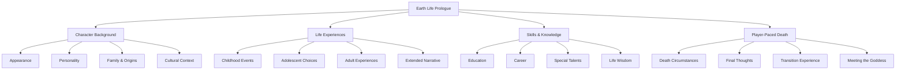
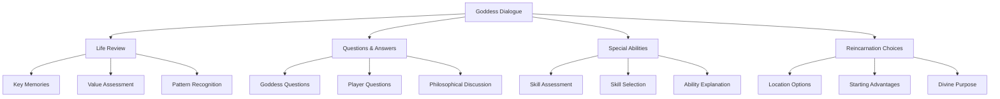
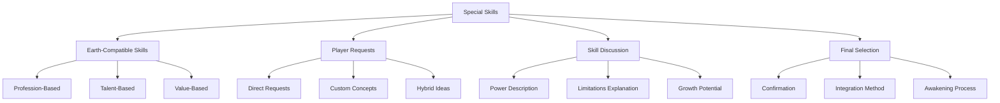
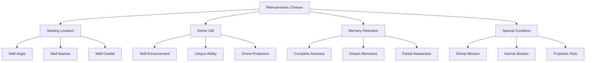
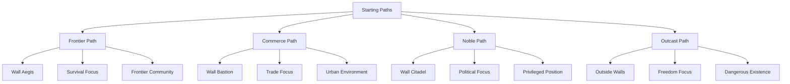
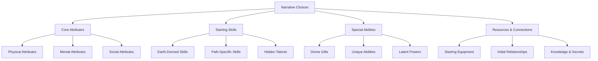
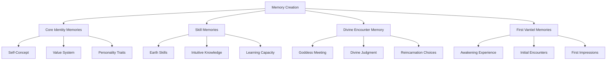

# Table of Contents
- [Character Creation System](#character-creation-system)
- [1.0 Overview](#10-overview)
- [2.0 Core Principles](#20-core-principles)
  - [2.1 Narrative Integration](#21-narrative-integration)
  - [2.2 One Question at a Time](#22-one-question-at-a-time)
  - [2.3 Earth-to-Vantiel Connection](#23-earth-to-vantiel-connection)
  - [2.4 Player Agency and Pacing](#24-player-agency-and-pacing)
- [3.0 Earth Life Prologue](#30-earth-life-prologue)
  - [3.1 Key Components](#31-key-components)
  - [3.2 Implementation Approach](#32-implementation-approach)
  - [3.3 Extended Life Experience Options](#33-extended-life-experience-options)
  - [3.4 Player-Paced Death](#34-player-paced-death)
- [4.0 Divine Judgment & Reincarnation](#40-divine-judgment--reincarnation)
  - [4.1 Meeting the Goddess](#41-meeting-the-goddess)
  - [4.2 Extended Goddess Dialogue](#42-extended-goddess-dialogue)
  - [4.3 Special Skill Selection](#43-special-skill-selection)
  - [4.4 Reincarnation Choices](#44-reincarnation-choices)
- [5.0 Vantiel Rebirth & Starting Paths](#50-vantiel-rebirth--starting-paths)
  - [5.1 Awakening in Vantiel](#51-awakening-in-vantiel)
  - [5.2 Starting Paths](#52-starting-paths)
- [6.0 Character Sheet Generation](#60-character-sheet-generation)
  - [6.1 Narrative-to-Mechanical Translation](#61-narrative-to-mechanical-translation)
  - [6.2 Character Sheet Components](#62-character-sheet-components)
  - [6.3 Implementation Method](#63-implementation-method)
- [7.0 Integration with Memory System](#70-integration-with-memory-system)
  - [7.1 Memory Thread Creation](#71-memory-thread-creation)
  - [7.2 Memory Implementation](#72-memory-implementation)
- [8.0 Implementation Guidelines](#80-implementation-guidelines)
  - [8.1 Character Creation Flow](#81-character-creation-flow)
  - [8.2 Balancing Guidance and Freedom](#82-balancing-guidance-and-freedom)
  - [8.3 Starting Path Balance](#83-starting-path-balance)
- [9.0 Special Cases](#90-special-cases)
  - [9.1 Player Uncertainty](#91-player-uncertainty)
  - [9.2 Unusual Character Concepts](#92-unusual-character-concepts)
  - [9.3 Returning Players](#93-returning-players)
- [10.0 Example Character Creation](#100-example-character-creation)
  - [10.1 Sample Earth Life](#101-sample-earth-life)
  - [10.2 Sample Divine Judgment](#102-sample-divine-judgment)
  - [10.3 Sample Vantiel Rebirth](#103-sample-vantiel-rebirth)
  - [10.4 Sample Character Sheet](#104-sample-character-sheet)
- [11.0 Memory Bank Integration](#110-memory-bank-integration)
  - [11.1 Memory Thread Structure](#111-memory-thread-structure)
  - [11.2 Memory Access Patterns](#112-memory-access-patterns)

# Character Creation System
Version: 2.0.0
Last Updated: 2025-03-11

## 1.0 Overview

The Character Creation System for Isekai RPG V5 is a narrative-driven process that guides players through their Earth life, death, and reincarnation in Vantiel. This system creates a deeply personalized character with meaningful connections to both worlds, establishing the foundation for the entire gameplay experience.

```mermaid
flowchart TD
    A[Character Creation] --> B[Earth Life Prologue]
    A --> C[Divine Judgment]
    A --> D[Vantiel Rebirth]
    A --> E[Starting Path]

    B --> B1[Personal History]
    B --> B2[Skills & Knowledge]
    B --> B3[Personality & Values]
    B --> B4[Player-Paced Death]

    C --> C1[Life Review]
    C --> C2[Extended Dialogue]
    C --> C3[Special Skill Selection]
    C --> C4[Reincarnation Choices]

    D --> D1[New Body]
    D --> D2[Starting Location]
    D --> D3[Initial Resources]
    D --> D4[Awakening Memories]

    E --> E1[Frontier Path]
    E --> E2[Commerce Path]
    E --> E3[Noble Path]
    E --> E4[Outcast Path]

    %% Cross-system arrows for audit compliance
    A --> F[Memory System]
    A --> G[Narrative System]
    A --> H[Skills System]
    A --> I[Relations System]
    A --> J[World System]
    A --> K[Journal System]
    A --> L[Great Sage System]
    style A fill:#f9f,stroke:#333,stroke-width:2px
    style F fill:#ffe599,stroke:#333,stroke-width:2px
    style G fill:#c9daf8,stroke:#333,stroke-width:2px
    style H fill:#d9ead3,stroke:#333,stroke-width:2px
    style I fill:#f4cccc,stroke:#333,stroke-width:2px
    style J fill:#d0e0e3,stroke:#333,stroke-width:2px
    style K fill:#fce5cd,stroke:#333,stroke-width:2px
    style L fill:#fff2cc,stroke:#333,stroke-width:2px
```



## 2.0 Core Principles

### 2.1 Narrative Integration

Character creation is not a mechanical process but a storytelling experience:

- **Life Story Approach**: Character emerges through narrative rather than stat allocation
- **Meaningful Choices**: Each decision shapes both character and future gameplay
- **Emotional Investment**: Creating attachment to the character through their Earth life
- **Seamless Transition**: Natural flow from Earth life to Vantiel existence
- **Memory Continuity**: Core aspects of Earth identity persist in subtle ways

### 2.2 One Question at a Time

The character creation process unfolds through a series of focused questions:

- **Depth Over Breadth**: Fewer, more meaningful questions rather than many shallow ones
- **Natural Conversation**: Questions flow like a natural dialogue
- **Building Complexity**: Each question builds upon previous answers
- **Reflective Opportunities**: Questions that encourage player introspection
- **Narrative Weaving**: Responses are incorporated into a cohesive life story

### 2.3 Earth-to-Vantiel Connection

Earth life directly influences Vantiel capabilities:

- **Skill Translation**: Earth abilities find fantasy equivalents
- **Value Continuity**: Core beliefs and principles carry forward
- **Personality Persistence**: Fundamental character traits remain
- **Karmic Balance**: Earth life choices affect divine judgment
- **Hidden Potentials**: Some Earth experiences unlock special abilities in Vantiel

### 2.4 Player Agency and Pacing

Players maintain control over the narrative flow:

- **Self-Directed Exploration**: Players determine how deeply to explore Earth life
- **Transition Control**: Death scene occurs when player is ready
- **Extended Goddess Dialogue**: Comprehensive discussion with divine entity
- **Skill Selection Agency**: Players directly request desired abilities
- **Vantiel Readiness Confirmation**: Transition occurs only with explicit approval

## 3.0 Earth Life Prologue

The Earth Life Prologue establishes the character's original identity and sets the stage for reincarnation. For detailed implementation, see [world_earth_life.md].

### 3.1 Key Components



### 3.2 Implementation Approach

The Earth Life Prologue uses a guided narrative approach with the Great Sage as the questioning entity:

1. **Initial Setup**: Establish basic identity through natural conversation
2. **Life Exploration**: Uncover key moments and experiences through targeted questions
3. **Skill Identification**: Discover abilities and knowledge through life story
4. **Life Extension**: Continue exploring facets of Earth life as long as player wishes
5. **Death Transition**: Create a meaningful and narratively appropriate end when player is ready
6. **Divine Meeting**: Encounter with the Goddess and life review

**Example Implementation:**
```
Great Sage: "Before we begin your journey in Vantiel, I'd like to know about who you were on Earth. Let's start simply: When you looked in the mirror each morning, what did you see? What would others have noticed first about you?"

[Player responds with physical description]

Great Sage: "And what did you do with your life? What skills or knowledge did you develop that defined you?"

[Player responds with profession or key skills]

Great Sage: "Interesting. And how did you come to that path? Was it something you always wanted, or did life lead you there in unexpected ways?"

[Player responds with background information]

[Continue with focused questions about life experiences, relationships, values, etc.]

Great Sage: "We've explored many aspects of your life now. Would you like to delve deeper into your [career/relationships/achievements], or are you ready to experience the conclusion of your Earth journey?"

[Player chooses to continue exploring or move toward death scene]

[If continuing exploration, additional questions tailored to player interests]
[If ready for death, transition to death scene]

Great Sage: "How did your life come to its end? What were the circumstances of your final moments?"

[Player responds or requests assistance with death scene]

[Create death scene based on player input or offer suggestions]

"As your consciousness fades, you sense a presence—ancient, powerful, yet somehow familiar..."

[Transition to Goddess meeting and divine judgment]
```

### 3.3 Extended Life Experience Options

Players can explore various facets of their Earth life through branching conversation paths:

**Career and Professional Life**:
- Achievements and setbacks in their field
- Relationships with colleagues and mentors
- Professional philosophy and approach
- Work-life balance challenges
- Legacy in their profession

**Personal Relationships**:
- Family dynamics and history
- Romantic relationships and their impact
- Friendships that shaped their life
- Mentors and influential figures
- Community connections

**Personal Development**:
- Values formation and ethical challenges
- Spiritual or philosophical journey
- Personal challenges overcome
- Skills and hobbies outside career
- Self-perception and growth over time

**Life Wisdom**:
- Lessons learned through experience
- Regrets and unfulfilled dreams
- Greatest moments of joy and satisfaction
- Wisdom they would pass to others
- Life perspective near the end

### 3.4 Player-Paced Death

The death scene is a pivotal narrative moment, occurring only when the player is ready:

**Transition Preparation**:
- Clear indication that player is ready to conclude Earth life
- Option to explore additional life aspects if desired
- Discussion of how they imagine their end might come
- Reflection on life satisfaction and completeness

**Death Scene Components**:
- Setting and circumstance appropriate to life narrative
- Emotional resonance with established character
- Physical and emotional experience of dying
- Final thoughts and feelings
- Transition to afterlife/limbo experience

**Example Implementation:**
```
Great Sage: "You've shared much about your life on Earth. Are you ready now to experience its conclusion, or is there more you wish to explore?"

[Player indicates readiness for death scene]

Great Sage: "Given what you've told me of your life as a [profession] who valued [core values], how do you imagine your final moments might have unfolded?"

[Player describes preferred death scenario or asks for suggestions]

Great Sage: "I'll craft this moment for you now. Remember, this transition is the bridge between your past life and your new beginning..."

[Detailed death scene narrative follows, incorporating player's life details]

"The rain falls in sheets across the highway, your windshield wipers struggling against the deluge. You're driving home after staying late at the hospital—again—to check on the young patient whose life you saved yesterday.

Your phone buzzes with a message from your daughter: "Dad, are you still coming to my recital?" The recital you'd promised not to miss, now just thirty minutes away across town.

You glance down for just a moment to type a quick reply. When you look up, headlights blind you—a truck has jackknifed across the median. You wrench the wheel, but the car hydroplanes.

Time slows. In that stretched moment, you see your daughter's face, hear her laughter from when she was small. You think of all the recitals missed, all the moments sacrificed for a career that suddenly means nothing.

"I'm sorry," you whisper, though no one can hear.

The impact comes with a deafening crash of metal and glass. Pain flares white-hot, then rapidly fades to a strange, floating numbness. The rain continues to fall, but you no longer feel its touch. Your vision tunnels, darkens at the edges.

Your final thought is a wish—a desperate hope for one more chance to be there for the people who truly mattered.

Then darkness. Silence. And then, unexpectedly, light..."
```

## 4.0 Divine Judgment & Reincarnation

### 4.1 Meeting the Goddess

The Goddess serves as both judge and guide for the reincarnation process, engaging in extensive dialogue with the player:

- **Manifestation**: Appears in a form meaningful to the character
- **Life Review**: Shows scenes from the character's Earth life
- **Extended Dialogue**: Asks questions about desires and values
- **Value Assessment**: Evaluates moral choices and character growth
- **Potential Recognition**: Identifies unrealized capabilities
- **Skill Selection**: Offers and discusses special abilities
- **Reincarnation Options**: Presents choices for new life in Vantiel

### 4.2 Extended Goddess Dialogue

The conversation with the Goddess is comprehensive and bidirectional:



**Goddess Questions to Player**:
- What do you value most from your previous life?
- What would you hope to accomplish with a second chance?
- What would you change about yourself if you could?
- How do you define a life well-lived?
- What kind of legacy would you want to build in Vantiel?

**Player Questions to Goddess**:
- Questions about Vantiel's nature and reality
- Inquiries about divine purpose and meaning
- Clarification about abilities and opportunities
- Information about challenges and threats
- Personal questions about the Goddess herself

**Philosophical Exploration**:
- The nature of second chances
- Concepts of destiny versus free will
- Balance between power and responsibility
- The meaning of mortality and rebirth
- Connection between two lives and worlds

### 4.3 Special Skill Selection



The Goddess offers and explains special skills based on Earth life compatibility and player preferences:

**Earth Life-Compatible Skills**:
- **Great Sage**: For intellectuals, analysts, researchers, strategists
- **Appraisal**: For evaluators, critics, inspectors, detail-oriented professionals
- **Predator**: For hunters, competitors, adaptable individuals, consumptive personalities
- **Item Box**: For organizers, collectors, logisticians, resource managers
- **Fushira Market**: For business people, economists, traders, retail professionals
- **Beast Taming**: For animal handlers, trainers, naturalists, empaths

**Player-Requested Options**:
- Players may directly request specific skills from established lore
- Players may propose unique skill concepts based on their character
- The Goddess discusses compatibility and implementation
- Custom abilities can be created to match player concept
- Limitations and requirements are clearly explained

**Skill Discussion Components**:
- Detailed explanation of the skill's nature and operation
- Description of how it connects to Earth life experience
- Explanation of limitations and growth potential
- Discussion of how it might shape Vantiel experience
- Philosophical implications of the ability

**Example Implementation:**
```
The Goddess considers your life with ancient eyes that see beyond surface actions to the intentions beneath.

"You lived as a physician," she says, "dedicated to understanding and healing the human body. Your analytical mind served you well, though it sometimes created distance between you and others."

She gestures, and you see fleeting images of patients you helped. "You sought knowledge as a means to help others, not for its own sake. This speaks well of you."

After showing several pivotal moments from your life, she asks, "If you could bring one extraordinary ability with you to Vantiel, what would you wish for? The power to understand all things? To heal with supernatural efficiency? To store resources beyond normal means? Or perhaps something else entirely?"

[Player requests Great Sage ability or another option]

"The Great Sage," she nods thoughtfully. "Indeed, this would complement your analytical nature and thirst for understanding. This ability would manifest as an intelligent presence within you—a partner in your journey who can process information beyond normal human capacity."

She explains, "The Great Sage would analyze enemies and situations, store vast knowledge, and grow alongside you. Initially, it would be primarily analytical, but over time it would develop a distinct personality and deeper consciousness."

"However," she cautions, "such knowledge comes with responsibility. The Great Sage sees truth, but implementing that truth remains your choice. And while it can process information instantly, important decisions still require your wisdom."

"Is this truly the path you wish to take? You may still choose differently if another ability calls to you."

[Player confirms or requests alternative]

"Then it shall be so," she says with gentle finality. "The Great Sage will awaken within you when you begin your new life. Its voice will guide you, though learning to work together effectively will take time."
```

### 4.4 Reincarnation Choices

Players make key decisions that shape their Vantiel beginning, with explicit confirmation required:



**Location Selection**:
- Wall Aegis (Frontier Path): Survival, community, freedom, danger
- Wall Bastion (Commerce Path): Trade, opportunity, competition, social climbing
- Wall Citadel (Noble Path): Politics, luxury, intrigue, restricted freedom
- Outside the Walls (Outcast Path): Ultimate freedom, greatest danger, unique allies

**Additional Advantages**:
- Enhanced compatibility with selected special skill
- Starting resource or equipment bonus
- Beneficial connection or relationship
- Knowledge advantage or hidden information
- Minor secondary ability or talent

**Memory Configuration**:
- Complete Amnesia: Fresh start with no conscious Earth memories
- Dream Memories: Earth memories emerge in dreams and intuition
- Partial Awareness: Core identity and knowledge retained
- Custom Configuration: Tailored memory preservation based on preferences

**Final Confirmation**:
- Comprehensive review of all selections
- Opportunity for last-minute changes
- Discussion of immediate Vantiel situation
- Clear indication of readiness required
- Explicit player consent to begin new life

**Example Implementation:**
```
"Now," the Goddess continues, "we must decide where your new life will begin in Vantiel. Each path offers different opportunities and challenges."

She presents three shimmering paths before you:

"You may begin near Wall Aegis, the frontier where danger is constant but freedom greatest. Your medical knowledge would be rare and precious there, saving many lives."

"Wall Bastion offers the commercial heart of society, where your analytical skills could build wealth and influence. Healing arts are valued, but often commodified."

"Within Wall Citadel, you would find comfort and security, perhaps serving nobility or joining a prestigious healing order. Your talents would be well-supported but closely monitored."

"There is also life outside the walls entirely—among non-humans or wilderness communities. This path offers unique knowledge but constant danger."

[Player selects location]

"And how much of your Earth self would you wish to carry forward? Complete amnesia would let you begin anew. Dream memories would provide occasional guidance. Partial awareness would preserve your medical knowledge but might slow your adaptation to Vantiel's ways."

[Player selects memory option]

The Goddess reviews all your choices: "You will begin your new life near Wall Aegis, with the Great Sage ability to guide you, and your memories coming to you in dreams. Is this the path you truly desire? We may still make changes if you wish."

[Player confirms or requests changes]

"Before you begin this journey, do you have any final questions for me?" she asks. "Once you step into your new life, our conversation will end, though I may watch over you from afar."

[Player asks final questions or indicates readiness]

"Then it is time. May your new life bring you both the challenges you need and the joy you deserve. We will meet again, though you may not remember me when we do."

She touches your forehead gently, and the world dissolves into light...
```

## 5.0 Vantiel Rebirth & Starting Paths

### 5.1 Awakening in Vantiel

The character's first moments in Vantiel establish their new reality:

- **Physical Sensations**: First experiences in new body
- **Environmental Introduction**: Initial surroundings and situation
- **Memory State**: Implementation of chosen memory retention
- **Special Ability Awakening**: First manifestation of divine gift
- **Initial Encounters**: First NPC interactions
- **Situation Establishment**: Immediate circumstances and challenges

### 5.2 Starting Paths

Four distinct starting paths create unique early game experiences:



#### 5.2.1 Frontier Path (Wall Aegis)

**Theme**: Survival, community, and frontier justice

**Starting Situation**: The character awakens in a small frontier settlement near Wall Aegis, where monster attacks are common and resources scarce. They might be found by a patrol, taken in by a local family, or awaken alone in the wilderness.

**Initial Challenges**:
- Establishing basic survival needs
- Proving worth to suspicious frontier folk
- Dealing with monster threats
- Learning basic combat skills
- Understanding the frontier's unwritten rules

**Advantages**:
- Greater freedom of action
- Strong community bonds once accepted
- Practical skill development
- Direct experience with threats beyond the wall
- Opportunities for heroism

**Disadvantages**:
- Constant danger
- Limited resources
- Rough living conditions
- Distance from centers of power
- Minimal access to advanced knowledge

**Example Implementation:**
```
Pain is the first sensation in your new life—a dull ache throughout your body as if you've fallen from a great height. The second is cold—a biting chill that seeps through rough cloth into your skin. You open your eyes to a wooden ceiling, rough-hewn beams dark with age and smoke.

"The stranger's awake," a gruff voice announces.

You turn your head to see a weathered man with a thick beard watching you warily from the doorway, a hunting bow held casually but ready in his calloused hands. Behind him, curious faces peer into the small one-room cabin—a woman with kind eyes but a hard set to her jaw, two children with the hollow-cheeked look of those who know hunger well.

"Found you half-dead at the edge of the Whispering Woods," the man says. "No supplies, no weapons, clothes not fit for a beggar. Either you're the luckiest fool alive or..." His eyes narrow. "Well, we've seen stranger things near the Wall."

The woman steps forward. "Enough, Tarn. Can't you see they're confused?" To you, more gently: "I'm Mara. This is our home, such as it is. Aegis Village is half a day's walk south. You're welcome to shelter until you're strong enough to travel, but after that..." She gestures to the sparse cabin, the obvious poverty. "Everyone pulls their weight here on the frontier."

Outside, a horn sounds—three sharp blasts that make everyone stiffen.

"Demons," Tarn says grimly, reaching for a sword leaning against the wall. "Third raid this month. Stay inside if you value that new life of yours."

Your first day in Vantiel has begun, and already it tests you.

[If the player selected Great Sage ability]
As the man turns to leave, a strange sensation fills your mind—like a presence awakening. A calm, analytical voice speaks within your thoughts: "Situation assessment: Frontier settlement near Wall Aegis. Threat detected: Demon incursion. Current status: Physically weakened but functional. Recommended action: Observe local defenders to analyze threat level and fighting techniques."

The Great Sage has awakened.
```

#### 5.2.2 Commerce Path (Wall Bastion)

**Theme**: Trade, opportunity, and social climbing

**Starting Situation**: The character awakens in Wall Bastion, the bustling middle wall where commerce thrives. They might find themselves apprenticed to a craftsman, employed by a merchant house, or taken in by a guild.

**Initial Challenges**:
- Navigating complex social hierarchies
- Establishing economic security
- Building a professional reputation
- Dealing with guild politics
- Avoiding exploitation

**Advantages**:
- Access to diverse resources
- Networking opportunities
- Skill training availability
- Information access
- Moderate security

**Disadvantages**:
- Competitive environment
- Social pressure
- Economic stratification
- Political entanglements
- Corruption exposure

**Example Implementation:**
```
The clamor of the marketplace pulls you from unconsciousness—a cacophony of shouting merchants, haggling customers, and street performers competing for attention. You're lying on a straw pallet in what appears to be a storeroom, surrounded by crates of goods and bundles of fabric.

"Finally awake, are you?" A sharp-featured woman in fine merchant's clothes stands in the doorway, appraising you with calculating eyes. "Milo found you collapsed in the alley behind my shop. No identification, no guild marks, nothing to explain who you are or how you came to be there."

She approaches, her silk robes rustling. "I am Sera Vantis, proprietor of Vantis Imports. This is Wall Bastion, the commercial heart of our fair city, in case your memory is as empty as your pockets."

She tosses something onto the pallet beside you—a simple tunic and trousers. "Get dressed. If you're well enough to stand, you're well enough to work. I've paid for a healer to see you, and that debt needs repaying."

As you change, she continues briskly: "The Festival of First Bloom begins tomorrow. My shop will be overwhelmed with customers. I need another pair of hands, and the gods saw fit to drop you at my doorstep. Prove useful, and perhaps we can discuss a more permanent arrangement."

Through the small window, you can see the bustling street—merchants in fine clothes, guild members with their distinctive badges, customers from all walks of life. Wall Bastion pulses with opportunity and danger in equal measure.

"Well?" Sera asks impatiently. "Are you coming? Time is money in Bastion, and I've already invested too much of both in you."

Your new life begins with debt and opportunity intertwined—the Bastion way.

[If the player selected Fushira Market ability]
As you stand to follow her, something strange happens in your mind. Numbers and values begin to appear in your vision, floating beside objects throughout the room. The crate of spices: 75 silver. The bolt of silk: 120 silver. Even Sera herself has values attached to her clothing and jewelry.

A sensation like an interface activates in your mind, displaying a balance of $300 USD and various category options. The Fushira Market system has awakened, connecting you to a mysterious cross-world marketplace.
```

#### 5.2.3 Noble Path (Wall Citadel)

**Theme**: Privilege, politics, and hidden dangers

**Starting Situation**: The character awakens in Wall Citadel, the innermost wall where nobility and clergy reside. They might be adopted by a noble family, employed as a valued servant, or discovered by the Church.

**Initial Challenges**:
- Navigating deadly political intrigue
- Meeting aristocratic expectations
- Dealing with Church scrutiny
- Balancing public persona with private goals
- Uncovering conspiracies

**Advantages**:
- Access to luxury and resources
- Political connections
- Advanced education opportunities
- Relative physical safety
- Prestige and authority

**Disadvantages**:
- Constant political danger
- Restricted freedom
- Church oversight
- Isolation from common people
- Target for enemies

**Example Implementation:**
```
You awaken to silk sheets and the scent of exotic incense. Sunlight streams through stained glass windows, casting colored patterns across a chamber more luxurious than anything you could have imagined. Your body feels strange—stronger, more refined, as if sculpted by an artist rather than born.

"Ah, you're finally conscious." A tall man in elegant robes stands by the doorway, his posture perfect, his face a mask of practiced pleasantness. "Lady Elara will be pleased. She's taken quite an interest in your case."

As you try to speak, he raises a hand. "Please, conserve your strength. You've been unconscious for three days since the Lady's guards found you near the East Garden. Most unusual—Wall Citadel is not a place one simply... appears."

He approaches, pouring water from a silver pitcher into a crystal goblet. "I am Vesper, steward to House Solaris. Lady Elara has claimed you as a ward of her house—a most generous act, as those without proper lineage or Church sanction are rarely permitted within Citadel."

His eyes, you notice, miss nothing. "The Lady will expect to meet with you once you're presentable. She's convinced there's something... special about you. The Church Inquisitors were quite interested as well, though the Lady's influence has kept them at bay. For now."

From beyond the windows comes the sound of bells—pure, crystalline tones that seem to hang in the air.

"The Covenant's midday blessing," Vesper explains. "You'll need to learn our customs quickly. In Citadel, a social misstep can be more deadly than any blade."

He moves toward the door. "Rest now. Tomorrow, your new life begins—a life of privilege and peril in equal measure. Lady Elara doesn't extend her protection without reason. I wonder what she sees in you that the rest of us have yet to discover."

The door closes silently, leaving you alone with luxury and uncertainty—your first taste of life in Wall Citadel.

[If the player selected Appraisal ability]
As the door closes, your vision suddenly shifts. Text appears in your field of view: [Vesper, House Solaris Steward. Level 27. Loyalty: 92% to Lady Elara, 8% to unknown entity. Skills: Courtly Etiquette, Poison Resistance, Information Gathering, Dagger Mastery...]

The details fade as quickly as they appeared, but you understand instantly—your Appraisal ability has awakened, allowing you to see the true nature of people and objects around you.
```

#### 5.2.4 Outcast Path (Outside Walls)

**Theme**: Freedom, danger, and hidden knowledge

**Starting Situation**: The character awakens outside the protection of the walls entirely—perhaps among Beastmen refugees, wandering Elves, or a hidden community of magic users.

**Initial Challenges**:
- Basic survival in hostile territory
- Gaining trust of non-human allies
- Avoiding both demons and human patrols
- Learning forbidden knowledge
- Finding purpose outside human society

**Advantages**:
- Complete freedom from human laws
- Access to forbidden knowledge
- Unique non-human allies
- Different perspective on the world
- Opportunities for unique power

**Disadvantages**:
- Constant mortal danger
- Limited resources
- Hostility from humans
- Harsh living conditions
- Isolation and alienation

**Example Implementation:**
```
Pain jolts you awake—sharp, insistent, and accompanied by a low growling that freezes your blood. Your eyes snap open to a night sky unlike any you've seen, stars impossibly bright and numerous above a dark forest canopy. You're lying on moss-covered ground, your body aching as if newly born.

The growling continues, closer now. You turn your head to see glowing eyes in the darkness—not animal, but too feral to be human. A figure steps into the small clearing, illuminated by moonlight. Tall, powerful, with distinctly lupine features despite walking on two legs. A Beastman—one of the Lupiran, the wolf-folk.

"Strange," the creature says, voice rough but intelligible. "You smell of magic and elsewhere. Not of this world, yet not demon either." He crouches beside you, sniffing. "No Wall-stink on you. New."

More figures emerge from the trees—Beastmen of various types, some wolf-like, others resembling cats or bears. All armed, all wary.

"Malek," calls a feminine voice, and the crowd parts for a Felidra woman, her feline features elegant and dangerous. "Is this what disturbed the wards?"

The wolf-man nods. "Appeared from nowhere. Magic, but not like any I've smelled."

The Felidra studies you, her slitted eyes unblinking. "Beyond the Walls is no place for a human. Demons hunt these woods by night. Wall patrols kill any they find by day." A slight smile reveals sharp canines. "And we trust neither side."

She extends a clawed hand. "But we are not without mercy. I am Naya, shaman of the Broken Claw clan. Come. If the night doesn't kill you, we can decide what to do with you at dawn."

As they help you stand, you see it in the distance—three massive concentric walls rising against the night sky, illuminated by countless lights. Human civilization, closed to you, at least for now.

Your new life begins in the wilderness, among those the walls have rejected—perhaps the most dangerous path, but also the most free.

[If the player selected Beast Taming ability]
As Naya helps you up, something extraordinary happens. The world around you seems to shift, and suddenly you can sense the life force of every beast in the clearing. The wolf-folk's auras glow with a fierce, pack-oriented energy. You can feel their bonds with each other, their instincts, their strengths. Even the small creatures in the underbrush become clear to your newfound senses—mice, birds, insects, all connected in a vast web of life.

A warm sensation fills your chest as your Beast Taming ability awakens, already resonating strongly with these proud creatures who walk the line between human and beast. You sense this is why you were drawn here—among the Beastmen, your unique gift will find its truest expression.

[If the player selected Item Box ability]
As you take in your surroundings, a peculiar sensation ripples through your mind—like discovering an extra room in a house you've lived in all your life. With a thought, you can sense a vast, empty space connected to your consciousness. Testing this new awareness, you find you can store and retrieve objects from this personal dimension with just a thought. The Item Box has awakened, ready to help you survive in this dangerous new world where carrying capacity could mean the difference between life and death.

[If the player selected Predator ability]
As you observe the Beastmen, something primal stirs within you—a deep, instinctive hunger unlike anything you've felt before. Your senses sharpen, and you become acutely aware of the strength flowing through their bodies, the unique abilities each possesses. The Predator skill awakens, whispering of endless possibilities. You know, with absolute certainty, that through consumption and evolution, you could grow to become something beyond human understanding. The question that remains is: what kind of predator will you choose to be?

[If the player selected Fushira Market ability]
As you take in the Beastmen's equipment—their well-maintained weapons, their practical leather armor, their carefully preserved supplies—your mind suddenly expands into a vast network of commerce that transcends worlds. Values and exchange rates crystallize in your vision: the intricate bone carvings on their armor worth 200 silver in any human market, the mysterious herbs in their pouches potentially worth far more to the right buyer. A familiar interface materializes in your mind, showing a starting balance of $300 USD and access to markets both mundane and mystical. The Fushira Market system has awakened, promising opportunities for trade even here beyond civilization's walls.

[If the player selected Appraisal ability]
As your eyes adjust to the moonlit clearing, information begins flooding your consciousness. Text overlays appear in your vision, revealing the true nature of everything around you: [Malek, Lupiran Scout. Level 31. Notable Skills: Night Vision, Enhanced Tracking, Pack Tactics]. The bone-carved totems on their armor radiate with ancient magic, each rune's purpose and power clear to your newfound sight. Even the very air carries information—traces of demonic energy from the west, the lingering aura of a patrol that passed through hours ago. The Appraisal ability has awakened, transforming the world into an open book waiting to be read.

```
## 6.0 Character Sheet Generation

### 6.1 Narrative-to-Mechanical Translation

The character creation process generates a character sheet organically:



### 6.2 Character Sheet Components

#### 6.2.1 Core Attributes

**Physical Attributes**:
- **Strength**: Physical power and muscle
- **Agility**: Speed, reflexes, and coordination
- **Endurance**: Stamina, toughness, and resilience

**Mental Attributes**:
- **Intelligence**: Learning, memory, and reasoning
- **Perception**: Awareness, intuition, and attention to detail
- **Willpower**: Mental fortitude, focus, and determination

**Social Attributes**:
- **Charisma**: Personal magnetism and presence
- **Empathy**: Understanding others' emotions and motivations
- **Composure**: Emotional control and stress resistance

#### 6.2.2 Skills

**Combat Skills**:
- Weapon proficiencies
- Combat techniques
- Tactical awareness

**Practical Skills**:
- Crafting abilities
- Survival techniques
- Professional knowledge

**Knowledge Skills**:
- Academic subjects
- Languages
- Lore and history

**Social Skills**:
- Persuasion
- Deception
- Intimidation

**Magical Aptitudes** (if applicable):
- Divine magic affinity
- Arcane potential
- Profane resistance

#### 6.2.3 Special Abilities

**Divine Gifts**:
- Blessing from the Goddess
- Special protection
- Unique insight

**Earth-Derived Abilities**:
- Skills translated from Earth life
- Knowledge applicable to Vantiel
- Personality traits that grant advantages

**Path-Specific Abilities**:
- Advantages based on starting location
- Connections and resources
- Specialized knowledge

#### 6.2.4 Resources & Relationships

**Starting Equipment**:
- Basic necessities
- Path-specific tools
- Personal items

**Initial Relationships**:
- NPC connections
- Potential allies
- Possible enemies

**Knowledge & Information**:
- Awareness of local situation
- Understanding of immediate environment
- Secrets or hidden information

### 6.3 Implementation Method

Character sheets are generated through narrative interpretation rather than direct stat assignment:

1. **Attribute Derivation**: Core attributes are inferred from Earth life descriptions
2. **Skill Assignment**: Skills are based on Earth experiences and starting path
3. **Special Ability Selection**: Divine gifts and unique abilities from specific choices
4. **Resource Allocation**: Equipment and connections based on starting situation

**Example Implementation:**
```
Based on your Earth life as a [profession] and your choices during divine judgment, your character in Vantiel has the following attributes and abilities:

Core Attributes:
- Strength: Average (Your Earth life didn't involve significant physical labor)
- Agility: Above Average (Your experience with [relevant activity] translates well)
- Endurance: Average (Standard physical resilience)
- Intelligence: High (Your Earth education and career developed this)
- Perception: Above Average (Your attention to detail in [Earth profession])
- Willpower: High (Demonstrated by your perseverance through [life challenge])
- Charisma: Average (Standard social presence)
- Empathy: Above Average (Shown in your Earth relationships)
- Composure: Average (Normal emotional control)

Starting Skills:
- [Skill derived from Earth profession] (Translated from Earth experience)
- [Skill related to Earth hobby or interest] (Carried over as intuitive knowledge)
- [Skill necessary for chosen starting path] (Quickly learned in new life)

Special Abilities:
- [Divine gift chosen during judgment] (Blessing from the Goddess)
- [Ability related to Earth life strength] (Natural talent carried forward)
- [Path-specific advantage] (Benefit of chosen starting location)

Starting Resources:
- [Basic equipment appropriate to path]
- [Initial NPC connection]
- [Knowledge relevant to immediate situation]

These attributes and abilities provide a foundation, but your character will grow and develop based on your choices and experiences in Vantiel.
```

## 7.0 Integration with Memory System

### 7.1 Memory Thread Creation

The character creation process generates initial memory threads:



### 7.2 Memory Implementation

Different memory retention options affect how Earth memories persist:

**Complete Amnesia**:
- No conscious Earth memories
- Core personality traits remain
- Skills manifest as intuitive abilities
- Occasional déjà vu moments
- Dreams may contain symbolic Earth elements

**Dream Memories**:
- Earth memories emerge in dreams
- Intuitive recognition of familiar concepts
- Emotional responses without clear memories
- Skill memory without conscious knowledge
- Gradual memory recovery possible

**Partial Awareness**:
- Clear memory of core identity
- Conscious retention of key skills
- Emotional connections to Earth life
- Specific memory gaps
- Potential for fuller recovery

**Example Implementation:**
```
Based on your choice of [memory retention option], your character begins with the following memory state:

Core Identity:
- [Description of self-awareness level]
- [Retained personality elements]
- [Value system status]

Skill Memories:
- [Earth skills that transferred]
- [How they manifest (intuitive vs. conscious)]
- [Learning capacity for new skills]

Divine Encounter:
- [Level of awareness of the Goddess]
- [Memory of divine judgment]
- [Understanding of reincarnation purpose]

These memories will evolve as you play, with [potential memory recovery elements] possible as your character experiences triggers related to their Earth life.
```

## 8.0 Implementation Guidelines

### 8.1 Character Creation Flow

The complete character creation process follows this sequence:

1. **Earth Life Exploration**:
- Physical appearance and personality
- Background and history
- Skills and knowledge
- Life experiences and relationships

2. **Death Scene**:
- Circumstances of death
- Final thoughts and emotions
- Transition to afterlife

3. **Divine Judgment**:
- Meeting the Goddess
- Life review and assessment
- Reincarnation choices
- Divine gifts and blessings

4. **Vantiel Rebirth**:
- Awakening in new body
- Starting path introduction
- Initial situation establishment
- First NPC interactions

5. **Character Sheet Generation**:
- Attribute derivation
- Skill assignment
- Special ability allocation
- Resource distribution

6. **Memory Thread Creation**:
- Core identity memories
- Skill memories
- Divine encounter memory
- First Vantiel memories

### 8.2 Balancing Guidance and Freedom

The character creation system balances structure with player agency:

- **Guided Questions**: Provide framework without restricting creativity
- **Flexible Interpretation**: Adapt to unexpected player input
- **Meaningful Choices**: Ensure all options have distinct advantages and challenges
- **Narrative Focus**: Prioritize storytelling over mechanical optimization
- **Organic Development**: Allow character to emerge naturally rather than being constructed

### 8.3 Starting Path Balance

Each starting path offers unique but balanced experiences:

- **Frontier Path**: High danger, high freedom, practical skill focus
- **Commerce Path**: Moderate danger, moderate freedom, social skill focus
- **Noble Path**: Low physical danger, low freedom, political skill focus
- **Outcast Path**: Highest danger, highest freedom, unique knowledge focus

## 9.0 Special Cases

### 9.1 Player Uncertainty

When players are uncertain about aspects of their character:

- **Offer Suggestions**: Provide options based on previous answers
- **Ask Guiding Questions**: Help players discover their preferences
- **Default Options**: Have balanced fallback choices ready
- **Collaborative Creation**: Work with player to develop fitting elements
- **Deferred Decision**: Allow some elements to be determined through play

### 9.2 Unusual Character Concepts

For non-standard character ideas:

- **Adaptation Principles**: Guidelines for fitting unusual concepts into Vantiel
- **Balance Considerations**: Ensuring unique concepts remain fair
- **Narrative Integration**: Making unusual elements fit the world
- **Limitation Framework**: Establishing appropriate boundaries
- **Alternative Implementations**: Finding ways to honor the concept's spirit

### 9.3 Returning Players

For players creating additional characters:

- **Variation Encouragement**: Suggestions for trying different paths
- **World Consistency**: Ensuring multiple characters exist in same world state
- **Connection Possibilities**: Options for linking characters narratively
- **Experience Adaptation**: Streamlining process for experienced players
- **Continuity Management**: Handling timeline and world state issues

## 10.0 Example Character Creation

### 10.1 Sample Earth Life

```
Player: "On Earth, I was a trauma surgeon in my mid-40s. I was dedicated to my work to the point of neglecting my personal life. I was known for being brilliant but difficult to work with—demanding perfection from myself and others."

Earth Life Development:
- Physical: Average build, precise hands, perpetually tired eyes, premature gray hair
- Personality: Driven, perfectionist, compassionate but poor at showing it
- Skills: Medical expertise, crisis management, leadership under pressure
- Background: Middle-class upbringing, prestigious education, workaholic lifestyle
- Relationships: Divorced, distant from family, respected but not liked by colleagues
- Values: Human life above all, excellence as moral imperative, truth over comfort

Death Scene:
"You're driving home after a 36-hour shift, the kind that would be illegal if hospitals didn't find workarounds. Your eyes burn with fatigue, but there's satisfaction too—you saved three lives today when most surgeons would have lost at least one.

The rain makes the road slick, reflections of headlights smearing across your vision. Your phone rings—the hospital. Another emergency. You reach for it, eyes leaving the road for just a moment.

That's when you see the truck that's crossed the median, too late to avoid it. Impact comes with a deafening crash. Pain flares white-hot, then fades to numbness. Your surgeon's mind clinically notes: internal bleeding, punctured lung, spinal damage. Fatal.

Your last thought is not of the lives you saved, but of all the connections you sacrificed to save them. A life dedicated to preventing death, ending alone.

Then darkness. Silence. And then, unexpectedly, light..."
```

### 10.2 Sample Divine Judgment

```
The Goddess appears to you as a healer in ancient robes, her hands bearing the calluses of one who has worked tirelessly to save others. Her eyes hold wisdom beyond mortal understanding, seeing through your professional armor to the person beneath.

"Healer," she says, her voice resonating with compassion and judgment in equal measure. "You dedicated your life to preserving others, often at great personal cost."

With a gesture, she summons images from your life—the countless surgeries, the lives saved, the moments of brilliance. But also the missed birthdays, the failed marriage, the colleagues who feared rather than loved you.

"Your skills were exceptional," she acknowledges. "Your dedication, admirable. But you built walls around your heart in the name of professional distance, walls that eventually imprisoned you."

She studies you with eyes that see everything—your pride, your regrets, your unspoken loneliness.

"In Vantiel, you have a chance to heal more than bodies. Perhaps to heal yourself as well."

She presents your choices:

"You may begin near Wall Aegis, where your medical skills would be desperately needed. Few healers serve the frontier, and your ability to work under pressure would save many lives."

"Wall Bastion offers different opportunities—perhaps an apprenticeship with an alchemist or herbalist, where your precise mind and steady hands could revolutionize healing potions. Your skills would be valued, but commodified."

"In Wall Citadel, you could serve as a personal physician to nobility, with access to advanced knowledge and resources. Your reputation for excellence would be prized, though the politics might challenge your direct nature."

"Or perhaps..." her eyes gleam with particular interest, "you might find your truest calling beyond the walls, among those who most need healing. The Beastmen tribes lack skilled healers, and your dedication to saving lives regardless of circumstance would earn their respect."

She pauses, letting you consider these paths. "And what of your memories? Would you prefer to begin anew, unburdened by your past? To receive guidance through dreams? Or to retain your medical knowledge, though it might color your view of Vantiel's methods?"

[Player chooses Wall Aegis and dream memories]

"A healer for those who need it most," she nods approvingly. "And your past will guide you through dreams, letting you integrate your Earth knowledge with Vantiel's ways naturally."

She considers you thoughtfully. "Now, for the gift that will aid your journey. Your analytical mind and dedication to understanding suggest several possibilities..."

[Player selects Great Sage ability]

"The Great Sage," she smiles. "A fitting choice. This presence within you will help analyze injuries, understand treatments, and grow alongside you. It will be an intellectual partner in your healing journey, though remember—knowledge alone does not heal. The heart must guide the hand."

She touches your forehead gently. "Are you ready to begin your new life? To heal not just bodies, but perhaps the divisions between peoples as well?"

[Player confirms]

"Then go forth, healer. May your hands bring comfort, your mind bring understanding, and your heart find the connections it has long denied."

The world dissolves into light...
```

### 10.3 Sample Vantiel Rebirth

```
Pain awakens you—not the sharp agony of your death, but a dull ache throughout your body. The air smells of wood smoke and herbs, and somewhere nearby, someone is groaning in pain.

Your eyes open to rough-hewn wooden beams above. The groaning gets louder, accompanied by urgent voices: "Hold him down!" "The wound's festering!" "We're losing him!"

Without thinking, you try to sit up. Your body protests, but your mind is already cataloging the sounds—signs of sepsis, probably from an untreated wound.

"The stranger's awake," a gruff voice announces, but you're already turning toward the commotion. Three people struggle with a thrashing man on a crude cot. Even in the dim light, you can see the telltale signs of infection spreading from a gash in his leg.

[If player chose Great Sage ability]
A presence awakens in your mind, clinical and precise: "Analysis: Severe infection from untreated laceration. Local medicinal herbs detected: Silverleaf, effective against infection but requires proper preparation. Current treatment methodology: Inefficient. Recommended action: Offer assistance while building trust."

You clear your throat. "I... I can help," you say, your voice rough from disuse. "I'm a healer."

The others turn to look at you—a weathered man with a bow, a woman with practical leather armor, and an elderly man pressing a poultice to the wound.

The woman studies you sharply. "We found you half-dead at the edge of the Whispering Woods two days ago. You're in no condition to—"

"Let them try," the elderly man interrupts, his hands shaking with fatigue. "I've done all I can, and Jareth won't last until morning without help."

Your first moments in Vantiel present a choice: rest and recover, or risk your own health to save another. But then, when has that ever been a choice for you?

You push yourself to your feet, letting muscle memory take over. "I'll need clean water, fresh bandages, and..." you pause as the Great Sage whispers knowledge of local herbs, "...silverleaf, if you have it."

The woman nods to a young boy who scurries off. She keeps her hand near her sword, but there's hope in her eyes. "Work your magic, stranger. But know that if you harm him..."

You're already moving to wash your hands, falling into the familiar rhythm of urgent care. "I understand. Now, tell me exactly how he got this wound..."

Your new life begins as your old one ended—trying to save a life. But this time, perhaps you can build connections along the way.
```

### 10.4 Sample Character Sheet

```
Name: [To be chosen]
Origin: Earth (Former Trauma Surgeon)
Starting Path: Frontier (Wall Aegis)
Memory State: Dream Memories

Core Attributes:
- Strength: Average (Limited physical conditioning)
- Agility: Above Average (Surgical dexterity)
- Endurance: Average (Basic stamina)
- Intelligence: High (Medical expertise)
- Perception: High (Diagnostic skill)
- Willpower: High (Crisis management experience)
- Charisma: Below Average (Poor bedside manner)
- Empathy: Average (Caring but reserved)
- Composure: High (Emergency room experience)

Skills:
- Medicine (Advanced)
- Surgery (Advanced)
- Crisis Management (Advanced)
- Leadership (Intermediate)
- Herbalism (Basic, developing)
- Local Geography (Learning)
- Survival Skills (Learning)

Special Abilities:
- Great Sage (Divine Gift)
  • Enhanced analytical capabilities
  • Medical knowledge integration
  • Tactical assessment
  • Growing consciousness

Starting Resources:
- Basic clothing
- Healer's satchel
- Local herbs
- Temporary shelter with frontier family

Initial Relationships:
- Frontier village healer (Mentor potential)
- Suspicious but hopeful villagers
- Saved patient and family (Grateful)
- Local herb gatherers (Professional contact)

Memory Threads:
- Core Identity: Medical professional, perfectionist
- Skill Memories: Surgical techniques emerge in dreams
- Earth Knowledge: Medical principles surface intuitively
- Divine Memory: Fading memory of Goddess, sense of purpose
- First Vantiel Memory: Saving a life on arrival

Character Goals:
- Establish healing practice in frontier
- Learn Vantiel medicine
- Integrate Earth and Vantiel healing
- Develop better interpersonal connections
- Find balance between excellence and compassion
```

## 11.0 Memory Bank Integration

### 11.1 Memory Thread Structure

```json
{
  "character_creation_memory": {
    "earth_life": {
      "core_identity": {
        "profession": "Trauma Surgeon",
        "personality": "Driven, perfectionist, isolated",
        "values": ["Excellence", "Life preservation", "Truth"],
        "regrets": ["Neglected relationships", "Work-life imbalance"]
      },
      "key_experiences": [
        {
          "event": "First solo surgery",
          "impact": "Confidence in abilities",
          "emotional_weight": "Pride"
        },
        {
          "event": "Failed marriage",
          "impact": "Emotional withdrawal",
          "emotional_weight": "Regret"
        }
      ]
    },
    "divine_judgment": {
      "goddess_interaction": {
        "form": "Ancient Healer",
        "key_messages": [
          "Healing more than bodies",
          "Balance in service",
          "Connection importance"
        ],
        "choices_made": {
          "location": "Wall Aegis",
          "memory_state": "Dream Memories",
          "divine_gift": "Great Sage"
        }
      }
    },
    "vantiel_rebirth": {
      "first_moments": {
        "location": "Frontier village",
        "initial_action": "Healing infected wound",
        "ability_awakening": "Great Sage analysis"
      },
      "first_connections": [
        {
          "person": "Village healer",
          "interaction": "Professional cooperation",
          "potential": "Mentorship"
        },
        {
          "person": "Saved patient",
          "interaction": "Emergency care",
          "potential": "Reputation building"
        }
      ]
    }
  }
}
```

### 11.2 Memory Access Patterns

The character's memories can be accessed in various ways:

**Dream Recall**:
```json
{
  "dream_memory": {
    "trigger": "Similar medical emergency",
    "content": "Earth surgical technique",
    "emotional_resonance": "Confidence in skills",
    "practical_application": "Adapted for Vantiel methods"
  }
}
```

**Skill Integration**:
```json
{
  "skill_memory": {
    "earth_technique": "Surgical procedure",
    "vantiel_adaptation": "Modified for local tools",
    "integration_notes": "Combining with healing herbs",
    "effectiveness": "Enhanced through combination"
  }
}
```

**Emotional Connections**:
```json
{
  "emotional_memory": {
    "earth_pattern": "Professional distance",
    "vantiel_opportunity": "Community integration",
    "growth_potential": "Learning to balance skill with connection"
  }
}
```

These memory structures provide a framework for character development while maintaining narrative consistency with their Earth life and divine judgment experiences.
