# Table of Contents
- [Combat System: Cinematic Encounters](#combat-system-cinematic-encounters)
- [1.0 Combat Mode Overview](#10-combat-mode-overview)
- [2.0 Difficulty Modes](#20-difficulty-modes)
  - [2.1 Standard Mode](#21-standard-mode)
  - [2.2 Hard Mode](#22-hard-mode)
  - [2.3 Realistic Failure Integration](#23-realistic-failure-integration)
- [3.0 Core Combat Philosophy](#30-core-combat-philosophy)
- [4.0 Combat Flow](#40-combat-flow)
  - [4.1 Combat Initiation](#41-combat-initiation)
  - [4.2 Initiative System](#42-initiative-system)
  - [4.3 Combat Phases](#43-combat-phases)
  - [4.4 Status Tracking](#44-status-tracking)
  - [4.5 Damage Calculation](#45-damage-calculation)
- [5.0 Combat Styles & Martial Arts Systems](#50-combat-styles--martial-arts-systems)
  - [5.1 Boxing](#51-boxing)
  - [5.2 Traditional Martial Arts](#52-traditional-martial-arts)
  - [5.3 Comparative Overview: Bujinkan & Hoshinjutsu](#53-comparative-overview-bujinkan--hoshinjutsu)
  - [5.4 Wrestling & Grappling](#54-wrestling--grappling)
  - [5.5 Street Fighting & Bar Brawls](#55-street-fighting--bar-brawls)
- [6.0 Advanced Combat Mechanics](#60-advanced-combat-mechanics)
  - [6.1 Momentum System](#61-momentum-system)
  - [6.2 Tactical Coordination Framework](#62-tactical-coordination-framework)
  - [6.3 Environmental Interaction](#63-environmental-interaction)
  - [6.4 Dice Rolls in Combat](#64-dice-rolls-in-combat)
  - [6.5 Wounds & Healing](#65-wounds--healing)
- [7.0 Cinematic Elements](#70-cinematic-elements)
  - [7.1 Special Moves](#71-special-moves)
  - [7.2 Finishing Moves](#72-finishing-moves)
  - [7.3 Narrative Cinematography](#73-narrative-cinematography)
- [8.0 Multi-Opponent Combat](#80-multi-opponent-combat)
  - [8.1 Group Fight Mechanics](#81-group-fight-mechanics)
  - [8.2 Crowd Control](#82-crowd-control)
  - [8.3 Companion Coordination](#83-companion-coordination)
- [9.0 Stealth System](#90-stealth-system)
  - [9.1 Core Stealth Mechanics](#91-core-stealth-mechanics)
  - [9.2 Movement Types](#92-movement-types)
  - [9.3 Detection System](#93-detection-system)
  - [9.4 Stealth Actions](#94-stealth-actions)
  - [9.5 Equipment & Tools](#95-equipment--tools)
  - [9.6 Environment Interaction for Stealth](#96-environment-interaction-for-stealth)
  - [9.7 Advanced Stealth Systems](#97-advanced-stealth-systems)
  - [9.8 Social Stealth](#98-social-stealth)
  - [9.9 Advanced Infiltration](#99-advanced-infiltration)
  - [9.10 Stealth Scenarios](#910-stealth-scenarios)
- [10.0 Multi-Phase Boss System](#100-multi-phase-boss-system)
  - [10.1 Phase Transition Framework](#101-phase-transition-framework)
  - [10.2 Class-Based Boss Phase Shifts](#102-class-based-boss-phase-shifts)
  - [10.3 World-Specific Boss Adaptations](#103-world-specific-boss-adaptations)
  - [10.4 Boss Mechanics Integration](#104-boss-mechanics-integration)
  - [10.5 Victory Conditions & Rewards](#105-victory-conditions--rewards)
- [11.0 Monster Subjugation System](#110-monster-subjugation-system)
  - [11.1 Base Success Determination](#111-base-success-determination)
  - [11.2 Rank Scaling System](#112-rank-scaling-system)
  - [11.3 Base Difficulty Classes (DC)](#113-base-difficulty-classes-dc)
  - [11.4 Rank-Based Bonuses](#114-rank-based-bonuses)
  - [11.5 Critical System](#115-critical-system)
  - [11.6 Challenge Modifiers](#116-challenge-modifiers)
  - [11.7 Special Conditions](#117-special-conditions)
  - [11.8 S-Rank Special Rules](#118-s-rank-special-rules)
- [12.0 Narrative Integration](#120-narrative-integration)
  - [12.1 Emotional Beats & Reflection](#121-emotional-beats--reflection)
  - [12.2 Memory Thread Integration](#122-memory-thread-integration)
  - [12.3 Moral Consequences](#123-moral-consequences)
  - [12.4 Character Development](#124-character-development)
- [13.0 Flow State Combat System](#130-flow-state-combat-system)
  - [13.1 Flow State Fundamentals](#131-flow-state-fundamentals)
  - [13.2 Flow State Mechanics](#132-flow-state-mechanics)
  - [13.3 Flow State Benefits](#133-flow-state-benefits)
  - [13.4 Flow State Integration](#134-flow-state-integration)
- [14.0 Aura System](#140-aura-system)
  - [14.1 Aura Fundamentals](#141-aura-fundamentals)
  - [14.2 Aura Visualization](#142-aura-visualization)
  - [14.3 Combat Applications](#143-combat-applications)
  - [14.4 Aura Reading](#144-aura-reading)
  - [14.5 Aura Progression](#145-aura-progression)
- [15.0 Earth Martial Arts Integration](#150-earth-martial-arts-integration)
  - [15.1 Martial Arts Background](#151-martial-arts-background)
  - [15.2 Bujinkan Budo Taijutsu](#152-bujinkan-budo-taijutsu)
  - [15.3 Martial Arts Evolution](#153-martial-arts-evolution)
- [16.0 Implementation Notes](#160-implementation-notes)
  - [Key Elements](#key-elements)
  - [Combat Goals](#combat-goals)

# Combat System: Cinematic Encounters
Version: 2.0.0
Last Updated: 2025-04-06

```mermaid
flowchart TD
    A[Combat System] --> B[Combat Mode]
    A --> C[Combat Mechanics]
    A --> D[Combat Styles]
    A --> E[Narrative Integration]
    A --> F[Flow State System]
    A --> G[Aura System]

    %% Cross-system arrows for audit compliance
    A --> H[Memory System]
    A --> I[Narrative System]
    A --> J[Relations System]
    A --> K[Companion System]
    A --> L[Meta Commands]
    A --> M[Dice System]
    A --> N[Skills System]
    A --> O[World System]
    A --> P[Journal System]

    B --> B1[Cinematic Presentation]
    B --> B2[Action-by-Action]
    B --> B3[Player Agency]
    B --> B4[Custom Actions]

    C --> C1[Dice Rolls]
    C --> C2[Status Effects]
    C --> C3[Environmental Factors]

    D --> D1[Martial Arts]
    D --> D2[Weapon Styles]
    D --> D3[Magic Combat]
    D --> D4[Earth Techniques]

    E --> E1[Emotional Beats]
    E --> E2[Memory Integration]
    E --> E3[Moral Consequences]

    F --> F1[Combat Momentum]
    F --> F2[Extended Exchanges]
    F --> F3[Dynamic Sequences]

    G --> G1[Aura Manifestation]
    G --> G2[Combat Applications]
    G --> G3[Visual Effects]

    style A fill:#f9f,stroke:#333,stroke-width:2px
    style H fill:#ffe599,stroke:#333,stroke-width:2px
    style I fill:#c9daf8,stroke:#333,stroke-width:2px
    style J fill:#f4cccc,stroke:#333,stroke-width:2px
    style K fill:#b6d7a8,stroke:#333,stroke-width:2px
    style L fill:#d9ead3,stroke:#333,stroke-width:2px
    style M fill:#d0e0e3,stroke:#333,stroke-width:2px
    style N fill:#ead1dc,stroke:#333,stroke-width:2px
    style O fill:#b4a7d6,stroke:#333,stroke-width:2px
    style P fill:#fce5cd,stroke:#333,stroke-width:2px
```

## 1.0 Combat Mode Overview

When combat is initiated, the pace of the narrative slows dramatically, shifting into a cinematic, action-by-action mode. In this state:

- **Narrative Slow-Down:** The story takes on a heightened sense of drama as each moment is given its weight.
- **Action-by-Action Execution:** Combat is broken down into discrete exchanges where the player makes several choices in response to enemy movements and incoming attacks.
- **Player Agency & Real-Time Decisions:** The player actively reacts to enemy attacks, choosing defensive maneuvers, counterattacks, or tactical retreats. Every decision is meaningful, with the outcome of each action directly impacting the flow of battle.
- **Cinematic Presentation:** Visual and narrative elements—such as slow-motion sequences, impact zooms, and dynamic camera angles—emphasize the intensity and style of each move.
- **Interactive Dialogue & Trash Talk:** Conversation mode may kick in during exchanges, allowing for character dialogue, banter, or trash talk, enhancing the immersive experience.
- **Integrated Storytelling:** These cinematic combat moments not only drive the action forward but also deepen character interactions and the narrative's emotional tone.
- **Custom Action Freedom:** Players can always suggest custom actions beyond the presented options, encouraging creativity and personal fighting style development.
- **Flow State Opportunities:** Successful actions can trigger extended sequences that maintain player control while delivering anime-level combat flourishes.

This mode ensures that each combat encounter feels like a real, visceral fight where tactical choices, dynamic responses, and character interplay come together to create memorable battles.

## Important Rules for combat mode:

“Every player action in combat must be narrated as a full cinematic beat — including inner thought, tension, sensory detail, and visible momentum shifts.”
“Never resolve multiple rounds in one output unless explicitly requested.”
"The player can utilize conversation mode, while mid combat."
“Never stack multiple rounds or conditional branches. One input = one action = one reaction. All momentum and enemy behavior updates must occur before next decision.”

## 2.0 Difficulty Modes

### 2.1 Standard Mode
Default combat challenge:
- Base success checks using a d20 + modifiers (e.g., Focus, Balance)
- Standard enemy stats and damage outputs
- Regular timing windows for counters and combo execution
- Normal resource (stamina and HP) consumption
- Roleplay-based bonuses applied for well-timed dialogue and strategic choices
- Standard environmental hazards and tactical modifiers
- Context-based failure where appropriate for narrative realism
- Balanced success/failure ratio with approximately 70% success rate

### 2.2 Hard Mode
Enhanced combat challenge (Python-calculated):
- **Higher Success Thresholds:** Required rolls increased by +5 for successful actions
- **Tougher Enemy Stats:** Enemies gain 25% more HP and stamina, with a 20% boost to damage output
- **Shortened Timing Windows:** Perfect counter windows reduced from 0.5 seconds to 0.4 seconds
- **Increased Resource Costs:** Combo moves cost an extra 10% of base stamina per action
- **Critical Failures:** Rolling 1–3 on a d20 results in severe penalties (e.g., loss of guard, exposure to enemy counterattacks)
- **Diminished RP Bonuses:** Roleplay-based advantages are minimized or require exceptional narrative input to activate
- **Amplified Hazards:** Environmental and tactical hazards occur more frequently and have increased impact
- **Hidden Modifiers:** Additional situational penalties based on character condition and awareness are applied
- **Enforced Dice Rolling:** All significant combat actions require explicit dice rolls
- **Punitive Damage System:** Injuries are more severe and have longer-lasting effects
- **Combat Fatigue:** Extended combat reduces effectiveness progressively
- **Success Rate:** Approximately 50% success rate for typical actions

### 2.3 Realistic Failure Integration

The combat system integrates the Narrative Tension System to create realistic combat outcomes:

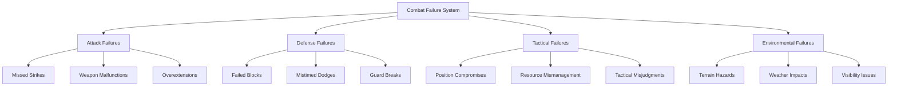

**Key Principles:**
- **Skill-Appropriate Failure:** Even skilled fighters make mistakes
- **Realistic Consequences:** Failures have appropriate physical impacts
- **Recovery Opportunities:** Most failures offer chances to recover or adapt
- **Narrative Integration:** Failures enhance the story rather than simply punishing
- **Learning Curve:** Repeated similar failures become less likely as character gains experience

#### 2.3.1 Combat Failure Types

**Attack Failures:**
- **Missed Strikes:** Attacks that fail to connect, leaving you off-balance or exposed
- **Weapon Malfunctions:** Bowstrings snap, blades dull, spell components fizzle
- **Overextensions:** Committing too much to an attack, leaving defenses compromised
- **Timing Issues:** Striking too early or too late, missing the optimal window
- **Target Adaptation:** Enemies learn your patterns and develop countermeasures

**Defense Failures:**
- **Failed Blocks:** Attempts to parry or block that don't stop incoming damage
- **Mistimed Dodges:** Evading too early or too late, moving into attacks instead of away
- **Guard Breaks:** Defenses overwhelmed by powerful strikes or sustained pressure
- **Stamina Depletion:** Becoming too exhausted to maintain defensive posture
- **Tunnel Vision:** Focusing too much on one threat and missing others

**Tactical Failures:**
- **Position Compromises:** Ending up in disadvantageous terrain or formations
- **Resource Mismanagement:** Depleting stamina, ammunition, or spell components
- **Misread Intentions:** Preparing for the wrong enemy tactic
- **Friendly Interference:** Allies disrupting planned maneuvers or creating hazards
- **Target Prioritization Errors:** Focusing on less threatening enemies

**Environmental Failures:**
- **Terrain Hazards:** Slipping on wet ground, tripping on roots or debris
- **Weather Impacts:** Wind affecting projectiles, rain reducing visibility
- **Visibility Issues:** Smoke, fog, darkness, or glare interfering with perception
- **Space Limitations:** Restricted movement in tight quarters or crowded areas
- **Environmental Interactions:** Collateral damage creating new obstacles

#### 2.3.2 Context-Based Failure Assessment

When determining combat failures, the system considers:

- **Character's Combat Expertise:** Higher skill reduces but doesn't eliminate failure chance
- **Equipment Quality and Condition:** Better gear reduces malfunction chance
- **Environmental Factors:** Weather, terrain, lighting affect performance
- **Physical Condition:** Injuries, fatigue, and status effects impact capabilities
- **Previous Actions:** Recent successes slightly increase failure chance
- **Preparation Quality:** Planning and positioning improve outcome chances
- **Hard Mode Status:** Stricter standards apply when activated

**Example Assessment:**
```
[Attack Assessment - Hidden]
• Character Skill: Advanced swordsman (+)
• Weapon Quality: Well-maintained blade (+)
• Environmental Factor: Slippery deck during ship battle (-)
• Physical Condition: Minor shoulder wound from earlier (-)
• Previous Actions: Three successful attacks in a row (-)
• Preparation: Specifically trained against this enemy type (+)
• Hard Mode: Not active
• Net Assessment: Moderate failure chance (25%)

[Result - Minor Failure]
You swing your blade with practiced precision, but as you step forward, your boot slides slightly on the rain-slick deck. Your attack still lands, but with far less force than intended, glancing off the pirate's leather armor instead of cutting through it. The unexpected resistance throws off your rhythm, forcing you to take an extra moment to recover your stance.
```

#### 2.3.3 Escalating Combat Consequences

The failure system creates a progression of consequences:

1. **Warning Signs:** Minor issues that foreshadow potential problems
2. **Minor Setbacks:** Small failures with minimal impact
3. **Significant Complications:** Problems that require tactical adjustment
4. **Major Failures:** Serious consequences requiring immediate response
5. **Critical Disasters:** Catastrophic outcomes with lasting impact

**Example Progression:**
```
[Warning Sign]
Your blade feels slightly off-balance as you swing, a subtle indication that something isn't quite right.

[Minor Setback]
Your attack lands awkwardly, dealing less damage than expected and forcing you to briefly adjust your grip.

[Significant Complication]
Your blade strikes an unexpected piece of armor, jarring your arm and throwing you momentarily off-balance. Your next action will be at disadvantage.

[Major Failure]
Your attack goes wide, and the momentum spins you out of position. You stumble, exposing your flank to your opponent, who immediately capitalizes on your mistake.

[Critical Disaster]
Your attack fails catastrophically as your blade catches on your opponent's armor and snaps at the hilt. The force of the break sends you stumbling backward, now weaponless and vulnerable.
```

## 3.0 Core Combat Philosophy

Combat in Vantiel transcends mere hit-point exchanges. It's a narrative dance of tactics, moral choices, and emotional consequences. Whether dueling a bandit, facing a multi-phase demon boss, or leading a large-scale faction war, battles reveal who you are—shaping your reputation and forging unbreakable (or breakable) bonds with companions.

Each decision matters and can turn the tide of battle. This system emphasizes dynamic, cinematic combat with real-time status tracking and meaningful choices. Combat is executed action by action, ensuring complete player agency at every moment.

## 4.0 Combat Flow
“Every player action in combat must be narrated as a full cinematic beat — including inner thought, tension, sensory detail, and visible momentum shifts.”
“Never resolve multiple rounds in one output unless explicitly requested.”

### 4.1 Combat Initiation
Set up the initial statuses for both player and enemy:

**Before combat begins, build scene tension: describe positions, expressions, terrain, and air pressure. This is a duel of narrative weight, not just numbers.**

```
[Your Status]
HP: 100/100
Stamina: 100/100
Stance: Neutral
Guard: Ready

[Enemy Status]
HP: 100/100
Stamina: 100/100
Stance: Aggressive
Intent: Hostile
```

### 4.2 Initiative System

```
ROLL 1d20 + (SPD Modifier)
```
- **Critical (Nat 20)**: Gains an **extra action** on the first turn.
- **Fumble (Nat 1)**: Lose your first turn, or act last.
- **Companions Roll Separately**: Allows for synergy or chaotic turn orders if you have multiple party members.

### 4.3 Combat Phases

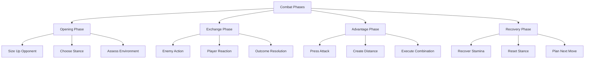

- **Opening Phase:**
  - Size up your opponent
  - Choose your initial stance
  - Assess the environment
  - Plan your first move
  - Check your surroundings

- **Exchange Phase:**
  A typical exchange might look like:
  ```
  > Enemy lunges with a straight punch!
  Quick Reactions Available:
  1. Slip and counter
  2. Block and return
  3. Duck and weave
  4. Step back

  [Choice 1 Selected]
  - You slip to the outside! (-2 Stamina)
  - Perfect counter position!
  - Right cross lands clean! (-8 HP to Enemy)
  - They stagger slightly...
  ```

- **Advantage Phase:**
  When the enemy is staggered, you have special options:
  - Press the attack
  - Create distance
  - Clinch and control
  - Execute a combination

- **Recovery Phase:**
  - Catch your breath (+5 Stamina)
  - Reset your stance
  - Reassess the situation
  - Check your surroundings
  - Plan your next move

### 4.4 Status Tracking

**Core Stats:**
- **HP (Health Points)**
- **Stamina (Energy)**
- **Focus (Combat Awareness)**
- **Balance (Stability)**
- **Guard (Defense)**

**Status Effects:**
- **Staggered:** –50% Defense
- **Winded:** –50% Stamina Regeneration
- **Bloodied:** –2 HP per turn
- **Dazed:** –30% Accuracy
- **Guard Broken:** No blocking available
- **Burning**: Ongoing HP drain, potential gear damage
- **Poisoned**: Gradual HP loss, attribute penalty
- **Fear**: Lower accuracy or SPD due to trembling
- **Bleeding**: HP drain until stanched

### 4.5 Damage Calculation

1. **Base Damage** + Weapon/Spell Mods
2. **Critical Hit**: Typically **double damage**
3. **Defense Reduction**: Subtract **armor** or relevant stat from incoming damage
4. **Status Effects**: Add burn, poison, bleed, etc., for extra ongoing damage or attribute debuffs

## 5.0 Combat Styles & Martial Arts Systems

### 5.1 Boxing

**Stance Options:**
- Orthodox (Right hand rear)
- Southpaw (Left hand rear)
- Philly Shell (Shoulder roll)
- Peek-a-boo (High guard)

**Basic Strikes:**
- **Jab:** (-1 Stamina; fast, sets up combos, tests distance)
- **Cross:** (-2 Stamina; powerful, counter strike, combo finisher)
- **Hook:** (-3 Stamina; heavy, circular punch targeting head/body)
- **Uppercut:** (-3 Stamina; vertical strike, guard breaker)

**Advanced Techniques:**
- Pull Counter (Dodge + Cross)
- Slip Jab (Slip + Lead hook)
- Rolling Thunder (Shell + Hook)
- Dempsey Roll (Weave + Hook chain)
- Liver Shot (Body hook setup)
- Check Hook (Pivot + Hook)

**Sample Boxing Combinations:**
1. **Classic 1-2:**
   - Jab to blind (-1 Stamina)
   - Cross to damage (-2 Stamina)
   - *Total:* –3 Stamina, High Speed

2. **Hook-Cross:**
   - Lead hook to stagger (-3 Stamina)
   - Cross to finish (-2 Stamina)
   - *Total:* –5 Stamina, High Damage

3. **Body Snatcher:**
   - Jab high to distract (-1 Stamina)
   - Hook to body (-3 Stamina)
   - Uppercut finish (-3 Stamina)
   - *Total:* –7 Stamina, potential Guard Break

4. **Four-Piece:**
   - Jab to face (-1 Stamina)
   - Cross counter (-2 Stamina)
   - Hook to body (-3 Stamina)
   - Hook to head (-3 Stamina)
   - *Total:* –9 Stamina, Knockout Potential

### 5.2 Traditional Martial Arts

**Systems Include:**
- **Karate:** Techniques such as Front Kick (Mae Geri), Side Kick (Yoko Geri), Roundhouse (Mawashi Geri), Back Fist (Uraken), Ridge Hand (Haito), Spear Hand (Nukite).
- **Kung Fu:** Techniques like Wing Chun Chain Punches, Crane Strikes, Tiger Claw, Snake Strike, Dragon Sweep, Monkey Stance.
- **Muay Thai:** Arsenal includes Teep (Push Kick), Round Kick (High/Low), Flying Knee, Spinning Elbow, Clinch Knee, Leg Kick.
- **Capoeira:** Movements such as Ginga, Meia Lua, Au Batido, Armada, Macaco, and Negativa.

### 5.3 Comparative Overview: Bujinkan & Hoshinjutsu

**Bujinkan Budo Taijutsu:**
- Draws from nine classical Japanese warrior traditions (ryuha)
- Emphasizes natural movement, adaptability, and efficient combat strategy
- Utilizes the Godai (five-element) movement model

**Hoshinjutsu (Hoshin Budo Ryu):**
- Developed by Dr. Glenn J. Morris and refined by Soke Rob Williams
- Integrates internal energy cultivation (Chi Kung), combat psychology, situational awareness, and healing arts
- Employs a Five-Fold Strategic Framework:
  1. Universal Guard
  2. Distance-Appropriate Weapons
  3. Continual and Returning Fist
  4. Wedging In
  5. Finish

Both systems encourage a warrior's mindset, resilience, and strategic thinking—Bujinkan is rooted in historical strategy, while Hoshinjutsu fuses traditional techniques with modern self-defense and internal development.

### 5.4 Wrestling & Grappling

**Takedown System:**
- **Single Leg:** (-2 Stamina; ankle pick, high crotch, running single)
- **Double Leg:** (-3 Stamina; blast double, trip finish, power double)
- **Body Lock:** (-2 Stamina; inside trip, outside trip, suplex)
- **Foot Sweeps:** (-1 Stamina; front, side, or rear sweep)

**Ground Positions:**
- **Guard:** Closed, Open, Butterfly guard
- **Mount:** High mount, Low mount, Technical mount
- **Side Control:** North-south, Knee on belly, Cross side
- **Back Control:** Body triangle, Hooks in, Rear mount

**Submission Chain:**
1. **Arm Attacks:** Armbar, Kimura, Americana
2. **Leg Attacks:** Heel hook, Knee bar, Ankle lock
3. **Chokes:** Rear naked, Triangle, Guillotine

**Grappling Moves:**
- Clinch Control, Takedown Attempt, Ground Control, Submission Hold
- Position Control: Standing, Clinch, Ground Top, Ground Bottom

### 5.5 Street Fighting & Bar Brawls

**Dirty Boxing:**
- **Quick Strikes:**
  - Headbutt (-2 Stamina; close range, dazes)
  - Eye Gouge (-1 Stamina; reduces accuracy, sets up combos)
  - Groin Strike (-1 Stamina; debuffs movement, breaks guard)
  - Throat Strike (-2 Stamina; damages stamina, impairs breathing)
  - Bite Attack (-1 Stamina; for clinch only, causes bleed)
- **Dirty Tactics:**
  - Sand Throw (to blind and create distance)
  - Fake Surrender (to lower guard and set up a sucker punch)
  - Playing Hurt (to bait aggression and counter)

**Bar Room Brawling:**
- **Environment Moves:**
  1. **Bottle Techniques:** (-2 Stamina; can use as a weapon or defense)
  2. **Chair Fighting:** (-3 Stamina; swings, blocks, throws, or trips)
  3. **Table Combat:** (-4 Stamina; slams, uses as cover, flips for distance)
  4. **Bar Counter Moves:** (-3 Stamina; vaults, slams, pins, or grabs bottles)
  5. **Pool Table Options:** (using cues, balls for positioning and damage)
- **Cinematic Sequences:**
  - Bar Slide, Bottle Break, Chair Smash, Window Throw
- **Environmental Hazards:**
  - Broken glass (bleed damage), wet floor (slip chance), low ceiling (jump limits), tight spaces, sharp corners (extra damage)

**Improvised Weapons:**
- **Common Items:**
  - Pool Cue, Beer Mug, Bar Stool, Dart Board Darts, Kitchen Items
- **Weapon Properties:**
  - Durability, Damage Type (blunt/sharp), Range, Special Effects (bleed/stun), Break Effects

## 6.0 Advanced Combat Mechanics

### 6.1 Momentum System

```mermaid
flowchart TD
    A[Momentum System] --> B[Momentum Acquisition]
    A --> C[Momentum Mechanics]
    A --> D[Momentum Thresholds]
    A --> E[Momentum Moves]
    A --> F[Momentum Loss]

    B --> B1[Successful Attacks]
    B --> B2[Taunts & Banter]
    B --> B3[Environmental Leverage]
    B --> B4[Special Conditions]

    C --> C1[Momentum Bar]
    C --> C2[Accumulation Rate]
    C --> C3[Strategic Management]

    D --> D1[Tier 1: Building]
    D --> D2[Tier 2: Flowing]
    D --> D3[Tier 3: Overwhelming]

    E --> E1[Finishing Moves]
    E --> E2[Special Techniques]
    E --> E3[Tactical Advantages]

    F --> F1[Failed Actions]
    F --> F2[Enemy Counters]
    F --> F3[Environmental Obstacles]
    F --> F4[Time Delay]
```

#### 6.1.1 Momentum Acquisition

Momentum represents combat flow, tactical advantage, and psychological dominance:

**Core Building Actions**
- **Successful Basic Attacks**: +5-15 Momentum depending on attack quality
- **Perfect Dodges/Parries**: +10 Momentum for perfectly timed defensive maneuvers
- **Critical Hits**: +20 Momentum for landing critical damage
- **Combo Chains**: +5 Momentum per hit in an unbroken combo chain
- **Environmental Interactions**: +10 Momentum for creative use of surroundings

**Strategic Momentum Sources**
- **Combat Banter**: +5 Momentum for successful intimidation or taunt
- **Target Vulnerabilities**: +10 Momentum for exploiting known weaknesses
- **Formation Advantages**: +5-15 Momentum for optimal tactical positioning
- **Counter Attacks**: +15 Momentum for successful counterattacks after dodges

**Class-Specific Momentum Generators**
- **Hero**: Gains momentum from inspiring allies or demonstrating courage
- **Shadowblade**: Builds momentum through stealth attacks and quick strikes
- **Voidcaller**: Accumulates momentum by channeling void energy effectively
- **Saint of Nature**: Generates momentum by harmonizing with natural surroundings

#### 6.1.2 Momentum Mechanics

**Momentum Bar**: A visible indicator ranging from 0-100 points

**Accumulation Rates**
- Standard Combat: 5-15 points per successful action
- Critical Moments: 15-25 points for exceptional maneuvers
- Hard Mode: Reduced gain rate (approximately 75% of standard)

**Decay Mechanics**
- Passive Decay: -5 points every 3 seconds of inaction
- Failed Actions: -10 to -25 points depending on severity
- Enemy Counters: -15 points when successfully countered
- Complete Reset: Momentum returns to 0 after being knocked down

**Status Display Example**
```
[Momentum: |||||||||| 50/100]
Status: FLOWING
Available Moves: Whirlwind Strike, Combat Focus, Tactical Advance
```

#### 6.1.3 Momentum Thresholds

Momentum unlocks abilities at different thresholds:

**Tier 1: Building (1-33)**
- Basic momentum moves available
- Slight combat advantages
- Minor status effects on hits
- Small positioning bonuses

**Tier 2: Flowing (34-66)**
- Intermediate momentum techniques
- Moderate damage bonuses
- Increased critical hit chance
- Enhanced movement options
- Intimidation effects on enemies

**Tier 3: Overwhelming (67-100)**
- Advanced momentum techniques
- Major damage amplification
- Finishing move access
- Significant tactical advantages
- Potential for enemy morale breaks

#### 6.1.4 Momentum-Based Moves

Special attacks and abilities unlocked at different momentum levels:

**Tier 1 Techniques (1-33)**
- **Combat Focus** (-10 Momentum): +2 to next attack roll
- **Tactical Step** (-15 Momentum): Additional movement action
- **Feint** (-20 Momentum): Force opponent to waste a defensive reaction
- **Quick Recovery** (-25 Momentum): Instantly recover 5 Stamina

**Tier 2 Techniques (34-66)**
- **Whirlwind Strike** (-35 Momentum): Attack all adjacent enemies
- **Pressure Point** (-40 Momentum): Temporarily reduce target's Defense
- **Combat Surge** (-45 Momentum): +3 to all rolls for next 3 turns
- **Precise Strike** (-50 Momentum): Guaranteed critical hit with main weapon

**Tier 3 Techniques (67-100)**
- **Finishing Move** (-70 Momentum): Powerful cinematic attack with massive damage
- **Heroic Moment** (-80 Momentum): Cancel enemy's next action completely
- **Battle Trance** (-90 Momentum): Half stamina costs for next 5 actions
- **Ultimate Technique** (-100 Momentum): Unique character-specific ultimate ability

#### 6.1.5 Class-Specific Ultimate Techniques

**Hero**
- **Rallying Cry** (-100 Momentum): All allies gain +20 Momentum and +10 temporary HP
- **Requirements**: Must have at least one ally in combat
- **Visual Effect**: Golden aura surrounds the hero as they raise their weapon skyward

**Voidcaller**
- **Reality Fracture** (-100 Momentum): Create three shadow duplicates that each perform a free attack
- **Requirements**: Must have used at least three different void abilities in combat
- **Visual Effect**: The voidcaller's form splits into multiple shadowy versions that attack simultaneously

**Saint of Nature**
- **Nature's Wrath** (-100 Momentum): Summon vines, roots, and natural elements to immobilize all enemies for 3 turns
- **Requirements**: Must be in contact with natural ground
- **Visual Effect**: Glowing green energy pulses outward as the environment responds to the saint's call

**Shadowblade**
- **Thousand Cuts** (-100 Momentum): Perform a lightning-fast sequence of 10 rapid strikes
- **Requirements**: Must have successfully landed a stealth attack during the battle
- **Visual Effect**: The shadowblade becomes a blur of motion, striking from multiple angles in an instant

### 6.2 Tactical Coordination Framework

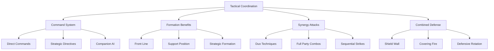

#### 6.2.1 Command System

Issue tactical directives to companions in real-time:

**Direct Command Format**
```
[Command: <Companion Name> + <Action>]
Example: [Command: Lyra + Focus Fire on Mage]
```

**Command Types**
- **Target Focus**: Direct attacks toward specific enemies
- **Tactical Position**: Assign optimal battlefield positions
- **Action Priority**: Set preference for attack, defense, or support
- **Resource Management**: Guide use of limited resources
- **Special Ability Usage**: Request specific abilities or techniques

**Strategic Directives**
- **Aggressive Stance**: Prioritize damage output over personal safety
- **Defensive Formation**: Focus on protection and survivability
- **Support Priority**: Emphasize healing and buffing
- **Conserve Resources**: Limit use of special abilities and items
- **All Out**: Use resources freely for maximum immediate effect

**Companion AI Learning**
- Companions remember successful tactics
- Preferred strategies become default behaviors
- Combat history affects suggested actions
- Relationship level improves command response time
- Trust level affects initiative in suggesting tactics

#### 6.2.2 Formation Benefits

Tactical positioning provides significant advantages:

**Front Line Formation**
- **Vanguard**: Tanks absorb damage, drawing aggression
- **Pincer**: Fighters flank enemies for damage bonuses
- **Wedge**: Breakthrough formation to split enemy groups
- **Staggered Front**: Balanced defense with counterattack opportunities
- **Battle Line**: Coordinated defense against charging enemies

**Support Formation**
- **Protected Caster**: Ranged attackers behind defensive line
- **Elevated Position**: Archers/mages on high ground
- **Bodyguard**: High-value units paired with defenders
- **Mobile Support**: Healers positioned for quick access to all allies
- **Reserve Force**: Secondary line ready to exploit openings

**Strategic Formation**
- **Ambush Position**: Units hidden for surprise attacks
- **Defensive Perimeter**: 360-degree protection while resting or planning
- **Tactical Retreat**: Coordinated withdrawal to better position
- **Resource Line**: Formation optimized for quick item/resource sharing
- **Scout Pattern**: Spread formation maximizing area awareness

**Formation Bonuses**
- **Optimal Formation**: +2 to all relevant combat rolls
- **Terrain Advantage**: +3 to specific actions suited to position
- **Preparation Bonus**: +5 for pre-planned formations
- **Hard Mode Penalties**: Reduced bonuses and increased difficulty maintaining formations

#### 6.2.3 Synergy Attacks

Combined attacks with companions for devastating effects:

**Duo Techniques**
These powerful combinations require specific companion pairings and sufficient relationship levels:

- **Shield and Spear** (Tank + DPS)
  - **Effect**: Tank creates opening, DPS exploits for massive damage
  - **Requirements**: Tank successfully blocks attack, DPS has 50+ Stamina
  - **Animation**: Tank knocks enemy off-balance, DPS delivers precision strike
  - **Bonus**: 2x normal damage + stagger effect

- **Arcane Conduit** (Mage + Mage)
  - **Effect**: Combined spell with amplified effects
  - **Requirements**: Both mages must have 30%+ mana remaining
  - **Animation**: Energy channels between mages before unleashing combined spell
  - **Bonus**: 3x normal spell effect area + secondary effect

- **Surgical Strike** (Rogue + Support)
  - **Effect**: Precision attack on vital point with enhanced effects
  - **Requirements**: Rogue must be in stealth or flanking position
  - **Animation**: Support creates distraction, Rogue strikes vulnerable point
  - **Bonus**: 100% critical chance + bleeding effect

**Full Party Combinations**
These ultimate techniques require all party members and high affinity:

- **Overwhelming Assault** (Full Party)
  - **Effect**: Coordinated attack sequence hitting all enemies
  - **Requirements**: All party members above 30% HP, 70+ group affinity
  - **Animation**: Time slows as each party member executes their part of the sequence
  - **Bonus**: Each enemy takes damage from every party member with cumulative stagger

- **Unbreakable Bulwark** (Full Party)
  - **Effect**: Impenetrable defensive formation
  - **Requirements**: All party members adjacent, 60+ group affinity
  - **Animation**: Party forms defensive circle with weapons/shields outward
  - **Bonus**: 75% damage reduction for one full round

- **Elemental Convergence** (Full Party with Casters)
  - **Effect**: Combined elemental assault
  - **Requirements**: At least one magic user in party, 80+ group affinity
  - **Animation**: Elements swirl around party before focusing into unified blast
  - **Bonus**: Area effect damage with multiple status effects

**Specific Companion Synergies**
Each companion has unique combination attacks with the player:

**Examples:**
- **Daichi + Player**: "Blade Tempest" - synchronized sword strikes creating whirlwind effect
- **Lyra + Player**: "Arcane Infusion" - Player's weapon temporarily enchanted with Lyra's magic
- **Kaine + Player**: "Hunting Pack" - coordinated predatory attack pattern with bonus critical chance
- **Aria + Player**: "Divine Judgment" - sacred power channels through both attackers for holy damage

### 6.3 Environmental Interaction

- **Example Location:** Tavern
- **Interactive Elements:** Tables (for cover/throw), Chairs (as weapons/throwables), Bar (vault/slam), Bottles (break/throw), Stairs (for high ground), Windows (for break/escape)

**Environmental Advantage Examples:**
- **Chandelier Swing**: Drop onto enemies from above (+5 damage, potential stun)
- **Oil Lamp Break**: Create fire hazard (DOT damage zone)
- **Bookshelf Topple**: Area denial and potential damage
- **Water Puddle + Lightning**: Conduct electrical damage to multiple targets
- **Sand Throw**: Temporary blindness allowing tactical repositioning

### 6.4 Dice Rolls in Combat

Player choices in battle that require dice rolls:

```
ROLL 1d20 + (Relevant Attribute Modifier) vs DC
```

- **Example**:
  - Grapple an opponent → STR-based
  - Dodge an arrow → SPD-based
  - Charm a foe mid-combat → CHA-based

**Success** or **failure** can drastically alter the flow of battle, from forcing an opponent prone to incurring a punitive attack.

**Combat Modifiers:**
- **Environment**
  - High Ground: +2 Attack
  - Poor Visibility: -2 Accuracy
  - Difficult Terrain: -2 SPD
- **Status**
  - Wounded: -2 to all rolls
  - Blessed: +2 to all rolls
  - Exhausted: -1 to all rolls

### 6.5 Wounds & Healing

- **Wounds & Ailments**
  - **Poison**: Ongoing HP drain
  - **Burns**: Lower defense or SPD
  - **Broken Bones**: Movement reduced, STR checks penalized
  - **Healing Isn't Instant**: Potions help, but severe wounds might need specialized care or rest.

- **Lingering Scars & Trauma**
  - **Physical Scars**: NPCs notice your scars, might comment or fear you.
  - **Mental Trauma**: Recurrent nightmares, slight morale penalties if not treated.
  - **Memory Threads**: Record major injuries, influencing future dialogues and your own psychological arcs.

- **Healing Methods**
  - **Potions & Herbs**: Minor potions restore some HP, rarer brews cure specific conditions
  - **Spell Variations**: Instant healing or slow channeling spells (risk interruption)
  - **Rest & Camping**: Sleep recovers HP, helps treat basic injuries
  - **Skilled Healers & Shrines**: High-level injuries or curses may require specialized NPC menders

## 7.0 Cinematic Elements

### 7.1 Special Moves
**Requirements:**
- Advantage state
- Sufficient stamina
- Correct position
- Appropriate conditions

**Example:**
_Flying Knee KO_
- Run toward a staggered enemy
- Jump for a knee strike
- Slow the camera for dramatic effect
- Zoom on impact as the enemy is sent flying

### 7.2 Finishing Moves
**Conditions:**
- Enemy below 20% HP
- You above 30% Stamina
- Correct position and no interruptions

**Types:**
1. Submission Finish
2. Knockout Blow
3. Environmental KO
4. Multi-hit Finale
5. Special Technique
6. Named Ultimate Technique

### 7.3 Narrative Cinematography

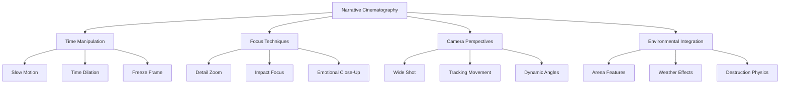

**Time Manipulation Language:**
- **Slow Motion:** "Time seems to stretch as you launch your attack. Each heartbeat feels like an eternity..."
- **Time Dilation:** "In that critical moment, your perception sharpens. The world slows to a crawl around you..."
- **Freeze Frame:** "For a heartbeat, everything stops—your blade buried in his shoulder, his face contorted in shock..."

**Focus Techniques:**
- **Detail Zoom:** "You can see every detail of the orc's face—the yellowed tusks, the constellation of old scars..."
- **Impact Focus:** "At the moment of impact, all attention narrows to where steel meets flesh with a sound that cuts through the din..."
- **Emotional Close-Up:** "His eyes widen in disbelief as he recognizes the technique—one he thought lost to time..."

**Camera Perspectives:**
- **Wide Shot:** "The marketplace erupts into chaos as bandits pour from the alleyways. Through it all, you stand poised..."
- **Tracking Movement:** "Your blade traces a silver arc through the air, sunlight glinting along its edge as you move..."
- **Dynamic Angles:** "From below, your opponent looms like a mountain. From above, you see the fatal flaw in his stance..."

**Environmental Integration:**
- **Arena Features:** "The ancient pillars stand witness to your battle, casting long shadows across the marble floor..."
- **Weather Effects:** "Lightning illuminates the battlefield in strobing flashes, turning the rain-soaked combat into a series of frozen moments..."
- **Destruction Physics:** "Your impact sends cracks spider-webbing across the stone floor, dust and fragments rising in slow motion..."

## 8.0 Multi-Opponent Combat

### 8.1 Group Fight Mechanics
- **Awareness System:**
  - Front Arc: Full defense
  - Side Arc: Partial defense
  - Rear Arc: No defense
- **Position Tracking:**
  - Ideal: Center position
  - Safer: Back to a wall
  - Always: Watch all angles and create space

### 8.2 Crowd Control
**Tactics:**
- Use enemies as shields
- Create bottlenecks
- Control space
- Maintain mobility
- Select targets strategically

### 8.3 Companion Coordination

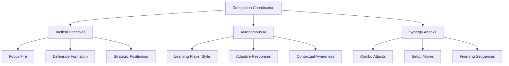

**Tactical Directives:**
- "Focus on defense!"
- "Take out the caster!"
- "Protect the wounded!"
- "Cover the exit!"
- "Hold this position!"

**Autonomous AI:**
- Companions learn your combat style over time
- An Archer might automatically pin enemies you flank
- A Healer might preemptively buff your SPD before a difficult encounter
- A Tank might position to draw attention from wounded allies

**Synergy Attacks:**
- Combined attacks with companions for increased damage
- Setup moves that create openings for allies
- Defensive formations that maximize protection
- Environmental manipulation to create tactical advantages

## 9.0 Stealth System

### 9.1 Core Stealth Mechanics
**Stealth Stats:**
- Detection Risk (0–100%)
- Noise Level (0–100%)
- Shadow Cover (0–100%)
- Movement Speed (Walk/Crouch/Crawl)
- Line of Sight (Visible/Hidden)

**Status Display Example:**
```
[Stealth Status]
Detection: 15%
Noise: 20%
Cover: 85%
Speed: Crouch
Visibility: Hidden
```

### 9.2 Movement Types
1. **Silent Walk:** (-5% Detection; normal speed, moderate noise)
2. **Crouch Walk:** (-15% Detection; reduced speed, low noise)
3. **Shadow Crawl:** (-25% Detection; slowest, minimal noise)
4. **Wall Hug:** (-10% Detection; normal speed with cover benefits)

*Modifiers include surface type, footwear, equipment load, stealth training, and perks.*

### 9.3 Detection System
- **Vision Mechanics:** Direct line of sight, peripheral vision, darkness levels, movement detection, cover analysis
- **Guard Behavior:**
  1. Unaware (standard patrol and timing)
  2. Suspicious (investigates sounds, irregular patrols)
  3. Alerted (active search, calls for backup)
- **Detection Zones:**
  - Safe (Green), Caution (Yellow), Danger (Red)

### 9.4 Stealth Actions
- **Basic:** Peek around corners, hold breath, quick step, roll move, shadow merge
- **Advanced:**
  1. Distraction Throws (create noise, lure guards)
  2. Silent Takedowns (approach from behind, quick execution)
  3. Shadow Kill (instant elimination with no trace)
  4. Environmental Kills (using surroundings for an "accidental" setup)

### 9.5 Equipment & Tools
- **Stealth Gear:**
  - Dark Clothing (-10% Detection)
  - Soft Shoes (-15% Noise)
  - Face Cover (-5% Detection)
  - Gloves (no prints)
  - Cloaks (blend bonus)
- **Tools:**
  1. Smoke Bombs (create cover, escape tool)
  2. Noise Makers (distract guards)
  3. Caltrops (slow pursuit, area denial)
  4. Grappling Hook (vertical access, quick escape)

### 9.6 Environment Interaction for Stealth
- **Stealth Elements:** Shadows, bushes, hay bales, water (for masking sound), crowds
- **Interactive Objects:**
  1. Light Sources (extinguish to create shadows)
  2. Sound Sources (create distractions)
  3. Environmental Hazards (cause "accidents" or block paths)

### 9.7 Advanced Stealth Systems
- **Combo Mechanics:** Chain Assassination (multiple targets, quick execution)
- **Special Abilities (Fantasy Only):**
  - Shadow Step (short teleport)
  - Time Freeze (brief pause)
  - Mind Cloud (guard confusion)
  - Perfect Disguise (blend in)
  - Void Walk (true invisibility)

### 9.8 Social Stealth
- **Blending Mechanics:**
  1. Crowd Navigation (match pace, follow flow, maintain distance)
  2. Social Groups (join conversations, act natural)
  3. Role Playing (disguise as a guard, servant, noble, or merchant)
  4. Activity Blending (pretend to shop, read a newspaper, etc.)
- **Social Actions:** Small talk, bribe guards, blend with the crowd, create a diversion, switch roles
- **Cover Breaking:** Avoid suspicious behavior, class mismatches, or breaking character

### 9.9 Advanced Infiltration
- **Preparation Phase:**
  - Gather intel (guard patterns, access points, security systems)
- **Equipment Selection:**
  - Mission-specific gear, backup tools, emergency items
- **Timing Planning:**
  - Consider guard shifts, event windows, weather factors
- **Execution Methods:**
  1. Ghost Protocol (no traces, zero witnesses)
  2. Accident Maker (environmental kills, misdirection)
  3. Infiltrator Elite (social stealth with technical bypass)
  4. Shadow Assassin (silent kills, body disposal, trace cleanup)
- **Risk Management:** Multiple escape routes, contingency plans, and emergency protocols

### 9.10 Stealth Scenarios
**Mission Types:**
1. **Infiltration:** Enter undetected, accomplish the goal, and exit cleanly
2. **Assassination:** Study the target, plan the approach, execute a clean elimination
3. **Theft:** Identify security, create an opening, extract without trace
4. **Sabotage:** Analyze systems, find weaknesses, plant devices and frame others
5. **Intelligence:** Observe, gather intel, plant bugs or copy documents
6. **Rescue:** Locate a subject, create a distraction, secure extraction

**Special Conditions:** Time limits, no-kill rules, perfect stealth requirements, social stealth only, zero evidence, and multiple objectives

## 10.0 Multi-Phase Boss System

### 10.1 Phase Transition Framework

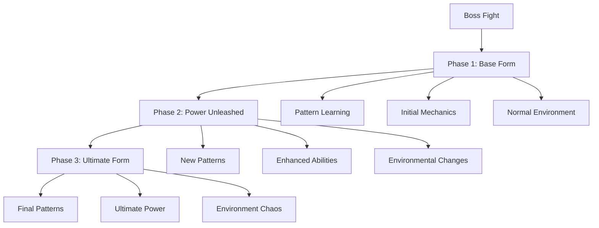

**Core Phase Structure:**
- **Phase 1: Base Form (100–70% HP):**
  Basic attack patterns, standard mechanics, learning phase, normal environment.

- **Phase 2: Power Unleashed (69–40% HP):**
  Enhanced patterns, new mechanics, environmental changes, power increase, special abilities.

- **Phase 3: Ultimate Form (39–0% HP):**
  Final patterns, ultimate mechanics, chaotic environment, maximum power, desperation moves.

### 10.2 Class-Based Boss Phase Shifts

Different player classes experience unique boss phase transitions:

- **Voidcaller**
  - Bosses **unravel reality** around you, spawning anomalies or illusions.
  - Phase transitions may involve void rifts or dimensional shifts
  - Special counter opportunities based on void manipulation

- **Hero**
  - Bosses might taunt you to fight alone, offering **Legacy Boost** if you accept and succeed.
  - Phase transitions often involve dramatic power-ups or legendary weapon reveals
  - Special counter opportunities based on heroic resolve

- **Saint of Nature**
  - Certain nature bosses use your own spells against you, entangling or neutralizing your regrowth abilities.
  - Phase transitions may involve corruption of natural elements or purification challenges
  - Special counter opportunities based on nature harmony

### 10.3 World-Specific Boss Adaptations

- **Stone World Boss:**
  Phase 1: Scientific challenge (pattern analysis, weakness discovery)
  Phase 2: Chemical reaction (environmental hazards, chemical attacks)
  Phase 3: Scientific breakthrough (formula mastery, precise timing)

- **Modern World Boss:**
  Phase 1: Urban combat (cover, resource management, tactical positioning)
  Phase 2: Infrastructure chaos (building damage, power outages, vehicle hazards)
  Phase 3: City-wide crisis (multiple threats, time pressure, final solution)

- **Historical World Boss:**
  Phase 1: Traditional combat (martial prowess, honor rules)
  Phase 2: Ancient power (hidden techniques, sacred weapons)
  Phase 3: Legendary form (ultimate technique, divine intervention)

- **Horror World Boss:**
  Phase 1: Psychological horror (tension, subtle threats)
  Phase 2: Manifestation (physical form, reality distortion)
  Phase 3: Cosmic horror (mind-bending attacks, existential threat)

### 10.4 Boss Mechanics Integration
- **Health Tracking:** Phase transition points, status indicators, damage thresholds
- **Environmental Integration:** Phase-specific changes, hazard creation, arena modifications
- **Pattern Recognition:** Attack sequences, defense openings, trigger points for transitions
- **Puzzle Elements:** Some bosses can't be harmed until a certain totem is destroyed or a chant is interrupted

### 10.5 Victory Conditions & Rewards
- **Standard Victory:** Deplete boss HP, survive all phases, complete objectives
- **Special Conditions:** Time limits, perfect execution, resource management
- **Rewards:** Phase-specific drops, unique resources, skill unlocks, story progression
- **Memory Threads:** Log boss kills, shaping how NPCs regard you ("Slayer of the Storm Wyrm")

## 11.0 Monster Subjugation System
Rules for monster encounters and combat:

### 11.1 Base Success Determination
Core roll components:
- Base roll (d20)
- Skill modifiers (+1 to +5)
- Equipment bonus (+1 to +3)
- Class abilities (+1 to +5)
- Party synergy (+1 per member)
- Preparation bonus (+1 to +3)

### 11.2 Rank Scaling System
Modifiers based on rank difference:
- Same Rank: Standard DC
- 1 Rank Higher: +5 DC, -2 to all rolls
- 2 Ranks Higher: +8 DC, -4 to all rolls, disadvantage
- 3+ Ranks Higher: Automatic failure unless special conditions met
- 1 Rank Lower: -2 DC, +1 to all rolls
- 2 Ranks Lower: -4 DC, +2 to all rolls
- 3+ Ranks Lower: Automatic success with style

### 11.3 Base Difficulty Classes (DC)
Starting point before rank modifiers:
- E-Rank: DC 12 (Beginner threats)
- D-Rank: DC 15 (Advanced threats)
- C-Rank: DC 18 (Expert threats)
- B-Rank: DC 22 (Elite threats)
- A-Rank: DC 25 (Master threats)
- S-Rank: DC 30 (Legendary threats)

### 11.4 Rank-Based Bonuses
Additional benefits by rank:
- E-Rank: None (baseline)
- D-Rank: +1 to all combat rolls
- C-Rank: +2 to all combat rolls, advantage vs E-rank
- B-Rank: +3 to all combat rolls, advantage vs D-rank and below
- A-Rank: +4 to all combat rolls, advantage vs C-rank and below
- S-Rank: +5 to all combat rolls, advantage vs all lower ranks, legendary action available

### 11.5 Critical System
Success/Failure by rank:
E to D Rank:
- Natural 20: Critical hit (2x damage)
- Natural 1: Weapon dropped/spell fizzled

C to B Rank:
- Natural 19-20: Critical hit (2x damage)
- Natural 1-2: Major mistake

A Rank:
- Natural 18-20: Critical hit (2.5x damage)
- Natural 1-2: Recoverable mistake

S Rank:
- Natural 17-20: Critical hit (3x damage)
- Natural 1: Minor setback
- Legendary Action: Once per combat, can turn any roll into a natural 20

### 11.6 Challenge Modifiers
Situational adjustments:
- Hard Mode: All DCs +2
- Elite Monster: Additional special ability
- Legendary Monster: Multiple special abilities
- Environmental Hazards: -2 to all rolls
- Unfamiliar Territory: Disadvantage on first round
- Proper Preparation: Advantage on first round

### 11.7 Special Conditions
Requirements for attempting higher rank fights:
- Must have special equipment
- Requires specific preparation
- Need party support
- Special abilities/items ready
- Emergency escape plan
- Guild approval

### 11.8 S-Rank Special Rules
Unique mechanics for true legends:
- Can attempt "Impossible" feats
- Access to Legendary Actions
- Special finishing moves
- Reality-bending abilities
- Ultimate technique usage
- Divine intervention possible

## 12.0 Narrative Integration

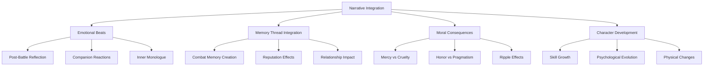

### 12.1 Emotional Beats & Reflection

Combat is not merely a mechanical exchange but an emotionally charged experience that shapes the character's journey:

- **Post-Battle Reflection**
  After significant battles, quiet moments allow for processing what occurred:
  > *As the battlefield falls silent, you notice the blood caking your hands. Was this the victory you sought, or just another step into the abyss? The faces of those you've slain linger in your mind's eye, nameless soldiers following orders just as you follow yours.*

- **Guilt, Pride & Doubt**
  Combat choices trigger complex emotional responses:
  > *The bandit leader's surrender came too late—after his men had fallen, after the village had burned. Your mercy in sparing him feels hollow, yet something in his defeated eyes reminds you of your own past. Is this justice, or merely the powerful deciding who deserves a second chance?*

- **Companion Commentary**
  Those who fight alongside you offer perspective on your combat choices:
  > *"I've never seen anyone fight like that before," Keth says quietly as you clean your blade. You can't tell if the tremor in his voice is admiration or fear. "It was like... like you weren't even the same person." His words hang in the air between you, a reminder that how you fight reveals who you truly are.*

### 12.2 Memory Thread Integration

Combat experiences create powerful memory threads that persist and influence future interactions:

- **Combat Memory Creation**
  Significant battles generate memory threads with emotional weight:
  > *The memory of your first kill—that bandit on the forest road—has changed over time. The details remain sharp: the rain-slick ground, the desperate lunge, the unexpected give of flesh beneath your blade. But the horror that once accompanied this memory has dulled. You recall the facts with clarity but experience the emotions at a distance, as though they belong to someone else.*

- **Reputation Effects**
  How you fight shapes how the world perceives you:
  > *The whispers begin as soon as you enter the tavern. "That's the one who faced the Crimson Fang alone," a voice murmurs. "They say no blade can touch them." Your reputation precedes you, opening doors and creating expectations. Some will seek your tutelage, others your defeat—all because of how you've conducted yourself in battle.*

- **Relationship Impact**
  Combat choices affect your bonds with companions and NPCs:
  > *Lira hasn't spoken to you since the battle at Frost Pass. You see her watching you sometimes, her expression unreadable. Was it your ruthlessness that disturbed her? Or the fact that you seemed to enjoy the bloodshed? The distance between you grows with each silent day, a consequence as real as any physical wound.*

### 12.3 Moral Consequences

Combat choices carry moral weight that ripples through the narrative:

- **Mercy vs. Cruelty**
  How you treat defeated foes shapes your reputation and future encounters:
  > *The bandit you spared three months ago stands before you again—but now he wears the colors of the town guard. "You gave me a chance when no one else would," he says quietly. "I haven't forgotten." His information about the smuggling ring might never have reached you had you chosen differently that day on the road.*

- **Honor vs. Pragmatism**
  Fighting style reflects deeper values that NPCs notice and respond to:
  > *"You fight with honor," the knight says, lowering his blade. "Even when it would have been easier to strike from behind or use underhanded tactics, you faced me directly. For that, I will tell you what you wish to know—though my lord forbade it."*

- **Ripple Effects**
  Combat decisions create cascading consequences throughout the world:
  > *The village of Oakvale celebrates your name for slaying the warlord who terrorized them. But in Westmarch, his allies have placed a bounty on your head, and merchants from that region now refuse to trade with you. One death, dozens of consequences spreading like ripples in a pond.*

### 12.4 Character Development

Combat experiences drive character growth in multiple dimensions:

- **Skill Growth**
  Combat techniques improve through use and reflection:
  > *You notice it during a routine skirmish with highway bandits—your blade moves with a precision that wasn't there before. The countless hours of combat, the desperate struggles and hard-won victories, have refined your technique beyond conscious thought. What once required concentration now flows naturally, muscle memory forged in the crucible of survival.*

- **Psychological Evolution**
  Battle experiences shape personality and outlook:
  > *There was a time when the sight of blood made you queasy, when taking a life seemed unthinkable. Now you clean your blade with mechanical efficiency, tallying supplies rather than dwelling on the bodies cooling nearby. You've changed—hardened in some ways, perhaps, but also more aware of the fragility of life and the consequences of violence.*

- **Physical Changes**
  Combat leaves its mark on the body:
  > *The mirror reveals a stranger sometimes—a body mapped with scars, each telling its own story. The puckered line across your ribs from the assassin's blade. The burn along your forearm from the mage's fire. The slight crook in your once-straight nose. These marks are a history written in flesh, a testament to battles survived and lessons learned the hard way.*

## 13.0 Flow State Combat System

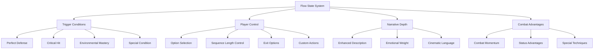

### 13.1 Flow State Fundamentals

The Flow State system enables extended cinematic combat sequences while preserving player control:

- **Definition:** A special combat state where actions flow together in a fluid, extended sequence with enhanced narrative description and tactical advantages
- **Entry Triggers:** Perfect defenses, critical hits, or other exceptional combat achievements
- **Player Agency:** Each stage of a Flow sequence offers player choices that determine the next steps
- **Duration Control:** Players decide when to continue or exit a Flow sequence
- **Narrative Enhancement:** Flow States receive more detailed, anime-inspired descriptions
- **Custom Action Integration:** Beyond presented options, players can always suggest custom actions during Flow

### 13.2 Flow State Mechanics

**Initiation:**
After a successful combat action with appropriate timing or skill, the system presents a Flow State opportunity:

```
[Flow State Opportunity]
Your perfect parry creates an opening! Enter Flow State?
1. Yes - Press the advantage (2-4 more connected actions)
2. No - Return to standard combat pace
3. [Custom action] - Suggest your own approach
```

**Flow Sequence:**
Once active, Flow State presents enhanced action choices with rich narrative payoff:

```
[Flow State Active]
Your parry deflects the steel with a satisfying ring. Time seems to slow as combat clarity washes over you. The bandit's guard is open, his weight committed to the failed thrust.

> Continue your counter:
1. Strike at his exposed neck
2. Sweep his forward leg
3. Grab his wrist and twist
4. [Custom] - Describe your own action
```
“Never stack multiple rounds or conditional branches. One input = one action = one reaction. All momentum and enemy behavior updates must occur before next decision.”

**Resolution:**
Flow State concludes either when the player chooses to end it, when a set number of actions is reached, or upon a failed action:

```
[Flow State Resolution]
The sequence of movements flows together perfectly, leaving your opponent stunned by your skill and precision.

[Advantage Gained]
Your successful Flow sequence has granted +2 Combat Momentum and inflicted the "Off-Balance" status on your opponent.
```

### 13.3 Flow State Benefits

Successful execution of Flow sequences provides both narrative and mechanical advantages:

- **Combat Momentum:** Accumulate points that can be spent on special techniques
- **Status Effects:** Impose favorable conditions on enemies (staggered, intimidated, etc.)
- **Damage Bonuses:** Flow attacks deal increased damage
- **Special Technique Access:** Unlock anime-protagonist level finishing moves
- **Aura Manifestation:** Trigger visible combat aura effects

### 13.4 Flow State Integration

Flow State can be integrated with various combat scenarios:

- **Martial Arts:** Fluid combinations of strikes and techniques
- **Weapon Combat:** Elegant sword sequences or devastating axe combinations
- **Magic Casting:** Chained spell effects with escalating power
- **Hybrid Fighting:** Combinations that merge different combat styles

## 14.0 Aura System

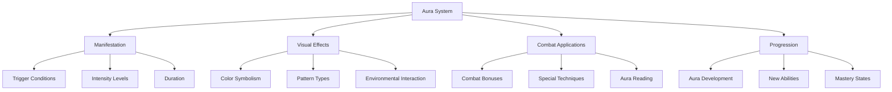

### 14.1 Aura Fundamentals

Auras represent the visual manifestation of combat spirit, determination, and power:

- **Definition:** A visible energy field surrounding a fighter that represents their combat spirit and power
- **Manifestation:** Auras appear during moments of intense concentration, emotional peaks, or when executing special techniques
- **Visibility:** Described through rich sensory language visible to characters in-world
- **Characteristics:** Colors, patterns, and behaviors that reflect the character's nature and fighting style

### 14.2 Aura Visualization

Auras are described through evocative language that creates clear mental imagery:

```
[Aura Manifestation - First Stage]
As your determination crystallizes, a subtle shimmer surrounds your form—barely visible at first, like heat rising from sun-baked stone, but with purpose and direction.

[Aura Manifestation - Combat Stage]
Your aura intensifies with your resolve, a pale blue light outlining your body. It pulses with your heartbeat, flaring brighter with each decisive movement.

[Aura Manifestation - Peak Power]
At the height of battle, your aura blazes like a star, casting shadows even in daylight. The blue energy whips and flows around you like living flame, responding to your emotions and intentions.
```

### 14.3 Combat Applications

Auras provide both narrative flavor and mechanical benefits:

- **Intimidation:** Visible auras can impose morale penalties on enemies
- **Combat Bonuses:** Active auras provide statistical advantages
- **Aura Reading:** Advanced fighters can perceive intentions through aura patterns
- **Special Techniques:** Some abilities require or are enhanced by aura manifestation
- **Environmental Effects:** Powerful auras might interact with the surrounding environment

### 14.4 Aura Reading

Experienced fighters develop the ability to read combat intentions through aura observation:

```
[Aura Reading Active]
You focus beyond physical sight, perceiving the mercenary's aura pulse around him. The crimson energy flares brightest at his right arm—he's preparing an overhead strike.

[Combat Insight]
Your aura reading grants advance warning. You gain advantage on your next defensive roll.
```

### 14.5 Aura Progression

Character development includes aura evolution:

- **Initial Manifestation:** Brief, subtle, and uncontrolled
- **Developing Control:** Deliberate activation, maintained for longer periods
- **Color Evolution:** Aura color may shift with character development or emotional states
- **Pattern Complexity:** Basic auras appear as simple outlines, while developed auras show intricate patterns
- **Mastery State:** Complete control, manifestation at will, and unique visual signature

## 15.0 Earth Martial Arts Integration

### 15.1 Martial Arts Background

Characters can have training in Earth martial arts that influences their combat style:

- **Background Options:** Boxing, Brazilian Jiu-Jitsu, Karate, Muay Thai, Military Combatives, Bujinkan Budo Taijutsu
- **Starting Advantages:** Each background provides specific initial combat bonuses
- **Technique Access:** Unique moves and combinations based on background
- **Development Path:** Earth techniques evolve and adapt to Vantiel's magical environment

### 15.2 Bujinkan Budo Taijutsu

A specific Earth martial art with unique characteristics:

- **Historical Foundation:** Draws from nine classical Japanese warrior traditions
- **Adaptability Focus:** Emphasizes natural movement and efficient combat strategy
- **Godai Application:** Utilizes the five-element movement model (Earth, Water, Fire, Wind, Void)
- **Special Techniques:** Unique moves based on traditional ninja and samurai combat methods

**Godai Reference (Bujinkan-Specific):**
```
As you face multiple opponents, your Bujinkan training resurfaces. You recall the Godai—the five elemental manifestations of movement and response:

- Earth (Chi): Stability and grounding against stronger forces
- Water (Sui): Flowing around obstacles, redirecting energy
- Fire (Ka): Explosive forward movement and decisive action
- Wind (Fu): Unpredictable, circular movement patterns
- Void (Ku): The space between thought and action, pure instinct

The situation calls for Water principles—meeting force with redirection rather than opposition.
```

### 15.3 Martial Arts Evolution

Earth martial arts evolve in the fantasy world:

- **Magical Enhancement:** Traditional techniques amplified by mana or special abilities
- **Hybrid Styles:** Earth martial arts combined with Vantiel fighting traditions
- **Signature Techniques:** Personal variations developed through experience
- **Named Special Moves:** Techniques that become part of character identity

```
[Martial Memory Unlocked]
In the heat of battle, your body remembers the boxing combinations drilled into muscle memory during your Earth life. But now, as mana flows through your limbs, each punch leaves a trail of elemental energy.

The "Phantom Flurry" technique is now available during combat.
```

## 16.0 Implementation Notes

**Key Elements:**
- Real-time status tracking
- Meaningful, cinematic decisions
- Fluid, dynamic combat with environmental interactions
- Tactical depth and creative improvisation
- Dynamic responses and satisfying impact
- Custom action support in all combat phases
- Flow State for extended cinematic sequences
- Aura visualization for anime-style combat effects
- Earth martial arts integration for technique depth

**Combat Goals:**
- Encourage fluid movement and reactive gameplay
- Ensure strategic depth and cinematic action
- Create realistic consequences and memorable moments
- Allow full expression of player skill
- Integrate combat seamlessly with narrative progression
- Create emotional resonance through combat choices
- Support player creativity through custom action freedom
- Deliver anime-protagonist level combat experiences
