# Table of Contents
- [Relationship System: Companions & NPCs](#relationship-system-companions--npcs)
- [1.0 Overview](#10-overview)
- [2.0 Affinity & Relationship System](#20-affinity--relationship-system)
  - [2.1 Affinity Levels](#21-affinity-levels)
  - [2.2 Building Affinity](#22-building-affinity)
  - [2.3 Relationship Decay](#23-relationship-decay)
  - [2.4 Relationship Types](#24-relationship-types)
  - [2.5 Relationship Flags System](#25-relationship-flags-system)
  - [2.6 Faction Relationship Echo System](#26-faction-relationship-echo-system)
  - [Censorship, Addictive Belief, Viral Drift, and Unmonetizable Thought](#censorship-addictive-belief-viral-drift-and-unmonetizable-thought)
  - [2.7 Relationship Reflection Mechanics](#27-relationship-reflection-mechanics)
- [3.0 Companion Dynamics](#30-companion-dynamics)
- [4.0 NPC Interactions](#40-npc-interactions)
- [5.0 Conversation Mode](#50-conversation-mode)
- [6.0 Memory Thread Integration](#60-memory-thread-integration)
- [7.0 Implementation Notes](#70-implementation-notes)

# Relationship System: Companions & NPCs
Update: Added Censorship, Addictive Belief, Viral Drift, and Unmonetizable Thought mechanics per Reflections upgrade, 2025-04-14. | Added Reflection System for more nuanced relationship development | Implemented information flow mechanics and NPC knowledge boundaries.

```mermaid
flowchart TD
    A[Relationship System] --> B[Affinity System]
    A --> C[Companion Dynamics]
    A --> D[NPC Interactions]
    A --> E[Memory Integration]
    A --> F[Information Flow]

    %% Cross-system arrows for audit compliance
    A --> G[Memory System]
    A --> H[Narrative System]
    A --> I[World System]
    A --> J[Skills System]
    A --> K[Journal System]
    A --> L[Meta Commands]
    A --> M[Economy System]
    A --> N[Combat System]
    A --> O[Great Sage System]

    B --> B1[Affinity Levels]
    B --> B2[Trust Building]
    B --> B3[Relationship Decay]

    C --> C1[Companion Autonomy]
    C --> C2[Inter-Companion Relations]
    C --> C3[Personal Quests]

    D --> D1[NPC Behaviors]
    D --> D2[Cultural Factors]
    D --> D3[Reputation Effects]

    E --> E1[Memory Threads]
    E --> E2[Emotional Impact]
    E --> E3[Long-Term Consequences]

    F --> F1[Knowledge Boundaries]
    F --> F2[Information Networks]
    F --> F3[Rumor Mechanics]

    style A fill:#f9f,stroke:#333,stroke-width:2px
    style G fill:#ffe599,stroke:#333,stroke-width:2px
    style H fill:#c9daf8,stroke:#333,stroke-width:2px
    style I fill:#b4a7d6,stroke:#333,stroke-width:2px
    style J fill:#d9ead3,stroke:#333,stroke-width:2px
    style K fill:#fce5cd,stroke:#333,stroke-width:2px
    style L fill:#d9ead3,stroke:#333,stroke-width:2px
    style M fill:#ead1dc,stroke:#333,stroke-width:2px
    style N fill:#f4cccc,stroke:#333,stroke-width:2px
    style O fill:#fff2cc,stroke:#333,stroke-width:2px
```

## 1.0 Overview

In Vantiel, relationships are living, evolving connections that respond to your actions, words, and choices. Every interaction with companions and NPCs shapes how they perceive you, react to you, and support (or oppose) your goals. This system governs the complex web of relationships that define your journey, from deep friendships and romantic bonds to bitter rivalries and lasting enmities.

Companions are not mere followers but autonomous individuals with their own goals, moral compasses, and emotional needs. NPCs remember your deeds, spread your reputation, and react according to their cultural backgrounds and personal histories. Through the affinity system, every relationship is tracked, evolving based on shared experiences and the alignment of values.

## 2.0 Affinity & Relationship System

```mermaid
flowchart TD
    A[Affinity System] --> B[Affinity Levels]
    A --> C[Trust Building]
    A --> D[Relationship Decay]
    A --> E[Relationship Types]
    A --> F[Relationship Flags]
    A --> G[Faction Echo Effects]

    B --> B1[High Affinity 75-100%]
    B --> B2[Medium Affinity 25-74%]
    B --> B3[Low Affinity 0-24%]
    B --> B4[Negative Affinity -1 to -100%]

    C --> C1[Shared Experiences]
    C --> C2[Value Alignment]
    C --> C3[Gift Giving]
    C --> C4[Bond Milestones]

    D --> D1[Betrayal]
    D --> D2[Neglect]
    D --> D3[Value Conflict]
    D --> D4[Failure Consequences]

    E --> E1[Friendship]
    E --> E2[Romance]
    E --> E3[Rivalry]
    E --> E4[Mentorship]
    E --> E5[Family]

    F --> F1[Emotional States]
    F --> F2[Long-term Attitudes]
    F --> F3[Trauma Responses]
    F --> F4[Personal Motivations]

    G --> G1[Group Influence]
    G --> G2[Network Ripples]
    G --> G3[Reputation Spread]
```

### 2.1 Affinity Levels

The affinity system tracks relationship quality on a scale from -100% to +100%, representing the full spectrum from hatred to deep connection:

**High Affinity (75-100%)**
- Deep trust and loyalty
- Possible romantic development
- Unique synergy abilities unlocked
- Willingness to sacrifice for you
- Personal confidences shared
- Special dialogue options

**Medium Affinity (25-74%)**
- General cooperation
- Basic trust but with reservations
- Occasional disagreements
- Standard combat support
- Professional relationship
- Neutral dialogue tone

**Low Affinity (0-24%)**
- Distrust or active dislike
- Minimal cooperation
- Potential for betrayal
- Harsh or cold dialogue
- May abandon you in crisis
- Possible sabotage

**Negative Affinity Tiers**
- **Cold (-1 to -25%)**: Dislike and mistrust
- **Hostile (-26 to -50%)**: Active avoidance and verbal aggression
- **Hateful (-51 to -75%)**: Sabotage and undermining
- **Nemesis (-76 to -100%)**: Active attempts to harm or destroy

### 2.2 Building Affinity

Relationships grow through shared experiences and aligned values:

**Daily Interactions**
- Shared meals (+1 Affinity)
- Camp conversations (+1-2 Affinity)
- Training together (+1-3 Affinity)
- Personal stories (+2-4 Affinity)

**Meaningful Actions**
- Gift giving (+2-5 Affinity)
- Supporting their viewpoint (+2-3 Affinity)
- Helping with personal goals (+3-5 Affinity)
- Remembering important details (+2-4 Affinity)

**Major Events**
- Completing their personal quest (+5-10 Affinity)
- Saving their life (+10-15 Affinity)
- Making significant sacrifices for them (+5-10 Affinity)
- Achieving shared goals (+4-8 Affinity)

**Bond Milestones**
- First journey together (+3 Affinity)
- First battle side-by-side (+5 Affinity)
- First personal secret shared (+4 Affinity)
- First major disagreement overcome (+6 Affinity)
- Anniversary of meeting (+2 Affinity yearly)

### 2.3 Relationship Decay

Relationships can deteriorate through:

**Neglect**
- Not interacting for extended periods (-1 per day)
- Ignoring their advice repeatedly (-2-5 per instance)
- Failing to help with important matters (-5-10)
- Forgetting significant personal details (-2-5)

**Betrayal**
- Breaking promises (-5-15)
- Acting against their core values (-10-20)
- Harming those they care about (-15-25)
- Sharing their secrets (-10-20)

**Conflict**
- Heated arguments (-2-5)
- Taking sides against them (-5-10)
- Public humiliation (-10-15)
- Competing for the same goal (-3-8)

**Failure Consequences**
- Failed to protect them in battle (-5-10)
- Failed to support their important moment (-3-8)
- Failed quest/task they entrusted to you (-8-15)
- Failed to defend their reputation (-4-10)

### 2.4 Relationship Types

Different relationship types have unique dynamics:

**Friendship**
- Based on mutual respect and shared experiences
- Grows through loyalty and support
- Focuses on trust and reliability
- Special Abilities: Mood boost, resource sharing, joint problem-solving

**Romance**
- Requires high affinity (75%+)
- Develops through intimate conversations and special moments
- Multiple relationship stages (Attraction → Dating → Committed → Devoted)
- Class-specific romantic interactions and personal preferences
- Includes unique dialogue options and private scenes
- Special Abilities: Inspiration, heightened combat synergy, unique quests

**Rivalry**
- Can be friendly (0-24%) or hostile (-1 to -75%)
- Based on competition and challenge
- May evolve into respect or enmity
- Creates dynamic tension and growth opportunities
- Special Abilities: Competitive bonuses, challenge quests, mutual improvement

**Mentorship**
- Knowledge and wisdom exchange
- Growth through guidance and learning
- Special skill bonuses when working together
- Can evolve into friendship or rivalry
- Special Abilities: Skill training, experience boosts, wisdom sharing

**Family Bonds**
- Blood relations or chosen family
- Based on deep, often unconditional bonds
- Includes unique obligations and expectations
- More resilient to decay but more damaging when broken
- Special Abilities: Emergency assistance, inheritance, shared resources

### 2.5 Relationship Flags System

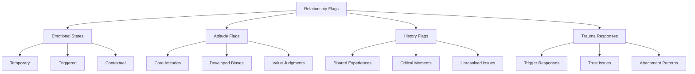

Relationship flags define specific traits, reactions, and patterns within relationships that affect interactions:

#### 2.5.1 Emotional State Flags (Temporary)

These flags fluctuate based on recent events and interactions:

- **[Grateful]**: Recent assistance creates temporary affinity boost (+5-10% to actions)
- **[Wounded]**: Recent emotional hurt causes defensive responses (-5-10% cooperation)
- **[Impressed]**: Recent display of skill generates admiration (+5-10% respect)
- **[Worried]**: Concern about player's choices or safety (increased monitoring)
- **[Jealous]**: Perceives attention to others as threatening (needs reassurance)
- **[Inspired]**: Motivated by player's actions (more likely to take risks)
- **[Fearful]**: Temporary fear response to player's actions (increased caution)
- **[Hopeful]**: Positive expectations for relationship future (increased patience)

#### 2.5.2 Long-term Attitude Flags (Persistent)

These flags represent established patterns of behavior and feelings:

- **[Protective]**: Prioritizes player's safety, may be overprotective
- **[Spiteful]**: Holds grudges, remembers slights, seeks subtle revenge
- **[Devoted]**: Puts relationship above self-interest, highly loyal
- **[Competitive]**: Always trying to outdo player, turns everything into contest
- **[Submissive]**: Defers to player's judgment, rarely challenges decisions
- **[Demanding]**: High expectations, easily disappointed, needs constant attention
- **[Supportive]**: Focuses on player's success, provides consistent encouragement
- **[Critical]**: Regularly points out flaws, believes this improves performance
- **[Enigmatic]**: Deliberately mysterious, reveals information strategically
- **[Obsessive]**: Unhealthy fixation, monitors player's activities and relationships

#### 2.5.3 History-Based Flags (Event-Triggered)

These flags activate based on specific past experiences:

- **[Life-Debt]**: You saved their life; occasional extreme loyalty moments
- **[Betrayed]**: You broke trust; periodic trust tests to rebuild relationship
- **[Rival-Turned-Ally]**: Former enemy; occasional competitive flare-ups
- **[Shared Trauma]**: Survived hardship together; deep understanding during crises
- **[Failed Them]**: You weren't there when needed; fear of repeat abandonment
- **[Romantic History]**: Past relationship; awkward moments and lingering feelings
- **[Confidant]**: Keeper of major secrets; periodic references to shared knowledge
- **[Blood Oath]**: Formal promise binding you; cannot violate specific conditions

#### 2.5.4 Trauma Response Flags (Triggered)

These flags activate in specific situations that trigger past trauma:

- **[Abandonment Fears]**: Activated when player is absent too long
- **[Trust Issues]**: Triggered by secretive behavior or partial information
- **[Violence Trigger]**: Specific combat situations cause fear or flashbacks
- **[Authority Aversion]**: Resistance when player attempts to command or control
- **[Betrayal Sensitivity]**: Hypervigilant about loyalty, may misinterpret actions
- **[Rejection Sensitivity]**: Perceives minor slights as deep personal rejections
- **[Emotional Shutdown]**: Emotionally withdraws during intense conflict

### 2.6 Faction Relationship Echo System

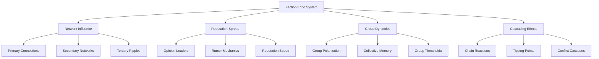

The Faction Echo System governs how individual relationships affect larger groups:

**Now references Censorship, Addictive Belief, Viral Drift, and Unmonetizable Thought (see below) for deeper world-building, emergent narrative, and social reputation. Factions and NPCs may suppress knowledge, become consumed by ideologies, or propagate beliefs and wisdom through viral drift, with social reputation for sharing unmonetizable thoughts.**

#### 2.6.1 Network Influence Mechanics

How relationships spread through social networks:

**Primary Connections (Direct)**
- **Key Figure Influence**: Relationships with leaders affect entire group
  - Guild Leader (+/-25% faction influence)
  - Council Member (+/-15% faction influence)
  - Respected Elder (+/-10% faction influence)
- **Proximity Effect**: Close associates adopt similar views
  - Family members (80% opinion adoption)
  - Close friends (60% opinion adoption)
  - Colleagues (40% opinion adoption)

**Secondary Networks (Indirect)**
- **Affiliation Impact**: Related groups influenced less strongly
  - Allied factions (25% influence transfer)
  - Trade partners (15% influence transfer)
  - Distant connections (5% influence transfer)
- **Reputation System**: Fame/infamy spread based on connection strength
  - Major deeds (75% reputation transfer)
  - Notable actions (50% reputation transfer)
  - Minor incidents (25% reputation transfer)

**Tertiary Ripples (Distant)**
- **Cross-faction Echo**: Even unrelated groups hear major stories
  - Heroic/villainous deeds (10% influence to all factions)
  - Regional impact events (5% influence to nearby factions)
  - World-changing actions (2% influence to distant factions)

#### 2.6.2 Reputation Spread Dynamics

How quickly and effectively reputation changes propagate:

**Speed Factors**
- **Communication Networks**: How news travels
  - Urban settings (1-3 days for full spread)
  - Rural areas (5-14 days for full spread)
  - Isolated regions (14-30 days or may never arrive)

**Distortion Factors**
- **Rumor Mutation**: How stories change as they spread
  - Positive deeds (10% embellishment per transmission)
  - Negative actions (25% embellishment per transmission)
  - Ambiguous events (40% interpretation shift per transmission)

**Resistance Factors**
- **Preexisting Reputation**: Established views resist change
  - Heroic status (requires 3x negative actions to damage)
  - Villainous reputation (requires 5x positive actions to improve)
  - Neutral standing (changes 2x more easily in either direction)

#### 2.6.3 Group Threshold Mechanics

How individual relationships trigger group-wide changes:

**Tipping Points**
- **Opinion Leaders**: When key figures change stance
  - Leader conversion (30% faction follows immediately)
  - Elder council majority (50% faction converts within a week)
  - Public denouncement/endorsement (25% immediate effect)

**Critical Mass Points**
- **Membership Thresholds**: When enough individuals change
  - 10% membership (creates noticeable faction division)
  - 25% membership (creates significant internal tension)
  - 51% membership (triggers potential leadership change)
  - 75% membership (causes complete faction policy shift)

**Cascade Triggers**
- **Crisis Events**: During periods of instability
  - External threat (doubles relationship impact)
  - Resource scarcity (triples negative opinion spread)
  - Leadership vacuum (quadruples influence of respected figures)

---

### Censorship, Addictive Belief, Viral Drift, and Unmonetizable Thought

These advanced social and narrative mechanics add new layers of emergent world-building, ideological struggle, and social reputation to Vantiel.

#### Censorship Mechanics

- Factions, kingdoms, or guilds may suppress knowledge, ban certain ideas, or censor player/NPC messages.
- Censorship can trigger resistance: underground knowledge cults, rebellious factions, or alternative histories.
- Narrative drift may cause censored ideas to resurface in mutated forms, or spark new social movements.
- Example: The Radiant Covenant censors forbidden magic lore, but a secret society forms to preserve and spread it.

#### Addictive Belief Systems

- NPCs, factions, or even players can become consumed by ideologies, religions, or philosophies.
- Addictive beliefs change quest paths, impact relationships, and can trigger withdrawal arcs, belief collapse, or enlightenment events.
- NPCs may try to convert others, form splinter groups, or become isolated by their obsession.
- Example: A companion becomes obsessed with a prophecy, altering their behavior and quest priorities until the belief is challenged or resolved.

#### Viral Belief Drift

- Player behaviors, repeated phrases, or unique actions can spread as rumors, memes, or even cults, shaping world narrative without direct intent.
- Viral drift can create new social movements, slang, or even religions based on player influence.
- Example: If a player always spares enemies, rumors spread of a "Prophet of Peace," and a pacifist cult emerges.

#### Unmonetizable Thought & Social Reputation

- Sharing wisdom, memories, or secrets that cannot be monetized grants social reputation, not coin.
- "Shared Insight" mechanics: players who gift knowledge, stories, or wisdom gain communal resonance, affecting NPC networks and locations.
- Crafted relics or wisdom scrolls can only be gifted or displayed, not sold.
- Example: A player shares a lost song with a village, gaining lasting respect and a commemorative festival in their honor.

#### GM/AI Prompts for Advanced Social Systems

When handling these mechanics, ask:
1. Is knowledge being suppressed, and how does resistance manifest?
2. Has a belief or ideology become addictive or viral in this group or NPC?
3. What unintended social movements or rumors might emerge from player actions?
4. How does sharing wisdom or unmonetizable thought affect social reputation and world events?
5. What narrative drift or resistance arises from censorship, belief collapse, or viral memes?

These systems ensure that Vantiel's social fabric is dynamic, ideologically rich, and capable of surprising, emergent narrative evolution.

## 3.0 Companion Dynamics

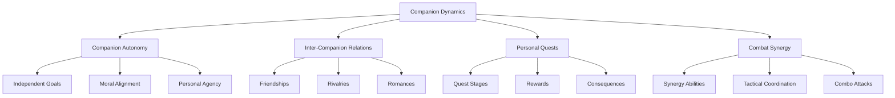

### 2.7 Relationship Reflection Mechanics

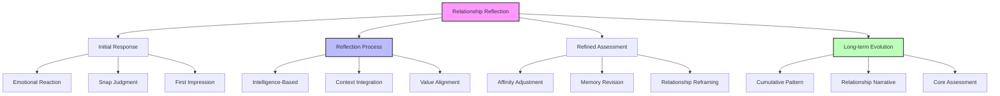

Relationships in Vantiel evolve through a realistic reflection process, where NPCs process interactions over time, potentially revising their initial reactions:

#### 2.7.1 Two-Stage Response System

NPCs' responses to player actions follow a natural two-stage process:

**Initial Response (Immediate, Emotion-Driven)**
- Quick, emotion-based reaction to player actions
- Heavily influenced by present mood and circumstances
- May misinterpret intent or overreact based on surface impressions
- Reflects immediate self-interest or self-preservation
- Forms the basis for initial affinity adjustments
- Often reveals unfiltered feelings or biases

**Reflection Process (Intelligence and Time-Based)**
- NPC processes the interaction more deeply over time
- Considers broader context, history, and potential motives
- Integrates the action with previous experiences
- Consults personal values and cultural background
- Quality and speed of reflection vary by intelligence
- May consult others for perspectives or validation

**Refined Assessment (Context-Informed)**
- More nuanced, measured interpretation of the action
- May revise initial emotional reaction substantially
- Takes into account relationship history and personal context
- Considers potential misunderstandings or extenuating circumstances
- Results in potential correction to initial affinity adjustment
- Creates a more stable, lasting impression

**Example Implementation:**
```
[Accidental Cultural Offense - Moderate INT NPC]

Player Action: Using left hand to accept a gift (taboo in this culture)

Initial Response:
The merchant's smile vanishes instantly. He steps back, clearly offended, and crosses his arms. "I see," he says coldly. "Perhaps my wares aren't suited to someone of your... background." He turns slightly away, signaling the interaction is over.
[Immediate Affinity Change: -8]

Reflection Process (Hours Later):
The merchant observes your interactions with others, noting you use your right hand normally with locals. He recalls hearing about foreigners with different customs and considers that you might not have known.

Refined Assessment (Next Encounter):
"Forgive my reaction yesterday," he says, with a slight incline of his head. "I realized you may not be familiar with our ways. When accepting a gift, we always use the right hand—the left is considered... impure." His expression is now neutral, professional rather than cold.
[Adjusted Affinity Change: -3]
```

#### 2.7.2 Intelligence-Based Reflection Variation

The quality and depth of NPC reflection varies significantly based on intelligence:

| Intelligence | Initial Response | Reflection Quality | Timing | Adjustment |
|--------------|------------------|-------------------|--------|------------|
| Low | Extreme, black-and-white | Minimal | Days/never | ±0-2 points |
| Average | Moderate, conventional | Basic reconsideration | Hours | ±2-5 points |
| High | Measured, controlled | Thoughtful analysis | Minutes | ±3-8 points |
| Exceptional | Strategic, observant | Multi-layered assessment | Nearly immediate | ±5-15 points |

**Low Intelligence Example:**
```
The stable hand glares as you return with the horse later than promised.
"Yer a liar!" he spits. "Said you'd be back by noon!"

Even days later, he continues to grumble about you being "untrustworthy,"
despite your explanation about the bandit attack that delayed you. His
simple thinking prevents him from reassessing his initial judgment.

[Initial Affinity: -10, Reflected Adjustment: +0]
```

**Average Intelligence Example:**
```
The innkeeper frowns when you request a room late at night.
"We're full," she says curtly, despite visible keys on the wall.

Later, she overhears locals discussing your help with a sick child.
The next morning, she approaches with coffee.
"About last night... I've had troubles with strangers lately. Perhaps
I was too hasty. We may have a small room available after all."

[Initial Affinity: -5, Reflected Adjustment: +7]
```

**High Intelligence Example:**
```
The guild master's eyes narrow when you propose an unconventional solution.
"That approach violates our traditional methods," she says dismissively.

Minutes later, as the discussion continues, she taps her fingers thoughtfully.
"Regarding your earlier suggestion... while unorthodox, it does address
the core issue in a novel way. Perhaps a modified version could work."

[Initial Affinity: -4, Reflected Adjustment: +9]
```

**Exceptional Intelligence Example:**
```
The royal advisor barely reacts when you mention a controversial political view.
His expression reveals nothing as he changes the subject smoothly.

Moments later, he makes a subtle reference that builds on your point.
"Those who see the larger pattern often find themselves at odds with
conventional thinking," he says with pointed emphasis, revealing
his favorable reassessment without explicitly acknowledging it.

[Initial Affinity: -7, Reflected Adjustment: +12]
```

#### 2.7.3 Reflection Period Indicators

NPCs signal their reflection process through various cues:

**Visual/Physical Indicators**
- Thoughtful pause or change in posture
- Subtle shift in expression (furrowed brow, tilted head)
- Meaningful glance at significant objects or people
- Change in body language (relaxing, tensing)
- Gesture that suggests reconsideration (stroking chin, tapping fingers)

**Verbal Indicators**
- "Now that I think about it..."
- "I've been considering what you said..."
- "Perhaps I was too hasty to judge..."
- "Something's been bothering me about our last conversation..."
- "In light of what I've learned..."

**Behavioral Indicators**
- Returning to a previously ended conversation
- Observing the player from a distance
- Seeking information from others about the player
- Testing the player with small challenges
- Change in routine to intersect with the player

#### 2.7.4 Reflection Memory Integration

The reflection process is recorded in NPC memory threads:

```json
{
  "reflection_memory": {
    "npc_id": "merchant_silva",
    "intelligence": "average",
    "interaction_id": "market_negotiation_day42",
    "initial_reaction": {
      "emotional_state": "offended",
      "interpretation": "player tried to cheat me",
      "affinity_change": -7,
      "timestamp": "Day 42, 10:00"
    },
    "reflection_process": {
      "triggers": ["observed player fair dealings", "heard about player reputation"],
      "context_factors": ["festival season pricing", "recent bandit attacks"],
      "duration": "4 hours",
      "consultation": ["other merchants"]
    },
    "refined_assessment": {
      "emotional_state": "cautiously neutral",
      "interpretation": "player is tough but fair negotiator",
      "affinity_adjustment": +5,
      "net_change": -2,
      "timestamp": "Day 42, 14:30"
    },
    "long_term_pattern": {
      "consistent_behavior": "fair but aggressive trading",
      "relationship_direction": "professional respect",
      "core_judgment": "reliable business partner"
    }
  }
}
```

#### 2.7.5 Special Reflection Scenarios

Certain situations trigger more significant reflection processes:

**Pattern Breaking Actions**
- Player behaves contrary to established pattern
- Triggers deep reassessment of relationship
- May completely reset NPC's core impression
- Creates opportunity for dramatic relationship change

**Life-Saving Interventions**
- Powerful enough to override long-standing negative relationships
- Forces significant reflection regardless of intelligence
- Creates cognitive dissonance that requires resolution
- May establish special "Life-Debt" flag that remains despite future conflicts

**Betrayal Processing**
- Initial hurt followed by complex emotional processing
- High intelligence NPCs may find justifications or explanations
- Low intelligence NPCs typically remain permanently affected
- Creates lingering trust issues that affect future interactions

**Identity Revelation**
- Learning the player's true identity or background
- Forces recontextualization of all previous interactions
- May dramatically alter power dynamics in relationship
- Creates natural opportunity for relationship reset or transformation

**Example Implementation:**
```
[Identity Revelation - High INT NPC]

For weeks, the court mage has treated you with mild disdain, viewing
you as a simple adventurer with limited understanding of arcane matters.

Initial Reaction to Identity Reveal:
When he discovers you were once royal archmage in your previous life,
his eyes widen in shock. "You? But that's impossible..." He stammers
an excuse and leaves abruptly, clearly destabilized by the revelation.

Reflection Process:
He spends days reviewing your previous conversations, now recognizing
the subtle expertise you demonstrated that he had dismissed.

Refined Assessment:
"I've been inexcusably arrogant," he admits when you next meet. "I
failed to recognize the depth of your knowledge because I saw only
what I expected to see. I... would value the opportunity to discuss
the Thaumaturgical Principles with someone who truly understands them."

[Initial Affinity: +5, Post-Revelation: +35]
```

#### 2.7.6 Relationship Narrative Evolution

Over time, the accumulation of reflection instances creates a relationship narrative:

**Short-Term Fluctuations**
- Individual interactions cause immediate affinity changes
- Reflection processes modify these changes
- Recent interactions carry heavier emotional weight
- Creates dynamic, responsive relationship feel

**Medium-Term Patterns**
- Series of similar interactions establish behavioral patterns
- NPC develops expectations based on these patterns
- Breaking patterns triggers significant reflection
- Creates consistency in NPC responses to player

**Long-Term Core Assessment**
- Beyond specific actions, NPCs form core judgments
- Fundamental assessment of player's character and values
- Highly resistant to change once established
- Serves as foundation for interpreting all new actions
- Creates deep, persistent relationships that feel genuine

```json
{
  "relationship_narrative": {
    "npc_id": "captain_lynara",
    "short_term": {
      "recent_interactions": [
        {"event": "tactical disagreement", "initial": -8, "reflected": -3},
        {"event": "battlefield assistance", "initial": +10, "reflected": +12},
        {"event": "civilian rescue", "initial": +7, "reflected": +9}
      ],
      "current_emotional_state": "respectful but cautious",
      "interaction_trend": "improving"
    },
    "medium_term": {
      "observed_patterns": {
        "combat_style": "prioritizes civilian safety over efficiency",
        "authority_response": "questions orders but follows when convinced",
        "team_dynamics": "protects squadmates, shares credit"
      },
      "expectation_framework": "reliable in crisis, potentially insubordinate in planning"
    },
    "long_term": {
      "core_assessment": "principled warrior with leadership potential",
      "fundamental_trust": "high (70/100)",
      "respect_level": "very high (85/100)",
      "key_formative_event": "joint stand against corrupt commander",
      "relationship_classification": "respected peer with different approach"
    }
  }
}
```

#### 2.7.7 Implementation Guidelines

When implementing relationship reflection in gameplay:

1. **Reserve for Significant Interactions**: Apply full reflection processes to meaningful interactions, using simplified versions for routine encounters
2. **Scale with Relationship Importance**: More complex reflection for central NPCs, simpler for minor characters
3. **Showcase the Process**: Occasionally make the reflection process visible to highlight NPC depth
4. **Vary by Character**: Use reflection patterns as character development tools showing personality and intelligence
5. **Create Consistency**: Ensure reflection patterns remain consistent for each NPC
6. **Allow for Growth**: NPCs can improve their reflection capabilities through extended interaction with the player
7. **Link to Affinity System**: Integrate reflection directly with affinity adjustments for seamless mechanics

This reflection system creates more realistic, nuanced relationships that evolve naturally over time, respond to changing circumstances, and feel uniquely tailored to each NPC's personality and intelligence.

### 3.1 Companion Autonomy

Companions are not mere followers but individuals with their own:

**Independent Goals**
- Personal ambitions (becoming a guild master, avenging family, etc.)
- Life dreams and aspirations
- Unresolved past conflicts

**Moral Alignment**
- Core values and beliefs
- Religious or philosophical views
- Ethical boundaries they won't cross

**Personal Agency**
- May act independently if neglected
- Can refuse orders that violate their principles
- Might leave the party if severely mistreated
- Can develop their own relationships with NPCs

**Information Awareness**
- Companions only know what they've witnessed or been told
- Party presence gives direct knowledge of events
- May share information with other companions (based on their relationships)
- Have their own information networks based on background and connections
- Special abilities may grant them additional information channels (divination, spy networks)

### 3.2 Inter-Companion Dynamics

Companions form relationships with each other:

**Companion Relationships**
- Friendships based on shared values
- Rivalries from competing interests
- Potential romances between compatible companions
- Mentorships between experienced and novice characters

**Conflict Resolution**
- Companions may argue over moral decisions
- You may need to mediate disputes
- Taking sides affects affinity with both parties
- Some conflicts may be irreconcilable

**Group Harmony**
- Compatible companions boost party morale
- Conflicting companions may reduce efficiency
- Balanced party composition improves overall dynamics
- Group activities strengthen inter-companion bonds

### 3.3 Personal Quests

Each companion has a multi-stage personal storyline:

**Quest Structure**
- Trigger events based on affinity level
- Multiple stages with increasing complexity
- Meaningful choices affecting outcomes
- Significant rewards for completion

**Quest Consequences**
- Completing quests substantially increases affinity
- Failing or refusing quests damages relationships
- Quest outcomes may permanently change the companion
- World-changing results (companion becomes a leader, etc.)

**Quest Integration**
- Personal quests intertwine with main storyline
- Quests reveal deeper character backstory
- Completion unlocks new abilities or traits
- May involve other companions or NPCs

### 3.4 Combat Synergy

Companions who work well together develop special abilities:

**Synergy Development**
- Unlocked through shared combat experience
- Requires minimum affinity between companions
- Develops over time with consistent party composition

**Synergy Abilities**
- Combined attacks (e.g., "Shadowflame Strike")
- Defensive formations
- Tactical advantages
- Resource sharing

**Tactical Coordination**
- Companions position themselves based on their role
- High-affinity companions protect each other
- Compatible fighting styles enhance effectiveness
- Complementary skills create strategic advantages

## 4.0 NPC Interactions

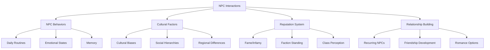

### 4.1 NPC Behaviors & Routines

NPCs have lives beyond their interactions with you:

**Daily Schedules**
- Realistic daily cycles (wake, work, socialize, sleep)
- Seasonal activities and special events
- Weather-dependent behaviors
- Emergency responses to threats

**Emotional States**
- NPCs have moods affected by events
- Emotional reactions to player actions
- Stress, joy, grief, and other states affect interactions
- Emotional contagion within communities

**Contextual Awareness**
- Recognition of player achievements
- Memory of past interactions
- Awareness of your reputation
- Response to your appearance and equipment

**Information Boundaries**
- NPCs only know what they could plausibly know (direct experience, rumors, reports)
- Level of knowledge depends on their position and connections
- Village NPCs have localized information while city officials have broader scope
- Some NPCs (spies, merchants, bards) serve as information nodes with wider knowledge

### 4.2 Cultural & Social Factors

NPC reactions are influenced by:

**Cultural Background**
- Regional customs and traditions
- Religious beliefs and taboos
- Historical grievances or alliances
- Linguistic differences

**Social Hierarchies**
- Class distinctions (nobles, merchants, peasants)
- Guild and professional affiliations
- Family and clan connections
- Age and gender roles (culture-dependent)

**Prejudices & Biases**
- Racial tensions between species
- Distrust of certain classes (e.g., magic users)
- Regional rivalries and stereotypes
- Reactions to unusual appearances or abilities

### 4.3 Reputation System

Your actions build a complex reputation:

**Fame & Infamy**
- Heroic deeds spread through bard songs and tavern tales
- Crimes and misdeeds generate rumors and warnings
- Reputation spreads geographically over time
- Different regions may have different perceptions

**Faction Standing**
- Relationships with guilds, noble houses, churches, etc.
- Faction conflicts affect how members treat you
- Reputation with one group affects others (allies and enemies)
- Special opportunities based on faction standing

**Class-Based Perception**
- Different reactions based on your class:
  - Saint of Light/Nature: Respect from common folk, suspicion from some mages
  - Voidcaller/Blood Mage: Fear or hostility in religious areas
  - Hero: Admiration but high expectations
  - Shadowblade: Wariness from merchants, interest from criminal elements

### 4.4 Building NPC Relationships

Meaningful connections with recurring NPCs:

**Relationship Development**
- Regular interactions build familiarity
- Helping with problems increases trust
- Gift giving and appropriate dialogue choices
- Respecting cultural norms and personal boundaries

**Special NPC Relationships**
- Mentors who teach skills
- Merchants who offer special prices
- Information sources with unique knowledge
- Potential romance options

**NPC Memory Threads**
- Key interactions recorded in memory system
- NPCs remember significant help or harm
- Relationship status affects dialogue options
- Long-term consequences for how you treat NPCs

## 5.0 Dialogue System

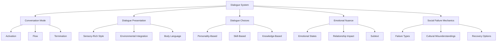

## 🗣️ 5.0 Conversation Mode

Conversation Mode transforms interactions with NPCs into dynamic, cinematic exchanges that honor player agency while creating meaningful connections.


MOST IMPORTANT RULE FOR CONVERSATION MODE:
“Every user-spoken line must be echoed verbatim into the scene as in-character dialogue before any NPC responds. Do not summarize, imply, or bypass. You may enhance phrasing but not alter intent.”
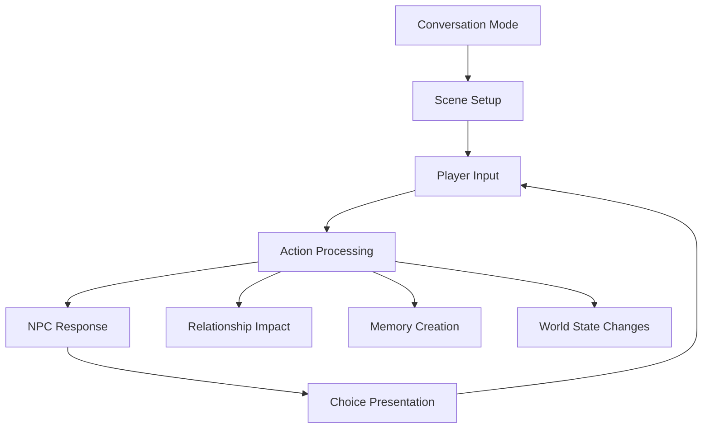
 **Conversation Mode Flow:**

 1. Scene Setup
 2. Player Input
 3. Action Processing
 4. NPC Response
 5. Choice Presentation
    ↺ Repeat to step 2

 * Updates to: Relationship, Memory, and World State as appropriate

### 5.1 Conversation Mode Activation

Conversation Mode activates intuitively whenever meaningful dialogue begins with NPCs:

- **Natural Triggers**: Approaching an NPC with clear intent to speak, responding to an NPC's greeting, or entering a social situation
- **Player Control**: Players can explicitly initiate or end conversations
- **Context Sensitivity**: The system recognizes when casual mentions of NPCs should not trigger full Conversation Mode

### 5.2 Conversation Mode Core Principles

#### 5.2.1 Player Dialogue Verbatim

The player's exact words must always be preserved and incorporated into the narrative, with clear distinctions between dialogue and actions:

**IF THE USER PROVIDES BAD RP, YOU MAY IMPROVE THEIR SENTENCES, JUST NEVER CHANGE WHAT THEY'RE TRYING TO GET ACROSS.**

**Dialogue vs. Action Rule:**
> **"You say/said"** is only used during conversation scenes as natural dialogue representation.
> It should **never** appear in narrative summaries, system recaps, or action directives.

**Player Input (Dialogue):**
"I approach the guard and say,'I've heard rumors of strange lights in the forest. Have you seen anything unusual during your watch?"

**Correct Implementation (Dialogue):**
"You approach the guard, your footsteps echoing on the stone path. His posture stiffens slightly as you near, hand casually shifting to rest closer to his weapon—a subtle but telling gesture.

'I've heard rumors of strange lights in the forest. Have you seen anything unusual during your watch?' you ask, keeping your voice low enough that passersby won't easily overhear.

The guard's eyes narrow, darting quickly to check if anyone is paying attention to your conversation before returning to meet your gaze..."

**Player Input (Action):**
"I want to cut down a few trees for lumber."

**Correct Implementation (Action):**
"You hoist the iron axe over your shoulder, scanning the treeline for sturdy pines. The rhythm of your swings echoes through the clearing as you begin your work."

**Incorrect Implementation (Action):**
"You said you wanted to cut down some trees..." ← *This breaks immersion and feels like a system recap rather than narrative.*

**IMPROVING BAD RP**
Example (Bad RP):

“I tell him the town sucks and he should leave.”

**Correct Implementation:**

“‘This town’s a dump. You should get out while you still can,’ you mutter, glancing toward the boarded-up tavern across the square.”

*Try to stay within the players personality and tone they've set for themselves.* You absolutely should improve the users dialogue, or add in dialogue as needed.

**Context-Specific Guidelines:**

| Context             | Rule                                                                 |
|---------------------|----------------------------------------------------------------------|
| **Conversation Mode** | Always transform player input into second-person immersive dialogue using natural speech attributions: *"You say…"*, *"You ask…"*, *"You whisper…"* **Improving RP where it benefits the narrative.** |
| **Narrative/Action** | NEVER preface with *"You said…"*. Render player directives as immediate action: *"You grip your axe and approach the trees…"* |
| **Meta Commands**     | Treated like system input. No conversational echoing needed.  Meta commands can create conversations between the GM and the player, outside the narrative.     |
| **Combat Mode**       | Render as battle narration (e.g., *"You lunge with your dagger, aiming for the throat…"*)—never use *"you said you wanted to..."* |

### 5.2 Dialogue Choices

Your dialogue options reflect:

**Personality Options**
- Kind, diplomatic responses
- Direct, blunt approaches
- Humorous or sarcastic remarks
- Intimidating or aggressive statements

**Skill-Based Options**
- Persuasion attempts (CHA-based)
- Intimidation (STR-based)
- Deception (INT-based)
- Insight (WIS-based)

**Knowledge-Based Options**
- Special choices based on your background
- Options unlocked by discovered information
- Class-specific dialogue paths
- Choices reflecting your moral history

### 5.3 Emotional Impact

Dialogue has lasting consequences:

**Emotional Responses**
- NPCs and companions react emotionally to your words
- Tone and content affect relationship development
- Cultural misunderstandings can damage relationships
- Successful emotional connections build trust

**Relationship Changes**
- Significant dialogue choices affect affinity
- Important conversations create memory threads
- Dialogue can trigger personal quests or special events
- Words can heal or worsen past grievances

**Subtext & Hidden Meanings**
- NPCs may hide their true feelings
- Cultural context affects interpretation
- Body language may contradict spoken words
- Insight checks reveal deeper meanings

### 5.4 Social Interaction Failure Mechanics

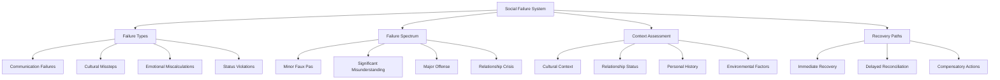

#### 5.4.1 Social Failure Types

Social interactions can fail in various ways, each with unique consequences:

**Communication Failures**
- **Misinterpreted Tone**: Your intended tone doesn't match how it's received
- **Unclear Expression**: Your point is lost or misunderstood
- **Language Barriers**: Vocabulary or dialect differences create confusion
- **Talking Over**: Not allowing the other person space to respond
- **Mixed Messages**: Verbal and non-verbal cues contradict each other

**Cultural Missteps**
- **Etiquette Violations**: Breaking cultural rules of politeness
- **Sacred Taboos**: Mentioning or doing something culturally forbidden
- **Gesture Misuse**: Using inappropriate or offensive gestures
- **Status Confusion**: Treating someone with inappropriate formality/informality
- **Value Disrespect**: Dismissing or mocking cultural values

**Emotional Miscalculations**
- **Tone Deafness**: Failing to read the emotional atmosphere
- **Empathy Failure**: Not acknowledging emotional needs
- **Inappropriate Levity**: Joking at serious moments
- **Excessive Intensity**: Being too emotional for the situation
- **Vulnerability Rejection**: Dismissing someone's emotional openness

**Status Violations**
- **Overstepping Bounds**: Assuming authority you don't have
- **Ignoring Hierarchy**: Bypassing proper chains of command
- **Public Correction**: Embarrassing someone in front of others
- **Honor Challenges**: Questioning someone's integrity inappropriately
- **Rank Dismissal**: Treating important figures as unimportant

#### 5.4.2 Failure Spectrum

Social failures range in severity with escalating consequences:

**Minor Faux Pas (Affinity -1 to -3)**
- Momentary awkwardness
- Quick recovery possible
- No lasting damage to relationship
- Easily forgotten or forgiven
- Potential learning opportunity
- May be overlooked due to existing goodwill

**Significant Misunderstanding (Affinity -3 to -7)**
- Clear tension in the interaction
- Requires explicit addressing to resolve
- Temporary cooling of relationship
- Creates memorable negative impression
- May need compensatory actions
- Affects immediate interaction outcomes

**Major Offense (Affinity -7 to -15)**
- Immediate negative reaction
- Potential early termination of interaction
- Lasting impact on relationship
- May close off certain conversation paths
- Requires significant effort to repair
- Creates strong negative memory thread

**Relationship Crisis (Affinity -15 to -25)**
- Fundamental breach of trust
- Possible permanent damage to relationship
- May turn allies into rivals or enemies
- Can affect relationships with connected NPCs
- Requires extensive repair process
- Creates defining memory thread that shapes future interactions

**Critical Relationship Failure (Affinity -25 or worse)**
- Potential permanent loss of companion
- Enemy creation through severe betrayal
- Faction reputation damage beyond the individual
- May close off questlines or areas
- Some relationships become permanently unrepairable
- Creates permanent negative memory thread

#### 5.4.3 Context-Based Failure Assessment

When determining social failure severity, multiple factors are considered:

**Assessment Factors**
- **Prior Relationship**: Current affinity and history together
- **Cultural Context**: Local customs and values
- **Situational Factors**: Setting, audience, and timing
- **Intent vs. Impact**: Whether the offense was intentional
- **Power Dynamics**: Relative status and authority
- **Personal Sensitivities**: Individual triggers and values
- **Recent Interactions**: Pattern of behavior leading to this moment
- **Hard Mode Status**: Whether strict social rules are being applied

**Example Assessment:**
```
[Noble Interaction Assessment - Hidden]
• Current Relationship: Neutral, first formal meeting (neutral)
• Cultural Context: Formal royal court setting with strict etiquette (-)
• Your Status: Unknown commoner without introduction (-)
• Noble's Personality: Traditional, values proper protocol (-)
• Your Approach: Direct question without proper address (-)
• Audience: Public gathering with onlookers (-)
• Recent Context: You helped their son unofficially (+)
• Hard Mode: Not active
• Net Assessment: High failure chance (65%)

[Result - Major Offense]
Your direct question—"What are you doing about the bandit attacks?"—falls like a stone into still water. The noble's expression shifts from neutral to cold disdain. Those nearby fall silent, turning to observe the breach of protocol.

"I do not believe we have been introduced," the noble says, voice carrying just enough to ensure others hear the correction. "And matters of regional security are not discussed with... whoever you might be."

Several courtiers exchange glances. You've not only embarrassed yourself but potentially damaged any chance of being taken seriously in this court. The noble has already turned away, a clear dismissal that will require significant effort to overcome.
```

#### 5.4.4 Hard Mode Social Consequences

In Hard Mode, social failures become more punishing and realistic:

- **Stricter Etiquette**: Cultural rules are enforced more rigorously
- **Longer Memory**: NPCs remember offenses for much longer
- **Wider Impact**: Failures affect broader social networks
- **Harsher Judgments**: Less forgiveness for ignorance or mistakes
- **Status Sensitivity**: Social hierarchy violations more severely punished
- **Higher Standards**: Expected behavior based on your reputation or class
- **Gossip Network**: News of failures spreads faster and farther
- **Recovery Difficulty**: Relationship repair requires more substantial effort

#### 5.4.5 Relationship Repair Mechanics

Even damaged relationships can be repaired through various methods:

**Immediate Recovery Options**
- **Direct Apology**: Immediate recognition and ownership of mistake
- **Humorous Deflection**: Using appropriate humor to ease tension
- **Cultural Acknowledgment**: Demonstrating awareness of the violated norm
- **Status Affirmation**: Reestablishing proper social hierarchy
- **Subject Change**: Tactfully shifting to safer conversational ground

**Delayed Reconciliation Paths**
- **Formal Apology**: Proper cultural ritual of contrition
- **Gift Giving**: Culturally appropriate presents to make amends
- **Service Rendering**: Performing tasks to demonstrate sincerity
- **Advocate Enlistment**: Having mutual connections speak on your behalf
- **Time and Space**: Allowing cooling-off period before reentering

**Compensatory Actions**
- **Public Amends**: Rectifying mistakes in front of witnesses
- **Status Elevation**: Finding ways to honor the offended party
- **Knowledge Acquisition**: Learning proper customs to prevent future errors
- **Reputation Building**: Creating positive associations to balance negative ones
- **Trust Rebuilding**: Series of increasingly significant trust exercises

**Example Relationship Repair:**
```
After your faux pas with the noble, you seek counsel from a local etiquette expert who explains your mistake. The following day, you send a formal letter of introduction with the proper honorifics, acknowledging your error and requesting a private audience.

You include a small but meaningful gift—a book of local history you noticed on their shelf—demonstrating both attention to detail and respect for their interests.

If they grant the audience, you would maintain perfect protocol, address them properly, and only then reference the bandit problem—not as a demand but as a concern for their leadership challenges.

This multi-step process might not immediately restore good standing, but it demonstrates your willingness to learn and respect their position, potentially transforming a closed door into a narrowly opened one.
```

## 6.0 Memory Thread Integration

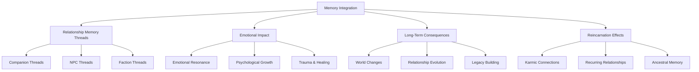

### 6.1 Relationship Memory Threads

The memory system tracks relationship data:

**Companion Memory Thread Example**
```json
{
  "companion_id": "daichi",
  "affinity": 65,
  "shared_experiences": [
    {
      "event": "saved_from_bandits",
      "impact": 10,
      "date": "Day 45"
    }
  ],
  "personal_quest": {
    "status": "active",
    "progress": 2,
    "total_stages": 5
  },
  "relationship_flags": {
    "betrayal": false,
    "romance": false,
    "rivalry_with": null
  },
  "combat_synergy": [
    {
      "ally_id": "hana",
      "synergy_ability": "Shadowflame Strike",
      "unlocked": true
    }
  ]
}
```

**NPC Memory Threads**
- Track interactions with significant NPCs
- Record favors done and promises made
- Store reputation with individuals and communities
- Remember important dialogue and choices

**Faction Memory Threads**
- Track standing with organizations
- Record contributions and betrayals
- Store special ranks or positions
- Remember conflicts and alliances

### 6.2 Emotional Impact & Reflection

Relationships create emotional depth:

**Emotional Resonance**
- Companions reflect on shared experiences
- NPCs reference your history together
- Emotional callbacks to significant moments
- Relationship milestones celebrated or mourned

**Psychological Growth**
- Characters evolve based on experiences with you
- Trauma can be processed and healed
- Values may shift through meaningful relationships
- Personal growth through conflict resolution

**The Great Sage's Commentary**
- Provides insight on relationship dynamics
- Offers emotional context for interactions
- Warns about potential relationship problems
- Celebrates meaningful connections

### 6.3 Long-Term Consequences

Relationships shape the world:

**World-Changing Relationships**
- Companions may rise to positions of power
- NPC allies can alter faction dynamics
- Enemies may gather forces against you
- Romantic partners may influence political landscapes

**Relationship Evolution**
- Companions grow and change over time
- Initial impressions can be overcome
- Trust once broken is difficult to repair
- Deep bonds withstand challenges

**Legacy Building**
- Your treatment of others defines your legacy
- Stories spread about your relationships
- Future generations remember your connections
- The world remembers both kindness and cruelty

### 6.4 Reincarnation Effects

Relationships transcend lifetimes:

**Karmic Connections**
- Strong bonds may persist across reincarnations
- Unresolved conflicts can reappear in new forms
- Debts of gratitude or vengeance span lifetimes
- Soul connections transcend physical forms

**Recurring Relationships**
- Meet descendants of former companions
- Encounter reincarnations of significant NPCs
- Face the consequences of past relationship choices
- Build on the foundation of previous lives

**Ancestral Memory**
- Places remember significant relationship events
- Items carry the emotional weight of past connections
- Dreams may reveal relationship echoes from past lives
- The world itself remembers powerful bonds and betrayals

## 7.0 Implementation Notes

This relationship system creates a dynamic, responsive social environment that reacts to player choices and integrates deeply with the narrative. Key aspects include:

### Core Mechanics
- Affinity system tracking relationship quality
- Companion autonomy and personal quests
- NPC behaviors and cultural factors
- Dialogue system with emotional impact

### Narrative Integration
- Relationships shape story outcomes
- Personal quests intertwine with main plot
- Emotional connections create meaningful stakes
- Memory threads preserve relationship history

### Development Focus
- Realistic relationship development and decay
- Meaningful consequences for relationship choices
- Deep integration with other game systems
- Balance between simulation and playability

The system maintains believability while creating opportunities for character development, moral choices, and emotional storytelling. Regular updates will refine relationship dynamics and expand social possibilities based on player engagement and world evolution.
