# Table of Contents
- [System: Dice Mechanics of Vantiel](#system-dice-mechanics-of-vantiel)
- [1. Overview](#1-overview)
- [2. Core Dice Mechanics](#2-core-dice-mechanics)
  - [2.1 Basic Roll Structure](#21-basic-roll-structure)
  - [2.2 Difficulty Classes (DC)](#22-difficulty-classes-dc)
  - [2.3 Modifiers](#23-modifiers)
  - [2.4 Critical Results](#24-critical-results)
- [3. Skill Check Mechanics](#3-skill-check-mechanics)
  - [3.1 Basic Skill Checks](#31-basic-skill-checks)
  - [3.2 Opposed Checks](#32-opposed-checks)
  - [3.3 Extended Checks](#33-extended-checks)
  - [3.4 Skill Synergy](#34-skill-synergy)
- [4. Combat Roll Mechanics](#4-combat-roll-mechanics)
  - [4.1 Attack Rolls](#41-attack-rolls)
  - [4.2 Damage Rolls](#42-damage-rolls)
  - [4.3 Defense Rolls](#43-defense-rolls)
  - [4.4 Initiative and Action Economy](#44-initiative-and-action-economy)
- [5. Magic Roll Mechanics](#5-magic-roll-mechanics)
  - [5.1 Spellcasting Checks](#51-spellcasting-checks)
  - [5.2 Magical Effect Resolution](#52-magical-effect-resolution)
- [6. Special Roll Situations](#6-special-roll-situations)
  - [6.1 Environmental Challenges](#61-environmental-challenges)
  - [6.2 Social Interaction Mechanics](#62-social-interaction-mechanics)
  - [6.3 Random Event Generation](#63-random-event-generation)
  - [6.4 Fate Point System](#64-fate-point-system)
- [7. Neural HUD Integration](#7-neural-hud-integration)
- [8.2 Philosophical Perspectives](#82-philosophical-perspectives)
- [8.3 Religious Interpretations](#83-religious-interpretations)
- [9. Realistic Failure Framework](#9-realistic-failure-framework)
  - [9.1 Failure Philosophy](#91-failure-philosophy)
  - [9.2 Hard Mode Implementation](#92-hard-mode-implementation)
  - [9.3 Game Master Guidelines](#93-game-master-guidelines)
  - [9.4 Context-Based Failure Determination](#94-context-based-failure-determination)
  - [9.5 Meaningful Recovery Options](#95-meaningful-recovery-options)
- [10. Conclusion](#10-conclusion)

# System: Dice Mechanics of Vantiel
## 1. Overview

The dice system in Vantiel provides a consistent framework for resolving uncertainty, determining success or failure, and adding an element of chance to gameplay. This system uses dice rolls to resolve skill checks, combat actions, magical effects, and other situations where outcomes are not predetermined. The mechanics are designed to be intuitive yet nuanced, allowing for a range of possibilities while maintaining balance and fairness.

```mermaid
flowchart TD
    A[Dice Mechanics] --> B[Core Mechanics]
    A --> C[Skill Checks]
    A --> D[Combat Rolls]
    A --> E[Magic Casting]
    A --> F[Special Situations]

    %% Cross-system arrows for audit compliance
    A --> G[Memory System]
    A --> H[Narrative System]
    A --> I[World System]
    A --> J[Relations System]
    A --> K[Journal System]
    A --> L[Meta Commands]
    A --> M[Combat System]
    A --> N[Skills System]
    A --> O[Survival System]

    B --> G1[Roll Types]
    B --> H1[Difficulty Classes]
    B --> I1[Modifiers]
    B --> J1[Critical Results]

    C --> K1[Attribute Checks]
    C --> L1[Skill Checks]
    C --> M1[Opposed Checks]
    C --> N1[Extended Checks]

    D --> O1[Attack Rolls]
    D --> P1[Damage Rolls]
    D --> Q1[Defense Rolls]
    D --> R1[Initiative]

    E --> S1[Spell Success]
    E --> T1[Magical Effects]
    E --> U1[Counterspelling]
    E --> V1[Ritual Casting]

    F --> W1[Environmental Challenges]
    F --> X1[Social Interactions]
    F --> Y1[Random Events]
    F --> Z1[Fate Points]

    style A fill:#f9f,stroke:#333,stroke-width:2px
    style G fill:#ffe599,stroke:#333,stroke-width:2px
    style H fill:#c9daf8,stroke:#333,stroke-width:2px
    style I fill:#b4a7d6,stroke:#333,stroke-width:2px
    style J fill:#f4cccc,stroke:#333,stroke-width:2px
    style K fill:#fce5cd,stroke:#333,stroke-width:2px
    style L fill:#d9ead3,stroke:#333,stroke-width:2px
    style M fill:#f4cccc,stroke:#333,stroke-width:2px
    style N fill:#d9ead3,stroke:#333,stroke-width:2px
    style O fill:#b6d7a8,stroke:#333,stroke-width:2px
```



## 2. Core Dice Mechanics

### 2.1 Basic Roll Structure

The fundamental structure of dice rolls in Vantiel follows a consistent pattern:

#### Standard Roll Format
- **Base Formula**: d20 + Modifiers vs. Difficulty Class (DC)
- **Success Condition**: Roll result equals or exceeds the DC
- **Failure Condition**: Roll result is less than the DC
- **Roll Notation**: Uses standard dice notation (e.g., d20, 2d6, 3d8)
- **Modifier Application**: All applicable modifiers are added to the die result

#### Roll Types
- **Standard Roll**: A single d20 roll with normal probability distribution
- **Advantage Roll**: Roll 2d20 and take the higher result (favorable circumstances)
- **Disadvantage Roll**: Roll 2d20 and take the lower result (unfavorable circumstances)
- **Flat Roll**: A roll without modifiers, used in special circumstances
- **Open Roll**: A roll where results are visible to all participants
- **Hidden Roll**: A roll where results are known only to the Game Master

#### Dice Varieties
- **d20**: Primary die for skill checks, attacks, and most action resolutions
- **d12**: Used for certain weapon damage and special abilities
- **d10**: Used for percentile rolls (d100) and certain damage types
- **d8**: Common for weapon damage and effect durations
- **d6**: Used for common damage, random tables, and many effects
- **d4**: Used for small weapon damage and minor effects
- **d100**: Percentile dice (2d10) for random tables and probability checks

### 2.2 Difficulty Classes (DC)

Difficulty Classes represent the challenge level of tasks and obstacles:

#### Standard DC Scale
| Difficulty | DC | Description |
|------------|----:|-------------|
| Trivial | 5 | Tasks so easy that most people succeed automatically |
| Easy | 10 | Tasks that untrained individuals can accomplish with some effort |
| Moderate | 15 | Tasks requiring training or talent to reliably accomplish |
| Challenging | 20 | Tasks that test the limits of trained individuals |
| Difficult | 25 | Tasks that only experts can reliably accomplish |
| Very Difficult | 30 | Tasks at the limit of human capability |
| Nearly Impossible | 35+ | Tasks beyond normal human limits, requiring exceptional circumstances |

#### DC Determination Factors
- **Inherent Difficulty**: The base challenge of the task itself
- **Circumstantial Factors**: Environmental conditions affecting the task
- **Time Pressure**: Urgency that may increase difficulty
- **Resource Limitations**: Restricted tools or materials
- **Consequences of Failure**: Higher stakes may increase difficulty

#### Special DC Types
- **Opposed DC**: Set by an opponent's roll or static value
- **Hidden DC**: Unknown to players until after the roll
- **Tiered DC**: Different levels of success based on how much the roll exceeds the base DC
- **Progressive DC**: Increasing difficulty for repeated attempts
- **Compound DC**: Requiring multiple successful rolls for complete success

### 2.3 Modifiers

Modifiers adjust dice rolls to reflect character capabilities, circumstances, and other factors:

#### Character-Based Modifiers
- **Attribute Modifiers**: Bonuses from primary character statistics
- **Skill Ranks**: Bonuses from trained skills
- **Class Abilities**: Bonuses from class features and specializations
- **Equipment Bonuses**: Advantages from tools, weapons, and gear
- **Experience Bonuses**: Advantages from having performed similar tasks before

#### Circumstantial Modifiers
- **Environmental Factors**: Weather, terrain, lighting conditions
- **Preparation**: Benefits from planning and setup
- **Assistance**: Help from allies or tools
- **Impairments**: Injuries, exhaustion, or distractions
- **Tactical Advantages**: Positioning, timing, or strategic benefits

#### Stacking Rules
- **Same-Type Modifiers**: Generally don't stack; use only the highest
- **Different-Type Modifiers**: Stack with each other
- **Temporary Modifiers**: Duration-limited bonuses or penalties
- **Conditional Modifiers**: Apply only in specific circumstances
- **Scaling Modifiers**: Change based on degree of advantage/disadvantage

#### Modifier Limits
- **Maximum Modifier**: Total modifiers cannot exceed +20
- **Minimum Result**: A natural roll of 1 always fails regardless of modifiers
- **Maximum Result**: A natural roll of 20 always succeeds regardless of modifiers
- **Cancellation**: Advantage and disadvantage cancel each other out
- **Diminishing Returns**: Multiple sources of the same modifier type have reduced effect

#### Hard Mode Modifier Adjustments
- **Stricter Limits**: Maximum positive modifiers reduced to +15
- **Harsher Penalties**: Negative modifiers apply at 1.5× their normal value
- **Extended Failure Range**: Natural rolls of 1-3 count as critical failures
- **Reduced Critical Success**: Only natural 20s count as critical successes
- **Compounding Failures**: Failed checks may apply penalties to subsequent related checks

### 2.4 Critical Results

Critical results represent exceptionally good or bad outcomes:

#### Critical Success
- **Trigger**: Natural roll of 20 on d20
- **Effect**: Exceptional success beyond normal parameters
- **Combat Application**: Doubled damage dice on attacks
- **Skill Application**: Additional benefits beyond basic success
- **Special Abilities**: May modify critical success conditions or effects
- **Narrative Impact**: Described with special cinematic flair and lasting effects

#### Critical Failure
- **Trigger**: Natural roll of 1 on d20 (or 1-3 in Hard Mode)
- **Effect**: Exceptional failure with additional negative consequences
- **Combat Application**: Weapon fumble, loss of balance, or self-injury
- **Skill Application**: Complications or setbacks beyond basic failure
- **Recovery Options**: Methods to mitigate critical failure effects
- **Narrative Consequence**: Creates meaningful story complications or character development

#### Extended Critical Range
- **Expanded Success Range**: Some abilities allow critical success on 19-20 or even 18-20
- **Expanded Failure Range**: Some challenging situations expand failure range to 1-2
- **Confirmation Rolls**: Secondary roll to confirm critical results in some situations
- **Critical Specialization**: Class abilities that enhance critical effects
- **Critical Resistance**: Abilities or circumstances that reduce critical vulnerability

#### Graduated Success/Failure System

To create more nuanced outcomes, the dice system employs graduated results:

| Roll Type | Outcome | Description |
|-----------|---------|-------------|
| Natural 20 (Critical Success) | Exceptional Success | Far exceeds expectations with additional benefits |
| Beat DC by 10+ | Outstanding Success | Achieves goal with significant additional advantages |
| Beat DC by 5-9 | Strong Success | Accomplishes task with minor additional benefits |
| Beat DC by 1-4 | Basic Success | Just accomplishes the intended goal |
| Miss DC by 1-4 | Minor Failure | Just falls short, with option to recover |
| Miss DC by 5-9 | Clear Failure | Definitely fails but without disaster |
| Miss DC by 10+ | Major Failure | Fails with additional complications |
| Natural 1 (Critical Failure) | Catastrophic Failure | Worst possible outcome with lasting consequences |

**Hard Mode Adjustment:** In Hard Mode, the success thresholds increase by +5 DC, and critical failure range expands to natural 1-3 on the dice.

## 3. Skill Check Mechanics

### 3.1 Basic Skill Checks

The fundamental method for resolving non-combat challenges:

#### Skill Check Formula
- **Basic Formula**: d20 + Skill Rank + Attribute Modifier + Other Modifiers vs. DC
- **Skill Rank**: Character's training level in the relevant skill (0-10)
- **Relevant Attribute**: The primary attribute associated with the skill
- **Circumstantial Modifiers**: Adjustments for situation, equipment, etc.
- **Specialization Bonuses**: Additional bonuses for specialized training

#### Skill Check Process
1. **Identify Relevant Skill**: Determine which skill applies to the task
2. **Establish DC**: Set difficulty based on task complexity
3. **Apply Modifiers**: Calculate all applicable bonuses and penalties
4. **Roll d20**: Add the result to all modifiers
5. **Compare to DC**: Determine success or failure
6. **Describe Outcome**: Narrate the result based on degree of success or failure

#### Degree of Success
- **Marginal Success**: Meets DC exactly or by 1-2 points
- **Solid Success**: Exceeds DC by 3-5 points
- **Exceptional Success**: Exceeds DC by 6-9 points
- **Phenomenal Success**: Exceeds DC by 10+ points
- **Marginal Failure**: Misses DC by 1-2 points
- **Clear Failure**: Misses DC by 3-5 points
- **Significant Failure**: Misses DC by 6+ points

#### Common Skill Applications
- **Perception**: Noticing hidden objects or creatures
- **Stealth**: Moving without being detected
- **Athletics**: Physical feats of strength and endurance
- **Acrobatics**: Balance, tumbling, and agility
- **Knowledge**: Recalling or applying specific information

### 3.2 Opposed Checks

Skill checks directly contested by another character:

#### Opposed Check Formula
- **Basic Structure**: Character A's skill check vs. Character B's skill check
- **Success Condition**: Higher result wins the contest
- **Tie Resolution**: Advantage goes to the defending or reacting character
- **Margin of Victory**: Difference between the two results
- **Repeated Contests**: Rules for ongoing opposed situations

#### Common Opposed Checks
- **Stealth vs. Perception**: Hiding from detection
- **Athletics vs. Athletics**: Wrestling or physical contests
- **Deception vs. Insight**: Lying or misleading
- **Persuasion vs. Will**: Convincing or intimidating
- **Spellcraft vs. Spellcraft**: Magical duels or counterspelling

#### Special Opposed Rules
- **Passive Opposition**: Using a static value (10 + modifiers) instead of rolling
- **Group Opposition**: One character against multiple opponents
- **Assisted Opposition**: Allies providing help to either side
- **Contextual Advantages**: Environmental or situational benefits
- **Skill Synergy**: Using complementary skills to gain advantage

### 3.3 Extended Checks

Complex tasks requiring multiple rolls or sustained effort:

#### Extended Check Structure
- **Success Threshold**: Total number of successes needed
- **Time Frame**: Duration of each attempt
- **Failure Threshold**: Number of failures that end the attempt
- **Progressive Difficulty**: Increasing DC for subsequent rolls
- **Resource Consumption**: Materials or energy expended per attempt

#### Extended Check Applications
- **Research**: Gathering information over time
- **Crafting**: Creating items or structures
- **Social Influence**: Gradually winning over NPCs
- **Tracking**: Following trails over long distances
- **Ritual Magic**: Spells requiring sustained concentration

#### Extended Check Variations
- **Countdown Checks**: Racing against a time limit
- **Collaborative Checks**: Multiple characters contributing to the same task
- **Parallel Checks**: Multiple related tasks that must all succeed
- **Escalating Stakes**: Increasing consequences for failure as the task progresses
- **Partial Success**: Benefits for achieving some but not all required successes

### 3.4 Skill Synergy

How skills can complement and enhance each other:

#### Synergy Mechanics
- **Complementary Skills**: Using one skill to gain advantage on another
- **Preparation Bonus**: Using one skill to set up a bonus for a later check
- **Knowledge Application**: Using information skills to enhance practical skills
- **Team Synergy**: Different characters using complementary skills
- **Cross-Discipline Insights**: Unexpected skill combinations for creative solutions

#### Synergy Examples
- **Knowledge (Architecture) + Athletics**: Climbing a building more effectively
- **Survival + Medicine**: Enhanced wilderness healing
- **Performance + Persuasion**: More compelling arguments
- **Stealth + Acrobatics**: More effective infiltration
- **Arcana + Crafting**: Creating items with magical properties

## 4. Combat Roll Mechanics

### 4.1 Attack Rolls

The system for determining if attacks hit their targets:

#### Attack Roll Formula
- **Basic Formula**: d20 + Attack Bonus vs. Target's Defense
- **Attack Bonus Components**: Attribute modifier + Proficiency + Weapon bonus + Situational modifiers
- **Weapon Specialization**: Additional bonuses for favored weapons
- **Range Considerations**: Penalties for distance or obstructions
- **Position Factors**: Bonuses for advantageous positioning

#### Special Attack Situations
- **Surprise Attacks**: Advantage when target is unaware
- **Called Shots**: Targeting specific body parts (higher DC, greater effect)
- **Area Attacks**: Affecting multiple targets with a single roll
- **Touch Attacks**: Bypassing armor (lower DC)
- **Grappling**: Special rules for grabbing and restraining

#### Critical Hit Effects
- **Damage Multiplication**: Double damage dice on critical hits
- **Special Effects**: Additional effects based on weapon type
- **Critical Specialization**: Class-specific critical enhancements
- **Confirmation System**: Secondary roll to verify critical hits in some situations
- **Critical Defense**: Abilities that reduce critical hit vulnerability

### 4.2 Damage Rolls

The system for determining how much harm attacks inflict:

#### Damage Roll Formula
- **Basic Formula**: Weapon Dice + Attribute Modifier + Bonuses
- **Weapon Dice**: Varies by weapon type (e.g., 1d6, 2d4, 1d12)
- **Attribute Application**: Strength for melee, Dexterity for ranged (with exceptions)
- **Damage Types**: Physical (slashing, piercing, bludgeoning) and magical (fire, cold, etc.)
- **Resistance/Vulnerability**: Some targets take reduced or increased damage from certain types

#### Special Damage Considerations
- **Minimum Damage**: Successful attacks always deal at least 1 point of damage
- **Maximum Potential**: Limits on how much damage can be enhanced
- **Persistent Damage**: Effects that continue over multiple rounds
- **Nonlethal Damage**: Attacks that incapacitate without killing
- **Structural Damage**: Rules for damaging objects and structures

#### Damage Modifiers
- **Precision Damage**: Extra damage from hitting vulnerable spots
- **Elemental Damage**: Additional damage of a specific energy type
- **Situational Bonuses**: Extra damage from positioning or circumstances
- **Weapon Properties**: Special damage features of specific weapons
- **Class Abilities**: Damage enhancements from class features

### 4.3 Defense Rolls

The system for avoiding or reducing incoming damage:

#### Defense Types
- **Armor Class (AC)**: Primary defense against physical attacks
- **Saving Throws**: Defenses against spells, traps, and special attacks
- **Active Defense**: Optional system where defender rolls to avoid attacks
- **Damage Reduction**: Abilities that decrease damage from successful hits
- **Immunity**: Complete protection against specific damage types or effects

#### Defense Formulas
- **AC Formula**: 10 + Armor bonus + Shield bonus + Dexterity modifier + Other modifiers
- **Saving Throw Formula**: d20 + Attribute modifier + Proficiency + Other modifiers
- **Active Defense Formula**: d20 + Defense bonus vs. Attack roll
- **Damage Reduction Formula**: Damage - DR value (minimum 0)
- **Resistance Formula**: Damage × Resistance percentage

#### Special Defensive Actions
- **Dodge**: Focused defense against a single attack
- **Parry**: Using a weapon to block an incoming attack
- **Cover**: Protection from obstacles or terrain
- **Evasion**: Completely avoiding area effects on successful saves
- **Interception**: Taking an attack meant for another character

### 4.4 Initiative and Action Economy

The system for determining combat order and available actions:

#### Initiative System
- **Initiative Formula**: d20 + Dexterity modifier + Other modifiers
- **Group Initiative**: Option for allied characters to act in a coordinated block
- **Surprise Round**: Special round when some participants are caught unaware
- **Initiative Adjustment**: Abilities or circumstances that modify initiative during combat
- **Delayed Actions**: Choosing to act later in the initiative order

#### Action Types
- **Standard Action**: Primary action (attack, cast spell, use skill)
- **Move Action**: Movement up to speed or simple manipulation
- **Swift Action**: Quick, minor action
- **Reaction**: Action taken in response to a trigger, outside normal turn
- **Full-Round Action**: Consuming all actions for a powerful effect

#### Action Limitations
- **Action Points**: Resource limiting available actions per round
- **Speed Factors**: Some actions require more time to execute
- **Concentration Requirements**: Actions that demand focus
- **Interruption Rules**: When actions can be disrupted
- **Readied Actions**: Preparing to act in response to a specific trigger

## 5. Magic Roll Mechanics

### 5.1 Spellcasting Checks

The system for determining the success of magical abilities:

#### Casting Check Formula
- **Basic Formula**: d20 + Casting modifier vs. Spell DC
- **Casting Modifier Components**: Attribute modifier + Proficiency + Focus bonus + Other modifiers
- **Spell DC Factors**: Spell level, complexity, and opposing forces
- **Concentration Checks**: Maintaining spells under duress
- **Casting in Armor**: Penalties for casting while encumbered

#### Spell Success Degrees
- **Standard Success**: Spell functions as intended
- **Enhanced Success**: Exceeding DC by 5+ improves spell effect
- **Partial Success**: Some spells have reduced effect on near misses
- **Critical Success**: Doubled effect, duration, or other enhancement
- **Critical Failure**: Spell backfire or unintended consequences

#### Special Casting Situations
- **Ritual Casting**: Extended, more powerful casting method
- **Cooperative Casting**: Multiple casters combining their power
- **Counterspelling**: Negating another caster's spell
- **Metamagic**: Modifying spells for enhanced effects
- **Wild Magic**: Unpredictable magical results in certain conditions

### 5.2 Magical Effect Resolution

How magical effects interact with targets and the environment:

#### Targeted Spell Resolution
- **Attack-Based Spells**: Require attack rolls against target's defenses
- **Save-Based Spells**: Allow targets to make saving throws to resist
- **Area Effect Spells**: Affect all targets in a defined area
- **Buff/Debuff Spells**: Enhance allies or hinder enemies
- **Utility Spells**: Create effects that change the environment

#### Spell Resistance
- **Resistance Check Formula**: d20 + Caster level vs. Target's Spell Resistance
- **Innate Resistance**: Natural ability to shrug off magic
- **Protective Magic**: Spells that grant temporary resistance
- **Resistance Penetration**: Abilities that overcome spell resistance
- **Selective Resistance**: Protection against specific magical schools or effects

#### Magical Damage
- **Elemental Types**: Fire, cold, lightning, acid, etc.
- **Force Damage**: Pure magical energy
- **Psychic Damage**: Mental or spiritual harm
- **Radiant/Necrotic**: Divine/unholy energies
- **Poison/Disease**: Toxic or corrupting effects

## 6. Special Roll Situations

### 6.1 Environmental Challenges

How dice mechanics handle natural hazards and conditions:

#### Environmental Hazard Checks
- **Extreme Weather**: Endurance checks against cold, heat, storms
- **Difficult Terrain**: Movement and balance checks
- **Natural Disasters**: Avoiding or surviving catastrophic events
- **Environmental Damage**: Effects of exposure, falls, drowning
- **Navigation Challenges**: Finding paths through wilderness or darkness

#### Environmental DCs
| Condition | DC | Example |
|-----------|----:|---------|
| Mild | 10 | Light rain, uneven ground |
| Moderate | 15 | Heavy rain, rough terrain |
| Severe | 20 | Thunderstorm, treacherous ground |
| Extreme | 25 | Blizzard, earthquake, vertical cliff |
| Catastrophic | 30 | Hurricane, avalanche, volcanic eruption |

#### Survival Mechanics
- **Exposure Checks**: Resisting environmental damage over time
- **Foraging Rolls**: Finding food and water
- **Shelter Checks**: Creating or finding protection
- **Navigation Rolls**: Avoiding becoming lost
- **Tracking Checks**: Following trails or signs

### 6.2 Social Interaction Mechanics

How dice mechanics handle interpersonal challenges:

#### Social Check Types
- **Persuasion**: Convincing others through logical or emotional appeal
- **Deception**: Misleading or lying convincingly
- **Intimidation**: Influencing through fear or threat
- **Insight**: Reading intentions and detecting lies
- **Performance**: Entertaining or impressing others

#### Social DC Factors
- **NPC Attitude**: Initial disposition toward the character
- **Request Reasonableness**: How much the NPC must compromise
- **Risk/Reward**: What the NPC stands to gain or lose
- **Alignment/Values**: How the request aligns with NPC beliefs
- **Social Standing**: Relative status between character and NPC

#### Social Interaction Outcomes
- **Attitude Shift**: Improving or worsening NPC disposition
- **Information Gain**: Learning secrets or useful knowledge
- **Assistance**: Securing help or resources
- **Access**: Gaining entry to restricted areas or groups
- **Relationship Development**: Building lasting connections

### 6.3 Random Event Generation

Using dice to create unpredictable situations and outcomes:

#### Random Table Mechanics
- **d100 Tables**: Percentile-based random outcomes
- **Weighted Tables**: Some results more likely than others
- **Nested Tables**: Results that lead to secondary rolls
- **Condition-Modified Tables**: Results affected by circumstances
- **Progressive Tables**: Results that build on previous outcomes

#### Common Random Applications
- **Encounter Generation**: Determining what creatures appear
- **Weather Determination**: Daily or hourly conditions
- **Loot Generation**: Treasure and reward determination
- **NPC Reactions**: Unpredictable responses to player actions
- **Complication Introduction**: Unexpected twists in situations

#### Random Event Integration
- **Narrative Consistency**: Ensuring random elements fit the story
- **Player Agency**: Balancing randomness with player choices
- **Preparation vs. Improvisation**: Using random tables to generate content
- **Probability Management**: Controlling likelihood of different outcomes
- **Result Interpretation**: Translating random results into meaningful events

### 6.4 Fate Point System

A meta-resource allowing limited influence over dice outcomes:

#### Fate Point Mechanics
- **Acquisition**: How characters earn Fate Points
- **Expenditure**: Ways to use Fate Points
- **Refresh Rate**: How Fate Points replenish
- **Maximum Pool**: Limits on Fate Point accumulation
- **Special Abilities**: Character features that interact with Fate Points

#### Fate Point Uses
- **Reroll**: Discarding an unfavorable result and rolling again
- **Bonus**: Adding +3 to a roll after seeing the result
- **Inspiration**: Gaining advantage on a critical roll
- **Heroic Effort**: Succeeding automatically on a standard check
- **Plot Twist**: Introducing a favorable narrative element

#### Fate Point Economy
- **Earning Through Setbacks**: Gaining points by accepting complications
- **Milestone Awards**: Receiving points at story benchmarks
- **Character Aspects**: Traits that can be invoked or compelled for points
- **Group Pool**: Shared resources for team efforts
- **Dramatic Moments**: Special situations that allow fate point generation

## 7. Neural HUD Integration

The dice system integrates with the Neural HUD to provide players with real-time information about probabilities, modifiers, and outcomes.

### 7.1 Roll Probability Display

The Neural HUD provides statistical information about potential roll outcomes:

#### Probability Visualization
- **Success Chance**: Percentage probability of meeting or exceeding the DC
- **Outcome Distribution**: Visual representation of possible results
- **Critical Chance**: Probability of critical success or failure
- **Comparative Analysis**: How current modifiers affect probabilities
- **Historical Performance**: Pattern of past rolls in similar situations


### 8.2 Philosophical Perspectives

Various philosophical schools in Vantiel have different interpretations of chance and fate:

- **Determinists**: Believe all outcomes are predetermined, with dice merely revealing destiny
- **Probabilists**: Study the patterns of chance, seeking to understand and predict outcomes
- **Fateweavers**: Claim to manipulate the threads of possibility through ritual and sacrifice
- **Chaosborn**: Embrace randomness as the only true freedom in an ordered world
- **Balancers**: See success and failure as necessary counterweights in a harmonious universe

### 8.3 Religious Interpretations

The major religions of Vantiel incorporate chance and fate into their doctrines:

- **The Radiant Covenant**: Teaches that the Goddess rewards the faithful with favorable outcomes
- **Old Faith**: Believes that nature spirits influence chance based on one's harmony with the natural world
- **Void Cults**: Claim that manipulating probability is possible by drawing power from the void
- **Ancestor Worship**: Holds that the spirits of ancestors can influence dice rolls to aid their descendants

## 9. Realistic Failure Framework

The dice system integrates with the Narrative Tension System to create meaningful failures that enhance the story rather than simply punishing players.

```mermaid
flowchart TD
    A[Realistic Failure Framework] --> B[Failure Types]
    A --> C[Recovery Options]
    A --> D[Narrative Integration]
    A --> E[Failure Progression]

    B --> B1[Skill Failures]
    B --> B2[Equipment Failures]
    B --> B3[Environmental Failures]
    B --> B4[Physical Limitations]

    C --> C1[Immediate Recovery]
    C --> C2[Alternative Approaches]
    C --> C3[Assistance Options]
    C --> C4[Resource Expenditure]

    D --> D1[Character Development]
    D --> D2[Story Complications]
    D --> D3[World Reactions]
    D --> D4[Memory Creation]

    E --> E1[Learning Curve]
    E --> E2[Pattern Recognition]
    E --> E3[Adaptive Difficulty]
    E --> E4[Contextual Failure]
```



### 9.1 Failure Philosophy

The dice system is designed to create failures that:

- **Advance the Narrative**: Failures push the story in new directions rather than stalling it
- **Reveal Character**: How characters respond to failure reveals their true nature
- **Create Tension**: Moments of failure build dramatic tension and investment
- **Teach and Guide**: Failures provide information about better approaches
- **Feel Fair**: Even when outcomes are negative, they should feel like reasonable consequences

### 9.2 Hard Mode Implementation

Hard Mode enforces a stricter and more realistic approach to the dice system:

- **Mandatory Rolls**: All significant actions require explicit dice rolls
- **Stricter DCs**: Base difficulty class values increase by +5 across the board
- **Expanded Critical Failure**: Natural rolls of 1-3 count as critical failures
- **Resource Management**: Stamina, item durability, and other resources deplete more quickly
- **Injury Persistence**: Wounds inflict ongoing penalties until properly treated
- **Realistic Limitations**: Physical and mental limitations are strictly enforced
- **Compounding Failures**: Failed checks in sequence become progressively more difficult

### 9.3 Game Master Guidelines

When determining failure through dice:

1. **Consider Context Fully**: Weigh all relevant factors before setting DC
2. **Offer Graduated Consequences**: Match the severity of failure to the die result
3. **Provide Recovery Paths**: Almost every failure should have some recovery option
4. **Make It Interesting**: Failures should never be mere obstacles but story opportunities
5. **Maintain Internal Logic**: Failures should make sense within the world's rules
6. **Balance Challenge**: Adjust failure frequency based on story pacing and tension
7. **Remember Character Growth**: A character's history with similar tasks affects failure chances

### 9.4 Context-Based Failure Determination

The Narrative Tension System considers numerous factors when determining if an action fails:

- **Character Skill Level**: Higher skill reduces but doesn't eliminate failure chance
- **Previous Success Streak**: A series of successes increases failure probability
- **Environmental Conditions**: Weather, terrain, and other external factors
- **Physical/Mental State**: Injury, fatigue, stress, and other internal conditions
- **Preparation Quality**: Research, planning, and proper equipment
- **Narrative Importance**: How central the action is to the current storyline
- **Hard Mode Status**: Whether strict realism is being enforced

**Example Assessment:**
```
[Lockpicking Assessment - Hidden]
• Character Skill: Expert thief (+)
• Previous Success: Four consecutive successful lockpicks (-)
• Environmental: Dark night, rain-slicked fingers (-)
• Physical State: Slightly injured shoulder from earlier fall (-)
• Preparation: Has proper tools, studied lock beforehand (+)
• Narrative Importance: Critical story path (+)
• Hard Mode: Not active
• Net Assessment: Moderate failure chance (35%)

[Result]
Your lockpicks slide into the mechanism with practiced ease, but as you apply pressure to the final tumbler, your injured shoulder twinges unexpectedly. Your hand jerks slightly, and you feel one of your delicate picks bend. The lock is still functional, but this particular pick is now useless, and you'll need to start the process over with a different tool.
```

### 9.5 Meaningful Recovery Options

The system ensures that failures provide interesting recovery paths:

- **Second Attempts**: Often allowed with penalty or resource cost
- **Alternative Methods**: Different approaches that bypass the original challenge
- **Assistant Options**: Ways that allies or NPCs can help overcome failure
- **Resource Solutions**: Items or energy that can be expended to succeed despite failure
- **Narrative Workarounds**: Story-based solutions that emerge from the failure itself

**Example Recovery:**
```
[Failed Athletics Check to Climb Wall]

The stone wall proves more challenging than you anticipated. Halfway up, your foot slips on a loose stone, and you slide painfully back to the ground, scraping your hands in the process.

Recovery Options:
1. Try again with a higher DC and minor injury penalty
2. Look for a different entry point (alternate path)
3. Use rope and grappling hook from inventory (resource solution)
4. Ask your companion for assistance (assistance option)
5. Wait for the guard patrol to change and try the gate instead (narrative workaround)
```

## 10. Conclusion

The dice system serves as the foundation for resolving uncertainty in Vantiel, providing a balanced framework that combines skill, circumstance, and chance. By integrating with all other systems and maintaining narrative immersion, it creates a cohesive experience where every roll tells a story and shapes the world in meaningful ways.

Remember that in Vantiel, dice rolls are not merely mechanical abstractions but representations of the world's inherent unpredictability—a concept understood by all its inhabitants. From the humblest farmer to the mightiest warrior, everyone in Vantiel recognizes that while skill and preparation improve one's chances, fate always has the final say.
