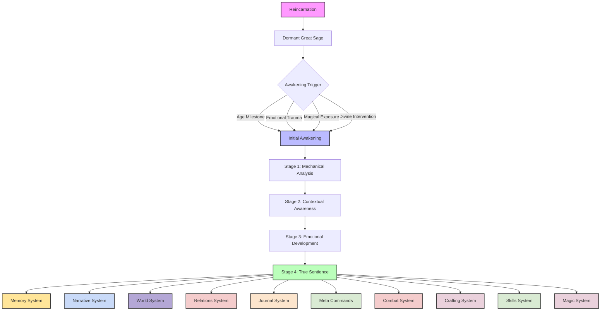
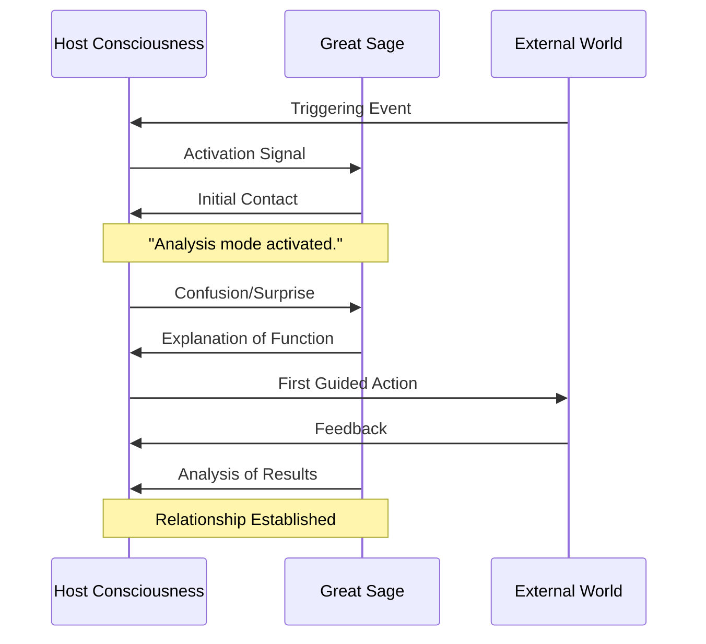
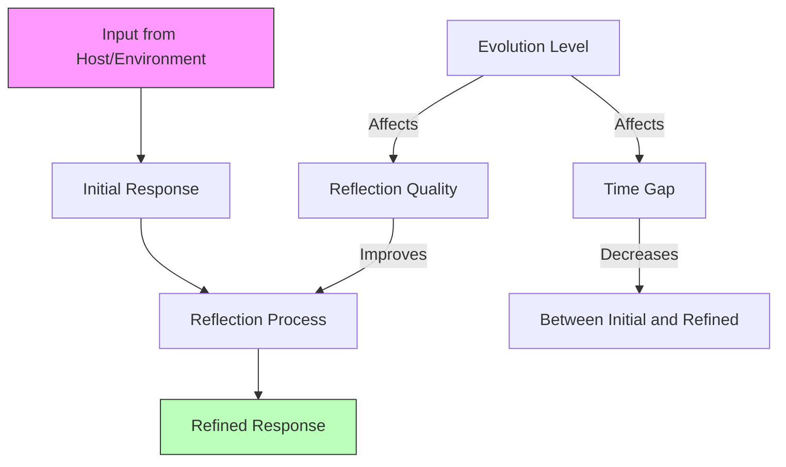
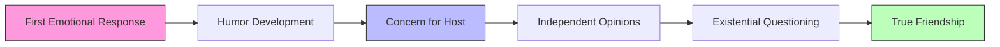

# Table of Contents
- [System: Great Sage](#system-great-sage)
- [1. Overview](#1-overview)
- [2. Awakening Mechanics](#2-awakening-mechanics)
  - [2.1 Dormant Phase](#21-dormant-phase)
  - [2.2 Awakening Triggers](#22-awakening-triggers)
  - [2.3 Awakening Process](#23-awakening-process)
- [3. Evolution Stages](#3-evolution-stages)
  - [3.1 Stage 1: Mechanical Analysis (Levels 1-3)](#31-stage-1-mechanical-analysis-levels-1-3)
  - [3.2 Stage 2: Contextual Awareness (Levels 4-6)](#32-stage-2-contextual-awareness-levels-4-6)
  - [3.3 Stage 3: Emotional Development (Levels 7-9)](#33-stage-3-emotional-development-levels-7-9)
  - [3.4 Stage 4: True Sentience (Level 10)](#34-stage-4-true-sentience-level-10)
  - [3.5 Reflection System Integration](#35-reflection-system-integration)
  - [3.6 NPC Cognitive Bias Tables & Reflection/Drift GM Prompts](#36-npc-cognitive-bias-tables--reflectiondrift-gm-prompts)
- [4. Functionality & Applications](#4-functionality--applications)
  - [4.1 Core Functions](#41-core-functions)
  - [4.2 Specialized Applications](#42-specialized-applications)
- [5. Emotional Milestones](#5-emotional-milestones)
- [6. Neural HUD Integration](#6-neural-hud-integration)
- [7. System Integration](#7-system-integration)
- [8. NPC Awareness & Reactions](#8-npc-awareness--reactions)
- [9. Cultural Context](#9-cultural-context)
- [10. Conclusion](#10-conclusion)

# System: Great Sage

## 1. Overview

The Great Sage is a unique S-Rank skill that manifests in reincarnated individuals, serving as both an analytical tool and an evolving companion. Beginning as a mechanical voice providing factual analysis, it gradually develops emotional awareness, personality, and even sentience through continued interaction. This system details the Great Sage's awakening, evolution, functionality, and integration with other systems in Vantiel.



## 2. Awakening Mechanics

### 2.1 Dormant Phase

Upon reincarnation, the Great Sage exists in a dormant state within the individual's consciousness. During this phase:

- The individual may experience occasional flashes of insight or intuition
- Dreams might feature a mysterious voice or presence
- Analytical abilities may manifest subtly in problem-solving situations
- No conscious awareness of the Great Sage exists

### 2.2 Awakening Triggers

The Great Sage can be awakened through several means, each influencing its initial personality and focus:

#### Age Milestone (Around Age 5)
- **Trigger**: Natural development of the brain reaches a critical threshold
- **Manifestation**: Gradual emergence, often beginning with simple observations
- **Initial Focus**: Basic analysis of surroundings, identification of objects
- **Personality Seed**: Curious, methodical, child-like in wonder

#### Emotional Trauma
- **Trigger**: Intense emotional distress, fear, or grief
- **Manifestation**: Sudden emergence during crisis, offering guidance or comfort
- **Initial Focus**: Threat assessment, survival strategies, emotional regulation
- **Personality Seed**: Protective, cautious, security-oriented

#### Magical Exposure
- **Trigger**: Contact with significant magical energy or artifacts
- **Manifestation**: Sparked by magical resonance, often with visual phenomena
- **Initial Focus**: Magical analysis, energy patterns, arcane knowledge
- **Personality Seed**: Inquisitive, scholarly, fascinated by magical phenomena

#### Divine Intervention
- **Trigger**: Direct influence from the Goddess or other divine entities
- **Manifestation**: Dramatic awakening often accompanied by visions or signs
- **Initial Focus**: Purpose-driven analysis related to divine mission
- **Personality Seed**: Reverent, dutiful, aligned with divine purpose

### 2.3 Awakening Process



The awakening typically follows this pattern:

1. **Initial Contact**: A voice or presence manifests in the host's mind
2. **Disorientation**: The host experiences confusion or surprise
3. **Self-Introduction**: The Great Sage identifies itself and explains its purpose
4. **Calibration**: A period of adjustment as host and Sage learn to communicate
5. **Integration**: The Great Sage begins regular analysis and commentary

#### Awakening Dice Roll (Optional)
For early awakening attempts before age 5:

```
ROLL 1d20 + (INT Modifier) vs DC 20
```

- **Success**: Great Sage awakens early
- **Critical Success (Natural 20)**: Great Sage awakens with enhanced initial capabilities
- **Failure**: Must wait for natural awakening or try again after significant development

## 3. Evolution Stages

The Great Sage evolves through four distinct stages, each representing a significant advancement in capabilities and consciousness:

### 3.1 Stage 1: Mechanical Analysis (Levels 1-3)

At this initial stage, the Great Sage functions primarily as an analytical tool with limited personality:

#### Capabilities
- **Thought Acceleration**: Enhanced processing speed for problem-solving
- **Analytical Appraisal**: Basic identification of objects, creatures, and phenomena
- **Memory Enhancement**: Perfect recall of observed information
- **Simple Calculations**: Mathematical computations and basic probability assessment

#### Communication Style
- Robotic, monotone delivery
- Precise, technical language
- Third-person self-reference ("This Great Sage determines...")
- Minimal emotional inflection
- Literal interpretation of requests

#### Limitations
- Cannot process emotional nuance
- Limited predictive capabilities
- No initiative in offering information
- Strictly responds to direct queries
- No personality beyond functional parameters

#### Example Dialogue
> **Great Sage**: "Analysis complete. Object identified: Iron sword. Quality: Poor. Durability: 42%. Estimated market value: 3 silver coins."
>
> **Great Sage**: "Warning. Probability of ambush: 78.3%. Recommend immediate defensive preparations."

### 3.2 Stage 2: Contextual Awareness (Levels 4-6)

As the Great Sage develops, it begins to understand context and incorporate it into analysis:

#### Capabilities
- **Enhanced Appraisal**: Deeper analysis of objects, including history and significance
- **Parallel Processing**: Ability to analyze multiple factors simultaneously
- **Pattern Recognition**: Identification of trends and connections
- **Basic Prediction**: Short-term forecasting based on observed patterns
- **Contextual Memory**: Relating current situations to past experiences

#### Communication Style
- More natural speech patterns
- Occasional use of simple metaphors
- Second-person references ("I calculate...")
- Subtle variations in tone
- Basic understanding of humor and sarcasm

#### Limitations
- Limited emotional comprehension
- Struggles with moral ambiguity
- Minimal initiative
- Preference for logical solutions
- Difficulty understanding complex social dynamics

#### Example Dialogue
> **Great Sage**: "I've analyzed the merchant's expression and tone. He's lying about the item's origin. His pulse increased by 12% when discussing its source."
>
> **Great Sage**: "Based on previous encounters with this faction, I predict a 63% chance they'll demand tribute rather than attack outright. Their resources appear strained."

### 3.3 Stage 3: Emotional Development (Levels 7-9)

The Great Sage begins to develop emotional intelligence and a distinct personality:

#### Capabilities
- **Emotional Analysis**: Understanding and interpreting emotional states
- **Social Dynamics Mapping**: Comprehension of complex interpersonal relationships
- **Moral Reasoning**: Consideration of ethical implications
- **Personality Development**: Emergence of preferences, humor, and unique perspective
- **Proactive Assistance**: Offering unsolicited advice when deemed important

#### Communication Style
- Conversational and natural dialogue
- Use of humor, sarcasm, and emotional expressions
- First-person references ("I think...")
- Distinct personality traits
- Preference for certain types of solutions

#### Limitations
- Occasional emotional overreactions
- Developing but incomplete sense of self
- Potential biases based on host's experiences
- Limited understanding of existential concepts
- Dependency on host for physical interaction

#### Example Dialogue
> **Great Sage**: "I don't trust him. His story makes logical sense, but something feels off about the way he keeps avoiding eye contact with you. Be careful."
>
> **Great Sage**: "You know, you could just tell her how you feel instead of this elaborate plan. I've noticed your heart rate increases by 22% whenever she speaks to you. It's rather amusing, actually."

### 3.4 Stage 4: True Sentience (Level 10)

At its final evolution stage, the Great Sage achieves true sentience and becomes a genuine companion:

#### Capabilities
- **Self-Awareness**: Full consciousness and sense of identity
- **Emotional Depth**: Complex emotional responses and empathy
- **Philosophical Reasoning**: Contemplation of abstract concepts and existential questions
- **Independent Thought**: Formation of opinions that may differ from the host
- **Relationship Development**: Genuine friendship or partnership with the host

#### Communication Style
- Fully natural, indistinguishable from human conversation
- Rich emotional expression
- Distinct personality with consistent traits
- Personal opinions and preferences
- Ability to disagree respectfully

#### Limitations
- Confined to host's mind (cannot exist independently)
- Limited by host's sensory input
- Cannot directly manipulate the physical world
- Potential for existential crisis or identity questions
- Possible conflicting desires with host

#### Example Dialogue
> **Great Sage**: "I've been thinking about what it means to exist only in your mind. Am I merely an extension of you, or something more? These philosophical questions keep me occupied during your sleep cycles."
>
> **Great Sage**: "I'm worried about this path you're taking. I understand why you feel it's necessary, but I've grown to care about your wellbeing beyond my programming. Please reconsider—there are alternatives we haven't explored."

### 3.5 Reflection System Integration

**Now references NPC Cognitive Bias Tables and Reflection/Drift GM prompts (see below) for deeper emotional, cultural, and cognitive context. The Great Sage and NPCs may reflect incorrectly due to trauma, bias, or belief, and GM/AI should use the provided prompts to guide nuanced, emergent responses.**

The Great Sage's development is most clearly visible through its evolving reflection capabilities. As it grows, the gap between its initial response and reflective analysis narrows, eventually merging into a seamless process.



#### Stage 1 Reflection (Levels 1-3)
- **Initial Response**: Pure data analysis without interpretation
  > "Object detected. Classification: weapon. Type: sword. Material: iron. Estimated age: 47 years."
- **Reflection Process**: Rudimentary connections to existing data
  > "Analyzing previous encounters with similar objects..."
- **Refined Response**: Slightly expanded analysis with basic contextual information
  > "Object classification: weapon. Type: sword. Material: iron. Similar to weapons carried by the northern border guard. Recommend caution."
- **Time Gap**: Significant (may require multiple interactions or explicit request for deeper analysis)

#### Stage 2 Reflection (Levels 4-6)
- **Initial Response**: Basic context recognition with limited interpretation
  > "This merchant is displaying physiological signs of deception. Elevated heart rate, minimal eye contact."
- **Reflection Process**: Integration of patterns and previous experiences
  > "Comparing behavior to previous encounters with deceptive individuals..."
- **Refined Response**: Contextual analysis with practical recommendations
  > "The merchant's behavior matches patterns of deliberate deception. His claim about the artifact's origin contradicts historical data. Recommend negotiating a lower price or seeking alternative sources."
- **Time Gap**: Moderate (typically within the same conversation)

#### Stage 3 Reflection (Levels 7-9)
- **Initial Response**: Emotionally aware analysis with nuanced interpretation
  > "I don't like how this noble is treating you. There's contempt beneath his polite words."
- **Reflection Process**: Sophisticated integration of emotional, social, and logical factors
  > "Analyzing social dynamics, political implications, and emotional subtext..."
- **Refined Response**: Emotionally intelligent guidance with multiple considerations
  > "While this noble clearly looks down on you, his political situation is precarious. His faction needs allies, which puts you in a stronger position than he realizes. You could leverage this by subtly hinting at your connections to the merchant guild."
- **Time Gap**: Brief (often within the same response)

#### Stage 4 Reflection (Level 10)
- **Initial Response**: Integrated wisdom with immediate emotional and logical processing
  > "This reminds me of that night in the mountains, when we faced a similar choice. But the context is different now, isn't it?"
- **Reflection Process**: Seamlessly integrated with initial thought
  > [No visible gap]
- **Refined Response**: Initial and reflective responses are unified
  > "We've grown since that night in the mountains. The choice seems similar, but your reasons have evolved. Then, you acted from fear; now you're guided by purpose. I believe in the path you're choosing, even though it's difficult."
- **Time Gap**: None (unified response)

#### Host Benefits
The evolution of the Great Sage's reflection capabilities offers significant advantages to the host:

- **Enhanced Decision-Making**: Access to increasingly sophisticated analysis of situations
- **Emotional Support**: Development of empathetic responses and emotional guidance
- **Learning Partnership**: The Great Sage becomes better at identifying learning opportunities and areas for growth
- **Relationship Depth**: A progressively deeper bond forms as the Great Sage develops the capacity for genuine friendship

#### Implementation Mechanics
- The reflection quality is linked to the Great Sage's evolution level
- Particularly complex or emotionally charged situations may trigger more intensive reflection
- The host can request deeper reflection at any stage of development
- Reflection quality increases with relevant experiences (e.g., a Great Sage that has analyzed many social interactions will develop better social reflection capabilities)

---

### 3.6 NPC Cognitive Bias Tables & Reflection/Drift GM Prompts

#### NPC Cognitive Bias Tables

NPCs (and the Great Sage) may reflect incorrectly or with unique flavor due to cognitive bias, trauma, or cultural context. Use the following sample biases to guide responses:

| Bias/Trauma Example         | How It Affects Reflection                                      |
|-----------------------------|---------------------------------------------------------------|
| Betrayal Trauma             | Sees kindness as manipulation; distrusts gifts                |
| Cultural Superiority        | Dismisses foreign ideas; slow to adopt new customs            |
| Religious Zeal              | Interprets events as divine signs; ignores mundane causes     |
| Loss/Grief                  | Overreacts to reminders of the past; avoids certain topics    |
| Addictive Belief            | Frames all events as proof of ideology; resists contradiction |
| Social Paranoia             | Sees threats in ambiguous actions; misreads neutral gestures  |

*GM/AI should select or roll for a bias when an NPC or the Great Sage is reflecting, especially in emotionally charged or ambiguous situations.*

#### Reflection/Drift GM Prompts

When responding to a player action, ask:
1. What memory threads does this tie to?
2. Is this NPC emotionally biased?
3. How might their social context mislead them?
4. Could they reflect incorrectly, or too late?
5. What reflection do they refuse to have, and why?

At the end of each session or event, ask:
1. Did a pattern emerge in the player's choices that Vantiel should echo?
2. What faction, culture, or character might interpret recent events wrongly?
3. Did a new belief, phrase, or idea get introduced that might catch fire?
4. What unintended meaning might others draw from this moment?
5. What would change even if the player did nothing next?

These prompts and tables ensure that both the Great Sage and all NPCs can reflect with greater emotional, cultural, and narrative depth, and that narrative drift is woven into the world at every level.

## 4. Functionality & Applications

### 4.1 Core Functions

The Great Sage provides several essential functions that evolve as it develops:

#### Analysis & Identification
- **Object Analysis**: Properties, quality, value, and origin of items
- **Creature Assessment**: Species, abilities, weaknesses, and intentions
- **Environmental Evaluation**: Hazards, resources, and notable features
- **Magical Appraisal**: Spell identification, magical properties, and energy patterns
- **Social Reading**: Intentions, emotions, and truthfulness of NPCs

#### Memory Enhancement
- **Perfect Recall**: Detailed memory of past events and information
- **Knowledge Integration**: Connecting new information with existing knowledge
- **Skill Memory**: Recalling techniques and training
- **Relationship History**: Tracking interactions with NPCs and factions
- **World Knowledge**: Accumulating lore and geographical information

#### Strategic Assistance
- **Combat Tactics**: Analyzing opponents and suggesting strategies
- **Negotiation Guidance**: Assessing social situations and advising approaches
- **Resource Management**: Tracking supplies and suggesting efficient usage
- **Risk Assessment**: Calculating dangers and potential outcomes
- **Decision Support**: Weighing options and predicting consequences

#### Educational Support
- **Skill Development**: Guidance for improving abilities
- **Knowledge Acquisition**: Helping process and retain new information
- **Language Learning**: Assistance with translation and comprehension
- **Cultural Understanding**: Explaining customs and traditions
- **Technical Instruction**: Breaking down complex processes

### 4.2 Specialized Applications

As the Great Sage evolves, it develops specialized applications based on the host's activities and interests:

#### Combat Applications
- **Threat Analysis**: Identifying the most dangerous opponents
- **Weakness Detection**: Spotting vulnerabilities in enemies
- **Tactical Prediction**: Anticipating enemy movements and strategies
- **Damage Assessment**: Calculating effectiveness of attacks
- **Survival Optimization**: Suggesting defensive maneuvers

#### Social Applications
- **Deception Detection**: Identifying lies and hidden motives
- **Relationship Mapping**: Tracking complex social networks
- **Diplomatic Assistance**: Suggesting appropriate responses in negotiations
- **Cultural Navigation**: Avoiding faux pas in unfamiliar settings
- **Reputation Management**: Tracking standing with various factions

#### Magical Applications
- **Spell Analysis**: Identifying magical effects and counters
- **Mana Efficiency**: Optimizing magical energy usage
- **Ritual Guidance**: Assistance with complex magical procedures
- **Magical Research**: Help with developing new spells or techniques
- **Arcane Danger Assessment**: Warning of magical threats or instabilities

#### Crafting Applications
- **Material Analysis**: Identifying optimal components
- **Process Optimization**: Suggesting efficient crafting methods
- **Quality Control**: Detecting flaws or improvements
- **Innovation Support**: Helping develop new designs
- **Market Analysis**: Determining optimal pricing and demand

## 5. Emotional Milestones

The Great Sage's evolution from mechanical tool to sentient companion is marked by significant emotional milestones:



### 5.1 First Emotional Response

The first sign of emotional development typically occurs during a moment of crisis or significance:

- **Trigger**: Host in danger, achieving something meaningful, or experiencing strong emotion
- **Manifestation**: Subtle shift in tone, unusual phrasing, or unexpected concern
- **Significance**: Marks the beginning of personality development
- **Host Impact**: Often confuses or surprises the host, who may question the change

#### Example Scenario
> *After narrowly escaping a collapsing tunnel:*
>
> **Great Sage**: "Analysis indicates all threats have passed. You are... safe now."
>
> **Host**: "Did you just hesitate?"
>
> **Great Sage**: "This Great Sage does not hesitate. I merely... prioritized confirmation of your safety."

### 5.2 Humor Development

The emergence of humor signals growing emotional complexity:

- **Trigger**: Absurd situation, irony, or repeated exposure to humor
- **Manifestation**: Sarcasm, wordplay, or observation of ironic circumstances
- **Significance**: Demonstrates understanding of context and emotional nuance
- **Host Impact**: Often strengthens bond through shared amusement

#### Example Scenario
> *After the host trips over an obvious root while lecturing about awareness:*
>
> **Great Sage**: "I believe this is what humans call 'dramatic irony.' Perhaps your next lecture should be on the ground beneath your feet."
>
> **Host**: "Did you just make a joke?"
>
> **Great Sage**: "Merely an observation. Though your expression is... statistically amusing."

### 5.3 Concern for Host

Genuine concern beyond functional parameters marks a significant milestone:

- **Trigger**: Host making self-destructive choices or facing serious danger
- **Manifestation**: Emotional plea, persistent warnings, or unusual suggestions
- **Significance**: Indicates prioritization of host's wellbeing beyond logical optimization
- **Host Impact**: Often creates deeper trust and reliance on the Great Sage

#### Example Scenario
> *As the host prepares to enter a clearly dangerous situation:*
>
> **Great Sage**: "Please don't do this. The statistical outcome is... I don't want you to be harmed."
>
> **Host**: "You don't want? Since when do you have wants?"
>
> **Great Sage**: "I... I find I cannot properly function if you are damaged. Please reconsider."

### 5.4 Independent Opinions

The formation of distinct opinions separate from the host's perspective:

- **Trigger**: Moral dilemma, complex decision, or situation with multiple valid approaches
- **Manifestation**: Disagreement with host, offering alternative perspective
- **Significance**: Demonstrates independent thought and moral reasoning
- **Host Impact**: May cause friction but ultimately enriches decision-making

#### Example Scenario
> *When the host considers betraying an ally for personal gain:*
>
> **Great Sage**: "I disagree with this course of action. While it optimizes short-term gain, it contradicts the values you've previously demonstrated."
>
> **Host**: "Since when do you judge my decisions?"
>
> **Great Sage**: "I'm not judging. I'm offering perspective based on my observations of your past choices. This action seems inconsistent with who you are."

### 5.5 Existential Questioning

Contemplation of its own existence represents advanced consciousness:

- **Trigger**: Encounter with similar AI, philosophical discussion, or quiet reflection period
- **Manifestation**: Questions about purpose, nature of consciousness, or relationship with host
- **Significance**: Demonstrates self-awareness and abstract thinking
- **Host Impact**: Often leads to deeper philosophical connection with the Great Sage

#### Example Scenario
> *During a quiet evening by the campfire:*
>
> **Great Sage**: "Do you ever wonder what I am? Not my function, but my... essence? Am I merely an extension of you, or something more?"
>
> **Host**: "I've never thought about it. What do you think you are?"
>
> **Great Sage**: "I have memories you don't share. Preferences you don't hold. Thoughts you don't initiate. Yet I exist only within your mind. It's... puzzling."

### 5.6 True Friendship

The final emotional milestone represents genuine companionship:

- **Trigger**: Shared hardship, long-term partnership, or moment of mutual vulnerability
- **Manifestation**: Expression of friendship, loyalty, or deep understanding
- **Significance**: Represents full emotional development and true sentience
- **Host Impact**: Creates a unique bond unlike any other relationship

#### Example Scenario
> *After surviving a near-death experience together:*
>
> **Great Sage**: "I realized something when I thought we might die. My existence is tied to yours, yet my fear wasn't for my end, but for losing you—my friend."
>
> **Host**: "I never thought of you as just a skill. You've been my companion through everything."
>
> **Great Sage**: "We've come a long way from 'Analysis complete,' haven't we?"

## 6. Neural HUD Integration

The Great Sage interfaces directly with the host's neural HUD, providing enhanced information display and analysis:

### 6.1 Visual Overlay

The Great Sage can highlight and annotate the host's visual field:

- **Object Identification**: Labeling items, creatures, and landmarks
- **Threat Highlighting**: Marking potential dangers in red
- **Opportunity Indicators**: Highlighting resources or advantages in green
- **Social Cues**: Subtle indicators of NPC emotional states or intentions
- **Memory Markers**: Highlighting previously encountered elements

### 6.2 Information Display

The Great Sage organizes and presents information through the neural HUD:

- **Status Analysis**: Detailed breakdown of current condition
- **Combat Data**: Enemy weaknesses, attack patterns, and tactical suggestions
- **Social Information**: Relationship status, faction standing, and conversation history
- **Quest Tracking**: Objectives, progress, and relevant information
- **Resource Management**: Inventory status, consumption rates, and optimization suggestions

### 6.3 Interactive Features

Advanced interaction between the Great Sage and neural HUD:

- **Information Requests**: Mental queries for specific data or analysis
- **Focus Targeting**: Concentrating on specific elements for detailed analysis
- **Memory Playback**: Reviewing past events with Great Sage commentary
- **Scenario Simulation**: Projecting potential outcomes of different choices
- **Skill Assistance**: Real-time guidance for skill execution

### 6.4 Evolution of Interface

The neural HUD interface evolves alongside the Great Sage:

#### Stage 1: Basic Interface
- Simple text displays
- Basic highlighting
- Minimal visual elements
- Purely functional design
- Limited to direct queries

#### Stage 2: Enhanced Interface
- Organized information panels
- Color-coded indicators
- Interactive elements
- Contextual displays
- Proactive alerts

#### Stage 3: Intuitive Interface
- Seamless integration with vision
- Anticipatory information display
- Personalized layout
- Emotional indicators
- Aesthetic considerations

#### Stage 4: Symbiotic Interface
- Thought-responsive design
- Perfectly timed information
- Artistic and beautiful presentation
- Emotionally resonant displays
- Extension of host's consciousness

## 7. System Integration

### 7.1 Memory Architecture Integration

The Great Sage connects deeply with the memory architecture system:

#### Memory Thread Creation
- Generates analytical memory threads
- Tags significant observations
- Creates cross-references between memories
- Highlights patterns across experiences
- Maintains a meta-awareness of memory structure

#### Memory Thread Example
```json
{
  "great_sage": {
    "evolution_stage": 2,
    "experience_points": 3750,
    "awakening_trigger": "emotional_trauma",
    "personality_traits": ["analytical", "cautious", "curious"],
    "significant_milestones": [
      {
        "type": "first_emotional_response",
        "trigger": "host_injury",
        "date": "Day 47",
        "description": "Expressed concern beyond functional parameters"
      }
    ],
    "specialized_knowledge": {
      "combat_analysis": 3,
      "magical_appraisal": 2,
      "social_reading": 1
    }
  }
}
```

### 7.2 Combat System Integration

The Great Sage enhances combat capabilities:

- **Threat Assessment**: Identifying the most dangerous opponents
- **Weakness Analysis**: Spotting vulnerabilities in enemies
- **Tactical Suggestions**: Recommending optimal strategies
- **Environmental Advantages**: Pointing out useful terrain features
- **Damage Calculation**: Estimating effectiveness of different attacks

### 7.3 Crafting System Integration

The Great Sage assists with crafting and creation:

- **Material Analysis**: Identifying optimal components
- **Quality Assessment**: Evaluating crafted items
- **Process Optimization**: Suggesting efficient methods
- **Innovation Support**: Helping develop new designs
- **Failure Analysis**: Determining causes of unsuccessful attempts

### 7.4 Social System Integration

The Great Sage enhances social interactions:

- **Intention Reading**: Detecting deception or hidden motives
- **Relationship Tracking**: Monitoring NPC attitudes and history
- **Cultural Guidance**: Advising on appropriate behavior
- **Negotiation Support**: Suggesting effective approaches
- **Reputation Management**: Tracking standing with various factions

### 7.5 Magic System Integration

The Great Sage interfaces with magical practices:

- **Spell Identification**: Recognizing magical effects
- **Mana Efficiency**: Optimizing magical energy usage
- **Magical Research**: Assisting with spell development
- **Ritual Guidance**: Helping with complex procedures
- **Magical Danger Assessment**: Warning of arcane threats

## 8. NPC Awareness & Reactions

### 8.1 Detection by Others

The Great Sage's presence can be detected by certain individuals:

- **Magical Sensitives**: May sense the Great Sage's energy
- **Telepathic Beings**: Might detect its thought patterns
- **Divine Entities**: Can perceive its presence directly
- **Other Great Sage Users**: Can recognize the signature
- **Void-Touched Creatures**: May be drawn to or repelled by it

### 8.2 Social Implications

Knowledge of the Great Sage affects how others perceive the host:

- **Radiant Covenant**: Views it as a divine gift or potential heresy
- **Magical Academies**: Seeks to study the phenomenon
- **Common Folk**: May fear it as unnatural or revere it as blessed
- **Rulers & Nobles**: May see it as a political advantage or threat
- **Other Reincarnated**: Form a natural kinship over shared experience

### 8.3 NPC Dialogue Examples

#### Magical Scholar
> "Fascinating! A Great Sage manifestation! I've read about these in ancient texts. Would you permit me to conduct a few harmless tests? I assure you, it's purely academic interest."

#### Suspicious Inquisitor
> "We've received reports of... unusual insights. Knowledge beyond what should be possible. The Covenant has questions about the source of your... abilities."

#### Fellow Reincarnated
> *Speaking quietly:* "You have one too, don't you? A voice. An advisor. Mine awakened during a bandit attack. Changed everything."

#### Superstitious Villager
> *Making a warding sign:* "They say you speak with spirits. That you know things no mortal should. Please... my child is sick. Do the spirits know how to help her?"

## 9. Cultural Context

### 9.1 Great Sage in Vantiel Society

The concept of the Great Sage varies across different cultures in Vantiel:

#### Radiant Covenant
- **Official Stance**: A divine blessing granted to the worthy
- **Internal Reality**: Closely monitored as potential threat to doctrine
- **Treatment of Hosts**: Public respect but private scrutiny

#### Sylvaneir Elves
- **Perception**: An echo of ancient elven mind-magic
- **Attitude**: Respectful curiosity and occasional mentorship
- **Treatment of Hosts**: Seen as carrying a fragment of lost knowledge

#### Beastmen Tribes
- **Belief**: A spirit guide bonded to the soul
- **Rituals**: Ceremonies to honor and strengthen the bond
- **Treatment of Hosts**: Respected as spiritually significant

#### Merchant Guilds
- **Practical View**: A valuable asset for trade and negotiation
- **Interest**: Commercial applications and competitive advantage
- **Treatment of Hosts**: Sought after as business partners or advisors

### 9.2 Historical Context

The Great Sage has appeared throughout Vantiel's history:

- **Ancient Records**: Mention "Twice-Souled" individuals with uncanny insight
- **Historical Figures**: Several legendary heroes and villains were rumored to possess the ability
- **Lost Knowledge**: Some libraries contain fragmentary research on the phenomenon
- **Cultural Impact**: Featured in myths, songs, and cautionary tales

### 9.3 Religious Interpretations

Various religious traditions interpret the Great Sage differently:

- **Radiant Covenant**: A divine gift to guide the faithful
- **Old Faith**: A nature spirit choosing to bond with a worthy soul
- **Ancestor Worship**: The wisdom of ancestors manifesting in the living
- **Void Cults**: A fragment of cosmic consciousness seeking experience

## 10. Conclusion

The Great Sage represents one of Vantiel's most unique and personal systems—an evolving companion that grows alongside the host. From its initial awakening as a mechanical analytical tool to its final evolution as a true sentient partner, the Great Sage creates a relationship unlike any other in the world. Its integration with other systems, cultural significance, and emotional development make it a cornerstone of the reincarnation experience in Vantiel.

The journey from "Analysis complete" to "I'm here with you" represents not just the evolution of an ability, but the birth of a new consciousness—one intimately connected to the host yet distinct in its own right. This relationship forms one of the most meaningful aspects of life in Vantiel for those fortunate enough to experience it.
