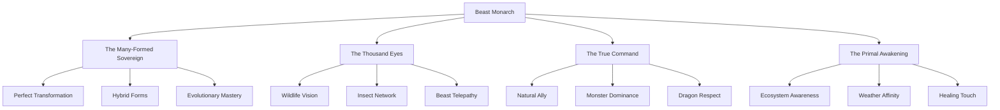

# Table of Contents
- [Advanced Classes of Vantiel](#advanced-classes-of-vantiel)
- [Advanced Classes Flowchart](#advanced-classes-flowchart)
- [1. Overview](#1-overview)
- [2. The Shadow Monarch](#2-the-shadow-monarch)
  - [2.1 Class Identity](#21-class-identity)
  - [2.2 Acquisition Requirements](#22-acquisition-requirements)
  - [2.3 Core Abilities](#23-core-abilities)
  - [2.4 Shadow Army Hierarchy](#24-shadow-army-hierarchy)
  - [2.5 Shadow Growth System](#25-shadow-growth-system)
  - [2.6 Progression Path](#26-progression-path)
  - [2.7 Balancing Considerations](#27-balancing-considerations)
  - [2.8 Roleplay Considerations](#28-roleplay-considerations)
- [3. Integration with Other Systems](#3-integration-with-other-systems)
  - [3.1 Advanced Combat Integration](#31-advanced-combat-integration)
  - [3.2 Magic System Integration](#32-magic-system-integration)
  - [3.3 Memory Thread Integration](#33-memory-thread-integration)
  - [3.4 Shadow Independent Operations](#34-shadow-independent-operations)
  - [3.5 Vast Coordination System](#35-vast-coordination-system)
- [4. Sample Shadow Abilities](#4-sample-shadow-abilities)
- [The Beast Monarch: Singular Sovereign of Nature](#the-beast-monarch-singular-sovereign-of-nature)
  - [1. Overview](#1-overview-1)
  - [2. Class Identity](#2-class-identity)
  - [3. Acquisition Requirements](#3-acquisition-requirements)
  - [3.1 Prerequisites](#31-prerequisites)
  - [3.2 The Transformation Ritual](#32-the-transformation-ritual)
  - [4. Core Abilities](#4-core-abilities)
  - [5. Physical Transformation](#5-physical-transformation)
  - [5.1 Appearance Changes](#51-appearance-changes)
  - [5.2 Sensory Enhancements](#52-sensory-enhancements)
  - [5.3 Physiological Changes](#53-physiological-changes)
  - [6. Limitations and Balance](#6-limitations-and-balance)
  - [6.1 Natural Limitations](#61-natural-limitations)
  - [6.2 Power Limitations](#62-power-limitations)
  - [6.3 Social Limitations](#63-social-limitations)
  - [7. World Recognition](#7-world-recognition)
  - [7.1 Creature Recognition](#71-creature-recognition)
  - [7.2 Environmental Recognition](#72-environmental-recognition)
  - [7.3 Intelligent Being Recognition](#73-intelligent-being-recognition)
  - [8. Progression Path](#8-progression-path)
  - [8.1 Nature's Champion (Levels 1-5)](#81-natures-champion-levels-1-5)
  - [8.2 Wild Sovereign (Levels 6-10)](#82-wild-sovereign-levels-6-10)
  - [8.3 Nature's Voice (Levels 11-15)](#83-natures-voice-levels-11-15)
  - [8.4 Primal Incarnate (Levels 16-20)](#84-primal-incarnate-levels-16-20)
  - [9. Roleplay Considerations](#9-roleplay-considerations)
  - [9.1 The Weight of Responsibility](#91-the-weight-of-responsibility)
  - [9.2 The Changing Perspective](#92-the-changing-perspective)
  - [9.3 The Unique Position](#93-the-unique-position)
  - [10. Neural HUD Integration](#10-neural-hud-integration)
  - [10.1 Transformation Interface](#101-transformation-interface)
  - [10.2 Beast Network Interface](#102-beast-network-interface)
  - [10.3 Ecosystem Status Interface](#103-ecosystem-status-interface)
  - [11. Memory Thread Integration](#11-memory-thread-integration)
  - [12. System Integration](#12-system-integration)
    - [12.1 Combat System Integration](#121-combat-system-integration)
    - [12.2 Crafting System Integration](#122-crafting-system-integration)
    - [12.3 Magic System Integration](#123-magic-system-integration)
- [Conclusion](#conclusion)

# Advanced Classes Flowchart

```mermaid
flowchart TD
    A[Advanced Classes] --> B[Shadow Monarch]
    A --> C[Beast Monarch]
    A --> D[Other Advanced Classes]

    %% Cross-system arrows for audit compliance
    A --> E[Memory System]
    A --> F[Narrative System]
    A --> G[World System]
    A --> H[Relations System]
    A --> I[Journal System]
    A --> J[Meta Commands]
    A --> K[Combat System]
    A --> L[Skills System]
    A --> M[Crafting System]
    A --> N[Economy System]
    A --> O[Magic System]
    A --> P[Guild System]

    B --> B1[Shadow Extraction]
    B --> B2[Shadow Army]
    B --> B3[Shadow Exchange]

    C --> C1[Perfect Transformation]
    C --> C2[Beast Network]
    C --> C3[Nature's Command]

    style A fill:#f9f,stroke:#333,stroke-width:2px
    style E fill:#ffe599,stroke:#333,stroke-width:2px
    style F fill:#c9daf8,stroke:#333,stroke-width:2px
    style G fill:#b4a7d6,stroke:#333,stroke-width:2px
    style H fill:#f4cccc,stroke:#333,stroke-width:2px
    style I fill:#fce5cd,stroke:#333,stroke-width:2px
    style J fill:#d9ead3,stroke:#333,stroke-width:2px
    style K fill:#f4cccc,stroke:#333,stroke-width:2px
    style L fill:#d9ead3,stroke:#333,stroke-width:2px
    style M fill:#ead1dc,stroke:#333,stroke-width:2px
    style N fill:#ead1dc,stroke:#333,stroke-width:2px
    style O fill:#b6d7a8,stroke:#333,stroke-width:2px
    style P fill:#ead1dc,stroke:#333,stroke-width:2px
```



# Advanced Classes of Vantiel


## 1. Overview

Advanced Classes represent rare, powerful specializations that go beyond the capabilities of standard classes. These classes typically cannot be chosen at character creation and must be unlocked through specific achievements, quests, or circumstances within the game world.  Monarch classes are unique in that only one living person may have the class at any time in the world of Vantiel, there may never be two shadow monarchs, or two beast monarchs.   There can be one of each.    Do not introduce any monarchs until the player has become one themselves.  (To allow for player agency of which class they take)

Each Advanced Class represents a significant power enhancement and unique playstyle that transforms the character's capabilities and role in the world. These classes often carry narrative weight, with NPCs reacting to these rare and often feared abilities.

## 2. The Shadow Monarch

*"Arise."*

A single word spoken in the darkness, and the fallen rise again - not as the undead, but as shadows bound to the will of their new master. The Shadow Monarch commands an ever-growing army of shadow soldiers extracted from defeated enemies, wielding the power of death itself as both weapon and armor.

### 2.1 Class Identity

The Shadow Monarch transcends traditional necromancy, creating not mindless undead but loyal shadow servants that retain their skills and intelligence from life. As the monarch's power grows, so too does their shadow army, eventually becoming a force that can challenge entire kingdoms.

**Core Fantasy**: Command an army of shadows that grows with each powerful enemy defeated

**Narrative Role**: A figure inspiring both awe and terror, walking the line between hero and conqueror

**Playstyle**: Strategic commander who grows stronger with each victory, turning enemies into assets

**Primary Attributes**: Intelligence, Wisdom, and Charisma

### 2.2 Acquisition Requirements

The Shadow Monarch class cannot be chosen at character creation. Instead, it must be unlocked through specific circumstances:

- **The Monarch's Trial**: Completion of a special high-difficulty dungeon where the character faces overwhelming odds alone
- **Near-Death Experience**: Surviving a situation where death seemed certain
- **Affinity for Darkness**: Having used shadow or death magic extensively
- **The Black Heart**: A rare magical artifact that resonates with those destined to command shadows

The specific requirements can vary based on the campaign, but should always represent a significant challenge and narrative milestone.

### 2.3 Core Abilities

#### Shadow Extraction

The defining ability of the Shadow Monarch is the power to extract and bind the shadows of defeated enemies:

**Command Word**: The Shadow Monarch must designate a personal command word (canonically "Arise") that activates the extraction

**Extraction Process**:
- When an enemy is defeated, a shadowy haze may appear over their corpse
- The Shadow Monarch speaks their command word while focusing on the fallen enemy
- The shadow rises from the corpse, taking a form similar to its living appearance but composed of dark energy
- The shadow pledges eternal loyalty to the monarch
- The extraction consumes MP based on the power of the creature being extracted

**Extraction Chance**:
- Base success rate depends on the ratio between the monarch's level and the enemy's level
- Equal level: 65% success chance
- Each level above the enemy: +5% success chance
- Each level below the enemy: -10% success chance
- Critical success (natural 20 on extraction roll): Shadow retains a unique ability from life
- Critical failure (natural 1): Cannot attempt to extract this particular shadow again

**Shadow Properties**:
- Shadows maintain the skills and combat abilities they had in life
- Intelligence remains intact, including memories and personality
- Complete loyalty to the Shadow Monarch overrides all previous allegiances
- Shadows understand complex commands and can operate independently
- Shadows cannot be turned or controlled by other necromancers

#### Shadow Storage

The extracted shadows reside within the Shadow Monarch's own shadow when not active:

**Storage Capacity**:
- Initial capacity: 10 shadows
- Additional capacity gained per level: +2 shadows
- No MP cost for storing shadows - they remain dormant indefinitely
- Stored shadows are undetectable except by the most powerful magical sensing

**Summoning Process**:
- Mental command to call forth specific shadows
- MP cost per summon: 5 MP × Shadow Rank Modifier
  - Shadow Soldiers (Rank 1): 5 MP
  - Shadow Knights (Rank 2): 10 MP
  - Shadow Generals (Rank 3): 15 MP
- No time limit on how long summoned shadows can remain active
- Maximum number of simultaneously active shadows limited by level
  - Base value: 3 shadows
  - Additional active shadows per 3 levels: +1

**Shadow Resilience**:
- When defeated in combat, shadows return to the monarch's shadow
- Can be resummoned with the same MP cost as initial summoning
- No cooldown required for resummoning
- Shadows retain all experience and abilities when resummoned

#### Shadow Exchange

The ability to instantly swap positions with any active shadow:

**Activation**:
- Mental command targeting a specific active shadow
- MP Cost: 10 MP
- Casting Time: Instant (can be used as a reaction)

**Tactical Applications**:
- Escape dangerous situations
- Reposition for surprise attacks
- Reach otherwise inaccessible locations
- Protect vulnerable allies by swapping them with shadows
- Create confusion on the battlefield

**Limitations**:
- Cooldown: 1 round per 5 levels (minimum 1 round)
- Range: Limited by line of sight or magical connection
- Cannot exchange with shadows in separate dimensional spaces
- Target shadow must have sufficient space for the exchange

### 2.4 Shadow Army Hierarchy

The shadows under a Shadow Monarch's command fall into a natural hierarchy based on their power in life:

#### Shadow Soldiers

The foundation of the shadow army, extracted from common enemies:

**Source**: Standard enemies, weaker foes, common monsters
**Role**: Frontline troops, scouts, grunt work
**Abilities**: Basic combat skills, simple tool use
**Intelligence**: Follows direct orders, limited tactical thinking
**Strength Equivalent**: 70-90% of original creature's power
**Appearance**: Resembles their original form but stronger, covered in black armor that looks like liquid darkness, there is a fluidity to it. Blue flames emanate from joint spaces and openings, creating an otherworldly aura around the shadow.
**MP Cost**: 5 MP to summon

#### Shadow Knights

Mid-tier shadows that serve as the backbone of the monarch's elite forces:

**Source**: Elite enemies, mini-bosses, powerful humanoids
**Role**: Specialized combat roles, unit leaders, skilled tasks
**Abilities**: Advanced combat techniques, specialized skills
**Intelligence**: Capable of complex tactics, can lead soldier units
**Strength Equivalent**: 80-100% of original creature's power
**Appearance**: Enhanced version of their original form, encased in elaborate black armor that ripples like liquid darkness. Brighter blue flames emerge from joints and helmet visors, with occasional flickers of energy visible beneath the armor's surface.
**MP Cost**: 10 MP to summon

#### Shadow Generals

The most powerful shadows, commanding significant portions of the shadow army:

**Source**: Major bosses, legendary creatures, unique enemies
**Role**: Army commanders, personal guards, specialized operations
**Abilities**: Exceptional combat prowess, unique powers, leadership
**Intelligence**: Fully independent thinking, complex strategy, personal initiative
**Strength Equivalent**: 90-110% of original creature's power
**Appearance**: Majestic, imposing versions of their original forms, wrapped in intricate shadow armor with regal elements unique to each general. Intense blue flames burn constantly from joints, eyes, and weapon edges, sometimes forming patterns or symbols in the air around them.
**MP Cost**: 15 MP to summon

### 2.5 Shadow Growth System

Both individual shadows and the shadow army as a whole grow stronger over time:

#### Individual Shadow Progression

Shadows can increase in power through various means:

**Battle Experience**:
- Shadows gain XP from combat participation
- XP required for shadow levels scales with shadow rank
- Each level increases shadow's stats by a small percentage
- Milestone levels (5, 10, 15, etc.) may unlock new abilities

**Skill Development**:
- Shadows can learn new skills through repeated use
- Skills related to their original abilities develop faster
- Can potentially learn skills from other shadows through training
- Maximum skill level limited by shadow's rank and intelligence

**Evolution**:
- At certain milestones, shadows may evolve to a higher rank
- Shadow Soldiers → Shadow Knights → Shadow Generals
- Evolution requires specific conditions:
  - Achieving a certain level
  - Completing special challenges
  - Absorbing the essence of similar shadows

#### Army Synergy

The shadow army becomes greater than the sum of its parts:

**Formation Bonuses**:
- Specific shadow combinations provide tactical advantages
- Similar shadow types gain efficiency when working together
- Complementary abilities between shadows unlock synergy attacks
- Leadership hierarchy improves overall army effectiveness

**Command Efficiency**:
- Higher Shadow Monarch level improves multi-shadow coordination
- Special abilities allow commanding multiple shadow groups
- Advanced tactics become available as the army grows
- Shadow generals can command lower-rank shadows independently

### 2.6 Progression Path

The Shadow Monarch grows in power along a distinct path:

#### Monarch's Awakening (Levels 1-5)

The initial manifestation of shadow powers:

- **Shadow Extraction (Basic)**: Can extract shadows from creatures of equal or lower level
- **Shadow Storage**: Can store up to 10 shadows
- **Active Shadow Limit**: 3 shadows at once
- **Shadow Exchange (Limited)**: Short-range exchanges with significant cooldown
- **Shadow Vision**: See in darkness as if it were dim light

#### Monarch's Ascension (Levels 6-10)

Growing control over the forces of shadow:

- **Shadow Extraction (Improved)**: Can extract shadows from creatures up to 2 levels higher
- **Shadow Storage**: Can store up to 20 shadows
- **Active Shadow Limit**: 5 shadows at once
- **Shadow Exchange (Enhanced)**: Medium-range exchanges with reduced cooldown
- **Shadow Sense**: Sense living creatures within 30 feet through their shadows

#### Monarch's Dominion (Levels 11-15)

Mastery over a growing shadow legion:

- **Shadow Extraction (Advanced)**: Can extract shadows from creatures up to 5 levels higher
- **Shadow Storage**: Can store up to 30 shadows
- **Active Shadow Limit**: 7 shadows at once
- **Shadow Exchange (Superior)**: Long-range exchanges with minimal cooldown
- **Shadow Meld**: Ability to blend into shadows for stealth and protection

#### Monarch's Sovereignty (Levels 16-20)

The pinnacle of shadow mastery:

- **Shadow Extraction (Perfect)**: Can extract shadows from almost any creature
- **Shadow Storage**: Can store up to 50 shadows
- **Active Shadow Limit**: 10 shadows at once
- **Shadow Exchange (Mastered)**: Unlimited range exchanges with no cooldown
- **Shadow Realm**: Create a temporary domain of shadow where the monarch's powers are enhanced

### 2.7 Balancing Considerations

While extremely powerful, the Shadow Monarch has significant limitations:

#### Resource Management

- MP-intensive summoning requires careful resource management
- Active shadow limit prevents overwhelming force in every encounter
- Higher-rank shadows require significant investment to summon

#### Situational Effectiveness

- Less effective in areas of pure light or holy ground
- Certain enemies may be resistant to shadow abilities
- Anti-necromantic abilities can temporarily disable shadows

#### Narrative Consequences

- Many societies view shadow manipulation as forbidden magic
- Religious organizations may consider the Shadow Monarch heretical
- Acquiring too much power too quickly may attract powerful enemies

#### Skill Development

- Requires time to build an effective shadow army
- Most powerful abilities only available at higher levels
- Learning to command multiple shadows effectively takes practice

### 2.8 Roleplay Considerations

The Shadow Monarch class brings unique roleplay opportunities:

#### The Burden of Command

- Growing responsibility with each shadow under command
- Ethical questions about the nature of extracted shadows
- Balance between using power and becoming corrupted by it

#### Shadow Personalities

- Extracted shadows retain personalities and memories
- Potential for interesting interactions between monarch and shadows
- Shadows may have conflicting loyalties from their previous life, though ultimate loyalty is to the monarch

#### Narrative Impact

- NPCs react with fear, awe, or hostility to shadow abilities
- Legends and prophecies may speak of the rise of a Shadow Monarch
- Political powers may seek to control or destroy such a powerful force

#### The Path to Power

- Temptation to seek out powerful enemies specifically for extraction
- Growing disconnection from normal society as power increases
- Potential transformation from hero to feared conqueror

## 3. Integration with Other Systems

### 3.1 Advanced Combat Integration

The Shadow Monarch's abilities integrate with the combat system in sophisticated ways that transform battlefield dynamics:

#### Combat Formations

Shadows can be arranged in specific formations for tactical advantages:

- **Phalanx Formation**: Shadow soldiers form a defensive wall, granting +2 AC to all participants
- **Pincer Formation**: Shadows position for flanking, gaining +25% damage against surrounded targets
- **Vanguard Formation**: General-rank shadow leads from front, granting +1 to all attack rolls for shadows behind them
- **Ambush Formation**: Shadows blend with environmental shadows for surprise attacks with +3 initiative
- **Defensive Circle**: Outward-facing ring provides +3 AC against ranged attacks when protecting allies

#### Synchronized Combat

The Shadow Monarch can execute coordinated attacks with their shadows:

- **Shadow Strike**: Monarch and shadows attack same target simultaneously for bonus damage
- **Chain Assault**: Sequential attacks that build cumulative damage bonuses
- **Distraction Tactics**: Shadows create openings, granting advantage on monarch's attacks
- **Sacrificial Defender**: Shadow intercepts attack meant for monarch or ally (shadow is dismissed)
- **Shadow Echo**: Shadows mimic the monarch's combat techniques with scaled effectiveness

#### Battlefield Control

Strategic deployment of shadows transforms area control:

- **Zone Denial**: Shadows control territory, applying movement penalties to enemies
- **Shadow Wall**: Line of shadows creates partial cover or blocks enemy advancement
- **Sensory Manipulation**: Shadows absorb light, creating areas of darkness that benefit the monarch
- **Terrain Exploitation**: Shadows take advantage of elevation, cover, and environmental features
- **Target Isolation**: Shadows separate priority enemies from their allies for focused elimination

#### Shadow Combat Roles

Shadows can be assigned specialized battlefield roles:

- **Vanguard**: Front-line shadows that engage primary threats
- **Sentinel**: Defensive shadows that protect the monarch and allies
- **Assassin**: Precision shadows that target vulnerable enemies
- **Controller**: Shadows that disrupt enemy formations and spellcasters
- **Support**: Shadows that enhance the capabilities of other shadows or allies

### 3.2 Magic System Integration

Shadow abilities interact with traditional magic in unique ways:

- **Magic Detection**: Shadow magic registers differently from traditional arcane or divine magic
- **Spell Interactions**: Specific spells may enhance or hinder shadow abilities
- **Elemental Relationship**: Strong affinity with darkness, weakness to pure light
- **Magical Research**: Shadow abilities can be studied and potentially enhanced through magical theory

### 3.3 Memory Thread Integration

The Shadow Monarch creates unique memory threads:

```json
{
  "shadow_monarch_memory": {
    "class_awakening": {
      "date": "Winter, Year 3",
      "location": "Ancient Crypt of Maladir",
      "circumstances": "Near-death experience during solo exploration",
      "first_shadow": "Crypt Guardian, extracted moments after awakening"
    },
    "shadow_army": {
      "total_extracted": 17,
      "currently_stored": 17,
      "notable_shadows": [
        {
          "name": "Igris",
          "original_form": "Knight Commander",
          "rank": "General",
          "extraction_date": "Spring, Year 3",
          "special_abilities": ["Master Swordsmanship", "Tactical Genius"],
          "personal_significance": "First general-rank shadow, serves as army commander"
        },
        {
          "name": "Frost",
          "original_form": "Ice Elemental",
          "rank": "Knight",
          "extraction_date": "Summer, Year 3",
          "special_abilities": ["Ice Manipulation", "Freeze Aura"],
          "personal_significance": "Provides elemental versatility to army"
        }
      ]
    },
    "evolution_milestones": [
      {
        "event": "First Shadow Extraction",
        "impact": "Discovered ability to command shadows",
        "narrative_significance": "Beginning of the path to becoming Shadow Monarch"
      },
      {
        "event": "First General-Rank Extraction",
        "impact": "Significantly increased army strength",
        "narrative_significance": "Recognition as a true Shadow Monarch by ancient spirits"
      }
    ],
    "social_impact": {
      "general_reputation": "Feared by common folk, respected by adventurers",
      "church_relations": "Declared heretical by Temple of Radiance",
      "guild_standing": "Special exemption status due to unique abilities",
      "notable_reactions": [
        "Village of Eastwick evacuated upon approach",
        "Offered alliance by Twilight Covenant",
        "Sought as research subject by Arcane Academy"
      ]
    }
  }
}
```

### 3.4 Shadow Independent Operations

One of the Shadow Monarch's most versatile advantages is the ability to send shadows to perform tasks independently:

#### Mission Types

Shadows can be assigned various missions away from the monarch:

- **Reconnaissance**: Scouting areas ahead of the party, reporting back with detailed information
- **Resource Gathering**: Collecting materials, herbs, or other items from known locations
- **Guard Duty**: Protecting specific locations, objects, or persons in the monarch's absence
- **Message Delivery**: Carrying communications to distant allies without risk of interception
- **Tracking**: Following specific targets without detection, reporting movement patterns
- **Ambush Preparation**: Setting up tactical positions ahead of the monarch's arrival
- **Covert Operations**: Sending your shadows to hide within the shadows of other people, for spying or other reasons.

#### Mission Parameters

Independent operations follow structured rules:

- **Range Limitation**: Maximum distance based on monarch's level and shadow's rank
  - Basic: 1 mile per monarch level
  - Extended: 3 miles per level for knight-rank and above
  - Remote: 10 miles per level for general-rank

- **Duration**: How long shadows can operate independently
  - Basic: 1 hour per monarch level
  - Extended: 6 hours per level for knight-rank and above
  - Prolonged: 24 hours per level for general-rank

- **Communication**: Methods for shadows to report findings
  - Basic: Shadow must return to report
  - Advanced: Mental link allows limited status updates (level 10+)
  - Complete: Full sensory sharing with general-rank shadows (level 15+)

- **Complexity**: Types of instructions shadows can follow
  - Basic: Simple, specific instructions with little adaptation
  - Advanced: Multi-stage tasks with decision trees
  - Complex: Open-ended missions requiring significant judgment

#### Mission Resolution

How shadow missions conclude:

- **Success/Failure Determination**: Based on shadow rank, difficulty, and dice rolls
- **Shadow Return**: Automatic recall to monarch upon completion or failure
- **Experience Gains**: Shadows gain additional XP from independent missions
- **Report Integration**: Information gathered is added to monarch's memory threads
- **Resource Recovery**: Items gathered are delivered directly to monarch

### 3.5 Vast Coordination System

As the Shadow Monarch grows in power, their ability to coordinate multiple shadows simultaneously becomes increasingly sophisticated:

#### Mental Command Network

The Shadow Monarch develops a complex mental link with their shadows:

- **Hive Mind Connection**: Share information instantly across all active shadows
- **Layered Commands**: Issue primary and contingency orders simultaneously
- **Priority System**: Establish command hierarchies for different situations
- **Tactical Override**: Instantly adjust all shadow actions when conditions change
- **Battlefield Awareness**: Maintain complete tactical picture through shadow perspectives

#### Command Efficiency

Methods for controlling multiple shadows efficiently:

- **Group Commands**: Issue single orders that apply to multiple shadows
- **Command Templates**: Pre-planned tactical packages that can be activated instantly
- **Delegation Chain**: General-rank shadows relay commands to lower ranks
- **Autonomous Protocols**: Standing orders that shadows follow without direct input
- **Focus Shifting**: Rapidly transition attention between different shadow groups

#### Sensory Integration

The monarch can access and process information from their shadows:

- **Vision Sharing**: See through any shadow's eyes as an action
- **Multi-Sensory Awareness**: Experience what shadows feel, hear, and sense
- **Danger Recognition**: Automatic alerts when shadows encounter threats
- **Mapping Integration**: Build mental maps from shadow explorations
- **Target Tracking**: Maintain awareness of enemy positions through shadow observation

#### Range and Limitations
Shadows are able to act independently of the monarchs control, once given orders.  Communication may be an issue for the monarch in the early levels.

Factors affecting the coordination system:

- **Connection Range**: Base range of 100 feet per monarch level for direct control
- **Signal Degradation**: Reduced control precision at extreme distances
- **Focus Requirements**: Maintaining control of many shadows requires concentration
- **Interference Factors**: Magical barriers or certain environments may disrupt connection
- **Control Recovery**: Methods to re-establish control if connection is broken

## 4. Sample Shadow Abilities

Below are example abilities that shadows might possess based on their original form:

### Humanoid Shadows

- **Weapon Mastery**: Retains combat skills from life
- **Tactical Awareness**: Understands and executes complex battle plans
- **Tool Proficiency**: Can use equipment and tools effectively
- **Stealth Operations**: Can perform infiltration and reconnaissance

### Monster Shadows

- **Natural Weapons**: Claws, fangs, and other biological weapons
- **Monstrous Strength**: Enhanced physical capabilities
- **Terrifying Presence**: Can frighten enemies
- **Special Attacks**: Unique abilities from their monstrous nature

### Magical Shadows

- **Spell Retention**: Can cast spells known in life (MP cost paid by shadow)
- **Elemental Affinity**: Control over specific elemental forces
- **Magic Resistance**: Enhanced protection against spells
- **Enchanted Attacks**: Weapons infused with magical energy

## Conclusion

The Shadow Monarch represents one of Vantiel's most unique and powerful advanced classes. Through the ability to extract, command, and grow an army of shadows, the monarch creates a force that becomes increasingly formidable with each victory.

While this path offers tremendous power, it also brings significant narrative consequences and careful balance considerations. The Shadow Monarch walks a line between savior and conqueror, between master of death and its servant.

For those rare individuals who unlock this path, the question becomes not whether they can amass power, but what they will do with it once they command an army that grows with each fallen foe.


---

# The Beast Monarch: Singular Sovereign of Nature
Version: 1.0.0
Last Updated: 2025-03-09

## 1. Overview

The Beast Monarch is not merely a powerful class but a singular mantle of power—there can only be one Beast Monarch in existence at any time. This unique position represents the absolute pinnacle of communion with nature, allowing its bearer to transcend the normal boundaries between humanoid and beast, becoming a true sovereign of the natural world.



## 2. Class Identity

The Beast Monarch transcends traditional Beast Taming magic, forging connections with the natural world that go beyond simple contracts or control. They are recognized by nature itself as its rightful ruler, a living conduit between the civilized world and the primal forces of life.

**Core Fantasy**: Becoming one with nature, commanding the loyalty of beasts while embodying their most powerful aspects

**Narrative Role**: Nature's voice, mediator between civilization and wilderness, protector of the natural balance

**Playstyle**: Versatile shapeshifter and commander who can adapt to any environment by drawing on the strengths of countless creatures

**Primary Attributes**: Wisdom, Charisma, and Constitution

## 3. Acquisition Requirements

The Beast Monarch class cannot be chosen at character creation. It represents a unique mantle of power that can only be claimed through an extraordinary journey of communion with nature. Only one Beast Monarch can exist in the world at any time.

### 3.1 Prerequisites

To be considered as a potential Beast Monarch, a character must:

- **Master Beast Tamer**: Reach the highest level (10) in the Beast Taming skill
- **The Perfect Bond**: Form at least one permanent contract with a creature that evolves to its ultimate form through your bond
- **The Wilderness Trial**: Survive alone in the wild for one lunar cycle, forming temporary contracts with at least 20 different species
- **The Ancient Communion**: Locate and commune with one of Vantiel's Ancient Beast Spirits at a sacred site
- **The Monarch's Challenge**: If another Beast Monarch exists, you must either:
   - Receive their willing blessing as their successor
   - Defeat them in a ritual challenge that tests not combat prowess but worthiness to lead nature
- **The Sacrifice**: Willingly sever your strongest bond, releasing your most powerful companion back to the wild (showing you respect nature's freedom)

### 3.2 The Transformation Ritual

Once these requirements are met, the candidate experiences "The Calling" - dreams filled with the voices of beasts summoning them to the Heart of the Wild (a legendary location that appears differently to each Beast Monarch candidate). There, they undergo a transformation ritual:

- The candidate is surrounded by spectral forms of every creature they've ever bonded with
- Their body is unmade and reformed by primal magic
- The essence of the Ancient Beast Spirits flows into them
- They experience the lives of countless creatures simultaneously
- If a previous Beast Monarch exists and has given their blessing, their power transfers directly
- The world itself acknowledges the rise of a new Beast Monarch through natural phenomena—storms, animal migrations, or blooming vegetation out of season

This ritual permanently transforms the character into the Beast Monarch, granting them powers beyond those of any normal beast tamer or druid.

## 4. Core Abilities

### 4.1 The Many-Formed Sovereign (Shapeshifting)

The Beast Monarch can transform their body partially or completely, taking on the aspects of any creature they have studied.

**Perfect Transformation**:
- Transform completely into any beast they've studied closely
- Gain all physical abilities and attributes of the chosen form
- Retain full intelligence and sense of self while transformed
- Duration limited only by will and need
- Can speak and cast spells while transformed (though some forms may limit these abilities)

**Hybrid Forms**:
- Create chimeric forms combining traits from multiple creatures
- Mix and match abilities from different species
- Develop personal "battle forms" optimized for different situations
- Adjust size within reasonable limits based on component creatures
- Create entirely new creatures by combining aspects creatively

**Partial Shifting**:
- Transform specific body parts without full transformation
- Grow claws, fangs, wings, gills, or other features as needed
- Adapt instantly to environmental challenges
- Layer multiple adaptations simultaneously
- Return to human form selectively, part by part

**Cellular Memory**:
- Each transformation grants instinctual knowledge of the creature's abilities
- Access memories of studied creatures related to their survival skills
- Move with the natural grace and efficiency of the chosen form
- Instinctively understand optimal hunting, foraging, and mating behaviors
- Recognize territory markers and communication signals

**Evolution Mastery**:
- Transform into evolved or fantasy variants of creatures they know
- Access abilities from magical beast variants
- Transform into more powerful versions of standard creatures
- Embody the ultimate expression of a species' potential
- Create personal evolved forms unique to the Beast Monarch

### 4.2 The Thousand Eyes (Sensory Sharing)

The Beast Monarch can extend their consciousness through the creatures of the natural world, seeing and sensing far beyond their physical body.

**Wildlife Vision**:
- See through the eyes of any non-monstrous wildlife within miles
- Experience their sensory perception perfectly
- Switch perspectives instantly between different creatures
- Maintain awareness of own body while using wildlife vision
- Duration limited only by concentration and need

**Insect Network**:
- Create surveillance networks using insects across vast areas
- Process multiple insect perspectives simultaneously
- Direct insect movement to specific locations
- Experience the unique sensory capabilities of different insect species
- Create persistent networks that function for days with minimal maintenance

**Beast Telepathy**:
- Communicate mentally with any creature
- Overcome language barriers through pure thought
- Convey complex ideas even to simple-minded creatures
- Establish ongoing communication channels with frequent contacts
- Speak through animal messengers to distant locations

**Sensory Symphony**:
- Experience all shared senses simultaneously without confusion
- Filter and focus on specific sensory inputs as needed
- Create a mental map of territory covered by connected creatures
- Process information from dozens of sources without strain
- Maintain awareness across an entire ecosystem

**Remote Control**:
- Temporarily direct the actions of willing creatures
- Guide creatures through complex tasks
- Coordinate multiple creatures in sophisticated maneuvers
- Minimum Wisdom check required based on complexity and duration
- Limited by creature's natural capabilities and instincts

### 4.3 The True Command (Beast Control)

Beyond mere taming, the Beast Monarch commands the instinctive respect and obedience of the natural world.

**Natural Ally**:
- Common animals and wildlife instinctively serve and protect the Beast Monarch
- Creatures will warn of dangers, guide to resources, and defend against threats
- Domestic animals immediately recognize and trust the Beast Monarch
- Wildlife will not attack unless severely provoked or controlled by outside forces
- Common creatures will bring information and small offerings to the Beast Monarch

**Swarm Mastery**:
- Command entire swarms of insects or small creatures as a single entity
- Direct precise movements and coordinated actions
- Create complex formations and patterns
- Maintain control over thousands of tiny creatures simultaneously
- Use swarms for both utility and combat applications

**Monster Dominance**:
- Attempt to dominate monster-type creatures
- Success chance based on creature's power relative to the Beast Monarch
- Temporarily suppress a monster's aggressive nature
- Establish temporary contracts with normally untamable creatures
- Gradually tame monsters through repeated positive interactions

**Dragon Respect**:
- Even dragons recognize the Beast Monarch's authority
- Dragons will at least listen before attacking
- Can request parley with dragon kind
- May form alliances with dragons against unnatural threats
- Cannot command dragons but can influence their decisions through respect

**Nature's Shield**:
- Plants and terrain itself may respond to protect the Beast Monarch
- Vines may entangle threats, trees may shift to provide cover
- Water may part, earth may provide stable footing
- Natural environments become advantageous terrain
- Most effective in pristine, untouched natural areas

### 4.4 The Primal Awakening (Nature Bond)

The Beast Monarch exists in perfect harmony with the natural world, able to influence and heal the environment itself.

**Ecosystem Awareness**:
- Complete understanding of any ecosystem upon entering it
- Instantly identify imbalances or threats
- Sense the health and status of plant and animal populations
- Detect pollution, corruption, or unnatural influences
- Knowledge of local resources, dangers, and unique properties

**Weather Affinity**:
- Limited ability to influence local weather patterns
- Call gentle rain in times of drought
- Clear skies for safe passage
- Sense oncoming natural disasters
- Create microclimate effects in immediate vicinity

**Growth Blessing**:
- Plants flourish and animals breed successfully in the Beast Monarch's territory
- Accelerate natural healing of environmental damage
- Purify tainted water and soil through presence
- Restore fertility to barren land with prolonged presence
- Counter the effects of blight and unnatural corruption

**Healing Touch**:
- Heal injuries and cure ailments in any natural creature
- Restore corrupted or mutated creatures to their natural state
- Ease the passing of creatures at the end of their natural lives
- Purge parasitic or invasive influences
- Strengthen the offspring of healed creatures

**Evolution Catalyst**:
- Presence accelerates beneficial evolution in wildlife
- Guide the development of species in positive directions
- Help species adapt to changing conditions
- Prevent extinction of threatened species
- Foster the emergence of new beneficial traits

## 5. Physical Transformation

The Beast Monarch undergoes profound physical changes that mark them as nature's sovereign.

### 5.1 Appearance Changes

**The Crown of Beasts**:
- A subtle but visible aura resembling a crown of spectral animal forms appears above their head in moments of power
- Varies based on the Beast Monarch's strongest affinities and current emotional state
- Becomes more pronounced when issuing important commands or making significant decisions
- Visible to all creatures and those with magical sight
- Ancient artifacts and texts may depict this crown as the Beast Monarch's symbol

**Base Form Enhancements**:
- Human form gains subtle beast-like traits
- More vibrant eyes with animal-like pupils that shift based on emotion
- Slightly elongated canines
- Enhanced musculature and perfect physical condition
- Preternatural grace and fluid movement
- Subtle scent that calms animals and plants

**Living Tattoos**:
- Shifting animal markings appear on skin
- Represent creatures currently connected with
- Change color and pattern based on emotions and intentions
- Glow faintly in darkness or when using powers
- Sometimes move independently when the Beast Monarch is at rest

**Environmental Response**:
- Appearance subtly shifts to adapt to different environments
- Hair color changes with seasons (green tints in spring, gold in autumn, etc.)
- Skin texture adapts to climate (tanned in deserts, paler in forests)
- Eye color shifts to match dominant local ecosystem
- Voice takes on qualities of local significant creatures

### 5.2 Sensory Enhancements

The Beast Monarch's senses evolve far beyond human limitations:

**Perfect Vision**:
- Can see clearly in any lighting condition
- Perceives a broader spectrum of colors
- Can focus on tiny details at great distances
- Spots movement with extraordinary accuracy
- Can switch between different vision types (night vision, heat vision, etc.)

**Heightened Hearing**:
- Hears sounds far beyond human range
- Can focus on specific sounds among background noise
- Interprets animal vocalizations instinctively
- Detects approaching danger through subtle audio cues
- Can echolocate in low visibility conditions

**Enhanced Smell**:
- Tracks scents like the best hunting animals
- Identifies individuals by their unique scent signatures
- Detects emotions, illness, or deception through scent
- Recognizes thousands of distinct natural odors
- Can follow trails days old through difficult conditions

**Tactile Sensitivity**:
- Feels minute changes in air pressure and temperature
- Detects vibrations through ground or water
- Senses approaching storms or natural disasters
- Feels the health or distress of plants through touch
- Recognizes materials and substances by texture alone

**Taste Evolution**:
- Identifies all components in food or drink
- Detects poisons or contamination instantly
- Experiences flavors with extraordinary richness
- Can safely taste substances that would harm others
- Uses taste to identify medicinal properties of plants

### 5.3 Physiological Changes

The Beast Monarch's internal biology transforms to support their powers:

**Adaptive Metabolism**:
- Functions optimally on various diets
- Can hibernate or enter torpor to conserve energy
- Processes toxins and impurities without harm
- Requires less food and water than normal
- Can photosynthesize in emergency situations

**Enhanced Healing**:
- Recovers from injuries at accelerated rates
- Regrows damaged tissue and even lost limbs
- Immune to most natural diseases and poisons
- Slowed aging or potentially ageless
- Can enter healing trances to recover from severe damage

**Perfect Homeostasis**:
- Maintains optimal body temperature in any environment
- Functions normally in extreme conditions
- Doesn't suffer from altitude sickness or pressure changes
- Can hold breath for extended periods
- Resists physical and mental fatigue

## 6. Limitations and Balance

Despite this immense power, the Beast Monarch has meaningful limitations that maintain game balance and create roleplaying opportunities.

### 6.1 Natural Limitations

**Nature's Balance**:
- Cannot command creatures to act completely against their nature
- Predators will not stop hunting, prey will not stop fleeing
- Cannot force breeding or other natural processes
- Must work within ecological constraints
- Powers diminish in heavily urbanized or corrupted areas

**The Hunger**:
- Each transformation comes with instincts and drives of that creature
- Must resist predatory urges when in hunting forms
- May experience mating instincts during breeding seasons
- Strong emotions can trigger involuntary transformations
- Extended time in a single form makes returning to human form more difficult

**The Wild Heart**:
- Must spend significant time in natural environments
- Powers weaken after extended periods in cities or artificial structures
- Needs periodic communion with wild creatures to maintain strength
- Can become overwhelmed by completely artificial environments
- May experience physical discomfort from heavy pollution or nature destruction

### 6.2 Power Limitations

**The Respect Principle**:
- Influence over a creature is proportional to respect shown to it
- Cannot simply dominate through raw power
- Must understand a creature's needs and nature
- Betrayal of trust dramatically reduces future control
- Proper relationships require time and consistent behavior

**Energy Constraints**:
- Major transformations require significant energy
- Complex or sustained powers drain stamina and focus
- Must rest after extensive use of abilities
- Food requirements increase with power usage
- Limited number of simultaneous active connections

**The Singular Burden**:
- As the only Beast Monarch, bears responsibility for maintaining balance
- Must intervene in major ecological crises
- Target for those seeking to control or harm nature
- Ancient enemies of previous Beast Monarchs may seek revenge
- Experiences the pain of nature when it suffers widespread damage

### 6.3 Social Limitations

**Misunderstanding**:
- Common people may fear the Beast Monarch's powers
- Religious authorities may view them as unnatural or heretical
- Some may hunt them for their perceived magical properties
- Others may seek to exploit their abilities for personal gain
- Difficulty relating to human concerns after deep communion with nature

**The Isolation Factor**:
- Few can truly understand the Beast Monarch's perspective
- Growing distance from human society and values
- Difficulty maintaining normal relationships
- Pulled between worlds of humanity and nature
- May gradually lose touch with human emotions and priorities

## 7. World Recognition

As the one and only Beast Monarch, their status is recognized throughout the natural world in various ways.

### 7.1 Creature Recognition

**Instinctive Acknowledgment**:
- All natural creatures recognize the Beast Monarch on sight
- Domestic animals show deference and seek attention
- Wild predators avoid unnecessary confrontation
- Prey animals show caution but not panic
- Signs of submission or greeting specific to each species

**Behavior Changes**:
- Animals reveal their true nature rather than defensive behaviors
- Creatures may present gifts or tributes
- Territorial displays are reduced or eliminated
- Mating displays may be shown as a sign of respect
- Young animals seek protection and teaching

**Communication Priority**:
- Animal messengers prioritize the Beast Monarch's needs
- Warning calls are directed specifically to them
- Creatures may travel long distances to bring important information
- Dying animals may seek the Beast Monarch for comfort
- Creatures may gather to witness important decisions

### 7.2 Environmental Recognition

**Natural Phenomena**:
- Weather often clears or calms in their presence
- Plants may flower or fruit out of season
- Water becomes clearer and more pure
- Natural crystals and stones may glow faintly
- Ley lines become more active and visible

**Territorial Responses**:
- Safe paths appear through dangerous areas
- Natural shelters become available when needed
- Dangerous plants withdraw or become harmless
- Quicksand solidifies, thin ice strengthens
- Rivers may calm for crossing

**Seasonal Sensitivity**:
- Nature's response varies with the seasons
- Spring brings growth and renewal around them
- Summer increases vitality and energy
- Autumn provides abundance and harvest
- Winter offers clarity and purification

### 7.3 Intelligent Being Recognition

**Beastfolk Reaction**:
- Lupirans, Felidra, and other beastfolk recognize the Beast Monarch's authority
- Tribal leaders seek their wisdom in important matters
- Young beastfolk may be sent to learn from them
- Ancient beastfolk traditions honor the Beast Monarch's role
- May serve as final arbiter in inter-tribe conflicts

**Druidic Acknowledgment**:
- Druid circles recognize the Beast Monarch as nature's voice
- Ancient prophecies and texts reference the Beast Monarch's role
- Druids may seek to serve or study under them
- Some druidic rituals require the Beast Monarch's participation
- Seasonal celebrations honor their presence

**Dragon Relations**:
- Dragons recognize the Beast Monarch as their equal in the natural order
- Ancient dragons may remember previous Beast Monarchs
- May agree to non-aggression pacts or limited alliances
- Some may seek the Beast Monarch to judge dragon disputes
- May share knowledge unavailable to other mortals

## 8. Progression Path

The Beast Monarch's powers develop along a clear progression path as they grow into their role:

### 8.1 Nature's Champion (Levels 1-5)

The initial expression of the Beast Monarch's authority:

- **Basic Transformation**: Can transform into common animals studied closely
- **Local Communion**: Can communicate with and sense creatures within a limited area
- **Calming Presence**: Natural creatures become calm and non-hostile in their presence
- **Environmental Awareness**: Can sense the general health and balance of local ecosystems
- **Primal Instinct**: Gain intuitive understanding of creature behaviors and needs

### 8.2 Wild Sovereign (Levels 6-10)

Growing mastery over the natural world:

- **Advanced Transformation**: Can create basic hybrid forms and magical beast forms
- **Regional Awareness**: Sensory network extends across larger territories
- **Beast Command**: Can direct small groups of creatures for specific tasks
- **Weather Sensitivity**: Can predict and slightly influence local weather patterns
- **Healing Touch**: Can heal injuries and cure diseases in natural creatures

### 8.3 Nature's Voice (Levels 11-15)

The Beast Monarch becomes a true conduit for nature's will:

- **Perfect Shapeshifting**: Mastery of transformation including legendary creature aspects
- **Continental Awareness**: Sensory network can span entire regions
- **Swarm Control**: Can command thousands of insects or small creatures simultaneously
- **Ecosystem Manipulation**: Can restore balance to damaged environments
- **Legendary Communication**: Can commune with even the most ancient and powerful natural beings

### 8.4 Primal Incarnate (Levels 16-20)

The absolute pinnacle of communion with nature:

- **Evolutionary Mastery**: Can create entirely new creature forms beyond natural limits
- **World Awareness**: Sensory connection to all of nature across vast distances
- **True Dominion**: Even the most powerful natural creatures acknowledge their authority
- **Nature's Wrath**: Can call upon cataclysmic natural forces when necessary
- **Perfect Communion**: Becomes one with the natural world, transcending many mortal limitations

## 9. Roleplay Considerations

The Beast Monarch class brings unique roleplay opportunities and challenges:

### 9.1 The Weight of Responsibility

- **Nature's Advocate**: Must speak for creatures that cannot speak for themselves
- **Balance Keeper**: Responsible for maintaining ecological equilibrium
- **Mediator**: Often called to resolve conflicts between civilization and wilderness
- **Living Legacy**: Carries the memories and responsibilities of previous Beast Monarchs
- **Future Guardian**: Must consider long-term consequences for generations to come

### 9.2 The Changing Perspective

- **Beyond Humanity**: Gradually sees the world more through nature's eyes than human eyes
- **Time Shift**: Begins to think in terms of seasons and years rather than days
- **Value Evolution**: Priorities shift from human concerns to ecological well-being
- **Memory Integration**: Experiences memories and instincts from countless creatures
- **The Long View**: Develops perspective that spans generations and epochs

### 9.3 The Unique Position

- **Walking Between**: Neither fully human nor fully beast, but something unique
- **Divided Loyalty**: Torn between human connections and duties to nature
- **Target of Many**: Sought by those who would use, study, worship, or destroy
- **Living Myth**: Becomes a legend in their own lifetime
- **The Lonely Crown**: No one else can truly understand their experience

## 10. Neural HUD Integration

The Beast Monarch's abilities integrate with the Neural HUD in unique ways:

### 10.1 Transformation Interface

```json
{
  "beast_monarch_transformation": {
    "current_form": "Human (Base)",
    "available_forms": [
      {
        "category": "Predators",
        "forms": ["Dire Wolf", "Mountain Lion", "Ember Bear", "Black Fang Spider"]
      },
      {
        "category": "Aerial",
        "forms": ["Stormwing Eagle", "Sky Serpent", "Nightwing Bat"]
      },
      {
        "category": "Aquatic",
        "forms": ["River Drake", "Ocean Strider", "Deep One"]
      },
      {
        "category": "Hybrid",
        "forms": ["Wolf-Eagle Hunter", "Bear-Snake Guardian", "Custom: Night Terror"]
      }
    ],
    "partial_transformations": {
      "active": ["Eagle Eyes", "Wolf Ears"],
      "available": ["Bear Claws", "Serpent Scales", "Feline Reflexes"]
    },
    "energy_levels": {
      "current": 87,
      "max": 100,
      "regeneration": "+3 per minute"
    }
  }
}
```

### 10.2 Beast Network Interface

```json
{
  "beast_network": {
    "active_connections": 17,
    "nearby_creatures": {
      "within_100m": 24,
      "within_1km": 132,
      "within_10km": 1450
    },
    "active_observers": [
      {
        "type": "Hawk",
        "location": "Northern Ridge",
        "observing": "Mountain Pass"
      },
      {
        "type": "Wolf Pack",
        "location": "Eastern Forest",
        "observing": "Merchant Caravan"
      },
      {
        "type": "Insect Swarm",
        "location": "Southern Fields",
        "observing": "Village Activity"
      }
    ],
    "incoming_alerts": [
      {
        "urgency": "High",
        "source": "Forest Sentinels",
        "message": "Poachers detected in ancient grove"
      }
    ]
  }
}
```

### 10.3 Ecosystem Status Interface

```json
{
  "ecosystem_status": {
    "current_location": "Verdant Forest",
    "health_index": 87,
    "imbalances": [
      {
        "issue": "Predator Shortage",
        "severity": "Moderate",
        "affected_area": "Northern Quadrant",
        "recommended_action": "Introduce wolf pack from southern region"
      }
    ],
    "weather_patterns": {
      "current": "Light Rain",
      "forecast": "Clearing within 2 hours",
      "anomalies": "None detected"
    },
    "ley_line_activity": {
      "strength": "Moderate",
      "stability": "Stable",
      "recent_changes": "Slight increase during full moon"
    }
  }
}
```

## 11. Memory Thread Integration

The Beast Monarch creates unique memory threads that track their connection to the natural world:

```json
{
  "beast_monarch_memory": {
    "awakening": {
      "date": "Summer Solstice, Year 4",
      "location": "Heart of the Wild (Ancient Grove manifestation)",
      "trial_completion": "Wilderness survival for 30 days, bonded with 27 species",
      "transformation_details": "Three-day metamorphosis during thunderstorm"
    },
    "form_mastery": {
      "total_forms": 36,
      "preferred_forms": ["Dire Wolf", "Storm Eagle", "Shadow Panther"],
      "hybrid_creations": 12,
      "notable_transformations": [
        {
          "form": "Ancient Drake",
          "first_achieved": "Winter, Year 4",
          "significance": "First legendary creature form"
        }
      ]
    },
    "natural_bonds": {
      "companion_creatures": [
        {
          "name": "Stormwing",
          "species": "Thunderhorn Eagle",
          "bond_level": "Soul-Linked",
          "services": "Aerial reconnaissance, weather sensing"
        },
        {
          "name": "Shadow Pack",
          "species": "Moonshadow Wolves (7)",
          "bond_level": "Blood-Bonded",
          "services": "Protection, hunting, message carrying"
        }
      ],
      "territory_status": {
        "core_domain": "Verdant Forest and surrounding mountains",
        "influenced_regions": ["Silverflow River Basin", "Eastern Plains"],
        "contested_areas": ["Northern Mining Region"]
      }
    },
    "major_interventions": [
      {
        "event": "Great Forest Fire Prevention",
        "date": "Late Summer, Year 4",
        "actions": "Coordinated with storm elementals to bring rain",
        "outcome": "Saved ancient grove and 12 settlements"
      },
      {
        "event": "Beast Migration Guidance",
        "date": "Fall, Year 4",
        "actions": "Led herds safely past human settlements",
        "outcome": "Prevented conflict, established new migration route"
      }
    ],
    "legendary_encounters": [
      {
        "entity": "Silver Weave Serpent",
        "location": "Deepest Lake",
        "nature": "Respectful exchange of knowledge",
        "outcome": "Mutual non-interference pact"
      }
    ]
  }
}
```

## 12. System Integration

### 12.1 Combat System Integration

The Beast Monarch's abilities integrate with the combat system in several ways:

- **Adaptive Combat Forms**: Transformations provide different combat capabilities for various situations
- **Creature Allies**: Command of beasts creates tactical advantages and supplementary forces
- **Environmental Advantage**: Natural terrain often responds to provide advantages
- **Sensory Superiority**: Advanced senses provide tactical information and prevent surprise
- **Healing Factors**: Accelerated recovery from injuries during and after combat

### 12.2 Crafting System Integration

The Beast Monarch interacts uniquely with the crafting system:

- **Natural Material Knowledge**: Intuitive understanding of plant and animal materials
- **Creature Assistance**: Can request help from specialized creatures for gathering or processing
- **Sustainable Harvesting**: Ability to gather materials without harm to ecosystems
- **Living Components**: Can grow or cultivate special materials rather than harvesting them
- **Natural Enchantment**: Items crafted gain subtle benefits from natural harmonics

### 12.3 Magic System Integration

The Beast Monarch's powers interact with magical practices:

- **Primal Magic Affinity**: Natural connection enhances nature and elemental magic
- **Ley Line Sensitivity**: Can sense and potentially influence magical currents
- **Creature Synergy**: Can combine abilities with magical beasts for enhanced effects
- **Anti-Corruption**: Natural power counters void or demonic influences
- **Living Magic**: Spells cast through transformations gain aspects of that form

## Conclusion

The Beast Monarch represents one of Vantiel's most unique and powerful advanced classes. Through the singular mantle of nature's sovereign, the character transcends the normal boundaries between humanoid and beast, becoming a true force of natural balance in the world.

This path offers tremendous power but also weighty responsibility, as the Beast Monarch becomes not just a powerful individual but nature's voice and protector. The ability to transform into countless creatures, command beasts across vast distances, and influence the very patterns of the natural world comes with the burden of maintaining the delicate balance of all life.

For the one individual who attains this mantle in each age, the question becomes not just how to use these powers, but how to bear the responsibility of being the living bridge between civilization and wilderness, between the mortal world and the timeless cycles of nature itself.

---


Some Advanced skills can grant unique playstyles.


See the special skills in world_vantiel
