# Table of Contents
- [World: Magic of Vantiel](#world-magic-of-vantiel)
- [1. Overview](#1-overview)
- [2. Magical Essence](#2-magical-essence)
  - [2.1 Mana: The Fundamental Energy](#21-mana-the-fundamental-energy)
  - [2.2 Ley Lines: The World's Magical Circulatory System](#22-ley-lines-the-worlds-magical-circulatory-system)
  - [2.3 Magical Resonance: The Harmony of Magic](#23-magical-resonance-the-harmony-of-magic)
- [3. Magical Traditions](#3-magical-traditions)
  - [3.1 Academic Magic: The Scholarly Approach](#31-academic-magic-the-scholarly-approach)
  - [3.2 Divine Magic: The Goddess's Gift](#32-divine-magic-the-goddesss-gift)
  - [3.3 Natural Magic: The Way of Harmony](#33-natural-magic-the-way-of-harmony)
  - [3.4 Blood Magic: The Power of Sacrifice](#34-blood-magic-the-power-of-sacrifice)
  - [3.5 Void Magic: The Forbidden Art](#35-void-magic-the-forbidden-art)
- [4. Spell Acquisition & Advancement](#4-spell-acquisition--advancement)
  - [4.1 Magical Aptitude: The Foundation of Spellcasting](#41-magical-aptitude-the-foundation-of-spellcasting)
  - [4.2 Spell Learning & Mastery](#42-spell-learning--mastery)
  - [4.3 Magical Advancement & Specialization](#43-magical-advancement--specialization)
- [5. Magical Crafting](#5-magical-crafting)
  - [5.1 Enchantment: Imbuing Objects with Magic](#51-enchantment-imbuing-objects-with-magic)
  - [5.2 Alchemy: Magical Substance Manipulation](#52-alchemy-magical-substance-manipulation)
  - [5.3 Artifice: Magical Mechanism Creation](#53-artifice-magical-mechanism-creation)
  - [5.4 Runic Magic: Symbol-Based Enchantment](#54-runic-magic-symbol-based-enchantment)
- [6. Magical Phenomena](#6-magical-phenomena)
  - [6.1 Mana Fonts: Wellsprings of Power](#61-mana-fonts-wellsprings-of-power)
  - [6.2 Wild Magic Zones: Unpredictable Power](#62-wild-magic-zones-unpredictable-power)
  - [6.3 Magical Creatures: Living Magic](#63-magical-creatures-living-magic)
  - [6.4 Planar Boundaries: Beyond the Material](#64-planar-boundaries-beyond-the-material)
- [7. Magic in Society](#7-magic-in-society)
  - [7.1 Magical Regulation & Law](#71-magical-regulation--law)
  - [7.2 Magic in Daily Life](#72-magic-in-daily-life)
  - [7.3 Magic & Religion](#73-magic--religion)
  - [7.4 Magical Education](#74-magical-education)
- [8. Neural HUD Integration](#8-neural-hud-integration)
  - [8.1 Magical Perception Interface](#81-magical-perception-interface)
  - [8.2 Magical Learning System](#82-magical-learning-system)
  - [8.3 Magical Crafting Interface](#83-magical-crafting-interface)
  - [8.4 Runic Crafting](#84-runic-crafting)
- [9. System Integration](#9-system-integration)
  - [9.1 Combat System Integration](#91-combat-system-integration)
  - [9.2 Crafting System Integration](#92-crafting-system-integration)
  - [9.3 Economy System Integration](#93-economy-system-integration)
  - [9.4 Faction System Integration](#94-faction-system-integration)
- [10. Conclusion](#10-conclusion)

# World: Magic of Vantiel
## 1. Overview

Magic in Vantiel is a fundamental force that permeates all aspects of existence. It flows through the world in currents called ley lines, pools in natural formations called mana fonts, and manifests in countless forms from the subtle to the spectacular. This system details the nature of magic, its various traditions and schools, how it is learned and mastered, and the complex relationship between magical practice and Vantiel's societies.

```mermaid
flowchart TD
    A[Magic of Vantiel] --> B[Magical Essence]
    A --> C[Magical Traditions]
    A --> D[Spell Acquisition]
    A --> E[Magical Crafting]
    A --> F[Magical Phenomena]

    %% Cross-system arrows for audit compliance
    A --> G[Memory System]
    A --> H[Narrative System]
    A --> I[World System]
    A --> J[Relations System]
    A --> K[Journal System]
    A --> L[Meta Commands]
    A --> M[Combat System]
    A --> N[Skills System]
    A --> O[Crafting System]
    A --> P[Economy System]
    A --> Q[Magic System]
    A --> R[Guild System]

    B --> G[Mana]
    B --> H[Ley Lines]
    B --> I[Magical Resonance]

    C --> J[Academic Magic]
    C --> K[Divine Magic]
    C --> L[Natural Magic]
    C --> M[Blood Magic]
    C --> N[Void Magic]

    D --> O[Study & Training]
    D --> P[Magical Aptitude]
    D --> Q[Spell Discovery]
    D --> R[Magical Advancement]

    E --> S[Enchantment]
    E --> T[Alchemy]
    E --> U[Artifice]
    E --> V[Runic Magic]

    F --> W[Mana Fonts]
    F --> X[Wild Magic Zones]
    F --> Y[Magical Creatures]
    F --> Z[Planar Boundaries]

    style A fill:#f9f,stroke:#333,stroke-width:2px
    style G fill:#ffe599,stroke:#333,stroke-width:2px
    style H fill:#c9daf8,stroke:#333,stroke-width:2px
    style I fill:#b4a7d6,stroke:#333,stroke-width:2px
    style J fill:#f4cccc,stroke:#333,stroke-width:2px
    style K fill:#fce5cd,stroke:#333,stroke-width:2px
    style L fill:#d9ead3,stroke:#333,stroke-width:2px
    style M fill:#f4cccc,stroke:#333,stroke-width:2px
    style N fill:#d9ead3,stroke:#333,stroke-width:2px
    style O fill:#ead1dc,stroke:#333,stroke-width:2px
    style P fill:#ead1dc,stroke:#333,stroke-width:2px
    style Q fill:#b6d7a8,stroke:#333,stroke-width:2px
    style R fill:#ead1dc,stroke:#333,stroke-width:2px
```



## 2. Magical Essence

### 2.1 Mana: The Fundamental Energy

Mana is the raw energy that powers all magic in Vantiel. It exists in various forms and states, each with unique properties and applications.

#### Types of Mana
- **Ambient Mana**: The background magical energy present everywhere in varying concentrations
- **Personal Mana**: The magical energy contained within and generated by living beings
- **Elemental Mana**: Mana that has taken on the properties of natural elements (fire, water, earth, air, etc.)
- **Divine Mana**: Magical energy infused with divine essence, often associated with the Goddess
- **Void Mana**: Corrupted or alien magical energy from beyond the normal boundaries of reality

#### Mana States
- **Fluid**: The most common state, flowing and adaptable
- **Crystallized**: Solidified mana that can be stored and transported
- **Vaporous**: Diffuse mana that spreads over large areas
- **Resonant**: Mana that vibrates at specific frequencies, creating specialized effects
- **Bound**: Mana tied to physical objects or locations

#### Mana Interaction with Living Beings
- **Mana Capacity**: The amount of personal mana an individual can hold
- **Mana Regeneration**: The rate at which personal mana replenishes
- **Mana Sensitivity**: The ability to sense and manipulate ambient mana
- **Mana Affinity**: Natural connection to specific types of mana
- **Mana Sickness**: Conditions caused by mana overexposure or depletion

### 2.2 Ley Lines: The World's Magical Circulatory System

Ley lines are currents of magical energy that flow throughout Vantiel, forming a complex network that connects areas of magical significance.

#### Ley Line Properties
- **Intensity**: The concentration and power of mana flowing through the line
- **Resonance**: The specific magical properties or affinities of the line
- **Stability**: How consistent and predictable the line's flow remains
- **Depth**: Whether the line flows near the surface or deep underground
- **Connectivity**: How the line intersects with other ley lines

#### Ley Line Phenomena
- **Ley Nexus**: Points where multiple ley lines intersect, creating powerful magical confluences
- **Ley Surges**: Periodic increases in ley line activity, often tied to celestial events
- **Ley Disruptions**: Disturbances in the normal flow, causing magical anomalies
- **Ley Tapping**: The practice of drawing power directly from ley lines
- **Ley Mapping**: The scholarly study and documentation of ley line patterns

#### Ley Line Locations in Vantiel
- **The Grand Confluence**: Massive nexus beneath the capital city
- **The Whispering Veins**: Network of minor ley lines throughout the agricultural heartlands
- **The Deep Currents**: Powerful ley lines running through the mountain ranges
- **The Twilight Streams**: Unstable ley lines in the borderlands
- **The Ancient Circuit**: Prehistoric ley line network connecting ancient ruins

### 2.3 Magical Resonance: The Harmony of Magic

Magical resonance refers to the way different types of magic interact with each other and with the physical world, creating harmonies and dissonances that affect magical practice.

#### Resonance Principles
- **Harmonic Casting**: Spells that work in harmony with local magical conditions
- **Dissonant Magic**: Spells that conflict with ambient magical energies
- **Resonant Materials**: Physical substances that naturally amplify certain magical frequencies
- **Interference Patterns**: How multiple magical effects interact when overlapping
- **Resonant Attunement**: The practice of aligning one's personal mana with specific resonances

#### Practical Applications
- **Resonant Enchantment**: Creating magical items that harmonize with specific environments
- **Dissonance Disruption**: Using conflicting magical energies to dispel or counter effects
- **Harmonic Amplification**: Boosting spell power by matching resonant frequencies
- **Resonant Diagnosis**: Identifying magical conditions by their resonant signatures
- **Environmental Attunement**: Adapting one's magical practice to local resonant conditions

## 3. Magical Traditions

### 3.1 Academic Magic: The Scholarly Approach

Academic magic represents the systematic study and application of magical principles through rigorous methodology and theoretical frameworks.

#### Core Principles
- Magic follows consistent, discoverable laws that can be documented and taught
- Theoretical understanding enhances practical application
- Standardized techniques produce reliable, predictable results
- Innovation must be balanced with established knowledge
- Magical knowledge should be preserved and shared (within appropriate limits)

#### Major Schools
- **Evocation**: The study of energy manipulation and elemental forces
- **Abjuration**: Protective and warding magic
- **Divination**: Scrying, prophecy, and information-gathering magic
- **Transmutation**: Magic that alters physical properties and forms
- **Illusion**: Creation of sensory deceptions and phantasms
- **Enchantment**: Mind-affecting magic and object enhancement
- **Conjuration**: Summoning, creation, and teleportation magic
- **Necromancy**: Magic involving life force, death, and undeath (heavily regulated)

#### Learning Methodology
- **Theoretical Study**: Extensive reading and memorization of magical principles
- **Controlled Practice**: Carefully supervised spell casting in controlled environments
- **Experimental Protocols**: Standardized methods for testing new magical theories
- **Peer Review**: Evaluation and verification of magical discoveries by other scholars
- **Specialization**: Focus on mastering specific schools or applications of magic

#### Notable Institutions
- **The Crystal Tower**: Premier magical academy in the capital
- **The Five Colleges**: Specialized schools focusing on different magical disciplines
- **The Arcane Archives**: Repository of magical knowledge and artifacts
- **The Experimental Grounds**: Isolated facility for testing dangerous spells
- **The Collegium Circuit**: Network of smaller magical schools throughout Vantiel

### 3.2 Divine Magic: The Goddess's Gift

Divine magic draws power from the connection between mortal practitioners and the Goddess, channeling her divine essence to create effects aligned with her domains and purposes.

#### Core Principles
- Magic is a divine gift to be used in service of the Goddess's will
- Proper devotion and faith enhance magical potency
- Divine magic should heal, protect, and illuminate
- Magical practice requires moral and ethical considerations
- The Goddess's power flows through worthy vessels

#### Major Domains
- **Radiance**: Light, truth, and revelation
- **Mercy**: Healing, protection, and compassion
- **Justice**: Judgment, banishment of evil, and righteous power
- **Creation**: Growth, fertility, and renewal
- **Order**: Harmony, peace, and structure

#### Channeling Methods
- **Prayer Casting**: Formal invocations that request divine intervention
- **Faith Manifestation**: Direct channeling of divine power through unwavering belief
- **Sacramental Magic**: Use of blessed objects and substances as magical conduits
- **Communal Rituals**: Group ceremonies that pool faith to achieve greater effects
- **Divine Inspiration**: Spontaneous magic granted in moments of true need

#### Notable Orders
- **The Radiant Order**: Elite divine spellcasters who serve as the Covenant's magical authority
- **The Mercy Hands**: Healers who bring the Goddess's care to the suffering
- **The Justicars**: Witch hunters and exorcists who combat dark magic
- **The Renewal Circle**: Agricultural priests who ensure bountiful harvests
- **The Keepers of the Flame**: Guardians of sacred sites and relics

### 3.3 Natural Magic: The Way of Harmony

Natural magic works with the inherent magical properties of the natural world, drawing power from and working in harmony with plants, animals, elements, and natural cycles.

#### Core Principles
- Magic exists within all natural things and follows natural patterns
- Working with rather than commanding natural forces yields greater results
- Balance must be maintained in all magical workings
- Knowledge of natural cycles and relationships enhances magical practice
- Taking only what is needed and giving back ensures sustainable magic

#### Major Traditions
- **Druidic Circle**: Guardians of natural balance and wild places
- **Herbalism**: Magic through plant cultivation and preparation
- **Beastbonding**: Forming magical connections with animals
- **Elemental Harmony**: Working with the four primary elements
- **Weather Weaving**: Influencing atmospheric conditions and patterns

#### Casting Methods
- **Circle Casting**: Creating sacred spaces aligned with natural energies
- **Offering Magic**: Providing gifts to natural spirits in exchange for aid
- **Sympathetic Magic**: Using natural connections between similar things
- **Seasonal Rituals**: Working with the power of solstices, equinoxes, and other natural cycles
- **Totem Channeling**: Drawing on the spiritual essence of animal archetypes

#### Notable Practitioners
- **The Elder Circle**: Ancient druids who guard the deepest forests
- **The Season Keepers**: Shamans who maintain the proper progression of natural cycles
- **The Beast Speakers**: Those who communicate with and channel animal spirits
- **The Root Seekers**: Wandering herbalists who collect and preserve plant knowledge
- **The Storm Callers**: Weather workers who protect communities from natural disasters

### 3.4 Blood Magic: The Power of Sacrifice

Blood magic harnesses the inherent magical potency of life essence, using sacrifice (willing or unwilling) to fuel powerful and often dangerous magical effects.

#### Core Principles
- Life essence contains concentrated magical energy that can be released and directed
- Sacrifice creates power proportional to what is given up
- Intent and willingness affect the nature of the magic produced
- Blood creates the strongest magical connections between caster and subject
- The line between use and abuse is thin and carefully monitored

#### Major Applications
- **Healing**: Accelerated recovery through life energy transfer
- **Binding**: Creating unbreakable magical contracts and connections
- **Enhancement**: Temporarily boosting physical or magical capabilities
- **Divination**: Gaining insights through blood-based scrying
- **Warding**: Creating powerful protective barriers

#### Ethical Considerations
- **Consent**: Whether sacrifice is freely given changes the moral nature of the magic
- **Proportionality**: Using appropriate amounts of sacrifice for the intended effect
- **Necessity**: Whether the magical goal justifies the use of blood magic
- **Alternatives**: Consideration of less costly magical approaches
- **Consequences**: Long-term effects on both caster and sacrifice

#### Legal Status
- **Regulated Practice**: Self-sacrifice blood magic is permitted under specific circumstances
- **Licensed Practitioners**: Only certified blood mages may legally practice
- **Forbidden Applications**: Certain uses (mind control, necromancy) are universally banned
- **Monitoring**: Blood magic leaves distinctive magical signatures that are tracked
- **Penalties**: Severe punishment for unauthorized or abusive blood magic

### 3.5 Void Magic: The Forbidden Art

Void magic draws power from beyond the boundaries of normal reality, tapping into alien energies and entities that exist outside the Goddess's creation.

#### Core Principles
- Power exists beyond conventional reality that transcends normal magical limitations
- Knowledge forbidden by established authorities can lead to greater understanding
- Conventional morality may be too limiting for true magical advancement
- Risk is necessary for the greatest magical achievements
- Reality itself is malleable to those with sufficient power and knowledge

#### Major Practices
- **Entity Communion**: Contacting and bargaining with beings from beyond
- **Reality Manipulation**: Altering the fundamental properties of time, space, and matter
- **Mind Expansion**: Achieving altered states of consciousness to perceive beyond normal limits
- **Void Channeling**: Drawing raw power from the spaces between realities
- **Forbidden Transmutation**: Creating substances and life forms that should not exist

#### Dangers
- **Corruption**: Physical and spiritual degradation from exposure to void energies
- **Possession**: Vulnerability to takeover by void entities
- **Reality Fractures**: Damage to the fabric of existence from improper void manipulation
- **Madness**: Mental deterioration from exposure to incomprehensible knowledge
- **Divine Retribution**: Direct intervention by the Goddess against severe violations

#### Legal Status
- **Absolutely Forbidden**: Practice of void magic is punishable by death in most jurisdictions
- **Containment Protocol**: Special procedures for handling void magic artifacts and texts
- **Inquisitorial Authority**: Special branch of the Covenant dedicated to hunting void practitioners
- **Knowledge Restriction**: Information about void magic is heavily censored and controlled
- **Amnesty Options**: Limited forgiveness for those who renounce void magic and assist authorities

## 4. Spell Acquisition & Advancement

### 4.1 Magical Aptitude: The Foundation of Spellcasting

Magical aptitude represents an individual's innate capacity for magical practice, determining their potential and natural inclinations.

#### Components of Aptitude
- **Mana Capacity**: The amount of magical energy one can hold and channel
- **Magical Sensitivity**: Ability to perceive and interact with magical energies
- **Casting Precision**: Natural talent for accurate and controlled spellcasting
- **Magical Resilience**: Resistance to magical backlash and side effects
- **Affinity Spectrum**: Natural connection to specific magical schools or elements

#### Measuring Aptitude
- **Resonance Testing**: Exposing subjects to various magical energies to observe reactions
- **Mana Visualization**: Techniques to make personal mana visible for assessment
- **Aptitude Crystals**: Special stones that change color based on magical potential
- **Practical Trials**: Standardized magical tasks that test different aspects of aptitude
- **Affinity Mapping**: Detailed analysis of specific magical strengths and weaknesses

#### Developing Aptitude
- **Meditation Techniques**: Mental exercises that expand mana capacity
- **Sensitivity Training**: Practices that enhance magical perception
- **Control Exercises**: Drills that improve casting precision
- **Resilience Building**: Controlled exposure to increase magical tolerance
- **Affinity Cultivation**: Methods to strengthen natural magical connections

#### Aptitude Limitations
- **Natural Ceiling**: Innate maximum potential that varies between individuals
- **Affinity Conflicts**: Difficulty working with magics opposed to natural affinities
- **Aptitude Degradation**: Potential loss from improper practice or magical injury
- **Specialization Trade-offs**: Focusing on strengths often diminishes other areas
- **Recovery Requirements**: Need for rest and restoration after intensive magic use

### 4.2 Spell Learning & Mastery

The process of acquiring new spells and developing proficiency varies significantly between magical traditions but follows certain universal principles.

#### Academic Spell Acquisition
- **Theoretical Study**: Understanding the magical principles behind the spell
- **Component Analysis**: Learning the material and somatic requirements
- **Incantation Mastery**: Perfecting the verbal aspects of spellcasting
- **Controlled Practice**: Casting under supervision in safe environments
- **Practical Application**: Using the spell in increasingly complex situations

#### Divine Spell Acquisition
- **Prayer and Meditation**: Communing with the Goddess to request guidance
- **Scriptural Study**: Learning traditional prayers and invocations
- **Devotional Acts**: Performing services that align with the desired magical domain
- **Spiritual Revelation**: Receiving divine insight into magical techniques
- **Consecrated Practice**: Casting within sacred spaces to refine divine connection

#### Natural Spell Acquisition
- **Observation**: Studying natural phenomena related to the desired effect
- **Communion**: Connecting with natural spirits or forces
- **Seasonal Attunement**: Aligning personal energies with natural cycles
- **Intuitive Casting**: Developing instinctive understanding of natural magic
- **Ecological Integration**: Practicing magic within appropriate natural contexts

#### Spell Mastery Levels
- **Novice**: Basic casting with significant concentration and preparation
- **Apprentice**: Reliable casting with full focus and standard preparation
- **Adept**: Efficient casting with minimal preparation and consistent results
- **Expert**: Refined casting with personal variations and enhanced effects
- **Master**: Intuitive casting with unique innovations and maximum efficiency

#### Spell Modification & Creation
- **Minor Adaptation**: Small changes to existing spells for specific situations
- **Spell Fusion**: Combining elements of multiple spells into new effects
- **Theoretical Innovation**: Developing new spells based on magical principles
- **Experimental Casting**: Testing and refining new magical techniques
- **Spell Formalization**: Documenting and standardizing new spells for others

### 4.3 Magical Advancement & Specialization

As practitioners develop their magical abilities, they typically follow paths of specialization that reflect their aptitudes, interests, and circumstances.

#### Common Advancement Paths
- **Breadth Focus**: Learning a wide range of spells across multiple schools
- **Depth Focus**: Mastering a narrow range of spells to their fullest potential
- **School Specialization**: Concentrating on a specific school of magic
- **Effect Specialization**: Focusing on a particular type of magical effect
- **Application Specialization**: Developing magic for specific practical purposes

#### Advancement Milestones
- **First Intentional Casting**: Successfully performing magic by conscious choice
- **Specialization Declaration**: Formal commitment to a specific magical path
- **Independent Casting**: Performing complex magic without supervision
- **Spell Creation**: Developing original magical techniques
- **Mastery Recognition**: Formal acknowledgment of exceptional magical skill

#### Advanced Techniques
- **Spellweaving**: Casting multiple spells simultaneously
- **Sustained Casting**: Maintaining spells for extended durations
- **Remote Casting**: Performing magic at significant distances
- **Conditional Spells**: Creating effects that activate under specific circumstances
- **Metamagic**: Spells that affect or modify other magical effects

#### Magical Limitations
- **Casting Fatigue**: Physical and mental exhaustion from magical exertion
- **Interference Effects**: Complications from interacting magical forces
- **Environmental Constraints**: How location affects magical possibilities
- **Material Requirements**: Necessary components for specific spells
- **Ethical Boundaries**: Moral and social limitations on magical practice

## 5. Magical Crafting

### 5.1 Enchantment: Imbuing Objects with Magic

Enchantment is the art of binding magical effects to physical objects, creating items with persistent or activated magical properties.

#### Enchantment Methods
- **Infusion**: Gradually saturating an object with magical energy
- **Binding**: Attaching specific magical effects to an object
- **Awakening**: Bringing out latent magical properties in suitable materials
- **Inscription**: Using magical symbols to define and control enchantments
- **Resonance Tuning**: Aligning an object's natural frequency with desired magical effects

#### Material Considerations
- **Magical Conductivity**: How well a material channels magical energy
- **Resonant Affinity**: Natural connection to specific magical effects
- **Stability**: Resistance to magical degradation over time
- **Capacity**: Amount of magical energy a material can hold
- **Compatibility**: How well different materials work together in enchanted items

#### Common Enchanted Items
- **Weapons**: Blades, bows, and other armaments with combat enchantments
- **Protective Gear**: Armor, shields, and clothing with defensive magic
- **Tools**: Implements enhanced for specific crafts or tasks
- **Accessories**: Jewelry and personal items with various magical effects
- **Household Objects**: Everyday items enchanted for convenience or luxury

#### Enchantment Limitations
- **Magical Saturation**: Maximum amount of enchantment an object can hold
- **Effect Interference**: Problems when multiple enchantments conflict
- **Degradation**: Gradual weakening of enchantments over time and use
- **Maintenance Requirements**: Procedures needed to preserve magical properties
- **User Compatibility**: How well an enchanted item works with different wielders

### 5.2 Alchemy: Magical Substance Manipulation

Alchemy combines magical principles with natural science to create substances with magical properties and effects.

#### Alchemical Processes
- **Extraction**: Drawing out magical essences from natural materials
- **Transmutation**: Changing the properties or form of substances
- **Distillation**: Purifying and concentrating magical components
- **Fusion**: Combining multiple substances into new compounds
- **Catalysis**: Using reagents to trigger or accelerate magical reactions

#### Key Ingredients
- **Magical Herbs**: Plants with inherent magical properties
- **Creature Components**: Materials harvested from magical beings
- **Mineral Reagents**: Stones and metals with alchemical applications
- **Elemental Essences**: Concentrated forms of elemental energies
- **Exotic Substances**: Rare materials with unique magical properties

#### Common Alchemical Products
- **Potions**: Liquid preparations with various magical effects when consumed
- **Oils**: Substances that confer magical properties when applied
- **Powders**: Dry preparations that activate when dispersed
- **Incense**: Aromatic substances that create magical effects when burned
- **Catalysts**: Materials that enhance or modify other magical processes

#### Alchemical Challenges
- **Stability Issues**: Tendency of magical compounds to degrade or become volatile
- **Side Effects**: Unintended consequences of alchemical consumption
- **Ingredient Rarity**: Difficulty obtaining necessary components
- **Process Sensitivity**: Need for precise conditions during preparation
- **Standardization Problems**: Variations in potency between batches

### 5.3 Artifice: Magical Mechanism Creation

Artifice combines enchantment with mechanical principles to create complex magical devices that perform specific functions.

#### Artifice Principles
- **Magical Circuitry**: Pathways that direct magical energy through a device
- **Energy Storage**: Components that hold magical power for later use
- **Activation Systems**: Mechanisms that trigger magical effects
- **Regulatory Elements**: Features that control and stabilize magical processes
- **Integration Design**: How magical and mechanical components work together

#### Common Artifacts
- **Automata**: Mechanical constructs with magical animation
- **Sensing Devices**: Tools that detect specific magical or physical phenomena
- **Communication Artifacts**: Items that allow distant messaging or scrying
- **Environmental Manipulators**: Devices that affect local conditions
- **Transportation Mechanisms**: Artifacts that enhance or enable movement

#### Creation Process
- **Conceptual Design**: Determining the artifact's purpose and function
- **Component Selection**: Choosing appropriate magical and physical materials
- **Circuit Mapping**: Planning the flow of magical energy through the device
- **Mechanical Construction**: Building the physical structure
- **Magical Integration**: Adding and binding magical elements to the mechanism

#### Artifice Limitations
- **Complexity Constraints**: Practical limits to mechanism intricacy
- **Power Requirements**: Need for magical energy sources
- **Maintenance Needs**: Regular upkeep to prevent malfunction
- **Interference Vulnerability**: Susceptibility to magical disruption
- **Skill Prerequisites**: Advanced knowledge needed for creation and repair

### 5.4 Runic Magic: Symbol-Based Enchantment

Runic magic uses special symbols to capture, direct, and manifest magical effects, creating persistent enchantments or triggered magical responses.

#### Runic Fundamentals
- **Symbol Power**: How specific shapes channel magical energies
- **Runic Languages**: Different systems of magical symbols and their applications
- **Inscription Methods**: Techniques for creating effective magical runes
- **Activation Principles**: How runic effects are triggered or sustained
- **Combination Theory**: Rules for using multiple runes together

#### Runic Applications
- **Warding**: Protective boundaries and shields
- **Containment**: Vessels for holding magical energies or entities
- **Enhancement**: Improving the properties of objects or locations
- **Automation**: Creating self-operating magical systems
- **Communication**: Sending messages or sensory information

#### Inscription Techniques
- **Carving**: Physically cutting runes into solid surfaces
- **Inlaying**: Embedding contrasting materials in runic patterns
- **Painting**: Applying runic symbols with magical pigments
- **Weaving**: Incorporating runes into textiles or fiber arts
- **Transient Inscription**: Creating temporary runes with sand, light, or other ephemeral media

#### Runic Considerations
- **Material Compatibility**: How different substances interact with runic magic
- **Spatial Relationships**: Importance of size, orientation, and arrangement
- **Temporal Factors**: How time affects runic power and stability
- **Interference Patterns**: How nearby magic affects runic function
- **Degradation Concerns**: Factors that can weaken or corrupt runic enchantments

## 6. Magical Phenomena

### 6.1 Mana Fonts: Wellsprings of Power

Mana fonts are natural formations where magical energy concentrates and often manifests in visible and powerful ways.

#### Types of Mana Fonts
- **Elemental Springs**: Sources of pure elemental mana
- **Divine Wellsprings**: Locations of concentrated divine energy
- **Natural Confluences**: Where natural magical forces gather
- **Ley Nexuses**: Points where multiple ley lines intersect
- **Ancient Foci**: Sites of historical magical significance

#### Font Properties
- **Intensity**: The concentration and power of available mana
- **Stability**: How consistent the font's output remains
- **Accessibility**: How easily the font's energy can be tapped
- **Purity**: Whether the mana is free from corruption or contamination
- **Specialization**: What specific magical affinities the font exhibits

#### Font Locations in Vantiel
- **The Crystal Caverns**: Massive underground font of pure arcane energy
- **The Sacred Grove**: Divine font at the heart of the Goddess's first manifestation
- **The Elemental Peaks**: Four mountain summits, each a font of elemental power
- **The Whispering Depths**: Oceanic font accessible only to water-breathing beings
- **The Starfall Basin**: Font created by an ancient celestial impact

#### Font Utilization
- **Direct Casting**: Using font energy to power spells without personal mana cost
- **Mana Collection**: Gathering and storing font energy for later use
- **Attunement Rituals**: Connecting oneself to a font for lasting benefits
- **Enchantment Enhancement**: Using fonts to create more powerful magical items
- **Healing Immersion**: Exposure to certain fonts for restorative effects

### 6.2 Wild Magic Zones: Unpredictable Power

Wild magic zones are areas where magical energy behaves in chaotic, unpredictable ways, creating dangers and opportunities for those who enter.

#### Causes of Wild Magic
- **Ley Line Disruption**: Damage or distortion to natural magical currents
- **Magical Disasters**: Aftermath of catastrophic magical accidents
- **Reality Fractures**: Weakened boundaries between planes or dimensions
- **Ancient Conflicts**: Lingering effects from historical magical warfare
- **Natural Anomalies**: Rare geological or astronomical phenomena

#### Wild Magic Effects
- **Spell Warping**: Unpredictable changes to cast spells
- **Spontaneous Manifestation**: Random magical effects occurring without casting
- **Mana Fluctuation**: Dramatic shifts in available magical energy
- **Transmutation Surges**: Spontaneous changes to physical objects or beings
- **Temporal Distortion**: Localized alterations to the flow of time

#### Notable Wild Zones
- **The Shattered Vale**: Valley where a magical cataclysm occurred centuries ago
- **The Flux Desert**: Arid region where reality itself seems unstable
- **The Whispering Mire**: Swampland where thoughts can manifest as illusions
- **The Chromatic Forest**: Woodland where colors and properties constantly shift
- **The Vortex Peaks**: Mountain range with unpredictable gravitational effects

#### Navigating Wild Magic
- **Stabilization Techniques**: Methods to temporarily calm wild magic
- **Protective Warding**: Magical shields against chaotic effects
- **Chaos Divination**: Predicting wild magic fluctuations
- **Adaptive Casting**: Modifying spells to work within wild magic conditions
- **Harmonic Movement**: Traveling in patterns that minimize wild magic exposure

### 6.3 Magical Creatures: Living Magic

Magical creatures embody magical principles in their very being, representing the integration of magic with life itself.

#### Origins of Magical Creatures
- **Natural Evolution**: Species that developed magical traits over generations
- **Magical Adaptation**: Normal creatures transformed by magical environments
- **Divine Creation**: Beings specifically created by the Goddess or other powers
- **Spontaneous Generation**: Creatures born directly from concentrated magic
- **Artificial Creation**: Beings created through magical experimentation

#### Categories of Magical Creatures
- **Elemental Beings**: Creatures composed primarily of elemental forces
- **Fae Entities**: Beings connected to natural magic and ancient traditions
- **Divine Servants**: Creatures that embody aspects of divine power
- **Magical Beasts**: Animals with innate magical abilities
- **Constructs**: Artificially created magical entities

#### Magical Properties
- **Innate Spellcasting**: Natural ability to produce magical effects
- **Magical Resistance**: Immunity or resilience to certain magical forces
- **Essence Value**: Potency of the creature's body parts in magical crafting
- **Environmental Influence**: How the creature affects magical conditions around it
- **Intelligence Level**: Degree of awareness and reasoning capability

#### Creature-Mage Relationships
- **Familiars**: Magical creatures that bond with spellcasters
- **Summoned Servants**: Beings temporarily called to perform specific tasks
- **Wild Partnerships**: Mutual arrangements between mages and free creatures
- **Guardian Bonds**: Creatures that protect magical locations or items
- **Magical Husbandry**: Breeding and raising magical creatures for specific purposes

### 6.4 Planar Boundaries: Beyond the Material

The world of Vantiel exists alongside other planes of reality, separated by boundaries that can be traversed through powerful magic.

#### Connected Planes
- **The Divine Realm**: Domain of the Goddess and her celestial servants
- **The Elemental Planes**: Pure manifestations of elemental forces
- **The Fae Wilds**: Realm of natural magic and ancient spirits
- **The Shadow Realm**: Darkened reflection of the material world
- **The Void**: The dangerous nothingness beyond conventional reality

#### Boundary Characteristics
- **Permeability**: How easily the boundary can be crossed
- **Visibility**: Whether the boundary can be perceived by normal senses
- **Stability**: How consistent the boundary remains over time
- **Thickness**: Whether transition is instant or gradual
- **Selectivity**: Whether certain beings or energies pass more easily

#### Boundary Phenomena
- **Thin Spots**: Locations where planar boundaries are naturally weaker
- **Planar Bleeds**: Areas where energies or effects from other planes manifest
- **Temporal Misalignment**: Differences in time flow between planes
- **Echo Events**: Reflections of major occurrences across multiple planes
- **Convergence Points**: Rare locations where multiple planes overlap

#### Crossing Methods
- **Portal Creation**: Establishing temporary or permanent doorways
- **Astral Projection**: Sending consciousness while leaving the body behind
- **Physical Translation**: Moving one's entire being between planes
- **Summoning/Banishing**: Moving other entities across planar boundaries
- **Planar Alignment**: Temporarily merging portions of different planes

## 7. Magic in Society

### 7.1 Magical Regulation & Law

The practice of magic in Vantiel is subject to various legal frameworks and regulatory systems that differ by region and tradition.

#### Covenant Regulations
- **Practitioner Registration**: Required documentation of all magic users
- **Restricted Practices**: Specific types of magic that require special licenses
- **Forbidden Arts**: Magical practices that are universally prohibited
- **Incident Reporting**: Mandatory disclosure of magical accidents
- **Enforcement Authority**: Powers granted to those who police magical activity

#### Academic Oversight
- **Curriculum Standards**: Required training for recognized magical education
- **Research Protocols**: Guidelines for magical experimentation
- **Peer Review**: Evaluation system for new magical developments
- **Ethics Committees**: Groups that assess moral implications of magical practices
- **Knowledge Classification**: System for restricting access to dangerous information

#### Regional Variations
- **Urban Restrictions**: Stricter regulations in densely populated areas
- **Rural Flexibility**: More lenient enforcement in remote regions
- **Border Zone Policies**: Special rules in areas between jurisdictions
- **Cultural Exceptions**: Allowances for traditional magical practices
- **Emergency Provisions**: Modified regulations during crises or disasters

#### Enforcement Methods
- **Magical Detection**: Spells and devices that identify unauthorized magic
- **Aura Inspection**: Examination of practitioners for signs of forbidden magic
- **Artifact Registration**: Documentation and tracking of magical items
- **Compliance Inspections**: Regular review of licensed magical operations
- **Magical Suppression**: Methods to neutralize dangerous magical effects

### 7.2 Magic in Daily Life

Magic permeates everyday existence in Vantiel, with varying levels of integration depending on location, social class, and cultural context.

#### Common Magical Services
- **Healing Centers**: Facilities offering magical medical treatment
- **Enchantment Shops**: Businesses that create or modify magical items
- **Divination Services**: Professional fortune-telling and information-gathering
- **Magical Transportation**: Enhanced travel methods for people and goods
- **Elemental Utilities**: Magical solutions for light, heat, water, and sanitation

#### Household Magic
- **Protection Charms**: Simple wards against harm, theft, or decay
- **Convenience Enchantments**: Minor magical effects that ease daily tasks
- **Preservation Spells**: Magic that keeps food fresh or materials intact
- **Communication Items**: Objects that allow messages between distant locations
- **Comfort Enchantments**: Magic that regulates temperature, light, or cleanliness

#### Economic Impact
- **Magical Industries**: Businesses centered around magical products or services
- **Traditional Trades**: How magic has transformed conventional professions
- **Resource Valuation**: How magical properties affect material worth
- **Labor Dynamics**: Relationship between magical and non-magical work
- **Market Regulation**: Controls on magical goods and services

#### Social Stratification
- **Magical Privilege**: How access to magic reinforces or challenges class divisions
- **Educational Access**: Availability of magical training across social strata
- **Rural-Urban Divide**: Differences in magical integration between settings
- **Cultural Attitudes**: How various communities view and value magic
- **Magical Mobility**: How magical talent can affect social advancement

### 7.3 Magic & Religion

The relationship between magical practice and religious belief is complex and central to Vantiel's cultural landscape.

#### The Goddess and Magic
- **Divine Origin Theory**: Belief that all magic stems from the Goddess
- **Sacred Limitations**: Religious views on appropriate magical boundaries
- **Devotional Practice**: How faith enhances or directs magical ability
- **Divine Intervention**: Direct magical manifestations attributed to the Goddess
- **Theological Debates**: Ongoing discussions about magic's place in divine plan

#### Religious Magical Traditions
- **Covenant Ceremonial Magic**: Formal rituals of the established church
- **Folk Religious Practices**: Local traditions that blend faith and magic
- **Monastic Magical Disciplines**: Specialized practices developed in religious orders
- **Pilgrimage Magic**: Rituals and spells associated with sacred journeys
- **Relic Veneration**: Magical practices centered around holy objects

#### Heretical Magic
- **Forbidden Worship**: Magic associated with entities other than the Goddess
- **Corrupted Practices**: Divine magic twisted for inappropriate purposes
- **Theological Challenges**: Magical theories that contradict religious doctrine
- **Syncretic Traditions**: Blending of Goddess worship with other magical systems
- **Underground Faiths**: Secret religious magical practices

#### Inquisitorial Response
- **Detection Methods**: Techniques for identifying heretical magic
- **Purification Rituals**: Procedures for cleansing magical corruption
- **Redemption Protocols**: Processes for rehabilitating heretical practitioners
- **Containment Practices**: Methods for securing dangerous religious artifacts
- **Theological Exemptions**: Circumstances where normally forbidden magic is permitted

### 7.4 Magical Education

The systems by which magical knowledge is transmitted vary widely across traditions, regions, and social contexts.

#### Formal Institutions
- **Arcane Academies**: Prestigious schools for comprehensive magical education
- **Specialized Colleges**: Institutions focusing on particular magical disciplines
- **Religious Seminaries**: Training centers for divine magic practitioners
- **Guild Apprenticeships**: Structured programs for craft-specific magical training
- **Military Magical Corps**: Training facilities for combat and tactical magic

#### Informal Learning
- **Family Traditions**: Magical knowledge passed through generations
- **Mentor Relationships**: One-on-one training with experienced practitioners
- **Self-Study**: Independent learning through texts and experimentation
- **Community Circles**: Collaborative learning among local practitioners
- **Wilderness Traditions**: Magic learned through direct communion with nature

#### Curriculum Components
- **Theoretical Foundations**: Understanding the principles behind magical effects
- **Practical Exercises**: Supervised casting and magical manipulation
- **Safety Protocols**: Procedures for preventing and managing magical accidents
- **Ethical Training**: Moral and social considerations in magical practice
- **Specialization Tracks**: Focused study in particular magical disciplines

#### Educational Access
- **Admission Requirements**: Criteria for entering formal magical education
- **Financial Considerations**: Costs and scholarships for magical training
- **Geographic Limitations**: Regional availability of magical instruction
- **Social Barriers**: Class, gender, or cultural factors affecting access
- **Aptitude Testing**: Assessment of magical potential and suitability

## 8. Neural HUD Integration

The magic system integrates with the Neural HUD to provide players with real-time information about magical conditions, opportunities, and their own capabilities.

### 8.1 Magical Perception Interface

The Neural HUD enhances the player's ability to perceive and understand magical phenomena.

#### Mana Visualization
- **Ambient Mana**: Visual representation of background magical energy
- **Ley Lines**: Highlighting of magical currents in the environment
- **Magical Auras**: Indication of enchanted objects or magical beings
- **Spell Effects**: Visual cues for active magical effects
- **Mana Disturbances**: Warnings about unusual magical activity

#### Personal Magical Status
- **Mana Reserves**: Display of current personal magical energy
- **Casting Readiness**: Indicators of spell preparation status
- **Magical Conditions**: Notification of effects influencing magical ability
- **Affinity Status**: Information about current magical resonance
- **Fatigue Indicators**: Warnings about magical exhaustion

#### Spell Interface
- **Known Spell Catalog**: Organized access to learned magical techniques
- **Casting Assistance**: Optional guides for proper spell execution
- **Component Tracking**: Inventory of required magical materials
- **Success Probability**: Estimation of spell effectiveness in current conditions
- **Effect Preview**: Projection of potential magical outcomes

#### Environmental Analysis
- **Magical Hazard Detection**: Warnings about dangerous magical conditions
- **Opportunity Identification**: Highlighting of beneficial magical circumstances
- **Material Recognition**: Identification of magically significant substances
- **Resonance Mapping**: Analysis of local magical frequencies
- **Historical Echoes**: Detection of past significant magical events

### 8.2 Magical Learning System

The Neural HUD facilitates the acquisition and development of magical knowledge and skills.

#### Spell Acquisition Tracking
```json
{
  "spell_progression": {
    "fireball": {
      "mastery_level": "Adept",
      "practice_hours": 87,
      "casting_success_rate": 92,
      "personal_variations": [
        "Concentrated Blast",
        "Widespread Flames"
      ],
      "next_milestone": "Expert - Requires successful casting while in motion"
    }
  }
}
```

#### Magical Aptitude Profile
```json
{
  "magical_aptitude": {
    "mana_capacity": {
      "current": 450,
      "maximum": 600,
      "growth_rate": "Moderate"
    },
    "affinities": {
      "fire": "Strong",
      "water": "Weak",
      "air": "Moderate",
      "earth": "Moderate",
      "light": "Strong",
      "shadow": "Weak"
    },
    "casting_precision": {
      "rating": "High",
      "consistency": "Excellent",
      "improvement_focus": "Complex pattern casting"
    }
  }
}
```

#### Magical Research Assistant
- **Spell Component Database**: Information on magical ingredients and their uses
- **Theoretical Frameworks**: Access to magical principles and laws
- **Experiment Design**: Tools for planning and documenting magical tests
- **Reference Library**: Collection of known magical techniques and traditions
- **Innovation Support**: Analysis of potential new magical applications

#### Learning Recommendations
- **Skill Gap Analysis**: Identification of underdeveloped magical abilities
- **Practice Suggestions**: Customized exercises for magical improvement
- **Resource Recommendations**: Guidance on useful learning materials
- **Mentor Matching**: Suggestions for compatible magical teachers
- **Advancement Tracking**: Progress monitoring toward magical goals

### 8.3 Magical Crafting Interface

The Neural HUD provides specialized support for creating and working with magical items and substances.

#### Enchantment Assistance
- **Material Analysis**: Assessment of item suitability for enchantment
- **Process Guidance**: Step-by-step instructions for enchantment methods
- **Energy Monitoring**: Tracking of magical power during enchantment
- **Stability Warnings**: Alerts about potential enchantment failures
- **Quality Assessment**: Evaluation of completed enchanted items

#### Alchemical Laboratory
- **Recipe Management**: Organization of alchemical formulas
- **Ingredient Properties**: Detailed information about alchemical components
- **Reaction Prediction**: Forecasting of alchemical process outcomes
- **Contamination Detection**: Warnings about impure or incompatible materials
- **Potency Measurement**: Assessment of alchemical product strength

#### Artifice Workshop
- **Design Interface**: Tools for planning magical mechanisms
- **Circuit Visualization**: Display of magical energy pathways
- **Component Integration**: Guidance for combining magical and physical elements
- **Diagnostic Tools**: Methods for identifying artifice malfunctions
- **Efficiency Analysis**: Assessment of energy use and output

#### Runic Crafting
- **Symbol Library**: Collection of runic characters and their meanings
- **Arrangement Templates**: Patterns for effective runic combinations
- **Inscription Guidance**: Techniques for proper runic application
- **Power Assessment**: Evaluation of runic enchantment strength
- **Compatibility Checking**: Analysis of interactions between multiple runes

## 9. System Integration

### 9.1 Combat System Integration

The magic system connects with the combat system (`system_combat.md`) through:

- **Offensive Spells**: Magical attacks with various damage types and effects
- **Defensive Magic**: Protective spells that reduce or prevent damage
- **Tactical Enchantments**: Magic that alters battlefield conditions
- **Combat Buffs/Debuffs**: Spells that enhance allies or weaken enemies
- **Magical Countermeasures**: Techniques for neutralizing enemy magic

### 9.2 Crafting System Integration

The magic system interfaces with the crafting system (`system_crafting.md`) via:

- **Magical Materials**: Special substances with arcane properties
- **Enchantment Processes**: Methods for adding magical properties to crafted items
- **Alchemical Crafting**: Creating potions, oils, and other magical consumables
- **Runic Enhancement**: Adding magical symbols to improve item functionality
- **Magical Tool Use**: How enchanted implements affect crafting outcomes

### 9.3 Economy System Integration

The magic system connects to the economic system (`system_economy.md`) through:

- **Magical Services Market**: Commercial availability of spellcasting services
- **Enchanted Item Trade**: Buying and selling of magical objects
- **Component Economics**: Supply and demand for magical ingredients
- **Magical Licensing**: Economic impact of magical regulation
- **Mage Guild Economics**: How magical organizations influence markets

### 9.4 Faction System Integration

The magic system interfaces with the faction system (`world_factions.md`) via:

- **Magical Traditions**: How different factions approach magical practice
- **Arcane Politics**: Power dynamics related to magical knowledge and ability
- **Magical Restrictions**: How factions control or prohibit certain magics
- **Faction-Specific Spells**: Unique magical techniques associated with organizations
- **Magical Conflicts**: How differences in magical philosophy create tension

## 10. Conclusion

Magic in Vantiel is a complex, multifaceted force that touches every aspect of life and society. From the academic halls of the Crystal Tower to the wild rituals of forest druids, from everyday household enchantments to forbidden void magic, the magical traditions of this world offer countless opportunities for exploration, mastery, and discovery.

The systems detailed here provide a framework for understanding how magic functions, how it is learned and practiced, and how it shapes the world around it. By integrating with other systems—combat, crafting, economy, and factions—magic becomes not just a collection of flashy spells but a deeply embedded aspect of the world that influences everything from daily conveniences to the rise and fall of civilizations.

Whether choosing to follow the structured path of academic magic, the devotional route of divine spellcasting, the harmonious way of natural magic, or even the dangerous roads of blood or void magic, practitioners in Vantiel find that magical study is a lifelong journey of growth, challenge, and wonder. The magical essence that flows through all things connects every being to the fundamental forces of creation, offering both tremendous power and profound responsibility to those who would harness it.
