system_classes.md:
<code>
---
id: system_classes
title: "System: Classes of Vantiel"
type: system
category: character
version: 1.0.0
last_updated: 2025-02-25
created_by: The Architect
maintained_by: The Architect

core_nodes:
  - classes
  - base_classes
  - prestige_classes
  - multiclassing

crosslinks:
  - memory
  - narrative
  - world
  - relations
  - journal
  - meta_commands
  - combat
  - skills
  - crafting
  - economy
  - inventory

tags:
  - classes
  - progression
  - specialization
  - multiclassing
  - neural_hud
  - prestige
  - synergy
  - role
  - advancement

summary: >
  This file defines the Class System for Vantiel, including base classes, prestige classes, multiclassing, progression, and neural HUD integration. It integrates with memory, narrative, world, relationship, combat, skills, crafting, and economy systems for deep character specialization.   A second class file exists for Advanced and Monarch classes.

updates:
  - date: 2025-02-25
    change: "Initial version with base classes, prestige classes, multiclassing, and neural HUD integration."
---

# Table of Contents
- [System: Classes of Vantiel](#system-classes-of-vantiel)
- [1. Overview](#1-overview)
- [2. Class Fundamentals](#2-class-fundamentals)
  - [2.1 Class Structure](#21-class-structure)
  - [2.2 Class Balance Philosophy](#22-class-balance-philosophy)
- [3. Base Classes](#3-base-classes)
  - [3.1 Warrior](#31-warrior)
  - [3.2 Rogue](#32-rogue)
  - [3.3 Mage](#33-mage)
  - [3.4 Priest](#34-priest)
  - [3.5 Ranger](#35-ranger)
- [4. Prestige Classes](#4-prestige-classes)
  - [4.1 Prestige Class Fundamentals](#41-prestige-class-fundamentals)
  - [4.2 Martial Prestige Classes](#42-martial-prestige-classes)
  - [4.3 Magical Prestige Classes](#43-magical-prestige-classes)
  - [4.4 Specialized Prestige Classes](#44-specialized-prestige-classes)
- [5. Class Progression](#5-class-progression)
  - [5.1 Experience and Advancement](#51-experience-and-advancement)
  - [5.2 Ability Acquisition System](#52-ability-acquisition-system)
  - [5.3 Multiclassing System](#53-multiclassing-system)
- [6. Neural HUD Integration](#6-neural-hud-integration)
  - [6.1 Class Interface](#61-class-interface)
  - [6.2 Class Memory Threads](#62-class-memory-threads)
  - [6.3 Class Recommendation System](#63-class-recommendation-system)
- [7. System Integration](#7-system-integration)
  - [7.1 Combat System Integration](#71-combat-system-integration)
  - [7.2 Skills System Integration](#72-skills-system-integration)
  - [7.3 Crafting System Integration](#73-crafting-system-integration)
  - [7.4 Economy System Integration](#74-economy-system-integration)
- [8. Conclusion](#8-conclusion)

# System: Classes of Vantiel
Version: 1.0.0
Last Updated: 2025-02-25

## 1. Overview

The class system in Vantiel provides structure and specialization for character development, offering distinct paths of advancement that reflect different approaches to adventure, combat, and problem-solving. Each class represents a set of skills, abilities, and knowledge that defines a character's role in the world and their methods for overcoming challenges. This system details the various classes available to players, their progression paths, special abilities, and how they interact with other game systems.

```mermaid
flowchart TD
    A[Classes of Vantiel] --> B[Base Classes]
    A --> C[Prestige Classes]
    A --> D[Class Progression]
    A --> E[Multiclassing]

    %% Cross-system arrows for audit compliance
    A --> F[Memory System]
    A --> G[Narrative System]
    A --> H[World System]
    A --> I[Relations System]
    A --> J[Journal System]
    A --> K[Meta Commands]
    A --> L[Combat System]
    A --> M[Skills System]
    A --> N[Crafting System]
    A --> O[Economy System]
    A --> P[Inventory System]

    B --> F[Warrior]
    B --> G[Rogue]
    B --> H[Mage]
    B --> I[Priest]
    B --> J[Ranger]

    C --> K[Specialized Paths]
    C --> L[Hybrid Specializations]
    C --> M[Legendary Classes]

    D --> N[Experience System]
    D --> O[Ability Acquisition]
    D --> P[Skill Synergies]

    E --> Q[Class Combinations]
    E --> R[Ability Interactions]
    E --> S[Balance Considerations]

    style A fill:#f9f,stroke:#333,stroke-width:2px
    style F fill:#ffe599,stroke:#333,stroke-width:2px
    style G fill:#c9daf8,stroke:#333,stroke-width:2px
    style H fill:#b4a7d6,stroke:#333,stroke-width:2px
    style I fill:#f4cccc,stroke:#333,stroke-width:2px
    style J fill:#fce5cd,stroke:#333,stroke-width:2px
    style K fill:#d9ead3,stroke:#333,stroke-width:2px
    style L fill:#f4cccc,stroke:#333,stroke-width:2px
    style M fill:#d9ead3,stroke:#333,stroke-width:2px
    style N fill:#ead1dc,stroke:#333,stroke-width:2px
    style O fill:#ead1dc,stroke:#333,stroke-width:2px
    style P fill:#b6d7a8,stroke:#333,stroke-width:2px
```



## 2. Class Fundamentals

### 2.1 Class Structure

All classes in Vantiel share common structural elements while maintaining their unique identities:

#### Core Components
- **Class Identity**: The fundamental concept and role of the class
- **Primary Attributes**: Key statistics that most benefit the class
- **Resource Systems**: How the class generates and spends power
- **Signature Abilities**: Defining capabilities unique to the class
- **Progression Path**: How the class develops and specializes over time

#### Class Tiers
- **Novice (Levels 1-5)**: Basic training and fundamental abilities
- **Journeyman (Levels 6-10)**: Refined techniques and specialized skills
- **Expert (Levels 11-15)**: Advanced mastery and powerful capabilities
- **Master (Levels 16-20)**: Exceptional prowess and legendary potential

#### Class Resources
- **Health Points (HP)**: Measure of physical endurance and life force
- **Stamina**: Physical energy for martial abilities (Warriors, Rangers, Rogues)
- **Mana**: Magical energy for spellcasting (Mages, Priests)
- **Focus**: Concentration for specialized techniques (varies by class)
- **Resolve**: Inner strength for overcoming challenges (all classes)

#### Class Synergies
- **Complementary Abilities**: How class features work together
- **Progression Synergies**: Abilities that become stronger as others develop
- **Equipment Synergies**: How class abilities interact with gear
- **Party Role Synergies**: How the class works with other classes
- **Environmental Synergies**: How terrain and conditions affect class abilities

### 2.2 Class Balance Philosophy

The design principles that ensure all classes remain viable and enjoyable throughout character progression:

#### Balance Principles
- **Equivalent Power**: All classes should have similar overall effectiveness
- **Distinct Identity**: Each class should feel unique in gameplay
- **Situational Advantage**: Classes should excel in different scenarios
- **Scaling Consistency**: Classes should remain balanced across all levels
- **Meaningful Choices**: Progression options should offer significant trade-offs

#### Role Distribution
- **Damage Dealing**: Ability to eliminate threats quickly
- **Damage Mitigation**: Ability to absorb or avoid incoming damage
- **Support**: Ability to enhance allies' effectiveness
- **Control**: Ability to manipulate battlefield conditions
- **Utility**: Ability to solve problems outside of combat

#### Progression Balance
- **Early Game (Levels 1-5)**: Focus on core identity and basic functionality
- **Mid Game (Levels 6-10)**: Development of specializations and unique strengths
- **Late Game (Levels 11-15)**: Mastery of specialized abilities and tactical depth
- **End Game (Levels 16-20)**: Legendary capabilities with significant impact

#### Challenge Scaling
- **Solo Viability**: Ability to overcome challenges alone
- **Group Contribution**: Value added to a diverse party
- **Specialized Challenges**: Unique obstacles that highlight class strengths
- **Adaptive Difficulty**: How class effectiveness changes with challenge level
- **Recovery Mechanics**: How classes restore resources between challenges

## 3. Base Classes

### 3.1 Warrior

The Warrior embodies physical combat mastery, excelling at both dealing and absorbing damage through superior fighting techniques and equipment.

#### Class Identity
Warriors are front-line combatants who rely on strength, endurance, and martial skill to overcome challenges. They master weapons and armor, developing fighting techniques that make them formidable on any battlefield. Warriors lead from the front, protecting allies and confronting dangers directly.

#### Core Attributes
- **Primary**: Strength, Constitution
- **Secondary**: Dexterity, Willpower
- **Resource System**: Stamina (100 + 10 per level)
- **Armor Proficiency**: All armor types
- **Weapon Proficiency**: All melee weapons, simple ranged weapons

#### Signature Abilities

**Combat Stance System**
Warriors can adopt different stances that modify their combat capabilities:
- **Aggressive Stance**: Increased damage, reduced defense
- **Defensive Stance**: Increased defense, reduced damage
- **Balanced Stance**: Moderate bonuses to both offense and defense
- **Tactical Stance**: Improved battlefield control and ally protection

**Weapon Mastery**
Warriors develop specialized techniques with their preferred weapons:
- **Blade Mastery**: Enhanced critical hits and precision with swords
- **Axe Mastery**: Devastating cleaving attacks and armor penetration
- **Hammer Mastery**: Stunning blows and structural damage
- **Polearm Mastery**: Superior reach and area control
- **Shield Mastery**: Advanced blocking and shield-based attacks

**Battlefield Presence**
Warriors command attention and control the flow of combat:
- **Challenging Shout**: Forces enemies to focus attacks on the warrior
- **Rally**: Bolsters allies' morale, granting combat bonuses
- **Intimidate**: Weakens enemy resolve, reducing their effectiveness
- **Battlefield Awareness**: Improved perception of combat situations
- **Tactical Positioning**: Bonuses when fighting from advantageous positions

#### Progression Paths

**Weapon Master**
Focuses on offensive capabilities and weapon techniques:
- **Perfect Strike**: Guaranteed critical hit with main weapon (once per combat)
- **Weapon Specialization**: Significant bonuses with chosen weapon type
- **Combat Reflexes**: Additional attacks of opportunity
- **Disarming Technique**: Ability to remove enemy weapons
- **Killing Blow**: Devastating attack against weakened opponents

**Juggernaut**
Emphasizes durability and endurance:
- **Unbreakable**: Temporary invulnerability to physical damage
- **Pain Suppression**: Reduced effect from wounds and status conditions
- **Unyielding Advance**: Cannot be stopped or slowed while charging
- **Living Fortress**: Converts portion of damage to stamina loss instead
- **Last Stand**: Increasing power as health decreases

**Battlefield Commander**
Specializes in leadership and tactical advantage:
- **Coordinated Attack**: Grants allies bonus attacks against marked targets
- **Protective Formation**: Extends defensive bonuses to nearby allies
- **Strategic Advantage**: Identifies and exploits enemy weaknesses
- **Morale Officer**: Prevents fear and confusion effects on the party
- **Heroic Inspiration**: Allies gain significant combat bonuses when witnessing special attacks

#### Equipment Synergies
- **Armor Optimization**: Reduced movement penalties from heavy armor
- **Weapon Bonding**: Increased effectiveness with frequently used weapons
- **Shield Techniques**: Special maneuvers when equipped with shields
- **Battle Trophy System**: Bonuses from displaying defeated enemies' tokens
- **Armor Adaptation**: Ability to modify armor for specific environments or threats

### 3.2 Rogue

The Rogue excels at stealth, precision, and exploiting weaknesses, using cunning and dexterity to overcome challenges where direct approaches might fail.

#### Class Identity
Rogues are versatile problem-solvers who rely on skill, subtlety, and opportunism rather than brute force. They master the arts of stealth, deception, and precision strikes, finding creative solutions to obstacles and exploiting vulnerabilities that others might miss. Rogues thrive in the shadows, striking when least expected.

#### Core Attributes
- **Primary**: Dexterity, Intelligence
- **Secondary**: Charisma, Perception
- **Resource System**: Stamina (80 + 8 per level) and Focus (50 + 5 per level)
- **Armor Proficiency**: Light armor
- **Weapon Proficiency**: Light weapons, ranged weapons, thrown weapons

#### Signature Abilities

**Shadow Arts**
Rogues manipulate light, sound, and perception to remain undetected:
- **Shadowstep**: Short-range teleportation between shadows
- **Silence**: Elimination of sound from movements and actions
- **Blend**: Becoming nearly invisible while stationary
- **Distraction**: Creating sensory diversions to direct attention elsewhere
- **Shadow Sight**: Ability to see clearly in darkness

**Precision Strikes**
Rogues target vulnerabilities for maximum effect:
- **Vital Strike**: Attacks targeting critical anatomical weaknesses
- **Crippling Blow**: Attacks that reduce enemy mobility or capability
- **Poison Application**: Efficient use of toxins on weapons
- **Disabling Strike**: Temporarily neutralizing enemy special abilities
- **Execution**: Instantly eliminating severely weakened targets

**Skillful Manipulation**
Rogues excel at overcoming physical and social obstacles:
- **Lockpicking**: Opening locked doors and containers
- **Trapfinding**: Detecting and disarming dangerous mechanisms
- **Forgery**: Creating convincing documents and replicas
- **Persuasion**: Convincing others through charm or deception
- **Pickpocketing**: Removing items from others without detection

#### Progression Paths

**Shadowblade**
Focuses on stealth and lethal precision:
- **Assassinate**: Devastating attack from stealth that can eliminate unprepared targets
- **Vanish**: Instantly entering stealth even in combat
- **Shadow Clone**: Creating a temporary duplicate to confuse enemies
- **Veil of Shadows**: Area of magical darkness only the rogue can see through
- **Death Mark**: Placing a curse that enhances all damage the target receives

**Trickster**
Emphasizes deception and battlefield control:
- **Misdirection**: Causing enemies to attack in the wrong direction
- **Smoke Bomb**: Creating areas of concealment and confusion
- **Mimic**: Temporarily copying the appearance of others
- **Trap Mastery**: Creating and deploying portable traps
- **Grand Illusion**: Creating complex sensory deceptions

**Mastermind**
Specializes in intelligence gathering and exploitation:
- **Analyze Weakness**: Identifying critical vulnerabilities in targets
- **Network of Contacts**: Access to information and assistance in various locations
- **Perfect Timing**: Predicting and exploiting momentary opportunities
- **Blackmail**: Using secrets to manipulate NPCs
- **Contingency Plan**: Prepared responses to unexpected complications

#### Equipment Synergies
- **Concealed Weapons**: Hiding multiple weapons on person
- **Specialized Tools**: Equipment for specific infiltration challenges
- **Poison Crafting**: Creating and applying custom toxins
- **Disguise Kit**: Materials for altering appearance
- **Grappling Equipment**: Tools for accessing difficult locations

### 3.3 Mage

The Mage harnesses arcane energies through study and discipline, commanding powerful spells that can alter reality, destroy enemies, and solve complex problems.

#### Class Identity
Mages are scholars of the arcane who rely on knowledge, preparation, and magical power to overcome challenges. They study the fundamental forces of reality, learning to manipulate them through precise formulas and techniques. Mages approach problems analytically, bringing tremendous versatility and power at the cost of physical vulnerability.

#### Core Attributes
- **Primary**: Intelligence, Willpower
- **Secondary**: Perception, Charisma
- **Resource System**: Mana (120 + 12 per level)
- **Armor Proficiency**: Cloth armor only
- **Weapon Proficiency**: Staves, wands, daggers

#### Signature Abilities

**Spellcasting**
Mages master a wide array of arcane spells:
- **Spell Memorization**: Preparing spells from a spellbook
- **Spell Slots**: Limited number of spells available per day
- **Metamagic**: Techniques to modify spell effects
- **Counterspell**: Ability to negate enemy magic
- **Ritual Casting**: Performing complex magic outside of combat

**Arcane Specialization**
Mages focus on particular schools of magic:
- **Evocation**: Offensive energy manipulation
- **Abjuration**: Protective and warding magic
- **Divination**: Information gathering and foresight
- **Transmutation**: Altering physical properties
- **Illusion**: Creating sensory deceptions
- **Enchantment**: Influencing minds and behaviors
- **Conjuration**: Summoning entities and objects
- **Necromancy**: Manipulating life force and death

**Magical Analysis**
Mages perceive and understand magical phenomena:
- **Spell Identification**: Recognizing magical effects
- **Aura Reading**: Detecting magical properties
- **Ley Line Sensing**: Locating sources of magical power
- **Magical Dissection**: Breaking down spells into components
- **Arcane History**: Knowledge of historical magical events

#### Progression Paths

**Archmage**
Focuses on magical power and versatility:
- **Spell Mastery**: Cast certain spells without preparation
- **Arcane Brilliance**: Temporarily enhanced spellcasting ability
- **Magical Efficiency**: Reduced mana cost for spells
- **Spell Synthesis**: Combining multiple spell effects
- **Arcane Perfection**: Maximized spell effects without additional cost

**Spellblade**
Emphasizes combining magic with combat:
- **Spell Strike**: Channeling spells through weapon attacks
- **Arcane Armor**: Converting mana to physical protection
- **Elemental Weapon**: Imbuing weapons with magical energy
- **Combat Casting**: Casting spells while engaged in melee
- **Disruptive Magic**: Spells that specifically counter enemy abilities

**Thaumaturgist**
Specializes in ritual and complex magic:
- **Extended Ritual**: Creating long-lasting magical effects
- **Ley Line Tapping**: Drawing power from magical currents
- **Planar Binding**: Summoning and controlling extraplanar entities
- **Artifact Creation**: Crafting permanent magical items
- **Reality Alteration**: Temporarily changing fundamental laws in an area

#### Equipment Synergies
- **Spellbooks**: Repositories of magical knowledge
- **Focus Items**: Tools that enhance specific types of magic
- **Mana Crystals**: Stored magical energy for emergencies
- **Enchanted Apparel**: Clothing with magical properties
- **Alchemical Components**: Materials that enhance spell effects

### 3.4 Priest

The Priest channels divine power through faith and devotion, wielding magic that heals, protects, and smites in accordance with their deity's will.

#### Class Identity
Priests are spiritual conduits who rely on faith, wisdom, and divine connection to overcome challenges. They serve as intermediaries between mortals and divine powers, channeling sacred energies through prayer and ritual. Priests approach problems with compassion and moral clarity, bringing healing and protection while confronting forces that oppose their divine patron.

#### Core Attributes
- **Primary**: Wisdom, Charisma
- **Secondary**: Constitution, Willpower
- **Resource System**: Mana (100 + 10 per level) and Faith (50 + 5 per level)
- **Armor Proficiency**: Light and medium armor
- **Weapon Proficiency**: Simple weapons, deity-favored weapons

#### Signature Abilities

**Divine Spellcasting**
Priests channel divine power through prayer and devotion:
- **Prayer Preparation**: Communing with deity to receive spells
- **Divine Favor**: Accumulating and spending divine blessing
- **Miracle Working**: Performing acts that bend natural law
- **Sacred Ritual**: Ceremonies that invoke powerful divine effects
- **Spontaneous Casting**: Converting prepared spells to healing or harm

**Domain Powers**
Priests specialize in aspects of their deity's influence:
- **Life Domain**: Enhanced healing and life preservation
- **Light Domain**: Illumination and purification powers
- **Protection Domain**: Warding and defensive abilities
- **Knowledge Domain**: Divination and wisdom enhancement
- **War Domain**: Combat blessing and martial prowess
- **Nature Domain**: Control over natural elements and creatures
- **Death Domain**: Understanding of mortality and souls
- **Tempest Domain**: Command of storms and chaotic forces

**Divine Presence**
Priests manifest their deity's influence in the physical world:
- **Turn Undead**: Repelling or destroying unholy creatures
- **Divine Aura**: Emanating an aura of their deity's power
- **Blessing**: Conferring divine favor on people or objects
- **Consecration**: Sanctifying locations for divine purpose
- **Spiritual Insight**: Perceiving moral alignment and intentions

#### Progression Paths

**Oracle**
Focuses on divine knowledge and prophecy:
- **Divination Trance**: Receiving direct divine information
- **Fate Weaving**: Manipulating probability and destiny
- **True Seeing**: Perceiving reality without deception
- **Prophetic Vision**: Glimpsing potential futures
- **Divine Revelation**: Solving problems through divine insight

**Templar**
Emphasizes divine combat and protection:
- **Sacred Weapon**: Channeling divine power through weapons
- **Divine Armor**: Faith-based protection from harm
- **Smite**: Devastating attacks against opposed alignments
- **Martyr's Endurance**: Drawing strength from injury
- **Holy Warrior Transformation**: Temporary embodiment of divine might

**Hierophant**
Specializes in ritual and community leadership:
- **Mass Blessing**: Extending divine benefits to large groups
- **Miracle Working**: Performing extraordinary divine interventions
- **Sacred Ground**: Creating areas of powerful divine influence
- **Divine Conduit**: Channeling deity's power directly
- **Resurrection**: Returning the dead to life

#### Equipment Synergies
- **Holy Symbols**: Focus items for divine channeling
- **Blessed Armaments**: Weapons and armor with divine properties
- **Ritual Components**: Materials for religious ceremonies
- **Sacred Texts**: Writings containing prayers and divine knowledge
- **Relics**: Objects of religious significance with inherent power

### 3.5 Ranger

The Ranger masters wilderness survival and combat, forming bonds with natural environments and creatures while excelling at tracking, hunting, and adaptation.

#### Class Identity
Rangers are wilderness experts who rely on skill, instinct, and environmental knowledge to overcome challenges. They develop deep connections with natural spaces, learning to navigate, survive, and fight effectively in the wild. Rangers approach problems pragmatically, using a combination of martial prowess, survival skills, and natural attunement.

#### Core Attributes
- **Primary**: Dexterity, Wisdom
- **Secondary**: Strength, Perception
- **Resource System**: Stamina (90 + 9 per level) and Focus (60 + 6 per level)
- **Armor Proficiency**: Light and medium armor
- **Weapon Proficiency**: Simple and martial weapons, bows, thrown weapons

#### Signature Abilities

**Wilderness Mastery**
Rangers excel at survival and navigation in natural environments:
- **Tracking**: Following trails and identifying creatures
- **Foraging**: Finding food and useful materials
- **Pathfinding**: Discovering efficient routes through difficult terrain
- **Weather Sense**: Predicting environmental conditions
- **Camouflage**: Blending into natural surroundings

**Beast Companionship**
Rangers form bonds with animal companions:
- **Animal Companion**: A loyal beast that fights alongside the ranger
- **Beast Communication**: Understanding and conveying basic concepts with animals
- **Pack Coordination**: Tactical advantages when fighting with animals
- **Beast Empathy**: Sensing animals' emotions and intentions
- **Creature Lore**: Knowledge of animal behavior and characteristics

**Natural Combat**
Rangers develop fighting styles suited to wilderness conditions:
- **Dual Wielding**: Fighting effectively with two weapons
- **Archery Mastery**: Superior skill with bows and ranged weapons
- **Terrain Advantage**: Combat bonuses in specific environments
- **Ambush Tactics**: Setting up and executing surprise attacks
- **Adaptive Fighting**: Quickly changing tactics based on circumstances

#### Progression Paths

**Beastmaster**
Focuses on animal companionship and control:
- **Multiple Companions**: Commanding several animal allies
- **Beast Evolution**: Companion gains enhanced abilities
- **Creature Summoning**: Temporarily calling wild animals to aid
- **Shapeshifting**: Taking on animal characteristics or forms
- **Alpha Presence**: Dominating wild creatures through force of will

**Hunter**
Emphasizes tracking and eliminating prey:
- **Perfect Shot**: Guaranteed critical hit with ranged weapons
- **Marked Prey**: Significant bonuses against designated target
- **Exploit Weakness**: Identifying and targeting vulnerabilities
- **Trapsetting**: Creating snares and hazards for enemies
- **Killing Blow**: Executing wounded targets efficiently

**Warden**
Specializes in protection and natural magic:
- **Nature's Shield**: Defensive barrier of natural energy
- **Healing Herbs**: Enhanced natural healing abilities
- **Terrain Manipulation**: Limited control over natural environment
- **Elemental Attunement**: Resistance to environmental hazards
- **Guardian's Resolve**: Increased effectiveness when protecting others

#### Equipment Synergies
- **Specialized Weapons**: Tools designed for wilderness combat
- **Survival Gear**: Equipment for specific environmental challenges
- **Beast Equipment**: Items that enhance animal companion abilities
- **Natural Materials**: Resources gathered from the wilderness
- **Camouflage Systems**: Adaptable concealment for various environments

## 4. Prestige Classes

Prestige classes represent specialized training and exceptional talent, available only to characters who meet specific prerequisites and demonstrate mastery in their base classes.

### 4.1 Prestige Class Fundamentals

#### Access Requirements
- **Level Threshold**: Minimum character level (typically 10+)
- **Skill Mastery**: Specific skills at high proficiency
- **Ability Prerequisites**: Minimum attribute scores
- **Special Requirements**: Unique achievements or quests
- **Faction Standing**: Reputation with relevant organizations

#### Structural Elements
- **Limited Progression**: Typically 5-10 levels of advancement
- **Focused Abilities**: Highly specialized and powerful capabilities
- **Restricted Access**: Available only to certain base classes
- **Narrative Integration**: Strong connection to world lore and story
- **Exceptional Power**: Abilities beyond standard class progression

#### Balance Considerations
- **Opportunity Cost**: Trading base class advancement for specialization
- **Power Curve**: Ensuring appropriate power relative to character level
- **Complementary Design**: Enhancing rather than replacing base class identity
- **Situational Utility**: Providing unique solutions to specific challenges
- **Narrative Weight**: Reflecting the significance of the specialization in-world

### 4.2 Martial Prestige Classes

#### Blademaster
*Prerequisites: Warrior 10+ or Rogue 10+, Weapon Mastery skill 8+*

The ultimate expression of weapon skill, Blademasters elevate combat to an art form, performing feats of martial prowess that seem impossible to ordinary fighters.

**Signature Abilities**:
- **Blade Meditation**: Entering a state of perfect combat awareness
- **Impossible Cut**: Attacks that bypass conventional defenses
- **Deflection Mastery**: Parrying attacks that normally cannot be blocked
- **Combat Precognition**: Anticipating enemy movements before they occur
- **Legendary Technique**: Unique, personally developed combat maneuver

#### Dreadnought
*Prerequisites: Warrior 10+, Constitution 16+, survived a near-death experience*

Living siege engines, Dreadnoughts transform their bodies into nearly indestructible weapons of war, shrugging off blows that would fell ordinary combatants.

**Signature Abilities**:
- **Unstoppable Force**: Immunity to movement impairment
- **Living Fortress**: Massive damage reduction
- **Devastating Charge**: Destructive rushing attack that damages structures
- **Immovable Object**: Anchoring oneself to resist displacement effects
- **Juggernaut Transformation**: Temporary size increase and strength enhancement

#### Shadow Dancer
*Prerequisites: Rogue 10+, Stealth skill 8+, completed the Night's Embrace ritual*

Masters of shadow and stealth, Shadow Dancers blend with darkness so completely they can travel through shadows and strike from impossible angles.

**Signature Abilities**:
- **Shadow Walk**: Teleportation between areas of darkness
- **Umbral Form**: Temporarily becoming incorporeal shadow
- **Darkness Manifestation**: Creating areas of magical shadow
- **Shadow Clone**: Creating duplicates made of shadow
- **Eclipse Strike**: Attack that blinds targets with supernatural darkness

### 4.3 Magical Prestige Classes

#### Archmage
*Prerequisites: Mage 10+, Intelligence 18+, mastery of at least 3 schools of magic*

The pinnacle of arcane achievement, Archmages transcend ordinary magical limitations, wielding power that can reshape reality and challenge the gods themselves.

**Signature Abilities**:
- **Spell Synthesis**: Combining multiple spells into a single casting
- **Arcane Singularity**: Creating a focal point of pure magical energy
- **Reality Revision**: Limited alteration of fundamental laws
- **Mana Mastery**: Perfect control over magical energy
- **Arcane Immortality**: Gradually becoming a being of pure magic

#### Hierophant
*Prerequisites: Priest 10+, Wisdom 18+, performed a miracle*

Chosen vessels of divine power, Hierophants channel their deity's will directly into the world, performing miracles and serving as living conduits of sacred energy.

**Signature Abilities**:
- **Divine Conduit**: Channeling deity's power without personal limitation
- **Miracle Working**: Performing acts that defy natural law
- **Planar Gateway**: Opening passages to divine realms
- **Avatar State**: Temporarily embodying an aspect of deity
- **True Resurrection**: Returning the dead to life without limitations

#### Eldritch Knight
*Prerequisites: Warrior 7+ and Mage 3+, or Mage 7+ and Warrior 3+*

Blending martial prowess with arcane knowledge, Eldritch Knights weave spells into their swordplay, creating a seamless fusion of blade and magic.

**Signature Abilities**:
- **Spellblade**: Channeling spells through weapon strikes
- **Arcane Deflection**: Using magic to parry attacks
- **Eldritch Strike**: Attacks that disrupt enemy spellcasting
- **Dimensional Slash**: Weapon attacks that cut across space
- **Mage Armor Mastery**: Arcane protection that doesn't impede movement

### 4.4 Specialized Prestige Classes

#### Beastlord
*Prerequisites: Ranger 10+, Animal Handling skill 8+, bonded with at least 3 different animal companions*

Developing profound connections with the natural world, Beastlords command the loyalty of animals and can even take on aspects of different creatures.

**Signature Abilities**:
- **Wild Cohort**: Commanding multiple animal companions simultaneously
- **Aspect Shifting**: Taking on physical traits of different beasts
- **Primal Communication**: Understanding all animal languages
- **Pack Mentality**: Sharing senses with nearby animals
- **Alpha Transformation**: Complete transformation into powerful beast form

#### Whisper
*Prerequisites: Rogue 10+, Deception skill 8+, collected 10 significant secrets*

Masters of information and manipulation, Whispers trade in secrets and lies, using knowledge as both weapon and shield.

**Signature Abilities**:
- **Perfect Disguise**: Becoming undetectable even under scrutiny
- **Secrets of Power**: Using knowledge to manipulate powerful entities
- **Memory Extraction**: Retrieving information directly from minds
- **Rumor Weaving**: Creating self-propagating misinformation
- **Truth Sense**: Detecting lies and discerning absolute truth

#### Planar Shepherd
*Prerequisites: Priest 7+ or Mage 7+, Knowledge (Planes) skill 8+, visited another plane*

Travelers and guardians of the multiverse, Planar Shepherds navigate the boundaries between realities, protecting the material world from extraplanar threats.

**Signature Abilities**:
- **Planar Step**: Teleportation between planes of existence
- **Reality Anchor**: Stabilizing areas against planar influence
- **Dimensional Binding**: Constraining extraplanar entities
- **Planar Adaptation**: Surviving in hostile planar environments
- **Reality Seal**: Closing breaches between planes

## 5. Class Progression

### 5.1 Experience and Advancement

The system by which characters develop their class abilities and grow in power:

#### Experience Acquisition
- **Combat Challenges**: Defeating enemies and overcoming combat obstacles
- **Exploration**: Discovering new locations and uncovering secrets
- **Quest Completion**: Fulfilling objectives and missions
- **Skill Usage**: Successfully applying skills to overcome challenges
- **Roleplay Development**: Character growth through meaningful interactions

#### Level Progression
- **Experience Thresholds**: Points required to reach each new level
- **Training Requirements**: In-world activities needed to advance
- **Milestone Advancement**: Level gains at significant story points
- **Ability Selection**: Choosing new capabilities at each level
- **Attribute Improvement**: Increasing core statistics at specific levels

#### Advancement Pacing
- **Early Progression (Levels 1-5)**: Rapid advancement establishing basic identity
- **Mid Progression (Levels 6-10)**: Moderate pace developing specializations
- **Advanced Progression (Levels 11-15)**: Slower pace with significant power increases
- **Master Progression (Levels 16-20)**: Deliberate pace with transformative abilities
- **Epic Progression (Levels 21+)**: Optional advancement into legendary status

#### Retraining Options
- **Ability Reallocation**: Limited opportunities to change selected abilities
- **Skill Redistribution**: Adjusting skill point allocation
- **Specialization Change**: Shifting focus within class framework
- **Multiclass Rebalancing**: Adjusting level distribution between classes
- **Complete Respec**: Rare opportunity for total character rebuilding

### 5.2 Ability Acquisition System

The framework for gaining and improving class abilities throughout character development:

#### Ability Types
- **Core Abilities**: Fundamental capabilities available to all class members
- **Specialization Abilities**: Powers tied to specific progression paths
- **Talent Abilities**: Optional capabilities chosen from talent trees
- **Mastery Abilities**: High-level powers representing exceptional skill
- **Ultimate Abilities**: Capstone powers at the peak of class development

#### Acquisition Methods
- **Level-Based**: Abilities gained automatically at specific levels
- **Selection-Based**: Choosing from available options at advancement
- **Achievement-Based**: Unlocked by completing specific challenges
- **Training-Based**: Learned from mentors or through practice
- **Discovery-Based**: Found through exploration or research

#### Ability Improvement
- **Rank System**: Abilities with multiple tiers of effectiveness
- **Synergy Bonuses**: Abilities that become stronger when used together
- **Experience Investment**: Directing experience into specific abilities
- **Mastery Challenges**: Tests that unlock enhanced versions of abilities
- **Personalization**: Customizing ability effects to match character style

#### Ability Limitations
- **Cooldown Periods**: Time required between uses
- **Resource Costs**: Stamina, mana, or other resources required
- **Situational Requirements**: Specific conditions needed for use
- **Concentration Limits**: Restrictions on simultaneous active abilities
- **Fatigue Effects**: Consequences of overusing powerful abilities

### 5.3 Multiclassing System

The rules and mechanics for characters who combine multiple class paths:

#### Multiclass Fundamentals
- **Level Distribution**: How character level is divided between classes
- **Resource Management**: How different resource systems interact
- **Ability Accessibility**: Which class features remain available
- **Experience Allocation**: How advancement works across multiple classes
- **Identity Integration**: Maintaining coherent character concept

#### Common Combinations
- **Warrior/Rogue**: Combat versatility with enhanced mobility and precision
- **Mage/Priest**: Expanded spellcasting with complementary magical approaches
- **Ranger/Druid**: Enhanced nature connection and wilderness capabilities
- **Warrior/Mage**: Blending martial prowess with arcane power
- **Rogue/Mage**: Combining stealth and deception with magical utility

#### Synergy Mechanics
- **Ability Interactions**: How powers from different classes work together
- **Resource Conversion**: Translating one resource type into another
- **Hybrid Techniques**: Special abilities available only to multiclass characters
- **Equipment Optimization**: Gear that benefits multiple class aspects
- **Training Efficiency**: Accelerated advancement in complementary areas

#### Balance Considerations
- **Jack-of-All-Trades Effect**: Balancing versatility against specialized power
- **Advancement Delay**: Slower progression in exchange for broader capabilities
- **Resource Efficiency**: Managing multiple resource systems effectively
- **Equipment Demands**: Meeting gear requirements for multiple roles
- **Identity Coherence**: Maintaining logical character concept and motivation

## 6. Neural HUD Integration

The class system integrates with the Neural HUD to provide players with real-time information about their abilities, progression options, and tactical opportunities.

### 6.1 Class Interface

The Neural HUD provides comprehensive information about class capabilities and status:

#### Ability Management
- **Active Abilities**: Currently available class powers
- **Cooldown Tracking**: Time remaining until abilities refresh
- **Resource Monitoring**: Current levels of class-specific resources
- **Combo Suggestions**: Potential ability sequences for maximum effect
- **Situational Highlights**: Abilities particularly useful in current context

#### Progression Tracking
```json
{
  "class_progression": {
    "primary_class": "Warrior",
    "primary_level": 8,
    "specialization": "Weapon Master",
    "secondary_class": "Rogue",
    "secondary_level": 3,
    "experience": {
      "current": 24500,
      "next_level": 28000,
      "progress_percentage": 87
    },
    "available_abilities": [
      "Disarming Strike",
      "Combat Reflexes",
      "Shadowstep"
    ],
    "upcoming_abilities": [
      {
        "name": "Perfect Strike",
        "level_requirement": "Warrior 10",
        "description": "Guaranteed critical hit with main weapon (once per combat)"
      }
    ]
  }
}
```

#### Tactical Analysis
- **Role Fulfillment**: How effectively you're performing your class role
- **Synergy Opportunities**: Potential interactions with party members' abilities
- **Threat Assessment**: Analysis of current combat position and danger level
- **Environmental Advantages**: Class-specific benefits from current location
- **Adaptation Recommendations**: Suggested tactical adjustments based on situation

#### Equipment Integration
- **Class Optimization**: How current gear enhances class abilities
- **Synergy Highlighting**: Items that work particularly well with your class
- **Upgrade Suggestions**: Potential equipment improvements for your build
- **Resource Enhancement**: How gear affects resource generation and consumption
- **Set Completion Tracking**: Progress toward beneficial equipment combinations

### 6.2 Class Memory Threads

The Neural HUD connects to the memory architecture to track class development and experiences:

#### Class Development Thread
```json
{
  "class_history": {
    "initial_class": "Warrior",
    "class_choice_reasoning": "Desired front-line combat role with physical prowess",
    "key_milestones": [
      {
        "event": "First defeated a B-rank threat solo",
        "level": 6,
        "significance": "Proved capability as tank and damage dealer"
      },
      {
        "event": "Trained under Master Swordsman Keldorn",
        "level": 7,
        "significance": "Gained access to specialized Weapon Master techniques"
      },
      {
        "event": "Added Rogue secondary class",
        "level": 8,
        "significance": "Sought mobility and precision to complement strength"
      }
    ],
    "combat_style_evolution": "Evolved from pure strength approach to precision striking with tactical mobility",
    "notable_achievements": [
      "Defeated the Crimson Knight in single combat",
      "Held the bridge at Northaven against twelve attackers",
      "Recognized as honorary member of the Blademaster's Guild"
    ]
  }
}
```

#### Combat Analysis Thread
```json
{
  "combat_patterns": {
    "preferred_abilities": [
      {
        "name": "Whirlwind Strike",
        "usage_frequency": "High",
        "effectiveness_rating": "Excellent against multiple opponents"
      },
      {
        "name": "Precision Strike",
        "usage_frequency": "Medium",
        "effectiveness_rating": "Very effective against armored targets"
      },
      {
        "name": "Defensive Stance",
        "usage_frequency": "Situational",
        "effectiveness_rating": "Critical for survival in overwhelming encounters"
      }
    ],
    "tactical_tendencies": {
      "positioning": "Prefers front-line engagement with occasional flanking",
      "target_priority": "Focuses on spellcasters and ranged threats first",
      "resource_management": "Tends to conserve stamina early in encounters"
    },
    "improvement_opportunities": [
      "More consistent use of defensive abilities",
      "Better coordination of abilities with party members",
      "More effective use of terrain advantages"
    ]
  }
}
```

### 6.3 Class Recommendation System

The Neural HUD provides guidance for optimizing class development and performance:

#### Build Optimization
- **Ability Selection**: Recommendations for complementary abilities
- **Attribute Distribution**: Optimal allocation of attribute points
- **Multiclass Timing**: Suggested points for adding secondary classes
- **Specialization Guidance**: Analysis of which paths best suit your playstyle
- **Prestige Class Potential**: Assessment of suitable advanced paths

#### Performance Improvement
- **Combat Analysis**: Feedback on ability usage and tactical decisions
- **Resource Efficiency**: Suggestions for better resource management
- **Role Fulfillment**: Guidance on more effectively performing class role
- **Skill Development**: Recommendations for skill improvements that complement class
- **Equipment Utilization**: Advice on better use of class-specific gear

## 7. System Integration

### 7.1 Combat System Integration

The class system connects with the combat system (`system_combat.md`) through:

- **Role Definition**: How classes function in combat encounters
- **Tactical Options**: Class-specific combat maneuvers and strategies
- **Resource Management**: How class resources interact with combat duration
- **Initiative Factors**: How class abilities affect turn order and action economy
- **Recovery Mechanics**: Class-specific methods for restoring combat resources

### 7.2 Skills System Integration

The class system interfaces with the skills system (`system_skills.md`) via:

- **Class Skill Bonuses**: Skills that receive bonuses based on class
- **Skill Synergies**: How skills enhance class ability effectiveness
- **Training Access**: Class-specific methods for acquiring skill knowledge
- **Specialization Options**: How skill focus affects class ability performance
- **Multiclass Skill Integration**: How skills function across multiple classes

### 7.3 Crafting System Integration

The class system connects to the crafting system (`system_crafting.md`) through:

- **Class-Specific Recipes**: Unique items that only certain classes can create
- **Crafting Bonuses**: How class abilities enhance crafting results
- **Material Recognition**: Class-based advantages in identifying crafting resources
- **Equipment Customization**: Class-specific modifications to standard items
- **Magical Integration**: How class abilities interact with magical crafting

### 7.4 Economy System Integration

The class system interfaces with the economic system (`system_economy.md`) via:

- **Class Services**: Commercial value of class-specific abilities
- **Training Costs**: Economic factors in class advancement
- **Equipment Markets**: How class demand affects item availability and pricing
- **Resource Economics**: Trade in class-specific consumables and materials
- **Faction Discounts**: Economic advantages based on class-faction relationships

## 8. Conclusion

The class system of Vantiel provides structure and direction for character development while allowing for tremendous customization and personal expression. From the straightforward power of the Warrior to the arcane mastery of the Mage, from the divine connection of the Priest to the wilderness expertise of the Ranger, each class offers a distinct approach to overcoming challenges and experiencing the world.

Through base classes, prestige specializations, and multiclass combinations, players can craft characters that precisely match their preferred playstyle and narrative vision. The progression systems ensure that characters continue to develop in meaningful ways throughout their adventures, gaining new capabilities that expand their options without losing their core identity.

By integrating with other systems—combat, skills, crafting, and economy—the class system ensures that a character's chosen path influences every aspect of their journey through Vantiel. Whether leading from the front as a battle-hardened Warrior, manipulating arcane forces as a scholarly Mage, striking from the shadows as a cunning Rogue, channeling divine power as a devoted Priest, or navigating the wilderness as a skilled Ranger, each class provides a rich foundation for adventure, growth, and heroism in the world of Vantiel.

</code>

system_companions.md:
<code>
---
id: system_companions
title: "System: Companions of Vantiel"
type: system
category: character
version: 1.1.0
last_updated: 2025-04-14
created_by: The Architect
maintained_by: The Architect

core_nodes:
  - companions
  - affinity_system
  - trauma_reflection
  - information_awareness

crosslinks:
  - memory
  - narrative
  - world
  - relations
  - journal
  - meta_commands
  - combat
  - skills
  - progression
  - inventory

tags:
  - companions
  - affinity
  - trauma
  - reflection
  - memory
  - information_awareness
  - personal_quests
  - synergy
  - party_dynamics

summary: >
  This file defines the Companion System for Vantiel, including recruitment, affinity, trauma, reflection, information awareness, personal quests, and party dynamics. It integrates with memory, narrative, world, relationship, combat, skills, and progression systems for deep, evolving NPC relationships.

updates:
  - date: 2025-04-14
    change: "Added Companion Trauma, Cognitive Bias, and Memory Fracture Reflection mechanics per Reflections upgrade. Added companion-specific information awareness rules."
  - date: 2025-03-01
    change: "Upgraded with trauma, bias, memory fracture, and advanced reflection mechanics."
  - date: 2025-02-10
    change: "Initial version with recruitment, affinity, and personal quest systems."
---

# Table of Contents
- [System: Companions of Vantiel](#system-companions-of-vantiel)
- [1. Overview](#1-overview)
- [2. Companion Fundamentals](#2-companion-fundamentals)
  - [2.1 Companion Types](#21-companion-types)
  - [2.2 Recruitment](#22-recruitment)
  - [2.3 Basic Attributes](#23-basic-attributes)
- [3. Affinity System](#3-affinity-system)
  - [3.1 Affinity Mechanics](#31-affinity-mechanics)
  - [3.2 Relationship Building](#32-relationship-building)
  - [3.3 Conflict Resolution](#33-conflict-resolution)
  - [Companion Trauma, Cognitive Bias, and Memory Fracture Reflection](#companion-trauma-cognitive-bias-and-memory-fracture-reflection)
- [4. Companion Development](#4-companion-development)
  - [4.1 Progression Systems](#41-progression-systems)
  - [4.2 Personal Quests](#42-personal-quests)
  - [4.3 Character Evolution](#43-character-evolution)
- [5. Gameplay Integration](#5-gameplay-integration)
  - [5.1 Combat Roles](#51-combat-roles)
  - [5.2 Exploration Utility](#52-exploration-utility)
  - [5.3 Social Interactions](#53-social-interactions)
- [6. Narrative Elements](#6-narrative-elements)
  - [6.1 Companion Stories](#61-companion-stories)
  - [6.2 Inter-Companion Dynamics](#62-inter-companion-dynamics)
- [7. Companion Information Awareness](#7-companion-information-awareness)
  - [7.1 Knowledge Boundaries](#71-knowledge-boundaries)
  - [7.2 Information Sharing](#72-information-sharing)
  - [7.3 Special Perception Abilities](#73-special-perception-abilities)
  - [7.4 Information Memory Implementation](#74-information-memory-implementation)
- [8. Neural HUD Integration](#8-neural-hud-integration)
  - [8.1 Companion Interface](#81-companion-interface)
  - [8.2 Companion Memory Threads](#82-companion-memory-threads)
  - [8.3 Companion Recommendation System](#83-companion-recommendation-system)
- [9. System Integration](#9-system-integration)
  - [8.1 Combat System Integration](#81-combat-system-integration)
  - [8.2 Affinity System Integration](#82-affinity-system-integration)
  - [8.3 Narrative System Integration](#83-narrative-system-integration)
  - [8.4 Progression System Integration](#84-progression-system-integration)
- [10. Conclusion](#10-conclusion)

# System: Companions of Vantiel

## 1. Overview

The companion system in Vantiel provides a framework for meaningful relationships with non-player characters who join the player on their journey. These companions are fully realized individuals with their own personalities, histories, motivations, and development arcs. This system details how companions are recruited, how relationships with them evolve, how they function in gameplay, and how they integrate into the narrative experience.

```mermaid
flowchart TD
    A[Companion System] --> B[Companion Fundamentals]
    A --> C[Affinity System]
    A --> D[Companion Development]
    A --> E[Gameplay Integration]
    A --> F[Narrative Elements]
    A --> G[Information Awareness]

    %% Cross-system arrows for audit compliance
    A --> H[Memory System]
    A --> I[Narrative System]
    A --> J[World System]
    A --> K[Relations System]
    A --> L[Journal System]
    A --> M[Meta Commands]
    A --> N[Combat System]
    A --> O[Skills System]
    A --> P[Progression System]
    A --> Q[Inventory System]

    B --> G1[Companion Types]
    B --> H1[Recruitment]
    B --> I1[Basic Attributes]

    C --> J1[Affinity Mechanics]
    C --> K1[Relationship Building]
    C --> L1[Conflict Resolution]

    D --> M1[Progression Systems]
    D --> N1[Personal Quests]
    D --> O1[Character Evolution]

    E --> P1[Combat Roles]
    E --> Q1[Exploration Utility]
    E --> R1[Social Interactions]

    F --> S1[Companion Stories]
    F --> T1[Inter-Companion Dynamics]
    F --> U1[World Reactivity]

    G --> V1[Knowledge Boundaries]
    G --> W1[Information Sharing]
    G --> X1[Special Perception]

    style A fill:#f9f,stroke:#333,stroke-width:2px
    style H fill:#ffe599,stroke:#333,stroke-width:2px
    style I fill:#c9daf8,stroke:#333,stroke-width:2px
    style J fill:#b4a7d6,stroke:#333,stroke-width:2px
    style K fill:#f4cccc,stroke:#333,stroke-width:2px
    style L fill:#fce5cd,stroke:#333,stroke-width:2px
    style M fill:#d9ead3,stroke:#333,stroke-width:2px
    style N fill:#f4cccc,stroke:#333,stroke-width:2px
    style O fill:#d9ead3,stroke:#333,stroke-width:2px
    style P fill:#ead1dc,stroke:#333,stroke-width:2px
    style Q fill:#b6d7a8,stroke:#333,stroke-width:2px
```



## 2. Companion Fundamentals

### 2.1 Companion Types

The various categories of characters who may join the player's journey:

#### Primary Companions
- **Combat Specialists**: Characters focused on battlefield effectiveness
- **Support Allies**: Characters who enhance the player's capabilities
- **Skill Experts**: Characters who excel in specific non-combat areas
- **Knowledge Sources**: Characters who provide information and insight
- **Narrative Catalysts**: Characters who drive story progression

#### Companion Classification
- **Permanent**: Long-term allies who remain with the player indefinitely
- **Temporary**: Short-term allies available for specific quests or regions
- **Situational**: Allies who appear only in certain circumstances
- **Rotating**: Allies who come and go based on story developments
- **Optional**: Allies whose recruitment is entirely player-determined

#### Origin Categories
- **Quest Rewards**: Companions gained by completing specific missions
- **Rescue Outcomes**: Companions saved from dangerous situations
- **Chance Encounters**: Companions met through random or scripted events
- **Reputation Unlocks**: Companions attracted by the player's standing
- **Rival Conversions**: Former opponents who become allies

#### Special Companion Types
- **Animal Companions**: Non-human allies with unique abilities
- **Magical Constructs**: Created beings with specialized functions
- **Spirit Guides**: Incorporeal entities providing wisdom or power
- **Transformed Beings**: Characters who can change form or nature
- **Great Sage**: The unique internal companion present from the beginning

### 2.2 Recruitment

The methods and requirements for adding companions to the player's party:

#### Recruitment Methods
- **Direct Invitation**: Simply asking a character to join
- **Quest Completion**: Fulfilling tasks to earn trust or loyalty
- **Circumstantial Bonding**: Shared experiences creating connection
- **Contractual Agreement**: Formal arrangements for service
- **Destined Meeting**: Predetermined story encounters

#### Recruitment Requirements
- **Affinity Threshold**: Minimum relationship level needed
- **Skill Prerequisites**: Player abilities required to attract certain companions
- **Reputation Needs**: Standing with factions or communities
- **Story Progress**: Advancement in main narrative
- **Moral Alignment**: Compatibility with player's ethical choices

#### Party Limitations
- **Size Restrictions**: Maximum number of active companions (3)
- **Compatibility Issues**: Companions who cannot coexist
- **Maintenance Requirements**: Resources needed to support companions
- **Balance Considerations**: Party composition effectiveness
- **Rotation Mechanics**: Swapping companions in and out of active party

#### Recruitment Challenges
- **Rival Interests**: Competing for a companion's loyalty
- **Trust Building**: Overcoming initial suspicion or hostility
- **Conflicting Loyalties**: Companions torn between player and other allegiances
- **Conditional Service**: Requirements for continued companionship
- **Recruitment Windows**: Limited opportunities to recruit specific companions

### 2.3 Basic Attributes

The fundamental characteristics that define companions as individuals:

#### Core Statistics
- **Combat Attributes**: Strength, Dexterity, Constitution, etc.
- **Skill Proficiencies**: Areas of expertise and training
- **Special Abilities**: Unique powers or techniques
- **Resource Pools**: Health, stamina, mana, or other energy systems
- **Growth Potential**: Capacity for improvement in different areas

#### Personality Framework
- **Temperament**: General disposition and emotional tendencies
- **Values**: Core beliefs and ethical principles
- **Motivations**: Driving goals and desires
- **Fears**: Sources of anxiety or dread
- **Quirks**: Distinctive behavioral traits

#### Background Elements
- **Origin Story**: Personal history before meeting the player
- **Cultural Context**: Social and ethnic background
- **Formative Experiences**: Events that shaped the companion
- **Existing Relationships**: Connections to other characters
- **Unresolved Issues**: Past conflicts or problems

#### Practical Considerations
- **Equipment Preferences**: Favored weapons, armor, or tools
- **Combat Style**: Approach to conflict and violence
- **Daily Habits**: Routine behaviors and needs
- **Special Requirements**: Unique needs or limitations
- **Expertise Areas**: Knowledge domains and specialized skills

## 3. Affinity System

### 3.1 Affinity Mechanics

**Now references Companion Trauma, Cognitive Bias, and Memory Fracture Reflection (see below) for deeper emotional, psychological, and narrative realism. Companions may reflect incorrectly or unpredictably due to trauma, bias, or lost memories, and GM/AI should use the provided prompts to guide nuanced relationship evolution.**

The system for measuring and developing relationships with companions:

#### Affinity Scale
- **Numerical Range**: -100 to +100 scale measuring relationship quality
- **Visible Representation**: How affinity is displayed to the player
- **Starting Values**: Initial affinity based on first impressions
- **Threshold Effects**: Special interactions unlocked at certain levels
- **Decay Mechanics**: How relationships naturally change over time

#### Affinity Levels
| Level | Range | Description | Effects |
|-------|-------|-------------|---------|
| Devoted | +90 to +100 | Unwavering loyalty and deep connection | Combat bonuses, unique dialogues, special abilities |
| Trusted | +70 to +89 | Strong bond of mutual respect | Enhanced combat effectiveness, personal quests |
| Friendly | +40 to +69 | Positive working relationship | Willing to share thoughts, reliable in combat |
| Cordial | +10 to +39 | Basic positive rapport | Follows directions, occasional insights |
| Neutral | -9 to +9 | Professional association | Basic functionality, minimal interaction |
| Wary | -10 to -39 | Cautious and guarded | Occasional resistance, limited sharing |
| Distrustful | -40 to -69 | Significant tension | May question decisions, reluctant support |
| Hostile | -70 to -89 | Active dislike | Minimal cooperation, may abandon in crisis |
| Antagonistic | -90 to -100 | Open enmity | May betray or leave permanently |

#### Affinity Dimensions
- **Trust**: Confidence in the player's reliability and honesty
- **Respect**: Admiration for the player's abilities and decisions
- **Friendship**: Personal warmth and enjoyment of company
- **Romance**: Potential or actual romantic connection (where applicable)
- **Loyalty**: Commitment to the player's cause or person

#### Affinity Visibility
- **Direct Indicators**: Explicit numerical or symbolic representation
- **Behavioral Cues**: Changes in companion actions or responses
- **Dialogue Shifts**: Alterations in tone or content of conversations
- **Body Language**: Visual indicators in animations or descriptions
- **Narrative Feedback**: Story events reflecting relationship status

### 3.2 Relationship Building

Methods for developing stronger connections with companions:

#### Affinity-Building Activities
- **Dialogue Choices**: Conversations that reveal character and build rapport
- **Gift Giving**: Providing items that match companion preferences
- **Shared Experiences**: Participating in activities together
- **Supporting Goals**: Helping companions achieve personal objectives
- **Value Alignment**: Making decisions that match companion ethics

#### Companion-Specific Preferences
- **Favored Approaches**: Interaction styles each companion responds to best
- **Valued Traits**: Characteristics companions admire in the player
- **Interest Areas**: Topics companions enjoy discussing
- **Appreciated Actions**: Behaviors that particularly impress companions
- **Gift Preferences**: Items that have special meaning to companions

#### Relationship Milestones
- **First Impressions**: Initial interactions setting relationship tone
- **Trust Moments**: Key events that significantly affect trust
- **Personal Revelations**: Companions sharing important personal information
- **Crisis Points**: How relationships weather difficult situations
- **Defining Choices**: Decisions that permanently affect relationships

#### Advanced Relationship Features
- **Relationship Memory**: How past interactions affect current standing
- **Cumulative Effects**: Long-term patterns mattering more than isolated incidents
- **Relationship Inertia**: Established relationships resisting minor changes
- **Breaking Points**: Thresholds where single actions can cause major shifts
- **Redemption Paths**: Ways to recover from serious relationship damage

### 3.3 Conflict Resolution

Managing disagreements and tensions with companions:

#### Sources of Conflict
- **Value Differences**: Clashing ethical or moral perspectives
- **Goal Misalignment**: Differing priorities or objectives
- **Personality Friction**: Incompatible temperaments or habits
- **Past Grievances**: Unresolved issues from earlier interactions
- **External Pressures**: Outside forces creating tension

#### Conflict Indicators
- **Verbal Cues**: Direct expressions of disagreement or frustration
- **Behavioral Changes**: Alterations in normal patterns of interaction
- **Affinity Shifts**: Noticeable decreases in relationship quality
- **Avoidance Patterns**: Reduced engagement or communication
- **Confrontations**: Direct challenges to player decisions or actions

#### Resolution Approaches
- **Dialogue Options**: Conversations specifically addressing issues
- **Compromise Paths**: Finding middle ground between positions
- **Concession Choices**: Yielding to companion perspectives
- **Persuasion Attempts**: Convincing companions of player viewpoint
- **Action-Based Resolution**: Demonstrating change through behavior

#### Conflict Outcomes
- **Strengthened Bond**: Relationships improved through successful resolution
- **Damaged Trust**: Relationships harmed by poor handling of conflict
- **Temporary Tension**: Issues that create short-term strain
- **Ongoing Disagreement**: Conflicts that remain unresolved but manageable
- **Breaking Point**: Conflicts that may lead to companion departure

---

### Companion Trauma, Cognitive Bias, and Memory Fracture Reflection

Companions are not just shaped by their current relationship with the player, but by their own traumas, biases, and the integrity of their memories. These factors can cause companions to reflect on events, dialogue, and relationships in ways that are unpredictable, emotionally charged, or even incorrect.

#### Sample Companion Trauma/Bias Table

| Trauma/Bias Example         | How It Affects Reflection                                      |
|----------------------------|---------------------------------------------------------------|
| Betrayal Trauma            | Sees acts of kindness as manipulation; slow to trust again    |
| Survivor’s Guilt           | Downplays their own achievements; avoids praise               |
| Cultural Prejudice         | Dismisses or misinterprets foreign customs                    |
| Religious Zeal             | Frames events as omens or tests of faith                      |
| Abandonment Issues         | Overreacts to perceived neglect; clings to group              |
| Addictive Belief           | Interprets all events as proof of ideology; resists change    |

*GM/AI should select or a hidden roll for a trauma/bias when a companion is reflecting, especially in emotionally charged or ambiguous situations.*

#### Memory Fracture and Relationship Reflection

When a companion loses or has altered memories (due to magic, trauma, or world events), their ability to reflect on the relationship is degraded:
- Trust, respect, or romance may be reset, lost, or become inconsistent.
- Companions may misremember key events, leading to confusion or conflict.
- Rebuilding trust or intimacy requires not just emotional effort, but the re-establishment of shared memory threads.

#### GM/AI Prompts for Reflection

When handling companion reflection, ask:
1. What trauma or bias colors this companion’s view of the player or event?
2. Has this companion lost or altered any key memories?
3. How might their reflection be incorrect, delayed, or emotionally charged?
4. What relationship dimension (trust, respect, romance, loyalty) is most affected by this?
5. What would it take to repair or deepen the relationship, given these factors?

These mechanics ensure that companion relationships are dynamic, emotionally rich, and can be affected by both internal (trauma, bias) and external (memory loss, magic) forces, creating a more lifelike and narratively complex party dynamic.

## 4. Companion Development

### 4.1 Progression Systems

How companions grow and evolve throughout the journey:

#### Experience and Advancement
- **Leveling Mechanics**: How companions gain power and abilities
- **Skill Development**: Improvement in specific capability areas
- **Specialization Options**: Choices in development direction
- **Equipment Progression**: Upgrading companion gear and tools
- **Ability Unlocks**: New powers gained at specific milestones

#### Player Influence
- **Training Options**: Direct player involvement in companion growth
- **Development Guidance**: Steering companion specialization
- **Equipment Provision**: Supplying companions with better gear
- **Skill Teaching**: Sharing player knowledge with companions
- **Encouragement Effects**: How player support affects growth rate

#### Companion-Driven Growth
- **Personal Goals**: Companion-initiated development objectives
- **Self-Improvement**: Autonomous skill advancement
- **Adaptation**: Changes based on experiences and challenges
- **Revelation Moments**: Sudden insights leading to growth
- **Crisis Development**: Growth triggered by difficult situations

#### Growth Visualization
- **Stat Increases**: Visible improvements in numerical attributes
- **Behavior Evolution**: Changes in companion actions and decisions
- **Appearance Changes**: Visual indicators of development
- **Dialogue Progression**: More complex or insightful conversations
- **Capability Demonstrations**: Showing new abilities in action

### 4.2 Personal Quests

Companion-specific storylines that develop their character and relationships:

#### Quest Types
- **Origin Exploration**: Delving into companion background
- **Unfinished Business**: Resolving past conflicts or issues
- **Growth Challenges**: Overcoming personal limitations
- **Relationship Development**: Deepening bonds with others
- **Destiny Fulfillment**: Pursuing fated paths or purposes

#### Quest Structure
- **Trigger Conditions**: Requirements for quest initiation
- **Multi-Stage Design**: Progressive development through phases
- **Choice Points**: Player decisions affecting quest outcomes
- **Companion Agency**: Moments where companions take initiative
- **Resolution Options**: Different possible quest conclusions

#### Quest Rewards
- **Relationship Enhancement**: Improved affinity with the companion
- **Ability Unlocks**: New skills or powers for the companion
- **Character Development**: Meaningful growth or change
- **Equipment Upgrades**: Special items or gear
- **Story Advancement**: Contributions to broader narrative

#### Integration Elements
- **Main Story Connections**: Links to primary narrative
- **World Building**: Expansion of setting through companion stories
- **Other Companion Involvement**: Interactions between party members
- **Recurring Themes**: Motifs that appear across companion quests
- **Long-term Consequences**: How quest outcomes affect future events

### 4.3 Character Evolution

The narrative and emotional development of companions over time:

#### Character Arcs
- **Growth Trajectories**: Patterns of personal development
- **Internal Conflicts**: Struggles within companion psyche
- **Value Evolution**: Changes in beliefs and principles
- **Identity Development**: Discoveries about self and purpose
- **Relationship Journeys**: Evolution of connections with others

#### Transformation Catalysts
- **Pivotal Experiences**: Events that prompt significant change
- **Mentor Relationships**: Guidance that shapes development
- **Crisis Points**: Challenges that force growth or regression
- **Revelations**: Discoveries that alter self-perception
- **Player Influence**: How player choices affect companion evolution

#### Evolution Manifestations
- **Dialogue Changes**: Shifts in how companions express themselves
- **Behavioral Adjustments**: New patterns of action and reaction
- **Appearance Updates**: Visual changes reflecting inner development
- **Relationship Modifications**: Altered dynamics with others
- **Ability Transformations**: Powers that reflect character growth

#### Evolution Variations
- **Positive Growth**: Development toward greater wisdom or strength
- **Corruption Paths**: Descent into negative traits or behaviors
- **Redemption Arcs**: Recovery from past mistakes or flaws
- **Tragic Trajectories**: Development toward inevitable loss or failure
- **Cyclical Patterns**: Recurring struggles and partial resolutions

## 5. Gameplay Integration

### 5.1 Combat Roles

How companions function in battle situations:

#### Role Categories
- **Tank**: Absorbing damage and protecting others
- **Damage Dealer**: Focusing on eliminating threats
- **Support**: Enhancing allies' capabilities
- **Control**: Manipulating battlefield conditions
- **Utility**: Providing specialized tactical options

#### Combat Mechanics
- **Ability Sets**: Unique powers and techniques
- **AI Behavior**: How companions act autonomously
- **Command System**: Player direction of companion actions
- **Synergy Effects**: Special combinations with player abilities
- **Resource Management**: Companion energy and cooldown systems

#### Tactical Considerations
- **Positioning Systems**: How companions place themselves
- **Target Selection**: How companions choose enemies
- **Defensive Reactions**: Responses to threats and damage
- **Opportunity Recognition**: Identifying tactical advantages
- **Retreat Conditions**: When companions will fall back

#### Combat Customization
- **Equipment Options**: Gear choices affecting combat style
- **Ability Preferences**: Setting priorities for skill usage
- **Tactical Directives**: General behavioral guidelines
- **Formation Settings**: Positioning relative to player
- **Aggression Levels**: Controlling risk-taking behavior

### 5.2 Exploration Utility

Companion contributions to world exploration and interaction:

#### Environmental Interactions
- **Obstacle Management**: Helping overcome physical barriers
- **Hazard Detection**: Identifying and warning of dangers
- **Resource Location**: Finding valuable items or materials
- **Path Discovery**: Locating routes and passages
- **Environmental Manipulation**: Changing surroundings to assist

#### Special Access Abilities
- **Unique Movement**: Companions with special traversal capabilities
- **Size Advantages**: Reaching places too small or large for player
- **Elemental Affinity**: Interacting with specific environmental elements
- **Magical Perception**: Sensing hidden or magical phenomena
- **Social Access**: Entry to areas based on companion identity

#### Exploration Assistance
- **Area Knowledge**: Information about locations and features
- **Tracking Skills**: Following trails or signs
- **Perception Bonuses**: Enhanced detection of hidden elements
- **Carrying Capacity**: Additional inventory space
- **Survival Support**: Help with environmental challenges

#### Exploration Customization
- **Focus Direction**: Setting companion exploration priorities
- **Search Parameters**: Defining what companions look for
- **Autonomy Settings**: Controlling independent exploration
- **Notification Preferences**: Managing companion alerts
- **Formation Options**: Positioning during exploration

### 5.3 Social Interactions

How companions affect and participate in social situations:

#### Social Roles
- **Spokesperson**: Representing the group in conversations
- **Mediator**: Helping resolve conflicts
- **Intimidator**: Providing pressure in tense situations
- **Charmer**: Enhancing positive social outcomes
- **Informant**: Providing context and background

#### Interaction Mechanics
- **Dialogue Contributions**: Companion comments during conversations
- **Reaction System**: Responses to player social choices
- **Intervention Options**: Companions stepping into interactions
- **Relationship Leverage**: Using companion connections
- **Social Skill Bonuses**: Companions enhancing player abilities

#### Faction Interactions
- **Affiliation Effects**: How companion identities affect faction relations
- **Reputation Sharing**: Transfer of standing between player and companions
- **Access Provision**: Entry to faction spaces through companions
- **Conflict Management**: Navigating companion faction tensions
- **Loyalty Dynamics**: Balancing companion and faction relationships

#### Social Customization
- **Conversation Involvement**: Setting companion participation level
- **Topic Guidance**: Directing companion conversation focus
- **Behavioral Guidelines**: Establishing social conduct parameters
- **Representation Authorization**: Allowing companions to speak for player
- **Reaction Preferences**: Controlling companion responses to situations

## 6. Narrative Elements

### 6.1 Companion Stories

The personal narratives that companions bring to the overall story:

#### Story Components
- **Origin Tales**: Background narratives explaining companion history
- **Personal Motivations**: Driving forces behind companion actions
- **Character Secrets**: Hidden aspects revealed over time
- **Unresolved Plots**: Ongoing stories needing resolution
- **Future Aspirations**: Goals and dreams for what comes next

#### Story Integration
- **Main Plot Connections**: Links to primary narrative
- **World Building Contributions**: Expansion of setting through companions
- **Thematic Reinforcement**: Support of central story themes
- **Perspective Diversity**: Different viewpoints on events
- **Emotional Depth**: Personal stakes in larger conflicts

#### Story Progression
- **Revelation Pacing**: Gradual unfolding of companion narratives
- **Parallel Development**: Companion stories advancing alongside main plot
- **Convergence Points**: Moments where stories intersect
- **Divergence Options**: Paths where companion stories branch
- **Resolution Timing**: When and how companion narratives conclude

#### Story Variations
- **Player-Influenced Paths**: How player choices affect companion stories
- **Relationship-Dependent Content**: Stories that change based on affinity
- **Mutually Exclusive Developments**: Stories that cannot coexist
- **Hidden Narratives**: Stories requiring specific discovery conditions
- **Evolving Tales**: Stories that change based on world events

### 6.2 Inter-Companion Dynamics

The relationships and interactions between different companions:

#### Relationship Types
- **Friendship**: Positive bonds between companions
- **Rivalry**: Competitive or tense relationships
- **Romantic**: Potential or actual romantic connections
- **Mentorship**: Guidance and teaching relationships
- **Historical**: Pre-existing connections from the past

#### Interaction Systems
- **Dialogue Exchanges**: Conversations between companions
- **Behavioral Reactions**: How companions respond to each other
- **Conflict Resolution**: Managing tensions between companions
- **Bonding Activities**: Events that strengthen inter-companion relationships
- **Group Dynamics**: How the entire party functions together

#### Dynamic Development
- **Relationship Evolution**: Changes in companion connections over time
- **Catalyst Events**: Incidents that significantly affect relationships
- **Player Influence**: How player actions affect companion dynamics
- **Compatibility Factors**: Elements that enhance or hinder relationships
- **Breaking Points**: Issues that can permanently damage connections

#### Special Dynamics
- **Unique Dialogues**: Special conversations between specific companions
- **Combo Abilities**: Special powers when certain companions work together
- **Shared Quests**: Stories involving multiple companions
- **Secret Interactions**: Hidden relationship elements
- **Long-term Consequences**: How dynamics affect future events

## 7. Companion Information Awareness

### 7.1 Knowledge Boundaries

How companions acquire, process, and limit information:

#### Legitimate Knowledge Sources
- **Direct Experience**: Events personally witnessed by the companion
- **Party Presence**: Information from events where they were present with the player
- **Explicit Communication**: Information directly shared by the player or others
- **Professional Knowledge**: Information they would know based on their background
- **Regional Awareness**: Common knowledge from their home regions
- **Faction Intelligence**: Information available through their organizational connections

#### Knowledge Limitations
- **Event Blindspots**: No automatic knowledge of events they weren't present for
- **Geographic Restrictions**: Limited awareness of distant locations
- **Temporal Boundaries**: No knowledge of events before meeting the player
- **Expertise Constraints**: Limited understanding outside their specializations
- **Cultural Barriers**: Difficulty comprehending unfamiliar customs or references
- **Factional Blindspots**: Missing knowledge from opposed or secretive factions

#### Knowledge Verification
- **Companion Questions**: May seek confirmation about uncertain information
- **Expression of Surprise**: Genuine reactions to new information
- **Information Gaps**: Noticeable missing pieces in their understanding
- **Misconceptions**: Occasionally incorrect beliefs about events they haven't witnessed
- **Logical Deductions**: Inferences based on available information

#### Special Case: The Great Sage
- **Direct Mental Connection**: Knows what the player knows
- **Memory Integration**: Shares player memories but maintains separate identity
- **Limited External Communication**: Cannot directly share information with others
- **Observation Boundaries**: Only perceives what the player perceives
- **Analytical Perspective**: Provides insights on player knowledge but cannot generate new information

### 7.2 Information Sharing

How information flows between companions and with the player:

#### Inter-Companion Communication
- **Affinity-Based Sharing**: Higher affinity companions share more information
- **Privacy Respect**: Companions maintain confidences based on trust levels
- **Group Discussions**: Information shared during party conversations
- **Private Exchanges**: One-on-one conversations between companions
- **Relationship Factors**: Rivalries or romances affecting information flow

#### Information Transmission Mechanics
- **Presence Requirement**: Companions must be together to share information
- **Communication Windows**: Opportunities for information exchange
- **Camp Conversations**: Special information sharing during rest periods
- **Crisis Communication**: Urgent information shared regardless of relationship status
- **Time Delay**: Information takes time to spread between companions

#### Sharing Behaviors
- **Selective Disclosure**: Companions choose what to share based on relevance
- **Secretive Tendencies**: Some companions naturally withhold information
- **Forthcoming Nature**: Others eagerly share what they know
- **Information Trading**: Strategic sharing for mutual benefit
- **Emotional Filtering**: Personal feelings affecting what and how information is shared

#### Player Control Options
- **Directed Sharing**: Instructing companions to share specific information
- **Privacy Requests**: Asking companions to keep certain information confidential
- **Group Briefings**: Systematically sharing information with all companions
- **Information Verification**: Checking if companions have communicated
- **Communication Facilitation**: Creating opportunities for companions to talk

### 7.3 Special Perception Abilities

Unique ways companions may acquire information beyond normal means:

#### Enhanced Sensory Perception
- **Heightened Senses**: Exceptional sight, hearing, or smell
- **Beast Communication**: Understanding animal languages
- **Tremorsense**: Detecting vibrations through solid surfaces
- **Darkvision**: Seeing in complete darkness
- **Aura Reading**: Perceiving emotional or magical emanations

#### Magical Information Gathering
- **Divination Magic**: Scrying or future sight
- **Spirit Communication**: Speaking with the dead or spirits
- **Dream Walking**: Accessing information through dreams
- **Mind Reading**: Limited telepathic abilities
- **Object Reading**: Psychometric sensing of item histories

#### Network-Based Intelligence
- **Spy Networks**: Access to information from informants
- **Guild Communications**: Updates from organization members
- **Merchant Connections**: News through trade networks
- **Religious Hierarchies**: Information through church channels
- **Family Ties**: Intelligence through relatives

#### Access Restrictions
- **Energy Costs**: Magical perception requiring resource expenditure
- **Accuracy Limitations**: Varying reliability of special perception
- **Frequency Constraints**: Limited uses of special abilities
- **Range Restrictions**: Distance affecting perception effectiveness
- **Focus Requirements**: Need for concentration or preparation

### 7.4 Information Memory Implementation

How companion knowledge is tracked in the memory system:

#### Companion Knowledge Thread
```json
{
  "companion_knowledge": {
    "name": "Lyra Thornfield",
    "direct_knowledge": {
      "player_abilities": {
        "thread_sight": {
          "awareness": true,
          "source": "witnessed player use during Darkwood encounter",
          "understanding": "partial - recognizes it as rare magical talent",
          "date_learned": "Summer, Year 1"
        },
        "combat_style": {
          "awareness": true,
          "source": "direct observation in multiple battles",
          "understanding": "comprehensive",
          "date_learned": "ongoing development"
        }
      },
      "world_events": {
        "cult_activities": {
          "awareness": true,
          "source": "participated in raid on cult hideout",
          "understanding": "significant but incomplete",
          "date_learned": "Winter, Year 1"
        },
        "royal_assassination_attempt": {
          "awareness": false,
          "reason": "occurred while separated from party"
        }
      }
    },
    "reported_knowledge": {
      "player_background": {
        "earth_origin": {
          "awareness": true,
          "source": "player disclosure during intimate conversation",
          "understanding": "conceptual but limited",
          "date_learned": "Autumn, Year 1",
          "confidentiality": "keeping secret"
        }
      },
      "faction_movements": {
        "radiant_covenant_expansion": {
          "awareness": true,
          "source": "academic contacts at Northaven",
          "understanding": "detailed due to professional interest",
          "date_learned": "ongoing reports",
          "shared_with_player": true
        }
      }
    },
    "professional_knowledge": {
      "magical_theory": {
        "depth": "expert",
        "specialty": "elemental harmonization",
        "unique_insights": ["void-element interactions", "crystalline amplification methods"]
      },
      "historical_lore": {
        "depth": "competent",
        "specialty": "pre-Fracture magical practices",
        "limitations": "mostly academic rather than practical knowledge"
      }
    },
    "information_sharing_preferences": {
      "openness_level": "selective",
      "trust_requirement": "high for personal matters, medium for professional knowledge",
      "communication_style": "precise, academic, occasionally cryptic",
      "deception_capacity": "poor - transparent when attempting to hide information",
      "information_seeking": "actively curious about magical phenomena and artifacts"
    }
  }
}
```

#### Information Propagation Tracking
```json
{
  "information_spread": {
    "event_knowledge": {
      "void_cult_discovery": {
        "original_witnesses": ["player", "lyra", "thorne"],
        "directly_informed": ["guild_master", "eliza_tavern_keeper"],
        "estimated_spread": "contained - limited to trusted contacts",
        "distortion_level": "minimal - core facts preserved"
      },
      "player_earth_origin": {
        "original_witnesses": ["player"],
        "directly_informed": ["lyra"],
        "secondary_spread": "none - kept confidential",
        "containment_status": "successfully contained"
      }
    },
    "knowledge_gaps": {
      "thorne": ["player's void affinity", "lyra's family connection to cult"],
      "lyra": ["thorne's royal bloodline", "true purpose of ancient artifact"],
      "both": ["player's previous life details", "goddess's special interest in player"]
    },
    "party_synchronized_knowledge": {
      "main_quest_objectives": true,
      "current_region_dangers": true,
      "faction_relationships": true,
      "immediate_history": true
    }
  }
}
```

## 8. Neural HUD Integration

The companion system integrates with the Neural HUD to provide players with real-time information about their relationships, companion status, and interaction opportunities.

### 8.1 Companion Interface

The Neural HUD provides comprehensive information about companions and relationships:

#### Status Display
- **Affinity Meter**: Visual representation of relationship quality
- **Emotional State**: Current companion feelings and mood
- **Health/Resource Bars**: Vital statistics and energy levels
- **Equipment Overview**: Gear and loadout information
- **Ability Readiness**: Cooldown and availability indicators

#### Relationship Analytics
```json
{
  "companion_relationship": {
    "name": "Lyra Thornfield",
    "current_affinity": 76,
    "affinity_level": "Trusted",
    "affinity_trend": "Gradually Increasing",
    "relationship_dimensions": {
      "trust": "High (82)",
      "respect": "Strong (78)",
      "friendship": "Warm (75)",
      "romance": "Potential (63)",
      "loyalty": "Dedicated (80)"
    },
    "recent_interactions": [
      {
        "event": "Supported her decision to confront former mentor",
        "impact": "+5 Trust, +3 Respect",
        "date": "3 days ago"
      },
      {
        "event": "Gifted rare book on arcane history",
        "impact": "+2 Friendship",
        "date": "1 week ago"
      }
    ],
    "key_moments": [
      {
        "event": "Saved her life during ambush at Darkwood Pass",
        "impact": "Significant trust foundation established",
        "date": "Summer, Year 1"
      }
    ],
    "current_needs": [
      "Seeking closure regarding family history",
      "Desires recognition for magical research"
    ]
  }
}
```

#### Interaction Opportunities
- **Conversation Prompts**: Available dialogue options
- **Activity Suggestions**: Possible shared experiences
- **Gift Recommendations**: Items the companion would appreciate
- **Quest Notifications**: Available companion-specific missions
- **Tension Alerts**: Warnings about relationship issues

#### Companion Management
- **Equipment Interface**: Gear management system
- **Ability Configuration**: Skill and power settings
- **Tactical Directives**: Combat behavior controls
- **Formation Settings**: Positioning and movement parameters
- **Development Guidance**: Growth and advancement options

### 8.2 Companion Memory Threads

The Neural HUD connects to the memory architecture to track companion relationships and development:

#### Relationship Memory Thread
```json
{
  "companion_history": {
    "name": "Lyra Thornfield",
    "first_meeting": {
      "location": "Northaven Academy Library",
      "circumstances": "She was researching a rare magical phenomenon you had encountered",
      "initial_impression": "Cautiously curious, academically focused",
      "starting_affinity": 15
    },
    "relationship_milestones": [
      {
        "event": "Defended her research against academic rivals",
        "affinity_change": "+20 (35 to 55)",
        "relationship_evolution": "Shifted from professional respect to personal trust",
        "player_choice_impact": "Choosing to publicly support her theories despite controversy"
      },
      {
        "event": "Helped recover family heirloom from ancient ruins",
        "affinity_change": "+15 (55 to 70)",
        "relationship_evolution": "Deepened personal connection, revealed family history",
        "player_choice_impact": "Prioritized personal quest over time-sensitive main mission"
      }
    ],
    "conflicts": [
      {
        "issue": "Disagreement over use of potentially dangerous magical artifact",
        "player_position": "Wanted to use artifact to save dying village",
        "companion_position": "Feared artifact could cause greater harm if misused",
        "resolution": "Compromise - used artifact under strict containment protocols",
        "relationship_impact": "Temporary tension, ultimately strengthened mutual respect"
      }
    ],
    "current_trajectory": "Growing trust with potential for deeper connection",
    "unresolved_elements": "Family mystery regarding her missing father",
    "relationship_potential": "Possible romantic development, strong magical partnership"
  }
}
```

#### Development Thread
```json
{
  "companion_development": {
    "name": "Lyra Thornfield",
    "starting_capabilities": {
      "class": "Arcanist",
      "level": 3,
      "specialization": "Elemental Manipulation",
      "key_abilities": ["Flame Surge", "Wind Shield", "Arcane Analysis"],
      "equipment": "Apprentice robes, oak staff, minor focus crystal"
    },
    "growth_milestones": [
      {
        "achievement": "Mastered advanced elemental combination techniques",
        "catalyst": "Intensive study after nearly failing to protect allies from elemental threat",
        "player_contribution": "Provided rare magical texts and training opportunities",
        "mechanical_impact": "Unlocked Elemental Fusion ability, increased spell potency"
      },
      {
        "achievement": "Overcame fear of void magic after traumatic experience",
        "catalyst": "Confrontation with void-touched former mentor",
        "player_contribution": "Emotional support and practical protection during confrontation",
        "mechanical_impact": "Gained resistance to void effects, unlocked limited void shielding"
      }
    ],
    "character_evolution": {
      "personality_changes": "More confident in abilities, less deferential to authority figures",
      "value_shifts": "More willing to bend academic rules for practical necessity",
      "relationship_development": "Opening up to deeper personal connections after lifetime of academic isolation",
      "appearance_changes": "More personalized attire, proudly displays magical accomplishments"
    },
    "current_status": {
      "class": "Arcanist/Void Warden",
      "level": 8,
      "specialization": "Elemental Harmony with Void Protection",
      "key_abilities": ["Elemental Fusion", "Void Shield", "Reality Anchor", "Arcane Brilliance"],
      "equipment": "Enchanted sage robes, starwood staff, major focus crystal array"
    }
  }
}
```

### 7.3 Companion Recommendation System

The Neural HUD provides guidance for optimizing companion relationships and development:

#### Relationship Guidance
- **Interaction Suggestions**: Recommended conversation approaches
- **Gift Recommendations**: Items that would be especially appreciated
- **Conflict Warnings**: Potential tension points to be aware of
- **Opportunity Alerts**: Special moments for relationship building
- **Compatibility Insights**: Analysis of player and companion alignment

#### Development Recommendations
- **Growth Opportunities**: Suggestions for companion advancement
- **Equipment Upgrades**: Gear recommendations for specific companions
- **Ability Focus**: Guidance on skill development priorities
- **Quest Timing**: Optimal moments for companion personal quests
- **Training Options**: Effective methods for companion improvement

#### Party Optimization
- **Composition Analysis**: Evaluation of current party balance
- **Synergy Identification**: Potential powerful combinations
- **Weakness Assessment**: Areas where the party lacks capability
- **Conflict Prediction**: Possible inter-companion tension points
- **Rotation Suggestions**: Recommendations for companion swapping

#### Contextual Advice
```json
{
  "companion_recommendations": {
    "current_situation": "Preparing to enter Void-touched ruins",
    "companion_insights": [
      {
        "companion": "Lyra Thornfield",
        "relevant_strengths": "Void resistance, magical analysis capabilities",
        "potential_concerns": "Emotional history with similar ruins where father disappeared",
        "preparation_suggestions": "Discuss father's research before entering, equip with void-warding amulet"
      },
      {
        "companion": "Thorne Ironheart",
        "relevant_strengths": "Physical resilience, experience with structural collapses",
        "potential_concerns": "Magical sensitivity may cause discomfort in void-heavy areas",
        "preparation_suggestions": "Provide protective wards, discuss retreat signals in advance"
      }
    ],
    "relationship_opportunities": [
      {
        "scenario": "Lyra may discover clues about her father's fate",
        "recommended_approach": "Balance emotional support with space for processing",
        "potential_outcomes": "Significant trust development, possible personal quest advancement"
      }
    ],
    "tactical_recommendations": {
      "formation": "Thorne leading, player second, Lyra protected in rear position",
      "ability_focus": "Prioritize Lyra's void shielding and Thorne's structural reinforcement",
      "equipment_adjustments": "Ensure all party members have void protection items equipped"
    }
  }
}
```

## 8. System Integration

### 8.1 Combat System Integration

The companion system connects with the combat system (`system_combat.md`) through:

- **Tactical Roles**: How companions function in battle
- **Command Interface**: Player control of companion actions
- **Synergy Abilities**: Combined powers between player and companions
- **Formation Mechanics**: Positioning and movement coordination
- **Threat Management**: How companions handle and generate enemy attention

### 8.2 Affinity System Integration

The companion system interfaces with the affinity system (`system_relations.md`) via:

- **Relationship Tracking**: Monitoring companion connections
- **Interaction Mechanics**: Systems for building relationships
- **Affinity Consequences**: How relationship quality affects gameplay
- **Conflict Resolution**: Managing disagreements and tensions
- **Relationship Milestones**: Special events based on affinity levels

### 8.3 Narrative System Integration

The companion system connects to the narrative system (`core_narrative.md`) through:

- **Personal Storylines**: Companion-specific narrative arcs
- **Main Plot Connections**: How companions tie into central story
- **Choice Consequences**: How player decisions affect companion stories
- **Narrative Pacing**: Distribution of companion content throughout game
- **Story Cohesion**: Maintaining consistent characterization and development

### 8.4 Progression System Integration

The companion system interfaces with the progression system (`system_leveling.md`) via:

- **Experience Sharing**: How companions gain advancement
- **Ability Development**: Unlocking and improving companion powers
- **Equipment Progression**: Upgrading companion gear
- **Specialization Paths**: Choices in companion development direction
- **Power Scaling**: Maintaining appropriate companion strength relative to player

## 9. Conclusion

The companion system of Vantiel transforms non-player characters from simple followers into complex individuals with their own stories, motivations, and development. Through deep relationship mechanics, meaningful personal quests, and dynamic interactions, companions become integral to both gameplay and narrative experiences. The affinity system ensures that player choices matter in building these relationships, while the progression mechanics allow companions to grow alongside the player throughout the journey.

By integrating with other systems—combat, affinity, narrative, and progression—companions touch every aspect of the game experience. Whether fighting alongside the player in battle, offering unique perspectives on the world, providing specialized skills for exploration, or simply sharing moments of connection amid adventure, companions enrich the player's journey through Vantiel in countless ways.

The companion system ultimately serves as the heart of Vantiel's social experience, transforming what could be a solitary adventure into a shared journey filled with meaningful connections. By creating companions who feel like real individuals with their own desires, fears, and growth, the system ensures that players forge emotional bonds that enhance both the narrative impact and gameplay depth of their time in Vantiel.

</code>


world_factions.md:
<code>
---
id: world_factions
title: "World: Factions of Vantiel"
type: world
category: factions
version: 1.0.0
last_updated: 2025-02-25
created_by: The Architect
maintained_by: The Architect

core_nodes:
  - factions
  - reputation_system
  - inter_faction_relationships

crosslinks:
  - memory
  - narrative
  - world
  - relations
  - journal
  - meta_commands
  - combat
  - skills
  - crafting
  - economy
  - magic
  - guild

tags:
  - factions
  - reputation
  - politics
  - guilds
  - alliances
  - criminal
  - tribal
  - evolution
  - reflection
  - drift

summary: >
  This file defines the Factions of Vantiel, including major and minor organizations, reputation mechanics, inter-faction relationships, evolution, and reflection. It integrates with memory, narrative, world, relationship, combat, skills, crafting, economy, magic, and guild systems for a dynamic, living political landscape.

updates:
  - date: 2025-02-25
    change: "Initial version with major factions, reputation system, and inter-faction relationships."
---
# Table of Contents
- [World: Factions of Vantiel](#world-factions-of-vantiel)
- [1. Overview](#1-overview)
- [2. Faction Fundamentals](#2-faction-fundamentals)
  - [2.1 Faction Structure](#21-faction-structure)
  - [2.2 Reputation System](#22-reputation-system)
  - [2.3 Inter-Faction Relationships](#23-inter-faction-relationships)
- [3. Major Factions](#3-major-factions)
  - [3.1 The Radiant Covenant](#31-the-radiant-covenant)
  - [3.2 The Merchant Consortium](#32-the-merchant-consortium)
  - [3.3 The Arcane Collegium](#33-the-arcane-collegium)
- [4. Guild Networks](#4-guild-networks)
  - [4.1 The Adventurers Guild](#41-the-adventurers-guild)
  - [4.2 Crafting Guilds](#42-crafting-guilds)
  - [4.3 Arcane Colleges](#43-arcane-colleges)
- [5. Criminal Organizations](#5-criminal-organizations)
  - [5.1 The Shadow Market](#51-the-shadow-market)
  - [5.2 The Crimson Hand](#52-the-crimson-hand)
  - [5.3 Void Cultists](#53-void-cultists)
- [6. Tribal Confederations](#6-tribal-confederations)
  - [6.1 Lupiran Packs](#61-lupiran-packs)
  - [6.2 Beastmen Tribes](#62-beastmen-tribes)
  - [6.3 Nomadic Clans](#63-nomadic-clans)
- [7. Reputation Mechanics](#7-reputation-mechanics)
  - [7.1 Reputation Tracking](#71-reputation-tracking)
  - [7.2 Reputation Gain & Loss](#72-reputation-gain--loss)
  - [7.3 Reputation Effects](#73-reputation-effects)
- [8. Faction Dynamics](#8-faction-dynamics)
  - [8.1 Faction Evolution](#81-faction-evolution)
  - [8.2 Faction Reflection & Ideological Drift](#82-faction-reflection--ideological-drift)
  - [8.3 Player Impact on Factions](#83-player-impact-on-factions)
  - [8.4 Faction Interactions](#84-faction-interactions)
- [9. Neural HUD Integration](#9-neural-hud-integration)
  - [9.1 Faction Status Display](#91-faction-status-display)
  - [9.2 Faction Memory Threads](#92-faction-memory-threads)
  - [9.3 Faction Quest Integration](#93-faction-quest-integration)
  - [9.4 Decision Support](#94-decision-support)
- [10. System Integration](#10-system-integration)
  - [10.1 Combat System Integration](#101-combat-system-integration)
  - [10.2 Economy System Integration](#102-economy-system-integration)
  - [10.3 Magic System Integration](#103-magic-system-integration)
  - [10.4 Crafting System Integration](#104-crafting-system-integration)
- [11. Conclusion](#11-conclusion)

# World: Factions of Vantiel

## 1. Overview

The world of Vantiel is shaped not only by its geography and magic but by the complex web of factions that vie for power, influence, and survival. From the dominant Radiant Covenant to secretive criminal syndicates, these organizations form the social and political landscape that players navigate. This system details the various factions, their relationships, reputation mechanics, and how they dynamically respond to player actions.

```mermaid
flowchart TD
    A[Factions of Vantiel] --> B[Major Factions]
    A --> C[Regional Powers]
    A --> D[Guild Networks]
    A --> E[Criminal Organizations]
    A --> F[Tribal Confederations]

    %% Cross-system arrows for audit compliance
    A --> G[Memory System]
    A --> H[Narrative System]
    A --> I[World System]
    A --> J[Relations System]
    A --> K[Journal System]
    A --> L[Meta Commands]
    A --> M[Combat System]
    A --> N[Skills System]
    A --> O[Crafting System]
    A --> P[Economy System]
    A --> Q[Magic System]
    A --> R[Guild System]

    B --> G[Radiant Covenant]
    B --> H[Imperial Authority]
    B --> I[Merchant Consortium]

    C --> J[Duchy of Northaven]
    C --> K[Free Cities Alliance]
    C --> L[Sylvaneir Enclaves]

    D --> M[Adventurers Guild]
    D --> N[Crafting Guilds]
    D --> O[Arcane Colleges]

    E --> P[Shadow Market]
    E --> Q[Crimson Hand]
    E --> R[Void Cultists]

    F --> S[Lupiran Packs]
    F --> T[Beastmen Tribes]
    F --> U[Nomadic Clans]

    style A fill:#f9f,stroke:#333,stroke-width:2px
    style G fill:#ffe599,stroke:#333,stroke-width:2px
    style H fill:#c9daf8,stroke:#333,stroke-width:2px
    style I fill:#b4a7d6,stroke:#333,stroke-width:2px
    style J fill:#f4cccc,stroke:#333,stroke-width:2px
    style K fill:#fce5cd,stroke:#333,stroke-width:2px
    style L fill:#d9ead3,stroke:#333,stroke-width:2px
    style M fill:#f4cccc,stroke:#333,stroke-width:2px
    style N fill:#d9ead3,stroke:#333,stroke-width:2px
    style O fill:#ead1dc,stroke:#333,stroke-width:2px
    style P fill:#ead1dc,stroke:#333,stroke-width:2px
    style Q fill:#b6d7a8,stroke:#333,stroke-width:2px
```



## 2. Faction Fundamentals

### 2.1 Faction Structure

All factions in Vantiel share common structural elements, though their specific implementations vary widely:

#### Leadership
- **Singular Leader**: Individual with ultimate authority (monarch, high priest, guildmaster)
- **Ruling Council**: Group of high-ranking members who make decisions collectively
- **Distributed Authority**: Network of semi-autonomous cells or chapters with local leadership

#### Hierarchy
- **Strict Hierarchy**: Clearly defined ranks with specific privileges and responsibilities
- **Merit-Based Advancement**: Progression through demonstrated skill or service
- **Wealth-Based Influence**: Power determined primarily by financial contribution
- **Bloodline Succession**: Leadership and rank inherited through family lines

#### Territory
- **Centralized**: Power concentrated in a single location or region
- **Distributed**: Multiple strongholds or centers of influence
- **Nomadic**: Mobile power base that shifts according to circumstances
- **Virtual**: Influence not tied to physical locations but to networks or concepts

### 2.2 Reputation System

A player's standing with each faction is tracked through a comprehensive reputation system:

#### Reputation Levels
- **Exalted** (90-100): Legendary ally, granted highest privileges and authority
- **Revered** (75-89): Trusted inner circle member with significant influence
- **Honored** (60-74): Respected member with access to special resources
- **Friendly** (45-59): Welcomed ally with basic membership benefits
- **Neutral** (30-44): Neither friend nor foe, standard treatment
- **Suspicious** (15-29): Distrusted outsider, limited interaction
- **Hostile** (1-14): Known enemy, attacked on sight in controlled territories
- **Nemesis** (0): Sworn enemy, actively hunted by faction members

#### Reputation Dimensions
Beyond the simple numerical value, reputation has multiple dimensions:

- **Loyalty**: Perceived dedication to the faction's cause
- **Competence**: Demonstrated ability to further faction goals
- **Trustworthiness**: Reliability in keeping promises and secrets
- **Notoriety**: How widely known the player's relationship with the faction is
- **Specialization**: Areas where the player has particularly served the faction

#### Reputation Decay
Reputation naturally changes over time if not maintained:

- **Active Reputation**: Recent actions have more significant impact
- **Passive Decay**: Reputation slowly returns to neutral without continued interaction
- **Critical Incidents**: Some actions create permanent reputation markers that never decay
- **Reputation Memory**: Factions remember particularly significant help or betrayal

### 2.3 Inter-Faction Relationships

Factions in Vantiel maintain complex relationships with one another, ranging from alliance to open warfare:

#### Relationship States
- **Allied**: Formal agreement of mutual support and shared goals
- **Friendly**: Generally positive interactions without formal alliance
- **Neutral**: Limited interaction with neither positive nor negative sentiment
- **Competitive**: Rivalry for resources or influence without direct conflict
- **Hostile**: Active opposition and conflict short of open warfare
- **At War**: Declared state of conflict with organized military action

#### Relationship Dynamics
These relationships are not static but evolve based on events and circumstances:

- **Shifting Alliances**: Relationships change based on mutual interests and threats
- **Hidden Agendas**: Public relationships may mask secret agreements or hostilities
- **Internal Factions**: Subgroups within organizations may have different relationships
- **Historical Context**: Past conflicts or alliances influence current relationships
- **Personal Connections**: Individual leaders may maintain relationships that differ from official stance

## 3. Major Factions

### 3.1 The Radiant Covenant

The dominant religious and political power in human lands, the Radiant Covenant venerates the Goddess and maintains order through a combination of divine authority and military might.

#### Structure & Leadership
- **The Divine Matriarch**: Supreme religious authority and nominal head of the Covenant
- **The Council of Light**: Twelve high priests who govern major aspects of the Covenant
- **The Radiant Orders**: Specialized branches serving different functions (military, inquisition, charity)
- **Parish Structure**: Local churches led by priests who report to regional bishops

#### Core Beliefs
- The Goddess created the world and continues to guide humanity
- The Three Walls are sacred gifts to protect humanity from darkness
- Reincarnation is the Goddess's way of granting second chances
- Order and hierarchy reflect the divine plan for society
- Magic is a divine gift that must be properly channeled and regulated

#### Reputation Factors
- **Gain Reputation By**:
  - Completing quests for Covenant officials
  - Donating to Covenant churches and charities
  - Eliminating threats to human settlements
  - Demonstrating piety and adherence to Covenant teachings
  - Turning in forbidden artifacts or texts

- **Lose Reputation By**:
  - Practicing forbidden magic (necromancy, void magic)
  - Associating with enemies of the Covenant
  - Disrupting Covenant ceremonies or questioning doctrine publicly
  - Stealing from or attacking Covenant property or personnel
  - Helping non-human factions against human interests

#### Faction Resources
- **Radiant Blessing**: Divine magic that enhances healing and protection
- **Covenant Archives**: Vast libraries containing historical and magical knowledge
- **Sanctuary Network**: Churches and monasteries offering safe haven throughout human lands
- **Military Orders**: Trained warriors who defend Covenant interests
- **Tithing System**: Substantial financial resources from faithful followers

#### Notable Locations
- **The Grand Cathedral**: Massive religious complex in the capital city
- **Monastery of the Eternal Light**: Ancient stronghold and training center
- **The Twelve Cathedrals**: Major religious centers in each province
- **Inquisitorial Fortress**: Headquarters of the Covenant's investigative branch
- **The Sacred Grove**: Hidden natural sanctuary where the Goddess is said to have first appeared

### 3.2 The Merchant Consortium

A powerful alliance of trading companies, banking houses, and merchant families that controls much of Vantiel's economy and trade networks.

#### Structure & Leadership
- **The Grand Exchange**: Council of the wealthiest merchant princes who set policy
- **Guild Representatives**: Leaders from specialized trade guilds with advisory roles
- **Banking Houses**: Financial institutions that control currency and loans
- **Trade Factors**: Representatives who manage Consortium interests in various regions

#### Core Beliefs
- Free trade creates prosperity for all
- Wealth is the most objective measure of success and ability
- Contracts and agreements are sacred and must be honored
- Innovation and competition drive progress
- Political power should follow economic power

#### Reputation Factors
- **Gain Reputation By**:
  - Successfully completing trade missions
  - Investing in Consortium ventures
  - Eliminating threats to trade routes
  - Discovering new resources or markets
  - Demonstrating business acumen and reliability

- **Lose Reputation By**:
  - Breaking contracts or commercial agreements
  - Disrupting trade or damaging Consortium property
  - Associating with pirates or bandits
  - Supporting excessive regulation of commerce
  - Revealing Consortium secrets to competitors

#### Faction Resources
- **Trade Network**: Established routes and relationships spanning the known world
- **Financial Services**: Banking, loans, and investment opportunities
- **Market Intelligence**: Information on prices, demands, and opportunities
- **Mercenary Contracts**: Ability to hire protection for valuable shipments
- **Legal Expertise**: Knowledge of commercial law and contracts

#### Notable Locations
- **The Grand Exchange**: Massive marketplace and administrative center
- **Consortium Bank**: Heavily guarded financial institution
- **Merchant Academy**: Training center for future traders and factors
- **Trading Outposts**: Fortified commercial centers in frontier regions
- **The Harbor District**: Controlled docks and warehouses in major ports

### 3.3 The Arcane Collegium

An association of magical academies, independent mages, and arcane researchers dedicated to the advancement and regulation of magical knowledge.

#### Structure & Leadership
- **The Archmage Council**: Seven of the most powerful mages representing different schools
- **Academy Headmasters**: Leaders of the major magical institutions
- **Research Directors**: Overseers of specific magical disciplines and projects
- **Field Agents**: Mages who investigate magical phenomena and enforce regulations

#### Core Beliefs
- Magic is a natural force that can be studied and mastered through discipline
- Knowledge should be preserved and expanded, but regulated for safety
- Magical talent creates responsibility to use power wisely
- Cooperation advances magical understanding faster than isolation
- Some magical knowledge is too dangerous for general access

#### Reputation Factors
- **Gain Reputation By**:
  - Contributing to magical research
  - Recovering lost magical artifacts or texts
  - Demonstrating magical aptitude and responsible use
  - Teaching or sharing non-restricted magical knowledge
  - Addressing magical threats or accidents

- **Lose Reputation By**:
  - Practicing forbidden magical disciplines
  - Causing magical accidents or disruptions
  - Stealing or destroying magical research
  - Using magic to harm innocents
  - Sharing restricted knowledge with unauthorized individuals

#### Faction Resources
- **Magical Libraries**: Vast collections of arcane knowledge
- **Enchanted Items**: Tools and artifacts for various magical purposes
- **Teleportation Network**: Limited system connecting major Collegium locations
- **Mana Fonts**: Controlled access to sources of magical energy
- **Apprenticeship Program**: Training and education in magical disciplines

#### Notable Locations
- **The Crystal Tower**: Central headquarters and research facility
- **The Five Academies**: Major magical schools specializing in different disciplines
- **The Sealed Vault**: Repository of dangerous magical artifacts and texts
- **Mana Observatory**: Facility for monitoring magical energies and anomalies
- **The Experimental Grounds**: Isolated area for testing new spells and magical theories

## 4. Guild Networks

### 4.1 The Adventurers Guild

A widespread organization that regulates, supports, and profits from the activities of adventurers throughout Vantiel.

#### Structure & Leadership
- **Guildmaster General**: Overall leader elected by regional guildmasters
- **Regional Guildmasters**: Administrators of guild operations in specific territories
- **Guild Stewards**: Managers of individual guild halls
- **Quest Brokers**: Specialists who match adventurers with appropriate contracts
- **Rank System**: Progression from Copper to Adamantine rank based on achievements

#### Core Beliefs
- Adventure and exploration advance civilization
- Regulated adventuring prevents chaos and promotes professionalism
- Shared knowledge benefits all guild members
- Contracts must be honored for the system to function
- Even the most dangerous tasks can be accomplished with proper preparation

#### Reputation Factors
- **Gain Reputation By**:
  - Successfully completing guild contracts
  - Discovering new locations or resources
  - Eliminating significant threats
  - Mentoring new adventurers
  - Contributing to the guild knowledge base

- **Lose Reputation By**:
  - Abandoning contracts without justification
  - Causing collateral damage during missions
  - Hoarding discoveries instead of reporting them
  - Breaking guild regulations
  - Undermining other guild members

#### Faction Resources
- **Contract System**: Organized method for finding work and payment
- **Guild Halls**: Safe havens with basic services in many settlements
- **Equipment Suppliers**: Discounted gear through guild partnerships
- **Information Network**: Shared knowledge about threats and opportunities
- **Medical Services**: Healing and recovery for injured members

#### Guild Ranks & Privileges

| Rank | Requirements | Privileges |
|------|--------------|------------|
| **Copper** | Join the guild, complete basic training | Access to Copper rank quests, basic guild facilities |
| **Iron** | Complete 10 Copper quests, demonstrate basic skills | Access to Iron rank quests, discounted supplies, basic training |
| **Bronze** | Complete 15 Iron quests, specialized skill certification | Access to Bronze rank quests, guild housing, skill training |
| **Silver** | Complete 20 Bronze quests, defeat a C-rank threat | Access to Silver rank quests, enhanced equipment access, apprentice mentoring |
| **Gold** | Complete 15 Silver quests, defeat a B-rank threat | Access to Gold rank quests, custom equipment orders, regional influence |
| **Platinum** | Complete 10 Gold quests, defeat an A-rank threat | Access to Platinum rank quests, guild leadership eligibility, special resource access |
| **Adamantine** | Complete 5 Platinum quests, defeat an S-rank threat | Access to all guild resources, continental recognition, policy influence |

### 4.2 Crafting Guilds

A collection of specialized organizations that regulate, advance, and protect various crafting professions.

#### Major Crafting Guilds
- **Ironheart Guild**: Blacksmiths, armorers, and weaponsmiths
- **Alchemists' Consortium**: Potion-makers, herbalists, and material refiners
- **Enchanters' Circle**: Magical item crafters and enchantment specialists
- **Artificers' League**: Inventors of complex mechanical and magical devices
- **Weavers' Union**: Textile workers, clothiers, and magical fabric specialists

#### Structure & Leadership
- **Guild Grandmaster**: Master crafter elected to lead the entire guild
- **Master Council**: Senior crafters who set standards and resolve disputes
- **Chapter Masters**: Leaders of guild branches in different locations
- **Journeyman Representatives**: Advocates for mid-level guild members
- **Apprentice Supervisors**: Experienced crafters who oversee training

#### Core Beliefs
- Quality craftsmanship deserves fair compensation
- Techniques and standards must be maintained and improved
- Knowledge should be preserved and passed to worthy apprentices
- Innovation must be balanced with tradition
- Crafters have responsibility for the impact of their creations

#### Reputation Factors
- **Gain Reputation By**:
  - Creating high-quality items for guild assessment
  - Developing new crafting techniques or recipes
  - Completing commissions for guild members
  - Sourcing rare or valuable crafting materials
  - Teaching apprentices effectively

- **Lose Reputation By**:
  - Producing substandard work under guild affiliation
  - Stealing designs or techniques from other crafters
  - Breaking guild pricing agreements
  - Selling dangerous or faulty items
  - Revealing guild secrets to outsiders

#### Faction Resources
- **Guild Workshops**: Well-equipped facilities for member use
- **Material Suppliers**: Connections to quality resource providers
- **Pattern Libraries**: Collections of designs and techniques
- **Quality Certification**: Recognized standards that increase item value
- **Apprenticeship System**: Structured training for new crafters

### 4.3 Arcane Colleges

Institutions dedicated to magical education, research, and the advancement of arcane knowledge.

#### Major Colleges
- **Academy of Elemental Mastery**: Specializes in elemental magic
- **College of Divination and Prophecy**: Focuses on scrying and future-sight
- **School of Transmutation**: Experts in altering matter and form
- **Institute of Conjuration**: Specializes in summoning and dimensional magic
- **Conservatory of Enchantment**: Masters of mind-affecting and object-enhancing magic

#### Structure & Leadership
- **Archmage**: Supreme authority of each college
- **Faculty Council**: Senior professors who govern academic matters
- **Department Heads**: Leaders of specialized magical disciplines
- **Research Directors**: Overseers of magical experimentation
- **Student Representatives**: Advocates for apprentice mages

#### Core Beliefs
- Magic requires disciplined study and ethical guidelines
- Theoretical understanding is as important as practical application
- Knowledge should be preserved and expanded responsibly
- Magical talent creates obligation to benefit society
- Dangerous magic must be controlled but not necessarily destroyed

#### Reputation Factors
- **Gain Reputation By**:
  - Demonstrating magical aptitude and control
  - Contributing to magical research
  - Recovering lost magical knowledge
  - Donating magical artifacts for study
  - Addressing magical threats responsibly

- **Lose Reputation By**:
  - Causing magical accidents or misusing spells
  - Practicing forbidden magical disciplines
  - Stealing or destroying magical research
  - Teaching restricted magic to unauthorized individuals
  - Using magic for criminal purposes

#### Faction Resources
- **Magical Libraries**: Extensive collections of arcane texts
- **Laboratories**: Specialized facilities for magical experimentation
- **Mana Sources**: Controlled access to magical energy concentrations
- **Artifact Collections**: Magical items for study and occasional use
- **Scholarship Programs**: Financial support for promising students

## 5. Criminal Organizations

### 5.1 The Shadow Market

A loosely organized network of smugglers, black market merchants, and information brokers that operates in the shadows of legitimate commerce.

#### Structure & Leadership
- **The Invisible Council**: Anonymous leaders who coordinate major operations
- **Market Masters**: Controllers of black market operations in specific regions
- **Smuggling Captains**: Leaders of transportation networks for illegal goods
- **Information Brokers**: Specialists who trade in secrets and intelligence
- **Fence Network**: Experts in moving and selling stolen goods

#### Core Beliefs
- Every prohibition creates a profitable opportunity
- Information is the most valuable commodity
- Loyalty to the network supersedes all other ties
- Violence is bad for business and should be minimized
- Official authority can always be circumvented or corrupted

#### Reputation Factors
- **Gain Reputation By**:
  - Successfully moving contraband through checkpoints
  - Providing valuable information to the network
  - Establishing new smuggling routes or markets
  - Maintaining discretion about operations
  - Resolving problems without attracting authorities

- **Lose Reputation By**:
  - Drawing official attention to Shadow Market operations
  - Betraying market members to authorities
  - Stealing from or cheating other market participants
  - Using excessive violence that disrupts trade
  - Breaking the unwritten rules of black market conduct

#### Faction Resources
- **Smuggling Routes**: Secret paths that bypass official checkpoints
- **Black Markets**: Hidden locations for trading illegal goods
- **Forged Documents**: Falsified papers for various purposes
- **Bribed Officials**: Corrupt authorities who look the other way
- **Safe Houses**: Secret locations for hiding people or goods

#### Notable Operations
- **Restricted Substance Trade**: Dealing in prohibited potions, herbs, and magical components
- **Artifact Smuggling**: Moving magical items without proper registration
- **Tax Evasion Network**: Systems for conducting business outside official oversight
- **Information Brokerage**: Trading in secrets, blackmail, and intelligence
- **Luxury Contraband**: Importing restricted goods for wealthy clients

### 5.2 The Crimson Hand

A ruthless criminal syndicate that specializes in violence, extortion, and controlling territory through fear.

#### Structure & Leadership
- **The Blood Master**: Mysterious supreme leader known only by reputation
- **Crimson Lords**: Regional leaders who control major territories
- **Enforcers**: Specialized agents who carry out violence and intimidation
- **Street Captains**: Leaders who manage operations in specific neighborhoods
- **Collectors**: Agents who gather protection money and enforce debts

#### Core Beliefs
- Fear is more reliable than respect or love
- Territory must be claimed and defended aggressively
- Betrayal deserves spectacular punishment
- Strength is the only true authority
- Loyalty to the Hand supersedes all other connections

#### Reputation Factors
- **Gain Reputation By**:
  - Demonstrating ruthlessness in enforcing Hand rules
  - Successfully expanding Hand territory
  - Eliminating rivals or threats to the organization
  - Bringing valuable new resources under Hand control
  - Showing absolute loyalty during tests or challenges

- **Lose Reputation By**:
  - Showing weakness or mercy when not strategically advantageous
  - Failing to defend Hand territory or interests
  - Keeping profits that should be shared with the organization
  - Talking to authorities about Hand operations
  - Challenging leadership without sufficient strength or support

#### Faction Resources
- **Protection Racket**: Steady income from threatened businesses
- **Gambling Operations**: Controlled betting and games of chance
- **Hired Muscle**: Mercenaries and thugs available for violent work
- **Blackmail Material**: Leverage over various officials and citizens
- **Territory Control**: Physical areas where Hand law supersedes official authority

#### Notable Operations
- **Protection Rackets**: Forcing businesses to pay for "security"
- **Gladiatorial Arenas**: Underground fighting rings for entertainment and betting
- **Debt Collection**: Enforcing payments through intimidation and violence
- **Territorial Enforcement**: Controlling who can operate in Hand territory
- **Revenge Services**: Carrying out retribution for paying clients

### 5.3 Void Cultists

Secret societies dedicated to forbidden knowledge, dark powers, and the worship of entities from beyond the veil of reality.

#### Structure & Leadership
- **Void Speakers**: Those who claim direct communion with outer entities
- **Circle Masters**: Leaders of individual cult cells
- **Ritual Directors**: Specialists in conducting dark ceremonies
- **Collectors**: Members who gather forbidden artifacts and texts
- **Infiltrators**: Cultists who maintain respectable public identities

#### Core Beliefs
- Powers beyond the veil offer knowledge and abilities worth any price
- The established order hides the truth about reality
- Sacrifice is necessary for true power
- The void holds the answers to existence's greatest questions
- Those who dare to reach beyond limitations will be rewarded

#### Reputation Factors
- **Gain Reputation By**:
  - Participating in forbidden rituals
  - Recovering void-touched artifacts
  - Recruiting valuable new members
  - Demonstrating willingness to make sacrifices
  - Successfully hiding cult activities from authorities

- **Lose Reputation By**:
  - Revealing cult secrets to outsiders
  - Showing fear or hesitation during rituals
  - Failing to complete assigned tasks
  - Questioning the wisdom of void communion
  - Showing more loyalty to outside connections than to the cult

#### Faction Resources
- **Forbidden Texts**: Ancient books containing void knowledge
- **Ritual Sites**: Locations prepared for communing with outer entities
- **Void Artifacts**: Objects imbued with power from beyond
- **Secret Network**: Hidden communication systems between cells
- **Blackmail Material**: Leverage over those who would expose the cult

#### Notable Operations
- **Void Communion**: Rituals to contact and draw power from outer entities
- **Sacrifice Ceremonies**: Offerings to gain favor from dark powers
- **Knowledge Gathering**: Collecting and preserving forbidden information
- **Reality Manipulation**: Attempts to alter the fabric of existence
- **Infiltration**: Placing cult members in positions of conventional power

## 6. Tribal Confederations

### 6.1 Lupiran Packs

Wolffolk societies organized around familial packs that form larger confederations for mutual protection and resource sharing.

#### Structure & Leadership
- **Grand Alpha**: Leader chosen from among pack alphas for confederation matters
- **Pack Alphas**: Leaders of individual family groups
- **Moon Speakers**: Spiritual leaders who interpret lunar omens
- **Hunt Masters**: Specialists who organize resource gathering
- **Border Runners**: Scouts who patrol territorial boundaries

#### Core Beliefs
- The pack's survival takes priority over individual desires
- Strength must be tempered with wisdom to lead effectively
- The moon goddess guides those who listen to her whispers
- Territory must be defended but can be shared with respectful allies
- Natural balance should be maintained in all things

#### Reputation Factors
- **Gain Reputation By**:
  - Respecting pack territories and customs
  - Assisting in hunts or defense
  - Sharing resources during times of scarcity
  - Demonstrating personal strength and honor
  - Showing respect for lunar traditions

- **Lose Reputation By**:
  - Hunting in pack territories without permission
  - Displaying disrespect toward pack leadership
  - Breaking promises or agreements
  - Disrupting the natural balance of pack lands
  - Showing prejudice against wolffolk

#### Faction Resources
- **Hunting Grounds**: Carefully managed territories rich in game
- **Moon Shrines**: Sacred sites for communion with lunar spirits
- **Pack Dens**: Defensible settlements for extended families
- **Scout Network**: Far-ranging observers who gather intelligence
- **Oral Traditions**: Preserved knowledge passed through generations

#### Notable Traditions
- **Moon Howl**: Monthly gathering to share news and strengthen pack bonds
- **Coming of Fur**: Ceremony marking young Lupirans' transition to adulthood
- **Alpha Challenge**: Ritualized contest for pack leadership
- **Winter Sharing**: Custom of redistributing resources during harsh seasons
- **Blood Hunt**: Coordinated pursuit of threats to the confederation

### 6.2 Beastmen Tribes

Diverse communities of various animal-human hybrid species who have formed alliances despite their different natures and needs.

#### Major Tribes
- **Razorclaw Tribe**: Primarily feline beastmen, known for stealth and agility
- **Ironhide Clan**: Rhinoceros and elephant beastmen, valued for strength
- **Swiftwater Tribe**: Aquatic beastmen who control important waterways
- **Skydancer Flock**: Avian beastmen who serve as messengers and scouts
- **Mixed Blood Confederation**: Diverse group of various beastmen types

#### Structure & Leadership
- **Tribal Chiefs**: Leaders of individual species groups
- **Council of Elders**: Representatives from each major tribe
- **Shamans**: Spiritual advisors who commune with ancestral spirits
- **War Leaders**: Military commanders selected for specific conflicts
- **Trade Masters**: Those who manage exchange with other factions

#### Core Beliefs
- Each species brings unique strengths to the confederation
- Natural instincts should be honored but not rule unchecked
- The spirits of ancestors guide those who listen
- Unity against common threats is necessary for survival
- Balance between civilization and natural ways must be maintained

#### Reputation Factors
- **Gain Reputation By**:
  - Treating beastmen with respect and equality
  - Helping defend tribal territories
  - Sharing useful skills or knowledge
  - Respecting tribal customs and taboos
  - Mediating fairly in inter-tribe disputes

- **Lose Reputation By**:
  - Displaying prejudice against beastmen
  - Exploiting tribal resources without permission
  - Disrupting tribal ceremonies or traditions
  - Breaking agreements or betraying trust
  - Treating beastmen as less than human

#### Faction Resources
- **Diverse Skills**: Specialized abilities from various species
- **Territorial Knowledge**: Intimate familiarity with their lands
- **Spirit Communion**: Connection to ancestral and nature spirits
- **Natural Materials**: Access to unique resources from their territories
- **Tribal Artifacts**: Items of power created through traditional methods

### 6.3 Nomadic Clans

Human groups who have rejected settled life in favor of mobile existence, following seasonal patterns and preserving ancient traditions.

#### Major Clans
- **Windrunner Clan**: Horse nomads of the eastern plains
- **Dune Walkers**: Desert travelers who navigate by the stars
- **Frost Wanderers**: Northern nomads who follow migrating herds
- **River People**: Barge communities who travel the waterways
- **Forest Striders**: Reclusive groups who move through woodland canopies

#### Structure & Leadership
- **Clan Elders**: Council of experienced members who guide the clan
- **Path Finders**: Specialists in navigation and route planning
- **Lore Keepers**: Preservers of clan history and knowledge
- **Trade Speakers**: Those who handle exchanges with outsiders
- **Guardian Circles**: Rotating groups responsible for clan defense

#### Core Beliefs
- Movement is freedom; permanent settlements create stagnation
- Ancient ways contain wisdom lost to settled peoples
- The journey matters more than the destination
- Resources should be used but never depleted
- Knowledge of the land is the greatest wealth

#### Reputation Factors
- **Gain Reputation By**:
  - Sharing resources during times of need
  - Respecting clan traditions and privacy
  - Offering useful information about territories
  - Demonstrating valuable skills or knowledge
  - Helping defend clans from threats

- **Lose Reputation By**:
  - Attempting to restrict clan movements
  - Exploiting clan knowledge for personal gain
  - Disrupting seasonal patterns or routes
  - Showing disrespect for clan elders or customs
  - Trying to force settlement or "civilization"

#### Faction Resources
- **Seasonal Routes**: Carefully mapped paths that follow resources
- **Mobile Settlements**: Efficiently packed and transported living spaces
- **Weather Wisdom**: Ability to predict and prepare for climate patterns
- **Preserved Knowledge**: Ancient techniques and information passed down orally
- **Trade Networks**: Connections with other nomadic groups and settled peoples

## 7. Reputation Mechanics

### 7.1 Reputation Tracking

The system tracks player reputation with each faction through multiple dimensions:

#### Core Reputation Value
- Numerical scale from 0-100
- Visible to players through the Neural HUD
- Determines overall standing and access to faction resources

#### Reputation Qualities
Additional factors that add nuance to the basic reputation value:

- **Depth**: How deeply integrated the player is with the faction
- **Visibility**: How widely known the player's association is
- **Specialization**: Areas where the player has particularly served the faction
- **Volatility**: How easily the reputation might change based on circumstances
- **Authenticity**: Whether reputation is based on genuine alignment or manipulation

#### Reputation Memory
Significant actions create permanent markers in faction memory:

- **Defining Moments**: Major actions that permanently affect reputation baseline
- **Reputation Floors**: Minimum reputation levels established by significant service
- **Reputation Ceilings**: Maximum possible reputation due to past betrayals
- **Special Recognition**: Unique status granted for exceptional actions

### 7.2 Reputation Gain & Loss

Players can influence their standing with factions through various actions:

#### Standard Reputation Sources
- **Quests**: Completing tasks for faction members
- **Donations**: Contributing resources to faction needs
- **Combat Support**: Helping faction members in conflicts
- **Trade**: Engaging in commerce with faction merchants
- **Information**: Providing valuable intelligence

#### Reputation Gain Modifiers
Factors that affect how much reputation is earned:

- **Difficulty**: More challenging tasks yield greater reputation
- **Exclusivity**: Actions that benefit one faction at another's expense
- **Visibility**: Public actions generate more reputation than private ones
- **Alignment**: Actions that exemplify faction values earn bonus reputation
- **Consistency**: Regular service builds reputation more efficiently

#### Reputation Loss Triggers
Actions that damage standing with factions:

- **Betrayal**: Working against faction interests
- **Competition**: Helping rival factions
- **Rule Breaking**: Violating faction codes or laws
- **Disrespect**: Showing contempt for faction values or leaders
- **Association**: Maintaining relationships with faction enemies

#### Reputation Recovery
Methods to rebuild damaged reputation:

- **Atonement Quests**: Special tasks designed to prove renewed loyalty
- **Restitution**: Paying compensation for damages caused
- **Advocacy**: Having respected faction members vouch for you
- **Time**: Some offenses become less significant as time passes
- **Exceptional Service**: Extraordinary actions that override past mistakes

### 7.3 Reputation Effects

A player's standing with factions has tangible gameplay impacts:

#### Access Benefits
- **Restricted Areas**: Entry to faction-controlled locations
- **Special Merchants**: Access to unique goods and services
- **Training**: Faction-specific skills and abilities
- **Quests**: Opportunities for high-value or unique missions
- **Information**: Access to faction knowledge and intelligence

#### Social Effects
- **NPC Reactions**: How faction members respond to the player
- **Prices**: Discounts or premiums on goods and services
- **Assistance**: Willingness of faction members to provide aid
- **Forgiveness**: Tolerance for minor infractions or mistakes
- **Recognition**: Special greetings or acknowledgments

#### Conflict Implications
- **Targeting**: Whether faction members attack on sight
- **Bounties**: Rewards offered for harming the player
- **Territory**: Safety or danger in faction-controlled areas
- **Allies**: Whether faction members join fights to help or harm
- **Surrender Options**: Possibility of resolving conflicts non-lethally

## 8. Faction Dynamics

### 8.1 Faction Evolution

Factions in Vantiel are not static but evolve based on world events and player actions:

#### Growth & Decline
- **Territorial Expansion**: Factions can gain or lose controlled areas
- **Membership Changes**: Organizations can grow or shrink in number and quality of members
- **Resource Fluctuation**: Access to wealth, materials, and magical resources can change
- **Influence Shifts**: Political and social power can increase or decrease
- **Ideological Drift**: Core beliefs and values may evolve or splinter

#### Leadership Changes
- **Succession**: Leaders can be replaced through various mechanisms
- **Coups**: Sudden, often violent changes in leadership
- **Reforms**: Structural reorganization that alters how power is distributed
- **Corruption**: Gradual degradation of leadership effectiveness
- **Purges**: Removal of members deemed disloyal or problematic

#### Factional Splits & Mergers
- **Schisms**: Organizations can split into competing factions
- **Alliances**: Separate groups can form coalitions or merge completely
- **Absorption**: Stronger factions can consume weaker ones
- **Reformation**: Groups can dissolve and reform under new identities
- **Satellite Organizations**: Creation of subordinate or affiliated groups

### 8.2 Faction Reflection & Ideological Drift

Factions in Vantiel are not static—they reflect on events, adapt their beliefs, and experience ideological drift over time. This process is shaped by internal debates, leadership reflection, viral beliefs, and the ripple effects of player actions.

#### Faction Reflection Process

- **Initial Response:** Faction leadership or councils react to major events (wars, betrayals, discoveries) based on current doctrine and priorities.
- **Reflection Period:** Over days, weeks, or seasons, internal debates, intelligence reports, and cultural shifts prompt deeper analysis.
- **Ideological Drift:** Core beliefs may evolve, splinter, or radicalize, especially after repeated shocks, viral rumors, or charismatic leaders.
- **Faction Memory:** Significant reflections and ideological shifts are recorded in faction memory threads, influencing future decisions and reputation baselines.

#### GM/AI Prompts for Faction Reflection & Drift

1. What recent event or player action is causing the faction to reflect or debate internally?
2. Which leaders or sub-factions are pushing for change, and which resist?
3. Has a viral belief, rumor, or meme begun to influence the rank-and-file?
4. Is the faction's doctrine drifting toward extremism, moderation, or fragmentation?
5. How does the reflection process affect the player's standing, available quests, or world events?
6. What new policies, rituals, or schisms emerge as a result of this drift?
7. Are there visible signs of ideological conflict (propaganda, protests, purges, reforms)?

#### Example Faction Reflection Memory Thread

```json
{
  "faction_reflection": {
    "faction_id": "radiant_covenant",
    "trigger_event": "Player revealed forbidden magic in public trial",
    "initial_response": "Condemnation and call for inquisition",
    "reflection_process": [
      "Council of Light debates necessity of harsher measures",
      "Younger priests question the wisdom of public executions",
      "Viral rumor spreads that the Goddess herself intervened"
    ],
    "ideological_drift": "Emergence of reformist sub-faction advocating for magical tolerance",
    "outcome": "Temporary schism, new questline for players to mediate or exploit the divide"
  }
}
```

#### Hooks for Player & World Impact

- **Player Actions:** Major deeds (heroism, betrayal, spreading memes) can trigger reflection and drift, opening new opportunities or dangers.
- **Viral Beliefs:** Repeated player behaviors or catchphrases may become faction dogma, slang, or even spark cults.
- **Narrative Drift:** Autonomous world events (plagues, wars, discoveries) can catalyze ideological shifts, even without direct player involvement.
- **Factional Schisms:** Drifting beliefs may split factions, create new organizations, or lead to civil war, with persistent world consequences.

#### Example: Ideological Drift in Action

After the player repeatedly spares defeated enemies and preaches mercy, rumors spread of a "Prophet of Peace." The Radiant Covenant's younger clergy begin to question the doctrine of absolute retribution. Over several in-game months, a reformist movement grows, leading to public debates, secret meetings, and eventually a formal schism. The player is offered quests to support, suppress, or exploit the new movement, and the world responds with new laws, rituals, and conflicts.

---

### 8.3 Player Impact on Factions

Players can significantly influence faction development through various means:

#### Direct Leadership
- **Taking Office**: Assuming formal leadership positions
- **Advisory Roles**: Influencing decisions from positions of trust
- **Puppet Masters**: Controlling factions from behind the scenes
- **Founding New Factions**: Creating entirely new organizations
- **Reformation**: Fundamentally changing existing faction structures

#### Indirect Influence
- **Quest Outcomes**: How missions are completed affects faction trajectories
- **Resource Control**: Providing or denying critical resources
- **Information Management**: Controlling what factions know
- **Relationship Brokering**: Facilitating or disrupting inter-faction relationships
- **Reputation Manipulation**: Affecting how factions are perceived by others

#### Factional Warfare
- **Direct Combat**: Fighting for or against faction forces
- **Sabotage**: Undermining faction capabilities or operations
- **Espionage**: Gathering intelligence on faction activities
- **Assassination**: Removing key faction figures
- **Diplomacy**: Negotiating conflicts or alliances between factions

### 8.4 Faction Interactions

The relationships between factions create a complex web of alliances, rivalries, and conflicts:

#### Alliance Mechanics
- **Formal Treaties**: Official agreements with specific terms
- **Mutual Defense**: Commitments to aid each other in conflicts
- **Trade Agreements**: Preferential economic relationships
- **Information Sharing**: Exchange of intelligence and knowledge
- **Cultural Exchange**: Adoption of practices and values between allies

#### Conflict Dynamics
- **Open Warfare**: Direct military confrontation
- **Cold War**: Indirect competition and proxy conflicts
- **Economic Warfare**: Using trade and resources as weapons
- **Propaganda Campaigns**: Battles for public opinion and support
- **Espionage**: Covert operations to undermine rivals

#### Neutral Relationships
- **Diplomatic Recognition**: Formal acknowledgment without alliance
- **Non-Aggression Pacts**: Agreements to avoid direct conflict
- **Limited Cooperation**: Working together on specific issues
- **Regulated Competition**: Rivalry within established boundaries
- **Mutual Avoidance**: Minimizing interaction to prevent conflict

## 9. Neural HUD Integration

The faction system integrates with the Neural HUD to provide players with real-time information about their standing and opportunities:

### 9.1 Faction Status Display

The Neural HUD provides comprehensive information about faction relationships:

#### Reputation Indicators
- **Numerical Value**: Current reputation score with each faction
- **Trend Indicator**: Whether reputation is rising, falling, or stable
- **Reputation Level**: Visual representation of standing (Exalted, Friendly, Hostile, etc.)
- **Recent Actions**: Log of recent interactions that affected reputation
- **Reputation Qualities**: Visual representation of depth, visibility, etc.

#### Faction Alerts
- **Territory Notifications**: Warnings when entering faction-controlled areas
- **Reputation Changes**: Alerts when standing significantly shifts
- **Opportunity Indicators**: Notification of available faction-specific activities
- **Conflict Warnings**: Alerts about potential hostile encounters
- **Faction Events**: Information about significant faction activities

#### Relationship Map
- **Interactive Network**: Visual representation of inter-faction relationships
- **Player Position**: Indication of where the player stands in the web of alliances
- **Tension Indicators**: Visualization of developing conflicts or alliances
- **Historical Trends**: How relationships have changed over time
- **Influence Opportunities**: Potential ways to affect faction relationships

### 9.2 Faction Memory Threads

The Neural HUD connects to the memory architecture to track faction interactions:

#### Faction Memory Thread
```json
{
  "faction_interactions": {
    "radiant_covenant": {
      "reputation_score": 67,
      "reputation_level": "Honored",
      "reputation_qualities": {
        "depth": "Moderate",
        "visibility": "High",
        "specialization": "Combat Support",
        "volatility": "Low",
        "authenticity": "Genuine"
      },
      "defining_moments": [
        {
          "event": "Defended Cathedral from Void Cultists",
          "date": "Summer, Year 2",
          "reputation_change": "+15",
          "permanent_effect": "Minimum reputation floor of 40"
        }
      ],
      "recent_interactions": [
        {
          "action": "Donated rare artifact to archives",
          "date": "3 days ago",
          "reputation_change": "+5"
        }
      ]
    }
  }
}
```

#### Faction Relationship Thread
```json
{
  "faction_relationships": {
    "observed_interactions": [
      {
        "factions": ["Radiant Covenant", "Merchant Consortium"],
        "relationship_state": "Competitive",
        "observed_tensions": "Dispute over taxation of religious goods",
        "potential_leverage": "Could mediate tax exemption agreement"
      },
      {
        "factions": ["Arcane Collegium", "Void Cultists"],
        "relationship_state": "Hostile",
        "observed_tensions": "Ongoing hunt for cultist infiltrators",
        "potential_leverage": "Knowledge of cultist identities"
      }
    ]
  }
}
```

### 9.3 Faction Quest Integration

The Neural HUD helps players navigate faction-related opportunities:

#### Quest Indicators
- **Available Missions**: Faction-specific tasks appropriate to current standing
- **Reputation Requirements**: Clear indication of what standing is needed for specific quests
- **Reputation Rewards**: Preview of how much standing will be gained
- **Conflict Warnings**: Alerts when a quest might damage standing with other factions
- **Hidden Agendas**: Hints about unstated faction goals in missions

#### Decision Support
- **Consequence Prediction**: Likely outcomes of different choices
- **Faction Preference Analysis**: How different factions would view each option
- **Historical Precedent**: Similar past situations and their outcomes
- **Reputation Optimization**: Suggestions for maximizing reputation gains
- **Balance Recommendations**: How to maintain relationships with multiple factions

## 10. System Integration

### 10.1 Combat System Integration

The faction system connects with the combat system (`system_combat.md`) through:

- **Faction-Specific Combat Styles**: Organizations with unique fighting techniques
- **Allied Combatants**: Faction members who may join fights based on reputation
- **Enemy Targeting**: How hostile factions prioritize the player in combat
- **Surrender Options**: Faction-specific non-lethal resolution possibilities
- **Post-Combat Consequences**: How combat outcomes affect faction standing

### 10.2 Economy System Integration

The faction system interfaces with the economic system (`system_economy.md`) via:

- **Faction Markets**: Special vendors and goods available based on standing
- **Price Modifiers**: Discounts or premiums based on reputation
- **Resource Access**: Special materials or items available only through factions
- **Economic Missions**: Faction-specific trade and economic opportunities
- **Investment Options**: Possibilities to financially support faction ventures

### 10.3 Magic System Integration

The faction system connects with magical practices (`world_magic.md`) through:

- **Faction-Specific Spells**: Unique magical techniques taught by organizations
- **Magical Resources**: Access to mana sources or magical components
- **Ritual Participation**: Inclusion in faction-specific magical ceremonies
- **Magical Restrictions**: Limitations on magic use in faction territories
- **Arcane Research**: Collaborative magical projects with faction members

### 10.4 Crafting System Integration

The faction system interfaces with the crafting system (`system_crafting.md`) via:

- **Faction Recipes**: Unique crafting techniques available through organizations
- **Quality Standards**: Faction-specific requirements for crafted items
- **Material Access**: Special crafting components available through factions
- **Commission System**: Crafting requests from faction members
- **Guild Certification**: Official recognition of crafting skill and quality

## 11. Conclusion

The factions of Vantiel create a rich tapestry of political, social, and economic relationships that players can navigate, influence, and exploit. From the dominant Radiant Covenant to secretive criminal syndicates, these organizations provide context, conflict, and opportunity throughout the player's journey. The reputation system ensures that player choices have meaningful consequences, while the dynamic nature of faction evolution means that the political landscape remains fresh and responsive.

By understanding the structure, beliefs, and resources of various factions, players can make informed decisions about their alliances and enemies. The integration with other systems—combat, economy, magic, and crafting—ensures that faction relationships impact every aspect of gameplay, creating a cohesive and immersive experience. Whether choosing to rise through the ranks of the Adventurers Guild, navigate the dangerous waters of criminal organizations, or balance relationships with multiple competing powers, the faction system provides depth and consequence to the player's role in the world of Vantiel.

</code>

