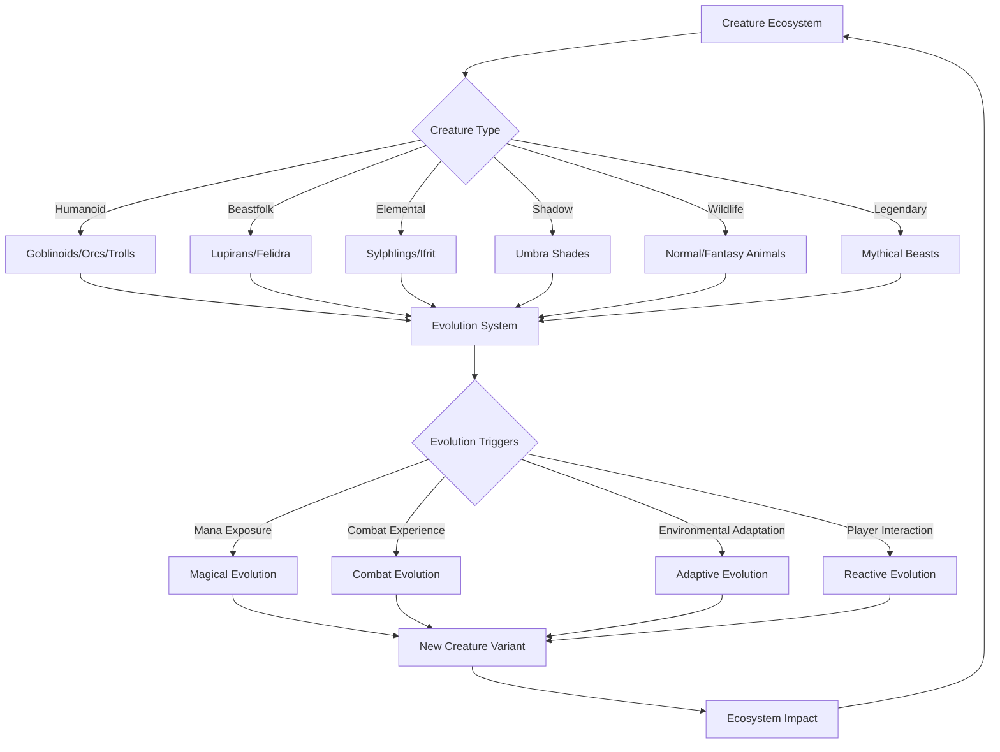
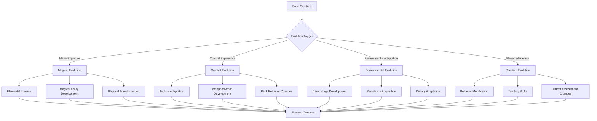

# World: Bestiary of Vantiel
## 1. Overview

The Bestiary of Vantiel catalogs the diverse creatures that inhabit this dynamic world, from common wildlife to legendary beasts of myth. Each creature exists within a complex ecosystem that responds to player actions, magical influences, and environmental changes. This living bestiary serves as both a reference guide and a framework for understanding how creatures evolve, interact, and shape the world around them.

### 1.1 Beast Taming Magic

Beast Taming is a rare magical art that allows individuals with a unique aptitude to form contracts—either temporary or permanent—with natural beasts and certain fantasy variants (e.g., direwolves). Creatures that are overly corrupted or hostile, such as demonic entities or monstrous goblinoids, are typically incompatible with this magic. This discipline has roots in the practices of ancient beastfolk shamans, later adopted and refined by adventurous humans seeking new forms of companionship and power.

#### Contract Types

1. **Temporary Contracts**
   - Short-term compacts for immediate assistance in hunting, scouting, or battle.
   - Limited power sharing, typically focused on a single skill or attribute.
   - Less demanding for both tamer and beast, often ending naturally after a mission.

2. **Permanent Contracts**
   - Deep, long-lasting bonds requiring high trust and mutual acceptance.
   - Greater exchange of physical or magical traits; the tamer may gain heightened senses, strength, or elemental blessings.
   - The number of permanent bonds a tamer can maintain is limited by mental strain and mana capacity.

#### The Bonding Process

1. **Initial Connection**
   - Requires peaceful approach and clarity of intention.
   - Creatures sense the tamer’s magical resonance; mutual harmony is essential.
2. **Forming the Contract**
   - Summoning runes or a bonding ritual often involved.
   - Physical contact and mana flow seal the agreement.
   - Success rate depends on the beast’s temperament, intelligence, and affinity for the tamer’s mana.
3. **Maintenance**
   - Energy upkeep keeps the contract stable, especially for more powerful creatures.
   - Periodic reaffirmation may be necessary if the bond weakens over time.

#### Power Sharing Mechanics

- **Beast → Tamer**
  - Physical enhancements (speed, strength, endurance).
  - Unique racial traits (flight, underwater breathing, enhanced senses).
  - Magical resistances or elemental affinities.

- **Tamer → Beast**
  - Improved cognition, strategy, and communication.
  - Protective wards and enhanced healing.
  - Potential for boosted evolution (e.g., dire variants, elemental forms).

#### Limitations and Considerations

1. **Compatibility Factors**
   - Corrupted or monstrous entities are rarely tamable.
   - Higher intelligence can lead to more complex bonds (e.g., direwolves vs. normal wolves).
   - Alignment of magical essences deeply influences success.

2. **Taming Difficulty**
   - Simple livestock or docile animals are easiest.
   - Aggressive beasts like wolven predators require greater skill.
   - Legendary creatures or ultimate species are nearly impossible.

3. **Ethical & Practical Limits**
   - Too many active bonds cause mental stress for the tamer.
   - Overextension can harm the beast’s stamina or mental well-being.
   - Certain cultures view forced taming as immoral if not mutually consensual.

#### Neural HUD Integration

- **Contract Status Display**
  - Shows bond strength, shared mana levels, and emotional state of the beast.
  - Indicates temporary contract timers or permanent bond health.
- **Beast Analysis**
  - Displays tamability ranking, potential synergy, and recommended approach.
  - Summarizes any passively gained traits (night vision, elemental resistances, etc.).
- **Active Contract Management**
  - Allows the tamer to channel mana directly into the beast mid-battle.
  - Simplifies communication and ability activation, especially for complex synergy effects.

#### System Integration

1. **Combat System**
   - Beasts can flank enemies, provide crowd control, or heal allies.
   - Coordinated attacks leverage pack tactics for increased damage.
   - Soul-linked evolutions can manifest mid-battle if synergy is high.

2. **Evolution System**
   - Tamed creatures accumulate unique evolution points influenced by the bond.
   - Bond strength can unlock specialized transformations or new abilities.
   - Over time, a well-cared-for beast may develop advanced forms beyond normal evolution.

3. **Crafting & Economy**
   - Tamed beasts with unique abilities (e.g., a fire-breathing lizard) can aid in forging or harvesting.
   - Rare beast materials may be ethically sourced via mutual agreement rather than lethal hunts.
   - Skilled beast tamers may earn revenue by training specialized creatures or offering them for caravan defense.

By weaving Beast Taming Magic into the fabric of Vantiel’s ecology, adventurers gain a powerful, flexible means of interacting with wildlife—without resorting to direct subjugation. This system accommodates everything from a tamer bonding with a faithful wolf companion to forging uneasy alliances with majestic dire creatures, enriching both the narrative and the player’s toolkit.



## 2. Creature Classification System

### 2.1 Rarity & Threat Levels

All creatures in Vantiel are classified according to their rarity and the threat they pose:

#### Rarity Scale
- **Common (C)**: Frequently encountered throughout Vantiel
- **Uncommon (U)**: Found in specific regions or under certain conditions
- **Rare (R)**: Difficult to find, often requiring specific circumstances
- **Very Rare (VR)**: Exceptionally scarce, sometimes believed to be myths
- **Legendary (L)**: Unique or nearly extinct creatures of immense power

#### Threat Scale
- **F-Rank**: Minimal threat, manageable by untrained individuals
- **E-Rank**: Minor threat, challenging for untrained individuals
- **D-Rank**: Moderate threat, requiring basic combat training
- **C-Rank**: Significant threat, requiring experienced adventurers
- **B-Rank**: Major threat, requiring skilled adventurers
- **A-Rank**: Severe threat, requiring elite adventurers
- **S-Rank**: Catastrophic threat, requiring heroes or armies

### 2.2 Neural HUD Integration

Creatures appear in the Neural HUD with information based on the player's knowledge and skills:

#### Basic Information (Available to All)
- Creature name (if known)
- Basic physical description
- Observed behavior

#### Advanced Information (Requires Skills)
- **Hunting/Tracking Skill**: Reveals habitat, tracks, and movement patterns
- **Monster Lore Skill**: Reveals weaknesses, strengths, and special abilities
- **Combat Analysis Skill**: Reveals attack patterns and defensive capabilities
- **Magical Sensing Skill**: Reveals magical properties and mana signature

#### Threat Assessment
The Neural HUD displays a color-coded threat assessment based on the player's current level and the creature's threat level:
- **Green**: Minimal threat to the player
- **Yellow**: Moderate threat, caution advised
- **Orange**: Significant threat, preparation recommended
- **Red**: Severe threat, extreme caution required
- **Purple**: Potentially lethal threat

## 3. Humanoids & Goblinoids

### 3.1 Goblins

Goblins are among the most reviled and feared creatures in Vantiel, not for their individual strength, but for their malicious cunning, sadistic nature, and overwhelming numbers. These small, wiry humanoids embody the worst aspects of intelligent life—cruelty, greed, and an insatiable hunger for violence that borders on the pathological.

#### Physiology & Appearance

Standing 3-4 feet tall with hunched postures, goblins possess sickly green or grayish skin that exudes an oily substance with a distinctive putrid odor—a scent that lingers in areas they inhabit and can trigger traumatic memories in survivors of goblin raids. Their bodies are disproportionate, with oversized heads, elongated ears that twitch constantly to detect prey, and unnaturally long arms ending in clawed fingers capable of disemboweling unarmored victims.

Their most disturbing feature is their mouths—wide, lipless grins filled with yellowed, needle-sharp teeth designed for tearing flesh. These teeth continuously grow throughout their lives, forcing goblins to gnaw on bones, wood, or metal to prevent painful overgrowth. Their eyes glow a dull yellow or red in darkness, and they possess exceptional night vision, making them primarily nocturnal hunters.

Goblins reproduce at an alarming rate. Females can birth litters of 4-6 offspring after just a three-month gestation period, and these young reach maturity within a year. This rapid reproduction cycle explains their seemingly endless numbers despite high mortality rates.

#### Psychology & Behavior

The goblin mind is a disturbing amalgamation of animal instinct and twisted intelligence. They possess a natural sadism that manifests in their every action—from their hunting practices to their social hierarchies. Goblins derive genuine pleasure from causing pain, and their laughter (a high-pitched, unsettling cackle) is most often heard during torture sessions or when witnessing suffering.

Their social structure is built entirely on dominance through violence. Status is gained by demonstrating cruelty and cunning, with leadership positions constantly challenged through brutal confrontations. Weaker goblins are mercilessly bullied, forced to eat last, sleep in the most exposed areas, and serve as expendable scouts or trap-testers.

Perhaps most disturbing is their capacity for learning and adaptation. Goblins carefully observe their enemies, learning from defeats and developing countermeasures with frightening speed. They can reverse-engineer simple technologies and weapons, creating crude but effective copies. This adaptive intelligence makes goblin tribes increasingly dangerous the longer they survive.

#### Habitat & Territories

Goblin warrens are nightmarish labyrinths of narrow tunnels, trapped chambers, and fetid nesting areas. These underground complexes reek of excrement, rotting meat, and the distinctive musky odor of goblin bodies. The walls are often decorated with crude paintings depicting acts of violence or adorned with trophies—bones, scalps, and personal items taken from victims.

The layout of these warrens is deliberately confusing, with dead ends, false passages, and hidden chambers designed to trap and separate intruders. Common features include:

- **Breeding Pits**: Foul-smelling chambers where females birth and raise young
- **Torture Chambers**: Areas specifically designed for "playing" with captives
- **Feast Halls**: Large caverns where the tribe gathers to eat, often containing piles of gnawed bones
- **Chieftain's Den**: The largest chamber, filled with stolen treasures and the chieftain's personal trophies
- **Trap Corridors**: Passages rigged with deadly mechanisms to catch unwary intruders

#### Base Goblin
- **Classification**: Common (C), E-Rank
- **Attributes**: STR 8, SPD 12, INT 8, WIS 6, CHA 5, LCK 7
- **Skills**: Stealth 3, Trap-Making 2, Scavenging 3
- **Abilities**:
  - **Pack Tactics**: +2 to attack rolls when allies are adjacent to the target
  - **Nimble Escape**: Can disengage as a bonus action
  - **Darkvision**: Can see in darkness up to 60 feet

**Combat Behavior**: Common goblins are cowardly when alone but become emboldened in groups. They prefer ambush tactics, attacking from multiple directions and targeting perceived weaknesses. They employ crude but effective weapons—often poisoned with toxic substances made from their own excrement mixed with rotting meat and certain fungi, causing wounds to fester and become infected even if the initial injury is minor.

**Torture Methods**: Goblins are known for keeping victims alive for days or weeks, systematically removing non-vital body parts, force-feeding captives their own flesh, or using specialized fungi that cause hallucinations and heightened pain sensitivity. They seem to instinctively understand which torments will cause the most psychological damage to different races.

#### Hobgoblin (Warrior Goblin)
- **Classification**: Uncommon (U), D-Rank
- **Attributes**: STR 14, SPD 10, INT 10, WIS 10, CHA 9, LCK 8
- **Skills**: Weapon Mastery 3, Tactics 2, Intimidation 3
- **Abilities**:
  - **Martial Advantage**: Extra damage when attacking with allies
  - **Disciplined**: Advantage on saving throws against fear
  - **Commander's Order**: Can direct lesser goblins to take specific actions

**Physical Traits**: Hobgoblins stand taller than common goblins, with more muscular builds and skin tones ranging from deep orange to dark red. Their bodies are covered in ritual scarification—patterns of raised scars that tell the story of their victories and rank. Many hobgoblins remove their own lips and eyelids as a demonstration of their tolerance for pain and vigilance.

**Combat Behavior**: Unlike their smaller kin, hobgoblins embrace direct combat, using coordinated tactics and disciplined formations. They train lesser goblins through brutal methods, breaking bones that heal improperly to create specialized fighters with unique deformities. A hobgoblin's weapon is their most prized possession, often decorated with trophies from significant kills—teeth, finger bones, or dried ears.

#### Goblin Shaman
- **Classification**: Rare (R), C-Rank
- **Attributes**: STR 6, SPD 10, INT 14, WIS 12, CHA 10, LCK 9
- **Skills**: Dark Magic 4, Ritual Casting 3, Herbalism 2
- **Abilities**:
  - **Darkbinding Hex**: Restrains enemies in shadowy tendrils
  - **Blood Frenzy**: Enhances allies' attack power at the cost of defense
  - **Curse of Weakness**: Reduces target's strength and effectiveness

**Physical Traits**: Goblin shamans are physically weaker than their brethren but possess disturbing mutations—extra eyes growing in unusual places, transparent skin that reveals pulsing organs, or limbs that bend in impossible ways. They adorn themselves with fetishes made from the remains of powerful enemies, believing they can absorb strength from these trophies.

**Magical Practices**: Their magic draws power from pain and suffering, requiring blood sacrifices for more powerful spells. Shamans maintain "pain gardens"—areas where captives are kept in states of perpetual agony to fuel magical workings. Their rituals often involve self-mutilation, consumption of toxic substances that induce violent visions, or communion with dark entities from beyond the veil of reality.

**Special Abilities**: Some shamans develop the ability to puppeteer the dead, creating crude undead servants from fallen enemies or goblins. Others can curse victims with parasitic spirits that slowly consume them from within, causing hallucinations and self-destructive behavior.

#### Goblin Brute
- **Classification**: Rare (R), C-Rank
- **Attributes**: STR 18, SPD 8, INT 6, WIS 6, CHA 5, LCK 6
- **Skills**: Intimidation 4, Smashing 4, Endurance 3
- **Abilities**:
  - **Charging Rampage**: Devastating bull-rush attack
  - **Thick Hide**: Reduced damage from physical attacks
  - **Frenzy**: Increased attack speed when below half health

**Physical Traits**: Towering over their kin at 8-10 feet, brutes are monstrous aberrations created through a combination of selective breeding, alchemical treatments, and dark rituals. Their skin is thick and calloused, often embedded with crude metal plates or shards that tear at enemies during close combat. Their jaws are powerful enough to crush bone, and many brutes have had their teeth replaced with metal spikes or sharpened stones.

**Origins**: The creation of a brute is a horrific process with a high mortality rate. Selected goblins are force-fed a mixture of growth-inducing fungi, crushed bones, and alchemical compounds that cause rapid, painful growth. Their limbs are repeatedly broken and set to increase size and density, and many have their skulls surgically altered to reduce higher brain functions while enhancing aggression.

**Combat Behavior**: Brutes are living siege weapons, used to break through defenses or create chaos on battlefields. They often carry massive improvised weapons—uprooted trees, chunks of masonry, or specially crafted mauls made from multiple weapons bound together. When wounded, they enter a berserk state, attacking anything within reach, including other goblins.

#### Goblin Warchief
- **Classification**: Very Rare (VR), B-Rank
- **Attributes**: STR 16, SPD 12, INT 14, WIS 12, CHA 14, LCK 10
- **Skills**: Leadership 5, Combat Tactics 4, Weapon Mastery 4
- **Abilities**:
  - **Aura of Dominance**: Increases combat effectiveness of nearby goblins
  - **Executioner's Strike**: Devastating finisher that inspires fear
  - **Battle Cry**: Rallies all goblin forces, granting them temporary strength

**Physical Traits**: Warchiefs represent the pinnacle of goblin evolution—larger, stronger, and significantly more intelligent than their underlings. Their bodies bear the scars of countless battles, and they often incorporate trophies from defeated enemies directly into their flesh—bones grafted onto limbs, skin from different races stitched into their own, or skulls fashioned into shoulder armor.

**Rise to Power**: A warchief's path to leadership is paved with blood and betrayal. They must not only defeat the previous leader but demonstrate exceptional cunning and cruelty. Many warchiefs maintain power by keeping potential rivals fighting among themselves, orchestrating elaborate schemes to test loyalty, and executing challengers in spectacularly brutal ways to discourage future attempts.

**Strategic Capabilities**: What makes warchiefs truly dangerous is their capacity for long-term planning and psychological warfare. They study their enemies, learning weaknesses and fears to exploit. Some warchiefs have been known to:
- Release tortured captives to spread terror
- Target specific community members to demoralize populations
- Use psychological tactics like returning victims' body parts to their families
- Coordinate attacks with natural disasters or other threats

#### Reproduction and Lifecycle

The goblin reproductive cycle is as disturbing as every other aspect of their existence. Females enter heat cycles that trigger frenzied mating competitions among males, often resulting in deaths. Pregnancy lasts only three months, after which 4-6 goblin infants are born.

Infant mortality is extremely high, with mothers often eating the weakest offspring to strengthen the survivors. Young goblins grow rapidly, reaching physical maturity within a year, though their mental development continues. They learn through observation and cruel games that mimic adult activities—creating simple traps, torturing small animals, or fighting each other for scraps of food.

By age three, a goblin has either secured a place in the tribe's hierarchy or died trying. Few goblins live beyond 20 years, though warchiefs and shamans may reach 30-40 through a combination of caution, magical enhancement, and cannibalism of younger goblins to absorb their vitality.

#### Ecosystem Impact
- **Territory Control**: Goblin tribes claim territories, driving out or consuming local wildlife. Areas under long-term goblin control become blighted landscapes—vegetation dies, water sources become polluted, and normal animals flee. The soil itself seems to absorb the malice of its inhabitants, becoming tainted and infertile.

- **Resource Depletion**: Goblins consume resources with reckless abandon, stripping areas bare before moving on. They have no concept of sustainability, taking everything of value and leaving nothing but waste and filth. This behavior forces frequent migration as resources are depleted, spreading their destructive influence across wider areas.

- **Adaptive Threat**: Perhaps most concerning is their ability to learn from defeats. Tribes that survive encounters with adventurers or military forces quickly adapt their tactics, developing countermeasures for specific threats. A tribe that has been burned out will develop fire-resistant shelters; one that has faced magic users will create ambush tactics specifically to target spellcasters.

- **Hierarchical Evolution**: Successful goblin tribes produce more specialized variants as they grow. A tribe that survives long enough will naturally develop hobgoblins as military leaders, shamans to provide magical support, and eventually brutes as shock troops. The appearance of a warchief signals a tribe that has reached a dangerous level of organization and poses a significant regional threat.

#### Cultural Impact on Vantiel

The threat of goblin raids has shaped human settlement patterns throughout Vantiel. Villages are built with defensible positions, watchtowers, and alarm systems. Children are taught from an early age to recognize the signs of goblin activity and emergency protocols for raids. Many communities maintain "goblin hunters"—specialized trackers who monitor tribal movements and eliminate scouts before they can report back to their warrens.

The psychological impact of goblin attacks creates lasting trauma in survivors. "Goblin fear" is a recognized condition, characterized by night terrors, hypervigilance, and extreme reactions to certain triggers—the distinctive goblin odor, the sound of their chattering speech, or the sight of their crude tribal markings.

Despite their destructive nature, goblins have inadvertently contributed to human advancement through the necessity of developing better defenses, weapons, and warning systems. The constant threat they pose has also fostered stronger community bonds and cooperation between settlements that might otherwise remain isolated.

### 3.2 Orcs

Large, brutish humanoids with tribal cultures centered around strength and conquest, orcs represent a significant military threat when organized.

#### Blood Orc
- **Classification**: Uncommon (U), D-Rank
- **Attributes**: STR 16, SPD 10, INT 8, WIS 8, CHA 8, LCK 7
- **Skills**: Weapon Mastery 3, Intimidation 3, Survival 2
- **Abilities**:
  - **Blood Rage**: Increased damage when below half health
  - **Ferocity**: Can make an additional attack when landing a critical hit
  - **Intimidating Presence**: Can frighten weaker enemies

#### Shamanic Orc
- **Classification**: Rare (R), C-Rank
- **Attributes**: STR 12, SPD 10, INT 12, WIS 14, CHA 12, LCK 10
- **Skills**: Elemental Magic 4, Ritual Casting 3, Spirit Communication 3
- **Abilities**:
  - **Elemental Calling**: Can summon minor elemental forces
  - **Healing Totems**: Places totems that heal nearby allies
  - **Spirit Sight**: Can detect invisible or hidden entities

#### Iron Orc
- **Classification**: Rare (R), C-Rank
- **Attributes**: STR 16, SPD 8, INT 10, WIS 10, CHA 10, LCK 8
- **Skills**: Heavy Armor 4, Shield Mastery 4, Formation Fighting 3
- **Abilities**:
  - **Shield Wall**: Increased defense when adjacent to allies
  - **Unyielding**: Resistance to being knocked down or pushed back
  - **War Cry**: Bolsters allies' morale, granting temporary courage

#### Ecosystem Impact
- **Territorial Expansion**: Orc tribes claim large territories, often clashing with other intelligent species
- **Sustainable Hunting**: Unlike goblins, orcs practice sustainable hunting to maintain resources
- **Cultural Evolution**: Successful tribes develop more sophisticated cultural practices and technologies
- **Spiritual Connection**: Shamanic orcs maintain balance with natural forces, sometimes becoming guardians of sacred sites

### 3.3 Trolls

Massive, regenerating creatures with destructive tendencies, trolls are among the most feared monsters in wilderness areas.

#### Swamp Troll
- **Classification**: Uncommon (U), C-Rank
- **Attributes**: STR 18, SPD 8, INT 6, WIS 8, CHA 5, LCK 6
- **Skills**: Regeneration 4, Swimming 3, Ambush 3
- **Abilities**:
  - **Rapid Regeneration**: Quickly heals wounds unless damaged by fire or acid
  - **Disease Cloud**: Emits a cloud of disease that sickens nearby creatures
  - **Swamp Camouflage**: Can hide effectively in swampy terrain

#### Mountain Troll
- **Classification**: Rare (R), B-Rank
- **Attributes**: STR 20, SPD 8, INT 6, WIS 8, CHA 5, LCK 6
- **Skills**: Rock Throwing 4, Climbing 3, Endurance 4
- **Abilities**:
  - **Stone Skin**: Increased resistance to physical damage
  - **Boulder Throw**: Can hurl massive rocks at distant targets
  - **Mountain Stride**: Unaffected by difficult mountain terrain

#### Chaos Troll
- **Classification**: Very Rare (VR), A-Rank
- **Attributes**: STR 18, SPD 10, INT 8, WIS 8, CHA 5, LCK 8
- **Skills**: Chaos Magic 4, Regeneration 5, Destruction 4
- **Abilities**:
  - **Unstable Form**: Body constantly shifts and changes, making it difficult to target
  - **Mana Eruption**: Releases bursts of chaotic magical energy
  - **Death Explosion**: Explodes violently when killed, dealing massive damage

#### Ecosystem Impact
- **Apex Predators**: Trolls dominate their territories, forcing other predators to relocate
- **Environmental Alteration**: Chaos trolls can permanently alter landscapes through mana corruption
- **Regenerative Adaptation**: Trolls exposed to specific damage types may develop resistances over time
- **Population Control**: Despite their power, trolls reproduce slowly, preventing overpopulation

## 4. Beastfolk & Intelligent Races

### 4.1 Lupirans (Wolffolk)

A proud race of wolf-like humanoids known for their pack mentality, loyalty, and hunting prowess.

#### Lupiran Hunter
- **Classification**: Uncommon (U), D-Rank
- **Attributes**: STR 14, SPD 16, INT 10, WIS 12, CHA 10, LCK 8
- **Skills**: Tracking 4, Bow Mastery 3, Stealth 3
- **Abilities**:
  - **Keen Senses**: Enhanced perception, especially smell and hearing
  - **Pack Tactics**: Increased effectiveness when fighting alongside allies
  - **Swift Runner**: Superior movement speed, especially in natural terrain

#### Lupiran Alpha
- **Classification**: Rare (R), C-Rank
- **Attributes**: STR 16, SPD 14, INT 12, WIS 14, CHA 16, LCK 10
- **Skills**: Leadership 5, Combat Tactics 4, Intimidation 4
- **Abilities**:
  - **Alpha's Command**: Can direct pack members with exceptional efficiency
  - **Rallying Howl**: Bolsters allies' morale and combat effectiveness
  - **Territorial Defender**: Increased strength when defending pack territory

#### Lupiran Moonspeaker
- **Classification**: Rare (R), C-Rank
- **Attributes**: STR 12, SPD 14, INT 14, WIS 16, CHA 14, LCK 12
- **Skills**: Lunar Magic 4, Spirit Communication 4, Healing 3
- **Abilities**:
  - **Moonlight Blessing**: Healing and enhancement magic powered by moonlight
  - **Spirit Walk**: Can temporarily enter the spirit realm
  - **Prophetic Dreams**: Receives visions that can guide the pack

#### Ecosystem Impact
- **Natural Balance**: Lupirans maintain ecological balance through sustainable hunting
- **Territorial Protection**: Often protect their territories from destructive forces
- **Cultural Exchange**: More likely than other beastfolk to trade and interact with humans
- **Lunar Influence**: Lupiran communities experience heightened activity during full moons

### 4.2 Felidra (Catfolk)

Agile, independent feline humanoids known for their stealth, curiosity, and mercenary tendencies.

#### Felidra Scout
- **Classification**: Uncommon (U), D-Rank
- **Attributes**: STR 12, SPD 18, INT 12, WIS 12, CHA 12, LCK 10
- **Skills**: Acrobatics 4, Stealth 4, Perception 3
- **Abilities**:
  - **Perfect Balance**: Can move across narrow or unstable surfaces with ease
  - **Night Vision**: Superior vision in darkness
  - **Silent Step**: Enhanced stealth capabilities, especially at night

#### Felidra Shadowdancer
- **Classification**: Rare (R), C-Rank
- **Attributes**: STR 12, SPD 18, INT 14, WIS 12, CHA 14, LCK 12
- **Skills**: Shadow Magic 4, Acrobatics 5, Dagger Mastery 3
- **Abilities**:
  - **Shadow Meld**: Can blend into shadows, becoming nearly invisible
  - **Dimensional Pounce**: Can leap through shadows to appear elsewhere
  - **Nine Lives**: Can avoid death once per day through magical means

#### Felidra Merchant Prince
- **Classification**: Rare (R), C-Rank
- **Attributes**: STR 10, SPD 16, INT 16, WIS 14, CHA 18, LCK 14
- **Skills**: Negotiation 5, Appraisal 4, Deception 4
- **Abilities**:
  - **Silver Tongue**: Exceptional persuasive abilities in trade negotiations
  - **Market Instinct**: Can sense economic opportunities and dangers
  - **Hidden Claws**: Maintains a network of enforcers and spies

#### Ecosystem Impact
- **Urban Adaptation**: Felidra thrive in urban environments, often controlling shadow economies
- **Treasure Hunters**: Their collection of rare artifacts can disrupt magical ecosystems
- **Information Network**: Maintain extensive information networks that influence political landscapes
- **Cultural Infiltration**: Readily adopt and modify aspects of other cultures to their advantage

## 5. Elemental & Magical Beings

### 5.1 Sylphlings (Wind Spirits)

Ethereal beings composed of air and magical energy, embodying the freedom and unpredictability of the wind.

#### Lesser Sylphling
- **Classification**: Rare (R), D-Rank
- **Attributes**: STR 6, SPD 20, INT 10, WIS 12, CHA 14, LCK 12
- **Skills**: Air Magic 3, Evasion 4, Weather Sensing 3
- **Abilities**:
  - **Wind Form**: Can transform into a gust of wind, passing through small openings
  - **Gale Force**: Creates powerful gusts that can knock enemies back
  - **Whisperwind**: Can carry sounds and messages over great distances

#### Greater Sylphling
- **Classification**: Very Rare (VR), B-Rank
- **Attributes**: STR 8, SPD 22, INT 14, WIS 16, CHA 16, LCK 14
- **Skills**: Storm Magic 5, Flight 5, Illusion 3
- **Abilities**:
  - **Tempest Calling**: Can summon localized storms
  - **Wind Blades**: Creates cutting blades of compressed air
  - **Cyclone Shield**: Surrounds itself with a protective vortex

#### Sylphling Elder
- **Classification**: Very Rare (VR), A-Rank
- **Attributes**: STR 10, SPD 24, INT 18, WIS 20, CHA 18, LCK 16
- **Skills**: Weather Control 5, Air Mastery 5, Ancient Knowledge 4
- **Abilities**:
  - **Hurricane Manifestation**: Transforms the surrounding area into a devastating hurricane
  - **Wind's Wisdom**: Can access memories carried by the wind from distant places and times
  - **Breath of Life**: Can temporarily grant others the ability to become wind-like

#### Ecosystem Impact
- **Weather Patterns**: Concentrations of Sylphlings influence local weather patterns
- **Aerial Ecosystem**: Maintain balance among flying creatures and cloud formations
- **Magical Dispersal**: Help distribute magical energies through air currents
- **Environmental Indicators**: Their presence or absence can indicate environmental health

### 5.2 Ifrit (Fire Djinn)

Powerful fire elementals with humanoid forms, embodying the destructive and purifying aspects of flame.

#### Ember Ifrit
- **Classification**: Rare (R), C-Rank
- **Attributes**: STR 14, SPD 14, INT 12, WIS 10, CHA 14, LCK 10
- **Skills**: Fire Magic 4, Heat Resistance 5, Intimidation 3
- **Abilities**:
  - **Flame Body**: Deals fire damage to anything that touches it
  - **Fire Bolt**: Launches concentrated bolts of flame
  - **Smoke Screen**: Creates thick smoke to obscure vision

#### Blaze Ifrit
- **Classification**: Very Rare (VR), B-Rank
- **Attributes**: STR 16, SPD 16, INT 14, WIS 12, CHA 16, LCK 12
- **Skills**: Inferno Magic 5, Fire Shaping 4, Battle Tactics 3
- **Abilities**:
  - **Explosive Teleport**: Can teleport in a burst of flames
  - **Magma Strike**: Attacks infuse targets with molten energy
  - **Heat Drain**: Can absorb fire and heat to restore strength

#### Infernal Ifrit
- **Classification**: Very Rare (VR), A-Rank
- **Attributes**: STR 18, SPD 18, INT 16, WIS 14, CHA 18, LCK 14
- **Skills**: Hellfire Magic 5, Fire Mastery 5, Ancient Pacts 4
- **Abilities**:
  - **Infernal Transformation**: Can transform the surrounding area into a hellscape
  - **Soul Burn**: Flames that damage the spirit as well as the body
  - **Phoenix Rebirth**: Can resurrect from its own ashes once per lunar cycle

#### Ecosystem Impact
- **Volcanic Activity**: Large Ifrit populations can trigger or suppress volcanic activity
- **Forest Renewal**: Controlled burns by benevolent Ifrit can promote forest health
- **Thermal Adaptation**: Their presence forces local wildlife to develop heat resistance
- **Magical Forges**: Often form symbiotic relationships with smiths and craftsmen

## 6. Shadow Beings

### 6.1 Umbra Shades

Mysterious entities born from darkness and magical corruption, existing between the material world and the void.

#### Lesser Shade
- **Classification**: Rare (R), D-Rank
- **Attributes**: STR 10, SPD 14, INT 10, WIS 12, CHA 8, LCK 10
- **Skills**: Shadow Magic 3, Stealth 4, Fear Induction 3
- **Abilities**:
  - **Shadow Step**: Can move between shadows as a form of teleportation
  - **Life Drain**: Absorbs small amounts of life force from living beings
  - **Darkness Shroud**: Creates areas of magical darkness

#### Greater Shade
- **Classification**: Very Rare (VR), B-Rank
- **Attributes**: STR 14, SPD 16, INT 14, WIS 14, CHA 10, LCK 12
- **Skills**: Void Magic 4, Soul Manipulation 4, Terror 4
- **Abilities**:
  - **Possession**: Can temporarily possess weakened targets
  - **Nightmare Manifestation**: Creates illusions based on targets' fears
  - **Void Tendrils**: Attacks with tentacles of pure darkness

#### Umbral Lord
- **Classification**: Very Rare (VR), A-Rank
- **Attributes**: STR 16, SPD 18, INT 18, WIS 18, CHA 16, LCK 14
- **Skills**: Abyssal Magic 5, Reality Warping 4, Ancient Knowledge 5
- **Abilities**:
  - **Reality Tear**: Creates temporary rifts to the void
  - **Shadow Legion**: Can split into multiple lesser shades
  - **Consume Light**: Absorbs light and magic to grow stronger

#### Ecosystem Impact
- **Magical Corruption**: Their presence corrupts magical ley lines and natural energy
- **Psychological Influence**: Prolonged exposure causes fear, paranoia, and nightmares
- **Dimensional Weakening**: Large concentrations can thin the barriers between dimensions
- **Predatory Cycle**: Feed on negative emotions, creating a cycle of fear and power

## 7. Wildlife of Vantiel

### 7.1 Normal Animals

#### Wolf
- **Classification**: Common (C), E-Rank
- **Attributes**: STR 12, SPD 14, INT 6, WIS 12, CHA 6, LCK 8
- **Skills**: Tracking 3, Pack Tactics 3, Endurance 2
- **Abilities**:
  - **Pack Hunter**: Increased effectiveness when hunting in groups
  - **Howl**: Can communicate with other wolves over long distances
  - **Winter Coat**: Resistance to cold environments

#### Bear
- **Classification**: Uncommon (U), D-Rank
- **Attributes**: STR 18, SPD 10, INT 6, WIS 12, CHA 6, LCK 8
- **Skills**: Foraging 3, Climbing 2, Intimidation 3
- **Abilities**:
  - **Powerful Swipe**: High-damage melee attack
  - **Thick Hide**: Reduced damage from physical attacks
  - **Hibernation**: Can recover fully by sleeping for extended periods

#### Eagle
- **Classification**: Uncommon (U), E-Rank
- **Attributes**: STR 8, SPD 18, INT 6, WIS 14, CHA 8, LCK 10
- **Skills**: Perception 4, Diving 3, Hunting 3
- **Abilities**:
  - **Keen Eyesight**: Can spot small details from great distances
  - **Diving Attack**: Powerful attack from above
  - **Soaring Flight**: Can fly for extended periods with minimal effort

#### Deer
- **Classification**: Common (C), F-Rank
- **Attributes**: STR 10, SPD 16, INT 4, WIS 12, CHA 8, LCK 10
- **Skills**: Evasion 3, Perception 3, Jumping 3
- **Abilities**:
  - **Sprint**: Can move at high speed for short bursts
  - **Alertness**: Difficult to surprise or ambush
  - **Seasonal Antlers**: Males grow powerful antlers during mating season

### 7.2 Fantasy Animal Variants

#### Moonshadow Wolf
- **Classification**: Rare (R), C-Rank
- **Attributes**: STR 14, SPD 16, INT 8, WIS 14, CHA 10, LCK 12
- **Skills**: Shadow Magic 3, Stealth 4, Pack Tactics 4
- **Abilities**:
  - **Shadowmeld**: Can become nearly invisible in darkness
  - **Moon Howl**: Howl that disorients enemies, reducing accuracy
  - **Lunar Empowerment**: Gains strength during full moons

#### Emberback Bear
- **Classification**: Rare (R), B-Rank
- **Attributes**: STR 20, SPD 12, INT 8, WIS 14, CHA 8, LCK 10
- **Skills**: Fire Resistance 5, Intimidation 4, Destruction 4
- **Abilities**:
  - **Fiery Roar**: Releases a shockwave of heat, scorching enemies
  - **Infernal Swipe**: Sets enemies ablaze with a single claw strike
  - **Molten Hide**: Contact with its fur causes burn damage

#### Stormwing Eagle
- **Classification**: Rare (R), C-Rank
- **Attributes**: STR 10, SPD 20, INT 8, WIS 16, CHA 10, LCK 12
- **Skills**: Lightning Magic 3, Storm Riding 4, Diving 4
- **Abilities**:
  - **Thunder Dive**: A high-speed dive attack that generates a small shockwave
  - **Lightning Reflexes**: Evades attacks with unnatural speed
  - **Storm Caller**: Can influence local weather patterns

#### Starlight Stag
- **Classification**: Very Rare (VR), C-Rank
- **Attributes**: STR 12, SPD 18, INT 10, WIS 18, CHA 16, LCK 14
- **Skills**: Celestial Magic 4, Healing 3, Evasion 4
- **Abilities**:
  - **Celestial Glow**: Illuminates dark areas, calming nearby creatures
  - **Sanctuary Aura**: Temporarily shields allies from harm
  - **Astral Step**: Can briefly step into the celestial realm to avoid danger

### 7.3 Aquatic Life

#### Glowfin
- **Classification**: Uncommon (U), F-Rank
- **Attributes**: STR 4, SPD 12, INT 4, WIS 8, CHA 10, LCK 10
- **Skills**: Bioluminescence 4, Evasion 3, School Formation 2
- **Abilities**:
  - **Luminous Scales**: Provides light in dark underwater areas
  - **Flash Escape**: Emits a blinding flash to escape predators
  - **Magical Essence**: Scales can be used in alchemical recipes

#### Razorfang Pike
- **Classification**: Rare (R), C-Rank
- **Attributes**: STR 16, SPD 16, INT 6, WIS 10, CHA 6, LCK 8
- **Skills**: Ambush 4, Rending 4, Territorial Defense 3
- **Abilities**:
  - **Boat Crusher**: Can ram vessels, damaging their hulls
  - **Death Roll**: Grabs prey and spins violently, dealing massive damage
  - **Armored Scales**: Resistant to piercing and slashing damage

### 7.4 Exotic Beasts

#### Frost Elk
- **Classification**: Rare (R), C-Rank
- **Attributes**: STR 14, SPD 18, INT 8, WIS 16, CHA 12, LCK 12
- **Skills**: Ice Magic 3, Survival 4, Jumping 4
- **Abilities**:
  - **Frost Aura**: Slows movement and reduces fire resistance in nearby enemies
  - **Ice Charge**: Antlers freeze targets on impact
  - **Winter Stride**: Unaffected by snow or ice terrain

#### Thunderhorn Rhino
- **Classification**: Very Rare (VR), B-Rank
- **Attributes**: STR 22, SPD 14, INT 6, WIS 12, CHA 8, LCK 10
- **Skills**: Lightning Resistance 5, Charging 5, Intimidation 4
- **Abilities**:
  - **Static Slam**: Generates an electrical shockwave when it charges
  - **Stormcaller**: Summons a localized thunderstorm during battle
  - **Conductive Horn**: Can channel and redirect lightning strikes

#### Firemane Lion
- **Classification**: Very Rare (VR), B-Rank
- **Attributes**: STR 18, SPD 18, INT 8, WIS 14, CHA 14, LCK 12
- **Skills**: Fire Magic 4, Hunting 4, Intimidation 5
- **Abilities**:
  - **Blazing Roar**: Sets the battlefield ablaze with a deafening roar
  - **Lava Strike**: Claws leave trails of molten lava, dealing damage over time
  - **Pride Leader**: Enhances the abilities of other feline creatures nearby

#### Feathered Serpent
- **Classification**: Very Rare (VR), B-Rank
- **Attributes**: STR 16, SPD 16, INT 14, WIS 18, CHA 16, LCK 14
- **Skills**: Wind Magic 4, Hypnosis 4, Ancient Knowledge 4
- **Abilities**:
  - **Hypnotic Gaze**: Temporarily paralyzes enemies with its stare
  - **Wing Burst**: Creates powerful gusts of wind with its feathered wings
  - **Prophecy Whisper**: Can communicate cryptic visions of possible futures

## 8. Legendary Beasts

### 8.1 The Silver Weave Serpent
- **Classification**: Legendary (L), S-Rank
- **Attributes**: STR 24, SPD 20, INT 20, WIS 24, CHA 22, LCK 18
- **Skills**: Water Magic 10, Illusion 8, Ancient Knowledge 9
- **Abilities**:
  - **Song of the Abyss**: A melody that lures listeners into trances
  - **Tidal Fury**: Can summon massive waves and whirlpools
  - **Silver Veil**: Shrouds itself in an aura that distorts perception

### 8.2 The Black Bloom Elk
- **Classification**: Legendary (L), S-Rank
- **Attributes**: STR 20, SPD 22, INT 18, WIS 26, CHA 20, LCK 16
- **Skills**: Death Magic 9, Nature Magic 8, Judgment 10
- **Abilities**:
  - **Bloom of the Dead**: Flowers on its antlers release poisonous spores
  - **Shadowmeld**: Moves silently, blending seamlessly with surroundings
  - **Judgment Charge**: Devastating charge that can obliterate structures

### 8.3 The Celestial Devourer
- **Classification**: Legendary (L), S-Rank
- **Attributes**: STR 26, SPD 24, INT 22, WIS 20, CHA 18, LCK 20
- **Skills**: Void Magic 10, Cosmic Magic 9, Hunting 8
- **Abilities**:
  - **Eclipse Howl**: A howl that causes the sky to darken
  - **Cosmic Hunger**: Absorbs light and energy from surroundings
  - **Ethereal Prowl**: Moves between dimensions at will

### 8.4 The Ashen Titan
- **Classification**: Legendary (L), S-Rank
- **Attributes**: STR 28, SPD 16, INT 18, WIS 20, CHA 18, LCK 16
- **Skills**: Fire Magic 9, Earth Magic 8, Ancient Knowledge 7
- **Abilities**:
  - **Molten Slam**: Creates fissures and rivers of lava
  - **Ashen Storm**: Shrouds itself in a blinding cloud of ash and embers
  - **Volcanic Rebirth**: Can reform itself from magma if destroyed

### 8.5 The Songbird of Eternity
- **Classification**: Legendary (L), S-Rank
- **Attributes**: STR 14, SPD 26, INT 24, WIS 28, CHA 28, LCK 22
- **Skills**: Light Magic 10, Healing 9, Soul Magic 8
- **Abilities**:
  - **Melody of Dreams**: Entrances listeners, drawing them into vivid visions
  - **Lightfeather Shield**: Creates barriers of light that repel darkness
  - **Soulflight**: Can carry willing souls to the afterlife

## 9. New Beasts of Vantiel

### 9.1 Crystal Mantis
- **Classification**: Rare (R), C-Rank
- **Attributes**: STR 14, SPD 16, INT 8, WIS 12, CHA 6, LCK 10
- **Skills**: Crystal Magic 4, Camouflage 4, Precision Strikes 3
- **Abilities**:
  - **Crystal Blades**: Forearms are razor-sharp crystal that can cut through metal
  - **Prismatic Flash**: Emits blinding light from its crystalline body
  - **Gem Growth**: Can grow valuable crystals within its body

**Description**: The Crystal Mantis is a large insectoid creature with a translucent exoskeleton that refracts light in dazzling patterns. Standing about four feet tall, these elegant predators hunt in areas rich with magical crystals, incorporating the minerals into their bodies. Their presence often indicates untapped crystal deposits, making them both a threat and a boon to miners and alchemists.

**Ecosystem Impact**: Crystal Mantises alter the magical conductivity of their territories, creating areas where mana flows more efficiently. This attracts other magical creatures and can lead to the formation of minor ley line confluences.

### 9.2 Mistweaver Frog
- **Classification**: Uncommon (U), D-Rank
- **Attributes**: STR 8, SPD 14, INT 10, WIS 14, CHA 12, LCK 14
- **Skills**: Water Magic 3, Illusion 4, Jumping 4
- **Abilities**:
  - **Mist Cloud**: Exhales dense fog that obscures vision
  - **Illusory Doubles**: Creates false images of itself to confuse predators
  - **Toxic Secretion**: Skin produces a hallucinogenic toxin

**Description**: No larger than a human hand, the Mistweaver Frog's skin shifts between pale blue and lavender depending on its mood. These amphibians are prized by alchemists for their unique secretions, which can be refined into potent hallucinogens or clarity potions depending on the preparation method.

**Ecosystem Impact**: Mistweaver Frogs create small pockets of altered reality around their breeding pools, where perceptions become unreliable and minor illusions may manifest spontaneously. These areas often become sacred to local shamans or feared by superstitious villagers.

### 9.3 Ironbark Treant
- **Classification**: Rare (R), B-Rank
- **Attributes**: STR 22, SPD 8, INT 12, WIS 18, CHA 14, LCK 10
- **Skills**: Earth Magic 5, Endurance 5, Ancient Knowledge 4
- **Abilities**:
  - **Iron Hardening**: Can transform its wooden body to have the hardness of iron
  - **Root Network**: Can sense anything touching the ground within its territory
  - **Seasonal Rebirth**: Regenerates completely with the coming of spring

**Description**: Ironbark Treants are ancient tree spirits that have absorbed metallic minerals from the soil over centuries. Their bark resembles rusted iron plates, and their limbs creak like old hinges when they move. Though slow, they are incredibly strong and nearly impervious to physical damage when fully hardened.

**Ecosystem Impact**: Ironbark Treants purify soil contaminated by dark magic or pollution, gradually restoring blighted lands. Their territories become havens for wildlife and are marked by unusually fertile soil and abundant plant growth.

### 9.4 Whisperwind Serpent
- **Classification**: Very Rare (VR), B-Rank
- **Attributes**: STR 16, SPD 20, INT 16, WIS 18, CHA 18, LCK 14
- **Skills**: Air Magic 5, Prophecy 4, Stealth 4
- **Abilities**:
  - **Voice Theft**: Can perfectly mimic any sound it has heard
  - **Wind Coil**: Can transform into a swirling vortex of air
  - **Prophetic Whisper**: Speaks cryptic truths about possible futures

**Description**: The Whisperwind Serpent appears as a long, sinuous creature with scales that seem to fade in and out of visibility. It has no wings, yet it flies effortlessly through the air as if swimming. These mysterious beings are said to be messengers of fate, appearing before momentous events to whisper prophecies to those destined for greatness or doom.

**Ecosystem Impact**: Whisperwind Serpents alter air currents in their territories, creating unusual weather patterns and wind phenomena. Areas they frequent often develop unique acoustic properties, where sounds travel farther or create strange echoes.

### 9.5 Voidheart Construct
- **Classification**: Very Rare (VR), A-Rank
- **Attributes**: STR 20, SPD 14, INT 18, WIS 16, CHA 6, LCK 12
- **Skills**: Void Magic 6, Ancient Technology 5, Self-Repair 4
- **Abilities**:
  - **Gravity Manipulation**: Can alter local gravity in short bursts
  - **Phase Shift**: Can briefly become intangible
  - **Void Core**: Absorbs magical attacks to power itself

**Description**: Voidheart Constructs are mysterious mechanical entities of unknown origin. Their bodies appear to be made of a black metal that absorbs light, with pulsing purple energy visible through seams in their armor. They move with uncanny precision and seem to be searching for something across Vantiel, examining ancient ruins and magical anomalies with methodical purpose.

**Ecosystem Impact**: Voidheart Constructs distort reality around them, causing minor magical fluctuations and temporal anomalies. Areas where they linger for extended periods may develop weak points in the fabric of reality, where the laws of physics become unpredictable.

## 10. Monster Evolution System

The creatures of Vantiel are not static entities but evolving beings that respond to their environment, magical influences, and interactions with other creatures—including players. This dynamic evolution system ensures that the bestiary remains fresh and challenging, with creatures adapting to player tactics and changing world conditions.



### 10.1 Evolution Triggers

#### Mana Exposure
- **Threshold**: Prolonged exposure to high concentrations of mana or specific magical energies
- **Examples**:
  - Wolves near lunar shrines evolving into Moonshadow Wolves
  - Bears in volcanic regions becoming Emberback Bears
  - Fish in enchanted waters developing Glowfin properties

#### Combat Experience
- **Threshold**: Surviving multiple encounters with powerful opponents or specific combat situations
- **Examples**:
  - Goblin tribes that successfully raid human settlements producing more Hobgoblins
  - Wolves that survive encounters with adventurers developing more cautious hunting tactics
  - Trolls repeatedly damaged by fire developing heat-resistant hide

#### Environmental Adaptation
- **Threshold**: Living in extreme or changing environments for extended periods
- **Examples**:
  - Animals in frozen wastes developing frost resistance
  - Creatures in corrupted lands gaining resistance to toxins
  - Predators in dense forests evolving enhanced stealth capabilities

#### Player Interaction
- **Threshold**: Repeated meaningful interactions with players, whether hostile, neutral, or friendly
- **Examples**:
  - Monsters frequently hunted by players developing new escape tactics
  - Creatures befriended by players becoming more trusting of humans
  - Beasts whose territories are invaded developing more aggressive territorial behaviors

### 10.2 Evolution Pathways

#### Magical Evolution
- **Elemental Infusion**: Creatures absorb elemental energies, gaining related abilities
  - *Example*: Wolf → Moonshadow Wolf → Lunar Stalker (final form)
- **Magical Ability Development**: Creatures develop innate spellcasting or magical effects
  - *Example*: Deer → Starlight Stag → Celestial Hart (final form)
- **Physical Transformation**: Creature's body fundamentally changes due to magical influence
  - *Example*: Bear → Emberback Bear → Volcano Guardian (final form)

#### Combat Evolution
- **Tactical Adaptation**: Creatures develop new strategies based on combat experience
  - *Example*: Goblin → Hobgoblin → Goblin Warchief (final form)
- **Weapon/Armor Development**: Creatures develop natural weapons or armor
  - *Example*: Troll → Mountain Troll → Stone Colossus (final form)
- **Pack Behavior Changes**: Social creatures evolve more effective group tactics
  - *Example*: Wolf Pack → Coordinated Pack → Hivemind Pack (final form)

#### Environmental Evolution
- **Camouflage Development**: Creatures evolve to blend with their environment
  - *Example*: Serpent → Cave Serpent → Shadow Serpent (final form)
- **Resistance Acquisition**: Creatures develop resistance to environmental hazards
  - *Example*: Rat → Plague Rat → Deathless Vermin (final form)
- **Dietary Adaptation**: Creatures evolve to consume new food sources
  - *Example*: Scavenger → Carrion Feeder → Soul Eater (final form)

#### Reactive Evolution
- **Behavior Modification**: Creatures change behavior patterns in response to player actions
  - *Example*: Neutral Beast → Wary Beast → Player Hunter (final form)
- **Territory Shifts**: Creatures relocate or alter their territories
  - *Example*: Forest Predator → Mountain Recluse → Dimensional Lurker (final form)
- **Threat Assessment Changes**: Creatures develop new ways to evaluate and respond to threats
  - *Example*: Aggressive Beast → Calculating Predator → Strategic Hunter (final form)

### 10.3 Evolution Mechanics

#### Evolution Points
Creatures accumulate Evolution Points (EP) through various experiences:
- Surviving combat encounters: 1-5 EP based on difficulty
- Exposure to magical phenomena: 1-10 EP based on intensity
- Environmental challenges: 1-3 EP per season survived
- Significant player interactions: 1-5 EP based on impact

#### Evolution Thresholds
- **Minor Evolution**: 10-25 EP - Small changes to appearance or abilities
- **Major Evolution**: 26-50 EP - Significant changes, new abilities
- **Complete Evolution**: 51+ EP - Transformation into a new subspecies

#### Evolution Roll
When a creature reaches an evolution threshold:
```
ROLL 1d20 + (EP/10) vs Evolution DC
```
- **Evolution DC**: Varies by creature type and desired evolution
- **Success**: Creature evolves along chosen pathway
- **Critical Success**: Creature gains additional beneficial traits
- **Failure**: Creature gains some traits but may develop drawbacks
- **Critical Failure**: Evolution goes wrong, creating unstable or dangerous variants

## 11. Ecosystem Consequences

The actions of players and other entities in Vantiel have far-reaching consequences on the ecosystem, creating dynamic changes that ripple through the environment and affect all inhabitants.

### 11.1 Predator-Prey Dynamics

#### Predator Removal
- **Immediate Effects**:
  - Prey population explosion
  - Increased competition for plant resources
  - Altered migration patterns
- **Long-term Consequences**:
  - Resource depletion and possible starvation events
  - New predators moving into the vacant ecological niche
  - Evolution of prey species due to reduced selection pressure

#### Prey Removal
- **Immediate Effects**:
  - Predator hunger and aggression
  - Predator migration to new hunting grounds
  - Increased competition among predators
- **Long-term Consequences**:
  - Predator population decline
  - Adaptation to new food sources
  - Potential extinction of specialized predators

### 11.2 Magical Ecosystem Disruption

#### Mana Depletion
- **Immediate Effects**:
  - Weakening of magically-dependent creatures
  - Failure of magical phenomena
  - Withering of mana-fed plants
- **Long-term Consequences**:
  - Migration of magical creatures
  - Evolution of mana-efficiency in remaining creatures
  - Shift toward non-magical ecosystem balance

#### Mana Oversaturation
- **Immediate Effects**:
  - Rapid mutation of local flora and fauna
  - Unstable magical phenomena
  - Attraction of mana-feeding creatures
- **Long-term Consequences**:
  - Emergence of new magical species
  - Permanent changes to the local environment
  - Creation of magical hazard zones

### 11.3 Player Impact Scenarios

#### Sustainable Hunting
- **Player Actions**: Hunting within population limits, targeting specific age groups
- **Ecosystem Response**: Stable population levels, healthy predator-prey dynamics
- **NPC Reactions**: Respect from local hunters, positive reputation with nature-focused groups

#### Overhunting
- **Player Actions**: Excessive hunting, targeting breeding adults
- **Ecosystem Response**: Population collapse, predator starvation or migration, ecological cascade
- **NPC Reactions**: Hostility from druids and rangers, potential hunting restrictions

#### Habitat Protection
- **Player Actions**: Defending territories from destructive forces, removing invasive threats
- **Ecosystem Response**: Flourishing biodiversity, stable magical balance
- **NPC Reactions**: Alliance opportunities with nature guardians, access to rare resources

#### Habitat Destruction
- **Player Actions**: Deforestation, pollution, excessive resource extraction
- **Ecosystem Response**: Species displacement, aggressive territorial behavior, ecosystem collapse
- **NPC Reactions**: Hostility from nature-aligned factions, potential supernatural retribution

## 12. Neural HUD Bestiary Integration

The Neural HUD provides players with a comprehensive interface for tracking and analyzing creatures they encounter throughout Vantiel.

### 12.1 Bestiary Database

As players encounter creatures, their Neural HUD automatically records information in a personal bestiary:

#### Initial Entry (Upon First Sighting)
- Basic physical description
- Location of encounter
- Observed behavior
- Threat assessment (if obvious)

#### Updated Entry (After Combat or Observation)
- More detailed physical attributes
- Basic combat capabilities
- Habitat information
- Common behaviors

#### Complete Entry (After Multiple Encounters or Research)
- Full attribute profile
- Detailed abilities and weaknesses
- Ecological role and relationships
- Evolution potential
- Harvesting information

### 12.2 Tracking Features

The Neural HUD can provide advanced tracking capabilities for known creatures:

- **Population Tracking**: Estimates of creature numbers in an area
- **Migration Patterns**: Predicted movement based on season and conditions
- **Threat Mapping**: Visualization of territories and danger zones
- **Interaction History**: Record of past encounters with specific creatures

### 12.3 Harvesting Guide

For hunters and resource gatherers, the Neural HUD offers valuable harvesting information:

- **Material Locations**: Where specific parts can be found on a creature
- **Quality Assessment**: Evaluation of material quality and potential uses
- **Extraction Methods**: Optimal techniques for harvesting materials
- **Crafting Potential**: Possible items that can be created from materials

## 13. System Integration

### 13.1 Combat System Integration

The bestiary connects with the combat system (`system_combat.md`) through:

- **Creature Combat Profiles**: Detailed attack patterns, weaknesses, and strategies
- **Threat Assessment**: Accurate evaluation of danger level based on player capabilities
- **Tactical Suggestions**: Neural HUD recommendations for effective combat approaches
- **Evolution Tracking**: Monitoring how creatures adapt to combat experiences
- **Post-Combat Analysis**: Evaluation of combat effectiveness against specific creatures

### 13.2 Crafting System Integration

The bestiary interfaces with the crafting system (`system_crafting.md`) via:

- **Material Database**: Comprehensive catalog of creature-derived crafting materials
- **Quality Factors**: Variables that affect material quality (creature age, health, etc.)
- **Harvesting Techniques**: Optimal methods for extracting materials
- **Recipe Suggestions**: Crafting possibilities based on available materials
- **Ecological Impact**: Consequences of harvesting specific materials

### 13.3 Economy System Integration

The bestiary connects to the economic system (`system_economy.md`) through:

- **Market Value**: Current prices for creature materials and products
- **Demand Fluctuations**: Changes in market demand based on events and seasons
- **Rarity Assessment**: Evaluation of material scarcity and uniqueness
- **Trade Route Information**: Best locations to sell specific creature products
- **Sustainable Harvesting**: Economic benefits of maintaining creature populations

### 13.4 Magic System Integration

The bestiary interfaces with magical practices (`world_magic.md`) via:

- **Magical Properties**: Arcane qualities of different creatures and their parts
- **Ritual Components**: Creatures or parts required for specific magical rituals
- **Familiar Potential**: Creatures suitable for magical bonds or partnerships
- **Mana Interaction**: How creatures affect and are affected by magical energies
- **Summoning Information**: Requirements for conjuring or communicating with creatures

## 14. Conclusion

The Bestiary of Vantiel represents a living, evolving catalog of the diverse creatures that inhabit this dynamic world. From common wildlife to legendary beasts of myth, each creature plays a vital role in the complex ecosystem that responds to player actions, magical influences, and environmental changes.

By understanding the classification system, evolution mechanics, and ecosystem consequences detailed in this bestiary, players can make informed decisions about how they interact with Vantiel's fauna. Whether hunting for resources, seeking powerful allies, or simply exploring the natural wonders of the world, this knowledge provides the foundation for meaningful engagement with the creatures of Vantiel.

The integration of the bestiary with other systems—combat, crafting, economy, and magic—ensures that creature interactions remain a central and dynamic aspect of the Vantiel experience, creating a rich tapestry of possibilities for players to explore and influence.
