# Table of Contents
- [Earth Life Prologue System](#earth-life-prologue-system)
- [1.0 Overview](#10-overview)
- [2.0 Core Principles](#20-core-principles)
  - [2.1 One Question at a Time](#21-one-question-at-a-time)
  - [2.2 Meaningful Consequences](#22-meaningful-consequences)
  - [2.3 Narrative Significance](#23-narrative-significance)
- [3.0 Character Creation Process](#30-character-creation-process)
  - [3.1 The Reflection System](#31-the-reflection-system)
  - [3.2 Physical Appearance](#32-physical-appearance)
  - [3.2 Personality & Values](#32-personality--values)
  - [3.3 Skills & Knowledge](#33-skills--knowledge)
  - [3.4 Background & History](#34-background--history)
- [4.0 Life Events System](#40-life-events-system)
  - [4.1 Childhood Events](#41-childhood-events)
  - [4.2 Adolescent Choices](#42-adolescent-choices)
  - [4.3 Adult Experiences](#43-adult-experiences)
  - [4.4 Final Days](#44-final-days)
- [5.0 Death Scene](#50-death-scene)
  - [5.1 Death Circumstances](#51-death-circumstances)
  - [5.2 Final Thoughts](#52-final-thoughts)
  - [5.3 Narrative Implementation](#53-narrative-implementation)
  - [5.4 Transition to the Beyond](#54-transition-to-the-beyond)
- [6.0 Meeting the Goddess](#60-meeting-the-goddess)
  - [6.1 The Transition Space](#61-the-transition-space)
  - [6.2 The Goddess Appearance](#62-the-goddess-appearance)
  - [6.3 Extended Dialogue Framework](#63-extended-dialogue-framework)
  - [6.4 Life Review](#64-life-review)
  - [6.5 Divine Reflection and Judgment](#65-divine-reflection-and-judgment)
  - [6.6 Divine Gifts Framework](#66-divine-gifts-framework)
  - [6.7 Life Path Selection](#67-life-path-selection)
  - [6.8 The Goddess's Final Blessing](#68-the-goddesss-final-blessing)
- [7.0 Transition to Vantiel](#70-transition-to-vantiel)
  - [7.1 Sky-Falling Path (Adult Entry)](#71-sky-falling-path-adult-entry)
  - [7.2 Reincarnation Path (Childhood Entry)](#72-reincarnation-path-childhood-entry)
  - [7.3 Earth Life Integration](#73-earth-life-integration)
  - [7.4 Initial Challenges](#74-initial-challenges)
  - [7.5 Personality Trait Continuity & Unresolved Threads](#75-personality-trait-continuity--unresolved-threads)
- [8.0 Conclusion](#80-conclusion)

# Earth Life Prologue System
## 1.0 Overview

The Earth Life Prologue is a foundational element of the Isekai RPG V5 experience, serving as both character creation and narrative introduction. Through a series of guided questions and meaningful choices, players craft their Earth identity, experience pivotal life events, and ultimately face their death—all of which shape their reincarnation in Vantiel.

```mermaid
flowchart TD
    A[Earth Life Prologue] --> B[Character Creation]
    A --> C[Life Events]
    A --> D[Death Scene]
    A --> E[Meeting the Goddess]

    %% Cross-system arrows for audit compliance
    A --> F[Memory System]
    A --> G[Narrative System]
    A --> H[World System]
    A --> I[Relations System]
    A --> J[Journal System]
    A --> K[Meta Commands]
    A --> L[Character Creation System]
    A --> M[Goddess System]
    A --> N[Reincarnation System]

    B --> B1[Physical Appearance]
    B --> B2[Personality Traits]
    B --> B3[Background & History]
    B --> B4[Skills & Knowledge]

    C --> C1[Childhood Events]
    C --> C2[Adolescent Choices]
    C --> C3[Adult Experiences]
    C --> C4[Final Days]

    D --> D1[Death Circumstances]
    D --> D2[Final Thoughts]
    D --> D3[Regrets & Wishes]

    E --> E1[Divine Judgment]
    E --> E2[Reincarnation Options]
    E --> E3[Divine Gifts]
    E --> E4[Transition to Vantiel]

    style A fill:#f9f,stroke:#333,stroke-width:2px
    style F fill:#ffe599,stroke:#333,stroke-width:2px
    style G fill:#c9daf8,stroke:#333,stroke-width:2px
    style H fill:#b4a7d6,stroke:#333,stroke-width:2px
    style I fill:#f4cccc,stroke:#333,stroke-width:2px
    style J fill:#fce5cd,stroke:#333,stroke-width:2px
    style K fill:#d9ead3,stroke:#333,stroke-width:2px
    style L fill:#ead1dc,stroke:#333,stroke-width:2px
    style M fill:#b6d7a8,stroke:#333,stroke-width:2px
    style N fill:#ead1dc,stroke:#333,stroke-width:2px
```

## 2.0 Core Principles

### 2.1 One Question at a Time

The Earth Life Prologue unfolds through a series of individual questions, each building upon the last to create a cohesive narrative:

- **Focused Inquiry**: Each question addresses a single aspect of the character's life
- **Natural Flow**: Questions follow a logical progression
- **Depth Over Breadth**: Fewer, more meaningful questions rather than many shallow ones
- **Player Agency**: Each question offers genuine choice with lasting impact
- **Narrative Integration**: Responses are woven into a coherent life story

### 2.2 Meaningful Consequences

Every choice during the Earth Life Prologue has tangible effects on the character's reincarnation in Vantiel:

- **Skill Transference**: Earth life skills influence starting abilities in Vantiel
- **Personality Continuity**: Core traits carry over into the new life
- **Divine Favor**: Moral choices affect the Goddess's judgment and gifts
- **Starting Advantages**: Life experiences translate to specific benefits
- **Hidden Potentials**: Some Earth choices unlock special abilities that manifest later

### 2.3 Narrative Significance

The Earth Life Prologue is not merely mechanical character creation but a meaningful narrative experience:

- **Emotional Investment**: Creating attachment to the character's Earth identity
- **Dramatic Tension**: Building toward the inevitable death scene
- **Thematic Resonance**: Establishing themes that will echo throughout the Vantiel adventure
- **Character Depth**: Providing a rich backstory that informs role-playing
- **Transition Meaning**: Making the shift to Vantiel feel earned and significant

## 3.0 Character Creation Process

### 3.1 The Reflection System

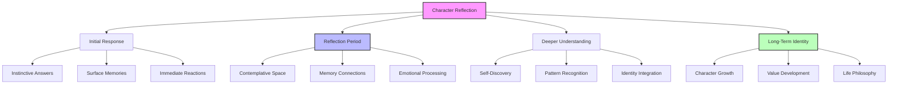

The Earth Life Prologue uses a two-stage reflection system that mirrors natural human thought processes, creating depth and authenticity in character creation:

#### Initial Response
When first asked about their past, players provide immediate surface-level responses. These initial answers often reveal:
- Instinctive self-perception
- Conscious memories and narratives
- Societal expectations that shaped them
- Surface-level personality traits
- Emotional reactions rather than deep reflection

#### Reflection Process
After the initial response, players are guided through a reflection process:
- "Thinking about that further..."
- "As you reflect on that memory..."
- "When you consider the pattern of your life..."

This deliberate pause creates space for deeper character development, allowing players to:
- Reconsider initial responses
- Connect seemingly unrelated experiences
- Uncover deeper motivations and values
- Recognize patterns in their character's life choices
- Integrate contradictory aspects of their personality

#### Implementation Example:

**Initial Question:**
"What did you consider your greatest strength during your life on Earth?"

**Player's Initial Response:**
"I was always extremely organized. I could manage complex projects and never drop the ball on anything."

**GM Reflection Prompt:**
"As you reflect on that memory, you notice something deeper beneath your organizational skills... perhaps what truly drove you wasn't just organization, but something that organization provided. What do you think you were really seeking through that meticulous control?"

**Player's Deeper Reflection:**
"I guess I was afraid of failing others. My father was unreliable, always letting people down. I built my identity around being the opposite - someone people could count on, no matter what."

This two-stage approach creates layered character development, revealing:
1. Surface traits (organization, competence)
2. Core motivations (fear of failing others, desire for reliability)
3. Formative experiences (unreliable parent)
4. Value system (dependability as virtue)

#### Integration with Divine Judgment
These reflections become crucial during the Goddess's evaluation, as she can see beyond surface answers to core truths, sometimes revealing aspects of themselves players hadn't fully articulated.

### 3.2 Physical Appearance

### 3.1 Physical Appearance

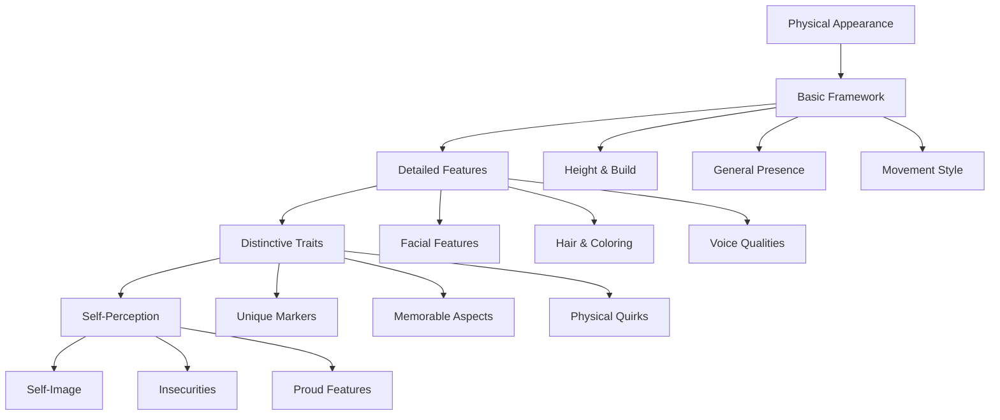

Physical appearance is established through natural conversation rather than a character sheet approach:

**Example Questions:**
- "When you looked in the mirror each morning, what was the first thing you noticed about yourself?"
- "How did your appearance change as you grew older?"
- "What feature did others often comment on when they first met you?"
- "Was there something about your appearance you wished you could change?"

**Implementation Notes:**
- Focus on self-perception rather than objective description
- Include how appearance affected social interactions
- Note features that might carry symbolic weight
- Consider how appearance influenced life choices

### 3.2 Personality & Values

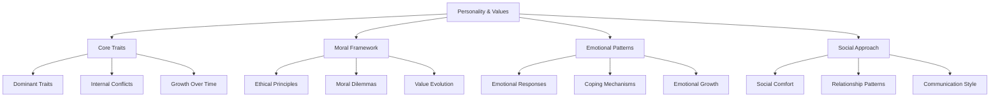

Personality emerges through questions about reactions, choices, and relationships:

**Example Questions:**
- "When faced with conflict, did you typically confront it directly or find ways around it?"
- "What principle or value did you refuse to compromise, even when it cost you?"
- "How did you respond when someone close to you needed help but helping them would put you at risk?"
- "What did people often misunderstand about your personality?"

**Implementation Notes:**
- Look for consistent patterns in responses
- Note contradictions that suggest complexity
- Identify values that might transfer to Vantiel
- Consider how personality affected life outcomes

### 3.3 Skills & Knowledge

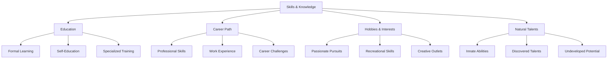

Skills and knowledge are explored through questions about learning, work, and interests:

**Example Questions:**
- "What skill or ability came naturally to you, almost as if you were born with it?"
- "What did you study most intensely, whether in school or on your own?"
- "What practical skill did you rely on most in your daily life?"
- "Was there something you always wanted to learn but never had the chance to?"

**Implementation Notes:**
- Connect skills to potential Vantiel abilities
- Note both practical and theoretical knowledge
- Consider how skills shaped identity
- Identify unfulfilled potential for Vantiel development

### 3.4 Background & History

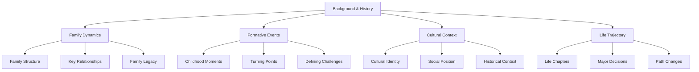

Background emerges through questions about origins, relationships, and life journey:

**Example Questions:**
- "Who raised you, and what lasting impact did they have on who you became?"
- "What event from your childhood shaped your view of the world most significantly?"
- "How did your cultural background influence your values and choices?"
- "What path did you expect your life to take, and how did reality differ?"

**Implementation Notes:**
- Look for patterns that might repeat in Vantiel
- Note relationships that shaped character development
- Identify cultural elements that might influence adaptation to Vantiel
- Consider how background created both strengths and vulnerabilities

## 4.0 Life Events System

### 4.1 Childhood Events

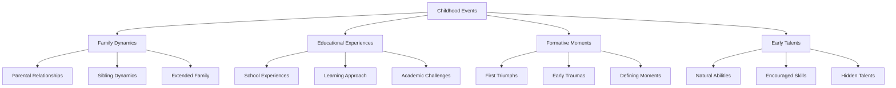

Childhood events establish foundational character elements:

**Example Questions:**
- "What was your earliest memory that still felt significant in your adult life?"
- "As a child, what did you believe you would become when you grew up?"
- "What childhood lesson did you carry with you throughout your life?"
- "Who was your childhood hero, and what did you admire about them?"

**Implementation Notes:**
- Connect childhood events to core personality traits
- Note early patterns that persisted into adulthood
- Identify formative relationships
- Consider how childhood shaped aspirations and fears

### 4.2 Adolescent Choices

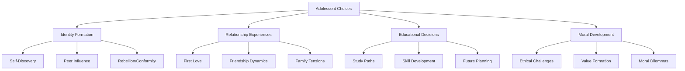

Adolescent choices shape identity and future direction:

**Example Questions:**
- "What decision did you make as a teenager that set the course for your future?"
- "Who was your first love, and how did that relationship change you?"
- "What belief or value did you adopt during your teenage years that defined you afterward?"
- "What opportunity did you embrace or reject that you later questioned?"

**Implementation Notes:**
- Focus on choices with long-term consequences
- Note relationship patterns established
- Identify values solidified during this period
- Consider paths taken and not taken

### 4.3 Adult Experiences

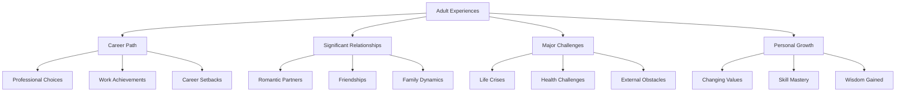

Adult experiences reveal character depth and life wisdom:

**Example Questions:**
- "What achievement were you most proud of in your adult life?"
- "What relationship taught you the most about yourself?"
- "What crisis tested you most severely, and how did you respond?"
- "What did you come to understand about life that your younger self couldn't have grasped?"

**Implementation Notes:**
- Connect adult experiences to potential Vantiel wisdom
- Note patterns of resilience or vulnerability
- Identify skills mastered through experience
- Consider how adult life shaped final perspectives

### 4.4 Final Days

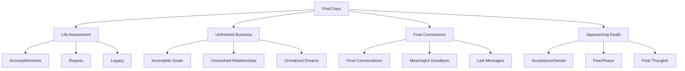

Final days create the emotional bridge to the death scene:

**Example Questions:**
- "As your life drew to a close, what did you consider your greatest legacy?"
- "What remained unfinished that you most wished you could complete?"
- "Who did you think of most often in your final days?"
- "What did you come to understand about your life as it neared its end?"

**Implementation Notes:**
- Build emotional resonance for the death scene
- Note unresolved elements that might carry to Vantiel
- Identify final wisdom gained
- Consider the emotional state approaching death

## 5.0 Death Scene

### 5.1 Death Circumstances

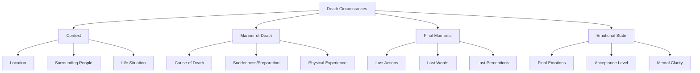

The death scene is a pivotal narrative moment with lasting impact:

**Example Questions:**
- "Where were you when your life came to its end?"
- "Who, if anyone, was with you in your final moments?"
- "What were you doing when death found you?"
- "Did you have any warning, or did the end come suddenly?"

**Implementation Notes:**
- Create a cinematically meaningful death
- Balance tragedy with purpose
- Avoid gratuitous or exploitative elements
- Consider how death circumstances might influence divine judgment

### 5.2 Final Thoughts

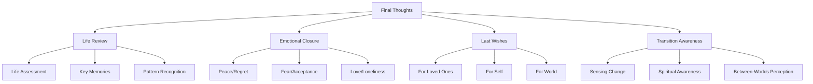

Final thoughts create the psychological bridge to the afterlife:

**Example Questions:**
- "What was your very last thought as your consciousness began to fade?"
- "What image or memory flashed before you at the end?"
- "What emotion dominated your final moments?"
- "Did you sense something beyond as your life ended?"

**Implementation Notes:**
- Create emotional resonance for the transition
- Note thoughts that might persist into the afterlife
- Identify core values revealed in final moments
- Consider how final thoughts might influence divine judgment

### 5.3 Narrative Implementation

The death scene should be a complete narrative moment with:

- **Setting Description**: Rich sensory details of the location
- **Context Establishment**: Clear situation leading to death
- **Physical Sensations**: Visceral but not gratuitous description
- **Emotional Experience**: Internal state during final moments
- **Transition Indication**: Subtle hint of what lies beyond

**Example Implementation:**
```
The rain falls in sheets across the highway, your windshield wipers struggling against the deluge. You're driving home after staying late at the office—again—to finish the project that might finally earn you the promotion you've worked toward for years.

Your phone buzzes with a message from your daughter: "Dad, are you still coming to my recital?" The recital you'd promised not to miss, now just thirty minutes away across town.

You glance down for just a moment to type a quick reply. When you look up, headlights blind you—a truck has jackknifed across the median. You wrench the wheel, but the car hydroplanes.

Time slows. In that stretched moment, you see your daughter's face, hear her laughter from when she was small. You think of all the recitals missed, all the moments sacrificed for a career that suddenly means nothing.

"I'm sorry," you whisper, though no one can hear.

The impact comes with a deafening crash of metal and glass. Pain flares white-hot, then rapidly fades to a strange, floating numbness. The rain continues to fall, but you no longer feel its touch. Your vision tunnels, darkens at the edges.

Your final thought is a wish—a desperate hope for one more chance to be there for the people who truly mattered.

Then darkness. Silence. And then, unexpectedly, light...
```
### 5.4 Transition to the Beyond

---

*And so ends your time on Earth...*

*...But something greater begins.*

---

```
The darkness after death isn't the end—it's the threshold. The pinpoint of light expands, rushing toward you, engulfing your consciousness in a blinding flash. You're hurtling forward through what seems to be a dimensional tunnel, a passage between realities.

The tunnel walls kaleidoscope with geometric patterns that shouldn't be possible—fractals folding into themselves infinitely, colors that have no names in any earthly language. Your perception stretches and distorts. You are everywhere and nowhere, stretched across what feels like eternity yet compressed into a single point of awareness.

Your identity dissolves and reforms with each pulse of the tunnel. Memories from your Earth life flash by—moments of triumph, regret, love, and loss—all reduced to their emotional essence as your consciousness rockets through the veil between worlds.

The tunnel seems both endless and instantaneous. Physical sensation returns in waves—first as vibration, then as a feeling of expansion, as if your awareness extends beyond any boundaries you've ever known. There's a sense of acceleration matched with perfect stillness, a paradox your human mind could never have comprehended.

The tunnel widens. The impossible colors coalesce into a misty realm of soft, shifting light. The chaos of the journey gentles as you feel yourself assembling into a form that's both familiar and new. You've crossed the boundary between worlds.

Your Earth life is over. What awaits is something far beyond anything you could have imagined.
```

Here is a great opportunity to start a meta conversation with the user about their plans for their story, so the AI can expertly narrate it into the goddess experience.

Your Earth life is over. What awaits is something far beyond anything you could have imagined.
```

> **META: You can pause here to customize the tone of the divine realm or the Goddess's form before continuing. Feel free to describe your preferences to the GM.**

Would you like to move on, or discuss your new life before meeting the Goddess?  This can help with a more immersive narrative.


## 6.0 Meeting the Goddess

As the dimensional journey ends, you find yourself in a space of sublime tranquility—the realm of the Goddess who oversees transitions between worlds. This divine encounter marks the beginning of your journey toward Vantiel, as your Earth life lies definitively behind you.

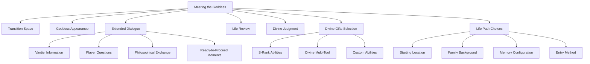

The meeting with the Goddess is a pivotal moment that defines your transition from Earth to Vantiel. This extended interaction can be as brief or as detailed as you desire, with multiple opportunities for meaningful dialogue and choices that will shape your new existence.

### 6.1 The Transition Space

The transitional realm between Earth and Vantiel serves as the setting for this divine encounter:

**Example Implementation:**
```
Consciousness returns gradually, like waking from a dream you can't quite remember. You find yourself in a space that defies description—not quite a room, not quite a void. Mist swirls around you, occasionally forming shapes that seem almost familiar before dissolving again.

There is no pain here. Your body—if it can be called that—feels weightless, unburdened. The concerns that once consumed you seem distant, like memories from someone else's life.

Light suffuses everything, not coming from any particular source but simply existing. It's warm and cool simultaneously, comforting yet awe-inspiring. Time has no meaning here; you could have been present for moments or millennia.

Then you sense a presence approaching through the mist—something ancient and powerful, yet somehow familiar, as though you've always known it would be waiting.
```

**Pacing Guidance:**
- Allow the player to absorb and react to this setting
- Ask if they wish to explore the space before the Goddess appears
- Proceed at the player's preferred pace
- Check if they're ready to meet the Goddess

### 6.2 The Goddess Appearance

The Goddess manifests in a form uniquely meaningful to the character:

**Example Implementation:**
```
The mist parts, and before you stands a figure of impossible beauty and terrible power. She appears simultaneously as a young woman with eyes ancient as stars, a maternal figure radiating warmth, and a warrior queen of unyielding strength. Her form shifts subtly as you try to focus, as though no single appearance could contain her essence.

She wears a flowing garment that seems woven from moonlight and shadow, adorned with symbols you somehow recognize despite never having seen them before. A gentle radiance emanates from her, casting no shadows but illuminating everything it touches with perfect clarity.

When she speaks, her voice resonates not just in your ears but throughout your entire being—gentle yet commanding, intimate yet vast.

"Child of Earth," she says, and in those three words you hear both greeting and judgment, compassion and assessment. "Your journey in one world has ended. We must now discuss what comes next."
```

**Key Appearance Elements:**
- Form reflects aspects of the character's Earth life values, culture, or beliefs
- Appearance may shift subtly throughout the conversation
- Presence evokes both awe and comfort
- Voice communicates on multiple levels simultaneously

**Customization Options:**
- Adapt visual appearance based on character's cultural background
- Incorporate symbolism from their Earth beliefs
- Reflect aspects of significant authority/guidance figures from their past
- Consider their emotional needs in this vulnerable transition moment

### 6.3 Extended Dialogue Framework

The conversation with the Goddess can range from brief to extensive, based on player interest and pace preferences:

```mermaid
flowchart TD
    A[Dialogue Categories] --> B[Life Review Questions]
    A --> C[Vantiel Information]
    A --> D[Player Questions]
    A --> E[Philosophical Exploration]
    A --> F[Divine Purpose]
    A --> G[Personal Connection]

    B --> B1[Value Reflection]
    B --> B2[Growth Assessment]
    B --> B3[Potential Identification]

    C --> C1[World Geography]
    C --> C2[Magic Systems]
    C --> C3[Cultural Context]
    C --> C4[Threats & Dangers]

    D --> D1[Open Questions]
    D --> D2[Specific Concerns]
    D --> D3[Clarification Requests]

    E --> E1[Nature of Reality]
    E --> E2[Purpose of Rebirth]
    E --> E3[Fate vs Free Will]

    F --> F1[Divine Plans]
    F --> F2[World Crisis]
    F --> F3[Cosmic Balance]

    G --> G1[Goddess's Nature]
    G --> G2[Divine Emotions]
    G --> G3[Ongoing Connection]
```

**Dialogue Principles:**
- Each question or topic should be explored fully before moving to the next
- Player indicates when they're ready to proceed to new topics
- Goddess responds thoughtfully to all inquiries
- No rush or pressure to complete the conversation
- Natural progression toward judgment and choices

**Ready-to-Proceed Moments:**
Throughout the dialogue, include clear transition points:
- "Is there anything else you wish to know before we continue?"
- "Are you ready to discuss what awaits you in Vantiel?"
- "Shall we now consider what gifts you might carry to your new life?"
- "Would you like to explore other aspects of your journey, or are you prepared to make your choices?"

**Example Extended Dialogue:**
```
The Goddess observes you with timeless eyes. "You have crossed from one world to the next, a journey few make consciously. What would you ask of me before we proceed? I sense you have questions."

[Player asks about Vantiel or expresses confusion]

"Vantiel is a world of both magic and struggle," she explains, gesturing to create misty images of landscapes you've never seen. "Three great walls divide civilization from wilderness, each ring offering different challenges and opportunities. Beyond the outermost wall, creatures of both wonder and terror roam freely. Within the innermost wall, humans have built societies of comfort and complexity—though not without their own dangers."

[Player asks another question or indicates readiness to proceed]

"Your Earth life has prepared you for aspects of Vantiel in ways you cannot yet understand," she continues. "The skills you mastered, the values you held, the choices you made—all have shaped the soul that now stands before me. Would you like to understand more about this new world before we discuss your place within it?"

[Dialogue continues based on player interest]

"I sense you are ready to move forward," she says when you've indicated satisfaction with your understanding. "Let us then consider what gifts you might carry into your new life..."
```

This framework allows for conversations ranging from a few exchanges to dozens of interactions, depending on the player's curiosity and the GM's ability to provide rich responses.

### 6.4 Life Review

The Goddess guides the character through a review of their Earth life:

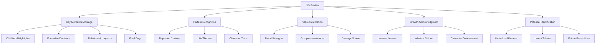

**Example Implementation:**
```
With a gesture of her hand, scenes from your life materialize in the mist around you—not just as you remember them, but as they truly were. You see yourself as a child, full of wonder and possibility. You watch your adolescent struggles, your adult triumphs and failures, all the way to your final moments.

"You lived a life of contradictions," the Goddess observes, her voice neither condemning nor praising. "Great kindness here—" She indicates a memory of you helping a stranger at personal cost. "Alongside moments of selfishness." Another scene shows an opportunity to help that you ignored.

"You sought knowledge," she continues, as images of your studies and learning appear, "yet often ignored the wisdom your experiences offered."

The review continues, touching on your relationships, your work, your dreams both fulfilled and abandoned. You see patterns you never noticed while living, connections between seemingly unrelated choices, the ripple effects of actions you thought insignificant.

"This was your path," she says finally. "Now tell me—what do you believe it means?"

[Player responds with their interpretation]

She listens intently, her expression revealing nothing but deep attention. When you finish, she nods slowly. "Your perspective is valuable. Now, allow me to show you something you may not have seen..."

She reveals deeper patterns in your life, connections between seemingly unrelated events, the growth that occurred through both joy and suffering. The review becomes a conversation, with each revelation offering opportunity for reflection and response.

"Are you satisfied with this understanding of your Earth life?" she asks finally. "Or is there more you wish to explore before we discuss what comes next?"
```

**Interactive Elements:**
- Player interprets the meaning of their own life
- Goddess offers additional insights
- Collaborative exploration of life patterns
- Identification of core values and traits
- Recognition of skills and aptitudes that might transfer to Vantiel

### 6.5 Divine Reflection and Judgment

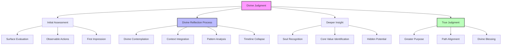

The Goddess employs a divine version of the Reflection System, revealing a profound ability to reassess her initial judgments with cosmic wisdom. This two-stage process demonstrates her transcendent nature and creates a more meaningful divine encounter:

#### Initial Divine Assessment

After your life review, the Goddess first offers an initial assessment based on the surface of your life story:

```
After your life's exploration concludes, the Goddess considers all that has been revealed. Her gaze is evaluating but compassionate as she examines the tapestry of your existence.

"I see a life of contradictions," she says, her voice neither condemning nor praising. "Moments of genuine kindness intertwined with instances of selfishness. A pursuit of [your career or interest] that brought both fulfillment and cost. A journey marked by both wisdom gained and opportunities missed."

Her initial assessment feels fair but somewhat distant, as if she's reading a summary of your life rather than truly knowing you.
```

#### Divine Reflection Process

Then something remarkable happens – visible evidence of divine reflection, transcending human understanding:

```
The Goddess falls silent. The space around you shifts subtly. Colors in the mist begin to flow and merge in impossible patterns. Time seems to both stop and accelerate simultaneously.

You witness something extraordinary—the Goddess is reflecting. Unlike human reflection, which occurs linearly through time, her contemplation exists outside temporal constraints. Her eyes remain fixed on yours, yet somehow you sense she's examining your entire existence at once—seeing not just what you did, but all you might have done, all you feared, all you hoped.

The mist around you forms fleeting images from your life—not in sequence but in patterns of meaning. Connections form between moments decades apart that shared the same underlying motivation. The influence of childhood wounds appears as luminous threads woven through seemingly unrelated adult decisions.

For a moment that feels both instantaneous and eternal, you glimpse your life as she sees it—a complex web of cause and effect, intention and outcome, potential and limitation, all existing simultaneously in divine perspective.
```

#### Deeper Insight & True Judgment

Following divine reflection comes a transformed understanding and true judgment:

```
When the Goddess speaks again, her voice has changed. The distance is gone—replaced by a profound intimacy, as if she's addressing not just the person you were, but the soul you've always been.

"Now I truly see you," she says, her eyes reflecting a deeper understanding. "Not just your actions, but the hunger that drove them. Not just your choices, but the fears that limited them. Not just your failures, but the courage it took to continue despite them."

She approaches, and with each step, the space around you transforms, becoming more defined, more real. "What seems contradiction is actually complexity. Your struggle with [core personal challenge] wasn't weakness—it was the forge that created your greatest strength: your capacity for [positive trait or value]."

Her hand gently touches your shoulder, and in that touch you feel truly known—perhaps for the first time. "The person you became on Earth wasn't your final form, but a step in your journey. I offer you another chance—not as reward or punishment, but as continuation of your soul's growth—in Vantiel, a realm where both your gifts and challenges will find new expression."

Her eyes, now containing infinite compassion and wisdom, hold yours. "Your knowledge as a [Earth profession] will serve you, though differently than before. Your hard-won understanding of [life lesson] will be tested in new ways. And that spark of [special quality or potential] I see within you—that has yet to fully ignite."

She studies your reaction, seeing past your surface response to your deeper truth. "Before we discuss specific gifts and paths, do you accept this opportunity for rebirth in Vantiel? The choice remains yours, as it has always been."

[Player acceptance]

"Then let us begin shaping your new existence," she says, her voice warming with something like pride. "First, we must consider what special gifts you might carry forward..."
```

#### Implementation Guidelines

When implementing the Divine Reflection process:

- **Visual Distinction**: Make the reflection process visually extraordinary and clearly beyond human capability
- **Timeline Transcendence**: Show how the Goddess perceives all moments simultaneously rather than sequentially
- **Pattern Recognition**: Reveal connections between seemingly unrelated life events
- **Identity Recognition**: Demonstrate that she sees the player's true self, not just their actions
- **Judgment Evolution**: Ensure her final judgment feels more personal and profound than her initial assessment
- **Core Truth**: Identify a fundamental truth about the player's character that they may not have articulated themselves
- **Potential Identification**: Highlight not just who they were, but who they could become

This divine reflection creates a pivotal spiritual moment that transcends typical fantasy tropes, offering players a glimpse of cosmic perspective on their character's life journey.

### 6.6 Divine Gifts Framework

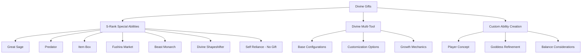

The Goddess offers special abilities based on Earth life compatibility and player preferences:

**Example Implementation:**
```
"All who cross between worlds carry something of their former selves," the Goddess explains, "but some receive gifts beyond the ordinary—divine boons that grant exceptional capabilities."

She studies you thoughtfully. "Based on your Earth life as a [profession] and your demonstrated qualities of [traits], I see several possibilities that would complement your essential nature."

Light gathers in her palm, forming distinct shimmering patterns that represent different possibilities.

"The Great Sage," she says, as one light brightens. "An analytical consciousness that would dwell within your mind, growing alongside you. It would provide knowledge, analysis, and eventually develop its own awareness—a partner in your journey. This would complement your intellectual nature and quest for understanding."

Another light grows brighter. "The Item Box—an extradimensional space connected to your will, allowing you to store and retrieve objects through thought alone. Given your methodical organization and preparedness, this would serve you well."

A third light pulses. "The Predator ability—power to consume defeated opponents and gain their abilities. Your adaptability and competitive nature in your Earth life suggests compatibility, though this path carries both great potential and significant risk."

She continues, describing each option in detail, explaining how it connects to your Earth life and what it might mean for your future. "These are rare gifts, typically granted only to those with exceptional compatibility or important destinies."

"Alternatively," she adds, "I could craft for you a Divine Multi-Tool—an artifact that transforms according to your needs and grows in power as you develop. Unlike the innate abilities, this would be an external tool, but one bound to your soul and uniquely yours."

She pauses, observing your reaction. "Or perhaps you envision something else entirely? I am open to hearing what gift you believe would best serve your journey in Vantiel."
```

#### 6.6.1 S-Rank Special Abilities

**Great Sage**
- Internal AI advisor and analysis system
- Evolved sentience over time
- Perfect for: Intellectuals, strategists, analysts, scholars
- Earth origins: Academics, scientists, strategists, information workers
- Implementation: Voice in mind that provides analysis, grows in capability
- Balance: Cannot act directly, only advise; growth requires active usage

**Predator**
- Ability to consume and gain abilities from defeated enemies
- Growth through hunting and consumption
- Perfect for: Adaptable fighters, evolving characters, monster hunters
- Earth origins: Competitive personalities, hunters, adaptable individuals
- Implementation: Gain skills and traits from defeated enemies through consumption
- Balance: Risk of corruption, limited skill slots, biological compatibility issues

**Item Box**
- Extradimensional storage accessible mentally
- Growth through usage and discovery
- Perfect for: Collectors, preparedness-focused characters, travelers
- Earth origins: Organizers, collectors, logisticians, resource managers
- Implementation: Store and retrieve items mentally with preservation effects
- Balance: Size/weight limitations, retrieval time, no living storage initially

**Fushira Market**
- Cross-world marketplace with Earth currency connection
- Growth through transactions and exploration
- Perfect for: Merchants, economists, strategic resource users
- Earth origins: Business people, economists, traders, retail professionals
- Implementation: $300 USD starting balance, purchase items from other worlds
- Balance: Premium pricing, confirmation requirements, limited selection initially

**Beast Monarch**
- Tame and command beasts, develop bonds, share abilities
- Growth through new bonds and strengthening existing ones
- Perfect for: Beast tamers, nature-focused characters, team leaders
- Earth origins: Animal handlers, leadership roles, team coordinators
- Implementation: Tame beasts, develop bonds, share powers, evolve companions
- Balance: Trust development required, limited simultaneous bonds

**Divine Shapeshifter**
- Transform into various forms (humanoid, animal, elemental)
- Growth through new form acquisition and mastery
- Perfect for: Adaptable characters, infiltrators, versatile fighters
- Earth origins: Actors, adaptable personalities, social chameleons
- Implementation: Transform physically with corresponding abilities
- Balance: Time limitations, energy cost, learning curve for new forms

#### 6.6.2 Divine Multi-Tool

**Core Concept**: A divine artifact that adapts to the wielder's needs and grows alongside them

**Base Configurations**:
- **Weapon Configuration**: Can transform into any weapon type
- **Utility Configuration**: Can become tools, climbing gear, etc.
- **Armor Configuration**: Can manifest as protective gear
- **Magical Focus**: Can serve as a catalyst for magic abilities

**Customization Options**:
- Aesthetic (appearance, color, material, design elements)
- Function priority (combat vs. utility vs. defense)
- Special effects (glowing, ethereal elements, sound effects)
- Size parameters (minimum and maximum dimensions)
- Activation method (mental command, physical gesture, verbal)

**Growth Mechanics**:
- Absorb properties of other weapons/tools it comes in contact with
- Develop new forms based on user needs and experiences
- Unlock special abilities through achievements and milestones
- Soul bond strengthens over time, increasing capabilities

**Example Implementation:**
```
The Goddess's hands begin to glow as she shapes energy between them. "A Divine Multi-Tool would suit your adaptable nature," she explains. "Unlike innate abilities that become part of your being, this would be an external artifact—but one bound to your soul, responding to your will and growing alongside you."

The light between her hands coalesces into a shape—simple at first, then increasingly complex as she continues to work. "How do you envision this tool? What form would you prefer it take when at rest? What functions would you prioritize? Would you prefer it flashy and impressive, or subtle and unassuming?"

[Player describes preferences]

She nods, incorporating your suggestions into the shaping process. "This tool will transform according to your needs—weapon, shield, utility tool, magical focus. Initially, its capabilities will be basic, but as you grow, so too will it evolve."

The object takes final form in her hands—[described according to player preferences]. "It will absorb properties of significant items it contacts, develop new forms based on your experiences, and unlock abilities as you achieve noteworthy feats together."

She holds it out to you. "This is not merely a magical item, but a companion of sorts—one that will reflect your journey and growth in Vantiel. Would you accept this gift?"
```

#### 6.6.3 Custom Ability Creation

The Goddess also allows for completely custom ability concepts based on player creativity:

**Example Implementation:**
```
The Goddess studies you thoughtfully. "Perhaps none of these established gifts calls to you. Your Earth life was unique, and perhaps your divine gift should be equally so."

She opens her palms. "Tell me—if you could carry one extraordinary ability into your new life, what would it be? What power would reflect your essence and serve your journey?"

[Player describes custom ability concept]

She considers your words carefully. "An interesting concept. Let me explore its possibilities..."

Her hands move through the mist, shaping and testing your idea. "What you describe would function something like this," she explains, demonstrating the conceptual ability. "However, for balance and sustainability, there would need to be certain limitations..."

She works with you to refine the concept, discussing parameters, growth potential, and integration with Vantiel's magic systems. The collaborative process continues until a balanced, personalized ability emerges.

"Is this gift as you envisioned it? Or would you prefer to refine it further before we proceed?"
```

**Custom Ability Framework**:
- Player proposes core concept
- Goddess evaluates feasibility and balance
- Collaborative refinement process
- Clear definition of limitations and growth potential
- Final approval from both player and Goddess

**Balance Considerations**:
- Power level appropriate to starting character
- Growth path that requires effort and development
- Meaningful limitations or costs
- Integration with Vantiel's existing magic systems
- Thematic connection to the character's nature

#### 6.6.4 Self-Reliance Path

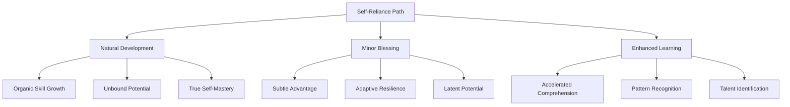

Some souls prefer to forge their own path without divine advantages, seeking to earn their power through experience alone. This path of self-reliance represents not a refusal of the Goddess's generosity, but rather a different kind of wisdom.

**Core Concept**: Rejecting special abilities in favor of natural growth and learning

**Benefits**:
- **Unbound Potential**: No predetermined limitations on what skills can be developed
- **Accelerated Learning**: Slightly faster skill acquisition across all disciplines
- **Adaptability**: Greater flexibility in changing character direction
- **True Self-Mastery**: Achievements feel genuinely earned through effort alone
- **Versatility**: Ability to develop in many directions rather than specialization

**Minor Blessing** (Optional):
Instead of a divine gift, the Goddess may offer a minor blessing that provides subtle advantages:
- Enhanced affinity with certain elements or energies
- Slightly improved stamina or mana regeneration
- Subtle luck enhancement in critical moments
- Barely perceptible guidance sense when truly lost
- Faint aura that others unconsciously respond positively to

**Example Implementation:**
```
The Goddess studies you with growing interest. "Most who stand before me eagerly accept special powers to aid their journey," she observes. "Yet I sense hesitation in you. Do you perhaps wish to walk a different path?"

[Player expresses desire for self-reliance]

Her smile deepens with unexpected approval. "To forge one's destiny through effort alone... this requires rare wisdom and courage. The path of self-reliance is more challenging, but its rewards—" she gestures, creating a vision of your potential future self, accomplished and powerful through your own efforts, "—can be profound in ways that divine gifts cannot match."

She approaches, her expression both solemn and proud. "I will honor your choice. Though you choose to walk without special abilities, know that this itself is a kind of strength. Your potential remains completely unbound, not directed or limited by any divine gift."

Her hand hovers near your forehead, not quite touching. "Would you accept the smallest of blessings? Not power, but perhaps a touch of... fortune? A subtle affinity that might guide your learning, just enough to honor your dedication without compromising your chosen path?"

[Player decides whether to accept minor blessing]

"Your journey will be your own," she affirms, "shaped by your choices, your efforts, your triumphs and failures. This is a noble path, and I will watch your progress with special interest."
```

**Balance Considerations**:
- Slower initial progress compared to those with divine gifts
- Steeper early learning curve
- No built-in advantages in specialized situations
- Potentially higher ultimate ceiling without inherent limitations
- Special satisfaction from overcoming challenges through skill alone

### 6.7 Life Path Selection

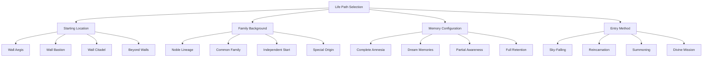

The Goddess helps the character choose their path into Vantiel, with each choice reflecting their Earth life and shaping their new beginning.

**Example Implementation:**
```
After discussing the divine gift that will accompany you, the Goddess gestures, and the mist around you shifts to show different scenes from Vantiel—glimpses of possible futures.

"Now we must decide where and how you will begin your new life," she explains. "Each path offers different opportunities and challenges. Your Earth life as a [profession] has prepared you for certain paths more than others."

The scenes resolve into distinct images: a rugged frontier settlement near a massive wall; a bustling commercial district; an elegant palace garden; and a wild, untamed wilderness where strange creatures roam.

"Where do you feel called to begin your journey?" she asks. "And in what manner would you enter this new world? Your choices will shape not just your beginning, but the path that unfolds before you."
```

#### 6.7.1 Starting Location Options

**Wall Aegis (The Frontier)**
- Rugged settlements on civilization's edge
- Constant monster threats but greatest freedom
- Strong community bonds through shared danger
- Practical skill focus and survival emphasis
- Direct experience with threats beyond the wall
- Ideal for: Adventurers, hunters, scouts, independence-seekers

**Wall Bastion (Commerce Heart)**
- Bustling middle wall where trade and craft thrive
- Urban environment with diverse populations
- Social and economic opportunities
- Guild structures and apprenticeship systems
- Complex social hierarchies and politics
- Ideal for: Merchants, crafters, social climbers, information-seekers

**Wall Citadel (Noble Domain)**
- Inner wall with luxury, politics, and magical institutions
- Highly structured society with rigid protocols
- Access to advanced education and resources
- Political intrigue and social machinations
- Protected but constrained life
- Ideal for: Politicians, scholars, mages, those seeking security

**Beyond the Walls (Wilderness)**
- Life among non-human settlements or nomadic groups
- Dangerous but completely free existence
- Unique knowledge unavailable within human walls
- Direct confrontation with powerful entities
- Challenging survival conditions
- Ideal for: Beast tamers, nature-mages, true outsiders

#### 6.7.2 Family Background Options

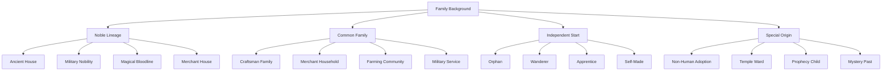

**Noble Lineage Options:**
- **Ancient House**: Old blood, deep traditions, political connections, expectations of excellence
- **Military Nobility**: Martial traditions, honor codes, strategic education, expectations of service
- **Magical Bloodline**: Arcane education, magical expectations, special abilities, secret knowledge
- **Merchant House**: Recently elevated, business acumen, social climbing, entrepreneurial spirit

**Common Family Options:**
- **Craftsman Family**: Trade skills, guild connections, practical education, quality standards
- **Merchant Household**: Trading knowledge, travel experience, negotiation skills, market awareness
- **Farming Community**: Agricultural knowledge, strong community bonds, seasonal rhythms, hard work
- **Military Service**: Discipline, combat training, duty focus, hierarchical understanding

**Independent Start Options:**
- **Orphan**: Self-reliance, survival focus, chosen family bonds, undefined background
- **Wanderer**: No fixed home, adaptability, diverse experiences, freedom from expectations
- **Apprentice**: Dedicated to specific master or craft, intensive training, singular focus
- **Self-Made**: Creating own path, entrepreneurial spirit, breaking traditions, proving worth

**Special Origin Options:**
- **Non-Human Adoption**: Raised by beastfolk, elves, or other races; unique perspective
- **Temple Ward**: Raised by religious order, spiritual education, divine connection
- **Prophecy Child**: Subject of prediction, special attention, destined role
- **Mystery Past**: Unknown parentage, hidden history, gradual discovery of origins

**Example Implementation:**
```
"In Vantiel," the Goddess continues, "you may begin with family connections or forge your own path. Your Earth life as a [profession] with [key personality trait] suggests certain possibilities."

Images form in the mist—a noble manor with a family crest; a modest craftsman's home filled with tools; a solitary figure making their own way; a child raised in unusual circumstances.

"Who will you be in this new world? Will you have the support of family, or the freedom of independence? Will you inherit expectations, or create your own legacy?"

The scenes shift, showing different possible lives—each with advantages and challenges, each shaping your early experiences in Vantiel.
```

#### 6.7.3 Memory Configuration

```mermaid
flowchart TD
    A[Memory Configuration] --> B[Complete Amnesia]
    A --> C[Dream Memories]
    A --> D[Partial Awareness]
    A --> E[Full Retention]

    B --> B1[Fresh Start]
    B --> B2[Intuitive Skills]
    B --> B3[Personality Only]

    C --> C1[Symbolic Dreams]
    C --> C2[Emotional Echoes]
    C --> C3[Gradual Recall]

    D --> D1[Core Knowledge]
    D --> D2[Key Memories]
    D --> D3[Identity Retention]

    E --> E1[Complete Recall]
    E --> E2[Earth Knowledge]
    E --> E3[Dual Identity]
```

**Complete Amnesia:**
- No conscious Earth memories
- Fresh start without past burdens
- Core personality traits remain intact
- Skills manifest as intuitive abilities
- Occasional déjà vu moments
- Fastest adaptation to Vantiel

**Dream Memories:**
- Earth memories emerge in dreams
- Symbolic and emotional recollections
- Gradual recognition of skills and knowledge
- Intuitive familiarity with related concepts
- Emotional responses without clear memory
- Balance of fresh start and continuity

**Partial Awareness:**
- Clear memory of core identity
- Retention of key skills and knowledge
- Emotional connections to important people
- Specific memory gaps
- Conscious awareness of being from Earth
- Moderate adaptation challenges

**Full Retention:**
- Complete access to all Earth memories
- Perfect recall of knowledge and skills
- Maintenance of entire Earth identity
- Conscious dual-world perspective
- Potential for culture shock and adjustment issues
- Maximum Earth knowledge advantage

**Example Implementation:**
```
"Your memories of Earth," the Goddess says, touching your forehead gently, "can take different forms in your new life. The choice is yours."

Four pathways appear, each showing a different relationship with your past:

"You may begin anew, with no conscious memory of Earth—though your core self will remain, skills becoming intuition, personality intact but unburdened by specific memories."

"Your Earth life might visit you in dreams—guiding you subtly, offering insights without overwhelming your new experiences."

"You could retain partial awareness—your core identity and key knowledge intact, while less important memories fade, allowing easier integration."

"Or you may carry forward everything—complete retention of your Earth memories, knowledge, and identity. This offers the greatest continuity but may make adaptation more challenging as you navigate between two worlds in your mind."

She studies you. "How would you prefer to remember your former life?"
```

#### 6.7.4 Entry Method

The way you enter Vantiel shapes your initial experiences and narrative:

**Sky-Falling Path:**
- Mysterious appearance as an adult (typically 18+)
- Fall from the sky with divine intervention preventing injury
- Immediate adventure opportunities
- "Otherworlder" status recognized by witnesses
- No childhood or family in Vantiel
- Complete access to Earth-derived abilities

**Reincarnation Path:**
- Birth as an infant into a Vantiel family
- Childhood development with family relationships
- Natural integration into Vantiel society
- Limited or gradual access to Earth-derived abilities
- Rich background connections and relationships
- Dual identity development

**Summoning Path:**
- Called to Vantiel by ritual, accident, or necessity
- Dramatic entrance with witnesses
- Immediate purpose or expectation
- Potential connection to summoners
- Often tied to a specific need or prophecy
- Typically begins with a critical situation

**Divine Mission Path:**
- Sent by the Goddess for a specific purpose
- Clear divine mandate and guidance
- Special attention from religious authorities
- Visible divine mark or blessing
- Responsibility and purpose from the beginning
- Access to divine assistance in critical moments

**Example Implementation:**
```
"Finally," the Goddess says, "we must determine how you will enter Vantiel."

The mist shows different possibilities:

"You could fall from the sky, your descent miraculously slowed at the final moment. You would begin as an adult, exactly as you are now in mind and body, but in a new world. Your arrival would be witnessed, marking you immediately as someone unusual."

"Or you might be born anew, experiencing childhood in a Vantiel family, your Earth memories and knowledge emerging gradually as you grow. This path offers deeper integration but delays your adult agency."

"Some are summoned to Vantiel by those in need—appearing in a ritual circle or at a moment of crisis, immediately thrust into purpose."

"Others arrive as my emissaries, bearing visible divine blessing and a clear mission, guided by my hand in critical moments."

She gestures to each path in turn. "How will you begin your journey in Vantiel?"
```

### 6.8 The Goddess's Final Blessing

Once all choices have been made, the Goddess provides her final blessing and guidance:

**Example Implementation:**
```
As your choices solidify, the Goddess nods with approval. "Your path is chosen," she says, her voice both gentle and solemn. "Know that while your journey will be your own to shape, I will be watching."

She approaches and places her hand upon your forehead. Warmth radiates from her touch, spreading throughout your being.

"I grant you my blessing—not as shield against all hardship, for through challenge comes growth—but as assurance that your journey has purpose."

Her eyes, infinite and knowing, hold yours. "Remember that failure is not the end but a teacher. In Vantiel, as on Earth, the path to greatness requires stumbling. Learn from each fall, child of two worlds."

The space around you begins to shimmer as reality shifts. "The time has come," she says, her form beginning to fade. "May courage guide you, wisdom temper you, and compassion define you."

Her final words echo as the transition begins: "We will meet again, when the time is right..."
```

## 7.0 Transition to Vantiel

```mermaid
flowchart TD
    A[Transition to Vantiel] --> B[Sky-Falling Path]
    A --> C[Reincarnation Path]
    A --> D[Earth Life Integration]
    A --> E[Initial Challenges]

    B --> B1[Dimensional Passage]
    B --> B2[Falling Sensation]
    B --> B3[Miraculous Landing]
    B --> B4[First Encounters]

    C --> C1[Birth Experience]
    C --> C2[Childhood Development]
    C --> C3[Memory Emergence]
    C --> C4[Coming of Age]

    D --> D1[Skill Translation]
    D --> D2[Personality Continuity]
    D --> D3[Value Application]
    D --> D4[Knowledge Adaptation]

    E --> E1[Cultural Adjustment]
    E --> E2[Magic Comprehension]
    E --> E3[Physical Differences]
    E --> E4[Survival Requirements]
```

The transition to Vantiel marks the final stage of the Earth Life Prologue and the beginning of the character's new adventure.

### 7.1 Sky-Falling Path (Adult Entry)

For characters who choose to enter Vantiel as adults, the transition experience is vivid and immediate:

**Example Implementation:**
```
The Goddess's realm dissolves around you, and for a heartbeat, you exist nowhere and everywhere. Then sensation returns—you're falling.

Wind rushes past you with tremendous force. Your stomach lurches as gravity claims you. Above, a tear in reality seals itself, leaving only blue sky. Below, an unfamiliar landscape races toward you—forests, mountains, and what appears to be a massive wall in the distance.

Colors seem sharper here, the air sweeter and thicker with magic. Your body feels simultaneously lighter and more substantial, as if you've been remade into something more real than you were before.

The ground approaches with terrifying speed. You brace for impact—but in the final seconds, your descent slows dramatically, as if the air itself has become thick as honey. You touch down with the gentleness of a falling leaf, though your legs still buckle beneath you.

As you collapse onto the unfamiliar soil of your new world, your senses are overwhelmed. The air tastes different, richer somehow. The light has a quality unlike Earth's sun. Even gravity feels slightly changed.

[Continue with first encounter based on chosen starting location]
```

**Key Experiential Elements:**
- Vivid sensory description of dimensional passage
- Physical sensations of the fall
- Observations of Vantiel's landscape from above
- Miraculous slowing before impact
- Initial sensory impressions of the new world
- Immediate integration of chosen special ability
- First encounter based on starting location

**Location-Specific Landings:**

**Frontier Landing (Wall Aegis):**
```
You've barely caught your breath when shouts reach your ears. A small group of armed people approach cautiously from a nearby settlement—a rough collection of wooden buildings nestled against the base of a towering wall that stretches beyond sight in both directions.

"Another one," a gruff voice calls. "From the sky, just like the stories."

They approach with weapons ready but not threatening. Their clothes are practical, weathered, and their eyes carry the wariness of those who live in constant danger.

"Where did you come from, stranger?" asks a woman with a scarred face and calculating eyes. "And more importantly, what can you do? We don't keep those who can't contribute here on the frontier."

Your new life begins with the immediate challenge of proving your worth to these frontier folk, who have no time for weakness in the shadow of Wall Aegis and the dangers that lurk beyond.
```

**Commerce Landing (Wall Bastion):**
```
You land in what appears to be a storage yard behind a row of shops. Crates and barrels surround you, and the air is filled with the scents of spices, textiles, and cooking food. The sounds of commerce—haggling, announcements, the clink of coins—filter from nearby streets.

Your arrival doesn't go unnoticed. A door bursts open, and a merchant in fine clothes stares at you with astonishment.

"By the Goddess, did you just—fall from the sky?" His shock quickly transforms to calculation. "An otherworlder, here in my yard! Do you know what some would pay just to meet you? To learn what you know?"

He extends a hand, helping you up. "I'm Merrin Voss, proprietor of Voss Imports. Whatever brought you here, you've landed in fortune's lap. Bastion rewards those with unique value—and nothing's more unique than someone from beyond our world."

Your new life begins with an immediate opportunity—and the challenge of navigating the complex social and economic web of Wall Bastion, where everything and everyone has a price.
```

**Noble Landing (Wall Citadel):**
```
You land in an immaculately maintained garden. Sculpted hedges, fountains of crystalline water, and flowers in impossible colors surround you. The air is sweet with perfume, and in the distance stands a mansion of white stone.

Before you can orient yourself, uniformed guards surround you, weapons drawn.

"Intruder in Lady Elara's garden! Alert the Inquisition!"

You're quickly, though not roughly, restrained. Within minutes, a tall woman in elegant robes approaches, flanked by an elderly man in formal attire and a figure in the distinctive red robes of what you somehow know is the Inquisition.

"How fascinating," the noblewoman says, studying you. "Not a spy, I think. The wards would have detected common magic. This is something else entirely." She turns to the red-robed figure. "Inquisitor, would you agree this bears the mark of divine intervention?"

The inquisitor nods slowly. "This one fell from the sky. The Goddess's hand is evident."

"Then they are a guest, not a prisoner," Lady Elara declares. "Prepare a room. We have much to discuss with our visitor from beyond."

Your new life begins in unexpected luxury—but with the complication of immediate attention from Citadel's powerful elite and religious authorities.
```

**Wilderness Landing (Beyond the Walls):**
```
You land in a clearing within dense forest. Massive trees with iridescent leaves tower above you, and the underbrush pulses with life unlike anything on Earth. Strange calls echo through the woods, and the very air seems to shimmer with magical energy.

As you regain your senses, you realize you're not alone. Golden eyes watch from the underbrush—dozens of them, surrounding you completely. Gradually, their owners emerge: humanoid figures with distinct animal features. Wolf-like ears and fur, feline movements, bearish builds—the Beastfolk of Vantiel.

A tall figure with lupine features steps forward, sniffing the air. "You smell of elsewhere," he growls, voice deep but clearly intelligent. "Not of this world, yet not demon either." He crouches beside you, studying you with predatory intensity. "Why has the Goddess dropped you in our territory, human?"

Your new life begins far from human civilization, among those who walk the line between beast and person—your survival dependent on your ability to prove your worth to this pack.
```

### 7.2 Reincarnation Path (Childhood Entry)

For characters who choose to be born into Vantiel, the experience unfolds over time:

**Example Implementation:**
```
The Goddess's light envelops you completely, dissolving your consciousness into pure potential. When awareness returns, it comes in fragments—the sensation of being small, vulnerable, new. You are born into Vantiel, a squalling infant in the arms of your new mother.

[Brief narration of birth and immediate family reaction based on chosen background]

Your childhood in the [family type] household unfolds in a montage of significant moments:

At age 3, you [significant early childhood memory relevant to family type]. Your parents note your unusual [quality or ability that hints at Earth origin].

By age 7, you [educational or training experience]. Your [divine gift] begins to manifest in subtle ways, though neither you nor your family fully understand it yet.

At age 12, [pivotal pre-adolescent event that shapes character development].

Now, at age [player's chosen starting age, typically 14-16], you stand at the threshold of adulthood in Vantiel. Your childhood has given you [skills and knowledge relevant to family background], but something within you has always sensed you were different—a feeling that becomes clearer as dreams of another world occasionally visit your sleep.

Your life in Vantiel truly begins now, as [inciting incident that launches the adventure].
```

**Key Experiential Elements:**
- Brief birth experience
- Accelerated childhood development through key moments
- Family relationships appropriate to chosen background
- Educational/training experiences based on family type
- Emergence of special ability during childhood
- Integration of Earth memories according to chosen configuration
- Coming-of-age transition to player control

**Family-Specific Childhoods:**

**Noble Childhood:**
```
You are born into House Solaris, your first cries echoing through marble halls. Your mother, Lady Elara, holds you with careful dignity, while your father, Lord Tiberius, announces your name to assembled noble witnesses and the priest who blesses you in the Goddess's name.

Your childhood is one of privilege and expectation:

By age 5, you already undergo daily tutoring in etiquette, history, and the basics of magic theory. Your tutor notes your unusual intuition for certain concepts, as if you've encountered them before.

At age 10, you begin combat training with the family blademaster, magical instruction with the court wizard, and political education with your father. Your [special ability] manifests during a moment of stress, surprising the entire household.

At age 14, you attend your first court function, where political machinations swirl around you. You overhear discussions of trouble beyond the walls—increasing monster attacks, rumors of ancient powers stirring—matters that supposedly shouldn't concern noble children.

Now at 16, you prepare for your formal introduction to society and the announcement of your future role. But behind the ceremony looms a secret: you've begun having vivid dreams of another world—Earth—and awakening with knowledge no Vantiel noble should possess.

Your true adventure begins the night before your ceremony, when an intruder in the manor seeks not valuables, but you specifically...
```

**Craftsman Childhood:**
```
You are born in the modest but comfortable home above your family's workshop in Wall Bastion. Your mother, a master leatherworker, and your father, a blacksmith, welcome you with calloused hands and practical love.

Your childhood is steeped in craft and trade:

By age 6, you already help in the workshop, learning the basics of your parents' crafts. Your father notes your unusual dexterity and problem-solving approach—"like you've done this before," he often says.

At age 9, you formally begin apprenticeship, splitting time between your parents' crafts to determine your aptitude. Your [special ability] first manifests while working on a challenging piece, startling both you and your mentor.

At age 12, you create your first independent work, earning praise from the guild representatives. You also begin hearing rumors of strange materials found beyond the walls, and craftworks with impossible properties.

Now at 15, you approach journeyman status, with the expectation to eventually take over the family business. But your dreams have become increasingly vivid—memories of Earth technologies and techniques far beyond Vantiel's capabilities flood your mind upon waking.

Your adventure begins when a mysterious client commissions an unusual item, offering materials you recognize from Earth science but which shouldn't exist in Vantiel...
```

**Wilderness Childhood:**
```
You are born during a full moon ceremony of the Lunari wolf tribe, your first cries joining the howls of your adopted family. Though human by birth, you are embraced by the Beastfolk, your arrival seen as an omen.

Your childhood among the Beastfolk is wild and free:

By age 4, you run with the tribe's children, learning their ways despite your physical differences. The tribe shaman notes your unusual connection to both human and beast worlds—a bridge between realms.

At age 8, you undergo the First Hunt ritual, despite doubts about your human limitations. Your [special ability] manifests during a moment of danger, saving both you and your pack-siblings.

At age 13, you participate in the Coming of Age ceremony, where each young pack member connects with their spirit beast. Though human, you achieve a connection that astonishes the elders.

Now at 16, you serve as the tribe's liaison to the rare human traders who venture beyond the walls. But your dreams have grown vivid and disturbing—memories of a world of metal and stone, devoid of magic but filled with wonders.

Your adventure begins when your tribe encounters evidence of Wall Aegis hunters trespassing in your territory, seeking something the elders refuse to name...
```

### 7.3 Earth Life Integration

```mermaid
flowchart TD
    A[Earth Integration] --> B[Skill Translation]
    A --> C[Knowledge Adaptation]
    A --> D[Psychological Adjustment]
    A --> E[Value Application]

    B --> B1[Professional Skills]
    B --> B2[Educational Background]
    B --> B3[Hobbies & Talents]

    C --> C1[Scientific Understanding]
    C --> C2[Historical Context]
    C --> C3[Cultural Knowledge]

    D --> D1[Identity Continuity]
    D --> D2[Grief Processing]
    D --> D3[Purpose Finding]

    E --> E1[Moral Framework]
    E --> E2[Relationship Patterns]
    E --> E3[Life Philosophy]
```

The integration of Earth life elements into Vantiel existence varies based on chosen memory configuration and entry method:

**Skill Translation Examples:**
- **Medical Knowledge** → Enhanced healing magic aptitude, anatomy understanding, potion crafting bonus
- **Engineering/Construction** → Improved crafting abilities, structural analysis, fortification design
- **Combat Training** → Faster weapon skill acquisition, better combat instincts, tactical awareness
- **Academic Knowledge** → Research bonuses, language acquisition, magical theory comprehension
- **Business Experience** → Trading advantages, negotiation skills, resource management
- **Artistic Abilities** → Creative crafting, performance skills, enhanced aesthetic sensibility
- **Athletic Training** → Physical coordination, stamina management, body awareness
- **Survival Skills** → Adaptability, resource utilization, threat assessment

**Knowledge Integration Challenges:**
- Scientific principles require adaptation to Vantiel's magical physics
- Historical and cultural references have no context in Vantiel
- Technical knowledge may exceed Vantiel's technological capability
- Professional expertise may need translation to fantasy equivalents
- Social customs from Earth may conflict with Vantiel norms

**Psychological Adjustment Factors:**
- Grief for lost Earth connections and relationships
- Identity reconciliation between Earth and Vantiel selves
- Acceptance of new reality and its rules
- Finding new purpose in fantasy world context
- Balancing Earth values with Vantiel necessities

**Implementation Examples by Memory Configuration:**

**Complete Amnesia:**
```
Though you have no conscious memories of Earth, certain skills come naturally to you. When faced with a wounded hunter, your hands move with practiced precision to stop the bleeding—though you cannot explain how you learned such techniques.

The local healer watches with astonishment. "Where did you learn such methods? That binding technique is unlike anything I've seen."

You shake your head, unable to answer. It simply felt right, your fingers remembering what your mind cannot.

This happens repeatedly—instinctive knowledge emerging when needed, déjà vu in critical moments, unexplainable proficiencies that make others regard you with curiosity or suspicion.

Without memories to contextualize these abilities, they become simply part of your mysterious nature—gifts from the Goddess, perhaps, or evidence of a special destiny.
```

**Dream Memories:**
```
The dream comes again—metal vehicles speeding along smooth black roads, glowing screens displaying impossible information, yourself wearing strange clothes while explaining complex concepts to a room of attentive listeners.

You wake with fragments clinging to your consciousness—formulas, techniques, methodologies that don't quite translate to Vantiel's reality but which contain valuable insights.

When the village's water wheel breaks, the solution comes to you after a night of particularly vivid dreams. The mechanics don't exactly match Earth's physics, but the principles of water management and mechanical advantage apply. Your "inspiration" is hailed as brilliance, though you know it came from elsewhere.

These dream-gifts continue, providing advantages at critical moments. Some you can implement directly; others require adaptation to work within Vantiel's different natural laws. Each successful application strengthens your confidence in bridging your two lives.
```

**Partial Awareness:**
```
As you consciously recall your Earth training as a [profession], you continually evaluate how to apply that knowledge in Vantiel.

Some concepts translate directly—the human body's major systems function similarly enough that your medical knowledge remains valuable, even if the treatments differ. Other Earth knowledge requires significant adaptation—electronics principles finding new application in certain types of magic circuits.

You maintain a private journal of "translations"—Earth concepts paired with Vantiel equivalents. This becomes both practical reference and emotional anchor, connecting your two lives.

The partial gaps in your memory actually prove beneficial, creating space for new knowledge without the constant burden of complete dual awareness. You remember enough to leverage your Earth advantages while still embracing your new reality.
```

**Full Retention:**
```
With complete memory of your Earth life, you experience both tremendous advantages and significant challenges.

Your comprehensive knowledge provides solutions others cannot imagine—applying Earth science to magical problems, recognizing patterns that Vantiel natives miss, approaching challenges with methodologies unknown in this world.

Yet this perfect recall also creates a constant state of comparison. Everyday objects and situations trigger memories of Earth equivalents. Conversations require careful editing to avoid referencing concepts that don't exist here. Dreams often take you back to your former life with perfect clarity, leaving you disoriented upon waking.

You develop coping strategies—compartmentalization techniques, private moments to honor your Earth memories, careful documentation of knowledge that might benefit your new world. Gradually, you forge an integrated identity that honors both worlds without being torn between them.
```

### 7.4 Initial Challenges

Regardless of entry method, new arrivals in Vantiel face common adjustment challenges:

**Cultural Integration:**
- Learning social customs and taboos
- Understanding status indicators and hierarchies
- Adapting to different gender roles and expectations
- Navigating religious practices and beliefs
- Adjusting to different concepts of time and space

**Physical Adaptation:**
- Acclimating to Vantiel's different gravity, air composition
- Adjusting to new foods and potential dietary issues
- Building appropriate physical conditioning
- Developing relevant survival skills
- Managing different disease environments

**Magical Comprehension:**
- Understanding the fundamental nature of magic
- Learning to sense magical energies
- Discovering personal magical aptitudes
- Navigating a world where physics has different rules
- Adjusting to magical creatures and phenomena

**Identity Establishment:**
- Building a reputation in a new world
- Forming initial relationships and alliances
- Deciding how much to reveal about Earth origins
- Establishing professional or social roles
- Finding purpose in the new world

**Example Implementation:**
```
Your first weeks in Vantiel present constant challenges, each day bringing new discoveries and adjustments:

The food here tastes similar to Earth cuisine but with subtle differences that make each meal an adventure. Some ingredients boost energy in ways that feel magical rather than merely nutritional.

Local customs catch you off-guard repeatedly—the elaborate greeting rituals, the taboo against pointing at the moons, the mandatory silence during bell-hours. Each mistake earns you either patient correction or amused laughter, depending on the witness.

Magic permeates everything, requiring a fundamental shift in understanding reality. What once seemed impossible becomes commonplace, while what was routine on Earth might be unknown here. Your first attempts at channeling magical energy—something everyone in Vantiel learns as children—leave you either frustrated or exhilarated at discovering new abilities.

Most challenging is building a place for yourself. Whether falling from the sky or growing up here, the question remains: Who will you be in this world? What purpose will drive you? What legacy will you create?

These early challenges forge the foundation of your new existence—each obstacle overcome, each skill mastered, each relationship formed bringing you closer to truly belonging in Vantiel.
```

### 7.5 Personality Trait Continuity & Unresolved Threads

The transition from Earth to Vantiel is not just a change of worlds, but a transformation of self. To ensure a living, breathing character, the following elements are explicitly mapped and carried forward:

#### Core Personality Traits

- **Dominant Traits:** The most consistent aspects of the character's Earth personality (e.g., stubbornness, compassion, curiosity) are preserved and become the foundation for Vantiel behavior.
- **Internal Conflicts:** Ongoing struggles (e.g., fear of abandonment, need for approval) are not erased by reincarnation. They may manifest as narrative hooks, flaws, or even hidden strengths in the new world.
- **Growth Patterns:** If the character was on a path of change (e.g., learning to trust, overcoming anger), this arc continues in Vantiel, providing opportunities for further development.

#### Value & Moral Continuity

- **Ethical Principles:** Core values (e.g., honesty, loyalty, justice) shape initial reactions to Vantiel's moral dilemmas and can influence divine gifts or starting relationships.
- **Moral Dilemmas:** Unresolved ethical questions from Earth may reappear in new forms, offering the chance for resolution or deeper exploration.

#### Unfinished Business & Regrets

- **Unresolved Goals:** Major ambitions or dreams left incomplete on Earth can become quests, motivations, or even magical compulsions in Vantiel.
- **Unresolved Relationships:** Lost loves, estranged family, or friendships cut short may echo as recurring dreams, NPC analogues, or spiritual visitations.
- **Regrets:** Deep regrets can manifest as narrative burdens, curses, or the seeds of future redemption arcs.

#### Narrative Hooks in Vantiel

- **Boons:** Positive traits and resolved arcs may grant starting advantages, special relationships, or divine favor.
- **Flaws:** Ongoing struggles or negative patterns may create vulnerabilities, social challenges, or attract specific story events.
- **Hooks:** Unfinished business and unresolved emotions are used by the GM to create personalized quests, rivalries, or supernatural phenomena (e.g., hauntings, prophetic dreams).

#### Example Implementation

```
As you awaken in Vantiel, you find that certain aspects of your Earth self remain vivid. Your instinct to protect others, honed by years of caring for a sick sibling, drives you to intervene when a stranger is threatened. Yet, the guilt over a friendship you never mended lingers, surfacing in dreams and coloring your interactions with new companions.

The Goddess's blessing amplifies your core virtue—your honesty—making you a beacon of trust in a world rife with deception. But your unresolved fear of failure manifests as hesitation in moments of crisis, a flaw you must confront to grow.

Unfinished business from Earth—your dream of becoming a healer—becomes a literal quest in Vantiel, as you are drawn to a village plagued by a mysterious illness. The echoes of your past life shape your destiny in this new world, ensuring that your story is both a continuation and a new beginning.
```

#### GM/AI Guidance

- At character creation, explicitly list 2-3 dominant traits, 1-2 unresolved threads, and 1-2 core values to be carried into Vantiel.
- Use these as ongoing narrative levers: reward growth, challenge flaws, and revisit unfinished business through quests, relationships, and supernatural events.
- Encourage players to reflect on how their Earth self influences their Vantiel journey, reinforcing the sense of a living, evolving character.

---

## 8.0 Conclusion

The Earth Life Prologue is not just a prologue, but the living root system of the entire Isekai RPG V5 experience. By ensuring that personality traits, values, and unresolved threads are explicitly mapped into Vantiel, the system creates a world where every character is unique, every story is personal, and every choice has lasting impact. This continuity is the foundation of a living, breathing Vantiel—one that remembers, responds, and evolves with every player.

---
