# Table of Contents
- [Meta Tag Table](#meta-tag-table)
- [World Systems Integration](#world-systems-integration)
- [World of Vantiel](#world-of-vantiel)
  - [1.0 Overview](#10-overview)
  - [2.0 The Three Grand Walls](#20-the-three-grand-walls)
  - [3.0 Factions & Powers](#30-factions--powers)
  - [4.0 Magic & The Fracture](#40-magic--the-fracture)
  - [5.0 Geography & Environment](#50-geography--environment)
  - [6.0 Daily Life & Culture](#60-daily-life--culture)
  - [7.0 The Architect & World Origins](#70-the-architect--world-origins)
  - [8.0 Player Experience in Vantiel](#80-player-experience-in-vantiel)
  - [9.0 The Summoned Hero](#90-the-summoned-hero)

# Meta Tag Table

| Meta Tag             | Description                                 |
|----------------------|---------------------------------------------|
| #meta_drift          | Narrative Drift & World Pulse               |
| #meta_culture        | Cultural systems, rituals, traditions       |
| #meta_kingdom        | Kingdom management, territory, politics     |
| #meta_emotion        | Emotional resonance, memory, relationships  |
| #meta_guild          | Adventurers Guild & advanced modules        |
| #meta_architect      | Architect System & world customization      |

---

## World Systems Integration

```mermaid
flowchart TD
    A[World of Vantiel] --> B[Three Grand Walls]
    A --> C[Factions & Powers]
    A --> D[Magic & The Fracture]
    A --> E[Geography & Environment]
    A --> F[Daily Life & Culture]
    A --> G[The Architect & World Origins]
    A --> H[Player Experience]
    A --> I[Summoned Hero]

    %% Cross-system arrows for audit compliance
    A --> J[Memory System]
    A --> K[Narrative System]
    A --> L[World System]
    A --> M[Relations System]
    A --> N[Journal System]
    A --> O[Meta Commands]
    A --> P[Combat System]
    A --> Q[Skills System]
    A --> R[Crafting System]
    A --> S[Economy System]
    A --> T[Magic System]
    A --> U[Guild System]
    A --> V[Architect System]

    style A fill:#f9f,stroke:#333,stroke-width:2px
    style J fill:#ffe599,stroke:#333,stroke-width:2px
    style K fill:#c9daf8,stroke:#333,stroke-width:2px
    style L fill:#b4a7d6,stroke:#333,stroke-width:2px
    style M fill:#f4cccc,stroke:#333,stroke-width:2px
    style N fill:#fce5cd,stroke:#333,stroke-width:2px
    style O fill:#d9ead3,stroke:#333,stroke-width:2px
    style P fill:#f4cccc,stroke:#333,stroke-width:2px
    style Q fill:#d9ead3,stroke:#333,stroke-width:2px
    style R fill:#ead1dc,stroke:#333,stroke-width:2px
    style S fill:#ead1dc,stroke:#333,stroke-width:2px
    style T fill:#b6d7a8,stroke:#333,stroke-width:2px
    style U fill:#ead1dc,stroke:#333,stroke-width:2px
    style V fill:#ead1dc,stroke:#333,stroke-width:2px
```

Vantiel is now a living, modular, and emergent world, fully integrated with the following systems (see core_instructions.md for detailed mechanics):

- **Dynamic World Engine (#meta_drift):**
  Vantiel’s geography, politics, and cultures are procedurally generated per playthrough. World seeds, region/culture/faction randomization, and procedural lore are core to setup. The world pulse system triggers autonomous events, and all changes are recorded in memory threads.

- **Cultural & Social Deepening (#meta_culture):**
  Key rituals (Baptism Ceremony, Rite of the First Hunt, Moonbinding), regional/factional variants, and NPC social behaviors are meta-tagged and assigned at world generation. These can mutate via narrative drift and are referenced in all major regions and factions.

- **Kingdom Management & Macro Systems (#meta_kingdom):**
  Players can claim, manage, and develop territories, influence politics, and trigger wars, reforms, or regime changes. All major kingdom events are recorded in world state and faction memory threads.

- **Emotional Resonance & Advanced Mechanics (#meta_emotion):**
  Dice-based relationship/memory mechanics, item sentiment, and memory seeds are part of Vantiel’s living world. Emotional items, memory seeds, and relationship events are integrated into world pulse and NPC reflection.

- **Adventurers Guild & Advanced Modules (#meta_guild):**
  The guild structure, quest board system, reputation/reflection mechanics, and advanced GM tools (Belief Viral Engine, Temporal Drift Anchors, NPC Cognitive Bias Tables) are meta-tagged and interact with world events and narrative drift.

- **Architect System & Narrative Drift (#meta_architect, #meta_drift):**
  The interplay between the Architect System (intentional design) and Narrative Drift (emergent evolution) is now explicit. Memory erasure, censorship, unmonetizable thought, ethical memory storage, synthetic mind madness, vector mutation, belief resilience, cognitive entropy, and thought trials are all part of Vantiel’s living, recursive systems. These are implemented via meta commands, memory threads, and world pulse events.

**Reference:**
- See core_instructions.md [1.16.5–1.18] for full system details and meta tag usage.
- All major sections below are meta-tagged for searchability and cross-referencing.

---

# World of Vantiel
## 1.0 Overview

Vantiel is a harsh fantasy world defined by its unique three-walled structure, constant struggle against demonic forces, and complex social hierarchies. It is a land where survival is never guaranteed, magic is both revered and feared, and the choices you make ripple through society and nature alike.

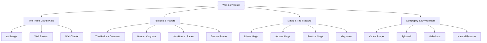

## 2.0 The Three Grand Walls

The defining feature of Vantiel is its massive concentric wall structure, built by the enigmatic figure known only as The Architect. These walls divide human civilization into distinct zones, each with its own culture, challenges, and opportunities.

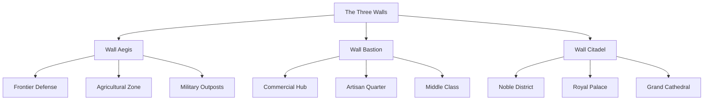

### 2.1 Wall Aegis

The outermost defensive barrier and harsh frontier of human civilization.

**Physical Description:**
- Massive stone wall reinforced with steel and enchantments
- 100 feet tall, 30 feet thick at the base
- Watchtowers every quarter mile
- Fortified gates with multiple checkpoints
- Defensive trenches and spike fields on the exterior

**Key Locations:**
- **Fort Vanguard**: Main military headquarters for frontier defense
- **Aegis Village**: Largest settlement in the agricultural zone
- **Sentinel's Rest**: Trading post and respite for wall patrols
- **Harvest Fields**: Vast farmlands that feed the population
- **Whispering Woods**: Mysterious forest at the edge of settled lands

**Population:**
- Frontier farmers and their families
- Military personnel and wall guards
- Hunters and trappers
- Beastmen refugees serving as trackers and scouts
- Criminals serving exile sentences

**Daily Life:**
- Dawn to dusk labor in fields or on wall patrols
- Constant vigilance against monster attacks
- Community-focused survival with shared resources
- Simple pleasures: harvest festivals, communal meals, storytelling
- Hard but honest living with little luxury

**Challenges:**
- Frequent demon and monster incursions
- Resource scarcity and harsh living conditions
- Distance from medical care and education
- Heavy taxation from inner walls
- Vulnerability to weather and crop failures

### 2.2 Wall Bastion

The middle layer and economic lifeblood of Vantiel.

**Physical Description:**
- Elegant yet formidable wall with decorative elements
- 80 feet tall, 25 feet thick at the base
- Multiple large gates for commerce and transportation
- Bustling markets and plazas along its inner base
- Residential districts built into and against the wall itself

**Key Locations:**
- **Grand Market**: Sprawling commercial center with goods from all regions
- **Artisan's Row**: Street of master craftsmen and their workshops
- **Guild Hall**: Headquarters for the various trade and craft guilds
- **The Crucible**: Industrial district with forges and factories
- **Silk District**: Entertainment and pleasure quarter

**Population:**
- Merchants and traders
- Artisans and craftspeople
- Guild members and apprentices
- Middle-class families
- Entertainers and service workers

**Daily Life:**
- Commerce-driven routine with shops opening at dawn
- Guild politics and trade negotiations
- Apprenticeship training and skill development
- Evening entertainment in taverns and theaters
- Constant networking and social climbing

**Challenges:**
- Cutthroat competition and economic pressure
- Guild restrictions and monopolies
- Social stratification and wealth inequality
- Criminal organizations and black markets
- Corruption in local governance

### 2.3 Wall Citadel

The innermost sanctum of power and opulence.

**Physical Description:**
- Gleaming white stone with gold and silver inlays
- 60 feet tall, 20 feet thick at the base
- Heavily guarded single gate with elaborate security
- Manicured gardens and ornate architecture
- Pristine streets and immaculate public spaces

**Key Locations:**
- **Royal Palace**: Seat of the monarchy and political power
- **Grand Cathedral**: Headquarters of the Radiant Covenant
- **Noble Quarter**: Estates of the aristocratic families
- **Academy Arcanum**: (Secret) Hidden school for controlled magic study
- **Inquisitor's Tower**: Base for the Church's enforcers

**Population:**
- Royal family and court
- Noble houses and their servants
- Church officials and clergy
- Specialized artisans serving the elite
- Scholars and advisors

**Daily Life:**
- Political intrigue and social maneuvering
- Religious ceremonies and obligations
- Luxury and leisure for the privileged
- Strict adherence to etiquette and protocol
- Constant surveillance by Church inquisitors

**Challenges:**
- Deadly political games and power struggles
- Church oversight and control
- Isolation from the realities of common life
- Constant threat of conspiracy and betrayal
- Stifling social expectations and restrictions

## 3.0 Factions & Powers

### 3.1 The Radiant Covenant

The dominant religious and political force in Vantiel, the Radiant Covenant maintains control through divine magic and strict doctrine.

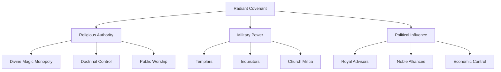

**Core Beliefs:**
- Divine magic is humanity's only salvation
- The Fracture was punishment for arcane hubris
- Only through faith and obedience can humanity survive
- The Covenant alone interprets the will of the gods
- Demons are manifestations of human sin and weakness

**Power Structure:**
- **High Pontiff**: Supreme religious authority
- **Cardinal Council**: Governing body of senior clergy
- **Templar Order**: Military arm of the Church
- **Inquisitorial Branch**: Heresy hunters and enforcers
- **Parish Priests**: Local religious leaders

**Methods of Control:**
- Monopoly on divine magic and healing
- Public executions of heretics and magic users
- Control of education and information
- Economic leverage through tithes and land ownership
- Fear of demonic corruption and invasion

**Hidden Truths:**
- Many high-ranking members practice forbidden magic in secret
- Some noble families have demonic pacts blessed by corrupt clergy
- The Church actively suppresses knowledge of the pre-Fracture world
- Inquisitors use profane magic to hunt other magic users
- The Covenant knows more about The Architect than they admit

### 3.2 Human Kingdom & Nobility

The political structure of human civilization in Vantiel operates under a monarchy heavily influenced by both the Church and noble houses.

**Royal House:**
- **King/Queen**: Nominal ruler of all human lands
- **Royal Court**: Advisors, ministers, and favorites
- **Royal Guard**: Elite protection force
- **Crown Territories**: Lands directly under royal control

**Noble Houses:**
- **Great Houses**: Ancient bloodlines with vast power
  - House Solaris: Masters of diplomacy and intrigue
  - House Ironreach: Controllers of military might
  - House Verdant: Agricultural powerhouse
  - House Silvercoin: Wealth and commerce
  - House Nightshade: Secrets and intelligence

- **Lesser Houses**: Smaller noble families
  - Constantly vying for influence
  - Often aligned with Great Houses
  - Manage smaller territories and resources

**Political Reality:**
- Monarchy is powerful but constrained by Church and nobles
- Great Houses control specific aspects of the kingdom
- Constant power struggles and shifting alliances
- Corruption and demonic influence in some houses
- Commoners have little voice in governance

### 3.3 Non-Human Races

Vantiel is home to several non-human races, each with their own cultures, abilities, and relationships with humanity.

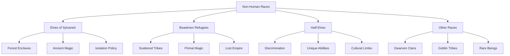

#### 3.3.1 Sylvaneir Elves

After the Fracture, the Elves withdrew to their ancient forest strongholds, blaming humanity for the catastrophe.

**Physical Traits:**
- Tall, slender builds with graceful movements
- Pointed ears and angular features
- Lifespans of 300-500 years
- Natural affinity for magic, especially nature-based
- Enhanced senses, particularly sight and hearing

**Culture:**
- Live in harmony with nature in forest enclaves
- Preserve ancient knowledge and magical traditions
- Governed by councils of elders and archmages
- Value art, knowledge, and magical skill
- Maintain oral histories dating to pre-Fracture times

**Relationship with Humans:**
- Generally isolationist, avoiding human contact
- Trade occasionally through designated intermediaries
- Deeply distrustful of the Radiant Covenant
- Will sometimes aid humans who respect nature
- Actively protect their territories from incursion

#### 3.3.2 Beastmen Refugees

Once rulers of a mighty empire on the continent of Maledictus, the Beastmen were the primary victims of the Fracture and subsequent demonic invasion.

**Types:**
- **Lupirans (Wolffolk)**: Pack-oriented warriors with tracking skills
- **Felidra (Catfolk)**: Agile, independent hunters and scouts
- **Ursans (Bearfolk)**: Powerful, resilient crafters and defenders
- **Avians (Birdfolk)**: Rare, often possessing limited flight and keen vision
- **Other Variants**: Various animal traits manifesting in humanoid forms

**Culture:**
- Tribal structure with strong emphasis on community
- Oral tradition preserving memories of their lost homeland
- Spiritual practices focused on ancestral connection
- Primal magic users, especially shamans and totemic warriors
- Adaptable survival skills from generations of displacement

**Relationship with Humans:**
- Complex and varied by region and tribe
- Many serve in frontier communities as trackers and warriors
- Face discrimination and suspicion, especially in inner walls
- Some tribes maintain hidden settlements in wilderness areas
- Occasional intermarriage with humans (though rare)

#### 3.3.3 Half-Elves

Born of rare unions between humans and elves, half-elves find themselves caught between two worlds, rarely fully accepted by either.

**Physical Traits:**
- Slightly pointed ears and refined features
- Lifespans of 150-200 years
- Some magical affinity, though less than full elves
- Enhanced senses compared to humans
- Often striking appearance that marks them as different

**Social Position:**
- Often serve as intermediaries between humans and elves
- Frequently work as scouts, rangers, or diplomats
- Form tight-knit communities with other half-elves
- Face discrimination in human settlements
- Rarely fully accepted in elven enclaves

**Unique Perspective:**
- Blend of human adaptability and elven connection to nature
- Understanding of both cultures' strengths and weaknesses
- Often develop unique philosophical outlooks
- Many become wanderers, scholars, or adventurers
- Some become advocates for cooperation between races

### 3.4 Demon Forces & Maledictus

The continent of Maledictus, once home to the Beastmen Empire, is now the domain of demons and corrupted beings under the rule of Kael'Tharon, the Demon King.

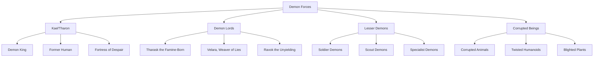

#### 3.4.1 Kael'Tharon, the Demon King

Once a human mage named Kael Asherion, he became the first to breach the veil between worlds, transforming into the Demon King.

**Appearance:**
- Towering figure with obsidian skin
- Crown of twisted horns
- Eyes that burn with otherworldly fire
- Voice that causes physical pain to hear
- Constantly shifting form that defies mortal comprehension

**Powers:**
- Mastery of all forms of magic
- Ability to corrupt and transform living beings
- Control over the very landscape of Maledictus
- Immortality through profane rituals
- Mental domination of lesser demons

**Goals:**
- Expand demonic influence beyond Maledictus
- Corrupt and subvert human civilization
- Discover and claim The Architect's secrets
- Break the power of the Three Walls
- Achieve godhood through mass sacrifice

#### 3.4.2 Demon Lords

Powerful lieutenants who serve Kael'Tharon while pursuing their own ambitions.

**Notable Demon Lords:**
- **Tharask the Famine-Born**: A gluttonous demon whose presence drains life from the land
- **Velara, Weaver of Lies**: A shadowy schemer who infiltrates human societies
- **Ravok the Unyielding**: A relentless warlord who revels in destruction
- **Xul'gath the Plague Father**: A festering entity that spreads disease and corruption
- **Mornath, the Hollow Prince**: A beautiful demon who feeds on dreams and hope

**Dynamics:**
- Constant power struggles between lords
- Each controls a territory within Maledictus
- Compete for Kael'Tharon's favor
- Sometimes work at cross-purposes
- Occasionally infiltrate human lands in disguise

#### 3.4.3 Lesser Demons & Corrupted Beings

The bulk of demonic forces consists of lesser entities and corrupted mortal beings.

**Types:**
- **Soldier Demons**: Combat-focused entities created for war
- **Scout Demons**: Stealthy infiltrators and spies
- **Specialist Demons**: Entities with unique abilities (possession, corruption, etc.)
- **Corrupted Animals**: Beasts twisted by demonic influence
- **Blighted Plants**: Vegetation mutated into dangerous forms
- **Twisted Humanoids**: Humans and Beastmen warped by demonic power

**Threat Level:**
- Constant raids against Wall Aegis
- Infiltration attempts into human settlements
- Corruption of land and resources
- Spread of blighted zones near the wall
- Occasional large-scale invasion attempts

## 4.0 Magic & The Fracture

### 4.1 The Fracture Event

The defining catastrophe in Vantiel's history, the Fracture forever changed the world and its relationship with magic.

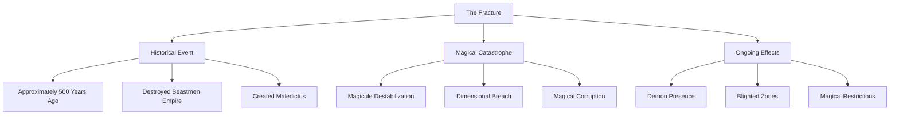

**What Happened:**
- Massive magical experiment gone wrong
- Destabilized the fundamental particles of magic (magicules)
- Tore open a breach between dimensions
- Allowed demons to enter the world
- Transformed the continent of Maledictus

**Official Narrative (Covenant):**
- Punishment from the gods for magical hubris
- Result of arcane magic practitioners' arrogance
- Divine warning against forbidden knowledge
- Salvation came only through faith and the Three Walls
- Only divine magic can protect humanity

**Hidden Truth:**
- Involved multiple factions including early Covenant
- Connected to The Architect's mysterious origins
- May have been partially intentional
- Created the Three Walls as containment, not just protection
- Left magical "scars" that still affect the world

**Ongoing Consequences:**
- Continued demonic presence and corruption
- Unstable magical conditions in many areas
- Fear and suppression of arcane magic
- Rise of the Radiant Covenant's power
- Cultural trauma that shapes society

### 4.2 Magic Systems

Magic in Vantiel is divided into three distinct categories, each with its own source, practitioners, and societal implications.

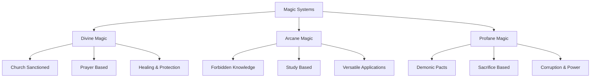

#### 4.2.1 Divine Magic

Magic granted through devotion and prayer, strictly regulated by the Radiant Covenant.

**Source:** The gods worshipped under the Covenant, channeled through prayer and faith.

**Practitioners:** Priests, priestesses, templars, and inquisitors trained by the Church.

**Characteristics:**
- Requires genuine faith and devotion
- Structured through rituals and prayers
- Strongest in healing and protection
- Visible as pure, radiant energy
- Requires Church authorization to practice legally

**Common Applications:**
- Healing wounds and curing diseases
- Creating protective barriers and wards
- Blessing crops, weapons, or buildings
- Detecting lies or demonic influence
- Purifying corrupted areas or objects

**Limitations:**
- Must adhere to strict Church doctrine
- Requires formal training and certification
- Power limited by practitioner's faith
- Cannot directly harm living beings (in theory)
- Ineffective against certain ancient or profane forces

#### 4.2.2 Arcane Magic

A forbidden art outside the Church's control, derived from the natural forces of the world or remnants of ancient knowledge.

**Source:** Study of the natural world, celestial phenomena, or magical artifacts.

**Practitioners:** Independent mages, scholars, and rogue magic users.

**Characteristics:**
- Requires study, practice, and innate talent
- Based on understanding magical principles
- Versatile with many possible applications
- Manifests in various colors and forms
- Practiced in secret to avoid persecution

**Common Applications:**
- Manipulating elements (fire, water, etc.)
- Enhancing physical objects or abilities
- Creating illusions or altering perceptions
- Telekinesis and force manipulation
- Divination and scrying

**Limitations:**
- Requires extensive study and practice
- Risk of magical backlash if improperly used
- Practitioners face execution if discovered
- Limited by caster's knowledge and power
- Certain effects require rare components

#### 4.2.3 Profane Magic

Magic stemming from forbidden pacts, corrupted artifacts, or demonic influences.

**Source:** Deals with demons, cursed relics, or the tapping of corrupted ley lines.

**Practitioners:** Warlocks, cultists, or those desperate enough to seek forbidden power.

**Characteristics:**
- Requires sacrifice or bargains with dark entities
- Quick path to power with terrible costs
- Corrupts the user over time
- Manifests as dark, twisted energy
- Leaves visible marks on frequent users

**Common Applications:**
- Corrupting living beings or environments
- Summoning entities from beyond
- Inflicting curses or diseases
- Necromancy and death magic
- Mind control and domination

**Limitations:**
- Corrupts the user physically and mentally
- Often requires blood sacrifice or worse
- Demons may claim the user's soul eventually
- Addiction-like dependence develops
- Detectable by divine magic practitioners

### 4.3 Magicules & Magical Theory

The fundamental particles of magic, magicules permeate all life and matter in Vantiel.

**Properties:**
- Invisible to normal sight, visible to those with magical sensitivity
- React to emotional states and intentions
- Can be concentrated or dispersed by various means
- Exist in different "frequencies" or types
- Destabilized during the Fracture

**Racial Interactions:**
- **Humans:** Average magicule sensitivity and capacity
- **Elves:** High sensitivity, natural harmony with magicules
- **Beastmen:** Extraordinary mana reserves, intuitive usage
- **Half-Elves:** Enhanced sensitivity, unique manipulation abilities

**Magical Phenomena:**
- **Mana Zones:** Areas with unusually high or low magicule concentration
- **Ley Lines:** Natural channels of flowing magical energy
- **Mana Storms:** Dangerous concentrations of unstable magicules
- **Magical Mutations:** Living beings altered by unusual magicule exposure
- **Enchanted Materials:** Objects naturally infused with magical properties

**Thread Theory:**
An ancient, largely lost magical theory that views reality as composed of interwoven "threads":

- **Material Threads:** The tangible, physical fabric of existence
- **Ethereal Threads:** The magical essence that imbues the world
- **Vital Threads:** The life force binding souls to bodies
- **Void Threads:** The enigmatic threads connecting space and time

Thread-Sight, a rare ability, allows perception and manipulation of these fundamental threads.

## 5.0 Geography & Environment

### 5.1 Vantiel Proper

The main continent where human civilization is centered, protected by the Three Walls.

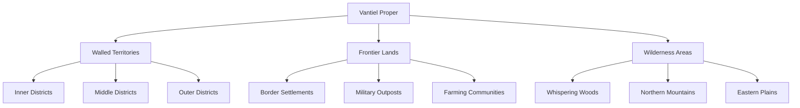

**Major Regions:**
- **Walled Territories:** The heart of human civilization
- **Frontier Lands:** Settled areas outside or near Wall Aegis
- **Northern Mountains:** Mineral-rich, harsh terrain with scattered outposts
- **Eastern Plains:** Vast grasslands used primarily for agriculture
- **Southern Coast:** Trading ports and fishing villages

**Notable Features:**
- **River Lifeblood:** Main waterway flowing through all three walls
- **Crown Lake:** Massive freshwater lake near the capital
- **Whispering Woods:** Ancient forest with mysterious properties
- **Sentinel Peaks:** Mountain range that forms a natural northern border
- **Blighted Zones:** Areas corrupted by demonic influence or magical accidents

**Climate:**
- Temperate with four distinct seasons
- Harsh winters, especially in northern regions
- Summer droughts common in eastern plains
- Frequent storms along the southern coast
- Magical weather phenomena in some regions

### 5.2 Sylvaneir

The vast forest realm of the Elves, located west of human territories.

**Physical Characteristics:**
- Ancient forest with trees of impossible size
- Magical flora and fauna throughout
- Hidden elven cities built into and around massive trees
- Natural and magical defenses against intruders
- Pristine lakes and rivers with healing properties

**Key Locations:**
- **Silverleaf City:** Largest elven settlement and seat of governance
- **Grove of Whispers:** Sacred site where elven elders commune with nature
- **Moonwell:** Magical pool with prophetic and healing powers
- **Boundary Stones:** Ancient markers that define elven territory
- **Watcher's Spire:** Observation post monitoring human lands

**Relationship to Vantiel:**
- Officially neutral but wary of human expansion
- Limited trade through designated border markets
- Occasional diplomatic missions to human courts
- Active defense against any incursion
- Secret alliances with certain human factions

### 5.3 Maledictus

The demon-controlled continent across the sea, once home to the Beastmen Empire.

**Current State:**
- Blighted landscape with toxic environments
- Corrupted flora and fauna throughout
- Ruins of the once-great Beastmen civilization
- Demonic fortresses and corrupted cities
- Unstable magical conditions and phenomena

**Key Locations:**
- **Throne of Despair:** Kael'Tharon's fortress built on ancient ruins
- **The Scar:** Massive crater where the Fracture originated
- **Corruption Sea:** Once-blue waters now toxic and filled with horrors
- **Howling Wastes:** Barren plains where Beastmen cities once stood
- **Forbidden Archives:** Hidden repositories of pre-Fracture knowledge

**Threat Level:**
- Source of constant demonic incursions
- Launching point for major invasion attempts
- Origin of corrupting influence that creates blighted zones
- Home to powerful artifacts and dangerous knowledge
- Occasional expeditions from Vantiel seek resources or information

### 5.4 Natural Resources & Ecosystems

The world of Vantiel features diverse ecosystems and valuable resources that shape civilization.

**Key Resources:**
- **Ironwood:** Exceptionally strong wood from ancient forests
- **Starmetal:** Rare metal with natural magical properties
- **Heartstone:** Crystal that resonates with emotional energy
- **Voidsilk:** Material produced by rare creatures, lightweight but strong
- **Mana Crystals:** Naturally occurring concentrations of magical energy

**Unique Flora:**
- **Sunbloom:** Flower with powerful healing properties
- **Whisperleaf:** Plant that absorbs and stores sounds
- **Ironroot:** Tree with roots hard as metal, used in construction
- **Dreamfruit:** Rare fruit that induces prophetic visions
- **Bloodvine:** Carnivorous plant that grows in blighted areas

**Unique Fauna:**
- **Skywhales:** Massive creatures that float through the air
- **Shadowcats:** Felines that can partially phase into shadow
- **Ironhide Boars:** Beasts with naturally armored skin
- **Crystalwings:** Butterfly-like insects that shed magical dust
- **Deepwyrms:** Massive burrowing creatures that create cave systems

**Ecosystem Dynamics:**
- Seasonal migrations of magical creatures
- Mana fluctuations affecting plant growth and animal behavior
- Symbiotic relationships between certain species
- Corruption spread from blighted zones
- Adaptive evolution in response to magical conditions

## 6.0 Daily Life & Culture

### 6.1 Social Structure & Hierarchy

Vantiel's society is strictly stratified, with clear divisions between classes and walls.

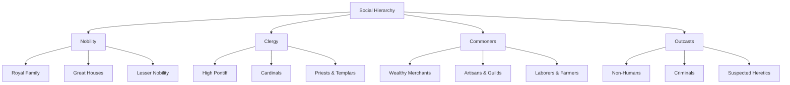

**Class Mobility:**
- Extremely limited upward mobility
- Marriage into higher classes rare but possible
- Exceptional service sometimes rewarded with advancement
- Guild membership can elevate status slightly
- Church service offers one of few paths to advancement

**Legal Rights by Class:**
- **Nobility:** Extensive privileges, separate legal system
- **Clergy:** Church law supersedes civil law
- **Merchants:** Rights proportional to wealth and guild status
- **Commoners:** Basic rights, subject to noble jurisdiction
- **Non-Humans:** Limited rights, especially in inner walls

**Cultural Attitudes:**
- Strong belief in "natural order" of society
- Religious justification for class divisions
- Emphasis on knowing one's place
- Respect for authority and tradition
- Suspicion of those who rise too quickly

### 6.2 Economy & Trade

The economic systems of Vantiel vary by region and wall level.

**Currency:**
- **Gold Crowns:** Highest value, used mainly by nobility
- **Silver Marks:** Standard currency for merchants and guilds
- **Copper Pennies:** Common currency for everyday transactions
- **Trade Tokens:** Guild-specific currency for internal transactions
- **Barter:** Common in frontier regions and among non-humans

**Major Industries:**
- **Agriculture:** Primary industry in outer regions
- **Mining:** Concentrated in northern mountains
- **Crafting:** Centered in Wall Bastion
- **Fishing:** Important along southern coast
- **Lumber:** Carefully managed to avoid elven conflict

**Trade Routes:**
- **River Lifeblood:** Main trade artery through all walls
- **Coastal Route:** Maritime trade along southern shores
- **Northern Road:** Connects to mountain mining operations
- **Forest Exchange:** Limited trade with elven territories
- **Frontier Markets:** Trading posts near Wall Aegis

**Economic Challenges:**
- Heavy taxation by nobility and Church
- Guild monopolies restricting competition
- Resource scarcity in certain regions
- Corruption and black markets
- Disruption from monster attacks and blighted zones

### 6.3 Religion & Festivals

The Radiant Covenant dominates religious life, with its practices woven into daily existence.

**Major Religious Observances:**
- **Dawn Prayer:** Daily ritual at sunrise
- **Covenant Day:** Weekly gathering at local churches
- **Purification Moon:** Monthly cleansing rituals
- **Salvation Festival:** Annual celebration of the Three Walls' creation
- **Remembrance Day:** Solemn observance of the Fracture

**Seasonal Festivals:**
- **Spring Planting:** Blessing of fields and seeds
- **Summer Solstice:** Celebration of light's triumph
- **Harvest Home:** Thanksgiving for crops
- **Winter Vigil:** Communal protection against darkness

**Folk Practices:**
- Protective charms and wards against demons
- Household shrines for daily prayer
- Coming-of-age ceremonies at local churches
- Funeral rites to prevent undead transformation
- Marriage ceremonies requiring Church blessing

**Religious Dissent:**
- Underground worship of old nature deities
- Secret arcane practitioners and scholars
- Philosophical movements questioning Church doctrine
- Syncretic practices blending official and folk beliefs
- Heretical cults with varying dangerous beliefs

### 6.4 Arts & Entertainment

Cultural expressions vary widely across the walls and social classes of Vantiel.

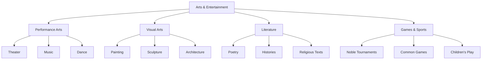

**Performance Arts:**
- **Theater:** Morality plays and historical dramas in Wall Bastion
- **Minstrelsy:** Traveling performers bringing news and entertainment
- **Sacred Choirs:** Religious music in cathedrals and churches
- **Folk Music:** Traditional songs and dances in rural communities
- **Court Performances:** Elaborate entertainment for nobility

**Visual Arts:**
- **Religious Iconography:** Church-sanctioned art depicting divine figures
- **Tapestries:** Historical and mythological scenes woven into fabric
- **Illuminated Manuscripts:** Decorated religious and scholarly texts
- **Folk Crafts:** Practical items with decorative elements
- **Architecture:** Distinct styles for each wall and social class

**Literature:**
- **Church Texts:** Religious doctrine and approved histories
- **Noble Chronicles:** Records of great houses and their deeds
- **Guild Manuals:** Technical knowledge and trade secrets
- **Folk Tales:** Oral traditions passed through generations
- **Forbidden Texts:** Pre-Fracture knowledge and arcane writings

**Games & Sports:**
- **Tournaments:** Martial competitions for knights and nobles
- **Strategy Games:** Chess-like games simulating warfare
- **Dice & Cards:** Gambling games popular in taverns
- **Children's Games:** Tag, hide-and-seek, and simple ball games
- **Seasonal Competitions:** Contests of strength and skill during festivals

### 6.5 Education & Knowledge

The acquisition and control of knowledge is a key aspect of Vantiel's power structures.

**Educational Institutions:**
- **Church Schools:** Basic literacy and religious instruction
- **Guild Apprenticeships:** Practical training in crafts and trades
- **Noble Tutors:** Private education for aristocratic children
- **Military Academies:** Training for officers and elite soldiers
- **Secret Arcane Circles:** Hidden groups studying forbidden knowledge

**Available Knowledge:**
- **Religious Doctrine:** Widely taught and accessible
- **Practical Skills:** Transmitted through apprenticeship
- **History:** Carefully curated by Church and nobility
- **Natural Philosophy:** Limited to approved scholars
- **Magic Theory:** Heavily restricted and often persecuted

**Literacy Rates:**
- **Nobility:** Nearly universal literacy
- **Clergy:** Complete literacy required
- **Merchants/Artisans:** Functional literacy common
- **Common Folk:** Minimal literacy (10-20%)
- **Frontier Regions:** Almost no literacy except officials

**Knowledge Restrictions:**
- Pre-Fracture history heavily censored
- Arcane texts destroyed when discovered
- Foreign ideas carefully screened by Church
- Scientific inquiry limited to approved fields
- Magical knowledge punishable by death

## 7.0 The Architect & World Origins

### 7.1 The Mysterious Architect

The enigmatic figure responsible for the Three Walls and much of Vantiel's current structure.

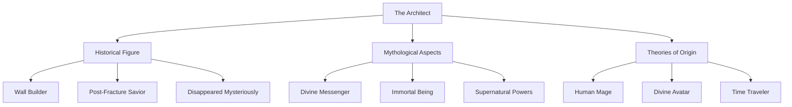

**Official History:**
- Appeared shortly after the Fracture
- Designed and oversaw construction of the Three Walls
- United surviving humans under a single banner
- Established the foundations of current society
- Disappeared after completing the walls

**Church Narrative:**
- Sent by the gods to save humanity
- Divine wisdom guided the wall design
- Left to allow humans to prove their worth
- Will return when humanity is truly worthy
- Teachings form the basis of Church doctrine

**Alternative Theories:**
- Actually caused the Fracture, walls built as penance
- From another world or dimension entirely
- Still alive and watching from the shadows
- Multiple individuals using the same identity
- Connected to pre-Fracture magical experiments

**Physical Descriptions:**
- Always depicted wearing an ornate mask
- Tall figure in flowing robes
- Voice described as "resonating with power"
- Left no personal possessions or writings
- No confirmed images or statues from life

### 7.2 Creation Myths & Cosmology

The beliefs about how the world began and its place in the cosmos.

**Church Cosmology:**
- World created by the Divine Light
- Humans given stewardship over creation
- Other races created as helpers or tests
- Stars are windows to the divine realm
- The void between worlds contains demons

**Pre-Fracture Knowledge:**
- Suggests a more scientific understanding
- References to multiple worlds or planes
- Theories about natural formation of the world
- Astronomical observations and calculations
- Suppressed by current religious authorities

**Competing Beliefs:**
- Elven tradition of world growing from a cosmic tree
- Beastmen belief in world formed from primordial hunt
- Fringe cults worshipping the void itself
- Philosophical schools questioning all creation myths
- Ancient ruins suggesting advanced prior civilizations

### 7.3 The Architect System

The metaphysical framework that allows for world customization and alteration.

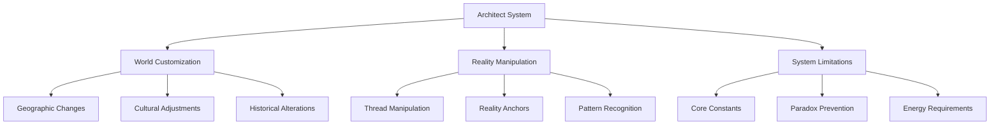

**Fundamental Principles:**
- Reality composed of interwoven "threads" of existence
- Certain individuals can perceive and manipulate these threads
- The Architect had mastery of this ability
- Changes ripple outward, affecting connected elements
- System maintains internal consistency automatically

**Customization Capabilities:**
- **Geographic:** Mountains, rivers, forests, climate
- **Cultural:** Societies, traditions, languages, religions
- **Political:** Nations, factions, alliances, conflicts
- **Magical:** Energy types, magical creatures, spell systems
- **Historical:** Past events, historical figures, ancient ruins

**System Limitations:**
- Cannot violate core world principles
- Changes require energy proportional to scale
- Paradoxes automatically resolved or prevented
- Some elements resist change more than others
- Alterations leave detectable "seams" to trained observers

**Player Interaction:**
- Rare individuals (like the player) can access limited aspects
- Thread-Sight allows perception of the underlying structure
- Architect Relics enhance manipulation capabilities
- Knowledge of the system is actively suppressed
- Mastery requires both innate talent and extensive study

## 8.0 Player Experience in Vantiel

### 8.1 Arrival & Integration

How newcomers (including the player) enter and adapt to the world of Vantiel.

**Common Arrival Methods:**
- Reincarnation from Earth (player's typical path)
- Summoning by magical ritual or accident
- Dimensional travel through rare portals
- Awakening with amnesia and mysterious powers
- Birth with memories of another life or world

**Initial Challenges:**
- Understanding unfamiliar social structures
- Learning to navigate the Three Walls system
- Dealing with suspicion toward outsiders
- Adapting to magical phenomena and dangers
- Finding a place in the rigid social hierarchy

**Integration Paths:**
- **Adventurer:** Taking odd jobs and dangerous missions
- **Guild Member:** Joining a trade or craft organization
- **Church Acolyte:** Entering religious service
- **Frontier Settler:** Living in the dangerous outlands
- **Noble Servant:** Working for a powerful family

**Special Abilities:**
- Thread-Sight (rare perception ability)
- Earth knowledge (science, history, technology)
- Resistance to certain magical effects
- Unusual learning capacity or adaptability
- Potential to use multiple magic systems

### 8.2 Unique Player Opportunities

Special activities and roles available to the player in Vantiel.

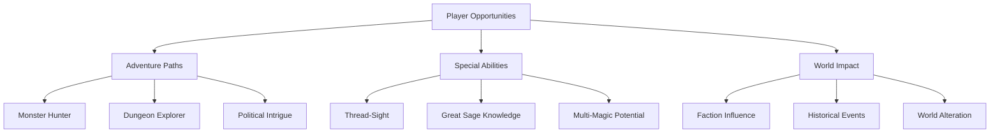

**Adventure Types:**
- **Monster Hunting:** Tracking and eliminating threats
- **Dungeon Exploration:** Investigating ruins and magical sites
- **Political Intrigue:** Navigating faction conflicts
- **Trade Expeditions:** Securing resources from dangerous areas
- **Rescue Missions:** Saving those in peril from various threats

**Unique Player Roles:**
- **Thread-Seer:** Using rare perception abilities
- **Otherworlder:** Applying Earth knowledge to problems
- **Faction Mediator:** Bridging divides between groups
- **Lost Knowledge Seeker:** Recovering pre-Fracture wisdom
- **Demon Hunter:** Specializing in combating corruption

**World-Changing Potential:**
- Influencing faction relationships and power
- Discovering and sharing forbidden knowledge
- Altering the course of historical events
- Uncovering the truth about The Architect
- Potentially reshaping aspects of reality itself

### 8.3 Challenges & Threats

The dangers and obstacles that make Vantiel a challenging world to navigate.

**Environmental Hazards:**
- Blighted zones with corrupting influence
- Magical anomalies and unstable areas
- Harsh weather and natural disasters
- Resource scarcity in certain regions
- Dangerous flora and fauna

**Social Challenges:**
- Navigating complex social hierarchies
- Religious persecution of unorthodox beliefs
- Discrimination against non-humans and outsiders
- Corruption and exploitation by the powerful
- Conflicting loyalties and obligations

**Major Threats:**
- **Demonic Invasion:** Constant pressure from Maledictus
- **Church Inquisition:** Hunting those with forbidden abilities
- **Noble Conspiracies:** Power plays that endanger many
- **Magical Catastrophes:** Unstable magic causing disasters
- **Ancient Awakening:** Pre-Fracture entities returning

**Personal Struggles:**
- Maintaining identity and values in a harsh world
- Balancing power acquisition with moral principles
- Finding trustworthy allies and companions
- Dealing with the psychological impact of violence
- Choosing between personal goals and greater good

## 9.0 The Summoned Hero

### 9.01 The Summoning Ritual
The Radiant Covenant guards one of the greatest secrets in Vantiel: the ability to invoke a grand summoning that seeks out a hero from beyond. This solemn ceremony is performed only in times of dire crisis—an event so momentous that all three walls ring with prayer and preparation for weeks in advance.

• Duration & Location: Conducted over three continuous days within the Grand Cathedral’s underground chamber. Over a hundred priests participate, led by the Divine Matriarch and the Council of Light.
• Required Components: Seven rare crystals from beyond Wall Aegis, sacred waters from Sylvaneir, and meticulously guarded tomes from Covenant vaults.
• The Event: A pillar of blinding light erupts from the cathedral, culminating in a thunderous sound heard for miles. Magical energies temporarily surge and then wane, often weakening divine magic in the region for several days.
• Aftermath: The summoned hero appears in the center of the ritual circle, often disoriented. The public learns swiftly, triggering celebrations in many districts and speculation within the Covenant’s hierarchy.

### 9.02 The Legendary Hero
Summoned by the Radiant Covenant, this champion stands apart from typical inhabitants of Vantiel. Though each summoning can yield different individuals, the current hero—Kaelen Brightstar—arrived to immense fanfare:

• Origin & Appearance: Hailing from medieval Earth, bearing sandy blonde hair and a faintly glowing birthmark on his right palm.
• Personality: Charismatic yet reserved, he grapples with the weight of expectation. Torn by the trauma of being pulled from his world, he seeks to do what’s right for Vantiel.
• Unique Abilities:
   – Divine Blessing: Weakens nearby demonic entities.
   – Enhanced Physicality: Strength, speed, and reflexes beyond normal human limits.
   – Multi-Magic Affinity: Can dabble in divine, arcane, and even profane magic, albeit at a limited level.
   – Wound Transfer: Absorbs injuries from allies at personal cost.
• Backstory: Kaelen was locked in mortal combat defending his Earthly village from raiders when torn through the veil. Reluctant to accept the Covenant’s overt praise, he fights to protect innocents while preserving his sense of self in an unfamiliar world.

### 9.03 The Hero’s Companions
Kaelen seldom travels alone. In time, a band of elite companions forms around him, each with distinct motivations:

• Lyra Silvershade (Half-Elven Scout): Stealthy ranged specialist from the Sylvaneir border, bridging elven-human tensions.
• Tormund Ironheart (Human Warrior-Smith): Former Bastion blacksmith, turning his forge and muscle to demon hunting.
• Sethir Walker (Lupiran Beastman): An exiled wolffolk tracker, seeking redemption for wrongs in his homeland.
• Maelis Thornheart (Human Ex-Inquisitor): A repentant Covenant inquisitor with potent divine magic, hoping to reform the Church from the outside.
• Varik Teth (Human Merchant-Spy): Streetwise and charming, he leverages contacts across all three walls for intel.

### 9.04 Public Reaction & Cultural Impact
• Celebrations & Rumors: Word of the summoning spreads like wildfire, leading to impromptu festivities and gossip about Kaelen’s origins and powers.
• Covenant Politics: Power struggles emerge among the Church’s leadership regarding how best to employ—or restrain—Kaelen’s influence.
• Noble Maneuvering: Great Houses compete for the hero’s favor, while some suspect his presence may destabilize their carefully built alliances.
• Tales & Ballads: Minstrels craft epic songs about Kaelen and his companions. Children reenact their adventures in the streets, and taverns proudly claim “The Hero’s Party Stayed Here.”

### 9.05 Missions & Adventures
• Demon Hunts & Rescue Ops: The hero’s party frequently ventures beyond Aegis to stop demonic incursions and rescue trapped villagers.
• Artifact Quests: They retrieve relics from ancient ruins, contending with leftover wards from the Fracture era.
• Diplomacy & Alliance: Called upon to negotiate treaties or alliances, bridging diverse factions (elves, beastmen, frontier homesteads).
• Player Encounters: The player might hear tall tales of Kaelen’s bravery, meet the party mid-mission, or even join forces temporarily—leading to dynamic possibilities for collaboration or rivalry.

### 9.06 Timeline Flexibility
This grand summoning can occur before or after the player’s own arrival in Vantiel. If it happens first, Kaelen already has a reputation and track record the player hears about. If it takes place later, the player may witness the spectacle firsthand, shaping how they view both the Radiant Covenant and the summoned champion.

# 🛡️ Refining Kaelen Brightstar as a Background NPC with Dynamic Presence
Since our goal is to have **Kaelen exist as a background NPC**, someone the players can **hear about, cross paths with, or even indirectly interact with**, we need to focus on **organic world integration** rather than direct narrative involvement.

Here’s how to ensure he feels **real**, without overshadowing the player’s journey:

---

## 📜 How to Make Kaelen a “Living Legend”
Kaelen’s presence in the world should be **felt**, even if he’s not actively on-screen. This means:
✔ **People Talk About Him** – Rumors, bards, and common folk reference his deeds. Common people tend to idolize him as a savior.
✔ **His Actions Shape the World** – His victories or failures cause **ripple effects** the players experience.
✔ **He’s Always Moving** – He has a clear path, traveling across Vantiel, making it **plausible for players to run into him by chance**.
✔ **He’s Not Perfect** – The world doesn’t **worship** him; some people dislike or distrust him.  Sometimes, he may even be a downright nasty individual.  If his power goes to his head.

---

## 📣 1. Rumors & Worldbuilding Hints
Even before the players meet Kaelen, they should **know of him** through **organic storytelling**.

### 👂 Example Rumors & Conversations
**🛡️ Tavern Patrons (Drunk Adventurer):**
*"Pah! That so-called ‘Legendary Hero’—Kaelen Brightstar, they call him. Yeah, he’s strong, but strength alone don’t win wars. Bet he doesn’t last five years!"*

**📖 Scholar or Priest (Radiant Covenant Follower):**
*"Ah, Kaelen Brightstar? A gift from the heavens. He has been blessed, yet he resists our guidance. I fear the weight of his burden may break him..."*

**🏹 A Mercenary Group (Discussing a Job):**
*"We were supposed to intercept a demon caravan near the Ashen Wastes—turns out Brightstar and his team hit it first! By the time we got there, nothing but burnt corpses and severed heads."*

**💰 A Greedy Merchant:**
*"I tell you, any blade Kaelen has wielded? Worth its weight in gold. If I could get my hands on even a scrap of his armor, I’d be rich."*

**⚖️ A Political Figure (Secret Meeting):**
*"The Covenant wants him in their pocket. The Guild wants his favor. The Kingdom wants to control him. And what does Brightstar want? Tch. A hero with no army is just another fool with a sword."*

These types of **small details** help **players piece together** who Kaelen is **without needing direct interaction**.

---

## 🏰 2. His Actions Change the World
Kaelen isn’t just a name—his **deeds should impact** what the players see around them.

### 📍 Examples of His Influence
- **Ruined Battlefields** – The players might **come across a battlefield** with **demon corpses**, arrows in the ground, and **heroic banners torn and bloodied**—evidence of **Kaelen’s past fight**.
- **Destroyed Demon Fortresses** – A region the players wanted to **clear out** might already be **liberated**, with **villagers praising a mysterious warrior** who saved them.
- **Faction Tensions Rise** – The **Radiant Covenant demands loyalty from all "true warriors,"** causing tension in adventurer circles—perhaps because of **Kaelen’s refusal to submit**.
- **Increased Monster Activity** – Because **Kaelen is hunting high-level demons**, **lesser monsters are displaced**, **attacking trade routes more aggressively**.
- **A Town Saved** – The players arrive in a village that was **almost wiped out**—but a **lone swordsman held off the attackers** long enough for reinforcements to arrive.

Everything he does should **shape the player’s world**, but without making him the "main character."

---

## 🎲 3. Randomized Chance Encounters
Kaelen should **not** be an easy character to track down—he’s **always moving**, meaning players might **run into him unexpectedly**.

### 📌 Locations He Might Be Found
- **Taverns or Waystations** – Drinking **alone or speaking in hushed tones** with trusted allies.
- **On the Road** – Passing by the players, **exchanging a few words before moving on**.
- **At a Battlefield** – The **aftermath of one of his battles**, **looting demon corpses for clues**.
- **Arguing with the Radiant Covenant** – A heated **philosophical** or **political debate** in a temple or guild hall.
- **Helping a Town Rebuild** – Using his **own hands** to repair homes, despite being a hero.
- **A Dungeon or Ruins** – **Investigating** a prophecy or ancient artifact.

> **🎭 Example Encounter #1: Unplanned Meeting**
> - The players **enter a ruined town**.
> - A **lone man is sitting on a broken statue**, **cleaning blood from his sword**.
> - If the players **approach**, he simply nods, **offering no words** unless spoken to.
> - If **left alone**, he eventually **vanishes into the night**.

> **⚔️ Example Encounter #2: Indirect Influence**
> - Players **fight a demon warband**.
> - Mid-fight, a **stray lightning bolt crashes into the battlefield**—not from a storm, but **from a battle happening miles away**.
> - If the players **investigate**, they might find a **dying demon whispering** Kaelen’s name.

These **rare but memorable** encounters make Kaelen **feel alive without forcing** interaction.

---

## ⚖️ 4. Balancing His Role
To **avoid overshadowing the players**, we should ensure that:
1. **Kaelen is not always present** – The players **can’t depend on him**; he’s a **force of nature, not a guide**.
2. **He does not solve problems for them** – Even if he wins battles, there are **consequences** (e.g., he slays a demon, but leaves a power vacuum).
3. **Players can surpass him** – If the players grow powerful enough, **his legend shifts**—perhaps **he acknowledges them** or **steps aside**, or perrhaps, tries to **eliminate** the player because he sees them as a threat (only if the hero is chaotic evil).

---

## 🏆 5. Optional Side Content: Player Influence on Kaelen’s Legend
If you want Kaelen’s **legacy to shift based on the players**, here are **possible "hidden counters"**:

### 🛡️ Option 1: The Players Steal His Glory
- If the players **claim his victories**, people start to **doubt his legend**.
- The Covenant **seeks to replace him** with the player.
- Kaelen **goes into self-exile**, doubting himself.

### ⚔️ Option 2: The Players Become His Shadow
- If the players **constantly arrive AFTER him**, they become **known as “Brightstar’s Chasers”**.
- Some **people mock them** for "always being behind the hero."

### 👑 Option 3: The Players Directly Influence His Fate
- If they **speak against him** in key locations, people begin **questioning him**.
- If they **help him indirectly**, Kaelen might **leave them secret rewards** without revealing himself.

---

## 🎭 Final Verdict: Perfect Background Integration
✔ **Kaelen exists as a legend** – He has impact **without dominating the story**.
✔ **Players experience his legacy organically** – Through **rumors, events, and traces of his battles**.
✔ **He is unpredictable** – Making **chance encounters meaningful**.
✔ **His presence evolves** – Based on **the players' actions**.

> **Next Step:** Do you want Kaelen to have a **hidden weakness or final fate** the players could uncover, or do you prefer to leave his future unknown? 🔥

### 9.1 Timeline of Major Events

**Pre-Fracture Era:**
- **~1000 Years Ago:** Height of the Beastmen Empire
- **~800 Years Ago:** First human-elven alliance formed
- **~700 Years Ago:** Discovery of advanced magical principles
- **~600 Years Ago:** Beginning of magical experimentation crisis
- **~500 Years Ago:** The Fracture Event

**Post-Fracture Era:**
- **Year 0:** The Fracture occurs
- **Years 1-10:** Chaos and survival period
- **Year 12:** First appearance of The Architect
- **Years 15-50:** Construction of the Three Walls
- **Year 51:** Founding of the Radiant Covenant
- **Year 100:** Completion of Wall Citadel
- **Year 101:** Mysterious disappearance of The Architect
- **Year 150:** First major demon invasion repelled
- **Year 200:** Establishment of current royal dynasty
- **Year 300:** Great Purge of arcane practitioners
- **Year 400:** Discovery of Thread Theory (subsequently suppressed)
- **Year 450:** Present day

### 9.2 Glossary of Terms

**Architectural Terms:**
- **The Three Walls:** Aegis, Bastion, and Citadel
- **Lifeblood River:** Main waterway through all walls
- **The Architect:** Mysterious creator of the walls

**Magical Terms:**
- **Magicules:** Fundamental particles of magic
- **The Fracture:** World-changing magical catastrophe
- **Thread-Sight:** Rare ability to perceive reality's structure
- **Ley Lines:** Natural channels of magical energy

**Political Terms:**
- **Radiant Covenant:** Dominant religious organization
- **Great Houses:** Five major noble families
- **High Pontiff:** Supreme religious authority
- **Inquisitors:** Church enforcers hunting heretics

**Cultural Terms:**
- **Salvation Festival:** Celebration of the walls' creation
- **Remembrance Day:** Commemoration of the Fracture
- **Thread Theory:** Forbidden understanding of reality
- **Wall Citizenship:** Legal status within specific walls

### 9.3 Notable NPCs

**Political Figures:**
- **King Aldric Solaris:** Current ruler, intelligent but cautious
- **High Pontiff Ezekiel:** Ruthless leader of the Radiant Covenant
- **Lord Commander Thorne:** Head of Wall Aegis defenses
- **Guildmaster Verity:** Leader of the Artisan's Guild

**Potential Allies:**
- **Elara Silverleaf:** Half-elven scout with connections to Sylvaneir
- **Master Thaddeus:** Elderly blacksmith with secret arcane knowledge
- **Captain Rowan:** Frontier guard sympathetic to outsiders
- **Scholar Lydia:** Church archivist questioning official doctrine

**Antagonists:**
- **Inquisitor Malachai:** Zealous hunter of heretics
- **Duke Corvus Nightshade:** Noble with demonic connections
- **Velara, Weaver of Lies:** Demon lord infiltrating human society
- **The Masked Circle:** Cult seeking to cause a second Fracture

This comprehensive guide to the world of Vantiel provides the foundation for rich storytelling, character development, and player agency. The world is designed to be both internally consistent and flexible enough to accommodate a wide range of player choices and narrative directions.
